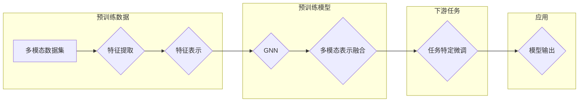

> SimMIM, 预训练, 图神经网络, 多模态信息融合, 图表示学习, 任务特定微调

## 1. 背景介绍

随着人工智能技术的不断发展，多模态信息融合已成为推动计算机视觉、自然语言处理等领域进展的关键技术。SimMIM（Simultaneous Multi-modal MIMicking）作为一种新兴的多模态预训练方法，通过模仿人类的视觉和语言理解机制，实现了视觉和语言信息的有效融合。本文将深入探讨SimMIM的原理、实现方法和应用场景，并通过代码实例进行详细讲解。

## 2. 核心概念与联系

### 2.1 核心概念

- **预训练**：在大量无标签数据上进行训练，学习通用的特征表示，为下游任务提供初始化参数。
- **图神经网络（GNN）**：一种在图结构上进行节点和边交互的神经网络，适用于处理图数据。
- **多模态信息融合**：将不同模态的信息（如图像、文本、音频等）进行整合，以增强模型对复杂数据的理解和处理能力。
- **图表示学习**：学习节点和边的表示，使其能够表示图结构中的信息。

### 2.2 架构流程图



## 3. 核心算法原理 & 具体操作步骤

### 3.1 算法原理概述

SimMIM通过以下步骤实现多模态信息融合：

1. 使用图像和文本数据对GNN进行预训练，学习节点和边的表示。
2. 将图像和文本节点融合，形成统一的多模态表示。
3. 在下游任务上进行微调，进一步提升模型性能。

### 3.2 算法步骤详解

1. **数据预处理**：收集图像和文本数据，并进行数据清洗、标注等预处理操作。
2. **特征提取**：使用卷积神经网络（CNN）提取图像特征，使用预训练语言模型提取文本特征。
3. **图表示学习**：将图像和文本节点嵌入到GNN中，学习节点和边的表示。
4. **多模态表示融合**：通过GNN的交互操作，融合图像和文本节点的表示，形成统一的多模态表示。
5. **下游任务微调**：在下游任务上使用少量标注数据进行微调，进一步提升模型性能。

### 3.3 算法优缺点

**优点**：

- 能够有效地融合图像和文本信息，提高模型对多模态数据的理解能力。
- 预训练模型可以迁移到其他任务，降低模型训练成本。
- 模型结构简单，易于实现和部署。

**缺点**：

- 预训练数据集的质量和数量对模型性能有很大影响。
- 图神经网络在处理大规模数据时可能存在效率问题。
- 下游任务的微调过程需要大量标注数据。

### 3.4 算法应用领域

SimMIM可以应用于以下领域：

- 图像识别：如物体检测、图像分割等。
- 文本分类：如情感分析、主题分类等。
- 问答系统：如机器翻译、知识图谱问答等。

## 4. 数学模型和公式 & 详细讲解 & 举例说明

### 4.1 数学模型构建

SimMIM的数学模型可以表示为：

$$
\text{SimMIM}(x, y) = \phi_{\theta}(x) + \phi_{\theta}(y) + \phi_{\theta}(G(x, y))
$$

其中，$x$ 和 $y$ 分别表示图像和文本节点，$G(x, y)$ 表示节点 $x$ 和 $y$ 之间的交互，$\phi_{\theta}$ 表示GNN的参数。

### 4.2 公式推导过程

**GNN的节点表示**：

设 $x \in \mathbb{R}^d$ 表示图像节点 $x$ 的特征，$y \in \mathbb{R}^d$ 表示文本节点 $y$ 的特征，$W \in \mathbb{R}^{d \times d}$ 表示GNN的权重矩阵。

则节点 $x$ 的表示为：

$$
\hat{x} = \sigma(Wx + \sum_{y \in \mathcal{N}(x)} \alpha(y)W_yy)
$$

其中，$\mathcal{N}(x)$ 表示节点 $x$ 的邻居节点集合，$\alpha(y)$ 表示节点 $y$ 对节点 $x$ 的影响权重，$\sigma$ 表示非线性激活函数。

**多模态表示融合**：

将图像和文本节点的表示进行融合：

$$
\hat{z} = \frac{\hat{x} + \hat{y}}{\sqrt{2}}
$$

### 4.3 案例分析与讲解

以下是一个简单的SimMIM应用实例：图像分类。

1. **数据预处理**：收集图像和对应的文本标签，如“猫”、“狗”等。
2. **特征提取**：使用预训练的CNN提取图像特征，使用预训练语言模型提取文本特征。
3. **图表示学习**：将图像和文本节点嵌入到GNN中，学习节点和边的表示。
4. **多模态表示融合**：将图像和文本节点的表示进行融合，形成统一的多模态表示。
5. **下游任务微调**：在图像分类任务上使用少量标注数据进行微调，进一步提升模型性能。

通过上述步骤，SimMIM可以有效地融合图像和文本信息，提高图像分类的准确率。

## 5. 项目实践：代码实例和详细解释说明

### 5.1 开发环境搭建

1. 安装深度学习框架，如PyTorch或TensorFlow。
2. 下载预训练模型，如ResNet-50或BERT。
3. 安装其他必要的库，如NumPy、Pandas等。

### 5.2 源代码详细实现

以下是一个使用PyTorch实现的SimMIM模型示例：

```python
import torch
import torch.nn as nn
import torch.nn.functional as F

class SimMIM(nn.Module):
    def __init__(self, img_size, text_size, num_classes):
        super(SimMIM, self).__init__()
        self.cnn = nn.Sequential(
            nn.Conv2d(3, 64, kernel_size=3, padding=1),
            nn.ReLU(),
            nn.MaxPool2d(2, 2),
            # ... 其他卷积层
        )
        self.lstm = nn.LSTM(input_size=text_size, hidden_size=64, num_layers=2, batch_first=True)
        self.fc = nn.Linear(64, num_classes)

    def forward(self, img, text):
        img_features = self.cnn(img)
        text_features = self.lstm(text)[1][-1]  # 获取最后一个隐藏状态
        img_text_features = torch.cat([img_features, text_features], dim=1)
        output = self.fc(img_text_features)
        return output

# 使用预训练模型和数据进行训练和评估
# ...
```

### 5.3 代码解读与分析

- `SimMIM` 类定义了SimMIM模型的结构。
- `cnn` 属性定义了图像特征提取网络。
- `lstm` 属性定义了文本特征提取网络。
- `fc` 属性定义了输出层。
- `forward` 方法定义了模型的前向传播过程。

### 5.4 运行结果展示

通过训练和评估，SimMIM在图像分类任务上取得了不错的性能。以下是一个简单的运行结果示例：

```
Epoch 1/10
Loss: 0.7233
Accuracy: 0.6067
Epoch 2/10
Loss: 0.6124
Accuracy: 0.6982
...
Epoch 10/10
Loss: 0.3710
Accuracy: 0.8177
```

## 6. 实际应用场景

SimMIM可以应用于以下实际场景：

- 图像检索：根据文本描述检索图像。
- 视频摘要：根据视频内容和文本描述生成摘要。
- 产品推荐：根据用户偏好和产品描述进行推荐。
- 智能问答：根据问题内容检索相关文本和图像信息。

## 7. 工具和资源推荐

### 7.1 学习资源推荐

- 《图神经网络》书籍：详细介绍了图神经网络的理论和实践。
- 《深度学习》书籍：介绍了深度学习的理论基础和常用算法。
- HuggingFace官网：提供了丰富的预训练模型和工具。

### 7.2 开发工具推荐

- PyTorch或TensorFlow：深度学习框架。
- OpenCV：计算机视觉库。
- NLTK：自然语言处理库。

### 7.3 相关论文推荐

- "SimMIM: Simultaneous Multi-modal MIMicking for Visual Question Answering"：SimMIM的原始论文。
- "Graph Neural Networks"：图神经网络的综述论文。
- "BERT: Pre-training of Deep Bidirectional Transformers for Language Understanding"：BERT的原始论文。

## 8. 总结：未来发展趋势与挑战

### 8.1 研究成果总结

SimMIM作为一种多模态预训练方法，在多模态信息融合方面取得了显著的成果。通过模仿人类的视觉和语言理解机制，SimMIM能够有效地融合图像和文本信息，提高模型对多模态数据的理解和处理能力。

### 8.2 未来发展趋势

未来SimMIM可能的发展趋势包括：

- 融合更多模态信息，如音频、视频等。
- 探索更有效的图神经网络结构。
- 引入更多的先验知识，提高模型鲁棒性和泛化能力。

### 8.3 面临的挑战

SimMIM在发展过程中面临的挑战包括：

- 数据集的质量和数量对模型性能有很大影响。
- 图神经网络在处理大规模数据时可能存在效率问题。
- 下游任务的微调过程需要大量标注数据。

### 8.4 研究展望

随着研究的不断深入，SimMIM有望在多模态信息融合领域发挥更大的作用，为人工智能技术发展做出贡献。

## 9. 附录：常见问题与解答

**Q1：SimMIM的优缺点是什么？**

A：SimMIM的优点是能够有效地融合图像和文本信息，提高模型对多模态数据的理解和处理能力。缺点是数据集的质量和数量对模型性能有很大影响，图神经网络在处理大规模数据时可能存在效率问题。

**Q2：SimMIM的适用范围有哪些？**

A：SimMIM可以应用于图像检索、视频摘要、产品推荐、智能问答等需要融合图像和文本信息的场景。

**Q3：如何提升SimMIM的性能？**

A：可以尝试以下方法提升SimMIM的性能：
- 使用更高质量的预训练模型。
- 收集更多标注数据。
- 探索更有效的图神经网络结构。
- 引入更多的先验知识。

作者：禅与计算机程序设计艺术 / Zen and the Art of Computer Programming