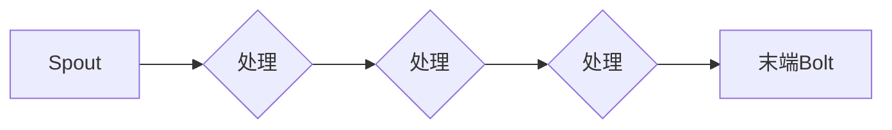

# Storm Topology原理与代码实例讲解

> 关键词：Storm, Storm Topology, 分布式计算，实时处理，流处理，数据流，消息传递，工作流设计

## 1. 背景介绍

随着互联网技术的飞速发展，数据量呈爆炸式增长。如何高效、实时地处理海量数据，成为了大数据领域的一个重要课题。Apache Storm应运而生，它是一个分布式、实时的大数据处理框架，能够对数据流进行快速处理和分析。Storm Topology是Storm框架的核心概念，它定义了数据流处理的工作流。本文将深入讲解Storm Topology的原理与代码实例，帮助读者更好地理解和应用Storm。

### 1.1 问题的由来

在传统的数据处理方式中，数据通常被存储在数据库中，然后通过批处理的方式进行分析。这种方式存在以下问题：

- 数据延迟高：批处理通常需要等待一定时间才能完成，无法满足实时性要求。
- 数据量大：批处理难以处理海量数据，且处理效率低。
- 处理灵活性差：批处理流程固定，难以适应动态变化的数据。

为了解决这些问题，我们需要一个能够实时处理数据流，且具有高扩展性和灵活性的分布式计算框架。Apache Storm就是这样一个框架。

### 1.2 研究现状

Apache Storm自2011年开源以来，已经发展成为大数据处理领域的事实标准。它具有以下特点：

- 分布式：可以在多台机器上运行，实现横向扩展。
- 实时性：能够实时处理数据流，满足实时性要求。
- 易用性：提供简单易用的API和丰富的组件库。
- 高可靠性：具有强大的容错机制，保证数据不丢失。

### 1.3 研究意义

掌握Storm Topology的原理和应用，对于大数据领域的开发者来说具有重要意义：

- 提高数据处理效率：实时处理数据流，满足实时性要求。
- 降低开发成本：提供简单易用的API和丰富的组件库，降低开发成本。
- 提高系统可靠性：强大的容错机制，保证系统稳定运行。

### 1.4 本文结构

本文将按照以下结构进行讲解：

- 第二部分介绍Storm Topology的核心概念与联系。
- 第三部分讲解Storm Topology的核心算法原理和具体操作步骤。
- 第四部分分析数学模型和公式，并举例说明。
- 第五部分通过代码实例进行详细讲解。
- 第六部分探讨Storm Topology的实际应用场景。
- 第七部分展望未来发展趋势与挑战。
- 第八部分总结全文，并给出常见问题与解答。

## 2. 核心概念与联系

### 2.1 Storm Topology概念

Storm Topology是Storm框架的核心概念，它定义了数据流处理的工作流。Topology由Spouts和Bolts组成，Spouts负责产生数据流，Bolts负责对数据进行处理。

### 2.2 Mermaid流程图

以下是Storm Topology的核心概念原理和架构的Mermaid流程图：



在上述流程图中，A表示Spout，负责产生数据流；B、C、D表示多个Bolt，负责对数据进行处理；E表示末端Bolt，负责将处理后的数据输出。

### 2.3 核心概念联系

- Spout：负责产生数据流，可以是Kafka、Twitter API等数据源。
- Bolt：负责对数据进行处理，可以是计数、过滤、聚合等操作。
- Stream：数据流，表示数据在Bolt之间的传递。
- Stream Grouping：数据分组策略，用于控制数据在Bolt之间的分发方式。

## 3. 核心算法原理 & 具体操作步骤

### 3.1 算法原理概述

Storm Topology通过Spout和Bolt的协同工作，实现数据的实时处理。Spout负责从数据源读取数据，并将其传递给Bolt进行处理。Bolt根据定义好的操作逻辑，对数据进行处理，并将处理后的数据传递给下一个Bolt或末端Bolt。

### 3.2 算法步骤详解

以下是Storm Topology的具体操作步骤：

1. 定义Spout：从数据源读取数据，并将其封装成Tuple。
2. 定义Bolt：定义Bolt的操作逻辑，如过滤、聚合等。
3. 定义Stream Grouping：定义数据在Bolt之间的分发方式。
4. 构建Topology：将Spout、Bolt和Stream Grouping组合成Topology。
5. 部署Topology：将Topology部署到Storm集群。

### 3.3 算法优缺点

Storm Topology的优点：

- 分布式：可以在多台机器上运行，实现横向扩展。
- 实时性：能够实时处理数据流，满足实时性要求。
- 可靠性：具有强大的容错机制，保证数据不丢失。

Storm Topology的缺点：

- 学习曲线：需要学习Storm框架和相关编程语言。
- 调试困难：分布式系统调试困难。

### 3.4 算法应用领域

Storm Topology在以下领域有广泛应用：

- 实时日志分析
- 实时推荐系统
- 实时欺诈检测
- 实时流量监控

## 4. 数学模型和公式 & 详细讲解 & 举例说明

### 4.1 数学模型构建

Storm Topology的数学模型可以表示为以下公式：

$$
\text{Toplogy} = \text{Spout} \rightarrow (\text{Bolt}_1 \rightarrow \text{Bolt}_2 \rightarrow \ldots \rightarrow \text{Bolt}_n) \rightarrow \text{End Bolt}
$$

其中：

- Topology：表示整个Storm Topology。
- Spout：表示数据源。
- Bolt：表示数据处理节点。
- End Bolt：表示末端Bolt，用于输出处理后的数据。

### 4.2 公式推导过程

由于Storm Topology的数学模型较为直观，这里不再进行推导。

### 4.3 案例分析与讲解

以下是一个简单的案例，用于演示Storm Topology的构建：

假设我们需要对来自Twitter的数据进行实时情感分析，并将分析结果输出到Kafka。

1. 定义Spout：

```java
public class TwitterSpout extends SpoutBase<TwitterMessage> {
    // ...省略代码...
}
```

2. 定义Bolt：

```java
public class SentimentAnalysisBolt extends BaseRichBolt {
    // ...省略代码...
}
```

3. 定义Stream Grouping：

```java
TopologyBuilder builder = new TopologyBuilder();
builder.setSpout("twitterSpout", new TwitterSpout());
builder.setBolt("sentimentAnalysisBolt", new SentimentAnalysisBolt()).shuffleGrouping("twitterSpout");
builder.setBolt("kafkaSpout", new KafkaSpout()).shuffleGrouping("sentimentAnalysisBolt");
```

4. 部署Topology：

```java
LocalCluster cluster = new LocalCluster();
cluster.submitTopology("twitterAnalysisTopology", config, builder.createToplogy());
```

在上面的案例中，TwitterSpout从Twitter数据源读取数据，并通过SentimentAnalysisBolt进行情感分析。分析结果通过KafkaSpout输出到Kafka。

## 5. 项目实践：代码实例和详细解释说明

### 5.1 开发环境搭建

1. 安装Java开发环境。
2. 安装Apache Storm客户端。
3. 配置Storm环境变量。

### 5.2 源代码详细实现

以下是一个简单的Storm Topology示例，用于演示Twitter数据实时情感分析：

```java
public class TwitterAnalysisTopology {
    public static void main(String[] args) throws Exception {
        Config conf = new Config();
        conf.setNumWorkers(2);
        conf.setMaxSpoutPending(1000);

        TopologyBuilder builder = new TopologyBuilder();
        builder.setSpout("twitterSpout", new TwitterSpout());
        builder.setBolt("sentimentAnalysisBolt", new SentimentAnalysisBolt()).shuffleGrouping("twitterSpout");
        builder.setBolt("kafkaSpout", new KafkaSpout()).shuffleGrouping("sentimentAnalysisBolt");

        LocalCluster cluster = new LocalCluster();
        cluster.submitTopology("twitterAnalysisTopology", conf, builder.createToplogy());
    }
}
```

### 5.3 代码解读与分析

在上面的代码中，我们定义了一个名为TwitterAnalysisTopology的类，其中包含以下关键组件：

- `Config`：配置 Storm 集群参数，如工作线程数、Spout 等待超时等。
- `TopologyBuilder`：构建 Storm Topology，包括 Spout、Bolt 和 Stream Grouping。
- `TwitterSpout`：从 Twitter 数据源读取数据。
- `SentimentAnalysisBolt`：对 Twitter 数据进行情感分析。
- `KafkaSpout`：将情感分析结果输出到 Kafka。

### 5.4 运行结果展示

运行上述代码后，Storm 集群将启动并开始处理 Twitter 数据。处理后的数据将被输出到 Kafka。

## 6. 实际应用场景

Storm Topology在实际应用场景中具有广泛的应用，以下列举几个典型案例：

- 实时日志分析：对来自各种日志的数据进行实时分析，如错误日志、访问日志等。
- 实时推荐系统：对用户行为数据进行实时分析，为用户提供个性化推荐。
- 实时欺诈检测：对交易数据进行分析，实时检测欺诈行为。
- 实时流量监控：对网络流量进行分析，实时监控网络状态。

## 7. 工具和资源推荐

### 7.1 学习资源推荐

- Apache Storm官方文档：https://storm.apache.org/
- Storm实战：https://github.com/haitaochen/storm-in-action
- Storm教程：https://www.tutorialspoint.com/storm/

### 7.2 开发工具推荐

- IntelliJ IDEA：一款功能强大的Java集成开发环境，支持Storm开发。
- Eclipse：一款经典的Java开发环境，也支持Storm开发。

### 7.3 相关论文推荐

- Storm: A Distributed and Fault-Tolerant Real-Time Computation System：Apache Storm的官方论文，介绍了Storm的设计和实现。
- Real-time Data Processing with Storm：介绍了Storm在实时数据处理中的应用。

## 8. 总结：未来发展趋势与挑战

### 8.1 研究成果总结

本文对Storm Topology的原理与代码实例进行了详细讲解，帮助读者理解和使用Storm框架进行实时数据处理。通过本文的学习，读者可以：

- 了解Storm Topology的核心概念和架构。
- 掌握Storm Topology的构建方法。
- 学习Storm Topology的代码实例。
- 了解Storm Topology的实际应用场景。

### 8.2 未来发展趋势

未来，Storm Topology将朝着以下方向发展：

- 更加易于使用：提供更加简单的API和更加丰富的组件库。
- 更加强大：支持更加复杂的数据处理任务，如机器学习、图像处理等。
- 更高可靠性：进一步提高系统的稳定性和容错能力。

### 8.3 面临的挑战

Storm Topology在发展过程中也面临着以下挑战：

- 学习曲线：Storm框架较为复杂，需要学习Java和Storm相关概念。
- 调试困难：分布式系统调试困难。

### 8.4 研究展望

未来，Storm Topology的研究方向包括：

- 深度学习与Storm的融合：将深度学习技术应用于Storm Topology，实现更强大的数据处理能力。
- 新型数据处理任务：探索Storm Topology在更多领域的应用，如语音处理、视频处理等。
- 跨平台支持：支持更多编程语言和操作系统，提高Storm的通用性。

## 9. 附录：常见问题与解答

**Q1：什么是Storm Topology？**

A：Storm Topology是Apache Storm框架的核心概念，它定义了数据流处理的工作流。Topology由Spouts和Bolts组成，Spouts负责产生数据流，Bolts负责对数据进行处理。

**Q2：如何构建一个Storm Topology？**

A：构建Storm Topology需要定义Spout和Bolt，并指定数据分组策略。具体步骤如下：

1. 定义Spout：从数据源读取数据，并将其封装成Tuple。
2. 定义Bolt：定义Bolt的操作逻辑，如过滤、聚合等。
3. 定义Stream Grouping：定义数据在Bolt之间的分发方式。
4. 构建Topology：将Spout、Bolt和Stream Grouping组合成Topology。
5. 部署Topology：将Topology部署到Storm集群。

**Q3：Storm Topology有什么优点？**

A：Storm Topology具有以下优点：

- 分布式：可以在多台机器上运行，实现横向扩展。
- 实时性：能够实时处理数据流，满足实时性要求。
- 可靠性：具有强大的容错机制，保证数据不丢失。

**Q4：Storm Topology在哪些领域有应用？**

A：Storm Topology在以下领域有广泛应用：

- 实时日志分析
- 实时推荐系统
- 实时欺诈检测
- 实时流量监控

---

作者：禅与计算机程序设计艺术 / Zen and the Art of Computer Programming