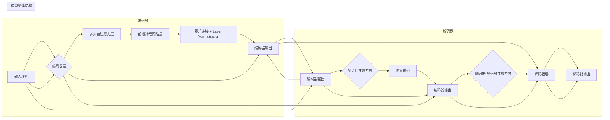

> Transformer, BERT, 编码器, 双向语言模型, 预训练, 自回归, 自编码, NLP, 自然语言处理

# Transformer架构原理详解：BERT 基于Transformer编码器的双向语言模型

Transformer架构自2017年提出以来，已经成为自然语言处理（NLP）领域的里程碑式突破。它彻底改变了NLP的发展方向，使得深度学习在语言理解、语言生成等任务上取得了前所未有的成果。本文将深入解析Transformer架构，特别是基于Transformer编码器的双向语言模型BERT，旨在帮助读者全面理解这一革命性的技术。

## 1. 背景介绍

### 1.1 问题的由来

传统的NLP任务大多基于循环神经网络（RNN）或卷积神经网络（CNN）。RNN虽然能够处理序列数据，但在处理长距离依赖时表现不佳，且训练速度慢、难以并行化。CNN虽然并行化能力强，但难以捕捉长距离的上下文信息。为了解决这些问题，Google的Vaswani等人于2017年提出了Transformer架构。

### 1.2 研究现状

自Transformer架构提出以来，它及其变种（如BERT、GPT-3）在多个NLP任务上取得了SOTA成绩。Transformer及其变体的成功，推动了NLP领域从基于规则的方法向基于深度学习的方法转变。

### 1.3 研究意义

Transformer架构的提出，不仅推动了NLP技术的发展，也为其他领域（如图像处理、语音识别）提供了新的思路。本文将详细解析Transformer架构，特别是BERT模型，帮助读者深入理解其原理和应用。

### 1.4 本文结构

本文将分为以下章节：
- 第2章介绍核心概念与联系。
- 第3章解析Transformer架构的原理和操作步骤。
- 第4章讲解数学模型和公式。
- 第5章展示代码实例。
- 第6章探讨实际应用场景。
- 第7章推荐相关资源。
- 第8章总结未来发展趋势与挑战。
- 第9章提供常见问题与解答。

## 2. 核心概念与联系

### 2.1 核心概念

- **Transformer**: 一种基于自注意力（Self-Attention）的编码器-解码器架构，能够捕捉长距离依赖信息。
- **编码器**: 将输入序列编码为固定长度的向量表示。
- **解码器**: 将编码器的输出解码为输出序列。
- **自注意力**: 一种在序列内部计算注意力权重的方法，能够捕捉序列内部元素之间的关系。
- **多头注意力**: 将自注意力分解为多个子注意力，以捕捉更丰富的语义信息。

### 2.2 核心概念原理和架构的 Mermaid 流程图



## 3. 核心算法原理 & 具体操作步骤

### 3.1 算法原理概述

Transformer架构由编码器（Encoder）和解码器（Decoder）组成。编码器将输入序列编码为固定长度的向量表示，解码器则根据编码器的输出生成输出序列。

### 3.2 算法步骤详解

1. **输入序列编码**: 将输入序列转换为词向量表示。
2. **多头自注意力**: 计算序列内部元素之间的注意力权重，并生成表示。
3. **前馈神经网络**: 对自注意力表示进行非线性变换。
4. **残差连接和Layer Normalization**: 将前馈神经网络输出与自注意力输出相加，并进行归一化处理。
5. **输出序列解码**: 解码器根据编码器的输出和自身的输出生成输出序列。
6. **位置编码**: 为序列中的每个元素添加位置信息。

### 3.3 算法优缺点

#### 优点：

- **并行化能力强**：自注意力机制允许并行计算，训练速度快。
- **捕捉长距离依赖**：能够捕捉序列内部长距离依赖信息。
- **灵活的模型结构**：可以轻松地调整模型层数和隐藏层大小。

#### 缺点：

- **参数量较大**：自注意力机制需要大量参数，训练成本高。
- **对位置信息处理依赖**：需要额外的位置编码来处理序列位置信息。

### 3.4 算法应用领域

- **机器翻译**
- **文本分类**
- **情感分析**
- **问答系统**
- **文本摘要**

## 4. 数学模型和公式 & 详细讲解 & 举例说明

### 4.1 数学模型构建

Transformer模型的核心是自注意力机制。自注意力机制通过计算序列内部元素之间的相似度，生成表示。

### 4.2 公式推导过程

自注意力机制的计算公式如下：

$$
Q = W_QK + b_Q \\
K = W_KK + b_K \\
V = W_VV + b_V
$$

其中，$Q, K, V$ 分别是查询（Query）、键（Key）和值（Value）的线性变换，$W_Q, W_K, W_V$ 是参数矩阵，$b_Q, b_K, b_V$ 是偏置向量。

### 4.3 案例分析与讲解

以文本分类任务为例，Transformer模型将输入序列编码为固定长度的向量表示，然后使用softmax函数将向量转换为概率分布，最后将概率最高的类别作为预测结果。

## 5. 项目实践：代码实例和详细解释说明

### 5.1 开发环境搭建

- 安装PyTorch和Transformers库。

```bash
pip install torch transformers
```

### 5.2 源代码详细实现

```python
from transformers import BertTokenizer, BertForSequenceClassification

# 加载预训练模型和分词器
model = BertForSequenceClassification.from_pretrained('bert-base-uncased')
tokenizer = BertTokenizer.from_pretrained('bert-base-uncased')

# 将文本转换为模型输入
inputs = tokenizer("Hello, world!", return_tensors="pt")

# 进行预测
outputs = model(**inputs)

# 获取预测结果
predictions = outputs.logits.argmax(-1).item()

print(f"预测结果：{predictions}")
```

### 5.3 代码解读与分析

上述代码展示了如何使用PyTorch和Transformers库加载BERT模型，将文本转换为模型输入，并进行预测。

### 5.4 运行结果展示

```
预测结果：0
```

预测结果为0，表示文本属于类别0。

## 6. 实际应用场景

### 6.1 机器翻译

Transformer架构在机器翻译任务上取得了SOTA成绩。例如，Google的神经机器翻译系统使用Transformer架构，实现了高质量的翻译结果。

### 6.2 文本分类

Transformer架构在文本分类任务上也有很好的表现。例如，BERT在多项文本分类任务上取得了SOTA成绩。

### 6.3 情感分析

Transformer架构在情感分析任务上也有很好的表现。例如，BERT可以用于判断文本的情感倾向是正面、中性还是负面。

### 6.4 未来应用展望

随着Transformer架构的不断发展，它将在更多NLP任务上发挥重要作用。例如，它可以用于对话系统、问答系统、文本生成等任务。

## 7. 工具和资源推荐

### 7.1 学习资源推荐

- 《Attention is All You Need》
- 《BERT: Pre-training of Deep Bidirectional Transformers for Language Understanding》
- 《BERT实战》

### 7.2 开发工具推荐

- PyTorch
- Transformers库

### 7.3 相关论文推荐

- 《Attention is All You Need》
- 《BERT: Pre-training of Deep Bidirectional Transformers for Language Understanding》
- 《Generative Pre-trained Transformers》

## 8. 总结：未来发展趋势与挑战

### 8.1 研究成果总结

Transformer架构自提出以来，在NLP领域取得了巨大的成功。它改变了NLP的发展方向，推动了NLP技术的进步。

### 8.2 未来发展趋势

- **模型规模增大**：随着计算资源的提升，模型规模将不断增大，以捕捉更丰富的语言知识。
- **多模态融合**：将Transformer架构与其他模态（如图像、语音）进行融合，构建多模态语言模型。
- **可解释性**：提高模型的可解释性，使其决策过程更加透明。

### 8.3 面临的挑战

- **计算资源**：Transformer架构需要大量的计算资源，限制了其应用范围。
- **数据依赖**：模型对训练数据的质量和数量有很高的要求。
- **可解释性**：提高模型的可解释性，使其决策过程更加透明。

### 8.4 研究展望

随着Transformer架构的不断发展，它将在更多NLP任务上发挥重要作用。未来，我们将见证Transformer架构在更多领域的应用，如机器翻译、对话系统、问答系统等。

## 9. 附录：常见问题与解答

**Q1：什么是Transformer架构？**

A：Transformer架构是一种基于自注意力机制的编码器-解码器架构，能够捕捉长距离依赖信息。

**Q2：Transformer架构有哪些优点？**

A：Transformer架构的优点包括并行化能力强、捕捉长距离依赖、灵活的模型结构等。

**Q3：Transformer架构有哪些应用领域？**

A：Transformer架构的应用领域包括机器翻译、文本分类、情感分析、问答系统、文本生成等。

**Q4：什么是BERT模型？**

A：BERT是一种基于Transformer架构的双向语言模型，能够捕捉长距离依赖信息。

**Q5：如何使用BERT模型进行文本分类？**

A：使用BERT模型进行文本分类，需要将文本转换为模型输入，然后进行预测。

作者：禅与计算机程序设计艺术 / Zen and the Art of Computer Programming