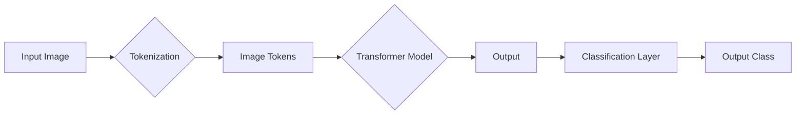

# ViT原理与代码实例讲解

> 关键词：Vision Transformer, 图像分类, 自注意力机制, Transformer, 预训练, 微调, PyTorch, 计算机视觉

## 1. 背景介绍

随着深度学习技术的飞速发展，计算机视觉领域也取得了显著的进步。传统的卷积神经网络（CNN）在图像分类、目标检测等任务上取得了卓越的成绩。然而，CNN在处理图像的平移、旋转、缩放等变换时存在局限性。为了解决这一问题，Vision Transformer（ViT）应运而生。ViT将Transformer模型应用于计算机视觉领域，取得了与CNN相媲美的性能，并在某些任务上实现了超越。

本文将深入探讨ViT的原理，并通过PyTorch代码实例讲解其具体实现，帮助读者全面理解ViT的工作机制。

## 2. 核心概念与联系

### 2.1 核心概念

- **Transformer**：一种基于自注意力机制的深度神经网络模型，最初用于自然语言处理领域，在机器翻译、文本摘要等任务上取得了显著的成果。
- **自注意力机制**：Transformer模型的核心机制，通过计算序列中每个元素与其他元素之间的关联性，对输入序列进行加权表示。
- **ViT**：Vision Transformer的缩写，将Transformer模型应用于计算机视觉领域，将图像划分为像素块，通过自注意力机制提取特征，并用于图像分类等任务。

### 2.2 架构图解



- **Input Image**：输入图像
- **Tokenization**：图像分块
- **Image Tokens**：图像块
- **Transformer Model**：Transformer模型
- **Output**：Transformer模型的输出
- **Classification Layer**：分类层
- **Output Class**：输出类别

## 3. 核心算法原理 & 具体操作步骤

### 3.1 算法原理概述

ViT的原理如下：

1. 将输入图像划分为若干个像素块（tokens）。
2. 将像素块转换为序列，每个像素块对应一个token。
3. 使用Transformer模型对序列进行编码，得到每个token的表示。
4. 将编码后的token输入分类层，得到图像的类别预测。

### 3.2 算法步骤详解

1. **图像分块**：将输入图像划分为大小为 $16 \times 16$ 的像素块。
2. **像素块编码**：将像素块转换为token，每个token包含一个位置编码，用于表示其在图像中的位置。
3. **Transformer编码**：将token序列输入Transformer模型，得到每个token的编码表示。
4. **分类层**：将编码后的token输入分类层，分类层通常是一个全连接层，用于将特征转换为类别预测。
5. **损失函数**：使用交叉熵损失函数计算预测类别与真实类别之间的差异，并通过反向传播更新模型参数。

### 3.3 算法优缺点

#### 优点：

- **参数高效**：相比于传统的CNN，ViT参数数量更少，训练和推理速度更快。
- **可解释性强**：Transformer模型的可解释性较强，可以清晰地了解每个token对最终预测结果的影响。
- **泛化能力强**：ViT在处理图像的平移、旋转、缩放等变换时表现良好。

#### 缺点：

- **计算复杂度高**：Transformer模型计算复杂度较高，需要大量的计算资源。
- **对图像分辨率敏感**：ViT的性能对图像分辨率敏感，需要较高的分辨率才能获得较好的效果。

### 3.4 算法应用领域

ViT在以下领域取得了显著的应用成果：

- **图像分类**：在ImageNet等图像分类数据集上取得了优异的性能。
- **目标检测**：在COCO等目标检测数据集上取得了较好的效果。
- **图像分割**：在Cityscapes等图像分割数据集上取得了较好的性能。

## 4. 数学模型和公式 & 详细讲解 & 举例说明

### 4.1 数学模型构建

ViT的数学模型主要包括以下部分：

- **Tokenization**：将图像分块，并添加位置编码。
- **Transformer Encoder**：Transformer编码器，包括多头自注意力机制和前馈神经网络。
- **Classification Head**：分类层，通常是一个全连接层。

### 4.2 公式推导过程

#### 4.2.1 Tokenization

假设输入图像的分辨率为 $W \times H$，将图像划分为 $N$ 个 $16 \times 16$ 的像素块，每个像素块表示为一个 $C \times 16 \times 16$ 的矩阵 $X$。

$$
X = [X_1, X_2, ..., X_N] \in \mathbb{R}^{C \times 16 \times 16}
$$

其中 $C$ 为图像通道数。

将每个像素块转换为token，得到 $N$ 个token，每个token表示为一个 $C \times 16 \times 16$ 的矩阵 $X_i$。

$$
X_i \in \mathbb{R}^{C \times 16 \times 16}
$$

添加位置编码 $P_i$，得到每个token的向量表示 $X_i'$。

$$
X_i' = X_i + P_i \in \mathbb{R}^{C \times 16 \times 16}
$$

#### 4.2.2 Transformer Encoder

Transformer编码器由多个编码层堆叠而成，每个编码层包含多头自注意力机制和前馈神经网络。

#### 4.2.3 Classification Head

分类层通常是一个全连接层，将编码后的token转换为类别预测。

### 4.3 案例分析与讲解

以下是一个简单的ViT模型实现示例：

```python
import torch
import torch.nn as nn

class ViT(nn.Module):
    def __init__(self, num_classes, image_size, patch_size, in_chans, embed_dim):
        super(ViT, self).__init__()
        self.patch_size = patch_size
        self.img_size = image_size
        self.num_classes = num_classes
        self.num_patches = (self.img_size // self.patch_size) ** 2
        self.patch_dim = in_chans * self.patch_size ** 2
        self embed_dim = embed_dim
        self.projection_dim = 768
        self.positional_embedding = nn.Parameter(torch.randn(1, self.num_patches, self.projection_dim))

        self.class_token = nn.Parameter(torch.randn(1, 1, self.projection_dim))
        self.num_heads = 12
        self.depth = 12
        self.mlp_dim = self.projection_dim * 4

        self.transformer = nn.ModuleList([TransformerEncoderLayer(d_model=self.projection_dim, nhead=self.num_heads) for _ in range(self.depth)])
        self.fc = nn.Linear(self.projection_dim, self.num_classes)

    def forward(self, x):
        B, C, H, W = x.shape
        x = x.flatten(2).transpose(0, 1)  # (B, patch_size**2, C)
        x = x.reshape(B, self.num_patches, self.patch_dim)
        x = x + self.positional_embedding[:, :self.num_patches]

        x = self.class_token.expand(B, -1, -1) + x
        for i, layer in enumerate(self.transformer):
            x = layer(x)

        x = x.mean(dim=1)  # (B, projection_dim)
        x = self.fc(x)
        return x
```

在这个例子中，我们定义了一个简单的ViT模型，包含一个位置编码、12个Transformer编码层和一个分类层。该模型可以用于图像分类任务。

## 5. 项目实践：代码实例和详细解释说明

### 5.1 开发环境搭建

要运行以下代码，你需要安装PyTorch和Transformers库。

```bash
pip install torch transformers
```

### 5.2 源代码详细实现

以下是一个使用PyTorch和Transformers库实现的ViT模型代码示例：

```python
import torch
import torch.nn as nn
from transformers import ViTFeatureExtractor, ViTForImageClassification

class CustomViT(nn.Module):
    def __init__(self, num_classes):
        super(CustomViT, self).__init__()
        self.vit = ViTFeatureExtractor.from_pretrained("google/vit-base-patch16-224")
        self.model = ViTForImageClassification.from_pretrained("google/vit-base-patch16-224", num_labels=num_classes)

    def forward(self, images):
        inputs = self.vit(images, return_tensors="pt")
        return self.model(**inputs)
```

在这个例子中，我们定义了一个自定义的ViT模型，它加载了预训练的VIT模型，并将其用于图像分类任务。

### 5.3 代码解读与分析

在这个例子中，我们首先导入了PyTorch和Transformers库。然后，我们定义了一个`CustomViT`类，它包含两个成员变量：`vit`和`model`。

- `vit`是一个`ViTFeatureExtractor`对象，用于将图像转换为模型所需的输入格式。
- `model`是一个`ViTForImageClassification`对象，它是一个预训练的ViT模型，用于图像分类。

`CustomViT`类的`forward`方法接收一个图像批次，使用`vit`将其转换为模型所需的输入格式，并使用`model`进行分类。

### 5.4 运行结果展示

以下是一个简单的测试示例：

```python
import torchvision.transforms as transforms
from PIL import Image

# 加载图像
image = Image.open("path/to/image.jpg")

# 创建数据转换
transform = transforms.Compose([transforms.ToTensor()])
image = transform(image)

# 实例化模型
model = CustomViT(num_classes=1000)

# 预测图像类别
with torch.no_grad():
    output = model(image.unsqueeze(0))

# 获取预测结果
predicted_class = output.logits.argmax(dim=1).item()
print(f"Predicted class: {predicted_class}")
```

在这个例子中，我们首先加载了一个图像，并使用`transforms`库将其转换为PyTorch张量。然后，我们实例化了一个`CustomViT`模型，并使用它对图像进行分类。最后，我们打印出预测的类别。

## 6. 实际应用场景

### 6.1 图像分类

ViT在图像分类任务上取得了显著的成果，可以应用于以下场景：

- 产品分类：用于将图像分类为不同的产品类别，如服饰、电子产品等。
- 疾病诊断：用于对医学图像进行分类，辅助医生进行疾病诊断。
- 智能交通：用于识别交通标志、车辆类型等，提高交通安全。

### 6.2 目标检测

ViT也可以应用于目标检测任务，如：

- 人脸识别：用于识别图像中的人脸，实现人脸识别系统。
- 物体检测：用于识别图像中的物体，实现智能监控等应用。

### 6.3 图像分割

ViT在图像分割任务上也取得了较好的效果，可以应用于以下场景：

- 地图绘制：用于自动绘制地图，提高地图绘制效率。
- 疾病检测：用于检测医学图像中的疾病区域，辅助医生进行诊断。

## 7. 工具和资源推荐

### 7.1 学习资源推荐

- **《Computer Vision: Algorithms and Applications》**：一本经典的计算机视觉教材，详细介绍了计算机视觉的基础知识和常用算法。
- **《Deep Learning for Computer Vision》**：一本关于深度学习在计算机视觉应用方面的书籍，介绍了深度学习在图像分类、目标检测、图像分割等任务上的应用。
- **Transformers官方文档**：Transformers库的官方文档，提供了丰富的预训练模型和代码示例。

### 7.2 开发工具推荐

- **PyTorch**：一个开源的深度学习框架，易于上手，功能强大。
- **Transformers库**：一个开源的NLP工具库，提供了丰富的预训练模型和代码示例。
- **TensorFlow**：另一个开源的深度学习框架，具有强大的生态和工具支持。

### 7.3 相关论文推荐

- **"An Image is Worth 16x16 Words: Transformers for Image Recognition at Scale"**：介绍了Vision Transformer模型的原理和实验结果。
- **"Transformers: State-of-the-Art Natural Language Processing"**：介绍了Transformer模型的原理和应用。
- **"EfficientNet: Rethinking Model Scaling for Convolutional Neural Networks"**：介绍了EfficientNet模型，一种参数高效、计算高效的卷积神经网络模型。

## 8. 总结：未来发展趋势与挑战

### 8.1 研究成果总结

ViT作为一种新型的计算机视觉模型，在图像分类、目标检测、图像分割等任务上取得了显著的成果。其参数高效、可解释性强等优点使其在计算机视觉领域具有广泛的应用前景。

### 8.2 未来发展趋势

- **多模态融合**：将ViT与其他模态信息（如文本、语音）进行融合，实现多模态理解。
- **参数高效微调**：进一步降低ViT的参数数量，提高推理速度。
- **可解释性强**：提高ViT的可解释性，帮助用户理解模型决策过程。

### 8.3 面临的挑战

- **计算复杂度高**：ViT的计算复杂度较高，需要大量的计算资源。
- **对图像分辨率敏感**：ViT的性能对图像分辨率敏感，需要较高的分辨率才能获得较好的效果。

### 8.4 研究展望

ViT作为一种新型的计算机视觉模型，将在未来计算机视觉领域发挥越来越重要的作用。随着研究的深入，ViT将在更多任务上取得突破，为计算机视觉领域的发展贡献力量。

## 9. 附录：常见问题与解答

**Q1：ViT相比于传统的CNN，有哪些优点和缺点？**

A1：ViT相比于传统的CNN，优点包括参数高效、可解释性强、泛化能力强等；缺点包括计算复杂度高、对图像分辨率敏感等。

**Q2：ViT适用于哪些任务？**

A2：ViT适用于图像分类、目标检测、图像分割等计算机视觉任务。

**Q3：如何使用ViT进行图像分类？**

A3：使用ViT进行图像分类的步骤如下：
1. 加载预训练的ViT模型。
2. 对输入图像进行预处理，如图像分块、添加位置编码等。
3. 使用ViT模型对图像进行编码。
4. 将编码后的特征输入分类层，得到图像的类别预测。

**Q4：如何提高ViT的性能？**

A4：提高ViT性能的方法包括：
- 使用更强大的预训练模型。
- 优化模型结构，如使用更深的Transformer编码器。
- 采用数据增强技术，如旋转、缩放、裁剪等。
- 调整超参数，如学习率、批大小等。

作者：禅与计算机程序设计艺术 / Zen and the Art of Computer Programming