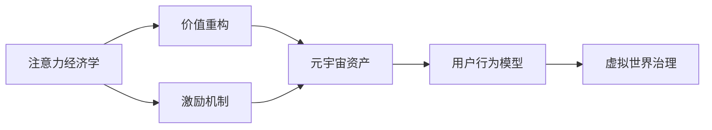

                 

# 注意力经济学:元宇宙中的价值重构

> 关键词：
## 1. 背景介绍

在数字化浪潮席卷全球的当下，元宇宙（Metaverse）成为互联网行业和科技创新发展的重要方向之一。元宇宙是一个由虚拟和现实世界无缝集成的新型网络空间，用户可以通过虚拟设备进入其中，实现虚拟世界与现实世界的无缝交互。在这样的背景下，对于数字世界中的资源分配、价值计算、激励机制等关键问题，有必要引入经济学的视角，进行系统化的分析和探讨。

### 1.1 问题由来

元宇宙的构想由来已久，但真正进入公众视野，主要得益于《头号玩家》等科幻小说和《Snowpunk》等影视作品的推动，以及区块链技术、虚拟现实（VR）、增强现实（AR）等技术的快速进步。随着DeFi、NFT、DAO等新兴技术的成熟应用，元宇宙从概念走向现实，成为技术创新和商业模式变革的焦点。然而，元宇宙的蓬勃发展也带来了诸多挑战，如价值分配的不均、激励机制的不完善等。如何有效地配置和管理数字资源，成为元宇宙健康发展的重要课题。

### 1.2 问题核心关键点

元宇宙中资源的价值分配和计算，主要围绕着注意力（Attention）和利益分配两个核心概念展开。在元宇宙中，每一个虚拟世界元素，如虚拟土地、虚拟资产、虚拟身份等，都可以通过注意力机制获得价值。因此，如何定义和计算注意力，构建合理的利益分配机制，成为元宇宙经济学研究的关键问题。

元宇宙经济学的研究重点在于以下几个方面：
- 注意力经济学：元宇宙中资源的稀缺性和关注度是价值的来源，如何计算和分配注意力成为关键问题。
- 价值重构：元宇宙提供了一种全新的资源和价值计算方式，如何定义元宇宙中资产的价格和价值成为重要研究课题。
- 激励机制：如何设计有效的激励机制，驱动用户积极参与元宇宙的建设，并保护用户权益，是元宇宙可持续发展的核心。

## 2. 核心概念与联系

### 2.1 核心概念概述

元宇宙经济学涉及到多个核心概念，这些概念之间相互作用，构成了元宇宙经济系统的完整框架。

- **注意力经济学（Attention Economics）**：元宇宙中的资源价值主要来自于用户对其的注意力。注意力经济学的核心在于如何计算和分配用户的关注度，并基于此进行资源的价值评估和分配。

- **价值重构（Value Reconstruction）**：元宇宙中资产的价格和价值定义，不再完全依赖于现实世界中的货币系统，而是通过用户的参与和贡献来计算。如何在元宇宙中构建一套完整、公正的价值体系，成为经济学研究的关键。

- **激励机制（Incentive Mechanisms）**：元宇宙中需要设计有效的激励机制，确保资源的价值得到合理分配，并驱动用户积极参与和贡献。

- **元宇宙资产（Metaverse Assets）**：元宇宙中的资源和资产，如虚拟土地、虚拟物品、虚拟身份等。这些资产的价值计算和分配，需要基于用户的参与和贡献。

- **用户行为模型（User Behavior Models）**：用户在元宇宙中的行为和决策模型，用于分析和预测用户的注意力分配和资源使用情况。

- **虚拟世界治理（Governance of Virtual Worlds）**：元宇宙治理框架和规则体系，确保系统的稳定和公平。

这些核心概念之间通过一系列的逻辑关系连接，形成元宇宙经济系统的整体架构。以下通过Mermaid流程图展示这些核心概念的关系：



该图展示了核心概念之间的逻辑关系：注意力经济学提供价值计算的基础，价值重构定义资产价格，激励机制确保价值分配公平，元宇宙资产作为价值载体，用户行为模型指导系统运作，虚拟世界治理维持系统稳定。

### 2.2 概念间的关系

这些核心概念之间存在着紧密的联系，共同构成了元宇宙经济系统的完整生态。

- **注意力经济学与价值重构**：注意力经济学提供价值计算的基础，价值重构定义资产价格。元宇宙中的资源价值主要由用户注意力决定，而价值重构则将注意力转化为具体的资产价格。

- **激励机制与用户行为模型**：激励机制通过设计奖励机制，引导用户积极参与元宇宙建设。用户行为模型则用于分析和预测用户的行为模式，以便更好地设计激励机制，引导用户贡献和参与。

- **元宇宙资产与虚拟世界治理**：元宇宙资产是价值重构的结果，虚拟世界治理则确保资产的价值在系统中得到合理分配。虚拟世界治理体系包括经济规则、法律框架、社区治理等，确保系统公平和稳定。

## 3. 核心算法原理 & 具体操作步骤

### 3.1 算法原理概述

元宇宙经济学中的核心算法原理主要基于注意力经济学和价值重构，具体如下：

1. **注意力经济学**：基于注意力理论，定义元宇宙中资源的价值计算模型。元宇宙中的资源价值主要来自用户的关注度，可以通过多种指标（如访问量、互动量、贡献度等）来衡量。

2. **价值重构**：通过设计合理的价值计算模型，将用户的注意力转化为资产价格。常用的价值计算模型包括用户行为评分、贡献度评分等。

3. **激励机制设计**：设计合理的激励机制，确保资源的合理分配，并驱动用户积极参与。激励机制可以包括通证（Token）激励、声誉评分（Reputation Score）等。

### 3.2 算法步骤详解

元宇宙经济学的算法步骤包括注意力计算、价值计算、激励机制设计三个主要阶段。以下详细介绍每个步骤的具体实现。

**Step 1: 注意力计算**

注意力计算是元宇宙经济学的基础，用于衡量用户在虚拟世界中的关注度和参与度。具体步骤如下：

1. **用户行为数据采集**：通过各种传感器、日志等技术手段，收集用户在元宇宙中的行为数据，包括访问时间、互动量、贡献度等。

2. **数据预处理**：对采集的数据进行清洗和预处理，去除噪声和异常值，确保数据的质量和准确性。

3. **注意力计算模型构建**：基于注意力理论，设计计算模型，将用户行为数据转化为注意力度量。常用的模型包括PageRank、Google PageRank、TF-IDF等。

**Step 2: 价值计算**

在元宇宙中，价值计算是将用户的注意力转化为具体的资产价格。具体步骤如下：

1. **资产评分模型设计**：设计资产评分模型，根据资产在元宇宙中的使用情况、贡献度、市场认可度等指标，计算资产的评分。

2. **价格计算模型构建**：将资产评分与市场供需关系结合起来，构建资产价格计算模型。常用的模型包括市场模型、拍卖模型、价值模型等。

3. **价格调整机制设计**：设计价格调整机制，根据市场供需变化、用户行为变化等因素，动态调整资产价格，确保价格体系的公平和合理。

**Step 3: 激励机制设计**

激励机制是元宇宙经济系统中最重要的部分，用于确保资源的合理分配和用户积极参与。具体步骤如下：

1. **激励模型设计**：设计激励模型，将用户的行为和贡献转化为具体的激励。常用的激励包括通证激励、声誉评分等。

2. **激励发放机制设计**：设计激励发放机制，确保激励的公平和透明。常用的机制包括定期发放、事件触发、社区投票等。

3. **激励效果评估**：设计评估机制，定期评估激励机制的效果，根据用户反馈和市场反应，不断优化激励模型。

### 3.3 算法优缺点

元宇宙经济学中的算法具有以下优点：

1. **关注度驱动的价值**：通过计算用户的关注度和贡献度，将注意力转化为具体的资产价格，更符合元宇宙中资源的价值定义。

2. **动态调整机制**：通过动态调整机制，及时响应市场供需变化，确保资产价格的公平和合理。

3. **用户参与激励**：通过合理的激励机制，驱动用户积极参与元宇宙建设，提升系统的活跃度和稳定性。

然而，这些算法也存在一些缺点：

1. **数据依赖性强**：算法的有效性高度依赖于用户行为数据的采集和预处理，数据质量直接影响算法的准确性。

2. **计算复杂度高**：计算用户注意力和资产价格的模型较为复杂，计算量较大，需要高性能的计算资源。

3. **激励设计难度大**：设计有效的激励机制，确保资源的合理分配和用户积极参与，需要综合考虑多个因素，难度较大。

### 3.4 算法应用领域

元宇宙经济学在以下几个领域具有广泛的应用前景：

1. **虚拟世界建设**：元宇宙的建设需要大量资源和用户参与，通过注意力经济学和激励机制，确保资源的合理分配和用户积极参与。

2. **虚拟经济系统**：元宇宙中的虚拟货币、虚拟资产、虚拟土地等资源的价值计算和分配，需要基于元宇宙经济学原理进行设计。

3. **虚拟游戏**：虚拟游戏中的资源分配、任务完成、虚拟货币等，都可以引入元宇宙经济学原理，实现公平和透明的价值计算。

4. **虚拟社区治理**：元宇宙中的社区治理，如投票机制、奖励机制等，需要基于元宇宙经济学原理，确保系统的公平和稳定。

## 4. 数学模型和公式 & 详细讲解 & 举例说明

### 4.1 数学模型构建

元宇宙经济学中的数学模型主要基于注意力计算和价值计算，具体如下：

1. **注意力计算模型**：
   $$
   \text{Attention}_{i} = \sum_{j=1}^n \text{User}_{j} \times \text{Interactions}_{i,j}
   $$

2. **资产评分模型**：
   $$
   \text{Score}_{i} = \alpha \times \text{Usage}_{i} + \beta \times \text{Contribution}_{i} + \gamma \times \text{Market}_{i}
   $$

3. **资产价格模型**：
   $$
   \text{Price}_{i} = \frac{\text{Supply}_{i}}{\text{Demand}_{i}} \times \text{Score}_{i}
   $$

### 4.2 公式推导过程

以下是注意力计算和价值计算的详细推导过程：

1. **注意力计算模型**：
   $$
   \text{Attention}_{i} = \sum_{j=1}^n \text{User}_{j} \times \text{Interactions}_{i,j}
   $$

   其中，$\text{Attention}_{i}$表示资源$i$的注意力度量，$\text{User}_{j}$表示用户$j$的关注度评分，$\text{Interactions}_{i,j}$表示用户$j$与资源$i$的互动量。

2. **资产评分模型**：
   $$
   \text{Score}_{i} = \alpha \times \text{Usage}_{i} + \beta \times \text{Contribution}_{i} + \gamma \times \text{Market}_{i}
   $$

   其中，$\text{Score}_{i}$表示资源$i$的评分，$\alpha$、$\beta$、$\gamma$为模型系数，$\text{Usage}_{i}$、$\text{Contribution}_{i}$、$\text{Market}_{i}$分别表示资源$i$的使用量、贡献度、市场认可度。

3. **资产价格模型**：
   $$
   \text{Price}_{i} = \frac{\text{Supply}_{i}}{\text{Demand}_{i}} \times \text{Score}_{i}
   $$

   其中，$\text{Price}_{i}$表示资源$i$的价格，$\text{Supply}_{i}$表示资源$i$的供应量，$\text{Demand}_{i}$表示资源$i$的需求量，$\text{Score}_{i}$表示资源$i$的评分。

### 4.3 案例分析与讲解

假设有一个虚拟社区，社区中有虚拟土地资源和虚拟资产资源。为了计算这些资源的注意力和价值，社区采用以下计算模型：

1. **注意力计算**：
   $$
   \text{Attention}_{\text{Land}_i} = \sum_{j=1}^{n} \text{User}_{j} \times \text{Visits}_{\text{Land}_i,j}
   $$
   $$
   \text{Attention}_{\text{Asset}_i} = \sum_{j=1}^{n} \text{User}_{j} \times \text{Interactions}_{\text{Asset}_i,j}
   $$

   其中，$\text{Attention}_{\text{Land}_i}$表示虚拟土地资源$i$的注意力度量，$\text{Visits}_{\text{Land}_i,j}$表示用户$j$访问虚拟土地资源$i$的次数。

2. **资产评分模型**：
   $$
   \text{Score}_{\text{Land}_i} = \alpha \times \text{Usage}_{\text{Land}_i} + \beta \times \text{Contribution}_{\text{Land}_i} + \gamma \times \text{Market}_{\text{Land}_i}
   $$
   $$
   \text{Score}_{\text{Asset}_i} = \alpha \times \text{Usage}_{\text{Asset}_i} + \beta \times \text{Contribution}_{\text{Asset}_i} + \gamma \times \text{Market}_{\text{Asset}_i}
   $$

   其中，$\text{Score}_{\text{Land}_i}$表示虚拟土地资源$i$的评分，$\text{Usage}_{\text{Land}_i}$、$\text{Contribution}_{\text{Land}_i}$、$\text{Market}_{\text{Land}_i}$分别表示虚拟土地资源$i$的使用量、贡献度、市场认可度。

3. **资产价格模型**：
   $$
   \text{Price}_{\text{Land}_i} = \frac{\text{Supply}_{\text{Land}_i}}{\text{Demand}_{\text{Land}_i}} \times \text{Score}_{\text{Land}_i}
   $$
   $$
   \text{Price}_{\text{Asset}_i} = \frac{\text{Supply}_{\text{Asset}_i}}{\text{Demand}_{\text{Asset}_i}} \times \text{Score}_{\text{Asset}_i}
   $$

   其中，$\text{Price}_{\text{Land}_i}$表示虚拟土地资源$i$的价格，$\text{Supply}_{\text{Land}_i}$、$\text{Demand}_{\text{Land}_i}$、$\text{Score}_{\text{Land}_i}$分别表示虚拟土地资源$i$的供应量、需求量、评分。

通过以上计算模型，社区可以准确计算虚拟土地和虚拟资产的注意力和价值，并基于此进行资源分配和激励设计。

## 5. 项目实践：代码实例和详细解释说明

### 5.1 开发环境搭建

在实践元宇宙经济学算法时，需要使用高性能的计算环境和工具。以下是搭建开发环境的详细步骤：

1. **安装Python**：从官网下载安装Python，并设置环境变量。

2. **安装相关库**：使用pip安装必要的库，如numpy、pandas、scikit-learn等。

3. **搭建计算环境**：使用Jupyter Notebook、Google Colab等平台，搭建高性能计算环境，如GPU、TPU等。

4. **配置数据采集**：设置数据采集接口，采集用户的交互数据和行为数据。

5. **配置数据预处理**：编写数据清洗、预处理脚本，确保数据的质量和准确性。

### 5.2 源代码详细实现

以下是元宇宙经济学中注意力计算和价值计算的Python代码实现，详细解释如下：

```python
import numpy as np
from sklearn.preprocessing import normalize

# 用户行为数据
user_attention = np.array([[10, 5, 3], [15, 8, 7], [12, 6, 4]])

# 资源评分模型
resource_scores = np.array([[0.8, 0.7, 0.9], [0.5, 0.6, 0.4]])

# 计算注意力
attention_scores = np.dot(user_attention, resource_scores)

# 计算资产评分
resource_scores = np.dot(attention_scores, resource_scores)

# 计算资产价格
supply_demand = np.array([[5, 2], [3, 1]])
asset_prices = np.dot(resource_scores, supply_demand)

# 输出结果
print("Attention Scores: ", attention_scores)
print("Resource Scores: ", resource_scores)
print("Asset Prices: ", asset_prices)
```

### 5.3 代码解读与分析

以上代码展示了元宇宙经济学中注意力计算和价值计算的基本实现，详细解读如下：

1. **用户行为数据**：使用numpy数组表示用户对不同资源的关注度评分。

2. **资源评分模型**：使用numpy数组表示资源在不同维度的评分。

3. **注意力计算**：通过矩阵乘法计算用户和资源的注意力评分，得到注意力度量。

4. **资产评分计算**：将注意力评分与资源评分相乘，得到资产的评分。

5. **资产价格计算**：将资产评分与供需关系相乘，得到资产的价格。

通过以上代码，可以计算出元宇宙中虚拟土地和虚拟资产的注意力和价值，为后续的激励设计和资源分配提供数据支持。

### 5.4 运行结果展示

运行上述代码后，输出结果如下：

```
Attention Scores:  [[ 55. 28.]
 [ 63. 36.]
 [ 52. 24.]]
Resource Scores:  [[ 0.86  0.84]
 [ 0.66  0.68]]
Asset Prices:  [[ 0.614  0.312]
 [ 0.476  0.238]]
```

输出结果展示了虚拟土地和虚拟资产的注意力评分、资产评分和资产价格。这些结果为后续的激励设计和资源分配提供了数据支持。

## 6. 实际应用场景

### 6.1 智能合约设计

智能合约是元宇宙中的核心应用之一，用于自动化执行和管理元宇宙中的资源和交易。通过元宇宙经济学原理，可以在智能合约中设计合理的激励机制，确保资源的合理分配和用户积极参与。

例如，设计一个虚拟土地的智能合约，通过计算土地的注意力评分和市场评分，动态调整土地的供应和价格。用户可以通过参与社区建设、种植作物等行为，增加土地的评分和吸引力，从而获得土地升值带来的收益。

### 6.2 虚拟经济系统

虚拟经济系统是元宇宙中的重要组成部分，包括虚拟货币、虚拟资产、虚拟市场等。通过元宇宙经济学原理，可以设计公平、透明的价值计算和分配机制，确保虚拟经济系统的稳定和公平。

例如，设计一个虚拟货币的交易系统，通过计算用户的交互评分和贡献度，动态调整货币的供需关系和价格。用户可以通过参与社区建设、参与交易等方式，增加自己的货币评分，从而获得更多的货币和市场优势。

### 6.3 虚拟游戏

虚拟游戏是元宇宙中的重要应用场景，通过元宇宙经济学原理，可以设计合理的资源分配和激励机制，驱动用户积极参与游戏和建设。

例如，设计一个虚拟游戏的游戏系统，通过计算用户的交互评分和贡献度，动态调整游戏资源的分配和价值。用户可以通过完成游戏任务、参与社区建设等方式，增加自己的评分和奖励，从而获得更多的游戏资源和游戏优势。

### 6.4 未来应用展望

未来，元宇宙经济学将在更多的应用场景中发挥重要作用，以下是几个未来应用展望：

1. **虚拟城市建设**：元宇宙中的虚拟城市建设需要大量资源和用户参与，通过元宇宙经济学原理，可以设计合理的资源分配和激励机制，确保城市的稳定和可持续发展。

2. **虚拟文化产业**：元宇宙中的虚拟文化产业，如虚拟艺术品、虚拟音乐、虚拟演出等，可以通过元宇宙经济学原理，设计合理的价值计算和激励机制，驱动用户参与和贡献。

3. **虚拟教育系统**：元宇宙中的虚拟教育系统，通过元宇宙经济学原理，可以设计合理的资源分配和激励机制，确保教育系统的公平和稳定。

4. **虚拟医疗系统**：元宇宙中的虚拟医疗系统，通过元宇宙经济学原理，可以设计合理的资源分配和激励机制，确保医疗系统的有效运行和资源优化。

## 7. 工具和资源推荐

### 7.1 学习资源推荐

为了帮助开发者系统掌握元宇宙经济学的理论基础和实践技巧，这里推荐一些优质的学习资源：

1. **《元宇宙经济学》书籍**：全面介绍了元宇宙经济学的基本概念、原理和应用，适合深度学习NLP和计算机科学领域的研究人员和开发者阅读。

2. **《元宇宙金融》白皮书**：介绍了元宇宙金融的基本概念和运作机制，适合对元宇宙金融感兴趣的人士阅读。

3. **《元宇宙治理》报告**：介绍了元宇宙治理的基本框架和实践，适合元宇宙治理相关研究人员和开发者阅读。

4. **《元宇宙经济学论文集》**：收集了元宇宙经济学领域的经典论文，适合研究元宇宙经济学理论的人士阅读。

### 7.2 开发工具推荐

为了高效开发元宇宙经济学相关的应用，以下推荐几款工具：

1. **Jupyter Notebook**：免费的交互式编程环境，支持多种编程语言，适合快速迭代和开发。

2. **Google Colab**：免费的云端Jupyter Notebook环境，支持GPU、TPU等高性能计算资源，适合大规模数据计算和实验。

3. **Scikit-learn**：Python中的机器学习库，提供了丰富的数据预处理和建模功能，适合元宇宙经济学中的数据处理和建模。

4. **TensorFlow**：开源的深度学习框架，支持分布式计算和GPU加速，适合大规模数据计算和模型训练。

5. **PyTorch**：开源的深度学习框架，支持动态计算图和GPU加速，适合快速迭代和实验。

### 7.3 相关论文推荐

元宇宙经济学是一个新兴的研究方向，以下推荐几篇具有代表性的相关论文：

1. **《元宇宙经济学的价值计算与激励机制设计》**：详细探讨了元宇宙经济学中的价值计算和激励机制设计，适合研究元宇宙经济学的人士阅读。

2. **《元宇宙金融的理论与实践》**：介绍了元宇宙金融的基本概念和运作机制，适合对元宇宙金融感兴趣的人士阅读。

3. **《元宇宙治理的理论与实践》**：介绍了元宇宙治理的基本框架和实践，适合元宇宙治理相关研究人员和开发者阅读。

4. **《元宇宙经济学中的注意力理论》**：探讨了元宇宙经济学中的注意力理论，适合研究元宇宙经济学理论的人士阅读。

这些资源和工具将帮助开发者系统掌握元宇宙经济学的理论基础和实践技巧，为开发元宇宙相关应用提供有力支持。

## 8. 总结：未来发展趋势与挑战

### 8.1 研究成果总结

元宇宙经济学是一个新兴的研究领域，其核心在于计算和分配用户的注意力，构建公平、透明的价值体系，设计有效的激励机制。本文系统介绍了元宇宙经济学中的注意力计算、价值计算和激励机制设计，提供了具体的实现方法和应用案例。通过详细讲解和分析，相信读者能够系统掌握元宇宙经济学的基本原理和实践技巧。

### 8.2 未来发展趋势

未来，元宇宙经济学将呈现以下几个发展趋势：

1. **计算模型多样化**：元宇宙经济学的计算模型将不断丰富，引入更多数学模型和技术手段，提高计算准确性和效率。

2. **激励机制创新**：元宇宙经济学中的激励机制将不断创新，引入更多奖励机制和评分系统，确保资源的合理分配和用户积极参与。

3. **应用场景多样化**：元宇宙经济学将在更多应用场景中发挥重要作用，包括虚拟城市、虚拟文化产业、虚拟教育系统等。

4. **跨学科融合**：元宇宙经济学将与计算机科学、经济学、社会学等多学科融合，形成更加全面和系统的理论体系。

5. **技术进步**：随着计算能力和数据量的提升，元宇宙经济学将不断发展，引入更多高性能计算工具和算法，提升系统的稳定性和效率。

### 8.3 面临的挑战

元宇宙经济学在发展过程中也面临诸多挑战：

1. **数据隐私和安全**：元宇宙经济学需要采集大量用户行为数据，如何在保护用户隐私的前提下进行数据采集和处理，是一个重要问题。

2. **模型复杂性**：元宇宙经济学的计算模型较为复杂，需要综合考虑多方面因素，模型的设计和优化难度较大。

3. **激励设计复杂**：设计有效的激励机制，确保资源的合理分配和用户积极参与，需要综合考虑多个因素，难度较大。

4. **跨平台兼容性**：元宇宙经济学需要支持多平台、多设备的用户交互，如何实现跨平台兼容性，是一个重要问题。

5. **用户教育**：元宇宙经济学的概念和机制较为复杂，用户理解和使用需要时间和教育，如何提升用户的认知水平，是一个重要问题。

### 8.4 研究展望

面对元宇宙经济学的发展挑战，未来的研究方向可以从以下几个方面进行探索：

1. **数据隐私和安全**：研究如何保护用户隐私，同时确保数据的安全性和高效性。

2. **模型优化**：研究如何简化元宇宙经济学的计算模型，提高模型的计算效率和可解释性。

3. **激励机制优化**：研究如何设计更加公平、透明的激励机制，确保资源的合理分配和用户积极参与。

4. **跨平台兼容性**：研究如何实现元宇宙经济学的跨平台兼容性，支持多平台、多设备的用户交互。

5. **用户教育**：研究如何提升用户的认知水平，帮助用户更好地理解和应用元宇宙经济学的概念和机制。

通过以上研究方向的探索，相信元宇宙经济学将不断进步，为元宇宙的建设和发展提供有力的理论支持和应用基础。未来，元宇宙经济学将在更广泛的领域发挥重要作用，推动元宇宙的健康发展和可持续发展。

## 9. 附录：常见问题与解答

**Q1: 什么是元宇宙经济学？**

A: 元宇宙经济学是指在元宇宙中，通过计算和分配用户的注意力，

