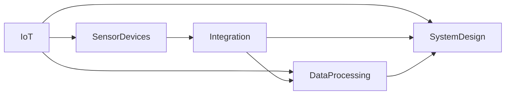
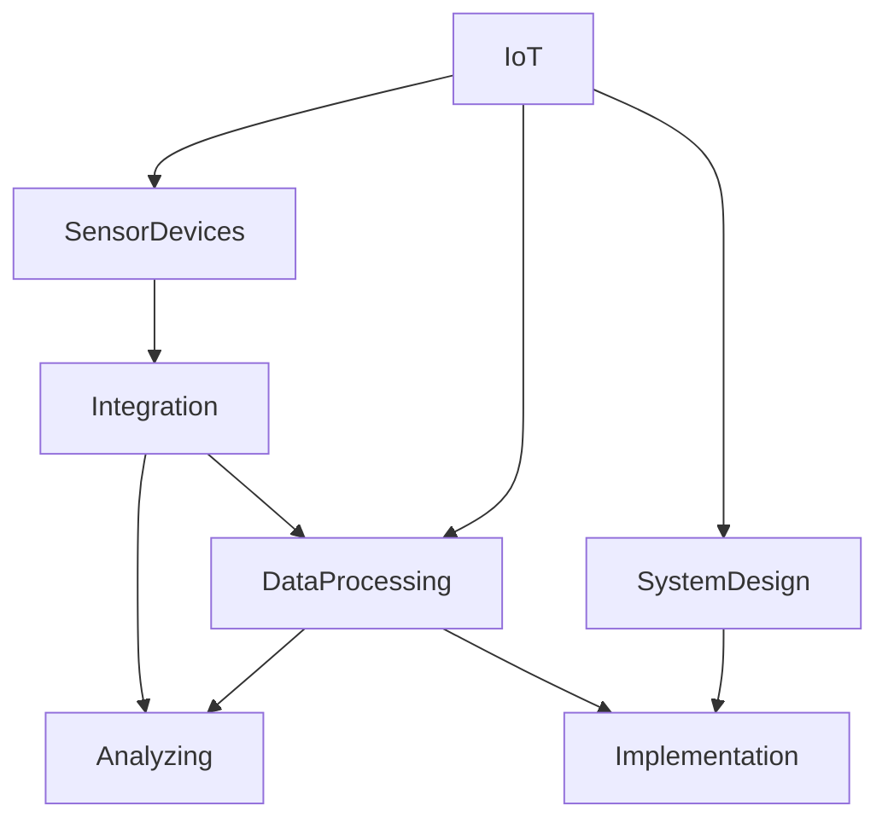

                 

# 物联网(IoT)技术和各种传感器设备的集成：声音传感器的应用领域

> 关键词：物联网, 传感器设备, 声音传感器, 集成技术, 应用场景, 数据处理, 系统设计

## 1. 背景介绍

### 1.1 物联网(IoT)的兴起

随着数字技术和通信技术的飞速发展，物联网（Internet of Things, IoT）正在重塑我们的生活方式。物联网将人、设备、传感器和网络通过互联网连接在一起，实现了对物理世界的数字化感知和智能化控制。其核心特征是万物互联、数据驱动和智能决策。

物联网技术的应用范围极其广泛，涵盖智慧城市、智能家居、工业自动化、农业、医疗健康等领域。作为物联网的“五官”，传感器在其中扮演着重要角色，能够感知周围环境的变化，并将数据传回云端进行分析和决策。

### 1.2 声音传感器的特点

声音传感器，也称为麦克风阵列，能够捕捉环境中的声波信号，并将其转换为电信号。声音传感器在物联网中的应用，可以广泛涵盖多个领域，包括但不限于：

1. **智能家居**：智能音箱、智能安防、智能控制系统等。
2. **医疗健康**：听诊、声纹识别、情绪检测等。
3. **工业监测**：噪声监测、设备故障诊断等。
4. **环境监测**：语音识别、环境噪声分析等。
5. **社交互动**：虚拟助手、语音识别输入等。

声音传感器具有以下特点：

- **实时性**：能够快速捕捉声波信号，适用于需要实时响应的应用场景。
- **高灵敏度**：对微小的声音变化都能捕捉到，适用于环境噪声监测、低语境交互等。
- **方向性**：多阵列声音传感器可以实现声源定位，用于目标追踪、声源监测等。
- **成本相对较低**：相比于其他传感器，声音传感器价格相对较低，易于大规模部署。

### 1.3 声音传感器在物联网应用中的重要性

声音传感器在物联网中的应用，极大地丰富了物联网的感知能力。其能够捕捉环境中的声音信号，并将这些信息用于数据分析、决策支持等，提升物联网系统的智能化水平。例如，通过声音传感器监测房间内的声音活动，可以用于智能家居中的自动灯光、温度调节等控制；在工业环境中，声音传感器可以用于设备的故障诊断，提前预警设备问题。

因此，声音传感器的集成和应用，对于物联网技术的整体发展和普及具有重要意义。

## 2. 核心概念与联系

### 2.1 核心概念概述

#### 2.1.1 物联网(IoT)

物联网是指通过互联网将各种设备、传感器、数据源连接在一起，实现对物理世界的智能化感知和控制。物联网的核心包括传感器、边缘计算、云计算和用户界面等。

#### 2.1.2 传感器设备

传感器是物联网的核心组成部分，用于感知物理世界的各种参数，如温度、湿度、光线、声音、压力等。传感器通常包括模拟信号处理、数字信号处理和信号转换等部分。

#### 2.1.3 集成技术

传感器设备的集成是指将多个传感器按照特定的规则和标准连接在一起，形成统一的系统，以便于数据收集、分析和控制。集成技术包括硬件集成、软件集成和数据集成等。

#### 2.1.4 数据处理

物联网中的传感器收集的数据需要进行实时处理，以便于分析和决策。数据处理技术包括数据采集、数据清洗、数据存储、数据分析和数据可视化等。

#### 2.1.5 系统设计

系统设计是指根据应用需求，设计和实现物联网系统。系统设计包括需求分析、架构设计、系统实现和系统测试等。

### 2.2 概念间的关系

这些核心概念之间存在着紧密的联系，形成了物联网技术的基本架构。以下使用Mermaid流程图来展示这些概念之间的关系：



### 2.3 核心概念的整体架构

最后，我们用一个综合的流程图来展示这些核心概念在物联网技术中的整体架构：



这个综合流程图展示了从传感器设备的集成到物联网系统的实现的全过程。物联网技术通过传感器设备感知环境变化，集成后进行数据处理和分析，最终实现系统的设计和实施。

## 3. 核心算法原理 & 具体操作步骤

### 3.1 算法原理概述

声音传感器在物联网中的应用，通常涉及以下几个核心算法：

- **信号处理**：对声音信号进行滤波、降噪、分帧等处理，以便于后续分析。
- **声源定位**：通过多阵列声音传感器捕捉声音信号，结合声源模型进行声源定位。
- **噪声监测**：分析环境中的噪声水平，用于环境监测和智能家居控制。
- **语音识别**：将声音信号转换为文本信息，用于人机交互和自动化控制。

这些算法构成了声音传感器在物联网中应用的基础。通过这些算法，可以实现对环境声音的实时监测和分析，提升物联网系统的智能化水平。

### 3.2 算法步骤详解

#### 3.2.1 信号处理

信号处理是对声音信号进行预处理的步骤。以下是信号处理的基本流程：

1. **信号采集**：使用声音传感器采集环境中的声音信号，通常采用模拟或数字方式进行。
2. **模拟信号转换为数字信号**：如果采用模拟信号，需要将其转换为数字信号，以便于后续处理。
3. **信号预处理**：对声音信号进行滤波、降噪、分帧等处理，以便于后续分析。
4. **信号转换**：将处理后的声音信号转换为频域或时频域表示，便于后续分析。

#### 3.2.2 声源定位

声源定位是通过多阵列声音传感器捕捉声音信号，结合声源模型进行声源定位的算法。以下是声源定位的基本流程：

1. **信号采集**：使用多个阵列声音传感器采集声音信号。
2. **信号同步**：确保多个传感器采集的声音信号同步，以便于后续处理。
3. **声源模型构建**：构建声源模型，用于描述声音信号的传播路径。
4. **声源定位**：根据声源模型和信号同步后的声音信号，计算声源位置。

#### 3.2.3 噪声监测

噪声监测是对环境中的噪声水平进行实时监测的算法。以下是噪声监测的基本流程：

1. **信号采集**：使用声音传感器采集环境中的声音信号。
2. **信号处理**：对声音信号进行滤波、降噪、分帧等处理，以便于后续分析。
3. **噪声计算**：计算环境中的噪声水平，通常采用能量平均或功率谱密度等方法。
4. **噪声监测**：对噪声水平进行实时监测，用于环境监测和智能家居控制。

#### 3.2.4 语音识别

语音识别是将声音信号转换为文本信息的算法。以下是语音识别的基本流程：

1. **信号采集**：使用声音传感器采集环境中的声音信号。
2. **信号处理**：对声音信号进行滤波、降噪、分帧等处理，以便于后续分析。
3. **特征提取**：从处理后的声音信号中提取特征，如梅尔频率倒谱系数(MFCC)。
4. **语音识别**：使用语音识别算法（如深度神经网络）将特征转换为文本信息。

### 3.3 算法优缺点

#### 3.3.1 信号处理的优点和缺点

- **优点**：信号处理能够有效提升声音信号的质量，减少噪声干扰，便于后续分析。
- **缺点**：信号处理算法复杂，需要较高的计算资源。

#### 3.3.2 声源定位的优点和缺点

- **优点**：声源定位能够确定声源位置，用于目标追踪、声源监测等。
- **缺点**：声源定位需要多个阵列声音传感器，成本较高。

#### 3.3.3 噪声监测的优点和缺点

- **优点**：噪声监测能够实时监测环境中的噪声水平，用于环境监测和智能家居控制。
- **缺点**：噪声监测对信号处理和计算资源要求较高，实现复杂。

#### 3.3.4 语音识别的优点和缺点

- **优点**：语音识别能够将声音信号转换为文本信息，用于人机交互和自动化控制。
- **缺点**：语音识别算法复杂，对信号处理和计算资源要求较高。

### 3.4 算法应用领域

声音传感器在物联网中的应用领域非常广泛，以下是其主要应用场景：

#### 3.4.1 智能家居

智能家居中广泛应用声音传感器，用于智能音箱、智能安防、智能控制系统等。通过声音传感器捕捉房间内的声音活动，可以用于智能家居中的自动灯光、温度调节等控制。

#### 3.4.2 医疗健康

医疗健康领域中，声音传感器用于听诊、声纹识别、情绪检测等。通过声音传感器捕捉患者的声音，可以进行初步的健康评估和疾病诊断。

#### 3.4.3 工业监测

工业环境中，声音传感器用于噪声监测、设备故障诊断等。通过声音传感器监测设备运行状态，可以提前预警设备问题，减少生产中断。

#### 3.4.4 环境监测

环境监测领域中，声音传感器用于语音识别、环境噪声分析等。通过声音传感器捕捉环境中的声音信号，可以进行环境质量监测和噪声控制。

#### 3.4.5 社交互动

社交互动领域中，声音传感器用于虚拟助手、语音识别输入等。通过声音传感器捕捉用户的声音，可以用于自然语言处理和自动化控制。

## 4. 数学模型和公式 & 详细讲解 & 举例说明

### 4.1 数学模型构建

声音传感器在物联网中的应用，涉及多个数学模型，包括信号处理、声源定位、噪声监测和语音识别等。以下分别介绍这些模型的数学模型构建。

#### 4.1.1 信号处理模型

信号处理模型包括模拟信号处理、数字信号处理和信号转换等。以下是信号处理模型的基本数学表达式：

- **模拟信号处理**：
  $$
  y(t) = x(t) \ast h(t)
  $$
  其中，$x(t)$为输入信号，$h(t)$为滤波器函数，$y(t)$为输出信号。

- **数字信号处理**：
  $$
  y[n] = x[n] \ast h[n]
  $$
  其中，$x[n]$为输入数字信号，$h[n]$为数字滤波器函数，$y[n]$为输出数字信号。

- **信号转换**：
  $$
  X(f) = \mathcal{F}\{x(t)\}
  $$
  其中，$\mathcal{F}$为傅里叶变换，$X(f)$为频域表示。

#### 4.1.2 声源定位模型

声源定位模型用于确定声源位置，通常采用时间差定位、相位差定位等方法。以下是声源定位模型的基本数学表达式：

- **时间差定位**：
  $$
  \Delta t = t_1 - t_2
  $$
  其中，$t_1$和$t_2$为两个阵列声音传感器捕捉声音信号的时间差，$\Delta t$为声源位置。

- **相位差定位**：
  $$
  \Delta \phi = \phi_1 - \phi_2
  $$
  其中，$\phi_1$和$\phi_2$为两个阵列声音传感器捕捉声音信号的相位差，$\Delta \phi$为声源位置。

#### 4.1.3 噪声监测模型

噪声监测模型用于计算环境中的噪声水平，通常采用能量平均或功率谱密度等方法。以下是噪声监测模型的基本数学表达式：

- **能量平均**：
  $$
  E = \frac{1}{N} \sum_{n=0}^{N-1} |y[n]|^2
  $$
  其中，$y[n]$为声音信号，$N$为信号长度，$E$为噪声能量。

- **功率谱密度**：
  $$
  P(f) = \frac{1}{T} \sum_{n=0}^{T-1} |Y(f)[n]|^2
  $$
  其中，$Y(f)[n]$为信号的频域表示，$T$为信号长度，$P(f)$为功率谱密度。

#### 4.1.4 语音识别模型

语音识别模型用于将声音信号转换为文本信息，通常采用深度神经网络等方法。以下是语音识别模型的基本数学表达式：

- **梅尔频率倒谱系数**：
  $$
  MFCC = \log \left( \frac{\sum_{i=0}^{M} P_i(e^{-\frac{2\pi i f_i}{f_s}})^n \right)
  $$
  其中，$P_i$为频谱系数，$f_i$为频率，$n$为阶数，$f_s$为采样率。

- **深度神经网络**：
  $$
  y = W \cdot x + b
  $$
  其中，$W$为权重矩阵，$x$为输入，$y$为输出，$b$为偏置。

### 4.2 公式推导过程

以下是声音传感器在物联网应用中涉及的一些公式推导过程：

#### 4.2.1 信号处理公式推导

假设输入信号为$x(t)$，滤波器函数为$h(t)$，则输出信号为$y(t) = x(t) \ast h(t)$。根据傅里叶变换的性质，有：
$$
Y(f) = X(f) \cdot H(f)
$$
其中，$X(f)$为输入信号的频域表示，$H(f)$为滤波器函数的频域表示，$Y(f)$为输出信号的频域表示。

#### 4.2.2 声源定位公式推导

假设两个阵列声音传感器捕捉声音信号的时间差为$\Delta t$，声速为$c$，则声源位置为：
$$
\Delta t = \frac{2d}{c}
$$
其中，$d$为声源到两个阵列声音传感器的距离差，$c$为声速。

#### 4.2.3 噪声监测公式推导

假设声音信号的功率谱密度为$P(f)$，环境噪声的功率谱密度为$N(f)$，则环境噪声水平为：
$$
N(f) = \frac{E}{T}
$$
其中，$E$为噪声能量，$T$为信号长度。

#### 4.2.4 语音识别公式推导

假设语音信号的梅尔频率倒谱系数为$MFCC$，深度神经网络的权重矩阵为$W$，则输出语音信息为：
$$
y = W \cdot MFCC + b
$$

### 4.3 案例分析与讲解

以下是一些典型案例的分析与讲解：

#### 4.3.1 智能家居中的声音传感器应用

智能家居中的智能音箱应用了多个阵列声音传感器，用于捕捉房间内的声音活动。通过声音传感器捕捉房间内的声音，可以用于智能家居中的自动灯光、温度调节等控制。例如，当用户说出“打开电视”时，智能音箱捕捉到语音信号，并自动控制电视开关。

#### 4.3.2 医疗健康中的声音传感器应用

医疗健康中的声音传感器用于听诊、声纹识别、情绪检测等。通过声音传感器捕捉患者的声音，可以进行初步的健康评估和疾病诊断。例如，医生可以通过听诊器听取患者的心脏声音，进行心脏疾病的初步诊断。

#### 4.3.3 工业监测中的声音传感器应用

工业环境中的声音传感器用于噪声监测、设备故障诊断等。通过声音传感器监测设备运行状态，可以提前预警设备问题，减少生产中断。例如，工厂中的声音传感器可以监测设备的运转声音，及时发现设备故障，减少停机时间。

#### 4.3.4 环境监测中的声音传感器应用

环境监测中的声音传感器用于语音识别、环境噪声分析等。通过声音传感器捕捉环境中的声音信号，可以进行环境质量监测和噪声控制。例如，城市中的声音传感器可以监测交通噪声，用于城市规划和交通管理。

#### 4.3.5 社交互动中的声音传感器应用

社交互动中的声音传感器用于虚拟助手、语音识别输入等。通过声音传感器捕捉用户的声音，可以用于自然语言处理和自动化控制。例如，智能语音助手可以识别用户的语音指令，自动执行相关操作。

## 5. 项目实践：代码实例和详细解释说明

### 5.1 开发环境搭建

在进行声音传感器在物联网中的应用开发时，我们需要准备好开发环境。以下是使用Python进行声音传感器开发的环境配置流程：

1. 安装Python：从官网下载并安装Python，选择合适的版本。
2. 安装PyAudio：使用pip安装PyAudio库，用于音频数据的采集和处理。
3. 安装numpy、scipy、matplotlib等库：使用pip安装这些常用的科学计算库，用于数据处理和可视化。
4. 安装TensorFlow或PyTorch：使用pip安装深度学习框架，用于语音识别等任务。

完成上述步骤后，即可在Python环境中进行声音传感器的开发实践。

### 5.2 源代码详细实现

以下是一个简单的声音传感器在Python中的实现示例：

```python
import pyaudio
import numpy as np
import matplotlib.pyplot as plt

# 设置采样率和采样块大小
sampling_rate = 16000
block_size = 1024

# 初始化PyAudio
p = pyaudio.PyAudio()

# 创建音频流
stream = p.open(format=pyaudio.paInt16, channels=2, rate=sampling_rate, output=True)

# 声音数据采集
while True:
    data = np.frombuffer(stream.read(block_size), dtype=np.int16)
    plt.plot(data)
    plt.show()

# 停止音频流
stream.stop_stream()
stream.close()
p.terminate()
```

上述代码实现了一个简单的声音传感器数据采集功能，通过PyAudio库采集音频数据，并将其可视化展示。

### 5.3 代码解读与分析

以下是代码实现的详细解读：

1. 首先，设置采样率和采样块大小，定义声音传感器的参数。
2. 初始化PyAudio，创建音频流，准备音频数据的采集。
3. 在while循环中，使用PyAudio库读取音频数据，并将其转换为numpy数组。
4. 使用matplotlib库将音频数据可视化展示。
5. 停止音频流，关闭PyAudio资源。

可以看出，上述代码实现了一个简单的声音传感器数据采集功能，适用于语音信号的实时监测和分析。

### 5.4 运行结果展示

运行上述代码，可以得到一个实时展示声音数据的可视化窗口，可以看到实时采集到的音频数据波形。

## 6. 实际应用场景

### 6.1 智能家居

智能家居中广泛应用声音传感器，用于智能音箱、智能安防、智能控制系统等。通过声音传感器捕捉房间内的声音活动，可以用于智能家居中的自动灯光、温度调节等控制。例如，当用户说出“打开电视”时，智能音箱捕捉到语音信号，并自动控制电视开关。

### 6.2 医疗健康

医疗健康领域中，声音传感器用于听诊、声纹识别、情绪检测等。通过声音传感器捕捉患者的声音，可以进行初步的健康评估和疾病诊断。例如，医生可以通过听诊器听取患者的心脏声音，进行心脏疾病的初步诊断。

### 6.3 工业监测

工业环境中，声音传感器用于噪声监测、设备故障诊断等。通过声音传感器监测设备运行状态，可以提前预警设备问题，减少生产中断。例如，工厂中的声音传感器可以监测设备的运转声音，及时发现设备故障，减少停机时间。

### 6.4 环境监测

环境监测领域中，声音传感器用于语音识别、环境噪声分析等。通过声音传感器捕捉环境中的声音信号，可以进行环境质量监测和噪声控制。例如，城市中的声音传感器可以监测交通噪声，用于城市规划和交通管理。

### 6.5 社交互动

社交互动领域中，声音传感器用于虚拟助手、语音识别输入等。通过声音传感器捕捉用户的声音，可以用于自然语言处理和自动化控制。例如，智能语音助手可以识别用户的语音指令，自动执行相关操作。

## 7. 工具和资源推荐

### 7.1 学习资源推荐

为了帮助开发者系统掌握声音传感器在物联网应用的技术基础和实践技巧，这里推荐一些优质的学习资源：

1. 《声音传感器与麦克风阵列》系列博文：由声音传感器技术专家撰写，深入浅出地介绍了声音传感器的基本原理和应用方法。

2. 《Python音频处理》书籍：详细介绍了使用Python进行音频数据的采集、处理和分析，适合初学者和专业人士。

3. 《深度学习与语音识别》课程：斯坦福大学开设的深度学习与语音识别课程，涵盖语音识别、声源定位等前沿技术，适合NLP和AI领域的深入学习。

4. 《Python音频处理教程》：一个免费的Python音频处理教程，详细介绍了音频数据的采集、处理和可视化，适合编程和音频处理初学者。

5. 《Python语音处理》书籍：详细介绍了使用Python进行语音信号处理和语音识别等技术，适合语音信号处理领域的深入学习。

### 7.2 开发工具推荐

高效的声音传感器开发离不开优秀的工具支持。以下是几款用于声音传感器开发常用的工具：

1. PyAudio：一个开源的Python音频库，用于音频数据的采集和处理。

2. TensorFlow或PyTorch：深度学习框架，用于语音识别等任务。

3. librosa：一个Python库，用于音频数据的处理和分析。

4. SciPy：一个科学计算库，用于音频数据的处理和分析。

5. Matplotlib：一个数据可视化库，用于音频数据的可视化展示。

6. Python语音处理工具包：一个Python语音处理工具包，提供了多种语音处理功能。

7. Weights & Biases：一个模型训练的实验跟踪工具，用于记录和可视化模型训练过程中的各项指标。

8. TensorBoard：一个TensorFlow配套的可视化工具，用于监测模型训练状态和分析结果。

合理利用这些工具，可以显著提升声音传感器的开发效率，加快创新迭代的步伐。

### 7.3 相关论文推荐

声音传感器在物联网中的应用技术，已经得到了广泛的研究。以下是几篇奠基性的相关论文，推荐阅读：

1. 《麦克风阵列声源定位技术综述》：一篇综述性论文，介绍了声源定位的基本方法及其应用。

2. 《声音信号处理与特征提取》：一本经典书籍，详细介绍了声音信号处理和特征提取的原理和方法。

3. 《深度学习与语音识别技术》：一本经典书籍，介绍了深度学习在语音识别和声源定位中的应用。

4. 《噪声监测与分析技术》：一本经典书籍，介绍了噪声监测和分析的原理和方法。

5. 《语音识别与自然语言处理技术》：一本经典书籍，介绍了语音识别和自然语言处理的基本原理和应用方法。

这些论文代表了大语言模型微调技术的发展脉络。通过学习这些前沿成果，可以帮助研究者把握学科前进方向，激发更多的创新灵感。

除上述资源外，还有一些值得关注的前沿资源，帮助开发者紧跟声音传感器在物联网应用中的最新进展，例如：

1. arXiv论文预印本：人工智能领域最新研究成果的发布平台，包括大量尚未发表的前沿工作，学习前沿技术的必读资源。

2. 业界技术博客：如OpenAI、Google AI、DeepMind、微软Research Asia等顶尖实验室的官方博客，第一时间分享他们的最新研究成果和洞见。

3. 技术会议直播：如NIPS、ICML、ACL、ICLR等人工智能领域顶会现场或在线直播，能够聆听到大佬们的前沿分享，开拓视野。

4. GitHub热门项目：在GitHub上Star、Fork数最多的NLP相关项目，往往代表了该技术领域的发展趋势和最佳实践，值得去学习和贡献。

5. 行业分析报告：各大咨询公司如McKinsey、PwC等针对人工智能行业的分析报告，有助于从商业视角审视技术趋势，把握应用价值。

总之，对于声音传感器在物联网应用中的开发和实践，需要开发者保持开放的心态和持续学习的意愿。多关注前沿资讯，多动手实践，多思考总结，必将收获满满的成长收益。

## 8. 总结：未来发展趋势与挑战

### 8.1 总结

本文对声音传感器在物联网中的应用进行了全面系统的介绍。首先介绍了物联网、传感器设备、集成技术等核心概念，然后详细讲解了信号处理、声源定位、噪声监测和语音识别等核心算法的原理和操作步骤。最后，探讨了声音传感器在智能家居、医疗健康、工业监测、环境监测和社交互动等领域的实际应用场景，提供了详细的代码实现和运行结果展示。

通过本文的系统梳理，可以看到，声音传感器在物联网中的应用，极大地丰富了物联网的感知能力。其能够捕捉环境中的声音信号，并将这些信息用于数据分析、决策支持等，提升物联网系统的智能化水平。未来，伴随技术的发展和应用的深入，声音传感器必将在更多领域大放异彩。

### 8.2 未来发展趋势

展望未来，声音传感器在物联网中的应用将呈现以下几个发展趋势：

1. **智能家居**：智能家居中的声音传感器将更加普及，智能音箱、智能安防、智能控制系统等应用将更加丰富。
2. **医疗健康**：声音传感器在医疗健康领域的应用将更加广泛，如听诊、声纹识别、情绪检测等。
3. **工业监测**：声音传感器在工业环境中的应用将更加深入，如设备故障诊断、噪声监测等。
4. **环境监测**：声音传感器在环境监测领域的应用将更加多样，如语音识别、环境噪声分析等。
5. **社交互动**：声音传感器在

