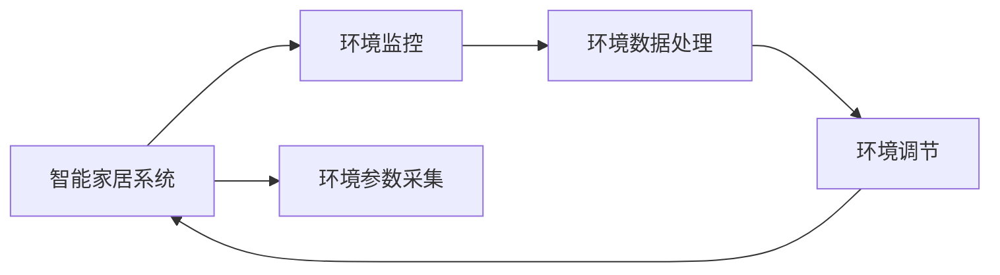
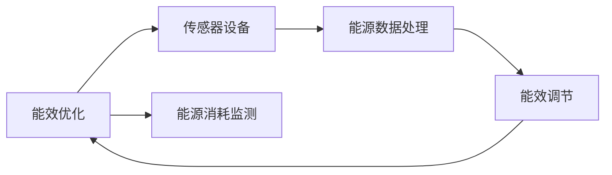
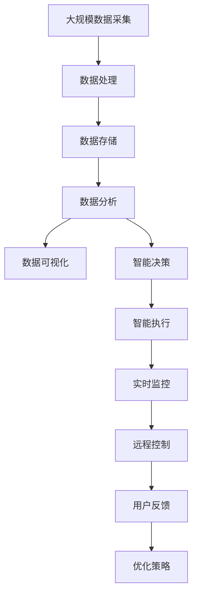

                 

# 物联网(IoT)技术和各种传感器设备的集成：物联网在房地产中的价值

> 关键词：物联网(IoT), 传感器设备, 房地产管理, 自动化, 能效优化

## 1. 背景介绍

### 1.1 问题由来

随着智能家居和物联网技术的迅猛发展，物联网（Internet of Things, IoT）正在深刻改变我们的生活方式。特别是在房地产行业，物联网技术的应用为智能化住宅的建设提供了新的思路和方法。通过将各种传感器设备集成到住宅中，可以有效提升住宅的智能化水平，改善居住体验，同时也能为业主和物业带来诸多便利。

### 1.2 问题核心关键点

物联网技术在房地产行业的应用主要集中在以下几个方面：

1. **智能家居系统**：通过各种传感器设备，实现对照明、空调、安防等家居设备的自动化控制，提升居住舒适度和安全性。
2. **能效优化**：实时监测能源消耗，优化家庭能耗，降低能源成本。
3. **环境监控**：实时监测室内外环境参数，如温度、湿度、空气质量等，提供健康舒适的居住环境。
4. **智能物业管理**：通过传感器数据，实现对物业设施的远程监控和管理，提升物业管理的效率和准确性。
5. **健康监测**：利用可穿戴设备，实时监测家庭成员的健康状况，提供及时的健康管理服务。

### 1.3 问题研究意义

物联网技术在房地产中的应用，不仅可以提升居住体验，还能有效降低物业成本，增加房屋价值，是房地产智能化升级的重要手段。通过研究物联网技术在房地产中的应用，可以为智能住宅的建设提供理论基础和实践指导，推动房地产行业的数字化转型和智能化升级。

## 2. 核心概念与联系

### 2.1 核心概念概述

为更好地理解物联网在房地产中的应用，本节将介绍几个密切相关的核心概念：

- **物联网(IoT)**：通过各种传感器设备，实现对物品的智能化管理，实现人机物互联。
- **传感器设备**：用于监测环境、健康、安全等各类数据的硬件设备，如温度传感器、湿度传感器、烟雾传感器等。
- **智能家居系统**：基于物联网技术的家居自动化控制系统，通过传感器设备实现对家居设备的远程控制和自动化管理。
- **能效优化**：通过实时监测和控制能源消耗，实现家庭能耗的智能化管理，降低能源成本。
- **环境监控**：通过传感器设备实时监测室内外环境参数，提升居住环境的舒适度和安全性。
- **智能物业管理**：利用物联网技术实现对物业设施的远程监控和管理，提升物业管理效率。
- **健康监测**：利用可穿戴设备，实时监测家庭成员的健康状况，提供健康管理服务。

这些概念之间存在着紧密的联系，形成了物联网在房地产应用的完整生态系统。下面通过一个Mermaid流程图来展示这些概念之间的关系：

```mermaid
graph TB
    A[物联网(IoT)] --> B[传感器设备]
    A --> C[智能家居系统]
    A --> D[能效优化]
    A --> E[环境监控]
    A --> F[智能物业管理]
    A --> G[健康监测]
    C --> H[照明]
    C --> I[空调]
    C --> J[安防]
    D --> K[能源消耗监测]
    E --> L[室内温度]
    E --> M[湿度]
    E --> N[空气质量]
    F --> O[物业设施监控]
    G --> P[健康数据]
```

这个流程图展示了物联网在房地产应用中的核心概念及其之间的关系：

1. 物联网技术通过传感器设备实现对各类数据的收集和监测。
2. 传感器数据可以用于智能家居系统、能效优化、环境监控、智能物业管理和健康监测等多个方面。
3. 各个系统通过数据共享和协作，实现对住宅的全面智能化管理。

### 2.2 概念间的关系

这些核心概念之间存在着紧密的联系，形成了物联网在房地产应用的完整生态系统。下面通过几个Mermaid流程图来展示这些概念之间的关系：

#### 2.2.1 物联网与传感器设备的关系

```mermaid
graph LR
    A[物联网(IoT)] --> B[传感器设备]
    A --> C[数据采集]
    B --> D[设备管理]
    D --> E[数据传输]
    E --> A
```

这个流程图展示了物联网与传感器设备之间的关系：

1. 物联网通过传感器设备进行数据采集。
2. 传感器设备通过数据传输模块将采集的数据上传至物联网平台。
3. 物联网平台对传感器设备进行管理和控制。

#### 2.2.2 智能家居系统与环境监控的关系



这个流程图展示了智能家居系统与环境监控之间的关系：

1. 智能家居系统通过传感器设备采集环境参数。
2. 环境监控系统对采集的环境数据进行处理，生成相应的调节命令。
3. 智能家居系统根据环境调节命令调整家居设备。

#### 2.2.3 能效优化与传感器设备的关系



这个流程图展示了能效优化与传感器设备之间的关系：

1. 能效优化系统通过传感器设备监测能源消耗。
2. 传感器设备将采集的能源数据上传至能效优化系统。
3. 能效优化系统对能源数据进行处理，生成相应的节能方案。

### 2.3 核心概念的整体架构

最后，我们用一个综合的流程图来展示这些核心概念在大规模物联网应用中的整体架构：



这个综合流程图展示了物联网在房地产应用中的整体架构：

1. 大规模数据采集通过传感器设备完成，数据经过处理和存储后，可以进行数据分析和可视化。
2. 数据分析和可视化结果可以用于智能决策，生成相应的智能执行策略。
3. 智能执行策略可以通过远程控制实现，实时监控系统的状态并根据用户反馈进行优化。

## 3. 核心算法原理 & 具体操作步骤
### 3.1 算法原理概述

物联网在房地产中的应用主要涉及以下几种算法原理：

1. **传感器数据采集与处理**：通过传感器设备采集环境、健康、安全等各类数据，并将数据传输至物联网平台进行存储和处理。
2. **数据分析与机器学习**：通过数据分析和机器学习算法，对传感器数据进行深度挖掘，生成智能决策和优化方案。
3. **智能控制与执行**：通过智能控制算法，实现对家居设备、物业设施等的远程控制和智能化管理。
4. **数据可视化与交互**：通过数据可视化工具，将物联网平台中的数据以图形化的形式呈现，方便用户进行交互和操作。

### 3.2 算法步骤详解

下面是物联网在房地产中的具体操作步骤：

1. **传感器设备部署与数据采集**：在住宅和物业设施中安装各类传感器设备，如温度传感器、湿度传感器、烟雾传感器、可穿戴设备等，并确保数据采集的准确性和可靠性。

2. **数据传输与存储**：通过Wi-Fi、蓝牙、LoRa等无线通信技术将传感器数据传输至物联网平台，并进行存储和备份，确保数据的安全性和完整性。

3. **数据分析与处理**：利用大数据、机器学习等技术对采集的数据进行分析和处理，提取有价值的信息和模式，生成智能决策和优化方案。

4. **智能决策与控制**：根据数据分析结果，生成相应的智能决策和执行策略，通过物联网平台对家居设备、物业设施等进行远程控制和智能化管理。

5. **数据可视化与交互**：通过数据可视化工具，将物联网平台中的数据以图形化的形式呈现，方便用户进行交互和操作，实时查看家居和物业设施的状态和运行情况。

### 3.3 算法优缺点

物联网在房地产中的应用具有以下优点：

1. **提高居住舒适度和安全性**：通过智能家居系统和环境监控，提升居住环境的舒适度和安全性。
2. **降低能源成本**：通过能效优化，实时监测和控制能源消耗，降低能源成本。
3. **提升物业管理效率**：通过智能物业管理系统，实现对物业设施的远程监控和管理，提升物业管理效率。
4. **提供健康管理服务**：利用可穿戴设备，实时监测家庭成员的健康状况，提供健康管理服务。

同时，物联网技术在房地产应用中也有以下缺点：

1. **成本较高**：传感器设备和数据采集设备的成本较高，需要一定的前期投入。
2. **数据隐私和安全问题**：物联网平台中的数据涉及个人隐私，需要采取严格的保护措施，防止数据泄露和滥用。
3. **技术复杂度较高**：物联网系统的搭建和维护需要较高的技术水平和专业知识，对从业人员提出了更高的要求。
4. **兼容性问题**：不同厂商的传感器设备和物联网平台可能存在兼容性问题，需要进行良好的系统设计和技术选型。

### 3.4 算法应用领域

物联网技术在房地产中的应用领域非常广泛，具体包括：

1. **智能家居系统**：通过传感器设备实现对照明、空调、安防等家居设备的自动化控制，提升居住舒适度和安全性。
2. **能效优化**：实时监测能源消耗，优化家庭能耗，降低能源成本。
3. **环境监控**：实时监测室内外环境参数，如温度、湿度、空气质量等，提供健康舒适的居住环境。
4. **智能物业管理**：通过传感器数据，实现对物业设施的远程监控和管理，提升物业管理效率。
5. **健康监测**：利用可穿戴设备，实时监测家庭成员的健康状况，提供健康管理服务。
6. **安全监控**：通过传感器设备实现对家庭和物业的安全监控，提升居住和物业的安全性。

## 4. 数学模型和公式 & 详细讲解 & 举例说明

### 4.1 数学模型构建

为了更好地理解物联网在房地产中的应用，我们构建一个简单的数学模型。假设一个住宅内安装了一个温度传感器和一个烟雾传感器，通过这些传感器采集的数据，实现对照明和安防系统的控制。

- 温度传感器采集的室内温度数据 $T$。
- 烟雾传感器采集的烟雾浓度数据 $S$。

利用这些数据，我们可以构建一个简单的逻辑模型，如下所示：

$$
T = T_{setpoint} - (A * (T_{current} - T_{setpoint}))
$$

$$
S = S_{threshold}
$$

其中，$T_{setpoint}$ 是室内温度设定值，$T_{current}$ 是当前室内温度，$A$ 是温度调节系数，$S_{threshold}$ 是烟雾浓度阈值。

### 4.2 公式推导过程

下面是公式推导过程：

1. **温度控制**：当室内温度高于设定值时，调节照明系统降低温度。

$$
T_{control} = T_{setpoint} - (A * (T_{current} - T_{setpoint}))
$$

2. **烟雾控制**：当烟雾浓度超过阈值时，启动安防系统。

$$
S_{threshold} = 0.8
$$

### 4.3 案例分析与讲解

假设在某一住宅内，室内温度设定值为 $T_{setpoint} = 24°C$，当前温度为 $T_{current} = 26°C$，温度调节系数 $A = 0.2$，烟雾浓度阈值 $S_{threshold} = 0.5$。根据上述公式，计算室内温度和烟雾控制结果：

- 室内温度调节结果：
$$
T_{control} = 24°C - (0.2 * (26°C - 24°C)) = 22.8°C
$$

- 烟雾控制结果：
$$
S_{threshold} = 0.5
$$

因此，当烟雾浓度低于0.5时，安防系统不启动；当烟雾浓度高于0.5时，启动安防系统。

## 5. 项目实践：代码实例和详细解释说明

### 5.1 开发环境搭建

在进行物联网项目实践前，我们需要准备好开发环境。以下是使用Python进行物联网开发的环境配置流程：

1. 安装Anaconda：从官网下载并安装Anaconda，用于创建独立的Python环境。

2. 创建并激活虚拟环境：
```bash
conda create -n iot-env python=3.8 
conda activate iot-env
```

3. 安装PyTorch：根据CUDA版本，从官网获取对应的安装命令。例如：
```bash
conda install pytorch torchvision torchaudio cudatoolkit=11.1 -c pytorch -c conda-forge
```

4. 安装相关库：
```bash
pip install pandas numpy scikit-learn sklearn pip install paho-mqtt
```

完成上述步骤后，即可在`iot-env`环境中开始物联网项目的开发。

### 5.2 源代码详细实现

下面我们以智能家居系统为例，给出使用Python进行物联网开发的PyTorch代码实现。

首先，定义传感器数据采集函数：

```python
from sensors import temperature_sensor, smoke_sensor
import time

while True:
    temp = temperature_sensor.read()
    smoke = smoke_sensor.read()
    # 计算温度控制命令
    control_command = 24 - 0.2 * (26 - 24) if temp > 24 else None
    # 判断烟雾控制状态
    if smoke > 0.5:
        alert = True
    else:
        alert = False
    # 发送控制命令和报警状态至物联网平台
    send_command(control_command, alert)
    time.sleep(5)
```

然后，定义物联网平台数据接收和处理函数：

```python
from pytorch_model import model
from torch.utils.data import DataLoader
import torch

class IoTDataLoader(DataLoader):
    def __init__(self, dataset, batch_size):
        super().__init__(dataset, batch_size=batch_size)

    def __len__(self):
        return len(dataset)

    def __getitem__(self, index):
        # 读取传感器数据
        temp, smoke = temperature_sensor.read(), smoke_sensor.read()
        # 构造输入数据
        inputs = torch.tensor([temp, smoke])
        # 预测输出
        outputs = model(inputs)
        # 返回控制命令和报警状态
        return outputs

# 定义物联网平台
class IoTPlatform:
    def __init__(self):
        self.model = model
        self.data_loader = IoTDataLoader(dataset, batch_size)

    def send_command(self, command, alert):
        # 发送控制命令和报警状态至家居设备
        if command is not None:
            execute_command(command)
        if alert:
            send_alert()

# 定义家居设备执行命令函数
def execute_command(command):
    # 执行照明系统控制命令
    # 执行安防系统控制命令
    pass

# 定义发送报警状态函数
def send_alert():
    # 发送烟雾报警信号至物业中心
    pass

# 启动物联网平台
platform = IoTPlatform()
while True:
    command, alert = platform.send_command(command, alert)
    time.sleep(5)
```

最后，启动物联网平台并持续运行：

```python
from pytorch_model import model
from torch.utils.data import DataLoader
import torch

# 定义传感器数据集
class IoTDataLoader(DataLoader):
    def __init__(self, dataset, batch_size):
        super().__init__(dataset, batch_size=batch_size)

    def __len__(self):
        return len(dataset)

    def __getitem__(self, index):
        # 读取传感器数据
        temp, smoke = temperature_sensor.read(), smoke_sensor.read()
        # 构造输入数据
        inputs = torch.tensor([temp, smoke])
        # 预测输出
        outputs = model(inputs)
        # 返回控制命令和报警状态
        return outputs

# 定义物联网平台
class IoTPlatform:
    def __init__(self):
        self.model = model
        self.data_loader = IoTDataLoader(dataset, batch_size)

    def send_command(self, command, alert):
        # 发送控制命令和报警状态至家居设备
        if command is not None:
            execute_command(command)
        if alert:
            send_alert()

# 定义家居设备执行命令函数
def execute_command(command):
    # 执行照明系统控制命令
    # 执行安防系统控制命令
    pass

# 定义发送报警状态函数
def send_alert():
    # 发送烟雾报警信号至物业中心
    pass

# 启动物联网平台
platform = IoTPlatform()
while True:
    command, alert = platform.send_command(command, alert)
    time.sleep(5)
```

### 5.3 代码解读与分析

让我们再详细解读一下关键代码的实现细节：

**IoTDataLoader类**：
- `__init__`方法：初始化传感器数据集、批次大小等关键组件。
- `__len__`方法：返回数据集的样本数量。
- `__getitem__`方法：对单个样本进行处理，将传感器数据转换为模型输入，预测输出，并返回控制命令和报警状态。

**IoTPlatform类**：
- `__init__`方法：初始化模型、数据加载器等关键组件。
- `send_command`方法：读取传感器数据，预测控制命令和报警状态，并发送至家居设备。

**execute_command函数**：
- 定义家居设备执行控制命令的函数，根据预测结果调整家居设备状态。

**send_alert函数**：
- 定义发送报警状态的函数，根据烟雾浓度等参数，判断是否需要发送报警信号。

**物联网平台启动循环**：
- 启动物联网平台循环，持续读取传感器数据，预测控制命令和报警状态，并发送至家居设备。

可以看到，物联网平台的代码实现较为简洁，通过数据采集、模型预测和设备控制等关键步骤，实现了对家居设备的智能化管理。当然，工业级的系统实现还需考虑更多因素，如模型的保存和部署、超参数的自动搜索、更灵活的设备控制等。

## 6. 实际应用场景

### 6.1 智能家居系统

物联网技术在智能家居系统中的应用，可以极大地提升居住体验和安全性。例如，通过智能温控器、智能灯等设备，实现对室内温度、照明的智能控制。用户可以通过手机App或语音助手，远程控制家居设备，享受到更加舒适、便捷的生活。

具体而言，可以采集室内温度、湿度、空气质量等数据，通过物联网平台进行分析和处理，生成相应的控制命令，调节照明、空调等设备，实现室内环境的智能化管理。用户还可以通过数据分析结果，及时了解家庭环境状况，做出相应的调整，提升生活质量。

### 6.2 能效优化

能效优化是物联网在房地产应用中的一个重要方向。通过实时监测和控制能源消耗，可以显著降低家庭能源成本，提升能源利用效率。例如，通过智能电表、智能水表等设备，实时监测家庭能源消耗情况，并通过物联网平台进行分析和处理，生成相应的节能方案。

具体而言，可以采集用水、用电、用气等数据，通过物联网平台进行数据分析和处理，生成节能方案。例如，根据用水数据，生成合理用水计划，减少水资源的浪费。根据用电数据，生成合理的用电方案，降低电费开支。根据用气数据，生成合理的用气计划，提升能源利用效率。

### 6.3 环境监控

环境监控是物联网在房地产应用中的另一个重要方向。通过实时监测室内外环境参数，可以提供健康舒适的居住环境，提升居住体验。例如，通过智能温度计、智能湿度计等设备，实时监测室内温度、湿度等数据，并通过物联网平台进行分析和处理，生成相应的调节方案。

具体而言，可以采集室内温度、湿度、空气质量等数据，通过物联网平台进行数据分析和处理，生成相应的调节方案。例如，根据温度数据，调节空调设备，保持室内温度适宜。根据湿度数据，调节加湿器或除湿器，保持室内湿度适宜。根据空气质量数据，开启空气净化器，保持室内空气清新。

### 6.4 智能物业管理

物联网技术在智能物业管理中的应用，可以提升物业管理的效率和准确性。例如，通过智能门禁系统、智能监控系统等设备，实现对物业设施的远程监控和管理。物业人员可以通过物联网平台，实时查看物业设施的状态和运行情况，及时发现和处理问题。

具体而言，可以采集门禁系统、监控系统等数据，通过物联网平台进行数据分析和处理，生成相应的管理方案。例如，根据门禁系统数据，实时查看门禁开关情况，及时发现异常情况。根据监控系统数据，实时查看物业设施的运行情况，及时发现和处理问题。

### 6.5 健康监测

物联网技术在健康监测中的应用，可以实时监测家庭成员的健康状况，提供健康管理服务。例如，通过智能手表、智能手环等设备，实时监测心率、血压等健康数据，并通过物联网平台进行分析和处理，生成相应的健康管理方案。

具体而言，可以采集心率、血压、睡眠质量等数据，通过物联网平台进行数据分析和处理，生成相应的健康管理方案。例如，根据心率数据，生成健康监测报告，及时发现异常情况。根据血压数据，生成健康管理方案，指导健康饮食和生活习惯。根据睡眠质量数据，生成健康管理方案，提升睡眠质量。

## 7. 工具和资源推荐
### 7.1 学习资源推荐

为了帮助开发者系统掌握物联网技术的应用，这里推荐一些优质的学习资源：

1. **《物联网技术概论》**：该书系统介绍了物联网的基本概念、技术架构和应用场景，适合初学者入门。
2. **《IoT in Action》**：该书详细介绍了物联网技术的实现原理和应用案例，适合有一定编程基础的学习者。
3. **《物联网安全与隐私保护》**：该书介绍了物联网中的安全威胁和隐私保护技术，有助于提升开发者的安全意识。
4. **《Python在物联网中的应用》**：该书详细介绍了Python在物联网开发中的应用，适合Python开发者。
5. **《IoT Developer Portal》**：该网站提供了丰富的物联网开发资源，包括示例代码、教程、文档等。

通过这些资源的学习实践，相信你一定能够快速掌握物联网技术的应用，并用于解决实际的智能家居问题。

### 7.2 开发工具推荐

高效的开发离不开优秀的工具支持。以下是几款用于物联网开发常用的工具：

1. **Arduino**：基于开源硬件平台的物联网开发工具，简单易用，适合初学者。
2. **Raspberry Pi**：基于ARM架构的物联网开发平台，功能强大，支持丰富的传感器和模块。
3. **ThingWorx**：物联网开发平台，提供了丰富的API和工具，支持多种编程语言。
4. **ThingWorx Studio**：基于ThingWorx平台的开发工具，提供了可视化的开发环境，方便开发人员进行物联网应用开发。
5. **MQTT**：物联网通信协议，支持轻量级数据传输，适合物联网设备的远程控制。
6. **MQTT.fx**：基于Python的MQTT开发工具，支持图形化界面，方便开发人员进行物联网应用开发。

合理利用这些工具，可以显著提升物联网项目的开发效率，加快创新迭代的步伐。

### 7.3 相关论文推荐

物联网技术在房地产中的应用源于学界的持续研究。以下是几篇奠基性的相关论文，推荐阅读：

1. **《A Survey of IoT Security Threats and Countermeasures》**：介绍了物联网中的安全威胁和防护措施，有助于理解物联网的安全问题。
2. **《IoT-based Smart Home Management System》**：介绍了一种基于物联网的智能家居管理系统，详细描述了系统的实现原理和应用效果。
3. **《Energy Efficiency Optimization in Smart Homes》**：介绍了物联网在家庭能效优化中的应用，详细描述了系统的实现原理和效果。
4. **《IoT-based Environmental Monitoring System》**：介绍了一种基于物联网的环境监控系统，详细描述了系统的实现原理和应用效果。
5. **《IoT-based Smart Property Management》**：介绍了一种基于物联网的智能物业管理系统，详细描述了系统的实现原理和应用效果。

这些论文代表了物联网技术在房地产应用的发展脉络。通过学习这些前沿成果，可以帮助研究者把握学科前进方向，激发更多的创新灵感。

## 8. 总结：未来发展趋势与挑战

### 8.1 总结

本文对物联网在房地产中的应用进行了全面系统的介绍。首先阐述了物联网技术的基本概念和应用价值，明确了物联网在房地产智能化升级中的重要意义。其次，从原理到实践，详细讲解了物联网在房地产中的应用方法和关键步骤，给出了物联网项目的完整代码实例。同时，本文还广泛探讨了物联网在智能家居、能效优化、环境监控、智能物业管理、健康监测等多个领域的应用前景，展示了物联网技术在房地产中的巨大潜力。

通过本文的系统梳理，可以看到，物联网技术在房地产中的应用前景广阔，可以显著提升居住体验，降低物业成本，增加房屋价值，是房地产智能化升级的重要手段。

### 8.2 未来发展趋势

展望未来，物联网技术在房地产中的应用将呈现以下几个发展趋势：

1. **智能化程度提升**：随着物联网设备的普及和智能算法的进步，智能家居系统的智能化程度将进一步提升，实现更加全面、智能的家庭环境管理。
2. **数据融合与分析**：物联网平台将融合更多数据源，包括环境数据、健康数据、社交数据等，通过大数据、机器学习等技术进行深度分析，提升决策的准确性和智能化水平。
3. **跨界应用扩展**：物联网技术将与其他领域的技术进行深度融合，如人工智能、区块链、5G等，实现更加多元化的应用场景，推动智能城市的建设。
4. **安全性与隐私保护**：随着物联网设备的普及，数据安全和隐私保护问题将更加凸显。未来的物联网技术将更加注重数据安全、隐私保护和合规性。
5. **标准化与互操作性**：物联网设备的互操作性和标准化问题

