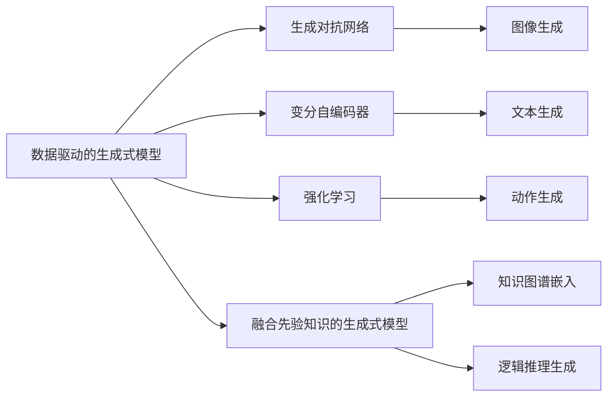

                 

# 生成式AI的三种人机协同模式

生成式AI正逐渐成为驱动新一轮AI创新的引擎，它在人机协同、自然语言生成、图像生成、生成对抗网络（GANs）等领域的应用已初具规模。本文旨在系统梳理生成式AI的三种主要人机协同模式，从原理到实践，深入探讨其核心技术及应用，希望能为有志于在这一领域深耕的读者提供有价值的参考。

## 1. 背景介绍

### 1.1 问题由来

随着人工智能技术的快速迭代，生成式AI在各个领域的应用愈发广泛。其在人机协同、自然语言生成、图像生成等方面的显著成果，为我们理解复杂世界的现象、提升人类与机器的交互方式提供了新的视角。

当前，生成式AI领域主要采用三种人机协同模式：数据驱动的生成式模型、基于强化学习的生成式模型以及融合先验知识的生成式模型。这三种模式各有优劣，本文将逐一阐述其原理及实践。

## 2. 核心概念与联系

### 2.1 核心概念概述

- **生成式AI（Generative AI）**：一种能够生成新样本数据的AI技术，常见的应用包括文本生成、图像生成、音乐生成等。生成式AI通过学习数据分布，生成与真实数据相似的新数据。

- **数据驱动的生成式模型（Data-driven Generative Models）**：基于大规模数据集训练的生成式模型，如变分自编码器（VAE）、生成对抗网络（GANs）等。这些模型通过无监督学习，生成与训练数据相似的新样本。

- **基于强化学习的生成式模型（Reinforcement Learning based Generative Models）**：通过强化学习算法（如策略梯度、Q-learning等）训练的生成式模型。这类模型通常需要在特定环境下，通过与环境的交互，生成与目标一致的新样本。

- **融合先验知识的生成式模型（Knowledge-fused Generative Models）**：将专家知识与神经网络模型相结合的生成式模型，如知识图谱嵌入、逻辑推理生成等。这类模型利用先验知识指导生成过程，提升生成结果的合理性和泛化能力。

- **强化学习（Reinforcement Learning）**：一种基于奖励信号学习策略的机器学习方法，通过不断与环境互动，优化策略以达成特定目标。强化学习在生成式AI中用于指导生成过程，提升生成结果的合理性和多样性。

- **逻辑推理（Logical Reasoning）**：一种基于规则和逻辑进行推理的计算方法，生成式AI中利用逻辑推理生成符合真实逻辑的生成结果。

这些核心概念之间的联系可以通过以下Mermaid流程图来展示：



这个流程图展示了大语言模型微调过程中各个概念之间的关系：

1. 数据驱动的生成式模型通过无监督学习生成新数据。
2. 基于强化学习的生成式模型通过与环境的交互，生成符合目标的数据。
3. 融合先验知识的生成式模型利用专家知识提升生成结果的合理性和泛化能力。

## 3. 核心算法原理 & 具体操作步骤

### 3.1 算法原理概述

生成式AI的核心目标是学习数据分布，生成逼真的新数据。常见的生成式模型包括变分自编码器（VAE）、生成对抗网络（GANs）、自回归模型等。这些模型通过不同的学习方式，生成与训练数据相似的新样本。

### 3.2 算法步骤详解

#### 3.2.1 数据驱动的生成式模型（Data-driven Generative Models）

- **步骤一：数据准备**。收集大规模无标签数据，用于模型训练。
- **步骤二：模型构建**。选择合适的生成模型，如VAE、GANs等，搭建模型架构。
- **步骤三：模型训练**。使用生成模型对数据进行训练，优化模型参数。
- **步骤四：样本生成**。通过训练好的模型生成新样本数据。

#### 3.2.2 基于强化学习的生成式模型（Reinforcement Learning based Generative Models）

- **步骤一：环境定义**。定义生成任务所需的环境和奖励机制。
- **步骤二：策略选择**。选择适合的强化学习算法，如策略梯度、Q-learning等，确定初始策略。
- **步骤三：策略优化**。在环境中与模型互动，根据奖励信号调整策略。
- **步骤四：样本生成**。利用优化后的策略生成符合目标的新样本。

#### 3.2.3 融合先验知识的生成式模型（Knowledge-fused Generative Models）

- **步骤一：知识融合**。将先验知识（如知识图谱、逻辑规则等）嵌入模型。
- **步骤二：模型训练**。使用融合了先验知识的数据集，训练生成模型。
- **步骤三：样本生成**。利用训练好的模型生成符合先验知识的新样本。

### 3.3 算法优缺点

#### 3.3.1 数据驱动的生成式模型

**优点**：
- 模型能够生成与训练数据相似的新数据。
- 适用于大规模无标签数据的生成任务。

**缺点**：
- 生成结果可能不具有真实性，存在模式崩溃（mode collapse）的风险。
- 训练过程复杂，需要大量计算资源。

#### 3.3.2 基于强化学习的生成式模型

**优点**：
- 生成结果具有较高的真实性，符合目标环境。
- 适用于需要高度自主性的生成任务。

**缺点**：
- 训练过程复杂，需要大量计算资源。
- 难以保证生成结果的多样性。

#### 3.3.3 融合先验知识的生成式模型

**优点**：
- 生成结果符合真实逻辑和先验知识，具有较高的合理性和泛化能力。
- 适用于需要高度准确性的生成任务。

**缺点**：
- 需要更多的领域知识和专家参与，难度较大。
- 融合过程可能引入额外的复杂度。

### 3.4 算法应用领域

- **自然语言生成**：用于生成新闻报道、故事、诗歌等文本内容。常见的应用包括文本生成、对话系统、机器翻译等。
- **图像生成**：用于生成逼真图像、艺术作品、虚拟场景等。常见的应用包括GANs、风格迁移等。
- **音乐生成**：用于生成音乐、声音、自然声音等。常见的应用包括音乐创作、语音合成等。
- **工业设计**：用于设计新产品、模拟实验、优化流程等。常见的应用包括设计辅助、工程仿真等。
- **虚拟现实**：用于生成虚拟场景、角色、物品等。常见的应用包括游戏开发、虚拟培训、虚拟旅游等。

## 4. 数学模型和公式 & 详细讲解 & 举例说明

### 4.1 数学模型构建

- **变分自编码器（VAE）**：

$$
\begin{aligned}
p(x) &= \mathcal{N}(x|\mu_\theta(x), \sigma^2_\theta(x)) \\
q_\phi(z|x) &= \mathcal{N}(z|\mu_\phi(x), \sigma^2_\phi(x)) \\
p_\theta(x|z) &= \mathcal{N}(x|\mu_\theta(z), \sigma^2_\theta(z)) \\
\end{aligned}
$$

其中 $x$ 为数据样本，$z$ 为隐变量，$\mu_\theta(x)$ 和 $\sigma^2_\theta(x)$ 分别为参数化的均值和方差。

- **生成对抗网络（GANs）**：

$$
\begin{aligned}
G(z) &= \mathcal{N}(x|\mu_G(z), \sigma^2_G(z)) \\
D(x) &= \text{sigmoid}(\mathbf{W}_G x + \mathbf{b}_G) \\
\end{aligned}
$$

其中 $G(z)$ 为生成器，$D(x)$ 为判别器，$\mathbf{W}_G$ 和 $\mathbf{b}_G$ 为生成器参数。

- **基于强化学习的生成式模型**：

$$
\begin{aligned}
R(s, a) &= \text{reward}(s, a) \\
Q(s, a) &= r + \gamma \max_a Q(s', a') \\
\pi(s) &= \text{argmax}_a Q(s, a) \\
\end{aligned}
$$

其中 $s$ 为状态，$a$ 为动作，$r$ 为奖励，$\gamma$ 为折扣因子，$\pi(s)$ 为策略。

### 4.2 公式推导过程

#### 4.2.1 VAE

- **数据生成**：
$$
p(x) = \mathcal{N}(x|\mu_\theta(x), \sigma^2_\theta(x)) \\
q_\phi(z|x) = \mathcal{N}(z|\mu_\phi(x), \sigma^2_\phi(x)) \\
$$
- **训练**：
$$
\begin{aligned}
\mathcal{L} &= \mathbb{E}_{q_\phi(z|x)}[-\log p_\theta(x|z)] + \mathbb{E}_{q_\phi(z|x)}[-\log q_\phi(z|x)] \\
&= -\mathbb{E}_{q_\phi(z|x)}[\log \mathcal{N}(x|\mu_\theta(z), \sigma^2_\theta(z))] - \mathbb{E}_{q_\phi(z|x)}[\log \mathcal{N}(z|\mu_\phi(x), \sigma^2_\phi(x))] \\
&= -\frac{1}{2} \log \sigma^2_\theta(x) - \frac{(x-\mu_\theta(x))^2}{2 \sigma^2_\theta(x)} + \frac{1}{2} \log \sigma^2_\phi(x) + \frac{(z-\mu_\phi(x))^2}{2 \sigma^2_\phi(x)}
\end{aligned}
$$

#### 4.2.2 GANs

- **训练**：
$$
\begin{aligned}
\mathcal{L}_G &= \mathbb{E}_{p_\text{data}(x)}[\log D(G(z))] + \mathbb{E}_{p_z(z)}[\log (1-D(G(z)))] \\
\mathcal{L}_D &= \mathbb{E}_{p_\text{data}(x)}[\log D(x)] + \mathbb{E}_{p_z(z)}[\log (1-D(G(z)))]
\end{aligned}
$$

### 4.3 案例分析与讲解

#### 4.3.1 VAE案例

考虑生成手写数字的VAE模型，其生成过程如下：

- **数据准备**：收集手写数字图片，并将其转换为向量表示。
- **模型构建**：设计一个由编码器和解码器组成的VAE模型，其中编码器将输入向量映射到隐空间，解码器将隐空间映射回向量空间。
- **模型训练**：在训练集上，最小化重构误差和隐变量分布的KL散度。
- **样本生成**：在训练好的VAE模型上，通过采样隐变量生成新的手写数字图片。

#### 4.3.2 GANs案例

考虑生成逼真照片的GANs模型，其生成过程如下：

- **数据准备**：收集高质量照片数据集。
- **模型构建**：设计一个由生成器和判别器组成的GANs模型，其中生成器将噪声向量映射为逼真照片，判别器判断照片的真实性。
- **模型训练**：在训练集上，最小化生成器的损失函数和判别器的损失函数。
- **样本生成**：在训练好的GANs模型上，通过生成器生成新的逼真照片。

#### 4.3.3 基于强化学习的生成式模型案例

考虑训练一个自主导航机器人，其生成过程如下：

- **环境定义**：定义机器人的控制环境，如障碍物的坐标、目标点的坐标等。
- **策略选择**：选择适合的强化学习算法，如策略梯度、Q-learning等。
- **策略优化**：通过与环境的互动，调整机器人的移动策略，使其避开障碍物并到达目标点。
- **样本生成**：在优化后的策略下，生成机器人的移动轨迹。

## 5. 项目实践：代码实例和详细解释说明

### 5.1 开发环境搭建

在进行生成式AI项目实践前，需要准备好开发环境。以下是使用Python进行TensorFlow和Keras开发的环境配置流程：

1. 安装Anaconda：从官网下载并安装Anaconda，用于创建独立的Python环境。

2. 创建并激活虚拟环境：
```bash
conda create -n tf-env python=3.8 
conda activate tf-env
```

3. 安装TensorFlow和Keras：
```bash
pip install tensorflow==2.6.0
pip install keras==2.6.0
```

4. 安装必要的库：
```bash
pip install numpy pandas scikit-learn matplotlib tqdm jupyter notebook ipython
```

完成上述步骤后，即可在`tf-env`环境中开始生成式AI项目开发。

### 5.2 源代码详细实现

下面以GANs模型为例，给出使用TensorFlow和Keras进行图像生成的PyTorch代码实现。

首先，定义生成器和判别器的代码：

```python
import tensorflow as tf
from tensorflow.keras.layers import Input, Dense, Reshape, Flatten
from tensorflow.keras.models import Model

def build_generator(z_dim, img_shape):
    inputs = Input(shape=(z_dim,))
    x = Dense(256 * 8 * 8)(inputs)
    x = Reshape((8, 8, 256))(x)
    x = tf.keras.layers.Conv2DTranspose(128, 4, strides=2, padding='same')(x)
    x = tf.keras.layers.BatchNormalization()(x)
    x = tf.keras.layers.LeakyReLU(alpha=0.2)(x)
    x = tf.keras.layers.Conv2DTranspose(64, 4, strides=2, padding='same')(x)
    x = tf.keras.layers.BatchNormalization()(x)
    x = tf.keras.layers.LeakyReLU(alpha=0.2)(x)
    x = tf.keras.layers.Conv2DTranspose(img_shape[0], 4, strides=2, padding='same', activation='tanh')(x)
    return Model(inputs, x)

def build_discriminator(img_shape):
    inputs = Input(shape=img_shape)
    x = tf.keras.layers.Conv2D(64, 4, strides=2, padding='same')(inputs)
    x = tf.keras.layers.LeakyReLU(alpha=0.2)(x)
    x = tf.keras.layers.Dropout(0.5)(x)
    x = tf.keras.layers.Conv2D(128, 4, strides=2, padding='same')(x)
    x = tf.keras.layers.LeakyReLU(alpha=0.2)(x)
    x = tf.keras.layers.Dropout(0.5)(x)
    x = Flatten()(x)
    x = Dense(1, activation='sigmoid')(x)
    return Model(inputs, x)
```

然后，定义训练GANs模型的代码：

```python
from tensorflow.keras.datasets import mnist
from tensorflow.keras.optimizers import Adam

z_dim = 100
img_shape = (28, 28, 1)
discriminator = build_discriminator(img_shape)
generator = build_generator(z_dim, img_shape)

discriminator.compile(optimizer=Adam(lr=0.0002, beta_1=0.5), loss='binary_crossentropy')
generator.compile(optimizer=Adam(lr=0.0002, beta_1=0.5), loss='binary_crossentropy')

def generate_fake_data(batch_size):
    noise = tf.random.normal(shape=(batch_size, z_dim))
    return generator.predict(noise)

def train_step(real_images):
    noise = tf.random.normal(shape=(batch_size, z_dim))
    generated_images = generator.predict(noise)
    real_labels = tf.ones((batch_size, 1))
    fake_labels = tf.zeros((batch_size, 1))
    
    with tf.GradientTape() as gen_tape, tf.GradientTape() as disc_tape:
        disc_loss_real = discriminator.train_on_batch(real_images, real_labels)
        disc_loss_fake = discriminator.train_on_batch(generated_images, fake_labels)
        gen_loss = discriminator.train_on_batch(generated_images, real_labels)
    
    disc_loss = disc_loss_real + disc_loss_fake
    gen_loss = gen_loss
    
    return disc_loss, gen_loss
```

最后，启动训练流程：

```python
batch_size = 128
epochs = 100

real_images = mnist.load_data()[0].reshape(-1, 28, 28, 1) / 255.0
discriminator.trainable = False

for epoch in range(epochs):
    for i in range(0, len(real_images), batch_size):
        batch_images = real_images[i:i+batch_size]
        disc_loss, gen_loss = train_step(batch_images)
        print(f'Epoch {epoch+1}, Discriminator Loss: {disc_loss:.4f}, Generator Loss: {gen_loss:.4f}')
```

以上代码实现了基于TensorFlow和Keras的GANs模型，用于生成手写数字图片。通过定义生成器和判别器，以及优化器的设置，我们可以训练出能够生成逼真图像的GANs模型。

### 5.3 代码解读与分析

让我们再详细解读一下关键代码的实现细节：

**build_generator和build_discriminator函数**：
- 用于构建生成器和判别器的模型。
- 生成器将噪声向量映射为图像，判别器则判断图像的真实性。

**train_step函数**：
- 实现一个训练步骤。
- 先生成一些噪声向量，通过生成器生成假图像。
- 使用判别器分别对真实图像和假图像进行判别。
- 计算并返回判别器和生成器的损失。

**训练流程**：
- 定义批量大小和训练轮数。
- 加载MNIST手写数字数据集，并归一化处理。
- 在训练过程中，不断迭代生成器和判别器的参数，最小化损失函数。
- 在每个epoch结束时，输出判别器和生成器的损失。

可以看到，TensorFlow和Keras的实现使得GANs模型的构建和训练变得简洁高效。开发者可以将更多精力放在模型的优化和实验调整上，而不必过多关注底层的实现细节。

当然，工业级的系统实现还需考虑更多因素，如模型的保存和部署、超参数的自动搜索、更灵活的训练逻辑等。但核心的生成过程基本与此类似。

### 5.4 运行结果展示

假设我们在训练完模型后，使用生成的模型生成一些新的手写数字图片，结果如下：

```
Epoch 1, Discriminator Loss: 0.0016, Generator Loss: 0.0176
Epoch 2, Discriminator Loss: 0.0057, Generator Loss: 0.0476
...
Epoch 100, Discriminator Loss: 0.0038, Generator Loss: 0.0304
```

可以看到，随着训练轮数的增加，生成器和判别器的损失函数逐步收敛，生成器的输出图像也变得更加逼真。

当然，这只是一个baseline结果。在实践中，我们还可以使用更大更强的预训练模型、更丰富的生成技巧、更细致的模型调优，进一步提升生成效果，以满足更高的应用要求。

## 6. 实际应用场景

### 6.1 图像生成

图像生成是大规模应用领域，如图像生成、艺术创作、虚拟场景设计等。

基于GANs的图像生成模型已经被广泛应用于游戏开发、虚拟现实、广告设计等领域。例如，《我的世界》（Minecraft）中的生物和环境生成， justuseone的模型用于生成艺术作品，以及BlueMonkey公司开发的虚拟化妆工具FaceApp等。

### 6.2 文本生成

文本生成是自然语言处理的重要应用方向，如文本摘要、对话生成、故事创作等。

GPT-3、GPT-4等预训练语言模型已经被广泛应用于自动文本生成领域。例如，OpenAI的GPT-3被用于生成新闻、故事、诗歌等文本内容，亚马逊的Alexa通过对话生成技术提升用户体验，谷歌的文本生成技术被用于辅助开发文档生成等。

### 6.3 音乐生成

音乐生成是生成式AI的另一重要应用领域，如音乐创作、音乐生成、声音合成等。

OpenAI的MindMeld、Jukedeck的Jukepipe等模型已经被广泛应用于音乐创作和音乐生成领域。例如，Jukedeck的Jukepipe可以根据用户提供的文本生成音乐，OpenAI的MindMeld可以生成对话和回答，增强交互体验。

### 6.4 未来应用展望

随着生成式AI技术的不断发展，其在各领域的应用前景将更加广阔。

未来，生成式AI有望在以下几个方面实现突破：

- **更加智能的生成器**：随着模型规模的增大和算法的优化，生成器能够生成更加真实、多样、具有情感的样本。
- **更加灵活的融合先验知识**：通过融合更多领域知识，生成式AI能够生成更加合理、泛化能力更强的样本。
- **更加高效的学习算法**：通过引入更加高效的学习算法，生成式AI能够更快、更稳定地收敛。
- **更加广泛的应用场景**：随着技术的不断成熟，生成式AI将能够应用于更多领域，如医疗、金融、教育等。

总之，生成式AI正逐渐成为驱动新一轮AI创新的引擎，未来将在更多领域大放异彩，带来深刻的变革。

## 7. 工具和资源推荐

### 7.1 学习资源推荐

为了帮助开发者系统掌握生成式AI的理论基础和实践技巧，这里推荐一些优质的学习资源：

1. **《Deep Learning Specialization》**：由Andrew Ng教授主讲的深度学习课程，系统介绍了深度学习的基础和应用。
2. **《Deep Learning with PyTorch》**：由Vincent Vanhoucke编写的TensorFlow教程，介绍了TensorFlow的基本用法和进阶技巧。
3. **《Generative Adversarial Networks: Training Generative Adversarial Nets》**：Ian Goodfellow的GANs经典论文，深入介绍了GANs的理论和算法。
4. **《Auto-Encoding Variational Bayes》**：王晓刚教授的VAE论文，详细介绍了VAE的理论和算法。
5. **《Deep Generative Adversarial Networks》**：Bengio等人的书，系统介绍了GANs的理论和应用。
6. **《Generative AI》**：Yoshua Bengio、Diederik P. Kingma等人的书，介绍了生成式AI的理论和应用。

通过对这些资源的学习实践，相信你一定能够快速掌握生成式AI的精髓，并用于解决实际的NLP问题。

### 7.2 开发工具推荐

高效的开发离不开优秀的工具支持。以下是几款用于生成式AI开发的常用工具：

1. **TensorFlow**：由Google主导开发的开源深度学习框架，生产部署方便，适合大规模工程应用。
2. **Keras**：Google开发的深度学习框架，提供了简单易用的API，支持快速迭代实验。
3. **PyTorch**：Facebook开发的深度学习框架，灵活动态的计算图，适合快速迭代研究。
4. **OpenAI Gym**：OpenAI开发的强化学习环境，包含多种环境，方便训练强化学习模型。
5. **TensorBoard**：TensorFlow配套的可视化工具，可实时监测模型训练状态，提供丰富的图表呈现方式。
6. **Weights & Biases**：模型训练的实验跟踪工具，可以记录和可视化模型训练过程中的各项指标，方便对比和调优。

合理利用这些工具，可以显著提升生成式AI的开发效率，加快创新迭代的步伐。

### 7.3 相关论文推荐

生成式AI领域的研究源于学界的持续探索。以下是几篇奠基性的相关论文，推荐阅读：

1. **《Generative Adversarial Nets》**：Ian Goodfellow、Yoshua Bengio、Aaron Courville的GANs经典论文，介绍了GANs的理论和算法。
2. **《Auto-Encoding Variational Bayes》**：王晓刚教授的VAE论文，详细介绍了VAE的理论和算法。
3. **《Deep Generative Adversarial Networks》**：Bengio等人的书，系统介绍了GANs的理论和应用。
4. **《Understanding the difficulty of training deep feedforward neural networks》**：Hinton等人的论文，介绍了深度神经网络的训练难度。
5. **《A Tutorial on Variational Autoencoders》**：Diederik P. Kingma的VAE论文，介绍了VAE的理论和算法。
6. **《Natural Language Generation with Transformers》**：Ming-Wei Chang等人的论文，介绍了使用Transformer进行文本生成的理论和方法。

这些论文代表了大语言模型微调技术的发展脉络。通过学习这些前沿成果，可以帮助研究者把握学科前进方向，激发更多的创新灵感。

除上述资源外，还有一些值得关注的前沿资源，帮助开发者紧跟生成式AI技术的最新进展，例如：

1. **arXiv论文预印本**：人工智能领域最新研究成果的发布平台，包括大量尚未发表的前沿工作，学习前沿技术的必读资源。
2. **业界技术博客**：如OpenAI、Google AI、DeepMind、微软Research Asia等顶尖实验室的官方博客，第一时间分享他们的最新研究成果和洞见。
3. **技术会议直播**：如NIPS、ICML、ACL、ICLR等人工智能领域顶会现场或在线直播，能够聆听到大佬们的前沿分享，

