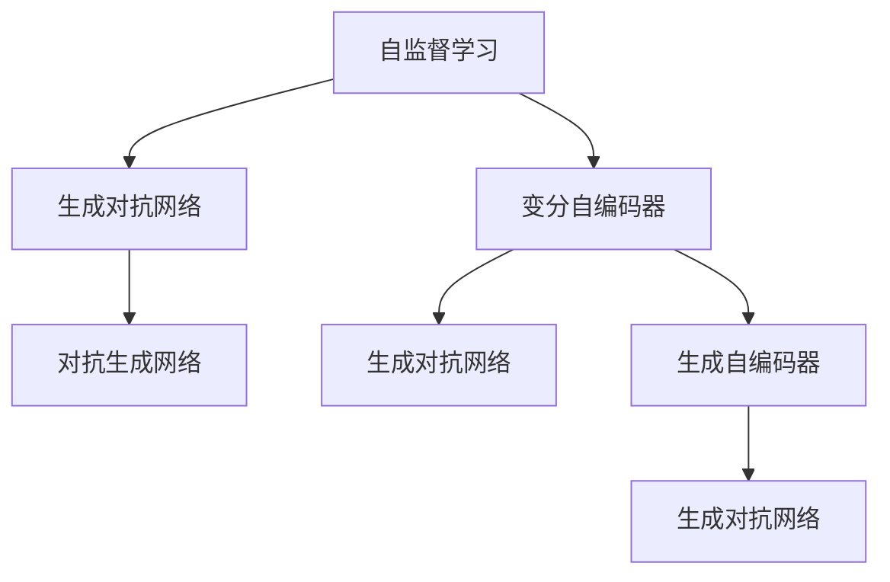

                 

# 生成式AI的未来发展路径

> 关键词：生成式AI, 神经网络, 深度学习, 模型训练, 大模型, 可解释性, 跨领域迁移, 多模态融合

## 1. 背景介绍

### 1.1 问题由来

近年来，生成式AI在计算机视觉、自然语言处理和音频生成等领域取得了飞速进展，成为了人工智能领域的新热点。随着神经网络和深度学习技术的成熟，生成式AI技术的发展，带来了图像、音频、文本、视频等数据类型的智能生成能力。然而，面对实际应用中数据标注的昂贵成本、模型训练的高计算要求和模型输出的可解释性不足等问题，生成式AI仍有许多挑战需要克服。本文将重点探讨生成式AI的未来发展路径，以期对技术创新和应用推广提供指导。

### 1.2 问题核心关键点

生成式AI技术的研究范式主要包括基于自监督、半监督和监督学习的训练方法，以及基于对抗生成网络、变分自编码器和生成对抗网络等架构的网络结构。这些方法与架构在理论和实践中都取得了重要进展。

生成式AI的应用场景广泛，包括但不限于：

- **计算机视觉**：图像生成、图像修复、图像增强、风格迁移等。
- **自然语言处理**：文本生成、机器翻译、摘要生成、对话系统等。
- **音频生成**：语音合成、音乐生成、噪声生成等。
- **跨领域迁移**：将生成式AI应用于各个领域，如自动驾驶、工业制造、医疗健康等。

尽管生成式AI技术在多个领域都展现出了强大的能力，但其实现过程和应用场景仍存在诸多挑战和局限，需要进一步突破。

### 1.3 问题研究意义

生成式AI作为AI技术的核心领域之一，不仅能够直接产生大量的高质量数据，还能够推动物理模拟、自动设计、虚拟现实等领域的发展。未来，随着技术的进一步成熟和应用场景的扩展，生成式AI有望成为驱动AI技术发展的重要力量。

研究生成式AI的发展路径，对于推动AI技术的应用推广，解决实际问题，提高AI系统的可解释性和可靠性，具有重要意义。

## 2. 核心概念与联系

### 2.1 核心概念概述

为更好地理解生成式AI的未来发展路径，本节将介绍几个密切相关的核心概念：

- **生成式AI (Generative AI)**：利用深度学习模型生成新的数据，如图像、音频、文本等。
- **自监督学习 (Self-Supervised Learning)**：通过设计预训练任务，利用数据中的隐含信息进行无标签数据的学习。
- **对抗生成网络 (Generative Adversarial Networks, GANs)**：一种包含生成器和判别器的深度学习架构，用于生成高质量的新数据。
- **变分自编码器 (Variational Autoencoders, VAEs)**：一种生成式模型，用于从观测数据中学习数据的潜在分布，并通过该分布生成新数据。
- **自监督生成模型 (Unsupervised Generative Models)**：如VAEs、生成对抗网络等，通过无标签数据进行自监督学习，生成高质量的新数据。

### 2.2 概念间的关系

这些核心概念之间存在着紧密的联系，形成了生成式AI的发展框架。下面通过一个Mermaid流程图来展示它们的关系：



这个流程图展示了自监督学习、对抗生成网络、变分自编码器等生成式模型之间的关系：

1. 自监督学习通过设计预训练任务，从无标签数据中学习模型参数，从而生成高质量的新数据。
2. 对抗生成网络是一种包含生成器和判别器的架构，用于生成高质量的新数据。
3. 变分自编码器是一种生成式模型，通过学习数据的潜在分布，生成新数据。
4. 生成对抗网络中的生成器部分，可以视为变分自编码器的一种特殊形式。
5. 生成自编码器是自监督学习的一种形式，用于生成与原数据相似的新数据。

这些核心概念共同构成了生成式AI的技术基础，并推动了其在多个领域的广泛应用。

## 3. 核心算法原理 & 具体操作步骤
### 3.1 算法原理概述

生成式AI的核心算法原理主要基于深度学习模型，通过学习数据的潜在分布，生成与原数据相似的新数据。这些模型通常通过自监督学习、对抗学习或变分推断等方法进行训练。

### 3.2 算法步骤详解

生成式AI模型的训练过程一般包括以下几个关键步骤：

**Step 1: 数据准备**
- 收集大量的无标签或少标签数据作为预训练数据。
- 将数据划分为训练集、验证集和测试集。

**Step 2: 模型选择**
- 选择适合的生成模型，如生成对抗网络(GANs)、变分自编码器(VAEs)等。
- 根据任务需求调整模型架构和超参数。

**Step 3: 预训练**
- 在预训练数据上训练生成模型，通过自监督任务学习模型参数。
- 引入对抗训练、正则化等技术，提高模型的泛化能力。

**Step 4: 微调**
- 在特定的下游任务上微调生成模型，调整输出层的参数。
- 使用少量标注数据进行微调，避免过拟合。

**Step 5: 评估与优化**
- 在测试集上评估生成模型的性能。
- 根据评估结果调整模型参数和训练策略，优化生成效果。

### 3.3 算法优缺点

生成式AI模型具有以下优点：
- 数据生成能力强，可以产生高质量的新数据。
- 适用范围广，能够应用于多个领域。
- 模型可解释性较高，容易理解和调试。

同时，该方法也存在一些局限性：
- 计算资源消耗大，训练成本高。
- 模型生成效果依赖于训练数据的质量和数量。
- 生成样本的分布可能与真实数据有差异。

### 3.4 算法应用领域

生成式AI在多个领域得到了广泛应用，例如：

- **计算机视觉**：图像生成、图像修复、图像增强、风格迁移等。
- **自然语言处理**：文本生成、机器翻译、摘要生成、对话系统等。
- **音频生成**：语音合成、音乐生成、噪声生成等。
- **游戏与娱乐**：虚拟角色生成、虚拟场景生成、自动游戏生成等。
- **工业设计**：自动设计、模拟实验等。

除了这些经典应用外，生成式AI还在更多的领域展现出强大的潜力，如药物设计、物理模拟、智能交互等，为AI技术带来了新的突破。

## 4. 数学模型和公式 & 详细讲解  
### 4.1 数学模型构建

生成式AI模型的核心数学模型通常基于概率分布的生成和采样。这里以变分自编码器(VAEs)为例，介绍生成式AI的数学模型构建。

**VAEs的基本模型**：
- 输入数据 $x \in \mathcal{X}$，潜变量 $z \in \mathcal{Z}$，生成数据 $y \in \mathcal{Y}$。
- 编码器 $p(z|x)$ 将输入数据映射到潜变量空间。
- 解码器 $q(x|z)$ 从潜变量空间映射回输入空间。
- 生成分布 $q(y|z)$ 表示从潜变量空间采样生成数据。

**VAEs的目标函数**：
- 重构误差 $L_{rec}(x,y)$：衡量生成数据与输入数据之间的差异。
- 潜在变量分布的KL散度 $L_{KL}$：衡量编码器输出的潜变量分布与先验分布之间的差异。

数学公式表示如下：

$$
\mathcal{L}(x,y,z) = \frac{1}{2}\|x-y\|^2 + \beta \mathcal{D}_{KL}(q(z|x) || p(z))
$$

其中，$\|x-y\|^2$ 为重构误差，$\beta$ 为KL散度权重。

### 4.2 公式推导过程

以VAEs为例，推导其重构误差和KL散度的具体公式：

**重构误差**：
- $L_{rec}(x,y) = \frac{1}{2}\|x-y\|^2 = \frac{1}{2}\|x - q(x|z)\|^2$
- 其中，$q(x|z)$ 为解码器输出的生成数据，$z$ 为编码器输出的潜变量。

**KL散度**：
- $\mathcal{D}_{KL}(q(z|x) || p(z)) = \int q(z|x) \log \frac{q(z|x)}{p(z)} dz$
- 其中，$q(z|x)$ 为编码器输出的潜在变量分布，$p(z)$ 为潜变量的先验分布，通常采用标准正态分布 $N(0,I)$。

### 4.3 案例分析与讲解

以VAEs为例，展示其在图像生成中的应用。

假设有一个包含10,000张图像的训练集，每张图像的大小为28x28像素。使用VAEs生成一组新的图像，步骤如下：

1. **数据准备**：收集大量图像数据作为预训练数据，将数据划分为训练集、验证集和测试集。

2. **模型选择**：选择VAEs作为生成模型，设置超参数如编码器与解码器的网络结构、隐变量的维数、重构误差权重等。

3. **预训练**：在训练集上对VAEs进行训练，通过重构误差最小化和潜在变量分布的KL散度最小化，优化模型参数。

4. **微调**：在特定的下游任务上微调VAEs，调整输出层的参数，例如生成手写数字或人脸图像。

5. **评估与优化**：在测试集上评估生成模型的性能，根据评估结果调整模型参数和训练策略，优化生成效果。

## 5. 项目实践：代码实例和详细解释说明
### 5.1 开发环境搭建

在进行生成式AI实践前，我们需要准备好开发环境。以下是使用Python进行TensorFlow开发的环境配置流程：

1. 安装Anaconda：从官网下载并安装Anaconda，用于创建独立的Python环境。

2. 创建并激活虚拟环境：
```bash
conda create -n tf-env python=3.8 
conda activate tf-env
```

3. 安装TensorFlow：根据CUDA版本，从官网获取对应的安装命令。例如：
```bash
conda install tensorflow=2.6 cudatoolkit=11.1 -c pytorch -c conda-forge
```

4. 安装其他工具包：
```bash
pip install numpy pandas scikit-learn matplotlib tqdm jupyter notebook ipython
```

完成上述步骤后，即可在`tf-env`环境中开始生成式AI实践。

### 5.2 源代码详细实现

这里以生成手写数字为例，使用TensorFlow实现VAEs，并生成新图像。

首先，定义VAEs的模型架构：

```python
import tensorflow as tf
from tensorflow.keras import layers

class VAE(tf.keras.Model):
    def __init__(self, latent_dim):
        super(VAE, self).__init__()
        self.latent_dim = latent_dim
        self.encoder = layers.Dense(256, activation='relu')
        self.fc1_mean = layers.Dense(latent_dim)
        self.fc1_stddev = layers.Dense(latent_dim)
        self.decoder = layers.Dense(784, activation='sigmoid')
        self.fc2_mean = layers.Dense(784, activation='sigmoid')
        self.fc2_stddev = layers.Dense(784, activation='sigmoid')
    
    def encode(self, x):
        z_mean = self.fc1_mean(self.encoder(x))
        z_stddev = self.fc1_stddev(self.encoder(x))
        return z_mean, z_stddev
    
    def reparameterize(self, z_mean, z_stddev):
        eps = tf.random.normal(shape=(tf.shape(z_mean)[0], self.latent_dim), mean=0., stddev=1.)
        return z_mean + z_stddev * eps
    
    def decode(self, z):
        z = self.reparameterize(z_mean, z_stddev)
        y_mean = self.fc2_mean(self.decoder(z))
        y_stddev = self.fc2_stddev(self.decoder(z))
        return y_mean, y_stddev
```

接着，定义生成式AI的训练函数：

```python
import numpy as np

def train_vae(dataset, batch_size, latent_dim, epochs):
    model = VAE(latent_dim)
    model.compile(optimizer=tf.keras.optimizers.Adam(learning_rate=0.001), loss=custom_loss)
    dataset = tf.data.Dataset.from_tensor_slices((dataset, labels)).batch(batch_size)
    model.fit(dataset, epochs=epochs)
    return model

def custom_loss(y_true, y_pred):
    reconstruction_loss = tf.reduce_mean(tf.square(y_true - y_pred))
    kl_divergence = -0.5 * tf.reduce_mean(1 + z_stddev - tf.square(z_mean) - tf.exp(z_stddev))
    return tf.reduce_mean(reconstruction_loss + kl_divergence)
```

最后，启动生成式AI的训练流程，并生成新图像：

```python
import matplotlib.pyplot as plt

mnist = tf.keras.datasets.mnist.load_data()
(x_train, y_train), (x_test, y_test) = mnist
x_train = x_train / 255.
x_test = x_test / 255.

latent_dim = 50
epochs = 10
batch_size = 32

vae = train_vae(x_train, batch_size, latent_dim, epochs)

def plot_results(vae, n_examples=10):
    z_mean, z_stddev = vae.encode(x_test[:n_examples])
    generated_images = vae.decode(z_mean).numpy()
    plt.figure(figsize=(8, 8))
    for i in range(n_examples):
        plt.subplot(4, 4, i+1)
        plt.imshow(generated_images[i].reshape(28, 28), cmap='gray')
    plt.show()

plot_results(vae)
```

以上就是使用TensorFlow对VAEs进行手写数字生成实践的完整代码实现。可以看到，VAEs的实现相对简单，但通过适当的训练策略和超参数选择，仍然可以生成高质量的新图像。

### 5.3 代码解读与分析

让我们再详细解读一下关键代码的实现细节：

**VAE类**：
- `__init__`方法：定义VAEs的架构，包括编码器、解码器和重构误差与KL散度的计算方法。
- `encode`方法：通过编码器将输入数据映射到潜在变量空间，并返回潜在变量的均值和标准差。
- `reparameterize`方法：根据潜在变量的均值和标准差，生成新的潜在变量样本。
- `decode`方法：通过解码器将潜在变量样本映射回输入空间，并返回生成的图像。

**train_vae函数**：
- `__init__`方法：初始化VAEs模型和优化器。
- `custom_loss`函数：定义VAEs的损失函数，包括重构误差和KL散度。
- 在训练过程中，将训练集数据批次化加载，使用自定义损失函数训练模型。
- 在训练结束后，返回训练好的VAEs模型。

**plot_results函数**：
- 在测试集上随机抽取一些样本，通过VAEs模型生成新的图像。
- 使用matplotlib绘制生成的图像，展示模型性能。

通过这些代码，可以看到，TensorFlow提供了丰富的深度学习模型和工具，使得生成式AI的开发相对简单和高效。开发者可以将更多精力放在模型架构的设计和优化上，而不必过多关注底层的实现细节。

## 6. 实际应用场景
### 6.1 游戏与娱乐

生成式AI在游戏与娱乐领域有着广泛的应用，如虚拟角色生成、虚拟场景生成、自动游戏生成等。通过生成式AI，可以实现动态生成的游戏环境和互动角色，大幅提升游戏体验和沉浸感。

例如，OpenAI开发的DALL-E模型，可以通过自然语言描述生成高质量的图片。游戏设计师可以基于DALL-E生成的图像，设计虚拟场景和角色，进行游戏测试和迭代优化。

### 6.2 工业设计

生成式AI在工业设计中也有着重要的应用，如自动设计、模拟实验等。通过生成式AI，设计师可以快速生成多个设计方案，进行可视化和评估，从而加速设计流程和提高设计质量。

例如，CadFair公司开发的Generator Xpert，通过生成式AI可以快速生成复杂的3D模型和设计方案，广泛应用于航空航天、汽车制造等领域。

### 6.3 药物设计

生成式AI在药物设计中展现出巨大的潜力，可以用于生成新的分子结构、药物靶标、药效评价等。通过生成式AI，研究人员可以加速新药的发现和开发进程，降低研发成本。

例如，Insilico Medicine公司开发的AlphaFold，通过生成式AI可以快速预测蛋白质的三维结构，用于药物设计和靶点识别。

### 6.4 未来应用展望

随着生成式AI技术的不断进步，其在多个领域的应用将得到进一步拓展。未来，生成式AI将有望在以下领域带来新的突破：

- **医疗健康**：生成式AI可以用于模拟疾病发展、个性化医疗、虚拟手术等。通过生成高质量的医疗图像和模拟数据，提升医疗系统的诊断和治疗能力。
- **教育培训**：生成式AI可以用于生成虚拟教师、虚拟课程、虚拟实验等，提升教育培训的效果和互动性。
- **艺术创作**：生成式AI可以用于生成音乐、绘画、文学作品等，拓展艺术创作的边界。
- **自动驾驶**：生成式AI可以用于自动驾驶车辆的路径规划、场景模拟、决策优化等，提升驾驶安全和效率。

## 7. 工具和资源推荐
### 7.1 学习资源推荐

为了帮助开发者系统掌握生成式AI的理论基础和实践技巧，这里推荐一些优质的学习资源：

1. **《深度学习》课程**：由斯坦福大学开设，通过Lecture视频和配套作业，带你系统学习深度学习的理论基础和实践应用。
2. **《生成对抗网络》一书**：介绍生成对抗网络的基本原理、算法设计和应用场景，是学习生成式AI的重要参考资料。
3. **《VAE: Understanding Variational Autoencoders》一书**：系统讲解变分自编码器的原理、算法设计和应用场景，适合深入学习和实践。
4. **Kaggle数据科学竞赛平台**：提供丰富的生成式AI竞赛项目，可以实践并提升生成式AI的应用能力。
5. **DeepLearning.AI平台**：由Andrew Ng教授创办，提供大量的深度学习课程和实战项目，涵盖生成式AI等多个方向。

通过对这些资源的学习实践，相信你一定能够快速掌握生成式AI的精髓，并用于解决实际的生成式问题。

### 7.2 开发工具推荐

高效的开发离不开优秀的工具支持。以下是几款用于生成式AI开发的常用工具：

1. **TensorFlow**：由Google主导开发的深度学习框架，生产部署方便，适合大规模工程应用。
2. **PyTorch**：基于Python的开源深度学习框架，灵活动态的计算图，适合快速迭代研究。
3. **HuggingFace Transformers库**：集成了多种预训练语言模型，支持深度学习模型和生成式AI任务的开发。
4. **Keras**：基于TensorFlow和Theano的深度学习框架，易于使用，适合快速原型设计和实验。
5. **OpenAI Gym**：用于模拟和优化AI环境的框架，支持生成式AI的实验和评估。

合理利用这些工具，可以显著提升生成式AI的开发效率，加快创新迭代的步伐。

### 7.3 相关论文推荐

生成式AI作为AI技术的核心领域之一，其研究进展得到了学界和产业界的广泛关注。以下是几篇奠基性的相关论文，推荐阅读：

1. **Generative Adversarial Networks**：Goodfellow等人的经典论文，奠定了生成对抗网络的基本理论和算法框架。
2. **Unsupervised and Semi-supervised Learning with Deep Generative Models**：Bengio等人关于深度生成模型的综述论文，总结了生成式AI的主要研究方向和应用场景。
3. **VAE: Auto-Encoding Variational Bayes**：Kingma和Welling的论文，首次提出变分自编码器，并展示了其强大的生成能力。
4. **Language Models are Unsupervised Multitask Learners**：OpenAI的论文，展示了基于自监督学习的语言模型在生成任务上的优异表现。
5. **Efficient Discrete Autoencoders**：Sohn等人关于离散生成模型的研究论文，提出了高效的离散VAE模型。

这些论文代表了大生成式AI的研究进展，通过学习这些前沿成果，可以帮助研究者把握学科前进方向，激发更多的创新灵感。

除上述资源外，还有一些值得关注的前沿资源，帮助开发者紧跟生成式AI技术的最新进展，例如：

1. **arXiv论文预印本**：人工智能领域最新研究成果的发布平台，包括大量尚未发表的前沿工作，学习前沿技术的必读资源。
2. **顶级会议和期刊**：如ICML、NIPS、ICLR、JMLR等，提供生成式AI领域最新的研究成果和创新进展。
3. **产业应用案例**：如谷歌、OpenAI、微软等公司发布的应用案例，展示生成式AI技术的实际应用效果和商业价值。

总之，对于生成式AI的学习和实践，需要开发者保持开放的心态和持续学习的意愿。多关注前沿资讯，多动手实践，多思考总结，必将收获满满的成长收益。

## 8. 总结：未来发展趋势与挑战
### 8.1 总结

本文对生成式AI的未来发展路径进行了全面系统的介绍。首先阐述了生成式AI在计算机视觉、自然语言处理和音频生成等领域的重要应用和研究进展，明确了生成式AI在推动AI技术发展、解决实际问题、提高AI系统的可解释性和可靠性等方面的独特价值。

### 8.2 未来发展趋势

展望未来，生成式AI的发展趋势包括：

1. **计算能力增强**：随着硬件计算能力的提升，生成式AI模型将能够处理更复杂、更精细的生成任务，如图像生成、自然语言生成等。
2. **模型泛化能力提升**：通过自监督学习、对抗学习等方法，生成式AI模型将具备更强的泛化能力，适应更广泛的数据分布。
3. **跨领域融合**：生成式AI将与其他AI技术（如强化学习、知识表示、因果推理等）进行更深入的融合，提升生成效果和应用范围。
4. **用户生成内容的崛起**：生成式AI将广泛应用于用户生成内容（UGC）领域，如社交媒体、视频平台、游戏社区等，提升内容生成质量和多样性。
5. **伦理和安全问题**：生成式AI将面临更多伦理和安全问题，如数据隐私、版权保护、内容真实性等，需要通过技术手段和管理措施进行应对。

### 8.3 面临的挑战

尽管生成式AI技术取得了显著进展，但在实现更加智能、可靠、可控的生成系统过程中，仍面临诸多挑战：

1. **计算资源消耗大**：生成式AI模型通常需要较高的计算资源进行训练和推理，难以在资源受限的环境中应用。
2. **模型生成效果不稳定**：生成式AI模型在不同输入和不同条件下，生成效果存在波动，难以保证输出的一致性和稳定性。
3. **生成内容的真实性问题**：生成式AI生成的内容可能存在虚假信息、误导性内容等问题，需要通过技术手段进行识别和筛选。
4. **模型的可解释性不足**：生成式AI模型的内部决策过程难以解释，难以理解和调试模型生成的内容。
5. **伦理和安全问题**：生成式AI生成的内容可能涉及版权、隐私、虚假信息等伦理和安全问题，需要通过技术手段和管理措施进行规范。

### 8.4 研究展望

面对生成式AI面临的诸多挑战，未来的研究需要在以下几个方面寻求新的突破：

1. **提升计算效率**：通过模型优化、硬件加速、分布式训练等技术手段，提升生成式AI模型的计算效率，降低资源消耗。
2. **增强模型稳定性**：引入对抗训练、数据增强、正则化等技术手段，提升生成式AI模型的生成效果和稳定性。
3. **提升模型可解释性**：引入可解释性方法，如解释性生成、对抗生成等技术手段，提升生成式AI模型的可解释性和可理解性。
4. **解决伦理和安全问题**：引入伦理和安全约束，如隐私保护、版权保护、内容真实性等技术手段，确保生成式AI模型的应用合规性和安全性。

这些研究方向的探索，必将引领生成式AI技术迈向更高的台阶，为构建智能、安全、可靠、可控的生成系统铺平道路。面向未来，生成式AI技术还需要与其他AI技术进行更深入的融合，如强化学习、知识表示、因果推理等，多路径协同发力，共同推动生成式AI技术的发展和应用。只有勇于创新、敢于突破，才能不断拓展生成式AI的边界，让智能技术更好地造福人类社会。

## 9. 附录：常见问题与解答

**Q1：生成式AI是否适用于所有生成任务？**

A: 生成式AI技术在图像、音频、文本等多种数据类型上均取得了优异的表现，但并不适用于所有生成任务。例如，对于复杂的社交互动、情感表达等任务，生成式AI还需要进一步优化和改进。

**Q2：如何选择合适的生成模型？**

A: 选择生成模型需要考虑任务类型、数据特性、计算资源等因素。常见的生成模型包括生成对抗网络(GANs)、变分自编码器(VAEs)、自回归模型等。需要根据具体任务需求选择合适的模型架构和超参数。

**Q3：生成式AI在部署时需要注意哪些问题？**

A: 生成式AI的部署需要考虑计算效率、模型大小、生成效果等问题。例如，可以通过模型压缩、混合精度训练

