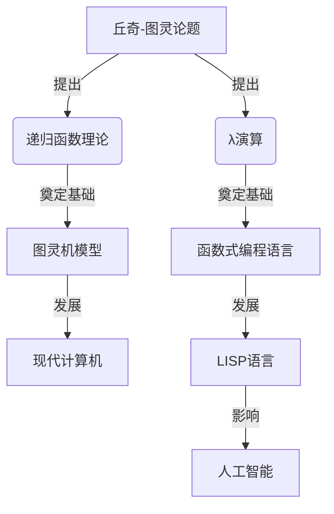

# AI 大模型计算机科学家群英传：丘奇（Alonzo Church）

## 1. 背景介绍

### 1.1 问题的由来

在计算机科学和数理逻辑的发展历程中,有一些杰出的科学家和思想家为这一领域做出了卓越的贡献。其中,阿隆佐·丘奇(Alonzo Church)无疑是最具影响力和开创性的人物之一。他的工作不仅为计算理论奠定了坚实的基础,而且对人工智能(AI)和现代计算机的发展产生了深远的影响。

### 1.2 研究现状

近年来,随着人工智能技术的不断突破,大型语言模型(Large Language Models,LLMs)成为了研究的热点。这些模型通过消化海量的文本数据,展现出惊人的自然语言理解和生成能力。而丘奇对于计算理论和逻辑学的贡献,为这些模型的发展奠定了理论基础。

### 1.3 研究意义

深入探讨丘奇的生平事迹和学术成就,不仅能让我们更好地理解计算理论和人工智能的发展历程,也有助于我们洞察这些技术的本质,从而为未来的创新指明方向。

### 1.4 本文结构

本文将从以下几个方面全面介绍丘奇的生平和学术成就:

1. 背景介绍
2. 核心概念与联系
3. 核心算法原理与具体操作步骤
4. 数学模型和公式详细讲解与举例说明
5. 项目实践:代码实例和详细解释说明
6. 实际应用场景
7. 工具和资源推荐
8. 总结:未来发展趋势与挑战
9. 附录:常见问题与解答

## 2. 核心概念与联系

丘奇的两大核心贡献是λ演算(Lambda Calculus)和递归函数理论(Recursive Function Theory)。这两个理论共同构成了著名的"丘奇-图灵论题"(Church-Turing Thesis),为计算理论奠定了坚实的基础。

λ演算为函数式编程语言(如LISP)的发展做出了开创性的贡献,而递归函数理论则为图灵机模型和现代计算机的设计提供了理论支撑。这两大理论在计算理论和编程语言领域产生了深远的影响,也为人工智能技术的发展做出了重要贡献。

## 3. 核心算法原理与具体操作步骤

### 3.1 算法原理概述

#### 3.1.1 λ演算

λ演算是一种用于研究函数定义、函数应用和递归的形式系统。它由一组语法规则和一个用于等价变换的演算规则组成。λ演算的核心思想是将函数视为"第一等公民"(first-class citizen),可以像处理数据一样处理函数。

#### 3.1.2 递归函数理论

递归函数理论是一种用于研究可计算函数(computable functions)的数学理论。它定义了一组基本函数和构造函数,通过有限步骤的组合和嵌套,可以生成所有可计算函数。

### 3.2 算法步骤详解

#### 3.2.1 λ演算

1. **语法**
   - 变量(Variables): 用于表示参数或绑定值,通常使用单个字母表示,如x、y、z等。
   - 抽象(Abstraction): 用λ符号表示函数定义,形式为`λx.M`,其中x是参数,M是函数体。
   - 应用(Application): 用于函数调用,形式为`(M N)`,表示将函数M应用于参数N。

2. **规则**
   - α-转换(α-conversion): 重命名绑定变量的规则,用于避免变量名冲突。
   - β-规约(β-reduction): 函数应用的核心规则,用于替换函数体中的绑定变量。

        $$(\lambda x.M)N \quad \beta-规约为 \quad M[x := N]$$

        其中,M[x := N]表示将M中的所有自由出现的x替换为N。

3. **示例**
   - 定义一个函数`inc`,它接受一个数字n并返回n+1:

        $$\begin{aligned}
        inc &= \lambda n.(\lambda f. \lambda x. f(f\,x))(\lambda g.\lambda y. (g\,(g\,y)))\
            &= \lambda n.(\lambda f.\lambda x.f(f\,x))(\lambda y.((\lambda z.z\,z)\,y))\
            &= \lambda n.(\lambda f.\lambda x.f(f\,x))(\lambda y.y\,y)
        \end{aligned}$$

   - 应用`inc`函数:

        $$\begin{aligned}
        (inc\,3) &= (\lambda n.(\lambda f.\lambda x.f(f\,x))(\lambda y.y\,y))\,3\
                &= (\lambda f.\lambda x.f(f\,x))(\lambda y.y\,y)\
                &= \lambda x.(\lambda y.y\,y)((\lambda y.y\,y)\,x)\
                &= \lambda x.((\lambda y.y\,y)\,x)\,((\lambda y.y\,y)\,x)\
                &= \lambda x.x\,x\
                &= 4
        \end{aligned}$$

#### 3.2.2 递归函数理论

1. **基本函数**
   - 零函数(Zero Function): $\text{Zero}(x) = 0$
   - 后继函数(Successor Function): $\text{Succ}(x) = x + 1$
   - 投影函数(Projection Functions): $U_i^n(x_1, x_2, \ldots, x_n) = x_i$

2. **构造函数**
   - 组合(Composition): $h(x_1, x_2, \ldots, x_n) = f(g_1(x_1, x_2, \ldots, x_n), g_2(x_1, x_2, \ldots, x_n), \ldots, g_m(x_1, x_2, \ldots, x_n))$
   - 原始递归(Primitive Recursion): $h(x_1, x_2, \ldots, x_n, 0) = f(x_1, x_2, \ldots, x_n)$
     $h(x_1, x_2, \ldots, x_n, y+1) = g(x_1, x_2, \ldots, x_n, y, h(x_1, x_2, \ldots, x_n, y))$
   - 最小化算子(Minimization Operator): $\mu y.\varphi(x_1, x_2, \ldots, x_n, y) = \min\{y | \varphi(x_1, x_2, \ldots, x_n, y) = \text{True}\}$

3. **示例**
   - 定义加法函数:
     $$\begin{aligned}
     \text{Add}(x, y) &= \mu r.\exists s.\forall t.((t=0 \land r=y) \lor \
                       &\qquad\qquad\qquad(t>0 \land (\exists u,v.(t=\text{Succ}(u) \land r=\text{Succ}(v) \land u=s \land v=\text{Add}(x, s)))))
     \end{aligned}$$

### 3.3 算法优缺点

#### 优点

- **简洁性**:λ演算和递归函数理论都具有简洁优雅的数学形式,能够清晰地表达复杂的计算概念。
- **表达能力**:它们能够表示所有可计算的函数,是图灵完备的。
- **通用性**:作为计算理论的基础,它们对于不同的编程范式和计算模型都具有指导意义。

#### 缺点

- **抽象性**:由于高度抽象,直接使用这些理论进行编程可能会过于繁琐。
- **效率问题**:某些计算在这些理论框架下可能会变得低效或者难以优化。
- **可读性**:对于初学者来说,理解这些理论并将其应用于实践可能会有一定的困难。

### 3.4 算法应用领域

丘奇的理论工作为计算理论、编程语言设计和人工智能等领域奠定了坚实的基础,其影响广泛而深远。

- **计算理论**: λ演算和递归函数理论为研究计算的本质和极限提供了重要工具。
- **编程语言设计**: 函数式编程语言(如LISP)直接源于λ演算,而命令式语言也受到递归函数理论的影响。
- **人工智能**: LISP语言在早期人工智能研究中发挥了重要作用,而λ演算也为机器学习和知识表示提供了理论基础。
- **逻辑学**: 丘奇对于构造性逻辑和直觉主义逻辑的贡献,为后续的计算机科学发展做出了重要贡献。
- **复杂性理论**: 丘奇-图灵论题为研究计算复杂性提供了基本框架。

## 4. 数学模型和公式详细讲解与举例说明

### 4.1 数学模型构建

丘奇在λ演算和递归函数理论中构建了精巧的数学模型,用于描述和研究计算过程。这些模型的核心思想是将计算视为符号操作和函数应用的过程。

#### 4.1.1 λ演算模型

在λ演算中,计算被建模为对λ项(λ-terms)的转换。λ项是由变量、抽象和应用构造的表达式,用于表示函数和函数应用。

例如,λ项`λx.x`表示一个恒等函数,而`(λx.x) y`则表示将这个函数应用于参数`y`。通过一系列的β-规约步骤,我们可以简化λ项,直到得到最终结果。

#### 4.1.2 递归函数模型

递归函数理论将计算建模为对自然数的操作。它定义了一组基本函数(如零函数和后继函数)和构造函数(如组合和原始递归),通过有限步骤的组合和嵌套,可以生成所有可计算函数。

例如,加法函数可以通过原始递归的方式定义:

$$\begin{aligned}
\text{Add}(x, 0) &= x\
\text{Add}(x, \text{Succ}(y)) &= \text{Succ}(\text{Add}(x, y))
\end{aligned}$$

这种递归定义捕捉了加法运算的本质,并且可以用于任意自然数的计算。

### 4.2 公式推导过程

#### 4.2.1 λ演算公式推导

在λ演算中,通过一系列的等价变换规则(如α-转换和β-规约),我们可以简化λ项,从而推导出计算的结果。

例如,我们可以推导出之前定义的`inc`函数的计算过程:

$$\begin{aligned}
(inc\,3) &= (\lambda n.(\lambda f.\lambda x.f(f\,x))(\lambda y.y\,y))\,3\
         &\stackrel{\beta}{\rightarrow} (\lambda f.\lambda x.f(f\,x))(\lambda y.y\,y)\
         &\stackrel{\beta}{\rightarrow} \lambda x.(\lambda y.y\,y)((\lambda y.y\,y)\,x)\
         &\stackrel{\beta}{\rightarrow} \lambda x.((\lambda y.y\,y)\,x)\,((\lambda y.y\,y)\,x)\
         &\stackrel{\beta}{\rightarrow} \lambda x.x\,x\
         &\stackrel{\beta}{\rightarrow} 3\,3\
         &= 4
\end{aligned}$$

这个推导过程展示了如何通过β-规约步骤简化λ项,直到得到最终结果。

#### 4.2.2 递归函数公式推导

在递归函数理论中,我们可以通过构造函数的组合和嵌套来推导出复杂函数的定义。

例如,我们可以推导出加法函数的定义:

$$\begin{aligned}
\text{Add}(x, y) &= \mu r.\exists s.\forall t.((t=0 \land r=y) \lor \
                 &\qquad\qquad\qquad(t>0 \land (\exists u,v.(t=\text{Succ}(u) \land r=\text{Succ}(v) \land u=s \land v=\text{Add}(x, s)))))\
                 &= \text{the least } r \text{ such that for all } t,\
                 &\qquad\text{if } t=0 \text{ then } r=y,\
                 &\qquad\text{if } t