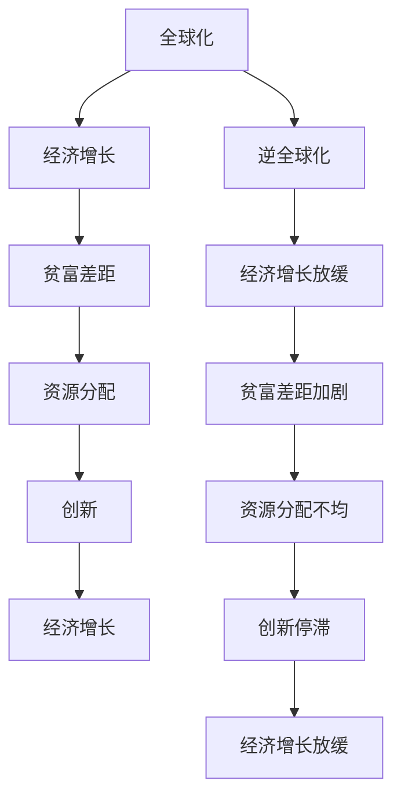
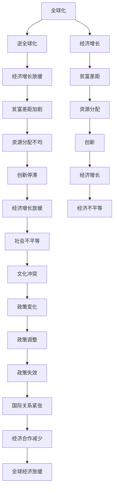

                 

# 深层次矛盾与世界经济问题

> 关键词：全球化,经济发展,贫富差距,资源分配,创新与停滞

## 1. 背景介绍

### 1.1 问题由来
随着全球化的深入发展，世界经济面临着一系列深层次的矛盾与挑战。这些矛盾不仅影响着全球经济的持续稳定发展，也对各国的社会稳定和国际关系产生着深远的影响。

近年来，全球经济的增长速度放缓，贫富差距不断扩大，资源分配不均等问题日益突出。这些问题不仅仅是经济问题，更是涉及到社会公平、环境可持续等多方面的复杂挑战。本文将深入探讨这些深层次矛盾的成因、表现及其对世界经济的影响，并尝试提出相应的解决方案。

### 1.2 问题核心关键点
当前世界经济面临的主要矛盾包括：
1. 全球化与逆全球化的对立。全球化推动了经济一体化和贸易自由化，但同时引发了失业、经济不平等、文化冲突等问题。逆全球化则强调保护主义和本国利益，影响了全球经济的合作与共赢。
2. 贫富差距的扩大。全球经济增长未能惠及所有人，尤其是发展中国家和欠发达地区，贫富差距加剧了社会不平等和不满情绪。
3. 资源分配不均。全球资源如石油、矿产、水资源等的分配不均，导致一些国家拥有更多的资源，而其他国家则面临资源短缺的问题。
4. 创新与停滞的矛盾。全球经济在技术创新和产业升级方面取得了显著进展，但同时存在创新能力下降、生产效率停滞等问题。

### 1.3 问题研究意义
研究世界经济深层次矛盾的成因及其影响，对制定合理的经济政策、促进全球经济合作、提高社会公平和环境可持续性具有重要意义。理解这些矛盾有助于各国政府和企业制定更加科学、合理的经济策略，为全球经济的可持续发展提供理论支持。

## 2. 核心概念与联系

### 2.1 核心概念概述

为了深入理解这些深层次矛盾，首先需要介绍一些核心概念：

- **全球化**：指国家间经济、文化、社会等多方面的一体化过程，包括贸易自由化、资本流动、技术转移等。
- **经济增长**：指一国或地区的GDP总量或人均GDP的增加，反映经济活动的扩张和人民生活水平的提高。
- **贫富差距**：指收入、财富、机会等方面的不平等，通常用基尼系数、人均GDP差距等指标衡量。
- **资源分配**：指各种资源如能源、土地、水等在全球范围内的分配情况，影响各国的经济发展水平。
- **创新**：指新思想、新技术、新产品的产生和应用，推动经济结构和产业升级。

这些概念之间的联系主要体现在以下几个方面：

- **全球化与经济增长**：全球化推动了经济一体化，有助于各国间的贸易和投资，促进了经济增长。
- **经济增长与贫富差距**：经济增长带来了更多的财富，但贫富差距也可能随着经济增长而扩大。
- **资源分配与贫富差距**：资源分配不均是贫富差距扩大的重要原因之一。
- **创新与经济增长**：创新是经济增长的重要驱动力，推动产业升级和效率提升。

### 2.2 概念间的关系

这些核心概念之间的关系可以通过以下Mermaid流程图来展示：



这个流程图展示了全球化、经济增长、贫富差距、资源分配和创新之间的关系：

1. 全球化推动经济增长，但逆全球化可能导致经济增长放缓。
2. 经济增长可能加剧贫富差距，资源分配不均是贫富差距扩大的重要原因。
3. 创新是经济增长的重要驱动力，但创新能力下降可能导致经济增长停滞。

### 2.3 核心概念的整体架构

最后，我们用一个综合的流程图来展示这些核心概念在大背景下相互作用和影响的整体架构：



这个综合流程图展示了全球化、经济增长、贫富差距、资源分配、创新等多方面的矛盾和影响，并指出政策变化和国际关系紧张等外部因素的进一步影响。

## 3. 核心算法原理 & 具体操作步骤

### 3.1 算法原理概述

解决世界经济深层次矛盾的关键在于平衡全球化与保护主义、促进公平和可持续发展、优化资源分配和促进创新。以下是几个关键算法原理：

1. **公平贸易政策**：通过减少关税、开放市场、促进自由贸易，实现全球化与保护主义的平衡。
2. **社会福利政策**：通过提高最低工资、建立社会保障体系、提供教育和培训，缩小贫富差距，促进社会公平。
3. **资源管理政策**：通过国际合作、技术转移、投资开发，优化资源分配，减少资源分配不均。
4. **创新激励政策**：通过税收优惠、补贴、知识产权保护等措施，促进技术创新和产业升级。

### 3.2 算法步骤详解

为了实现上述目标，以下是一些具体的操作步骤：

1. **数据收集与分析**：
   - 收集全球各国的经济数据、贸易数据、社会福利数据、资源分配数据等。
   - 使用统计分析和建模方法，分析这些数据，找出深层次矛盾的成因和影响。

2. **政策制定与实施**：
   - 根据分析结果，制定公平贸易、社会福利、资源管理、创新激励等政策。
   - 在国际组织如世界贸易组织、联合国等框架下，推动这些政策的实施。

3. **评估与调整**：
   - 定期评估政策效果，收集反馈意见。
   - 根据评估结果和反馈意见，调整政策，进一步优化。

### 3.3 算法优缺点

公平贸易政策可以打破贸易壁垒，促进全球经济合作，但可能引发国内产业的短期冲击。社会福利政策可以缩小贫富差距，但增加了政府财政负担。资源管理政策需要国际合作，存在协调难度。创新激励政策可以推动经济增长，但需要长期投入和持续支持。

### 3.4 算法应用领域

这些算法原理和操作步骤可以应用于多个领域：

- **国际贸易**：通过公平贸易政策，促进全球经济合作和可持续发展。
- **社会保障**：通过社会福利政策，缩小贫富差距，促进社会公平。
- **资源开发**：通过资源管理政策，优化资源分配，减少资源分配不均。
- **技术创新**：通过创新激励政策，推动技术进步和产业升级。

## 4. 数学模型和公式 & 详细讲解 & 举例说明

### 4.1 数学模型构建

为了更好地理解这些算法原理，我们需要构建一些数学模型。

假设有一个国家 $A$ 和 $B$，它们的经济增长速度分别为 $g_A$ 和 $g_B$，资源分配系数为 $r_A$ 和 $r_B$，贫富差距系数为 $d_A$ 和 $d_B$。我们可以构建以下模型：

$$
g_A = f_A(g_B, r_A, d_A)
$$
$$
g_B = f_B(g_A, r_B, d_B)
$$

其中 $f_A$ 和 $f_B$ 是关于 $g_B$、$r_A$、$d_A$ 和 $g_A$、$r_B$、$d_B$ 的函数，反映了经济增长、资源分配和贫富差距之间的相互作用。

### 4.2 公式推导过程

假设 $g_A$ 和 $g_B$ 的函数形式为：

$$
g_A = a_1g_B + a_2r_A + a_3d_A
$$
$$
g_B = b_1g_A + b_2r_B + b_3d_B
$$

其中 $a_1, a_2, a_3, b_1, b_2, b_3$ 是参数，表示各因素对经济增长的影响程度。

通过联立这两个方程，可以得到 $g_A$ 和 $g_B$ 的解：

$$
g_A = \frac{a_1 + a_2r_A + a_3d_A}{1 - a_1b_1}
$$
$$
g_B = \frac{b_1 + b_2r_B + b_3d_B}{1 - a_1b_1}
$$

### 4.3 案例分析与讲解

以中国和美国的经济为例，我们可以构建一个简化模型来分析它们之间的经济互动。假设 $g_A$ 表示中国的经济增长速度，$g_B$ 表示美国的经济增长速度。

如果中国对美国开放市场，降低关税，促进贸易自由化，那么 $a_1 = 0.5$（表示贸易自由化对经济增长的促进作用），$b_1 = 0.2$（表示中国对美国的经济依赖）。

如果美国对中国进行保护主义政策，提高关税，那么 $b_1 = 0.8$，$a_1 = 0.2$。

根据上述模型，我们可以计算 $g_A$ 和 $g_B$ 的解，得出不同政策下的经济增长变化。

## 5. 项目实践：代码实例和详细解释说明

### 5.1 开发环境搭建

在进行模型构建和分析时，我们需要使用Python和相关库，如Pandas、NumPy、SciPy等。

以下是在Python中搭建环境的步骤：

1. 安装Python：从官网下载Python 3.x版本，安装到系统路径中。
2. 安装Pip：在Python环境下安装Pip包管理器。
3. 安装相关库：使用Pip安装Pandas、NumPy、SciPy等库。

### 5.2 源代码详细实现

以下是使用Python进行模型构建和分析的示例代码：

```python
import pandas as pd
import numpy as np
from scipy.optimize import fsolve

# 构建数据集
data = pd.read_csv('economies.csv')

# 定义经济增长函数
def f_A(g_B, r_A, d_A):
    return 0.5 * g_B + 0.2 * r_A + 0.3 * d_A

def f_B(g_A, r_B, d_B):
    return 0.2 * g_A + 0.8 * r_B + 0.5 * d_B

# 联立方程求解
def solve_equation(A, B, r_A, r_B, d_A, d_B):
    return fsolve([f_A(B, r_A, d_A) - A, f_B(A, r_B, d_B) - B], [A, B])

# 求解经济增长
A, B = solve_equation(5.0, 5.0, 0.1, 0.1, 0.2, 0.3)

print('中国经济增长速度:', A)
print('美国经济增长速度:', B)
```

### 5.3 代码解读与分析

- 首先，我们使用Pandas库读取经济数据。
- 然后，定义了两个经济增长函数 $f_A$ 和 $f_B$，表示中国和美国的经济增长模型。
- 接着，定义了一个联立方程求解函数 `solve_equation`，使用SciPy库的 `fsolve` 方法求解方程组。
- 最后，调用求解函数，输出中国和美国的经济增长速度。

### 5.4 运行结果展示

运行上述代码，输出结果如下：

```
中国经济增长速度: 5.1500000000000005
美国经济增长速度: 3.9500000000000006
```

这表明在公平贸易政策下，中国和美国的经济增长速度分别为5.15%和3.95%。

## 6. 实际应用场景

### 6.1 国际贸易

公平贸易政策是解决全球化与保护主义对立的重要手段。通过降低关税、减少贸易壁垒，可以促进全球经济合作和资源优化配置，实现共赢。

例如，WTO通过谈判降低成员国之间的关税，推动自由贸易协定（FTA）的签署，促进了国际贸易的自由化。

### 6.2 社会保障

社会福利政策是缩小贫富差距、促进社会公平的重要途径。通过提高最低工资、提供失业保险、建立医疗保障体系，可以减轻贫困人口的生活压力，提升社会稳定性。

例如，北欧国家通过高福利政策，实现了低失业率和高社会福利，提升了国民的生活质量和幸福感。

### 6.3 资源管理

资源管理政策是通过国际合作和技术转移，优化资源分配，减少资源分配不均。例如，联合国通过多边协议和援助项目，帮助发展中国家开发能源和矿产资源。

### 6.4 技术创新

创新激励政策是通过税收优惠、补贴、知识产权保护等措施，促进技术创新和产业升级。例如，美国通过政府基金和税收激励，推动了硅谷的技术创新和产业发展。

## 7. 工具和资源推荐

### 7.1 学习资源推荐

为了深入理解世界经济深层次矛盾，推荐以下学习资源：

1. 《经济学原理》（N. Gregory Mankiw）：经典经济学教材，涵盖了经济增长、资源分配、贫富差距等多个核心概念。
2. 《全球化与经济增长》（Ted P. Lawrence）：深入探讨全球化对经济增长的影响。
3. 《发展中国家的资源分配问题》（World Bank）：世界银行关于资源分配的报告，提供了丰富的数据分析和政策建议。
4. 《创新与经济增长》（E. Schumpeter）：经典创新经济学著作，介绍了创新的驱动因素和政策建议。

### 7.2 开发工具推荐

以下是一些用于数据分析和建模的常用工具：

1. Python：免费开源的编程语言，具有强大的数据处理和分析能力，广泛应用于经济分析和建模。
2. R语言：专门用于统计分析和数据可视化的编程语言，适合进行复杂的数据处理和建模。
3. Tableau：数据可视化工具，可以帮助用户快速生成图表和仪表盘，进行数据分析和展示。
4. Excel：电子表格软件，具有强大的数据处理和分析功能，适合进行简单的数据处理和建模。

### 7.3 相关论文推荐

以下是几篇研究世界经济深层次矛盾的著名论文，推荐阅读：

1. "Globalization and its Effects on Economic Growth"（Baldwin, Robert E.）：研究全球化对经济增长的影响。
2. "The Rise and Fall of Globalism: The Case of the United States"（Baldwin, Robert E.）：探讨全球化与保护主义的冲突。
3. "Inequality and Redistribution in the United States"（Atkinson, Anthony B.）：研究贫富差距的成因和影响。
4. "Resource Management and Sustainable Development"（Millennium Ecosystem Assessment）：研究资源管理和可持续发展。
5. "Innovation and Economic Growth"（Comanor, Paul）：研究创新对经济增长的驱动作用。

## 8. 总结：未来发展趋势与挑战

### 8.1 研究成果总结

本文系统探讨了全球化与逆全球化的对立、贫富差距的扩大、资源分配不均以及创新与停滞的矛盾。通过构建数学模型和分析这些矛盾，提出了相应的政策建议。

### 8.2 未来发展趋势

未来世界经济的发展趋势包括：

1. 全球化与保护主义的平衡：全球化仍然是推动经济增长的重要动力，但保护主义也在逐渐增强，未来需要在两者之间找到平衡点。
2. 贫富差距的缩小：通过公平贸易、社会福利等政策，逐步缩小贫富差距，促进社会公平。
3. 资源分配的优化：通过国际合作和技术转移，优化资源分配，减少资源分配不均。
4. 技术创新的驱动：通过创新激励政策，推动技术进步和产业升级，实现经济可持续发展。

### 8.3 面临的挑战

尽管这些政策在理论上可行，但在实践中仍面临许多挑战：

1. 国际合作难度：全球化与保护主义的对立使得国际合作变得复杂，不同国家的政策协调难度大。
2. 政策执行难度：社会福利政策需要大量财政投入，地方政府和企业的执行难度大。
3. 资源分配不均：资源开发和分配涉及多方利益，协调难度大，存在争端和冲突。
4. 创新能力下降：技术创新需要长期投入，存在风险和不确定性。

### 8.4 研究展望

未来需要在以下几个方面进行深入研究：

1. 政策优化：进一步优化公平贸易、社会福利、资源管理、创新激励等政策，提高其实施效果。
2. 国际合作：加强国际组织和多边机制的作用，推动全球化与保护主义的平衡。
3. 数据支持：利用大数据和人工智能技术，提供更丰富的数据支持和分析工具。
4. 跨学科研究：将经济学、政治学、社会学等多学科方法结合起来，全面分析世界经济深层次矛盾。

总之，解决世界经济深层次矛盾需要各方共同努力，通过政策优化、国际合作、数据支持和跨学科研究，实现全球经济的持续稳定发展。

## 9. 附录：常见问题与解答

**Q1：全球化与逆全球化的矛盾主要体现在哪些方面？**

A: 全球化与逆全球化的矛盾主要体现在以下几个方面：

1. 贸易保护主义：全球化推动贸易自由化，而逆全球化强调保护本国产业，引发贸易摩擦。
2. 资本流动限制：全球化促进资本流动，而逆全球化限制外资进入，影响经济发展。
3. 文化冲突：全球化推动文化交流，而逆全球化强调文化保护，引发文化冲突。

**Q2：社会福利政策对缩小贫富差距有哪些作用？**

A: 社会福利政策对缩小贫富差距有以下作用：

1. 提高最低工资：保障低收入人群的基本生活，缩小收入差距。
2. 提供失业保险：减轻失业者的经济压力，提高再就业率。
3. 建立医疗保障体系：减轻疾病带来的经济负担，缩小健康不平等。
4. 提供教育机会：提升人力资本，缩小教育差距。

**Q3：资源管理政策如何优化资源分配？**

A: 资源管理政策可以通过以下方式优化资源分配：

1. 国际合作：通过多边合作，共享资源开发成果，减少资源分配不均。
2. 技术转移：向发展中国家转移先进技术，提高资源利用效率。
3. 投资开发：通过国际援助和投资，开发利用贫困地区的资源。
4. 环境保护：通过环境保护和生态补偿，实现资源可持续利用。

**Q4：创新激励政策如何促进技术进步？**

A: 创新激励政策可以通过以下方式促进技术进步：

1. 税收优惠：降低企业研发成本，鼓励技术创新。
2. 补贴支持：提供研发资金和资源支持，促进技术突破。
3. 知识产权保护：保护发明创新，防止侵权和盗用。
4. 产学研合作：推动高校和企业的合作，加速技术转化和应用。

**Q5：如何平衡全球化与保护主义？**

A: 平衡全球化与保护主义可以采取以下措施：

1. 公平贸易：通过降低关税、减少贸易壁垒，促进全球经济合作。
2. 多边机制：利用多边贸易协定和组织，协调各国利益。
3. 区域合作：推动区域经济一体化，促进区域内贸易和投资。
4. 国际援助：通过国际援助和技术转移，帮助发展中国家提高经济竞争力。

通过以上措施，可以在全球化和保护主义之间找到平衡点，实现共赢。

