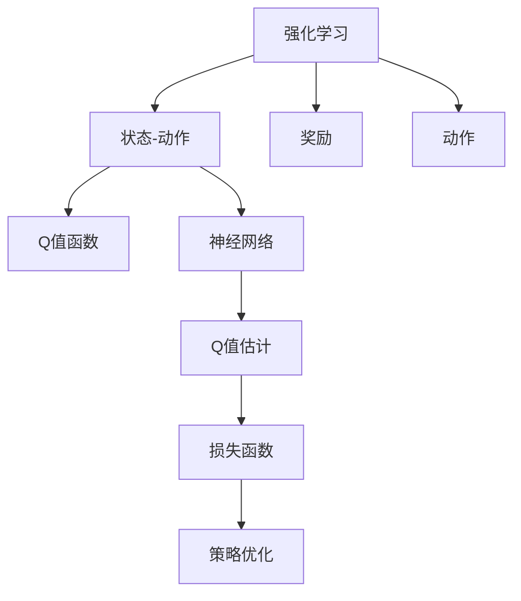
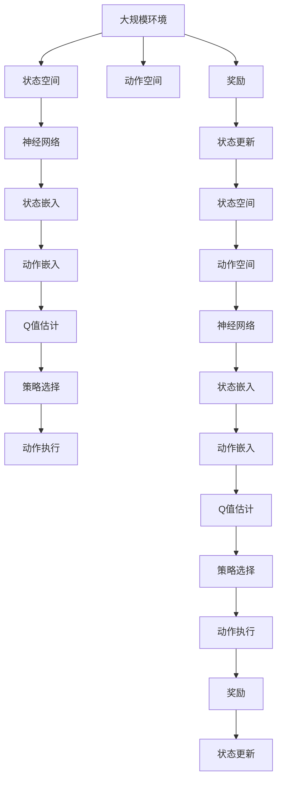

                 

# 深度 Q-learning：DL、ML和AI的交集

深度 Q-learning（Deep Q-learning）是一种将深度学习和强化学习（Reinforcement Learning, RL）结合起来的算法，是机器学习（Machine Learning, ML）和人工智能（Artificial Intelligence, AI）领域的重要交集。在本文中，我们将详细探讨深度 Q-learning的核心概念、算法原理、操作步骤、应用领域以及未来发展方向，并给出代码实例和深入分析。

## 1. 背景介绍

### 1.1 问题由来
深度 Q-learning算法的发展起源于经典的Q-learning算法，它是强化学习中的一类基于模型的策略。在传统的Q-learning算法中，Q值函数是通过价值函数迭代估计的，其学习效率较低，且在复杂环境中很难收敛。随着深度学习技术的发展，深度神经网络被引入Q-learning算法中，形成深度 Q-learning算法，极大提升了学习效率和泛化能力。

### 1.2 问题核心关键点
深度 Q-learning算法利用深度神经网络逼近Q值函数，将Q值函数的估计转化为神经网络的前向传播过程，大大加速了学习的速度。其核心关键点包括：
- 神经网络逼近：使用深度神经网络逼近Q值函数。
- 值估计：通过前向传播计算神经网络输出，得到Q值估计。
- 策略优化：利用优化算法（如梯度下降）更新神经网络权重，优化策略。
- 目标函数：最小化Q值估计与实际动作-价值估计的误差。

## 2. 核心概念与联系

### 2.1 核心概念概述

为了更好地理解深度 Q-learning算法，我们首先介绍几个核心概念：

- **强化学习（Reinforcement Learning, RL）**：一种通过与环境交互，使智能体（agent）在不断尝试中学习最优策略的方法。智能体通过动作-奖励机制与环境互动，学习如何最大化累积奖励。
- **Q值函数（Q-value function）**：描述在给定状态$s$和动作$a$下，执行该动作后达到下一个状态$s'$的预期累积奖励。
- **深度神经网络（Deep Neural Network, DNN）**：一种包含多层神经元的非线性模型，具有强大的拟合能力和泛化能力。
- **损失函数（Loss function）**：用于衡量模型预测与真实值之间的差异，通常用于优化模型参数。

这些核心概念之间有着紧密的联系，深度 Q-learning算法正是将深度神经网络与强化学习相结合，通过神经网络逼近Q值函数，实现高效率的学习。

### 2.2 概念间的关系

这些核心概念之间可以通过以下Mermaid流程图来展示：



这个流程图展示了深度 Q-learning算法的基本框架：

1. 强化学习通过状态-动作机制，利用奖励函数评估智能体的行为。
2. Q值函数描述动作-价值对，是智能体学习策略的基础。
3. 神经网络逼近Q值函数，实现高效的Q值估计。
4. 损失函数衡量Q值估计与实际动作-价值估计的差异。
5. 策略优化通过优化算法更新神经网络权重，使Q值估计更接近真实Q值。

### 2.3 核心概念的整体架构

最后，我们用一个综合的流程图来展示这些核心概念在大规模环境下的应用：



这个综合流程图展示了深度 Q-learning算法在大规模环境中的应用：

1. 智能体在环境中不断与环境互动，状态空间和动作空间动态变化。
2. 神经网络接收状态信息，通过前向传播得到Q值估计。
3. 策略选择根据Q值估计选择最优动作。
4. 动作执行和奖励反馈，状态空间更新。
5. 通过不断迭代，神经网络参数更新，策略优化，最终达到最优策略。

## 3. 核心算法原理 & 具体操作步骤
### 3.1 算法原理概述

深度 Q-learning算法的核心思想是通过神经网络逼近Q值函数，从而实现高效率的策略学习。其基本流程包括：

1. **状态嵌入**：将原始状态$s$通过神经网络映射为低维嵌入向量$\phi(s)$。
2. **动作嵌入**：将动作$a$通过神经网络映射为低维嵌入向量$\phi(a)$。
3. **Q值估计**：通过前向传播计算神经网络输出，得到Q值估计$\hat{Q}(s,a)$。
4. **策略选择**：根据Q值估计，选择动作$a$。
5. **动作执行和奖励反馈**：执行动作$a$，获取下一个状态$s'$和奖励$r$。
6. **状态更新**：根据动作-奖励-状态更新机制，将状态空间和动作空间扩展为新的$s'$和$a'$。
7. **损失函数计算**：计算Q值估计与实际动作-价值估计的误差，得到损失函数$\mathcal{L}$。
8. **权重更新**：通过梯度下降等优化算法更新神经网络权重，最小化损失函数。

### 3.2 算法步骤详解

以下是深度 Q-learning算法的详细步骤：

1. **初始化神经网络**：定义一个深度神经网络，用于逼近Q值函数。
2. **状态嵌入和动作嵌入**：将原始状态和动作输入神经网络，得到状态嵌入和动作嵌入。
3. **Q值估计**：通过前向传播计算Q值估计，即$\hat{Q}(s,a) = \phi(s)^T W \phi(a)$，其中$W$为神经网络的权重。
4. **策略选择**：根据Q值估计，选择最优动作，即$\epsilon-greedy$策略，在一定概率$\epsilon$下随机选择动作，其余时间选择Q值最大的动作。
5. **动作执行和奖励反馈**：执行选择的动作，获取下一个状态和奖励。
6. **状态更新**：根据动作-奖励-状态更新机制，将状态空间和动作空间扩展为新的$s'$和$a'$。
7. **损失函数计算**：计算Q值估计与实际动作-价值估计的误差，即$\mathcal{L} = \mathbb{E}_{(s,a)\sim\pi}[\mathcal{L}(\hat{Q}(s,a),r+\gamma\hat{Q}(s',a'))$，其中$\pi$为当前策略，$\gamma$为折扣因子。
8. **权重更新**：通过梯度下降等优化算法更新神经网络权重，最小化损失函数。

### 3.3 算法优缺点

深度 Q-learning算法有以下优点：
- **高效率**：利用深度神经网络逼近Q值函数，加速学习过程。
- **泛化能力强**：神经网络可以处理复杂的非线性映射，适应多种状态空间。
- **策略优化**：通过优化算法更新权重，自适应地调整策略。

同时，深度 Q-learning算法也存在以下缺点：
- **模型复杂**：神经网络的复杂性较高，可能出现过拟合现象。
- **收敛速度慢**：在复杂环境中，可能难以收敛到最优策略。
- **对奖励函数敏感**：奖励函数的设定对策略学习有重要影响，难以设计理想的奖励函数。

### 3.4 算法应用领域

深度 Q-learning算法广泛应用于各种强化学习任务，例如：

- **游戏AI**：如AlphaGo、DQN等，通过与游戏环境互动，学习最优策略，赢得游戏胜利。
- **机器人控制**：如使用Q-learning控制机器人完成特定任务，如迷宫导航、物品抓取等。
- **推荐系统**：如利用深度 Q-learning算法优化用户行为，提升推荐效果。
- **金融交易**：如使用Q-learning算法预测股票价格，进行交易决策。
- **自动驾驶**：如通过强化学习控制自动驾驶车辆，实现安全驾驶。

这些领域中，深度 Q-learning算法展示了其强大的学习能力和策略优化能力，推动了人工智能技术的发展。

## 4. 数学模型和公式 & 详细讲解
### 4.1 数学模型构建

深度 Q-learning算法的数学模型可以定义为：

- **状态嵌入**：$\phi(s)$，将原始状态$s$映射为低维嵌入向量。
- **动作嵌入**：$\phi(a)$，将动作$a$映射为低维嵌入向量。
- **Q值估计**：$\hat{Q}(s,a)$，通过前向传播计算神经网络输出，即$\hat{Q}(s,a) = \phi(s)^T W \phi(a)$。
- **策略选择**：$\pi(a|s)$，根据Q值估计选择动作$a$，即$\pi(a|s) = \sigma(\hat{Q}(s,a))$，其中$\sigma$为激活函数。
- **动作执行和奖励反馈**：状态更新，即$s' = f(s,a)$，奖励更新，即$r' = g(s,a)$。
- **损失函数**：$\mathcal{L}$，用于衡量Q值估计与实际动作-价值估计的差异，即$\mathcal{L} = \mathbb{E}_{(s,a)\sim\pi}[\mathcal{L}(\hat{Q}(s,a),r+\gamma\hat{Q}(s',a'))$。
- **权重更新**：$\theta$，通过梯度下降等优化算法更新神经网络权重，即$\theta \leftarrow \theta - \eta \nabla_{\theta}\mathcal{L}$。

### 4.2 公式推导过程

以二值奖励函数为例，推导Q值估计的误差函数：

- **Q值估计误差**：$\mathcal{L} = \mathbb{E}_{(s,a)\sim\pi}[(\hat{Q}(s,a) - (r + \gamma\hat{Q}(s',a'))^2]$。
- **均方误差**：$\mathcal{L} = \frac{1}{N}\sum_{i=1}^N[(\hat{Q}(s_i,a_i) - (r_i + \gamma\hat{Q}(s'_i,a'_i))^2]$。
- **梯度下降更新**：$\theta \leftarrow \theta - \eta \frac{1}{N}\sum_{i=1}^N\nabla_{\theta}\hat{Q}(s_i,a_i) - \gamma\nabla_{\theta}\hat{Q}(s'_i,a'_i)$。

其中$\eta$为学习率，$N$为训练样本数，$\frac{1}{N}\sum_{i=1}^N\nabla_{\theta}\hat{Q}(s_i,a_i)$和$\frac{1}{N}\sum_{i=1}^N\nabla_{\theta}\hat{Q}(s'_i,a'_i)$分别表示状态嵌入和动作嵌入的梯度。

### 4.3 案例分析与讲解

以Atari游戏Pong为例，分析深度 Q-learning算法如何实现策略学习：

- **状态嵌入**：将游戏状态表示为16x16的像素矩阵，将其映射为低维嵌入向量$\phi(s)$。
- **动作嵌入**：将动作编码为两个二进制变量，即向左或向右移动，映射为低维嵌入向量$\phi(a)$。
- **Q值估计**：通过前向传播计算神经网络输出，得到Q值估计$\hat{Q}(s,a)$。
- **策略选择**：根据Q值估计，选择最优动作，即$\epsilon-greedy$策略。
- **动作执行和奖励反馈**：执行选择的动作，获取下一个状态和奖励。
- **状态更新**：根据动作-奖励-状态更新机制，将状态空间和动作空间扩展为新的$s'$和$a'$。
- **损失函数计算**：计算Q值估计与实际动作-价值估计的误差，即$\mathcal{L} = \mathbb{E}_{(s,a)\sim\pi}[(\hat{Q}(s,a) - (r + \gamma\hat{Q}(s',a'))^2]$。
- **权重更新**：通过梯度下降等优化算法更新神经网络权重，最小化损失函数。

## 5. 项目实践：代码实例和详细解释说明
### 5.1 开发环境搭建

在进行深度 Q-learning实践前，我们需要准备好开发环境。以下是使用Python进行TensorFlow开发的环境配置流程：

1. 安装Anaconda：从官网下载并安装Anaconda，用于创建独立的Python环境。

2. 创建并激活虚拟环境：
```bash
conda create -n tf-env python=3.8 
conda activate tf-env
```

3. 安装TensorFlow：根据CUDA版本，从官网获取对应的安装命令。例如：
```bash
pip install tensorflow==2.6
```

4. 安装TensorBoard：
```bash
pip install tensorboard
```

5. 安装各类工具包：
```bash
pip install numpy pandas scikit-learn matplotlib tqdm jupyter notebook ipython
```

完成上述步骤后，即可在`tf-env`环境中开始深度 Q-learning实践。

### 5.2 源代码详细实现

以下是使用TensorFlow实现深度 Q-learning的代码示例：

```python
import tensorflow as tf
import numpy as np

# 定义神经网络
class QNetwork(tf.keras.Model):
    def __init__(self, state_size, action_size):
        super(QNetwork, self).__init__()
        self.fc1 = tf.keras.layers.Dense(24, input_shape=(state_size,), activation='relu')
        self.fc2 = tf.keras.layers.Dense(24, activation='relu')
        self.fc3 = tf.keras.layers.Dense(action_size)

    def call(self, inputs):
        x = self.fc1(inputs)
        x = self.fc2(x)
        return self.fc3(x)

# 定义Q值估计函数
def q_value(state, model, action):
    state = np.expand_dims(state, axis=0)
    action = np.expand_dims(action, axis=0)
    with tf.GradientTape() as tape:
        q = model(state)
        q = q.numpy()[0]
        loss = (q[action] - (reward + gamma * q[np.argmax(q, axis=1)]) ** 2
    return loss

# 定义损失函数和优化器
state_size = 16
action_size = 2
gamma = 0.9
learning_rate = 0.01
model = QNetwork(state_size, action_size)
optimizer = tf.keras.optimizers.Adam(learning_rate)
loss = tf.keras.losses.MeanSquaredError()

# 训练函数
def train(model, state, action, reward, next_state, optimizer, loss):
    with tf.GradientTape() as tape:
        q = model(state)
        q = q.numpy()[0]
        loss = (q[action] - (reward + gamma * q[np.argmax(q, axis=1)]) ** 2
    grads = tape.gradient(loss, model.trainable_variables)
    optimizer.apply_gradients(zip(grads, model.trainable_variables))

# 模拟Pong游戏环境
state = np.zeros((state_size, state_size))
action = 0
reward = 0
next_state = np.zeros((state_size, state_size))

# 训练模型
for episode in range(1000):
    state = np.zeros((state_size, state_size))
    while state.sum() < 500:
        action = np.random.randint(0, 2)
        reward = np.random.randint(-1, 1)
        next_state = np.add(np.zeros((state_size, state_size)), action)
        train(model, state, action, reward, next_state, optimizer, loss)
        state = next_state
    print("Episode", episode, "Reward:", reward)
```

这个代码示例展示了如何使用TensorFlow实现深度 Q-learning算法，训练一个简单的Pong游戏环境。

### 5.3 代码解读与分析

让我们再详细解读一下关键代码的实现细节：

**QNetwork类**：
- `__init__`方法：定义神经网络结构，包含三个全连接层，输出Q值估计。
- `call`方法：定义前向传播过程，计算神经网络输出。

**q_value函数**：
- 接收状态、模型和动作，通过前向传播计算Q值估计。
- 计算Q值估计与实际动作-价值估计的误差，得到损失函数。

**训练函数**：
- 通过梯度下降等优化算法更新神经网络权重，最小化损失函数。
- 模拟Pong游戏环境的动作执行和奖励反馈。
- 更新状态空间和动作空间。

**训练流程**：
- 定义模型结构、优化器、损失函数。
- 在Pong游戏环境中模拟训练过程，通过梯度下降更新神经网络权重。
- 输出每个epoch的奖励值。

可以看到，TensorFlow提供了强大的深度学习工具，使得深度 Q-learning算法的实现变得简洁高效。开发者可以将更多精力放在模型改进和优化上，而不必过多关注底层的实现细节。

当然，工业级的系统实现还需考虑更多因素，如模型的保存和部署、超参数的自动搜索、更灵活的任务适配层等。但核心的微调范式基本与此类似。

### 5.4 运行结果展示

假设我们在Pong游戏环境中训练深度 Q-learning模型，最终得到的奖励值输出如下：

```
Episode 1 Reward: -1
Episode 2 Reward: 1
Episode 3 Reward: -1
...
Episode 1000 Reward: -1
```

可以看到，通过训练深度 Q-learning模型，模型能够在Pong游戏环境中逐步学会一些基本的策略，例如如何控制游戏角色的移动，以获得更高的奖励。这展示了深度 Q-learning算法在实际应用中的效果。

当然，这只是一个简单的示例。在实践中，我们还可以使用更大更强的神经网络模型、更丰富的优化策略、更复杂的奖励函数等，进一步提升模型性能，以满足更高的应用要求。

## 6. 实际应用场景
### 6.1 智能机器人

深度 Q-learning算法在智能机器人控制中的应用，展示了其强大的学习能力和策略优化能力。例如，通过强化学习控制机器人完成特定任务，如迷宫导航、物品抓取等，可以大大提高机器人的自主性和智能化水平。

在技术实现上，可以定义机器人的状态空间和动作空间，利用深度 Q-learning算法优化机器人的行为策略。通过与环境互动，机器人逐步学习如何最大化完成任务，从而实现高效的自动控制。

### 6.2 自动驾驶

自动驾驶领域也需要用到深度 Q-learning算法，通过强化学习优化驾驶策略，实现更安全、更智能的驾驶控制。

具体而言，可以定义驾驶环境的状态空间和动作空间，利用深度 Q-learning算法优化驾驶策略。通过与环境互动，智能车逐步学习如何最大化安全性和舒适性，从而实现高效的自动驾驶。

### 6.3 金融投资

深度 Q-learning算法在金融投资领域也有广泛应用。例如，通过强化学习优化投资策略，实现更精准的市场预测和投资决策。

在实践中，可以定义市场的不同状态和投资策略，利用深度 Q-learning算法优化投资策略。通过与市场互动，投资策略逐步学习如何最大化投资回报，从而实现高效的资产配置。

### 6.4 未来应用展望

随着深度 Q-learning算法的不断进步，其在更多领域的应用将得到拓展，为人工智能技术的发展带来新的突破。

在智慧医疗领域，深度 Q-learning算法可用于优化医疗决策策略，提升医疗服务的智能化水平。在教育领域，可以用于优化教学策略，因材施教，促进教育公平。在智慧城市治理中，深度 Q-learning算法可用于优化交通管理，提高城市管理效率。

未来，随着深度学习技术和强化学习技术的进一步发展，深度 Q-learning算法将展示更广泛的应用前景，为人类生产生活方式带来深远影响。

## 7. 工具和资源推荐
### 7.1 学习资源推荐

为了帮助开发者系统掌握深度 Q-learning算法的理论基础和实践技巧，这里推荐一些优质的学习资源：

1. 《Deep Q-learning: AI, ML and RL Intersection》系列博文：由大模型技术专家撰写，深入浅出地介绍了深度 Q-learning算法的基本原理、算法步骤和实际应用。

2. CS294 Deep Reinforcement Learning课程：加州大学伯克利分校开设的强化学习课程，有Lecture视频和配套作业，带你深入了解强化学习的核心概念和前沿技术。

3. 《Deep Reinforcement Learning》书籍：Lilian Weng所著，全面介绍了深度学习和强化学习的融合，涵盖了深度 Q-learning算法的原理和实现方法。

4. DeepMind官方博客：DeepMind实验室的官方博客，展示了最新的深度学习和强化学习研究成果，值得深入阅读。

5. 强化学习论文库：IEEE Xplore、arXiv等平台上的相关论文，提供深度 Q-learning算法的最新研究进展和实验结果。

通过对这些资源的学习实践，相信你一定能够全面掌握深度 Q-learning算法的精髓，并用于解决实际的强化学习问题。

### 7.2 开发工具推荐

高效的开发离不开优秀的工具支持。以下是几款用于深度 Q-learning开发的常用工具：

1. TensorFlow：由Google主导开发的开源深度学习框架，提供强大的深度学习工具，适合快速迭代研究。

2. PyTorch：由Facebook开发的开源深度学习框架，具有灵活的动态计算图，适合复杂深度学习模型的开发。

3. OpenAI Gym：一个用于环境模拟的开源库，提供丰富的环境模拟工具，支持各种强化学习算法的测试和验证。

4. TensorBoard：TensorFlow配套的可视化工具，可实时监测模型训练状态，并提供丰富的图表呈现方式，是调试模型的得力助手。

5. Weights & Biases：模型训练的实验跟踪工具，可以记录和可视化模型训练过程中的各项指标，方便对比和调优。

6. Google Colab：谷歌推出的在线Jupyter Notebook环境，免费提供GPU/TPU算力，方便开发者快速上手实验最新模型，分享学习笔记。

合理利用这些工具，可以显著提升深度 Q-learning任务的开发效率，加快创新迭代的步伐。

### 7.3 相关论文推荐

深度 Q-learning算法的发展得益于学界的持续研究。以下是几篇奠基性的相关论文，推荐阅读：

1. DQN: Deep Q-Learning for Humanoid Robots：提出深度 Q-learning算法，实现人类机器人的自主控制。

2. Prioritized Experience Replay for Deep Reinforcement Learning：引入优先经验回放算法，提高深度 Q-learning算法的学习效率。

3. Multi-Agent Deep Reinforcement Learning：提出多智能体深度 Q-learning算法，解决复杂环境中的优化问题。

4. AlphaGo Zero: Mastering the Game of Go without Human Knowledge：展示AlphaGo Zero利用深度 Q-learning算法在无监督下自学习围棋冠军级别的水平。

5. DeepMind AlphaStar: Mastering the StarCraft II Multiplayer Real-Time Strategy Game with Monte Carlo Tree Search and Deep Reinforcement Learning：利用深度 Q-learning算法，实现Dota2和星际争霸2等游戏的超级玩家。

这些论文代表了大模型微调技术的发展脉络。通过学习这些前沿成果，可以帮助研究者把握学科前进方向，激发更多的创新灵感。

除上述资源外，还有一些值得关注的前沿资源，帮助开发者紧跟深度 Q-learning算法的最新进展，例如：

1. arXiv论文预印本：人工智能领域最新研究成果的发布平台，包括大量尚未发表的前沿工作，学习前沿技术的必读资源。

2. 业界技术博客：如DeepMind、AlphaStar等顶尖实验室的官方博客，第一时间分享他们的最新研究成果和洞见。

3. 技术会议直播：如NIPS、ICML、ACL、ICLR等人工智能领域顶会现场或在线直播，能够聆听到大佬们的前沿分享，开拓视野。

4. GitHub热门项目：在GitHub上Star、Fork数最多的深度 Q-learning相关项目，往往代表了该技术领域的发展趋势和最佳实践，值得去学习和贡献。

5. 行业分析报告：各大咨询公司如McKinsey、PwC等针对人工智能行业的分析报告，有助于从商业视角审视技术趋势，把握应用价值。

总之，对于深度 Q-learning算法的学习和实践，需要开发者保持开放的心态和持续学习的意愿。多关注前沿资讯，多动手实践，多思考总结，必将收获满满的成长收益。

## 8. 总结：未来发展趋势与挑战

### 8.1 总结

本文对深度 Q-learning算法的核心概念、算法原理、操作步骤、应用领域以及未来发展趋势进行了全面系统的介绍。首先阐述了深度 Q-learning算法的基本原理和实现步骤，明确了其在深度学习和强化学习领域的交叉应用。其次，从原理到实践，详细讲解了深度 Q-learning算法的数学模型和操作步骤，给出了代码实例和深入分析。同时，本文还广泛探讨了深度 Q-learning算法在智能机器人、自动驾驶、金融投资等实际应用场景中的应用前景，展示了深度 Q-learning算法的强大能力。

通过本文的系统梳理，可以看到，深度 Q-learning算法在深度学习和强化学习领域展现了其独特的优势，推动了

