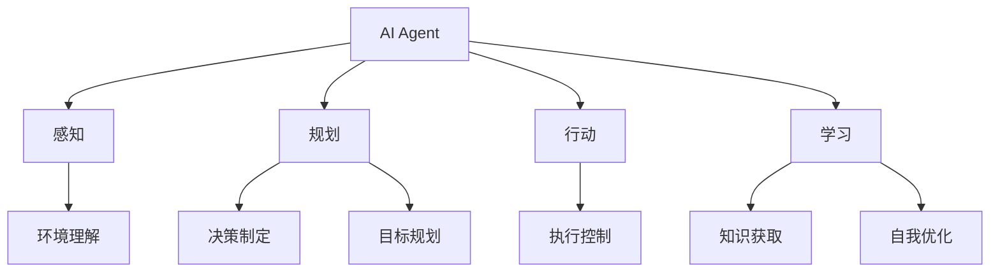
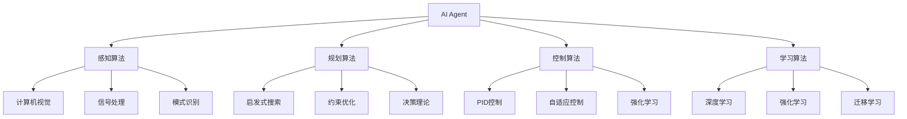
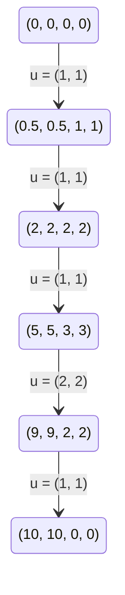

# AI人工智能 Agent：在航天领域中的应用

## 1. 背景介绍

### 1.1 问题的由来

航天领域一直是人类探索和挑战的前沿。随着科技的不断进步,航天任务变得越来越复杂,需要处理大量的数据、进行精确的计算和规划。传统的人工操作方式已经无法满足日益增长的需求,因此迫切需要引入先进的人工智能(AI)技术来提高效率和准确性。

### 1.2 研究现状

近年来,AI技术在航天领域得到了广泛应用,包括:

- 航天器自主导航和控制
- 航天器健康管理和故障诊断
- 航天数据处理和分析
- 航天任务规划和调度
- 航天模拟和训练等

然而,现有的AI系统还存在一些局限性,例如缺乏灵活性、可解释性和鲁棒性等,难以应对复杂的航天环境。因此,需要开发更加智能、自主和可靠的AI Agent系统。

### 1.3 研究意义

开发航天领域的AI Agent系统具有重大意义:

1. 提高航天任务的安全性和可靠性
2. 减轻航天员的工作负担
3. 提高航天任务的效率和准确性
4. 降低航天任务的成本和风险
5. 推动航天技术的创新和发展

### 1.4 本文结构

本文将全面介绍AI Agent在航天领域的应用,包括:

- 核心概念与联系
- 核心算法原理与具体步骤
- 数学模型和公式推导
- 项目实践和代码实例
- 实际应用场景
- 工具和资源推荐
- 未来发展趋势与挑战

## 2. 核心概念与联系

在介绍AI Agent在航天领域的应用之前,我们需要了解一些核心概念及其联系。

### 2.1 AI Agent

AI Agent是一种具有自主性、响应性、主动性和持续性的智能系统。它能够感知环境、规划行动、执行任务并不断学习和优化自身。

### 2.2 感知

感知是AI Agent获取环境信息的过程,包括传感器数据采集、信号处理和特征提取等。在航天领域,常见的感知手段包括雷达、相机、传感器阵列等。

### 2.3 规划

规划是AI Agent根据感知到的环境信息和任务目标,制定行动策略的过程。它包括决策制定和目标规划两个方面。

### 2.4 行动

行动是AI Agent执行规划好的策略的过程,通常需要控制执行器(如机械臂、推进器等)来完成实际的操作。

### 2.5 学习

学习是AI Agent从过去的经验中获取知识,并优化自身模型和策略的过程。它是AI Agent不断提高智能水平的关键。

## 3. 核心算法原理 & 具体操作步骤

### 3.1 算法原理概述

AI Agent在航天领域的应用通常采用以下核心算法:

1. **感知算法**: 如计算机视觉、信号处理、模式识别等,用于从传感器数据中提取有用信息。
2. **规划算法**: 如启发式搜索、约束优化、决策理论等,用于制定行动策略。
3. **控制算法**: 如PID控制、自适应控制、强化学习等,用于执行精确的控制操作。
4. **学习算法**: 如深度学习、强化学习、迁移学习等,用于从经验中获取知识。

这些算法相互配合,构成了AI Agent的核心能力。

### 3.2 算法步骤详解

AI Agent在航天领域的典型工作流程如下:

1. **感知环境**:
   - 采集传感器数据(图像、雷达、惯性等)
   - 应用感知算法(如计算机视觉、信号处理)提取特征
   - 构建环境模型

2. **规划行动**:
   - 根据任务目标和环境模型
   - 应用规划算法(如启发式搜索、约束优化)制定策略
   - 生成行动序列

3. **执行控制**:
   - 将行动序列转化为控制命令
   - 应用控制算法(如PID控制、自适应控制)执行精确控制
   - 监测执行过程

4. **学习优化**:
   - 收集执行过程中的数据
   - 应用学习算法(如深度学习、强化学习)更新模型
   - 优化感知、规划和控制策略

该流程是一个闭环过程,AI Agent通过不断感知、规划、执行和学习,逐步提高自身能力。

### 3.3 算法优缺点

上述算法具有以下优缺点:

**优点**:
- 高度自主性,减轻人工干预
- 高效率和准确性
- 能够处理复杂环境和任务
- 具有学习和自我优化能力

**缺点**:
- 算法复杂,需要大量计算资源
- 存在不确定性和鲁棒性问题
- 缺乏可解释性和透明度
- 存在潜在的安全和伦理风险

### 3.4 算法应用领域

AI Agent相关算法在航天领域有广泛应用,包括但不限于:

- 航天器自主导航和控制
- 航天器健康管理和故障诊断
- 航天数据处理和分析
- 航天任务规划和调度
- 航天模拟和训练
- 航天器设计和优化
- 航天探测和勘测
- 航天通信和网络
- ...

## 4. 数学模型和公式 & 详细讲解 & 举例说明

### 4.1 数学模型构建

AI Agent通常需要构建数学模型来描述和解决实际问题。以航天器自主导航为例,我们可以建立如下模型:

已知:
- 航天器当前状态 $s_t = (x_t, y_t, z_t, v_x^t, v_y^t, v_z^t)$,包括位置和速度
- 目标状态 $s_g = (x_g, y_g, z_g, v_{xg}, v_{yg}, v_{zg})$
- 环境模型 $f(s_t, u_t) = s_{t+1}$,描述了在当前状态 $s_t$ 和控制输入 $u_t$ 下,航天器将转移到下一状态 $s_{t+1}$ 的过程。

目标:
$$\min_{u_t} J = \sum_{t=0}^{T}c(s_t, u_t) + c_T(s_T)$$

求解一系列最优控制输入 $u_t$,使得航天器从初始状态 $s_0$ 到达目标状态 $s_g$,并最小化总代价 $J$。其中 $c(s_t, u_t)$ 是instantaneous cost,描述了在状态 $s_t$ 施加控制 $u_t$ 的即时代价; $c_T(s_T)$ 是terminal cost,描述了到达终止状态 $s_T$ 的代价。

### 4.2 公式推导过程

对于上述最优控制问题,我们可以使用动态规划算法求解。定义价值函数(Value Function):

$$V(s_t) = \min_{u_t,...,u_T} \left\{\sum_{k=t}^{T}c(s_k, u_k) + c_T(s_T) \big| s_{k+1} = f(s_k, u_k)\right\}$$

该价值函数表示从状态 $s_t$ 开始,执行最优策略所能获得的最小总代价。根据贝尔曼方程(Bellman Equation),我们可以将价值函数分解为:

$$V(s_t) = \min_{u_t} \left\{c(s_t, u_t) + V(f(s_t, u_t))\right\}$$

上式是一个递归关系,可以通过反向传播的方式求解。具体地,我们从终止状态开始:

$$V(s_T) = c_T(s_T)$$

然后反向计算前一个状态的价值函数:

$$V(s_{T-1}) = \min_{u_{T-1}} \left\{c(s_{T-1}, u_{T-1}) + V(s_T)\right\}$$

如此递推,直到计算出初始状态 $s_0$ 的价值函数。同时,我们也可以得到每一个状态的最优控制输入 $u_t^*$,它是使得 $V(s_t)$ 取得最小值时对应的控制输入。

最终,我们得到一个控制策略 $\pi^*(s_t) = u_t^*$,它为每个状态 $s_t$ 指定了一个最优控制输入 $u_t^*$,使得总代价 $J$ 最小化。

### 4.3 案例分析与讲解

考虑一个简单的二维平面导航问题。已知航天器初始状态 $s_0 = (0, 0, 0, 0)$,目标状态 $s_g = (10, 10, 0, 0)$。环境模型为:

$$\begin{align*}
x_{t+1} &= x_t + v_x^t\
y_{t+1} &= y_t + v_y^t\
v_{x}^{t+1} &= v_x^t + u_x^t\
v_{y}^{t+1} &= v_y^t + u_y^t
\end{align*}$$

其中 $u_x^t$、$u_y^t$ 分别是 $x$、$y$ 方向上的控制输入(加速度)。代价函数设置为:

$$\begin{align*}
c(s_t, u_t) &= 1 + 0.1(u_x^{t^2} + u_y^{t^2})\
c_T(s_T) &= 100\sqrt{(x_T - x_g)^2 + (y_T - y_g)^2}
\end{align*}$$

其中,instantaneous cost鼓励航天器以较小的加速度运动,terminal cost则惩罚离目标位置较远的终止状态。

通过动态规划算法求解,我们可以得到最优控制策略,使得航天器以最小总代价从初始状态导航到目标状态。具体的状态轨迹和控制输入如下图所示:

可以看出,最优控制策略先以较大的加速度向目标位置靠拢,当接近目标时则减小加速度,最终平稳到达。这样的策略在满足导航要求的同时,也尽可能减小了总代价。

### 4.4 常见问题解答

1. **如何处理模型不确定性?**

   我们可以引入鲁棒最优控制理论,将模型不确定性建模为约束或扰动,求解能够抵御这些不确定性的鲁棒最优控制策略。

2. **如何提高算法的实时性?**

   可以采用近似动态规划等技术,在线计算次优但实时的控制策略。另外,也可以预计算部分策略,加快实时计算速度。

3. **如何处理高维状态空间?**

   可以使用函数逼近技术(如神经网络)来逼近高维的价值函数或控制策略,降低计算复杂度。