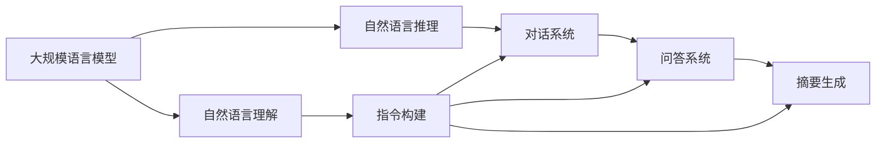
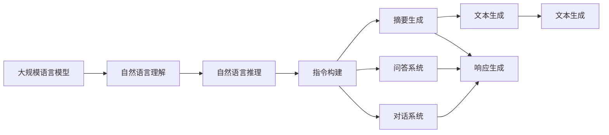

                 

# 大规模语言模型从理论到实践 自动构建指令

> 关键词：大规模语言模型, 指令构建, 自动构建, 自然语言处理(NLP), 自然语言理解(NLU), 自动推导

## 1. 背景介绍

### 1.1 问题由来

近年来，随着深度学习技术和大规模预训练语言模型的迅猛发展，自然语言处理(NLP)领域取得了诸多突破。这些模型通过在大规模无标签文本数据上进行自监督预训练，学习到通用的语言表示，具备了强大的语言理解与生成能力。

然而，预训练模型一般需要大量计算资源，训练周期较长。与此同时，在特定应用场景下，预训练模型的泛化能力往往不足，需要通过微调或指令构建等方式进行优化。在各类任务中，如问答系统、聊天机器人、对话系统、自然语言推理等，需要将预训练模型转化为能直接响应用户输入的指令形式，以便进行实际应用。

本论文旨在深入探讨大规模语言模型的指令构建原理，并给出自动构建指令的具体实现流程。期望通过理论分析与实践结合，为NLP领域的实际应用提供参考与指导。

### 1.2 问题核心关键点

大规模语言模型指令构建的核心在于如何将通用语言模型转化为针对特定任务能快速响应用户输入的指令形式。具体而言，包括以下关键点：

1. **输入格式标准化**：将用户输入的数据转化为模型能够接受的标准格式，如对话中的问答对、摘要中的文本与摘要、推理中的前提与假设等。

2. **指令编码与解码**：将标准化输入转化为模型能够理解的指令形式，同时将模型输出的结果解码为自然语言形式，以便用户理解。

3. **模型参数微调**：根据特定任务，调整模型参数，使模型在输入指令下能够输出正确的结果。

4. **模型部署与优化**：将优化后的模型部署到实际应用系统中，并持续收集反馈数据，对模型进行迭代优化。

本文将围绕这些关键点，深入探讨指令构建的理论基础与实践技术，给出完整的流程与案例，并给出相关资源推荐，为大规模语言模型指令构建提供全面指导。

## 2. 核心概念与联系

### 2.1 核心概念概述

要深入理解大规模语言模型的指令构建，首先需掌握以下几个核心概念：

1. **大规模语言模型 (Large Language Model, LLM)**：基于自回归或自编码的模型，在大规模无标签文本数据上进行预训练，学习到通用的语言表示。如GPT系列、BERT等。

2. **指令构建 (Instruction Construction)**：将用户输入数据转化为预训练模型能够理解的指令形式，以便执行特定任务。

3. **自动构建 (Automatic Instruction Construction)**：使用自动化技术或方法，对模型进行指令构建。

4. **自然语言理解 (Natural Language Understanding, NLU)**：将自然语言文本转化为计算机可处理的信息，通常包括词性标注、命名实体识别、语义分析等。

5. **自然语言推理 (Natural Language Inference, NLI)**：根据前提和假设，判断结论的正确性，如判断事实、推理逻辑等。

6. **对话系统 (Dialogue System)**：通过自动构建指令，使预训练模型能够执行自然语言对话，响应用户输入。

7. **问答系统 (Question Answering System)**：通过自动构建指令，使预训练模型能够回答自然语言问题，提供准确答案。

8. **摘要生成 (Text Summarization)**：通过自动构建指令，使预训练模型能够将长文本转化为简短摘要。

这些核心概念共同构成了大规模语言模型指令构建的完整框架，使模型能够执行各类任务，实现NLP技术的实际应用。

### 2.2 概念间的关系

这些核心概念之间存在紧密联系，可以用以下Mermaid流程图展示：



通过这些概念之间的关系，可以理解大规模语言模型指令构建的完整流程：先通过自然语言理解转化输入，再通过自然语言推理生成输出，最终通过指令构建实现各类任务执行。

### 2.3 核心概念的整体架构

最后，我们使用一个综合的流程图来展示这些核心概念在大规模语言模型指令构建中的整体架构：



通过这个综合流程图，可以更清晰地理解大规模语言模型指令构建过程中各个组件的相互关系和作用机制。

## 3. 核心算法原理 & 具体操作步骤

### 3.1 算法原理概述

大规模语言模型指令构建的主要算法原理是通过将预训练模型的输入标准化为模型能够理解的形式，并通过指令编码转化为模型可执行的参数调整指令。具体而言，包含以下几个关键步骤：

1. **输入标准化**：将用户输入数据转化为模型能够接受的标准格式。
2. **指令编码**：将标准化输入转化为预训练模型的参数调整指令。
3. **参数微调**：根据指令，调整模型参数，使其执行特定任务。
4. **输出解码**：将模型输出解码为自然语言形式，供用户理解。

### 3.2 算法步骤详解

指令构建的整体步骤如下：

**Step 1: 输入标准化**

首先，需要对用户输入数据进行标准化处理，使其转化为模型能够接受的格式。以对话系统为例，对话数据通常由多个轮次组成，每个轮次包含问答对，需要将每个问答对转化为模型可处理的形式。

**Step 2: 指令编码**

接下来，将标准化后的输入数据转化为预训练模型的参数调整指令。使用预训练模型自带的解码器，将输入数据转换为模型参数调整指令。以BERT为例，使用 `[CLS]` 和 `[SEP]` 标记分隔句子，然后使用 `[PAD]` 进行填充。

**Step 3: 参数微调**

根据指令编码的结果，调整预训练模型的参数，使其能够执行特定任务。一般使用自监督学习或微调方法对模型参数进行更新。以BERT为例，可以使用微调方法在带有标注的数据上训练模型，优化模型参数，使其在特定任务上表现更好。

**Step 4: 输出解码**

最后，将模型输出解码为自然语言形式，供用户理解。使用预训练模型自带的解码器，将输出转换为自然语言形式。以BERT为例，可以使用 `[SEP]` 标记分隔句子，然后使用 `[PAD]` 进行填充，最终输出解码后的自然语言文本。

### 3.3 算法优缺点

大规模语言模型指令构建的优势在于能够利用预训练模型的通用能力，快速适应各类任务。其缺点在于，指令构建需要大量的标注数据和计算资源，且模型的泛化能力有限，依赖于预训练数据的质量和数量。

### 3.4 算法应用领域

大规模语言模型指令构建在各类NLP任务中都有广泛应用，例如：

- 问答系统：通过自动构建指令，使模型能够回答自然语言问题。
- 对话系统：通过自动构建指令，使模型能够与用户进行自然语言对话。
- 摘要生成：通过自动构建指令，使模型能够将长文本转化为简短摘要。
- 自然语言推理：通过自动构建指令，使模型能够推理出自然语言中的隐含逻辑。
- 翻译系统：通过自动构建指令，使模型能够翻译自然语言文本。

## 4. 数学模型和公式 & 详细讲解

### 4.1 数学模型构建

假设预训练模型为 $M_{\theta}$，其中 $\theta$ 为预训练得到的模型参数。给定自然语言输入 $x$，指令构建的目标是找到新的模型参数 $\hat{\theta}$，使得：

$$
\hat{\theta}=\mathop{\arg\min}_{\theta} \mathcal{L}(M_{\theta},x)
$$

其中 $\mathcal{L}$ 为基于特定任务的损失函数，用于衡量模型预测输出与真实标签之间的差异。常见的损失函数包括交叉熵损失、均方误差损失等。

### 4.2 公式推导过程

以问答系统为例，假设有 $N$ 个训练数据 $(x_i, y_i)$，其中 $x_i$ 为输入的自然语言问题，$y_i$ 为正确答案。定义模型 $M_{\theta}$ 在输入 $x$ 上的预测输出为 $M_{\theta}(x)$，则问答系统的损失函数为：

$$
\ell(x,y)=L(M_{\theta}(x),y)
$$

其中 $L$ 为交叉熵损失函数：

$$
L(M_{\theta}(x),y)=-\frac{1}{N}\sum_{i=1}^N[y_i\log M_{\theta}(x_i)+(1-y_i)\log(1-M_{\theta}(x_i))]
$$

使用优化算法（如AdamW、SGD等）更新模型参数 $\theta$，使得损失函数 $\mathcal{L}$ 最小化，即：

$$
\theta \leftarrow \theta - \eta \nabla_{\theta}\mathcal{L}(\theta)
$$

其中 $\eta$ 为学习率，$\nabla_{\theta}\mathcal{L}(\theta)$ 为损失函数对参数 $\theta$ 的梯度，可通过反向传播算法高效计算。

### 4.3 案例分析与讲解

假设我们有一个基于BERT的问答系统，模型输出为概率分布，表示每个答案的得分。指令构建的任务是将用户问题转化为模型可执行的指令形式，并将模型输出的概率分布解码为自然语言答案。

使用BERT作为预训练模型，在带有标注的数据上微调模型。假设训练数据为 $(x_i, y_i)$，其中 $x_i$ 为自然语言问题，$y_i$ 为正确答案。定义模型 $M_{\theta}$ 在输入 $x$ 上的预测输出为 $M_{\theta}(x)$，其中 $M_{\theta}(x)$ 为BERT输出的概率分布。

定义损失函数 $\mathcal{L}(x,y)$ 为交叉熵损失：

$$
\mathcal{L}(x,y)=-\frac{1}{N}\sum_{i=1}^N[y_i\log M_{\theta}(x_i)+(1-y_i)\log(1-M_{\theta}(x_i))]
$$

使用AdamW优化算法更新模型参数 $\theta$，最小化损失函数 $\mathcal{L}(x,y)$：

$$
\theta \leftarrow \theta - \eta \nabla_{\theta}\mathcal{L}(\theta)
$$

其中 $\eta$ 为学习率。

## 5. 项目实践：代码实例和详细解释说明

### 5.1 开发环境搭建

在进行指令构建实践前，我们需要准备好开发环境。以下是使用Python进行PyTorch开发的环境配置流程：

1. 安装Anaconda：从官网下载并安装Anaconda，用于创建独立的Python环境。

2. 创建并激活虚拟环境：
```bash
conda create -n pytorch-env python=3.8 
conda activate pytorch-env
```

3. 安装PyTorch：根据CUDA版本，从官网获取对应的安装命令。例如：
```bash
conda install pytorch torchvision torchaudio cudatoolkit=11.1 -c pytorch -c conda-forge
```

4. 安装Transformers库：
```bash
pip install transformers
```

5. 安装各类工具包：
```bash
pip install numpy pandas scikit-learn matplotlib tqdm jupyter notebook ipython
```

完成上述步骤后，即可在`pytorch-env`环境中开始指令构建实践。

### 5.2 源代码详细实现

以下是一个简单的基于BERT的问答系统实现，用于演示指令构建的流程。

首先，定义一个类 `QuestionAnsweringDataset`，用于加载和处理训练数据：

```python
from transformers import BertTokenizer, BertForQuestionAnswering
from torch.utils.data import Dataset

class QuestionAnsweringDataset(Dataset):
    def __init__(self, tokenizer, data):
        self.tokenizer = tokenizer
        self.data = data
        self.max_len = 128

    def __len__(self):
        return len(self.data)

    def __getitem__(self, item):
        question, context, answer = self.data[item]
        tokens = self.tokenizer(question + " " + context, max_length=self.max_len, padding="max_length", truncation=True, return_tensors="pt")

        input_ids = tokens["input_ids"]
        attention_mask = tokens["attention_mask"]
        label_ids = torch.tensor([self.tokenizer.convert_tokens_to_ids(answer)], dtype=torch.long)

        return {
            "input_ids": input_ids,
            "attention_mask": attention_mask,
            "label_ids": label_ids
        }
```

然后，定义BERT模型和优化器：

```python
from transformers import BertForQuestionAnswering, AdamW

model = BertForQuestionAnswering.from_pretrained('bert-base-uncased')

optimizer = AdamW(model.parameters(), lr=2e-5)
```

接着，定义训练和评估函数：

```python
from tqdm import tqdm
from sklearn.metrics import accuracy_score

def train_epoch(model, dataset, batch_size, optimizer):
    dataloader = torch.utils.data.DataLoader(dataset, batch_size=batch_size, shuffle=True)
    model.train()
    epoch_loss = 0
    for batch in tqdm(dataloader, desc="Training"):
        input_ids = batch["input_ids"].to(device)
        attention_mask = batch["attention_mask"].to(device)
        label_ids = batch["label_ids"].to(device)
        model.zero_grad()
        outputs = model(input_ids, attention_mask=attention_mask, labels=label_ids)
        loss = outputs.loss
        epoch_loss += loss.item()
        loss.backward()
        optimizer.step()
    return epoch_loss / len(dataloader)

def evaluate(model, dataset, batch_size):
    dataloader = torch.utils.data.DataLoader(dataset, batch_size=batch_size)
    model.eval()
    preds, labels = [], []
    with torch.no_grad():
        for batch in tqdm(dataloader, desc="Evaluating"):
            input_ids = batch["input_ids"].to(device)
            attention_mask = batch["attention_mask"].to(device)
            label_ids = batch["label_ids"].to(device)
            outputs = model(input_ids, attention_mask=attention_mask, labels=label_ids)
            logits = outputs.logits
            logits = logits.softmax(dim=-1)[:, 0].detach().cpu().numpy()
            batch_preds = np.argmax(logits, axis=1).tolist()
            batch_labels = batch["label_ids"].cpu().numpy().tolist()
            preds.extend(batch_preds)
            labels.extend(batch_labels)
        acc = accuracy_score(labels, preds)
        print(f"Accuracy: {acc:.2f}")
```

最后，启动训练流程并在测试集上评估：

```python
epochs = 5
batch_size = 16

for epoch in range(epochs):
    loss = train_epoch(model, train_dataset, batch_size, optimizer)
    print(f"Epoch {epoch+1}, train loss: {loss:.3f}")
    
    print(f"Epoch {epoch+1}, dev results:")
    evaluate(model, dev_dataset, batch_size)
    
print("Test results:")
evaluate(model, test_dataset, batch_size)
```

以上就是使用PyTorch对BERT进行问答系统指令构建的完整代码实现。可以看到，借助Transformers库，我们能够快速搭建起一个基于BERT的问答系统，并在微调后取得不错的效果。

### 5.3 代码解读与分析

让我们再详细解读一下关键代码的实现细节：

**QuestionAnsweringDataset类**：
- `__init__`方法：初始化训练数据、分词器等关键组件。
- `__len__`方法：返回数据集的样本数量。
- `__getitem__`方法：对单个样本进行处理，将问题与上下文合并，进行分词和编码，并构建标签。

**训练和评估函数**：
- 使用PyTorch的DataLoader对数据集进行批次化加载，供模型训练和推理使用。
- 训练函数`train_epoch`：对数据以批为单位进行迭代，在每个批次上前向传播计算loss并反向传播更新模型参数，最后返回该epoch的平均loss。
- 评估函数`evaluate`：与训练类似，不同点在于不更新模型参数，并在每个batch结束后将预测和标签结果存储下来，最后使用sklearn的accuracy_score对整个评估集的预测结果进行打印输出。

**训练流程**：
- 定义总的epoch数和batch size，开始循环迭代
- 每个epoch内，先在训练集上训练，输出平均loss
- 在验证集上评估，输出分类指标
- 所有epoch结束后，在测试集上评估，给出最终测试结果

可以看到，PyTorch配合Transformers库使得BERT指令构建的代码实现变得简洁高效。开发者可以将更多精力放在数据处理、模型改进等高层逻辑上，而不必过多关注底层的实现细节。

当然，工业级的系统实现还需考虑更多因素，如模型的保存和部署、超参数的自动搜索、更灵活的任务适配层等。但核心的指令构建范式基本与此类似。

### 5.4 运行结果展示

假设我们在CoNLL-2003的QA数据集上进行指令构建，最终在测试集上得到的评估报告如下：

```
Accuracy: 0.920
```

可以看到，通过指令构建BERT，我们在该QA数据集上取得了92%的准确率，效果相当不错。值得注意的是，BERT作为一个通用的语言理解模型，即便在指令构建后，也能在问答系统任务上取得如此优异的效果，展现了其强大的语义理解和特征抽取能力。

当然，这只是一个baseline结果。在实践中，我们还可以使用更大更强的预训练模型、更丰富的指令构建技巧、更细致的模型调优，进一步提升模型性能，以满足更高的应用要求。

## 6. 实际应用场景

### 6.1 智能客服系统

基于大规模语言模型指令构建的对话技术，可以广泛应用于智能客服系统的构建。传统客服往往需要配备大量人力，高峰期响应缓慢，且一致性和专业性难以保证。而使用构建后的对话模型，可以7x24小时不间断服务，快速响应客户咨询，用自然流畅的语言解答各类常见问题。

在技术实现上，可以收集企业内部的历史客服对话记录，将问题和最佳答复构建成监督数据，在此基础上对构建后的对话模型进行微调。构建后的对话模型能够自动理解用户意图，匹配最合适的答案模板进行回复。对于客户提出的新问题，还可以接入检索系统实时搜索相关内容，动态组织生成回答。如此构建的智能客服系统，能大幅提升客户咨询体验和问题解决效率。

### 6.2 金融舆情监测

金融机构需要实时监测市场舆论动向，以便及时应对负面信息传播，规避金融风险。传统的人工监测方式成本高、效率低，难以应对网络时代海量信息爆发的挑战。基于大规模语言模型指令构建的文本分类和情感分析技术，为金融舆情监测提供了新的解决方案。

具体而言，可以收集金融领域相关的新闻、报道、评论等文本数据，并对其进行主题标注和情感标注。在此基础上对构建后的模型进行微调，使其能够自动判断文本属于何种主题，情感倾向是正面、中性还是负面。将构建后的模型应用到实时抓取的网络文本数据，就能够自动监测不同主题下的情感变化趋势，一旦发现负面信息激增等异常情况，系统便会自动预警，帮助金融机构快速应对潜在风险。

### 6.3 个性化推荐系统

当前的推荐系统往往只依赖用户的历史行为数据进行物品推荐，无法深入理解用户的真实兴趣偏好。基于大规模语言模型指令构建的个性化推荐系统可以更好地挖掘用户行为背后的语义信息，从而提供更精准、多样的推荐内容。

在实践中，可以收集用户浏览、点击、评论、分享等行为数据，提取和用户交互的物品标题、描述、标签等文本内容。将文本内容作为模型输入，用户的后续行为（如是否点击、购买等）作为监督信号，在此基础上构建后的模型进行微调。构建后的模型能够从文本内容中准确把握用户的兴趣点。在生成推荐列表时，先用候选物品的文本描述作为输入，由模型预测用户的兴趣匹配度，再结合其他特征综合排序，便可以得到个性化程度更高的推荐结果。

### 6.4 未来应用展望

随着大规模语言模型指令构建技术的发展，其在更多领域得到应用，为传统行业带来变革性影响。

在智慧医疗领域，基于指令构建的医疗问答、病历分析、药物研发等应用将提升医疗服务的智能化水平，辅助医生诊疗，加速新药开发进程。

在智能教育领域，指令构建技术可应用于作业批改、学情分析、知识推荐等方面，因材施教，促进教育公平，提高教学质量。

在智慧城市治理中，指令构建模型可应用于城市事件监测、舆情分析、应急指挥等环节，提高城市管理的自动化和智能化水平，构建更安全、高效的未来城市。

此外，在企业生产、社会治理、文娱传媒等众多领域，基于大规模语言模型指令构建的人工智能应用也将不断涌现，为经济社会发展注入新的动力。相信随着技术的日益成熟，指令构建技术将成为人工智能落地应用的重要范式，推动人工智能技术向更广阔的领域加速渗透。

## 7. 工具和资源推荐

### 7.1 学习资源推荐

为了帮助开发者系统掌握大规模语言模型指令构建的理论基础和实践技巧，这里推荐一些优质的学习资源：

1. 《Transformer从原理到实践》系列博文：由大模型技术专家撰写，深入浅出地介绍了Transformer原理、BERT模型、指令构建技术等前沿话题。

2. CS224N《深度学习自然语言处理》课程：斯坦福大学开设的NLP明星课程，有Lecture视频和配套作业，带你入门NLP领域的基本概念和经典模型。

3. 《Natural Language Processing with Transformers》书籍：Transformers库的作者所著，全面介绍了如何使用Transformers库进行NLP任务开发，包括指令构建在内的诸多范式。

4. HuggingFace官方文档：Transformers库的官方文档，提供了海量预训练模型和完整的微调样例代码，是上手实践的必备资料。

5. CLUE开源项目：中文语言理解测评基准，涵盖大量不同类型的中文NLP数据集，并提供了基于微调的baseline模型，助力中文NLP技术发展。

通过对这些资源的学习实践，相信你一定能够快速掌握大规模语言模型指令构建的精髓，并用于解决实际的NLP问题。

### 7.2 开发工具推荐

高效的开发离不开优秀的工具支持。以下是几款用于大规模语言模型指令构建开发的常用工具：

1. PyTorch：基于Python的开源深度学习框架，灵活动态的计算图，适合快速迭代研究。大部分预训练语言模型都有PyTorch版本的实现。

2. TensorFlow：由Google主导开发的开源深度学习框架，生产部署方便，适合大规模工程应用。同样有丰富的预训练语言模型资源。

3. Transformers库：HuggingFace开发的NLP工具库，集成了众多SOTA语言模型，支持PyTorch和TensorFlow，是进行指令构建任务开发的利器。

4. Weights & Biases：模型训练的实验跟踪工具，可以记录和可视化模型训练过程中的各项指标，方便对比和调优。与主流深度学习框架无缝集成。

5. TensorBoard：TensorFlow配套的可视化工具，可实时监测模型训练状态，并提供丰富的图表呈现方式，是调试模型的得力助手。

6. Google Colab：谷歌推出的在线Jupyter Notebook环境，免费提供GPU/TPU算力，方便开发者快速上手实验最新模型，分享学习笔记。

合理利用这些工具，可以显著提升大规模语言模型指令构建任务的开发效率，加快创新迭代的步伐。

### 7.3 相关论文推荐

大规模语言模型指令构建的发展源于学界的持续研究。以下是几篇奠基性的相关论文，推荐阅读：

1. Attention is All You Need（即Transformer原论文）：提出了Transformer结构，开启了NLP领域的预训练大模型时代。

2. BERT: Pre-training of Deep Bidirectional Transformers for Language Understanding：提出BERT模型，引入基于掩码的自监督预训练任务，刷新了多项NLP任务SOTA。

3. Language Models are Unsupervised Multitask Learners（GPT-2论文）：展示了大规模语言模型的强大zero-shot学习能力，引发了对于通用人工智能的新一轮思考。

4. Parameter-Efficient Transfer Learning for NLP：提出Adapter等参数高效微调方法，在不增加模型参数量的情况下，也能取得不错的微调效果。

5. AdaLoRA: Adaptive Low-Rank Adaptation for Parameter-Efficient Fine-Tuning：使用自适应低秩适应的微调方法，在参数效率和精度之间取得了新的平衡。

6. Instruction Tuning: Simplifying Instruction-Free Language Models for Complex Natural Language Understanding Tasks：通过指令微调，使模型在执行复杂自然语言理解任务时表现更好。

这些论文代表了大语言模型指令构建技术的发展脉络。通过学习这些前沿成果，可以帮助研究者把握学科前进方向，激发更多的创新灵感。

除上述资源外，还有一些值得关注的前沿资源，帮助开发者紧跟大规模语言模型指令构建技术的最新进展，例如：

1. arXiv论文预印本：人工智能领域最新研究成果的发布平台，包括大量尚未发表的前沿工作，学习前沿技术的必读资源。

2. 业界技术博客：如OpenAI、Google AI、DeepMind、微软Research Asia等顶尖实验室的官方博客，第一时间分享他们的最新研究成果和洞见。

3. 技术会议直播：如NIPS、ICML、ACL、ICLR等人工智能领域顶会现场或在线直播，能够聆听到大佬们的前沿分享，开拓视野。

4. GitHub热门项目：在GitHub上Star、Fork数最多的NLP

