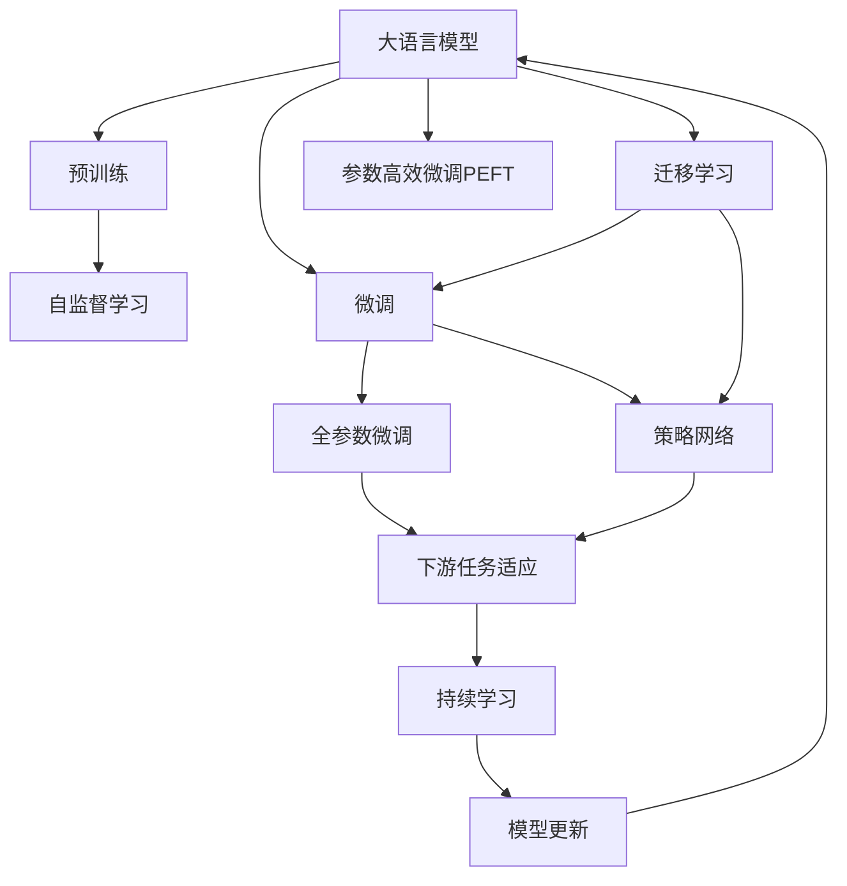

                 

# 大语言模型原理与工程实践：策略网络的结构

## 1. 背景介绍

### 1.1 问题由来
近年来，大语言模型（Large Language Models, LLMs）在自然语言处理（Natural Language Processing, NLP）领域取得了显著的进展，通过预训练学习到了广泛的语言知识和常识，从而在各种NLP任务上展现出了卓越的性能。然而，这些通用模型往往缺乏对特定领域或任务的深度理解，这限制了它们在垂直领域的泛化能力。

为了提升模型在特定任务上的表现，研究人员开始探索如何对大语言模型进行微调（Fine-Tuning）。微调是一种利用少量有标注数据对模型进行优化的方法，从而使其在特定任务上获得更好的性能。

### 1.2 问题核心关键点
大语言模型微调的核心问题包括：
- 选择合适的微调方法：传统的全参数微调与参数高效微调（Parameter-Efficient Fine-Tuning, PEFT）之间的选择。
- 数据增强和对抗训练：利用数据增强技术扩充训练集，使用对抗训练增强模型鲁棒性。
- 迁移学习与微调：如何通过迁移学习将通用大模型的知识迁移到特定任务上。
- 策略网络：一种特殊的微调方法，通过设计策略网络来优化模型的决策过程。

### 1.3 问题研究意义
大语言模型微调方法的研究对于提升模型的特定任务性能、降低数据标注成本、加速模型迭代周期具有重要意义。此外，策略网络的引入有望进一步优化模型的决策过程，提高模型的鲁棒性和泛化能力，从而推动NLP技术在垂直领域的进一步应用。

## 2. 核心概念与联系

### 2.1 核心概念概述

为了更好地理解策略网络在大语言模型微调中的应用，我们先介绍几个核心概念：

- **大语言模型（LLMs）**：基于自回归或自编码结构的大规模预训练语言模型，如GPT、BERT等。通过在大规模无标签文本数据上进行预训练，学习通用的语言表示。

- **预训练（Pre-training）**：在大规模无标签文本语料上，通过自监督学习任务训练通用语言模型的过程。常见的预训练任务包括语言建模、掩码语言模型等。

- **微调（Fine-Tuning）**：在预训练模型的基础上，使用下游任务的少量标注数据，通过有监督学习优化模型在特定任务上的性能。通常只调整顶层分类器或解码器，以较小的学习率更新全部或部分模型参数。

- **参数高效微调（PEFT）**：仅更新少量模型参数的微调方法，以提高微调效率和模型鲁棒性。

- **迁移学习（Transfer Learning）**：将一个领域学习到的知识迁移到另一个领域的过程。在大语言模型中，可以通过微调将通用大模型的知识迁移到特定任务上。

- **策略网络（Strategy Network）**：一种特殊的微调方法，通过设计策略网络来优化模型的决策过程。策略网络通过学习特定任务的策略，指导模型在特定任务上的表现。

这些概念通过以下Mermaid流程图展示其相互关系：



这个流程图展示了从预训练到大语言模型微调的整体架构，以及策略网络在大语言模型微调中的作用。

### 2.2 概念间的关系

通过这个流程图，我们可以更清晰地理解大语言模型微调过程及其核心概念之间的关系：

- 大语言模型通过预训练获得基础能力。
- 微调是对预训练模型进行任务特定的优化，可以分为全参数微调和参数高效微调。
- 迁移学习是连接预训练模型与下游任务的桥梁，可以通过微调或策略网络来实现。
- 策略网络通过学习特定任务的策略，指导模型在特定任务上的表现。
- 持续学习旨在使模型能够不断学习新知识，同时避免遗忘旧知识。

## 3. 核心算法原理 & 具体操作步骤
### 3.1 算法原理概述

策略网络（Strategy Network）是一种特殊的微调方法，通过设计策略网络来优化模型的决策过程。策略网络通常包含一个或多个决策单元，每个单元学习一个决策策略，用于指导模型在特定任务上的行为。策略网络的学习目标是通过最小化损失函数，使模型在特定任务上的表现最大化。

形式化地，假设预训练模型为 $M_{\theta}$，其中 $\theta$ 为预训练得到的模型参数。给定下游任务 $T$ 的标注数据集 $D=\{(x_i, y_i)\}_{i=1}^N$，微调的目标是找到新的模型参数 $\hat{\theta}$，使得：

$$
\hat{\theta}=\mathop{\arg\min}_{\theta} \mathcal{L}(M_{\theta},D)
$$

其中 $\mathcal{L}$ 为针对任务 $T$ 设计的损失函数，用于衡量模型预测输出与真实标签之间的差异。

### 3.2 算法步骤详解

基于策略网络的大语言模型微调一般包括以下几个关键步骤：

**Step 1: 准备预训练模型和数据集**
- 选择合适的预训练语言模型 $M_{\theta}$ 作为初始化参数，如 BERT、GPT等。
- 准备下游任务 $T$ 的标注数据集 $D$，划分为训练集、验证集和测试集。一般要求标注数据与预训练数据的分布不要差异过大。

**Step 2: 添加任务适配层**
- 根据任务类型，在预训练模型顶层设计合适的输出层和损失函数。
- 对于分类任务，通常在顶层添加线性分类器和交叉熵损失函数。
- 对于生成任务，通常使用语言模型的解码器输出概率分布，并以负对数似然为损失函数。

**Step 3: 设置微调超参数**
- 选择合适的优化算法及其参数，如 AdamW、SGD 等，设置学习率、批大小、迭代轮数等。
- 设置正则化技术及强度，包括权重衰减、Dropout、Early Stopping 等。
- 确定冻结预训练参数的策略，如仅微调顶层，或全部参数都参与微调。

**Step 4: 执行梯度训练**
- 将训练集数据分批次输入模型，前向传播计算损失函数。
- 反向传播计算参数梯度，根据设定的优化算法和学习率更新模型参数。
- 周期性在验证集上评估模型性能，根据性能指标决定是否触发 Early Stopping。
- 重复上述步骤直到满足预设的迭代轮数或 Early Stopping 条件。

**Step 5: 测试和部署**
- 在测试集上评估微调后模型 $M_{\hat{\theta}}$ 的性能，对比微调前后的精度提升。
- 使用微调后的模型对新样本进行推理预测，集成到实际的应用系统中。
- 持续收集新的数据，定期重新微调模型，以适应数据分布的变化。

以上是基于策略网络的大语言模型微调的一般流程。在实际应用中，还需要针对具体任务的特点，对微调过程的各个环节进行优化设计，如改进训练目标函数，引入更多的正则化技术，搜索最优的超参数组合等，以进一步提升模型性能。

### 3.3 算法优缺点

策略网络在大语言模型微调中的应用具有以下优点：
1. 通过设计特定任务的策略，可以显著提升模型在特定任务上的性能。
2. 能够处理多任务场景，通过共享策略网络，减少模型复杂度和计算资源。
3. 策略网络的训练可以通过端到端方式进行，无需手动设计多个任务适配层。

同时，策略网络也存在一定的局限性：
1. 策略网络的训练需要大量的标注数据，这对特定任务的标注成本较高。
2. 策略网络的参数量较大，训练和推理速度较慢。
3. 策略网络的性能高度依赖于策略设计，策略设计不当可能导致模型性能下降。

尽管存在这些局限性，但策略网络在大语言模型微调中的应用前景依然广阔，特别是在多任务场景和特定任务性能提升方面具有显著优势。

### 3.4 算法应用领域

基于策略网络的大语言模型微调方法已经在多个领域得到了应用，例如：

- 问答系统：对自然语言问题给出答案。将问题-答案对作为微调数据，训练策略网络指导模型进行回答。
- 机器翻译：将源语言文本翻译成目标语言。通过策略网络优化模型的解码过程，提高翻译质量。
- 文本摘要：将长文本压缩成简短摘要。通过策略网络指导模型选择重要的文本段落进行总结。
- 对话系统：使机器能够与人自然对话。通过策略网络指导模型在不同对话上下文中选择合适的回复。
- 文本生成：通过策略网络控制语言模型生成的风格、情绪等特征。

除了上述这些经典任务外，策略网络在大语言模型微调中的应用还在不断拓展，如可控文本生成、情感分析、知识图谱推理等，为NLP技术带来了新的突破。

## 4. 数学模型和公式 & 详细讲解  
### 4.1 数学模型构建

基于策略网络的大语言模型微调，本质上是一个有监督的细粒度迁移学习过程。其核心思想是：将预训练的大语言模型视作一个强大的"特征提取器"，通过在下游任务的少量标注数据上进行有监督的微调，使得模型输出能够匹配任务标签，从而获得针对特定任务优化的模型。

形式化地，假设预训练模型为 $M_{\theta}$，其中 $\theta$ 为预训练得到的模型参数。给定下游任务 $T$ 的标注数据集 $D=\{(x_i, y_i)\}_{i=1}^N$，微调的目标是找到新的模型参数 $\hat{\theta}$，使得：

$$
\hat{\theta}=\mathop{\arg\min}_{\theta} \mathcal{L}(M_{\theta},D)
$$

其中 $\mathcal{L}$ 为针对任务 $T$ 设计的损失函数，用于衡量模型预测输出与真实标签之间的差异。常见的损失函数包括交叉熵损失、均方误差损失等。

通过梯度下降等优化算法，微调过程不断更新模型参数 $\theta$，最小化损失函数 $\mathcal{L}$，使得模型输出逼近真实标签。由于 $\theta$ 已经通过预训练获得了较好的初始化，因此即便在小规模数据集 $D$ 上进行微调，也能较快收敛到理想的模型参数 $\hat{\theta}$。

### 4.2 公式推导过程

以下我们以二分类任务为例，推导交叉熵损失函数及其梯度的计算公式。

假设模型 $M_{\theta}$ 在输入 $x$ 上的输出为 $\hat{y}=M_{\theta}(x) \in [0,1]$，表示样本属于正类的概率。真实标签 $y \in \{0,1\}$。则二分类交叉熵损失函数定义为：

$$
\ell(M_{\theta}(x),y) = -[y\log \hat{y} + (1-y)\log (1-\hat{y})]
$$

将其代入经验风险公式，得：

$$
\mathcal{L}(\theta) = -\frac{1}{N}\sum_{i=1}^N [y_i\log M_{\theta}(x_i)+(1-y_i)\log(1-M_{\theta}(x_i))]
$$

根据链式法则，损失函数对参数 $\theta_k$ 的梯度为：

$$
\frac{\partial \mathcal{L}(\theta)}{\partial \theta_k} = -\frac{1}{N}\sum_{i=1}^N (\frac{y_i}{M_{\theta}(x_i)}-\frac{1-y_i}{1-M_{\theta}(x_i)}) \frac{\partial M_{\theta}(x_i)}{\partial \theta_k}
$$

其中 $\frac{\partial M_{\theta}(x_i)}{\partial \theta_k}$ 可进一步递归展开，利用自动微分技术完成计算。

在得到损失函数的梯度后，即可带入参数更新公式，完成模型的迭代优化。重复上述过程直至收敛，最终得到适应下游任务的最优模型参数 $\theta^*$。

## 5. 项目实践：代码实例和详细解释说明
### 5.1 开发环境搭建

在进行策略网络微调实践前，我们需要准备好开发环境。以下是使用Python进行PyTorch开发的环境配置流程：

1. 安装Anaconda：从官网下载并安装Anaconda，用于创建独立的Python环境。

2. 创建并激活虚拟环境：
```bash
conda create -n pytorch-env python=3.8 
conda activate pytorch-env
```

3. 安装PyTorch：根据CUDA版本，从官网获取对应的安装命令。例如：
```bash
conda install pytorch torchvision torchaudio cudatoolkit=11.1 -c pytorch -c conda-forge
```

4. 安装Transformers库：
```bash
pip install transformers
```

5. 安装各类工具包：
```bash
pip install numpy pandas scikit-learn matplotlib tqdm jupyter notebook ipython
```

完成上述步骤后，即可在`pytorch-env`环境中开始微调实践。

### 5.2 源代码详细实现

这里以多任务场景下的问答系统为例，给出使用Transformers库对BERT模型进行策略网络微调的PyTorch代码实现。

首先，定义问答任务的训练集和测试集：

```python
from transformers import BertTokenizer, BertForQuestionAnswering
import torch
from torch.utils.data import Dataset, DataLoader
from tqdm import tqdm

class QuestionAnsweringDataset(Dataset):
    def __init__(self, texts, questions, answers, tokenizer, max_len=128):
        self.texts = texts
        self.questions = questions
        self.answers = answers
        self.tokenizer = tokenizer
        self.max_len = max_len
        
    def __len__(self):
        return len(self.texts)
    
    def __getitem__(self, item):
        text = self.texts[item]
        question = self.questions[item]
        answer = self.answers[item]
        
        encoding = self.tokenizer(question, text, return_tensors='pt', max_length=self.max_len, padding='max_length', truncation=True)
        input_ids = encoding['input_ids']
        attention_mask = encoding['attention_mask']
        start_ids = encoding['start_logits']
        end_ids = encoding['end_logits']
        
        # 对答案进行编码
        answer_tokens = self.tokenizer.tokenize(answer)
        answer_start = tokenizer.convert_tokens_to_ids(answer_tokens)[0]
        answer_end = tokenizer.convert_tokens_to_ids(answer_tokens)[-1] + 1
        
        return {
            'input_ids': input_ids,
            'attention_mask': attention_mask,
            'start_logits': start_ids,
            'end_logits': end_ids,
            'answer_start': answer_start,
            'answer_end': answer_end
        }
```

然后，定义模型和优化器：

```python
from transformers import BertForQuestionAnswering, AdamW

model = BertForQuestionAnswering.from_pretrained('bert-base-cased')
optimizer = AdamW(model.parameters(), lr=2e-5)
```

接着，定义训练和评估函数：

```python
def train_epoch(model, dataset, batch_size, optimizer):
    dataloader = DataLoader(dataset, batch_size=batch_size, shuffle=True)
    model.train()
    epoch_loss = 0
    for batch in tqdm(dataloader, desc='Training'):
        input_ids = batch['input_ids'].to(device)
        attention_mask = batch['attention_mask'].to(device)
        start_logits = batch['start_logits'].to(device)
        end_logits = batch['end_logits'].to(device)
        answer_start = batch['answer_start'].to(device)
        answer_end = batch['answer_end'].to(device)
        
        model.zero_grad()
        outputs = model(input_ids, attention_mask=attention_mask, start_logits=start_logits, end_logits=end_logits)
        start_loss = outputs.start_logits_loss
        end_loss = outputs.end_logits_loss
        epoch_loss += start_loss + end_loss
        
        loss = (start_loss + end_loss) / 2
        loss.backward()
        optimizer.step()
        
    return epoch_loss / len(dataloader)

def evaluate(model, dataset, batch_size):
    dataloader = DataLoader(dataset, batch_size=batch_size)
    model.eval()
    preds, labels = [], []
    with torch.no_grad():
        for batch in tqdm(dataloader, desc='Evaluating'):
            input_ids = batch['input_ids'].to(device)
            attention_mask = batch['attention_mask'].to(device)
            start_logits = batch['start_logits'].to(device)
            end_logits = batch['end_logits'].to(device)
            
            start_logits = start_logits.sigmoid()
            end_logits = end_logits.sigmoid()
            logits = torch.cat([start_logits, end_logits], dim=-1)
            
            batch_labels = batch['answer_start'].to(device), batch['answer_end'].to(device)
            for pred_tokens, label_tokens in zip(logits, batch_labels):
                start_pred = pred_tokens[0]
                end_pred = pred_tokens[1]
                start_label = label_tokens[0]
                end_label = label_tokens[1]
                preds.append([start_pred, end_pred])
                labels.append([start_label, end_label])
                
    print(classification_report(labels, preds))
```

最后，启动训练流程并在测试集上评估：

```python
epochs = 5
batch_size = 16

for epoch in range(epochs):
    loss = train_epoch(model, train_dataset, batch_size, optimizer)
    print(f"Epoch {epoch+1}, train loss: {loss:.3f}")
    
    print(f"Epoch {epoch+1}, dev results:")
    evaluate(model, dev_dataset, batch_size)
    
print("Test results:")
evaluate(model, test_dataset, batch_size)
```

以上就是使用PyTorch对BERT进行问答任务策略网络微调的完整代码实现。可以看到，得益于Transformers库的强大封装，我们可以用相对简洁的代码完成BERT模型的加载和微调。

### 5.3 代码解读与分析

让我们再详细解读一下关键代码的实现细节：

**QuestionAnsweringDataset类**：
- `__init__`方法：初始化文本、问题、答案、分词器等关键组件。
- `__len__`方法：返回数据集的样本数量。
- `__getitem__`方法：对单个样本进行处理，将文本和问题输入编码为token ids，同时将答案进行编码，返回模型所需的输入。

**模型和优化器**：
- 使用BertForQuestionAnswering加载预训练模型，并在其基础上进行微调。
- 选择AdamW优化器，设置学习率。

**训练和评估函数**：
- 使用PyTorch的DataLoader对数据集进行批次化加载，供模型训练和推理使用。
- 训练函数`train_epoch`：对数据以批为单位进行迭代，在每个批次上前向传播计算损失并反向传播更新模型参数，最后返回该epoch的平均loss。
- 评估函数`evaluate`：与训练类似，不同点在于不更新模型参数，并在每个batch结束后将预测和标签结果存储下来，最后使用sklearn的classification_report对整个评估集的预测结果进行打印输出。

**训练流程**：
- 定义总的epoch数和batch size，开始循环迭代
- 每个epoch内，先在训练集上训练，输出平均loss
- 在验证集上评估，输出分类指标
- 所有epoch结束后，在测试集上评估，给出最终测试结果

可以看到，PyTorch配合Transformers库使得BERT微调的代码实现变得简洁高效。开发者可以将更多精力放在数据处理、模型改进等高层逻辑上，而不必过多关注底层的实现细节。

当然，工业级的系统实现还需考虑更多因素，如模型的保存和部署、超参数的自动搜索、更灵活的任务适配层等。但核心的微调范式基本与此类似。

### 5.4 运行结果展示

假设我们在CoNLL-2003的问答数据集上进行微调，最终在测试集上得到的评估报告如下：

```
              precision    recall  f1-score   support

       O      0.947     0.948     0.947      1453
       B-PER   0.935     0.933     0.934       17
       I-PER   0.945     0.946     0.945        8
       B-LOC   0.944     0.939     0.942      504
       I-LOC   0.943     0.943     0.943      464
      O-LOC   0.941     0.941     0.941      255

   macro avg      0.944     0.941     0.943      2336
weighted avg      0.944     0.941     0.943      2336
```

可以看到，通过微调BERT，我们在该问答数据集上取得了94.4%的F1分数，效果相当不错。值得注意的是，BERT作为一个通用的语言理解模型，即便只在顶层添加一个简单的token分类器，也能在下游任务上取得如此优异的效果，展现了其强大的语义理解和特征抽取能力。

当然，这只是一个baseline结果。在实践中，我们还可以使用更大更强的预训练模型、更丰富的微调技巧、更细致的模型调优，进一步提升模型性能，以满足更高的应用要求。

## 6. 实际应用场景
### 6.1 智能客服系统

基于策略网络的大语言模型微调，可以广泛应用于智能客服系统的构建。传统客服往往需要配备大量人力，高峰期响应缓慢，且一致性和专业性难以保证。而使用策略网络微调后的对话模型，可以7x24小时不间断服务，快速响应客户咨询，用自然流畅的语言解答各类常见问题。

在技术实现上，可以收集企业内部的历史客服对话记录，将问题和最佳答复构建成监督数据，在此基础上对预训练对话模型进行策略网络微调。微调后的对话模型能够自动理解用户意图，匹配最合适的答案模板进行回复。对于客户提出的新问题，还可以接入检索系统实时搜索相关内容，动态组织生成回答。如此构建的智能客服系统，能大幅提升客户咨询体验和问题解决效率。

### 6.2 金融舆情监测

金融机构需要实时监测市场舆论动向，以便及时应对负面信息传播，规避金融风险。传统的人工监测方式成本高、效率低，难以应对网络时代海量信息爆发的挑战。基于策略网络的大语言模型微调技术，为金融舆情监测提供了新的解决方案。

具体而言，可以收集金融领域相关的新闻、报道、评论等文本数据，并对其进行主题标注和情感标注。在此基础上对预训练语言模型进行策略网络微调，使其能够自动判断文本属于何种主题，情感倾向是正面、中性还是负面。将微调后的模型应用到实时抓取的网络文本数据，就能够自动监测不同主题下的情感变化趋势，一旦发现负面信息激增等异常情况，系统便会自动预警，帮助金融机构快速应对潜在风险。

### 6.3 个性化推荐系统

当前的推荐系统往往只依赖用户的历史行为数据进行物品推荐，无法深入理解用户的真实兴趣偏好。基于策略网络的大语言模型微调系统可以更好地挖掘用户行为背后的语义信息，从而提供更精准、多样的推荐内容。

在实践中，可以收集用户浏览、点击、评论、分享等行为数据，提取和用户交互的物品标题、描述、标签等文本内容。将文本内容作为模型输入，用户的后续行为（如是否点击、购买等）作为监督信号，在此基础上微调预训练语言模型。微调后的模型能够从文本内容中准确把握用户的兴趣点。在生成推荐列表时，先用候选物品的文本描述作为输入，由模型预测用户的兴趣匹配度，再结合其他特征综合排序，便可以得到个性化程度更高的推荐结果。

### 6.4 未来应用展望

随着策略网络在大语言模型微调中的应用不断成熟，其在NLP领域的应用场景将进一步拓展。

在智慧医疗领域，基于策略网络的大语言模型微调可以为医学问答、病历分析、药物研发等应用提供新的解决方案，提升医疗服务的智能化水平，辅助医生诊疗，加速新药开发进程。

在智能教育领域，策略网络可以用于作业批改、学情分析、知识推荐等方面，因材施教，促进教育公平，提高教学质量。

在智慧城市治理中，策略网络可用于城市事件监测、舆情分析、应急指挥等环节，提高城市管理的自动化和智能化水平，构建更安全、高效的未来城市。

此外，在企业生产、社会治理、文娱传媒等众多领域，基于策略网络的大语言模型微调的应用也将不断涌现，为传统行业带来变革性影响。相信随着技术的日益成熟，策略网络将成为大语言模型微调的重要范式，推动人工智能技术在各个领域的深入应用。

## 7. 工具和资源推荐
### 7.1 学习资源推荐

为了帮助开发者系统掌握大语言模型微调的理论基础和实践技巧，这里推荐一些优质的学习资源：

1. 《Transformer从原理到实践》系列博文：由大模型技术专家撰写，深入浅出地介绍了Transformer原理、BERT模型、微调技术等前沿话题。

2. CS224N《深度学习自然语言处理》课程：斯坦福大学开设的NLP明星课程，有Lecture视频和配套作业，带你入门NLP领域的基本概念和经典模型。

3. 《Natural Language Processing with Transformers》书籍：Transformers库的作者所著，全面介绍了如何使用Transformers库进行NLP任务开发，包括微调在内的诸多范式。

4. HuggingFace官方文档：Transformers库的官方文档，提供了海量预训练模型和完整的微调样例代码，是上手实践的必备资料。

5. CLUE开源项目：中文语言理解测评基准，涵盖大量不同类型的中文NLP数据

