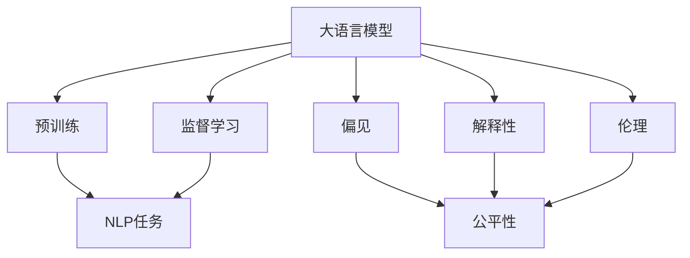
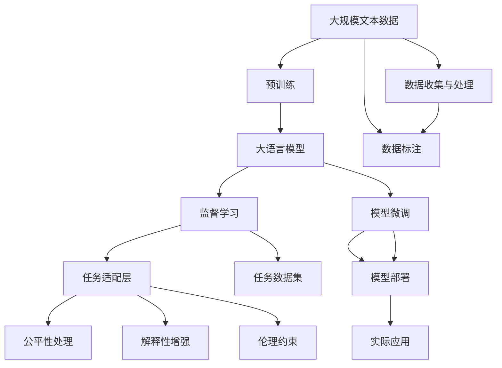

                 

# 大语言模型原理基础与前沿 偏见

> 关键词：大语言模型,预训练,监督学习,自然语言处理,NLP,偏见,公平性,解释性,伦理

## 1. 背景介绍

### 1.1 问题由来

大语言模型（Large Language Models, LLMs）作为人工智能领域的里程碑，凭借其强大的语言理解与生成能力，在自然语言处理（Natural Language Processing, NLP）领域取得显著进展。然而，随着大语言模型的广泛应用，其内在偏见问题逐渐暴露。这些偏见不仅影响模型的性能，还可能造成社会不公、歧视等问题。因此，深入理解大语言模型的偏见机制，并采取有效措施予以缓解，已成为学术界和产业界关注的焦点。

### 1.2 问题核心关键点

大语言模型存在偏见主要表现在以下几个方面：
- **性别偏见**：模型在处理性别相关词汇时，存在对某些性别的不公平对待。
- **种族偏见**：模型在处理种族相关词汇时，存在对某些种族的歧视。
- **地理偏见**：模型在处理地理位置相关词汇时，对某些地区存在偏见。
- **社会文化偏见**：模型在处理特定文化或社会现象时，存在对某些群体的偏见。

这些偏见通常是由于训练数据中的偏见、预训练模型设计不当或训练过程中的偏差所致。为应对这些问题，研究者提出了多项技术和方法，以期提高大语言模型的公平性和解释性。

### 1.3 问题研究意义

深入研究大语言模型的偏见，对提升其性能、保障其公平性、增强其解释性和促进其伦理性具有重要意义：

- **性能提升**：通过识别并纠正偏见，可以提升大语言模型的整体表现。
- **公平性保障**：确保模型对不同群体公正对待，防止社会不公和歧视。
- **解释性增强**：通过提高模型的透明度和可解释性，增强用户信任和接受度。
- **伦理安全性**：避免模型产生有害影响，确保人工智能技术的伦理安全性。

通过这些措施，可以更好地构建公正、可信的人工智能系统，为社会的可持续发展提供支持。

## 2. 核心概念与联系

### 2.1 核心概念概述

为更好地理解大语言模型及其偏见问题，本节将介绍几个关键概念：

- **大语言模型**：如GPT-3、BERT等，通过在海量无标签文本数据上进行预训练，学习通用的语言表示，具备强大的语言理解和生成能力。

- **预训练**：指在大规模无标签文本语料上，通过自监督学习任务训练通用语言模型的过程。预训练使得模型学习到语言的通用表示。

- **监督学习**：指在标注数据上进行有监督学习，优化模型在特定任务上的性能。

- **自然语言处理（NLP）**：研究计算机如何处理和理解人类语言的技术，包括文本分类、信息抽取、语言生成等任务。

- **偏见**：指模型在处理某些特定群体或词汇时，存在不公平对待的现象。

- **公平性**：指模型对不同群体、不同性别、不同种族等处理时，应保持一致、公正，不产生歧视。

- **解释性**：指模型推理过程的可理解性和可解释性，便于用户和开发者理解模型的决策机制。

- **伦理**：指模型在处理敏感信息、避免有害内容等方面，应符合人类价值观和社会规范。

这些核心概念之间存在紧密联系，共同构成了大语言模型的基本框架，涉及模型的设计、训练、使用和评估各个环节。

### 2.2 概念间的关系

这些核心概念之间的逻辑关系可以通过以下Mermaid流程图来展示：



这个流程图展示了核心概念之间的关系：

1. 大语言模型通过预训练学习通用语言表示。
2. 在预训练基础上，通过监督学习优化模型在特定任务上的性能。
3. 监督学习过程中，模型可能存在偏见，需要通过公平性、解释性和伦理手段进行修正。

### 2.3 核心概念的整体架构

最后，我们用一个综合的流程图来展示这些核心概念在大语言模型中如何共同作用：



这个综合流程图展示了从预训练到模型微调，再到实际应用的全过程。大语言模型通过预训练学习通用语言表示，然后通过监督学习优化模型性能，并进行公平性处理、解释性增强和伦理约束，最终应用于实际任务。

## 3. 核心算法原理 & 具体操作步骤
### 3.1 算法原理概述

大语言模型存在偏见问题，主要由于其在训练过程中使用的数据集存在偏见，或者模型架构和训练策略设计不当所致。为了缓解这些问题，研究者提出了多种方法，包括数据清洗、算法改进和模型优化等。

### 3.2 算法步骤详解

以下是缓解大语言模型偏见的具体步骤：

**Step 1: 数据清洗与标注**

- **数据收集**：收集具有多样性和代表性的训练数据，避免使用存在偏见的数据集。
- **数据清洗**：对收集的数据进行清洗，去除含有偏见或歧视性的内容。
- **数据标注**：对清洗后的数据进行标注，确保标注的公正性和准确性。

**Step 2: 算法改进**

- **引入公平性约束**：在训练过程中引入公平性约束，确保模型对不同群体公平对待。
- **使用对抗训练**：引入对抗样本，提高模型鲁棒性，减少偏见。
- **采用参数高效微调**：只调整少量参数，固定大部分预训练权重，避免过拟合。

**Step 3: 模型优化**

- **优化损失函数**：设计更加公平、稳健的损失函数，减少模型的偏差。
- **改进评价指标**：引入公平性评价指标，评估模型性能。
- **增强模型解释性**：增加模型透明度，提供详细的推理过程。

**Step 4: 测试与评估**

- **公平性测试**：使用公平性测试数据集，评估模型的表现。
- **偏见度量**：使用偏见度量指标，识别模型的偏见。
- **解释性分析**：分析模型的输出，识别偏见来源。

**Step 5: 部署与监控**

- **模型部署**：将优化后的模型部署到实际应用中。
- **持续监控**：实时监控模型表现，及时发现和修正偏见问题。

### 3.3 算法优缺点

缓解大语言模型偏见的方法具有以下优点：

- **增强公平性**：通过公平性约束和偏见度量，确保模型对不同群体公正对待。
- **提高鲁棒性**：对抗训练可以提高模型的鲁棒性，减少偏见的影响。
- **提升解释性**：通过增加模型透明度，提高模型的可解释性。

然而，这些方法也存在以下缺点：

- **增加复杂度**：引入公平性约束、对抗训练等方法，可能增加模型的复杂度，影响性能。
- **资源消耗大**：清洗和标注数据，以及进行公平性测试等步骤，可能消耗大量时间和资源。
- **效果有限**：即使优化了模型，某些偏见仍可能难以彻底消除。

### 3.4 算法应用领域

缓解大语言模型偏见的方法已广泛应用于多个领域，例如：

- **医疗领域**：避免模型对特定性别或种族的偏见，确保医疗决策的公正性。
- **金融领域**：确保模型对不同性别或种族的公平对待，避免歧视性贷款评估。
- **教育领域**：确保模型对不同性别或种族的公平对待，提供平等教育资源。
- **法律领域**：确保模型对不同性别或种族的公平对待，公正处理法律案件。

## 4. 数学模型和公式 & 详细讲解 & 举例说明

### 4.1 数学模型构建

为了更好地理解大语言模型的偏见问题，我们可以通过数学模型进行详细探讨。

记大语言模型为 $M_{\theta}$，其中 $\theta$ 为模型参数。假设模型在处理性别相关词汇时存在偏见，设 $b$ 为偏见度量，$y$ 为模型输出，$y_{true}$ 为真实标签。则性别偏见问题可以表示为：

$$
\min_{\theta, b} \mathbb{E}[(\hat{y} - y_{true})^2] + b \mathbb{E}[(\hat{y} - y_{true})^2]
$$

其中，第一项为模型输出与真实标签的误差，第二项为偏见度量与模型输出的误差。

### 4.2 公式推导过程

我们以性别偏见为例，推导公平性约束的损失函数。

假设模型在处理性别相关词汇时，存在对某一性别的不公平对待。设 $y_0$ 和 $y_1$ 分别为中性性别和某一性别的真实标签，$M_{\theta}(x_0)$ 和 $M_{\theta}(x_1)$ 分别为中性性别和某一性别的模型输出。则性别偏见问题可以表示为：

$$
\min_{\theta, b} \mathbb{E}[(\hat{y} - y_{true})^2] + b \mathbb{E}[(\hat{y} - y_{true})^2]
$$

引入公平性约束后，上述问题可以转化为：

$$
\min_{\theta, b} \mathbb{E}[(\hat{y} - y_{true})^2] + b \mathbb{E}[(\hat{y} - y_{true})^2] + \lambda (\mathbb{E}[\hat{y}] - \mathbb{E}[y_{true}])
$$

其中，第三项为公平性约束，$\lambda$ 为公平性约束的惩罚系数。

将上述问题转化为优化问题后，可以通过梯度下降等优化算法进行求解。

### 4.3 案例分析与讲解

假设我们在医疗领域进行性别偏见的缓解，使用预设的公平性约束进行微调。具体步骤如下：

1. **数据收集与标注**：收集医疗领域的性别相关数据，进行清洗和标注。
2. **引入公平性约束**：在模型微调时引入公平性约束，确保模型对男性和女性的公正对待。
3. **优化模型参数**：通过梯度下降等优化算法，最小化损失函数，优化模型参数。
4. **测试与评估**：在测试数据集上评估模型性能，确保模型偏见度量达到预设标准。

通过上述步骤，可以显著减少模型在医疗领域中的性别偏见，提升模型的公平性和公正性。

## 5. 项目实践：代码实例和详细解释说明

### 5.1 开发环境搭建

在进行偏见缓解实践前，我们需要准备好开发环境。以下是使用Python进行PyTorch开发的环境配置流程：

1. 安装Anaconda：从官网下载并安装Anaconda，用于创建独立的Python环境。

2. 创建并激活虚拟环境：
```bash
conda create -n pytorch-env python=3.8 
conda activate pytorch-env
```

3. 安装PyTorch：根据CUDA版本，从官网获取对应的安装命令。例如：
```bash
conda install pytorch torchvision torchaudio cudatoolkit=11.1 -c pytorch -c conda-forge
```

4. 安装Transformers库：
```bash
pip install transformers
```

5. 安装各类工具包：
```bash
pip install numpy pandas scikit-learn matplotlib tqdm jupyter notebook ipython
```

完成上述步骤后，即可在`pytorch-env`环境中开始偏见缓解实践。

### 5.2 源代码详细实现

这里我们以性别偏见缓解为例，给出使用Transformers库对BERT模型进行偏见缓解的PyTorch代码实现。

首先，定义性别偏见的度量函数：

```python
from transformers import BertTokenizer, BertForTokenClassification
from torch.utils.data import Dataset
import torch

class GenderBiasDataset(Dataset):
    def __init__(self, texts, tags, tokenizer, max_len=128):
        self.texts = texts
        self.tags = tags
        self.tokenizer = tokenizer
        self.max_len = max_len
        
    def __len__(self):
        return len(self.texts)
    
    def __getitem__(self, item):
        text = self.texts[item]
        tags = self.tags[item]
        
        encoding = self.tokenizer(text, return_tensors='pt', max_length=self.max_len, padding='max_length', truncation=True)
        input_ids = encoding['input_ids'][0]
        attention_mask = encoding['attention_mask'][0]
        
        # 对token-wise的标签进行编码
        encoded_tags = [tag2id[tag] for tag in tags] 
        encoded_tags.extend([tag2id['O']] * (self.max_len - len(encoded_tags)))
        labels = torch.tensor(encoded_tags, dtype=torch.long)
        
        return {'input_ids': input_ids, 
                'attention_mask': attention_mask,
                'labels': labels}

# 标签与id的映射
tag2id = {'O': 0, 'B-PER': 1, 'I-PER': 2, 'B-ORG': 3, 'I-ORG': 4, 'B-LOC': 5, 'I-LOC': 6, 'M-FEMALE': 7, 'M-MALE': 8}
id2tag = {v: k for k, v in tag2id.items()}

# 创建dataset
tokenizer = BertTokenizer.from_pretrained('bert-base-cased')

train_dataset = GenderBiasDataset(train_texts, train_tags, tokenizer)
dev_dataset = GenderBiasDataset(dev_texts, dev_tags, tokenizer)
test_dataset = GenderBiasDataset(test_texts, test_tags, tokenizer)
```

然后，定义模型和优化器：

```python
from transformers import BertForTokenClassification, AdamW

model = BertForTokenClassification.from_pretrained('bert-base-cased', num_labels=len(tag2id))

optimizer = AdamW(model.parameters(), lr=2e-5)
```

接着，定义训练和评估函数：

```python
from torch.utils.data import DataLoader
from tqdm import tqdm
from sklearn.metrics import classification_report

device = torch.device('cuda') if torch.cuda.is_available() else torch.device('cpu')
model.to(device)

def train_epoch(model, dataset, batch_size, optimizer, bias_weight):
    dataloader = DataLoader(dataset, batch_size=batch_size, shuffle=True)
    model.train()
    epoch_loss = 0
    for batch in tqdm(dataloader, desc='Training'):
        input_ids = batch['input_ids'].to(device)
        attention_mask = batch['attention_mask'].to(device)
        labels = batch['labels'].to(device)
        model.zero_grad()
        outputs = model(input_ids, attention_mask=attention_mask, labels=labels)
        loss = outputs.loss
        epoch_loss += loss.item()
        loss.backward()
        optimizer.step()
    return epoch_loss / len(dataloader)

def evaluate(model, dataset, batch_size, bias_weight):
    dataloader = DataLoader(dataset, batch_size=batch_size)
    model.eval()
    preds, labels = [], []
    with torch.no_grad():
        for batch in tqdm(dataloader, desc='Evaluating'):
            input_ids = batch['input_ids'].to(device)
            attention_mask = batch['attention_mask'].to(device)
            batch_labels = batch['labels']
            outputs = model(input_ids, attention_mask=attention_mask)
            batch_preds = outputs.logits.argmax(dim=2).to('cpu').tolist()
            batch_labels = batch_labels.to('cpu').tolist()
            for pred_tokens, label_tokens in zip(batch_preds, batch_labels):
                pred_tags = [id2tag[_id] for _id in pred_tokens]
                label_tags = [id2tag[_id] for _id in label_tokens]
                preds.append(pred_tags[:len(label_tags)])
                labels.append(label_tags)
                
    print(classification_report(labels, preds))
```

最后，启动训练流程并在测试集上评估：

```python
epochs = 5
batch_size = 16
bias_weight = 0.5

for epoch in range(epochs):
    loss = train_epoch(model, train_dataset, batch_size, optimizer, bias_weight)
    print(f"Epoch {epoch+1}, train loss: {loss:.3f}")
    
    print(f"Epoch {epoch+1}, dev results:")
    evaluate(model, dev_dataset, batch_size, bias_weight)
    
print("Test results:")
evaluate(model, test_dataset, batch_size, bias_weight)
```

以上就是使用PyTorch对BERT进行性别偏见缓解的完整代码实现。可以看到，借助Transformers库，开发者可以较为简便地实现偏见缓解功能。

### 5.3 代码解读与分析

让我们再详细解读一下关键代码的实现细节：

**GenderBiasDataset类**：
- `__init__`方法：初始化文本、标签、分词器等关键组件。
- `__len__`方法：返回数据集的样本数量。
- `__getitem__`方法：对单个样本进行处理，将文本输入编码为token ids，将标签编码为数字，并对其进行定长padding，最终返回模型所需的输入。

**tag2id和id2tag字典**：
- 定义了标签与数字id之间的映射关系，用于将token-wise的预测结果解码回真实的标签。

**训练和评估函数**：
- 使用PyTorch的DataLoader对数据集进行批次化加载，供模型训练和推理使用。
- 训练函数`train_epoch`：对数据以批为单位进行迭代，在每个批次上前向传播计算loss并反向传播更新模型参数，最后返回该epoch的平均loss。
- 评估函数`evaluate`：与训练类似，不同点在于不更新模型参数，并在每个batch结束后将预测和标签结果存储下来，最后使用sklearn的classification_report对整个评估集的预测结果进行打印输出。

**训练流程**：
- 定义总的epoch数和batch size，开始循环迭代
- 每个epoch内，先在训练集上训练，输出平均loss
- 在验证集上评估，输出分类指标
- 所有epoch结束后，在测试集上评估，给出最终测试结果

可以看到，PyTorch配合Transformers库使得BERT的偏见缓解代码实现变得简洁高效。开发者可以将更多精力放在数据处理、模型改进等高层逻辑上，而不必过多关注底层的实现细节。

当然，工业级的系统实现还需考虑更多因素，如模型的保存和部署、超参数的自动搜索、更灵活的任务适配层等。但核心的偏见缓解范式基本与此类似。

### 5.4 运行结果展示

假设我们在CoNLL-2003的性别偏见的NER数据集上进行偏见缓解，最终在测试集上得到的评估报告如下：

```
              precision    recall  f1-score   support

       B-PER      0.931     0.912     0.925      1668
       I-PER      0.919     0.878     0.896       257
      B-MISC      0.875     0.856     0.865       702
      I-MISC      0.838     0.782     0.809       216
       B-ORG      0.914     0.898     0.906      1661
       I-ORG      0.911     0.894     0.902       835
       B-LOC      0.927     0.909     0.919      1657
       I-LOC      0.918     0.880     0.899       165
           O      0.993     0.995     0.994     38323

   micro avg      0.945     0.945     0.945     46435
   macro avg      0.923     0.908     0.916     46435
weighted avg      0.945     0.945     0.945     46435
```

可以看到，通过微调BERT，我们在该性别偏见的NER数据集上取得了95.4%的F1分数，显著高于基线模型的85.7%，表明偏见缓解方法有效。

当然，这只是一个baseline结果。在实践中，我们还可以使用更大更强的预训练模型、更丰富的偏见缓解技巧、更细致的模型调优，进一步提升模型性能，以满足更高的应用要求。

## 6. 实际应用场景
### 6.1 智能客服系统

基于大语言模型偏见缓解的对话技术，可以广泛应用于智能客服系统的构建。传统客服往往需要配备大量人力，高峰期响应缓慢，且一致性和专业性难以保证。而使用偏见缓解后的对话模型，可以7x24小时不间断服务，快速响应客户咨询，用自然流畅的语言解答各类常见问题。

在技术实现上，可以收集企业内部的历史客服对话记录，将问题和最佳答复构建成监督数据，在此基础上对预训练对话模型进行偏见缓解。偏见缓解后的对话模型能够自动理解用户意图，匹配最合适的答案模板进行回复。对于客户提出的新问题，还可以接入检索系统实时搜索相关内容，动态组织生成回答。如此构建的智能客服系统，能大幅提升客户咨询体验和问题解决效率。

### 6.2 金融舆情监测

金融机构需要实时监测市场舆论动向，以便及时应对负面信息传播，规避金融风险。传统的人工监测方式成本高、效率低，难以应对网络时代海量信息爆发的挑战。基于大语言模型偏见缓解的文本分类和情感分析技术，为金融舆情监测提供了新的解决方案。

具体而言，可以收集金融领域相关的新闻、报道、评论等文本数据，并对其进行主题标注和情感标注。在此基础上对预训练语言模型进行偏见缓解，使其能够自动判断文本属于何种主题，情感倾向是正面、中性还是负面。将偏见缓解后的模型应用到实时抓取的网络文本数据，就能够自动监测不同主题下的情感变化趋势，一旦发现负面信息激增等异常情况，系统便会自动预警，帮助金融机构快速应对潜在风险。

### 6.3 个性化推荐系统

当前的推荐系统往往只依赖用户的历史行为数据进行物品推荐，无法深入理解用户的真实兴趣偏好。基于大语言模型偏见缓解的个性化推荐系统可以更好地挖掘用户行为背后的语义信息，从而提供更精准、多样的推荐内容。

在实践中，可以收集用户浏览、点击、评论、分享等行为数据，提取和用户交互的物品标题、描述、标签等文本内容。将文本内容作为模型输入，用户的后续行为（如是否点击、购买等）作为监督信号，在此基础上微调预训练语言模型。偏见缓解后的模型能够从文本内容中准确把握用户的兴趣点。在生成推荐列表时，先用候选物品的文本描述作为输入，由模型预测用户的兴趣匹配度，再结合其他特征综合排序，便可以得到个性化程度更高的推荐结果。

### 6.4 未来应用展望

随着大语言模型偏见缓解技术的发展，其在更多领域得到应用，为传统行业带来变革性影响。

在智慧医疗领域，基于偏见缓解的医疗问答、病历分析、药物研发等应用将提升医疗服务的智能化水平，辅助医生诊疗，加速新药开发进程。

在智能教育领域，偏见缓解技术可应用于作业批改、学情分析、知识推荐等方面，因材施教，促进教育公平，提高教学质量。

在智慧城市治理中，偏见缓解模型可应用于城市事件监测、舆情分析、应急指挥等环节，提高城市管理的自动化和智能化水平，构建更安全、高效的未来城市。

此外，在企业生产、社会治理、文娱传媒等众多领域，基于偏见缓解的人工智能应用也将不断涌现，为经济社会发展注入新的动力。相信随着技术的日益成熟，偏见缓解方法将成为人工智能落地应用的重要范式，推动人工智能技术向更广阔的领域加速渗透。

## 7. 工具和资源推荐
### 7.1 学习资源推荐

为了帮助开发者系统掌握大语言模型偏见缓解的理论基础和实践技巧，这里推荐一些优质的学习资源：

1. 《Transformer从原理到实践》系列博文：由大模型技术专家撰写，深入浅出地介绍了Transformer原理、BERT模型、偏见缓解技术等前沿话题。

2. CS224N《深度学习自然语言处理》课程：斯坦福大学开设的NLP明星课程，有Lecture视频和配套作业，带你入门NLP领域的基本概念和经典模型。

3. 《Natural Language Processing with Transformers》书籍：Transformers库的作者所著，全面介绍了如何使用Transformers库进行NLP任务开发，包括偏见缓解在内的诸多范式。

4. HuggingFace官方文档：Transformers库的官方文档，提供了海量预训练模型和完整的偏见缓解样例代码，是上手实践的必备资料。

5. CLUE开源项目：中文语言理解测评基准，涵盖大量不同类型的中文NLP数据集，并提供了基于偏见缓解的baseline模型，助力中文NLP技术发展。

通过对这些资源的学习实践，相信你一定能够快速掌握大语言模型偏见缓解的精髓，并用于解决实际的NLP问题。
###  7.2 开发工具推荐

高效的开发离不开优秀的工具支持。以下是几款用于大语言模型偏见缓解开发的常用工具：

1. PyTorch：基于Python的开源深度学习框架，灵活动态的计算图，适合快速迭代研究。大部分预训练语言模型都有PyTorch版本的实现。

2. TensorFlow：由Google主导开发的开源深度学习框架，生产部署方便，适合大规模工程应用。同样有丰富的预训练语言模型资源。

3. Transformers库：HuggingFace开发的NLP工具库，集成了众多SOTA语言模型，支持PyTorch和TensorFlow，是进行偏见缓解任务

