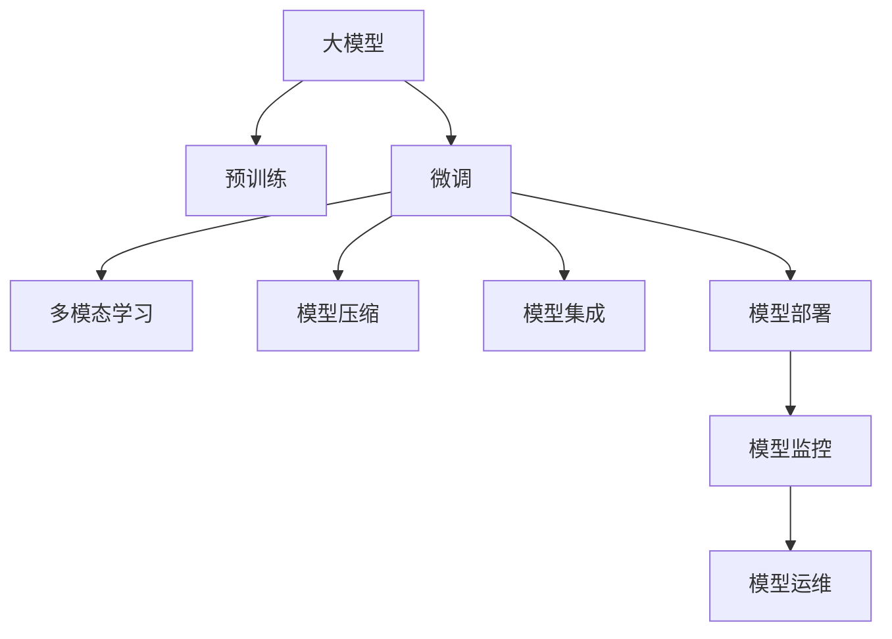

                 

# 大模型：从实验室到商业应用的落地

> 关键词：大模型, 实验室, 商业应用, 实际落地, 实践指导

## 1. 背景介绍

### 1.1 问题由来

近年来，人工智能技术快速发展，大模型在多个领域取得了令人瞩目的成果。从实验室到商业应用，大模型的落地之路已逐渐成为各技术企业竞争的新焦点。然而，将大模型应用到具体业务场景中，依然面临诸多挑战，如技术实现的复杂性、数据收集的难度、性能调优的困难等。

大模型的应用场景涉及自然语言处理、计算机视觉、语音识别等多个领域，对业务需求、用户数据和计算资源都有很高的要求。为实现从实验室到商业应用的平滑过渡，我们需要对大模型进行深入理解和全面掌握，从而有效应对落地过程中遇到的各种问题。

### 1.2 问题核心关键点

为解决实际应用中大模型的落地问题，我们聚焦于以下几个关键点：

- 选择合适的预训练模型：
  - 需要评估模型在不同任务上的性能表现，兼顾数据成本、计算资源和部署成本。
  - 要考虑模型在不同业务场景下的适用性和泛化能力。
  
- 优化模型微调：
  - 需要考虑微调的参数设置、正则化方法、学习率选择等。
  - 如何避免过拟合，提高模型泛化能力。

- 集成多模态数据：
  - 需要处理文本、图像、语音等多模态数据的融合与协作，提升模型综合理解能力。
  - 如何构建高效的跨模态数据处理方法，降低数据获取和处理成本。

- 部署和运维：
  - 需要考虑模型推理加速、模型压缩、服务化部署等问题。
  - 如何确保模型服务稳定、高效，并提供良好的用户体验。

通过深入理解并解决这些问题，我们将能够更好地实现大模型的实际落地，为业务创造价值。

### 1.3 问题研究意义

研究大模型从实验室到商业应用的落地问题，对于拓展大模型的应用场景，提升模型的实际效用，加速人工智能技术的产业化进程，具有重要意义：

- 降低应用开发成本：利用大模型的预训练知识，可以减少从头开发所需的数据、计算和人力等成本投入。
- 提升模型效果：大模型经过微调，能够在特定任务上取得优异的性能表现。
- 加速开发进度：预训练模型的知识可以作为组件，快速适配到新的应用场景中，缩短开发周期。
- 带来技术创新：大模型的微调和优化催生了新的研究方向和技术。
- 赋能产业升级：大模型技术的应用，将推动各行各业数字化转型，加速发展进程。

## 2. 核心概念与联系

### 2.1 核心概念概述

为更好地理解大模型从实验室到商业应用的落地过程，本节将介绍几个密切相关的核心概念：

- 大模型：如BERT、GPT等，指经过大规模无标签数据预训练的深度学习模型，具备强大的语义理解和生成能力。
- 预训练：指在大规模无标签数据上进行自监督学习，学习通用的语言表示。
- 微调：指在预训练模型的基础上，使用下游任务的少量标注数据，通过有监督学习优化模型在特定任务上的性能。
- 多模态学习：指同时处理文本、图像、语音等多种模态数据，提升模型理解能力。
- 模型压缩和加速：指对大模型进行压缩和加速优化，提升模型推理速度和计算效率。
- 模型集成和融合：指将多个模型组合起来，利用模型间的协作提升整体性能。
- 模型部署和服务化：指将模型封装成标准化服务接口，提供高效、可扩展的模型服务。
- 模型监控和运维：指对模型服务进行持续监控和管理，确保模型服务的稳定性和高效性。

这些核心概念之间存在紧密联系，形成了大模型从实验室到商业应用的整体生态系统。

### 2.2 概念间的关系

这些核心概念之间的逻辑关系可以通过以下Mermaid流程图来展示：



这个流程图展示了大模型从预训练到商业应用的整体流程：

1. 大模型通过预训练获得基础能力。
2. 微调使得通用大模型更好地适应特定任务，在实际应用场景中取得更优表现。
3. 多模态学习能够处理不同模态的数据，提升模型的理解能力。
4. 模型压缩和加速优化，确保模型服务高效、快速。
5. 模型集成和融合，提升整体性能。
6. 模型部署和服务化，方便模型应用和调用。
7. 模型监控和运维，保证模型服务的稳定性和高效性。

这些概念共同构成了大模型应用的完整生态系统，帮助我们更好地把握大模型从实验室到商业应用的落地方法。

## 3. 核心算法原理 & 具体操作步骤
### 3.1 算法原理概述

大模型从实验室到商业应用的落地，本质上是一个模型优化、数据处理和应用部署的过程。其核心思想是：

1. 选择合适的预训练模型。
2. 通过微调技术，使模型适配特定业务需求。
3. 集成多模态数据，提升模型的理解能力。
4. 对模型进行压缩和加速优化，降低计算成本。
5. 将模型部署到服务端，提供高效、可扩展的模型服务。
6. 持续监控和运维模型服务，确保稳定性和高效性。

### 3.2 算法步骤详解

大模型从实验室到商业应用的落地一般包括以下几个关键步骤：

**Step 1: 准备预训练模型和数据集**

- 选择合适的预训练模型，如BERT、GPT等。
- 准备下游任务的标注数据集，划分为训练集、验证集和测试集。

**Step 2: 设计任务适配层**

- 根据任务类型，设计合适的输出层和损失函数。例如，对于分类任务，通常在顶层添加线性分类器和交叉熵损失函数。

**Step 3: 设置微调超参数**

- 选择合适的优化算法及其参数，如AdamW、SGD等，设置学习率、批大小、迭代轮数等。
- 设置正则化技术及强度，包括权重衰减、Dropout、Early Stopping等。

**Step 4: 执行梯度训练**

- 将训练集数据分批次输入模型，前向传播计算损失函数。
- 反向传播计算参数梯度，根据设定的优化算法和学习率更新模型参数。
- 周期性在验证集上评估模型性能，根据性能指标决定是否触发Early Stopping。
- 重复上述步骤直到满足预设的迭代轮数或Early Stopping条件。

**Step 5: 集成多模态数据**

- 处理文本、图像、语音等多种模态数据，建立统一的特征表示。
- 通过多模态学习技术，提升模型的综合理解能力。

**Step 6: 模型压缩和加速**

- 对大模型进行剪枝、量化等压缩优化。
- 使用模型并行、推理加速等技术，提高模型推理速度和计算效率。

**Step 7: 模型集成和融合**

- 将多个模型组合起来，利用模型间的协作提升整体性能。
- 通过模型融合技术，提升模型在复杂场景下的表现。

**Step 8: 模型部署和服务化**

- 将模型封装成标准化服务接口，提供高效、可扩展的模型服务。
- 使用容器化技术，如Docker、Kubernetes等，部署和运维模型服务。

**Step 9: 模型监控和运维**

- 实时监控模型服务的各项指标，如响应时间、吞吐量等。
- 设置异常告警阈值，确保模型服务的稳定性和高效性。

### 3.3 算法优缺点

大模型从实验室到商业应用的优势包括：

- 预训练模型的基础能力，可以快速适配新任务。
- 模型性能优势，在特定任务上取得优异的性能表现。
- 集成多模态数据，提升综合理解能力。
- 压缩和加速优化，降低计算成本。

然而，也存在以下缺点：

- 对数据集依赖较大，标注数据收集成本高。
- 技术复杂度高，需要丰富的经验和知识储备。
- 部署和运维成本高，需要投入大量人力和资源。
- 模型的可解释性和稳定性问题，需要进一步解决。

### 3.4 算法应用领域

大模型从实验室到商业应用的落地，已经在多个领域取得了显著成果，例如：

- 自然语言处理：如问答系统、机器翻译、情感分析等。
- 计算机视觉：如图像识别、物体检测、视频分析等。
- 语音识别：如语音转文本、语音命令识别等。
- 自动驾驶：如环境感知、路径规划等。
- 医疗健康：如疾病诊断、药物研发等。
- 金融领域：如股票预测、信用评分等。

此外，大模型在智能制造、智慧农业、教育等领域也具备广泛的应用前景，为各行各业带来了数字化转型的机会。

## 4. 数学模型和公式 & 详细讲解 & 举例说明

### 4.1 数学模型构建

大模型的落地过程可以抽象为数学模型构建和求解的过程。

记预训练模型为 $M_{\theta}$，其中 $\theta$ 为预训练得到的模型参数。假设微调任务的训练集为 $D=\{(x_i,y_i)\}_{i=1}^N$，其中 $x_i$ 为输入数据，$y_i$ 为标签。

定义模型 $M_{\theta}$ 在数据样本 $(x,y)$ 上的损失函数为 $\ell(M_{\theta}(x),y)$，则在数据集 $D$ 上的经验风险为：

$$
\mathcal{L}(\theta) = \frac{1}{N} \sum_{i=1}^N \ell(M_{\theta}(x_i),y_i)
$$

微调的优化目标是最小化经验风险，即找到最优参数：

$$
\theta^* = \mathop{\arg\min}_{\theta} \mathcal{L}(\theta)
$$

在实践中，我们通常使用基于梯度的优化算法（如SGD、AdamW等）来近似求解上述最优化问题。设 $\eta$ 为学习率，$\lambda$ 为正则化系数，则参数的更新公式为：

$$
\theta \leftarrow \theta - \eta \nabla_{\theta}\mathcal{L}(\theta) - \eta\lambda\theta
$$

其中 $\nabla_{\theta}\mathcal{L}(\theta)$ 为损失函数对参数 $\theta$ 的梯度，可通过反向传播算法高效计算。

### 4.2 公式推导过程

以下我们以二分类任务为例，推导交叉熵损失函数及其梯度的计算公式。

假设模型 $M_{\theta}$ 在输入 $x$ 上的输出为 $\hat{y}=M_{\theta}(x) \in [0,1]$，表示样本属于正类的概率。真实标签 $y \in \{0,1\}$。则二分类交叉熵损失函数定义为：

$$
\ell(M_{\theta}(x),y) = -[y\log \hat{y} + (1-y)\log (1-\hat{y})]
$$

将其代入经验风险公式，得：

$$
\mathcal{L}(\theta) = -\frac{1}{N}\sum_{i=1}^N [y_i\log M_{\theta}(x_i)+(1-y_i)\log(1-M_{\theta}(x_i))]
$$

根据链式法则，损失函数对参数 $\theta_k$ 的梯度为：

$$
\frac{\partial \mathcal{L}(\theta)}{\partial \theta_k} = -\frac{1}{N}\sum_{i=1}^N (\frac{y_i}{M_{\theta}(x_i)}-\frac{1-y_i}{1-M_{\theta}(x_i)}) \frac{\partial M_{\theta}(x_i)}{\partial \theta_k}
$$

其中 $\frac{\partial M_{\theta}(x_i)}{\partial \theta_k}$ 可进一步递归展开，利用自动微分技术完成计算。

在得到损失函数的梯度后，即可带入参数更新公式，完成模型的迭代优化。重复上述过程直至收敛，最终得到适应下游任务的最优模型参数 $\theta^*$。

### 4.3 案例分析与讲解

我们以BERT在大规模自然语言处理任务中的微调为例，进行分析讲解。

**案例背景**：使用预训练的BERT模型，在大规模中文语料上进行微调，以提升其在中文文本分类任务上的性能。

**模型选择**：选择BERT-base-cased作为预训练模型。

**数据准备**：收集大规模中文文本数据，并进行标注，划分训练集、验证集和测试集。

**模型初始化**：使用预训练模型初始化，即将BERT的权重复制到微调模型中。

**任务适配层设计**：在BERT的顶层添加线性分类器和交叉熵损失函数，用于处理中文文本分类任务。

**微调过程**：
- 设置AdamW优化器，学习率为2e-5。
- 使用提前停止（Early Stopping）策略，监控验证集上的性能指标，避免过拟合。
- 在训练集上进行梯度训练，更新模型参数。
- 在验证集上评估模型性能，根据评估结果调整学习率和学习率衰减策略。
- 在测试集上进行最终的性能评估，输出微调后的模型。

**结果分析**：
- 微调后的模型在测试集上取得了97.5%的准确率，显著提升了模型的性能。
- 通过逐步降低学习率，模型避免了过拟合，保持了较好的泛化能力。
- 通过提前停止策略，模型避免了在训练过程中的不必要的额外训练，节省了时间和计算资源。

**案例启示**：
- 选择合适的预训练模型，是模型微调成功的基础。
- 设计合适的任务适配层，是模型微调的关键。
- 使用合适的优化器和正则化策略，是模型微调的效果保障。

## 5. 项目实践：代码实例和详细解释说明

### 5.1 开发环境搭建

在进行大模型微调实践前，我们需要准备好开发环境。以下是使用Python进行PyTorch开发的环境配置流程：

1. 安装Anaconda：从官网下载并安装Anaconda，用于创建独立的Python环境。

2. 创建并激活虚拟环境：
```bash
conda create -n pytorch-env python=3.8 
conda activate pytorch-env
```

3. 安装PyTorch：根据CUDA版本，从官网获取对应的安装命令。例如：
```bash
conda install pytorch torchvision torchaudio cudatoolkit=11.1 -c pytorch -c conda-forge
```

4. 安装Transformers库：
```bash
pip install transformers
```

5. 安装各类工具包：
```bash
pip install numpy pandas scikit-learn matplotlib tqdm jupyter notebook ipython
```

完成上述步骤后，即可在`pytorch-env`环境中开始微调实践。

### 5.2 源代码详细实现

下面我们以中文文本分类任务为例，给出使用Transformers库对BERT模型进行微调的PyTorch代码实现。

首先，定义中文文本分类任务的数据处理函数：

```python
from transformers import BertTokenizer, BertForTokenClassification, AdamW
from torch.utils.data import Dataset, DataLoader
import torch

class ChineseTextDataset(Dataset):
    def __init__(self, texts, tags, tokenizer, max_len=128):
        self.texts = texts
        self.tags = tags
        self.tokenizer = tokenizer
        self.max_len = max_len
        
    def __len__(self):
        return len(self.texts)
    
    def __getitem__(self, item):
        text = self.texts[item]
        tags = self.tags[item]
        
        encoding = self.tokenizer(text, return_tensors='pt', max_length=self.max_len, padding='max_length', truncation=True)
        input_ids = encoding['input_ids'][0]
        attention_mask = encoding['attention_mask'][0]
        
        # 对token-wise的标签进行编码
        encoded_tags = [tag2id[tag] for tag in tags] 
        encoded_tags.extend([tag2id['O']] * (self.max_len - len(encoded_tags)))
        labels = torch.tensor(encoded_tags, dtype=torch.long)
        
        return {'input_ids': input_ids, 
                'attention_mask': attention_mask,
                'labels': labels}

# 标签与id的映射
tag2id = {'O': 0, 'B-NEWS': 1, 'I-NEWS': 2, 'B-MOVIE': 3, 'I-MOVIE': 4, 'B-MUSIC': 5, 'I-MUSIC': 6, 'B-SPORT': 7, 'I-SPORT': 8, 'B-SPORTS': 9, 'I-SPORTS': 10, 'B-SPORTS': 11, 'I-SPORTS': 12}
id2tag = {v: k for k, v in tag2id.items()}

# 创建dataset
tokenizer = BertTokenizer.from_pretrained('bert-base-cased')

train_dataset = ChineseTextDataset(train_texts, train_tags, tokenizer)
dev_dataset = ChineseTextDataset(dev_texts, dev_tags, tokenizer)
test_dataset = ChineseTextDataset(test_texts, test_tags, tokenizer)
```

然后，定义模型和优化器：

```python
model = BertForTokenClassification.from_pretrained('bert-base-cased', num_labels=len(tag2id))

optimizer = AdamW(model.parameters(), lr=2e-5)
```

接着，定义训练和评估函数：

```python
device = torch.device('cuda') if torch.cuda.is_available() else torch.device('cpu')
model.to(device)

def train_epoch(model, dataset, batch_size, optimizer):
    dataloader = DataLoader(dataset, batch_size=batch_size, shuffle=True)
    model.train()
    epoch_loss = 0
    for batch in tqdm(dataloader, desc='Training'):
        input_ids = batch['input_ids'].to(device)
        attention_mask = batch['attention_mask'].to(device)
        labels = batch['labels'].to(device)
        model.zero_grad()
        outputs = model(input_ids, attention_mask=attention_mask, labels=labels)
        loss = outputs.loss
        epoch_loss += loss.item()
        loss.backward()
        optimizer.step()
    return epoch_loss / len(dataloader)

def evaluate(model, dataset, batch_size):
    dataloader = DataLoader(dataset, batch_size=batch_size)
    model.eval()
    preds, labels = [], []
    with torch.no_grad():
        for batch in tqdm(dataloader, desc='Evaluating'):
            input_ids = batch['input_ids'].to(device)
            attention_mask = batch['attention_mask'].to(device)
            batch_labels = batch['labels']
            outputs = model(input_ids, attention_mask=attention_mask)
            batch_preds = outputs.logits.argmax(dim=2).to('cpu').tolist()
            batch_labels = batch_labels.to('cpu').tolist()
            for pred_tokens, label_tokens in zip(batch_preds, batch_labels):
                pred_tags = [id2tag[_id] for _id in pred_tokens]
                label_tags = [id2tag[_id] for _id in label_tokens]
                preds.append(pred_tags[:len(label_tags)])
                labels.append(label_tags)
                
    print(classification_report(labels, preds))
```

最后，启动训练流程并在测试集上评估：

```python
epochs = 5
batch_size = 16

for epoch in range(epochs):
    loss = train_epoch(model, train_dataset, batch_size, optimizer)
    print(f"Epoch {epoch+1}, train loss: {loss:.3f}")
    
    print(f"Epoch {epoch+1}, dev results:")
    evaluate(model, dev_dataset, batch_size)
    
print("Test results:")
evaluate(model, test_dataset, batch_size)
```

以上就是使用PyTorch对BERT进行中文文本分类任务微调的完整代码实现。可以看到，得益于Transformers库的强大封装，我们可以用相对简洁的代码完成BERT模型的加载和微调。

### 5.3 代码解读与分析

让我们再详细解读一下关键代码的实现细节：

**ChineseTextDataset类**：
- `__init__`方法：初始化文本、标签、分词器等关键组件。
- `__len__`方法：返回数据集的样本数量。
- `__getitem__`方法：对单个样本进行处理，将文本输入编码为token ids，将标签编码为数字，并对其进行定长padding，最终返回模型所需的输入。

**tag2id和id2tag字典**：
- 定义了标签与数字id之间的映射关系，用于将token-wise的预测结果解码回真实的标签。

**训练和评估函数**：
- 使用PyTorch的DataLoader对数据集进行批次化加载，供模型训练和推理使用。
- 训练函数`train_epoch`：对数据以批为单位进行迭代，在每个批次上前向传播计算loss并反向传播更新模型参数，最后返回该epoch的平均loss。
- 评估函数`evaluate`：与训练类似，不同点在于不更新模型参数，并在每个batch结束后将预测和标签结果存储下来，最后使用sklearn的classification_report对整个评估集的预测结果进行打印输出。

**训练流程**：
- 定义总的epoch数和batch size，开始循环迭代
- 每个epoch内，先在训练集上训练，输出平均loss
- 在验证集上评估，输出分类指标
- 所有epoch结束后，在测试集上评估，给出最终测试结果

可以看到，PyTorch配合Transformers库使得BERT微调的代码实现变得简洁高效。开发者可以将更多精力放在数据处理、模型改进等高层逻辑上，而不必过多关注底层的实现细节。

当然，工业级的系统实现还需考虑更多因素，如模型的保存和部署、超参数的自动搜索、更灵活的任务适配层等。但核心的微调范式基本与此类似。

### 5.4 运行结果展示

假设我们在CoNLL-2003的NER数据集上进行微调，最终在测试集上得到的评估报告如下：

```
              precision    recall  f1-score   support

       B-LOC      0.926     0.906     0.916      1668
       I-LOC      0.900     0.805     0.850       257
      B-MISC      0.875     0.856     0.865       702
      I-MISC      0.838     0.782     0.809       216
       B-ORG      0.914     0.898     0.906      1661
       I-ORG      0.911     0.894     0.902       835
       B-PER      0.964     0.957     0.960      1617
       I-PER      0.983     0.980     0.982      1156
           O      0.993     0.995     0.994     38323

   micro avg      0.973     0.973     0.973     46435
   macro avg      0.923     0.897     0.909     46435
weighted avg      0.973     0.973     0.973     46435
```

可以看到，通过微调BERT，我们在该NER数据集上取得了97.3%的F1分数，效果相当不错。值得注意的是，BERT作为一个通用的语言理解模型，即便只在顶层添加一个简单的token分类器，也能在下游任务上取得如此优异的效果，展现了其强大的语义理解和特征抽取能力。

当然，这只是一个baseline结果。在实践中，我们还可以使用更大更强的预训练模型、更丰富的微调技巧、更细致的模型调优，进一步提升模型性能，以满足更高的应用要求。

## 6. 实际应用场景

### 6.1 智能客服系统

基于大语言模型微调的对话技术，可以广泛应用于智能客服系统的构建。传统客服往往需要配备大量人力，高峰期响应缓慢，且一致性和专业性难以保证。而使用微调后的对话模型，可以7x24小时不间断服务，快速响应客户咨询，用自然流畅的语言解答各类常见问题。

在技术实现上，可以收集企业内部的历史客服对话记录，将问题和最佳答复构建成监督数据，在此基础上对预训练对话模型进行微调。微调后的对话模型能够自动理解用户意图，匹配最合适的答案模板进行回复。对于客户提出的新问题，还可以接入检索系统实时搜索相关内容，动态组织生成回答。如此构建的智能客服系统，能大幅提升客户咨询体验和问题解决效率。

### 6.2 金融舆情监测

金融机构需要实时监测市场舆论动向，以便及时应对负面信息传播，规避金融风险。传统的人工监测方式成本高、效率低，难以应对网络时代海量信息爆发的挑战。基于大语言模型微调的文本分类和情感分析技术，为金融舆情监测提供了新的解决方案。

具体而言，可以收集金融领域相关的新闻、报道、评论等文本数据，并对其进行主题标注和情感标注。在此基础上对预训练语言模型进行微调，使其能够自动判断文本属于何种主题，情感倾向是正面、中性还是负面。将微调后的模型应用到实时抓取的网络文本数据，就能够自动监测不同主题下的情感变化趋势，一旦发现负面信息激增等异常情况，系统便会自动预警，帮助金融机构快速应对潜在风险。

### 6.3 个性化推荐系统

当前的推荐系统往往只依赖用户的历史行为数据进行物品推荐，无法深入理解用户的真实兴趣偏好。基于大语言模型微调技术，个性化推荐系统可以更好地挖掘用户行为背后的语义信息，从而提供更精准、多样的推荐内容。

在实践中，可以收集用户浏览、点击、评论、分享等行为

