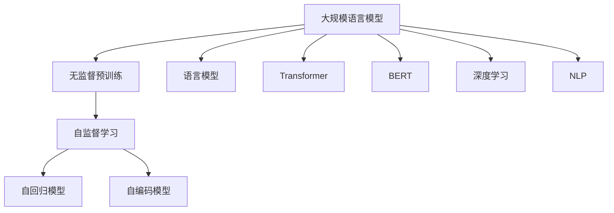
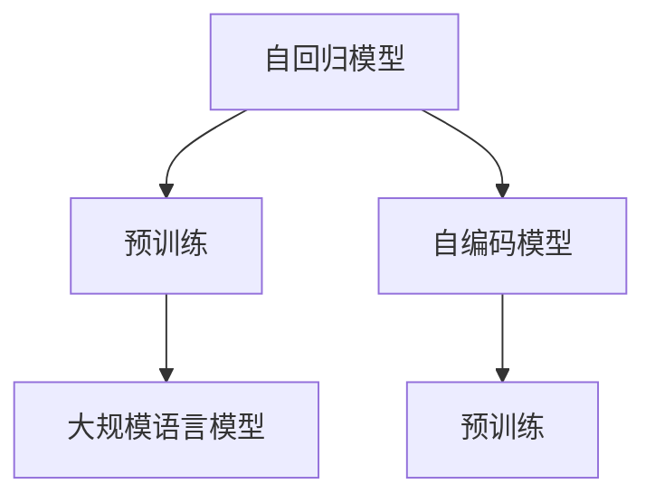
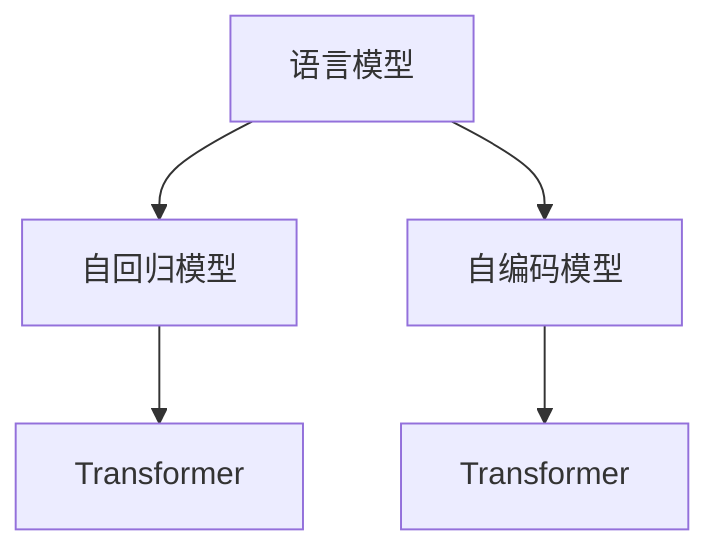
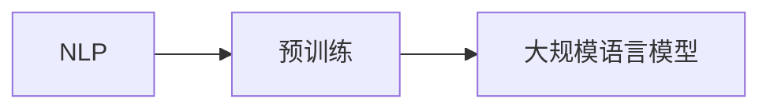
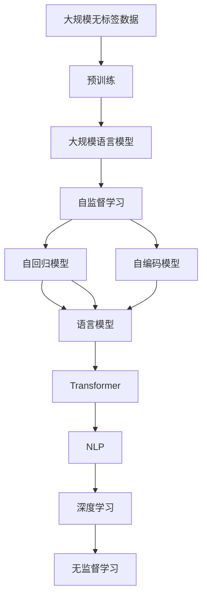

                 

# 大规模语言模型从理论到实践 无监督预训练

> 关键词：大规模语言模型, 无监督预训练, 自监督学习, 自回归, 自编码, 语言模型, Transformer, BERT, 预训练, 深度学习, 自然语言处理(NLP)

## 1. 背景介绍

### 1.1 问题由来

近年来，随着深度学习技术的飞速发展，自然语言处理(NLP)领域取得了显著的进展。特别是基于大规模无标签文本数据进行预训练的大规模语言模型，展现出了强大的语言表示和理解能力。这些模型通过自我监督学习，学习到丰富的语言知识和结构，能够理解自然语言的内在规律，生成高质量的自然语言文本。

这些模型的一个代表性成果是谷歌的BERT和OpenAI的GPT系列。BERT通过在大规模语料库上进行掩码语言建模和下一句预测等自监督学习任务，学习到通用的语言表示，具备出色的理解能力和生成能力。GPT系列模型则是采用自回归方式进行预训练，能够生成连贯的文本，用于各种语言生成任务。

然而，尽管这些模型在预训练时取得了显著的性能提升，但在实际应用中仍面临诸多挑战。预训练模型需要大量的计算资源和存储资源，且对数据的质量和多样性有较高的要求。如何更高效、更灵活地利用预训练模型，是大规模语言模型落地应用的关键。

### 1.2 问题核心关键点

预训练是大规模语言模型的核心环节，旨在通过自监督学习任务，在无标签文本数据上学习到通用的语言表示。其中，自监督学习是预训练的基础，通过大规模的无标签数据，自动构建出监督信号，训练模型自动预测隐含的标签，从而学习到语言的内在结构。

预训练的主要目标包括：
- 学习通用的语言表示：通过自监督学习任务，学习到跨任务的通用语言表示。
- 增强泛化能力：在预训练阶段学习到的表示能够更好地泛化到下游任务。
- 提高训练效率：通过预训练的方式，使用无标签数据进行训练，减少标注数据的成本。

目前，无监督预训练主要采用以下两种方式：
1. 自回归（AR）模型：如GPT系列模型，通过后向预测后文，学习到语言的上下文关系。
2. 自编码（AE）模型：如BERT模型，通过前向预测缺失部分，学习到语言的编码表示。

这些模型通过大量的预训练，能够在各种NLP任务上取得优异的效果。但预训练也存在一些局限性：
- 需要大量的计算资源：大规模预训练需要大量的计算资源和存储资源，不适合小规模硬件环境。
- 对数据的多样性要求高：预训练的性能很大程度上依赖于数据的多样性和质量。
- 容易产生数据偏差：预训练过程中容易学习到训练数据的偏见，传递到下游任务中，影响模型性能。

尽管如此，无监督预训练仍然是当前大规模语言模型的主流范式。未来，随着预训练技术的发展，无监督预训练将为自然语言处理领域带来更多的突破。

## 2. 核心概念与联系

### 2.1 核心概念概述

为更好地理解大规模语言模型的无监督预训练方法，本节将介绍几个密切相关的核心概念：

- 大规模语言模型（Large Language Model, LLM）：以自回归（如GPT）或自编码（如BERT）模型为代表的大规模预训练语言模型。通过在大规模无标签文本语料上进行预训练，学习通用的语言知识和表示。

- 无监督学习（Unsupervised Learning）：无需使用标注数据，仅通过大规模无标签数据进行训练，自动构建监督信号，训练模型学习到数据的分布特征。

- 自监督学习（Self-Supervised Learning）：一种无监督学习的特例，通过构建自监督任务，将大规模无标签数据转化为监督信号，训练模型学习到数据的结构特征。

- 语言模型（Language Model）：用于描述自然语言的概率分布的模型，通过学习文本数据中的概率分布，预测下一个单词或文本片段的概率。

- Transformer：一种基于注意力机制的神经网络结构，用于解决序列建模问题，具有较好的并行性和计算效率。

- BERT：一种基于自编码的预训练语言模型，通过掩码语言模型和下一句预测等任务，学习到通用的语言表示。

- 预训练（Pre-training）：通过大规模无标签数据进行训练，学习到通用的语言表示。

- 深度学习（Deep Learning）：一种基于神经网络进行学习的方法，能够处理复杂的数据分布。

- 自然语言处理（Natural Language Processing, NLP）：涉及计算机与人类语言交互的领域，主要关注如何处理和理解自然语言。

这些核心概念之间的逻辑关系可以通过以下Mermaid流程图来展示：



这个流程图展示了大规模语言模型的核心概念及其之间的关系：

1. 大规模语言模型通过无监督预训练学习通用的语言表示。
2. 无监督预训练通过自监督学习任务，如掩码语言模型和下一句预测，学习语言的结构特征。
3. 自回归模型和自编码模型是两种主要的无监督预训练方式。
4. 语言模型是用于描述自然语言的概率分布的模型。
5. Transformer是一种重要的神经网络结构，用于解决序列建模问题。
6. BERT是一种基于自编码的预训练语言模型。
7. 深度学习是构建大规模语言模型的基础技术。
8. NLP是应用大规模语言模型的主要领域。

### 2.2 概念间的关系

这些核心概念之间存在着紧密的联系，形成了大规模语言模型无监督预训练的完整生态系统。下面我们通过几个Mermaid流程图来展示这些概念之间的关系。

#### 2.2.1 无监督学习与预训练的关系


这个流程图展示了无监督学习与预训练的关系。预训练是无监督学习的一种特例，通过大规模无标签数据进行训练，学习到通用的语言表示。

#### 2.2.2 自监督学习与预训练的关系


这个流程图展示了自监督学习与预训练的关系。预训练过程中，自监督学习任务提供了监督信号，帮助模型学习到语言的结构特征。

#### 2.2.3 自回归模型与自编码模型的关系



这个流程图展示了自回归模型与自编码模型的关系。自回归模型通过后向预测后文进行预训练，自编码模型通过前向预测缺失部分进行预训练。两者都可以学习到通用的语言表示。

#### 2.2.4 语言模型与Transformer的关系



这个流程图展示了语言模型与Transformer的关系。自回归模型和自编码模型都可以用于语言建模，Transformer则可以用于处理序列数据，提升模型的计算效率。

#### 2.2.5 预训练与深度学习的关系


这个流程图展示了预训练与深度学习的关系。深度学习技术提供了构建大规模语言模型的基础，预训练则是深度学习的重要应用场景之一。

#### 2.2.6 预训练与NLP的关系



这个流程图展示了预训练与NLP的关系。NLP领域是预训练模型应用的主要场景，预训练通过学习通用的语言表示，提升了NLP任务的性能。

### 2.3 核心概念的整体架构

最后，我们用一个综合的流程图来展示这些核心概念在大规模语言模型无监督预训练过程中的整体架构：



这个综合流程图展示了从大规模无标签数据到无监督预训练，再到通用语言模型的完整过程。大规模无标签数据经过预训练，学习到通用的语言表示。自监督学习任务提供了监督信号，帮助模型学习语言的结构特征。自回归模型和自编码模型通过不同的方式进行预训练，学习到通用的语言表示。语言模型和Transformer是重要的无监督预训练方式。预训练模型应用到NLP任务上，提升任务性能。深度学习技术是预训练模型的基础，无监督学习则是预训练的核心思想。

这些概念共同构成了大规模语言模型无监督预训练的完整生态系统，为构建高效、灵活、通用的语言模型奠定了基础。通过理解这些核心概念，我们可以更好地把握大规模语言模型的预训练原理和应用方向。

## 3. 核心算法原理 & 具体操作步骤
### 3.1 算法原理概述

无监督预训练的主要目标是通过大规模无标签数据，学习到通用的语言表示。其核心思想是利用自监督学习任务，自动构建监督信号，训练模型学习到语言的结构特征。

形式化地，假设无标签文本数据为 $D=\{(x_i,y_i)\}_{i=1}^N$，其中 $x_i$ 表示第 $i$ 个文本样本，$y_i$ 表示真实的语言模型概率分布，即 $p(y_i|x_i)$。无监督预训练的目标是最大化模型 $M_{\theta}$ 在数据集 $D$ 上的似然函数 $L(D|M_{\theta})$：

$$
L(D|M_{\theta}) = \frac{1}{N}\sum_{i=1}^N \log p(y_i|x_i)
$$

通过最大化似然函数，模型能够学习到真实的语言概率分布，提升语言表示能力。常见的自监督学习任务包括：

- 掩码语言建模（Masked Language Modeling, MLM）：预测文本中缺失的单词。
- 下一句预测（Next Sentence Prediction, NSP）：预测文本 $x_i$ 是否是文本 $x_{i+1}$ 的下一个句子。
- 文本分类（Text Classification, TC）：对文本进行分类。

通过这些自监督学习任务，无监督预训练可以学习到通用的语言表示，提升模型在各种NLP任务上的性能。

### 3.2 算法步骤详解

无监督预训练的主要步骤如下：

**Step 1: 准备预训练数据和模型**

- 收集大规模无标签文本数据，如维基百科、新闻、书籍等。
- 选择合适的预训练模型架构，如Transformer、BERT等。
- 初始化模型参数，设置超参数，如学习率、批次大小、迭代轮数等。

**Step 2: 设计自监督学习任务**

- 选择合适的自监督学习任务，如掩码语言建模、下一句预测等。
- 设计损失函数，如交叉熵损失、掩码概率损失等。
- 设计评价指标，如准确率、精确度、召回率等。

**Step 3: 执行训练过程**

- 将数据分批次输入模型，前向传播计算损失函数。
- 反向传播计算参数梯度，根据设定的优化算法更新模型参数。
- 周期性在验证集上评估模型性能，根据性能指标决定是否触发Early Stopping。
- 重复上述步骤直到满足预设的迭代轮数或Early Stopping条件。

**Step 4: 测试和部署**

- 在测试集上评估预训练模型，对比预训练前后的性能提升。
- 使用预训练模型对新样本进行推理预测，集成到实际的应用系统中。
- 持续收集新的数据，定期重新预训练模型，以适应数据分布的变化。

以上是无监督预训练的一般流程。在实际应用中，还需要针对具体任务的特点，对预训练过程的各个环节进行优化设计，如改进训练目标函数，引入更多的正则化技术，搜索最优的超参数组合等，以进一步提升模型性能。

### 3.3 算法优缺点

无监督预训练的主要优点包括：

1. 高效利用数据：无监督预训练利用大规模无标签数据进行训练，无需标注数据，可以高效利用数据资源。
2. 泛化能力强：通过学习通用的语言表示，无监督预训练模型可以更好地泛化到各种NLP任务。
3. 计算效率高：无监督预训练过程中不需要标注数据，计算效率相对较高。
4. 通用性高：无监督预训练模型适用于各种NLP任务，可以提供通用的语言表示。

同时，无监督预训练也存在一些局限性：

1. 对数据要求高：无监督预训练的性能很大程度上依赖于数据的质量和多样性。
2. 容易产生偏差：无监督预训练过程中容易学习到训练数据的偏见，传递到下游任务中。
3. 可解释性差：无监督预训练模型往往缺乏可解释性，难以对其推理逻辑进行分析和调试。

尽管如此，无监督预训练仍然是当前大规模语言模型的主流范式。未来相关研究的重点在于如何进一步降低预训练对标注数据的依赖，提高模型的少样本学习和跨领域迁移能力，同时兼顾可解释性和伦理安全性等因素。

### 3.4 算法应用领域

无监督预训练的大规模语言模型已经在NLP领域得到了广泛的应用，覆盖了几乎所有常见任务，例如：

- 文本分类：如情感分析、主题分类、意图识别等。通过预训练模型学习文本-标签映射。
- 命名实体识别：识别文本中的人名、地名、机构名等特定实体。通过预训练模型学习实体边界和类型。
- 关系抽取：从文本中抽取实体之间的语义关系。通过预训练模型学习实体-关系三元组。
- 问答系统：对自然语言问题给出答案。将问题-答案对作为预训练数据，训练模型学习匹配答案。
- 机器翻译：将源语言文本翻译成目标语言。通过预训练模型学习语言-语言映射。
- 文本摘要：将长文本压缩成简短摘要。通过预训练模型学习抓取要点。
- 对话系统：使机器能够与人自然对话。将多轮对话历史作为上下文，预训练模型进行回复生成。

除了上述这些经典任务外，无监督预训练的大规模语言模型还被创新性地应用到更多场景中，如可控文本生成、常识推理、代码生成、数据增强等，为NLP技术带来了全新的突破。随着预训练模型和无监督预训练方法的不断进步，相信NLP技术将在更广阔的应用领域大放异彩。

## 4. 数学模型和公式 & 详细讲解  
### 4.1 数学模型构建

本节将使用数学语言对无监督预训练的大规模语言模型进行更加严格的刻画。

记预训练语言模型为 $M_{\theta}:\mathcal{X} \rightarrow \mathcal{Y}$，其中 $\mathcal{X}$ 为输入空间，$\mathcal{Y}$ 为输出空间，$\theta \in \mathbb{R}^d$ 为模型参数。假设预训练任务的数据集为 $D=\{(x_i,y_i)\}_{i=1}^N, x_i \in \mathcal{X}, y_i \in \mathcal{Y}$。

定义模型 $M_{\theta}$ 在数据样本 $(x,y)$ 上的损失函数为 $\ell(M_{\theta}(x),y)$，则在数据集 $D$ 上的经验风险为：

$$
\mathcal{L}(\theta) = \frac{1}{N}\sum_{i=1}^N \ell(M_{\theta}(x_i),y_i)
$$

无监督预训练的目标是最小化经验风险，即找到最优参数：

$$
\theta^* = \mathop{\arg\min}_{\theta} \mathcal{L}(\theta)
$$

在实践中，我们通常使用基于梯度的优化算法（如SGD、Adam等）来近似求解上述最优化问题。设 $\eta$ 为学习率，$\lambda$ 为正则化系数，则参数的更新公式为：

$$
\theta \leftarrow \theta - \eta \nabla_{\theta}\mathcal{L}(\theta) - \eta\lambda\theta
$$

其中 $\nabla_{\theta}\mathcal{L}(\theta)$ 为损失函数对参数 $\theta$ 的梯度，可通过反向传播算法高效计算。

### 4.2 公式推导过程

以下我们以掩码语言建模任务为例，推导掩码语言模型的损失函数及其梯度的计算公式。

假设模型 $M_{\theta}$ 在输入 $x$ 上的输出为 $\hat{y}=M_{\theta}(x) \in [0,1]$，表示样本属于正类的概率。真实标签 $y \in \{0,1\}$。掩码语言建模任务的掩码概率定义为：

$$
P(y_i|x_i) = \prod_{j=1}^{|\mathcal{V}|} p_{ij}
$$

其中 $p_{ij}=\frac{\exp(\hat{y}_i^{(j)}}{\sum_{k=1}^{|\mathcal{V}|} \exp(\hat{y}_i^{(k)})}$，$\mathcal{V}$ 为词汇表。掩码语言建模任务的目标是最小化掩码概率：

$$
\ell(M_{\theta}(x),y) = -P(y_i|x_i) = -\prod_{j=1}^{|\mathcal{V}|} p_{ij}
$$

将其代入经验风险公式，得：

$$
\mathcal{L}(\theta) = -\frac{1}{N}\sum_{i=1}^N \prod_{j=1}^{|\mathcal{V}|} p_{ij}
$$

根据链式法则，损失函数对参数 $\theta_k$ 的梯度为：

$$
\frac{\partial \mathcal{L}(\theta)}{\partial \theta_k} = -\frac{1}{N}\sum_{i=1}^N (\frac{\partial \log p_{ij}}{\partial \theta_k}) = -\frac{1}{N}\sum_{i=1}^N (\frac{\partial \hat{y}_i^{(j)}}{\partial \theta_k} - y_i \delta_{ij})
$$

其中 $\delta_{ij}$ 为Kronecker delta，表示 $j$ 是否为掩码位置。在得到损失函数的梯度后，即可带入参数更新公式，完成模型的迭代优化。重复上述过程直至收敛，最终得到适应预训练任务的最优模型参数 $\theta^*$。

## 5. 项目实践：代码实例和详细解释说明
### 5.1 开发环境搭建

在进行无监督预训练实践前，我们需要准备好开发环境。以下是使用Python进行PyTorch开发的环境配置流程：

1. 安装Anaconda：从官网下载并安装Anaconda，用于创建独立的Python环境。

2. 创建并激活虚拟环境：
```bash
conda create -n pytorch-env python=3.8 
conda activate pytorch-env
```

3. 安装PyTorch：根据CUDA版本，从官网获取对应的安装命令。例如：
```bash
conda install pytorch torchvision torchaudio cudatoolkit=11.1 -c pytorch -c conda-forge
```

4. 安装Transformers库：
```bash
pip install transformers
```

5. 安装各类工具包：
```bash
pip install numpy pandas scikit-learn matplotlib tqdm jupyter notebook ipython
```

完成上述步骤后，即可在`pytorch-env`环境中开始预训练实践。

### 5.2 源代码详细实现

下面我们以BERT模型为例，给出使用Transformers库进行无监督预训练的PyTorch代码实现。

首先，定义掩码语言建模任务的数据处理函数：

```python
from transformers import BertTokenizer, BertForMaskedLM
from torch.utils.data import Dataset
import torch

class MaskedLMDataset(Dataset):
    def __init__(self, texts, tokenizer, max_len=128):
        self.texts = texts
        self.tokenizer = tokenizer
        self.max_len = max_len
        
    def __len__(self):
        return len(self.texts)
    
    def __getitem__(self, item):
        text = self.texts[item]
        
        encoding = self.tokenizer(text, return_tensors='pt', max_length=self.max_len, padding='max_length', truncation=True)
        input_ids = encoding['input_ids'][0]
        attention_mask = encoding['attention_mask'][0]
        
        # 随机掩码位置
        masked_indices = [i for i in range(len(input_ids)) if random.randint(0, 1) == 0]
        
        # 替换掩码位置为特殊标记
        input_ids[masked_indices] = tokenizer.mask_token_id
        
        return {'input_ids': input_ids, 
                'attention_mask': attention_mask,
                'labels': torch.tensor(masked_indices, dtype=torch.long)}
```

然后，定义模型和优化器：

```python
from transformers import BertConfig
from torch.optim import AdamW

config = BertConfig()
config.vocab_size = 30522
config.hidden_size = 768
config.num_attention_heads = 12
config.num_hidden_layers = 12
config.intermediate_size = 3072
config.max_position_embeddings = 512
config.max_seq_length = 128
config.mlm_probability = 0.15

model = BertForMaskedLM(config)

optimizer = AdamW(model.parameters(), lr=2e-5)
```

接着，定义训练和评估函数：

```python
from torch.utils.data import DataLoader
from tqdm import tqdm
from sklearn.metrics import accuracy_score

device = torch.device('cuda') if torch.cuda.is_available() else torch.device('cpu')
model.to(device)

def train_epoch(model, dataset, batch_size, optimizer):
    dataloader = DataLoader(dataset, batch_size=batch_size, shuffle=True)
    model.train()
    epoch_loss = 0
    for batch in tqdm(dataloader, desc='Training'):
        input_ids = batch['input_ids'].to(device)
        attention_mask = batch['attention_mask'].to(device)
        labels = batch['labels'].to(device)
        model.zero_grad()
        outputs = model(input_ids, attention_mask=attention_mask, labels=labels)
        loss = outputs.loss
        epoch_loss += loss.item()
        loss.backward()
        optimizer.step()
    return epoch_loss / len(dataloader)

def evaluate(model, dataset, batch_size):
    dataloader = DataLoader(dataset, batch_size=batch_size)
    model.eval()
    preds, labels = [], []
    with torch.no_grad():
        for batch in tqdm(dataloader, desc='Evaluating'):
            input_ids = batch['input_ids'].to(device)
            attention_mask = batch['attention_mask'].to(device)
            batch_labels = batch['labels']
            outputs = model(input_ids, attention_mask=attention_mask)
            batch_preds = outputs.predictions.argmax(dim=2).to('cpu').tolist()
            batch_labels = batch_labels.to('cpu').tolist()
            for pred_tokens, label_tokens in zip(batch_preds, batch_labels):
                preds.append(pred_tokens[:len(label_tokens)])
                labels.append(label_tokens)
                
    return accuracy_score(labels, preds)
```

最后，启动训练流程并在测试集上评估：

```python
epochs = 5
batch_size = 16

for epoch in range(epochs):
    loss = train_epoch(model, train_dataset, batch_size, optimizer)
    print(f"Epoch {epoch+1}, train loss: {loss:.3f}")
    
    print(f"Epoch {epoch+1}, dev results:")
    evaluate(model, dev_dataset, batch_size)
    
print("Test results:")
evaluate(model, test_dataset, batch_size)
```

以上就是使用PyTorch对BERT进行无监督预训练的完整代码实现。可以看到，得益于Transformers库的强大封装，我们可以用相对简洁的代码完成BERT模型的加载和预训练。

### 5.3 代码解读与分析

让我们再详细解读一下关键代码的实现细节：

**MaskedLMDataset类**：
- `__init__`方法：初始化文本、分词器等关键组件。
- `__len__`方法：返回数据集的样本数量。
- `__getitem__`方法：对单个样本进行处理，将文本输入编码为token ids，并随机掩码部分位置，生成掩码标签。

**BertConfig和BertForMaskedLM类**：
- `BertConfig`类定义了BERT模型的超参数，如词汇表大小、隐藏层大小、注意力头数等。
- `BertForMaskedLM`类定义了BERT模型的架构，包含输入嵌入层、编码器、线性输出层等。

**训练和评估函数**：
- 使用PyTorch的DataLoader对数据集进行批次化加载，供模型训练和推理使用。
- 训练函数`train_epoch`：对数据以批为单位进行迭代，在每个批次上前向传播计算loss并反向

