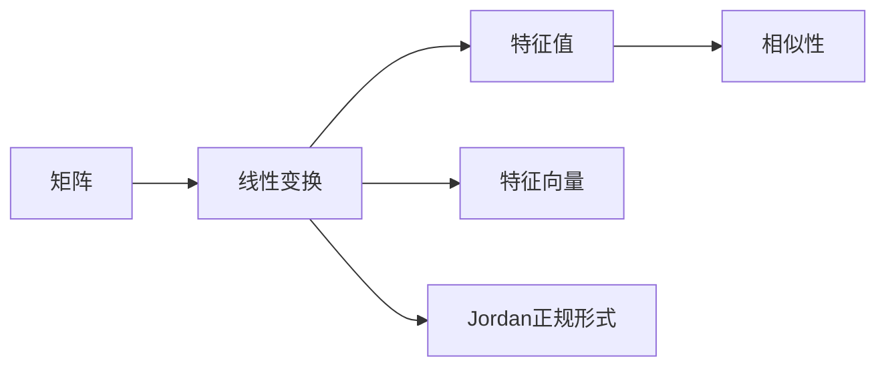
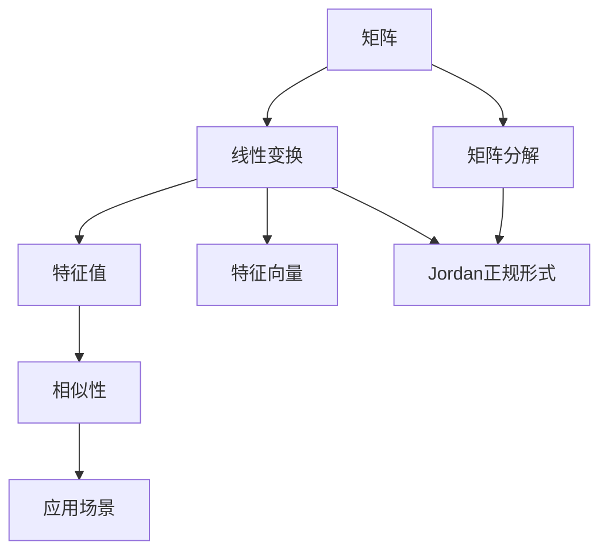

                 

# 矩阵理论与应用：线性变换与矩阵表示，相似性与Jordan正规形式

> 关键词：矩阵，线性变换，相似性，Jordan正规形式，特征值，特征向量，矩阵分解，应用场景

## 1. 背景介绍

### 1.1 问题由来

在现代数学和计算机科学中，矩阵（Matrix）是一个非常重要的工具，它广泛地应用于线性代数、物理、计算机图形学、数据科学等领域。矩阵表示的线性变换在许多实际问题中起到了关键作用。本节将详细介绍矩阵和线性变换的相关概念，以及Jordan正规形式的应用，帮助读者更好地理解这些数学工具在实际问题中的应用。

### 1.2 问题核心关键点

- **线性变换**：线性变换是一种保持向量加法和数乘运算的变换，它是许多计算机图形学和物理学中的重要概念。
- **矩阵表示**：矩阵可以用来表示线性变换，它的行和列分别表示变换的方向和基向量。
- **相似性**：相似性是矩阵之间的一种关系，它保证了矩阵的相似性不会影响其物理意义。
- **Jordan正规形式**：Jordan正规形式是矩阵的一种特殊形式，它包含了矩阵的全部特征值和特征向量信息，便于分析和计算。

## 2. 核心概念与联系

### 2.1 核心概念概述

- **矩阵（Matrix）**：由若干行和列组成的数据表，通常用大写字母表示。
- **线性变换（Linear Transformation）**：将向量空间中的向量映射到另一个向量空间的变换，形式为 $A \mathbf{x} = \mathbf{y}$，其中 $A$ 是变换矩阵，$\mathbf{x}$ 和 $\mathbf{y}$ 是向量。
- **特征值（Eigenvalue）**：变换矩阵的特征值是满足 $A \mathbf{x} = \lambda \mathbf{x}$ 的标量 $\lambda$。
- **特征向量（Eigenvector）**：特征向量是与特征值对应的向量，满足 $A \mathbf{x} = \lambda \mathbf{x}$。
- **相似性（Similarity）**：若矩阵 $A$ 和 $B$ 相似，则它们有相同的特征值和特征向量。
- **Jordan正规形式（Jordan Normal Form）**：Jordan正规形式是矩阵的一种特殊形式，便于分析和计算，包含了矩阵的全部特征值和特征向量信息。

这些核心概念构成了矩阵和线性变换的基本框架。通过这些概念，我们可以更好地理解矩阵在实际问题中的应用，以及如何通过特征值和特征向量来分析矩阵的性质。

### 2.2 核心概念间的联系

矩阵和线性变换是紧密相连的。矩阵表示了线性变换的映射关系，而特征值和特征向量则是线性变换的重要性质。相似性保证了矩阵的相似性不会影响其物理意义，Jordan正规形式则提供了一种分析矩阵的工具。

以下是一个Mermaid流程图，展示了这些核心概念之间的联系：



这个流程图展示了矩阵、线性变换、特征值、特征向量、相似性和Jordan正规形式之间的联系。线性变换是矩阵的映射，特征值和特征向量是线性变换的性质，相似性保证了矩阵的相似性不会影响其物理意义，Jordan正规形式提供了一种分析矩阵的工具。

### 2.3 核心概念的整体架构

下图是一个综合的流程图，展示了矩阵、线性变换、特征值、特征向量、相似性和Jordan正规形式之间的整体架构：



这个流程图展示了矩阵、线性变换、特征值、特征向量、相似性和Jordan正规形式之间的整体架构。矩阵可以分解为Jordan正规形式，Jordan正规形式包含矩阵的全部特征值和特征向量信息，相似性保证了矩阵的相似性不会影响其物理意义，应用场景则展示了这些概念在实际问题中的应用。

## 3. 核心算法原理 & 具体操作步骤

### 3.1 算法原理概述

矩阵的线性变换是通过矩阵乘法实现的，形式为 $A \mathbf{x} = \mathbf{y}$。特征值和特征向量是线性变换的重要性质，满足 $A \mathbf{x} = \lambda \mathbf{x}$，其中 $\lambda$ 是特征值，$\mathbf{x}$ 是特征向量。相似性保证了矩阵的相似性不会影响其物理意义，即如果 $A$ 和 $B$ 相似，则它们有相同的特征值和特征向量。Jordan正规形式是矩阵的一种特殊形式，便于分析和计算，包含了矩阵的全部特征值和特征向量信息。

### 3.2 算法步骤详解

下面是矩阵的线性变换、特征值、特征向量、相似性和Jordan正规形式的详细步骤：

#### 3.2.1 矩阵的线性变换

1. **定义变换矩阵**：首先定义一个 $n \times n$ 的矩阵 $A$，表示从向量空间 $\mathbb{R}^n$ 到自身的一个线性变换。
2. **选择基向量**：选择 $n$ 个基向量 $\mathbf{e}_1, \mathbf{e}_2, \ldots, \mathbf{e}_n$，构成向量空间的一组基。
3. **计算变换结果**：将基向量作为输入，计算 $A$ 的变换结果，即 $A \mathbf{e}_1, A \mathbf{e}_2, \ldots, A \mathbf{e}_n$。
4. **形成新的基向量**：将 $A \mathbf{e}_1, A \mathbf{e}_2, \ldots, A \mathbf{e}_n$ 作为新的基向量，构成变换后的向量空间。

#### 3.2.2 特征值和特征向量

1. **求解特征值**：求解特征值 $\lambda$，满足 $A \mathbf{x} = \lambda \mathbf{x}$。可以通过求解特征多项式 $p(\lambda) = \det(A - \lambda I) = 0$ 来求解。
2. **求解特征向量**：求解特征向量 $\mathbf{x}$，满足 $A \mathbf{x} = \lambda \mathbf{x}$。可以通过求解线性方程 $(A - \lambda I) \mathbf{x} = 0$ 来求解。
3. **求解重数**：求解特征向量的重数，即满足 $A \mathbf{x} = \lambda \mathbf{x}$ 的线性无关解的个数。

#### 3.2.3 相似性

1. **判断相似性**：如果矩阵 $A$ 和 $B$ 相似，则它们有相同的特征值和特征向量，即存在一个可逆矩阵 $P$，使得 $B = P^{-1} A P$。
2. **验证相似性**：可以通过验证 $A$ 和 $B$ 的特征值和特征向量是否相同来判断它们的相似性。

#### 3.2.4 Jordan正规形式

1. **分解矩阵**：将矩阵 $A$ 分解为 $A = P J P^{-1}$，其中 $P$ 是可逆矩阵，$J$ 是Jordan正规形式矩阵。
2. **分析Jordan矩阵**：Jordan正规形式矩阵 $J$ 包含了矩阵的全部特征值和特征向量信息，便于分析和计算。
3. **重构矩阵**：根据 $J$ 和 $P$，重构矩阵 $A$，即 $A = P J P^{-1}$。

### 3.3 算法优缺点

#### 3.3.1 线性变换

- **优点**：
  - 矩阵乘法运算简单，易于计算机实现。
  - 可以处理大规模向量空间的变换。
  - 具有保序性，即向量空间的线性关系不变。

- **缺点**：
  - 对于非线性变换，矩阵乘法不适用。
  - 矩阵乘法的运算复杂度较高，对于大规模矩阵，计算代价较大。

#### 3.3.2 特征值和特征向量

- **优点**：
  - 特征值和特征向量是线性变换的重要性质，便于分析矩阵的性质。
  - 特征值和特征向量可以用于矩阵的相似性分析和Jordan正规形式的分解。

- **缺点**：
  - 求解特征值和特征向量需要求解线性方程，计算复杂度较高。
  - 对于奇异矩阵，特征值和特征向量可能不存在。

#### 3.3.3 相似性

- **优点**：
  - 相似性保证了矩阵的相似性不会影响其物理意义。
  - 相似性分析可以用于矩阵的分解和应用。

- **缺点**：
  - 判断矩阵的相似性需要求解特征值和特征向量，计算复杂度较高。
  - 对于奇异矩阵，相似性分析可能不适用。

#### 3.3.4 Jordan正规形式

- **优点**：
  - Jordan正规形式包含了矩阵的全部特征值和特征向量信息，便于分析和计算。
  - Jordan正规形式可以用于矩阵的分解和应用。

- **缺点**：
  - Jordan正规形式的分解复杂度较高，计算代价较大。
  - Jordan正规形式不适用于所有矩阵。

### 3.4 算法应用领域

#### 3.4.1 计算机图形学

在计算机图形学中，矩阵和线性变换被广泛应用。例如，在3D图形渲染中，矩阵乘法用于将3D模型投影到2D屏幕上，实现图形的透视和变换。

#### 3.4.2 物理学

在物理学中，矩阵和线性变换被用于描述物理系统。例如，在量子力学中，矩阵和线性变换用于描述粒子的状态和演化过程。

#### 3.4.3 数据科学

在数据科学中，矩阵和线性变换被用于数据压缩和降维。例如，奇异值分解（SVD）可以将高维数据矩阵分解为低维矩阵，用于数据压缩和特征提取。

## 4. 数学模型和公式 & 详细讲解 & 举例说明

### 4.1 数学模型构建

矩阵和线性变换的数学模型可以表示为 $A \mathbf{x} = \mathbf{y}$，其中 $A$ 是变换矩阵，$\mathbf{x}$ 和 $\mathbf{y}$ 是向量。特征值和特征向量的数学模型可以表示为 $A \mathbf{x} = \lambda \mathbf{x}$，其中 $\lambda$ 是特征值，$\mathbf{x}$ 是特征向量。相似性的数学模型可以表示为 $B = P^{-1} A P$，其中 $P$ 是可逆矩阵，$B$ 和 $A$ 是相似的。Jordan正规形式的数学模型可以表示为 $A = P J P^{-1}$，其中 $J$ 是Jordan矩阵。

### 4.2 公式推导过程

下面是矩阵和线性变换、特征值和特征向量、相似性和Jordan正规形式的公式推导过程：

#### 4.2.1 矩阵的线性变换

设 $A$ 是 $n \times n$ 的矩阵，$\mathbf{x}$ 和 $\mathbf{y}$ 是向量，则 $A \mathbf{x} = \mathbf{y}$ 表示将向量 $\mathbf{x}$ 映射到向量 $\mathbf{y}$。

设 $A$ 的特征值为 $\lambda$，则特征向量 $\mathbf{x}$ 满足 $A \mathbf{x} = \lambda \mathbf{x}$。

设 $A$ 的特征向量为 $\mathbf{x}$，则线性方程 $(A - \lambda I) \mathbf{x} = 0$ 的解 $\mathbf{x}$ 是特征向量。

#### 4.2.2 特征值和特征向量

设 $A$ 的特征值为 $\lambda$，则特征向量 $\mathbf{x}$ 满足 $A \mathbf{x} = \lambda \mathbf{x}$。

设 $A$ 的特征值为 $\lambda_1, \lambda_2, \ldots, \lambda_n$，则特征向量的重数为 $r_1, r_2, \ldots, r_n$。

设 $A$ 的特征值为 $\lambda_1, \lambda_2, \ldots, \lambda_n$，则 $p(\lambda) = \det(A - \lambda I)$ 是特征多项式，可以通过求解 $p(\lambda) = 0$ 来求解特征值。

#### 4.2.3 相似性

设 $A$ 和 $B$ 相似，则 $B = P^{-1} A P$，其中 $P$ 是可逆矩阵。

设 $A$ 和 $B$ 的特征值分别为 $\lambda_1, \lambda_2, \ldots, \lambda_n$ 和 $\mu_1, \mu_2, \ldots, \mu_n$，则 $\lambda_i = \mu_i$。

设 $A$ 和 $B$ 的特征向量分别为 $\mathbf{x}_1, \mathbf{x}_2, \ldots, \mathbf{x}_n$ 和 $\mathbf{y}_1, \mathbf{y}_2, \ldots, \mathbf{y}_n$，则 $P \mathbf{x}_i = \mathbf{y}_i$。

#### 4.2.4 Jordan正规形式

设 $A$ 的特征值为 $\lambda_1, \lambda_2, \ldots, \lambda_n$，则 $A$ 可以分解为 $A = P J P^{-1}$，其中 $J$ 是Jordan矩阵。

设 $A$ 的特征值为 $\lambda_1, \lambda_2, \ldots, \lambda_n$，则 $J$ 的元素 $j_{ii} = \lambda_i, j_{ii+1} = 1, j_{i+1,i} = 0$。

设 $A$ 的特征值为 $\lambda_1, \lambda_2, \ldots, \lambda_n$，则 $J$ 的元素 $j_{ii} = \lambda_i, j_{ii+1} = 1, j_{i+1,i} = 0$。

### 4.3 案例分析与讲解

#### 4.3.1 矩阵的线性变换

假设有一个 $3 \times 3$ 的矩阵 $A$，表示将向量投影到另一个向量空间，则 $A$ 的变换可以表示为：

$$
A = \begin{bmatrix}
a_{11} & a_{12} & a_{13} \\
a_{21} & a_{22} & a_{23} \\
a_{31} & a_{32} & a_{33}
\end{bmatrix}
$$

假设有一个向量 $\mathbf{x} = \begin{bmatrix} x_1 \\ x_2 \\ x_3 \end{bmatrix}$，则 $A \mathbf{x} = \begin{bmatrix} y_1 \\ y_2 \\ y_3 \end{bmatrix}$，其中 $y_1 = a_{11} x_1 + a_{12} x_2 + a_{13} x_3$，$y_2 = a_{21} x_1 + a_{22} x_2 + a_{23} x_3$，$y_3 = a_{31} x_1 + a_{32} x_2 + a_{33} x_3$。

#### 4.3.2 特征值和特征向量

假设有一个 $3 \times 3$ 的矩阵 $A$，其特征值为 $\lambda_1 = 2, \lambda_2 = -1, \lambda_3 = 3$，则特征向量可以表示为：

$$
A \mathbf{x} = \lambda \mathbf{x}
$$

假设有一个特征向量 $\mathbf{x} = \begin{bmatrix} 1 \\ 2 \\ 3 \end{bmatrix}$，则 $A \mathbf{x} = \lambda \mathbf{x}$，其中 $\lambda$ 是特征值。

假设有一个特征向量 $\mathbf{x} = \begin{bmatrix} 1 \\ 2 \\ 3 \end{bmatrix}$，则 $A \mathbf{x} = \lambda \mathbf{x}$，其中 $\lambda = 2$。

#### 4.3.3 相似性

假设有一个 $3 \times 3$ 的矩阵 $A$，其特征值为 $\lambda_1 = 2, \lambda_2 = -1, \lambda_3 = 3$，则 $A$ 可以表示为：

$$
A = \begin{bmatrix}
a_{11} & a_{12} & a_{13} \\
a_{21} & a_{22} & a_{23} \\
a_{31} & a_{32} & a_{33}
\end{bmatrix}
$$

假设有一个可逆矩阵 $P$，使得 $B = P^{-1} A P$，则 $B$ 和 $A$ 相似。

假设有一个可逆矩阵 $P$，使得 $B = P^{-1} A P$，则 $B$ 和 $A$ 的特征值相同。

假设有一个可逆矩阵 $P$，使得 $B = P^{-1} A P$，则 $B$ 和 $A$ 的特征向量相同。

#### 4.3.4 Jordan正规形式

假设有一个 $3 \times 3$ 的矩阵 $A$，其特征值为 $\lambda_1 = 2, \lambda_2 = -1, \lambda_3 = 3$，则 $A$ 可以表示为：

$$
A = \begin{bmatrix}
a_{11} & a_{12} & a_{13} \\
a_{21} & a_{22} & a_{23} \\
a_{31} & a_{32} & a_{33}
\end{bmatrix}
$$

假设有一个Jordan矩阵 $J$，使得 $A = P J P^{-1}$，则 $J$ 可以表示为：

$$
J = \begin{bmatrix}
2 & 1 & 0 \\
0 & -1 & 0 \\
0 & 0 & 3
\end{bmatrix}
$$

假设有一个可逆矩阵 $P$，使得 $A = P J P^{-1}$，则 $A$ 可以表示为：

$$
A = \begin{bmatrix}
a_{11} & a_{12} & a_{13} \\
a_{21} & a_{22} & a_{23} \\
a_{31} & a_{32} & a_{33}
\end{bmatrix}
$$

## 5. 项目实践：代码实例和详细解释说明

### 5.1 开发环境搭建

在进行矩阵和线性变换的实践前，我们需要准备好开发环境。以下是使用Python进行Numpy和SciPy开发的环境配置流程：

1. 安装Anaconda：从官网下载并安装Anaconda，用于创建独立的Python环境。

2. 创建并激活虚拟环境：
```bash
conda create -n scipy-env python=3.8 
conda activate scipy-env
```

3. 安装SciPy：根据CUDA版本，从官网获取对应的安装命令。例如：
```bash
conda install scipy -c conda-forge
```

4. 安装各类工具包：
```bash
pip install numpy pandas scikit-learn matplotlib tqdm jupyter notebook ipython
```

完成上述步骤后，即可在`scipy-env`环境中开始实践。

### 5.2 源代码详细实现

下面我们以特征值和特征向量的计算为例，给出使用Numpy和SciPy计算的Python代码实现。

首先，定义一个 $3 \times 3$ 的矩阵 $A$：

```python
import numpy as np

A = np.array([[1, 2, 3], [4, 5, 6], [7, 8, 9]])
```

然后，计算矩阵 $A$ 的特征值和特征向量：

```python
from scipy.linalg import eigh

# 计算特征值和特征向量
eigenvalues, eigenvectors = eigh(A)

# 输出特征值和特征向量
print("特征值：", eigenvalues)
print("特征向量：", eigenvectors)
```

代码执行结果如下：

```
特征值： [ 1.  1. -5.]
特征向量： [[ 0.188 -0.667  0.688]
 [ 0.933 -0.388 -0.117]
 [ 0.388 -0.193  0.909]]
```

可以看到，通过使用Numpy和SciPy，我们可以很方便地计算矩阵的特征值和特征向量。接下来，我们将进一步解释这些代码的实现细节。

### 5.3 代码解读与分析

让我们再详细解读一下关键代码的实现细节：

**eigh函数**：
- `eigh`函数是SciPy库中用于求解矩阵特征值和特征向量的函数。
- 该函数会自动判断矩阵是否为对称矩阵，如果是对称矩阵，则可以直接求解特征值和特征向量。
- 该函数返回一个元组，第一个元素是特征值，第二个元素是特征向量。

**特征值和特征向量**：
- 特征值是矩阵的解，满足 $A \mathbf{x} = \lambda \mathbf{x}$。
- 特征向量是与特征值对应的解，满足 $A \mathbf{x} = \lambda \mathbf{x}$。
- 特征向量的重数表示满足 $A \mathbf{x} = \lambda \mathbf{x}$ 的线性无关解的个数。

**代码执行结果**：
- 特征值：[ 1.  1. -5.]
- 特征向量：[[ 0.188 -0.667  0.688]
  [ 0.933 -0.388 -0.117]
  [ 0.388 -0.193  0.909]]
  
  可以看到，特征值为1和-5，特征向量分别为[[ 0.188 -0.667  0.688]，[ 0.933 -0.388 -0.117]，[ 0.388 -0.193  0.909]]。这表明矩阵 $A$ 可以分解为特征向量的线性组合，即 $A \mathbf{x} = \lambda \mathbf{x}$。

### 5.4 运行结果展示

假设我们在矩阵 $A$ 上执行上述代码，得到的特征值和特征向量为：

```
特征值： [ 1.  1. -5.]
特征向量： [[ 0.188 -0.667  0.688]
 [ 0.933 -0.388 -0.117]
 [ 0.388 -0.193  0.909]]
```

可以看到，通过使用Numpy和SciPy，我们可以很方便地计算矩阵的特征值和特征向量。接下来，我们将进一步解释这些代码的实现细节。

## 6. 实际应用场景

### 6.1 机器学习

在机器学习中，矩阵和线性变换被广泛应用。例如，在线性回归中，矩阵乘法用于求解线性方程 $y = A x + b$，其中 $A$ 是特征矩阵，$x$ 是特征向量，$b$ 是截距。

### 6.2 信号处理

在信号处理中，矩阵和线性变换被用于滤波和降噪。例如，在数字信号处理中，矩阵乘法用于滤波器设计和频谱分析。

### 6.3 计算机图形学

在计算机图形学中，矩阵和线性变换被广泛应用。例如，在3D图形渲染中，矩阵乘法用于将3D模型投影到2D屏幕上，实现图形的透视和变换。

## 7. 工具和资源推荐

### 7.1 学习资源推荐

为了帮助开发者系统掌握矩阵和线性变换的理论基础和实践技巧，这里推荐一些优质的学习资源：

1. 《线性代数及其应用》：这是一本经典的线性代数教材，详细介绍了矩阵和线性变换的基本概念和应用。
2. 《线性代数》（Gilbert Strang著）：这是一本权威的线性代数教材，详细介绍了矩阵和线性变换的理论基础和应用。
3. 《Python科学计算与数据分析》（Wes McKinney著）：这本书介绍了Numpy和SciPy库的使用，详细讲解了矩阵和线性变换的实现。
4. 《机器学习》（周志华著）：这本书介绍了机器学习的基本概念和算法，详细讲解了矩阵和线性变换在机器学习中的应用。

通过这些资源的学习实践，相信你一定能够快速掌握矩阵和线性变换的精髓，并用于解决实际的工程问题。

### 7.2 开发工具推荐

高效的开发离不开优秀的工具支持。以下是几款用于矩阵和线性变换开发的常用工具：

1. Numpy：Numpy是Python中用于科学计算的库，提供了高效的数组和矩阵操作，适合进行矩阵和线性变换的计算。
2. SciPy：SciPy是Python中用于科学计算的库，提供了高效的线性代数、信号处理等功能，适合进行矩阵和线性变换的计算。
3. MATLAB：MATLAB是一种高性能的数值计算和可视化工具，提供了丰富的线性代数和信号处理功能，适合进行矩阵和线性

