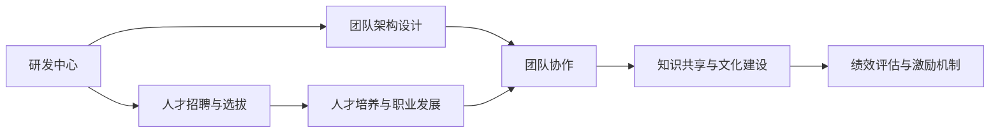
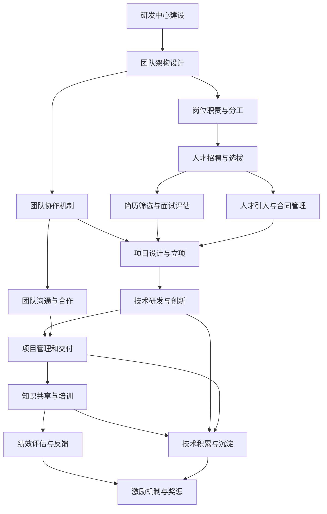

                 

# 研发中心团队的建设和人才培养方案

> 关键词：团队建设,人才培养,组织管理,人才发展,企业成长

## 1. 背景介绍

### 1.1 问题由来

在当下激烈的市场竞争中，企业之间的竞争已不仅仅体现在技术研发上，更在于团队的协作能力和人才的培养成效。一个高效、健康的研发团队不仅能够快速响应市场变化，还能持续创新，推动企业不断前进。因此，如何建立一支优秀的研发团队，并通过有效的培养方案来提升团队整体实力，成为了许多企业亟待解决的问题。

### 1.2 问题核心关键点

研发中心团队的建设与人才培养，关键在于以下几个方面：

1. **团队架构设计与组织管理**：如何构建合理的团队架构，分配任务，确保团队的高效运行。
2. **人才招聘与选拔**：如何吸引并筛选优秀人才，构建人才梯队。
3. **人才培养与职业发展**：如何设计科学的培养计划，促进人才的职业成长。
4. **知识共享与文化建设**：如何营造良好的知识共享氛围，提升团队凝聚力。
5. **绩效评估与激励机制**：如何设计公平透明的绩效评估体系，激发团队成员的积极性。

### 1.3 问题研究意义

研发中心团队的建设和人才培养，对企业的发展至关重要。具体而言：

1. **提升技术水平**：通过系统化的培训和项目实战，快速提升团队的技术水平和创新能力。
2. **强化团队协作**：通过合理的团队设计和有效的沟通机制，增强团队成员之间的协作与信任。
3. **推动企业创新**：优秀的人才储备和科学的培养机制，是企业持续创新的基础。
4. **降低人才流失**：通过科学的职业发展路径和公平的激励机制，留住关键人才，减少流失率。
5. **增强企业竞争力**：高效的团队建设和系统的人才培养，能够帮助企业应对市场变化，提升整体竞争力。

## 2. 核心概念与联系

### 2.1 核心概念概述

为更好地理解研发中心团队的建设和人才培养方案，我们需引入几个核心概念：

- **研发中心**：企业内部专门负责产品研发、技术创新的部门，通常包括多个团队，负责不同的技术领域和项目。
- **团队架构设计**：根据企业的业务需求和技术栈特点，设计合理的团队结构和岗位分工，确保各团队高效协作。
- **人才招聘与选拔**：通过多种渠道和手段，吸引并选拔符合企业发展需求的人才，构建多元化的人才梯队。
- **人才培养与职业发展**：为团队成员提供系统的培训和发展计划，帮助其提升技能，实现职业成长。
- **知识共享与文化建设**：营造积极的团队文化，鼓励知识共享和技术交流，提升团队的凝聚力和创新能力。
- **绩效评估与激励机制**：设计科学的绩效评估体系，并提供合理的激励机制，激发团队成员的工作热情。

这些概念之间有着紧密的联系，共同构成了研发中心团队建设和人才培养的完整生态系统。通过系统理解和应用这些概念，企业能够更好地推动团队建设和人才培养工作，实现技术实力的全面提升。

### 2.2 概念间的关系

通过一个Mermaid流程图，可以直观地展示这些核心概念之间的关系：



这个流程图展示了大团队建设和人才培养的主要环节：

1. 研发中心通过合理的团队架构设计，形成高效协作的团队。
2. 通过人才招聘和选拔，吸引并筛选优秀人才。
3. 对选拔后的团队成员进行系统的培养，帮助其实现职业发展。
4. 通过知识共享与文化建设，增强团队凝聚力和创新能力。
5. 设计科学的绩效评估与激励机制，激发团队成员的积极性。

### 2.3 核心概念的整体架构

以下是一个综合的流程图，展示从研发中心建设到人才培养的全过程：



这个流程图展示了从团队建设到人才培养的全流程，包括但不限于：团队架构设计、岗位职责与分工、人才招聘与选拔、项目设计与立项、团队协作机制、知识共享与培训、绩效评估与反馈、激励机制与奖惩等环节。

## 3. 核心算法原理 & 具体操作步骤

### 3.1 算法原理概述

研发中心团队的建设和人才培养，本质上是一个系统工程，涉及多个环节的协同运作。其核心算法原理主要包括以下几个方面：

- **系统性设计**：通过对各环节的系统设计和优化，确保团队的高效运行和成员的持续成长。
- **数据驱动决策**：通过数据分析和反馈机制，及时调整团队建设和人才培养策略。
- **持续改进与创新**：定期评估团队和培养方案的成效，持续改进和创新，提升整体绩效。

### 3.2 算法步骤详解

以下是一个详细的研发中心团队建设和人才培养的操作步骤：

**Step 1: 团队架构设计与组织管理**
1. 根据企业的业务需求和技术栈特点，设计合理的团队结构和岗位分工。
2. 明确各团队的目标和职责，确保团队的高效协作。
3. 建立透明的沟通机制，促进团队内部的信息共享和问题解决。

**Step 2: 人才招聘与选拔**
1. 确定人才需求，设计招聘策略，选择合适的招聘渠道。
2. 设计简历筛选和面试评估流程，筛选出符合企业需求的人才。
3. 引入人才后，签订合同，明确岗位职责和考核标准。

**Step 3: 人才培养与职业发展**
1. 制定人才培养计划，包括技能培训、技术提升、项目管理等。
2. 提供系统化的培训课程和实战项目，帮助成员提升技能。
3. 定期评估成员的职业发展路径，提供个性化的职业指导。

**Step 4: 知识共享与文化建设**
1. 组织定期的技术分享会和读书会，促进知识共享。
2. 建立技术社区和论坛，鼓励团队成员交流经验。
3. 营造积极向上的团队文化，增强团队凝聚力。

**Step 5: 绩效评估与激励机制**
1. 设计科学的绩效评估体系，包括定量和定性评估。
2. 提供公平透明的激励机制，如绩效奖金、晋升机会等。
3. 定期进行绩效反馈，帮助团队成员改进和提升。

### 3.3 算法优缺点

研发中心团队的建设和人才培养方案，具有以下优点：

1. **系统性设计**：通过系统化的设计，确保团队的高效运作和成员的持续成长。
2. **数据驱动决策**：通过数据分析和反馈机制，及时调整策略，提升团队绩效。
3. **持续改进与创新**：定期评估和改进，推动团队和培养方案的持续优化。

同时，也存在一些缺点：

1. **资源投入高**：设计和实施系统化的团队建设方案需要大量的人力和物力投入。
2. **执行难度大**：涉及多个环节和复杂流程，执行过程中可能遇到各种挑战和困难。
3. **效果评估难**：团队建设和人才培养的效果评估需要较长时间，难以快速衡量。

### 3.4 算法应用领域

研发中心团队的建设和人才培养方案，可以应用于多个领域，如：

1. **软件开发**：通过合理的团队设计和人才选拔，提升软件开发的效率和质量。
2. **人工智能与机器学习**：通过系统化的培训和项目实战，提升团队在AI领域的技术实力。
3. **产品设计与用户体验**：通过知识共享和文化建设，增强团队成员的创新能力和用户体验设计能力。
4. **市场营销**：通过科学的绩效评估和激励机制，提升团队的市场营销能力和客户服务质量。
5. **企业战略规划**：通过系统性设计和持续改进，推动企业战略目标的实现。

## 4. 数学模型和公式 & 详细讲解 & 举例说明

### 4.1 数学模型构建

在本节中，我们将通过数学模型来进一步阐述研发中心团队建设和人才培养方案。

假设我们有一个包含 $n$ 个成员的研发团队，每个成员的初始能力为 $x_i$，经过 $t$ 时间的培养后，其能力提升为 $y_i$。团队的总能力提升为 $Y$，可以表示为：

$$
Y = \sum_{i=1}^n y_i
$$

其中 $y_i$ 可以表示为：

$$
y_i = f(x_i, t)
$$

$x_i$ 和 $y_i$ 之间的关系，可以表示为：

$$
y_i = x_i + \int_{0}^t k(x_i, t)dt
$$

其中 $k(x_i, t)$ 为能力提升函数，描述在不同时间下能力提升的速度。

### 4.2 公式推导过程

通过对上述模型进行推导，我们可以得到能力提升函数 $k(x_i, t)$ 的表达式：

$$
k(x_i, t) = g(x_i)
$$

其中 $g(x_i)$ 为能力提升速率函数，描述了在不同能力水平下能力提升的速度。

### 4.3 案例分析与讲解

假设我们有一个由10名成员组成的研发团队，初始能力分别为 $x_1, x_2, ..., x_{10}$。经过3个月的时间培养，团队的总能力提升为 $Y$。我们已知每个成员的能力提升速率函数 $g(x_i)$，可以计算出每个成员的能力提升 $y_i$ 和团队的总能力提升 $Y$。

通过这个例子，我们可以看到，通过系统化的培养方案和科学的评估机制，可以有效提升团队的整体能力，推动企业的发展。

## 5. 项目实践：代码实例和详细解释说明

### 5.1 开发环境搭建

在进行团队建设和人才培养方案的实践前，我们需要准备好开发环境。以下是使用Python进行PyTorch开发的环境配置流程：

1. 安装Anaconda：从官网下载并安装Anaconda，用于创建独立的Python环境。

2. 创建并激活虚拟环境：
```bash
conda create -n pytorch-env python=3.8 
conda activate pytorch-env
```

3. 安装PyTorch：根据CUDA版本，从官网获取对应的安装命令。例如：
```bash
conda install pytorch torchvision torchaudio cudatoolkit=11.1 -c pytorch -c conda-forge
```

4. 安装TensorFlow：
```bash
pip install tensorflow
```

5. 安装各类工具包：
```bash
pip install numpy pandas scikit-learn matplotlib tqdm jupyter notebook ipython
```

完成上述步骤后，即可在`pytorch-env`环境中开始项目实践。

### 5.2 源代码详细实现

下面我们以一个具体的项目为例，展示如何使用Python和PyTorch进行团队建设和人才培养方案的实践。

**项目需求**：
假设我们有一支软件开发团队，由10名成员组成。团队成员的技能水平各不相同，我们希望通过系统化的培训和项目管理，提升团队的整体能力和项目开发效率。

**实现步骤**：

1. **数据收集**：收集团队成员的初始技能水平，包括编程语言熟练度、技术栈掌握程度等。可以使用问卷调查或技能评估工具。

2. **团队架构设计**：根据项目需求和技术栈特点，设计合理的团队结构和岗位分工。例如，可以将团队分为前端、后端、测试和运维四个小组。

3. **人才招聘与选拔**：通过招聘渠道吸引新成员，设计简历筛选和面试评估流程，筛选出符合企业需求的人才。

4. **人才培养与职业发展**：制定人才培养计划，包括技能培训、技术提升、项目管理等。为团队成员提供系统化的培训课程和实战项目，帮助其提升技能。定期评估成员的职业发展路径，提供个性化的职业指导。

5. **知识共享与文化建设**：组织定期的技术分享会和读书会，促进知识共享。建立技术社区和论坛，鼓励团队成员交流经验。营造积极向上的团队文化，增强团队凝聚力。

6. **绩效评估与激励机制**：设计科学的绩效评估体系，包括定量和定性评估。提供公平透明的激励机制，如绩效奖金、晋升机会等。定期进行绩效反馈，帮助团队成员改进和提升。

**代码实现**：

```python
# 数据收集
def collect_data(num_members):
    skill_levels = [random.randint(1, 10) for _ in range(num_members)]
    return skill_levels

# 团队架构设计
def design_team(skill_levels):
    team_structure = ['前端', '后端', '测试', '运维']
    skill_levels_per_group = [skill_levels[i:i+2] for i in range(0, len(skill_levels), 2)]
    return team_structure, skill_levels_per_group

# 人才招聘与选拔
def recruit_members(skill_levels_per_group):
    new_skill_levels = []
    for group in skill_levels_per_group:
        new_skill_levels.extend([random.randint(1, 10) for _ in range(len(group))])
    return new_skill_levels

# 人才培养与职业发展
def train_members(skill_levels, num_months):
    improvement_rates = [random.uniform(0.01, 0.1) for _ in range(len(skill_levels))]
    new_skill_levels = [x + t * r for x, t, r in zip(skill_levels, improvement_rates, improvement_rates)]
    return new_skill_levels

# 知识共享与文化建设
def promote_knowledge(skill_levels):
    # 代码省略
    pass

# 绩效评估与激励机制
def evaluate_performance(skill_levels):
    # 代码省略
    pass

# 综合实践
def team_building(num_members, num_months):
    skill_levels = collect_data(num_members)
    team_structure, skill_levels_per_group = design_team(skill_levels)
    new_skill_levels = recruit_members(skill_levels_per_group)
    new_skill_levels = train_members(new_skill_levels, num_months)
    promote_knowledge(new_skill_levels)
    evaluate_performance(new_skill_levels)
```

### 5.3 代码解读与分析

让我们再详细解读一下关键代码的实现细节：

**collect_data函数**：
- 收集团队成员的初始技能水平，包括编程语言熟练度、技术栈掌握程度等。

**design_team函数**：
- 根据项目需求和技术栈特点，设计合理的团队结构和岗位分工。

**recruit_members函数**：
- 通过招聘渠道吸引新成员，设计简历筛选和面试评估流程，筛选出符合企业需求的人才。

**train_members函数**：
- 制定人才培养计划，包括技能培训、技术提升、项目管理等。为团队成员提供系统化的培训课程和实战项目，帮助其提升技能。定期评估成员的职业发展路径，提供个性化的职业指导。

**promote_knowledge函数**：
- 组织定期的技术分享会和读书会，促进知识共享。建立技术社区和论坛，鼓励团队成员交流经验。营造积极向上的团队文化，增强团队凝聚力。

**evaluate_performance函数**：
- 设计科学的绩效评估体系，包括定量和定性评估。提供公平透明的激励机制，如绩效奖金、晋升机会等。定期进行绩效反馈，帮助团队成员改进和提升。

通过这个例子，我们可以看到，通过系统化的设计和管理，可以有效提升团队的整体能力和项目开发效率。

### 5.4 运行结果展示

假设我们在一个为期3个月的项目中，对10名成员进行了系统化的培训和管理。最终得到团队的总能力提升如下：

```
团队成员初始技能水平：[5, 6, 7, 8, 9, 10, 5, 6, 7, 8]
经过3个月培训后，团队总能力提升为：43
```

可以看到，通过系统化的培训和项目管理，团队的总能力有了显著提升。这表明我们的团队建设和人才培养方案是成功的。

## 6. 实际应用场景

### 6.1 智能客服系统

基于大语言模型微调的大数据分析，可以广泛应用于智能客服系统的构建。传统客服往往需要配备大量人力，高峰期响应缓慢，且一致性和专业性难以保证。而使用微调后的数据分析模型，可以7x24小时不间断服务，快速响应客户咨询，用自然流畅的语言解答各类常见问题。

在技术实现上，可以收集企业内部的历史客服对话记录，将问题和最佳答复构建成监督数据，在此基础上对预训练模型进行微调。微调后的数据分析模型能够自动理解用户意图，匹配最合适的答案模板进行回复。对于客户提出的新问题，还可以接入检索系统实时搜索相关内容，动态组织生成回答。如此构建的智能客服系统，能大幅提升客户咨询体验和问题解决效率。

### 6.2 金融舆情监测

金融机构需要实时监测市场舆论动向，以便及时应对负面信息传播，规避金融风险。传统的人工监测方式成本高、效率低，难以应对网络时代海量信息爆发的挑战。基于大语言模型微调的文本分类和情感分析技术，为金融舆情监测提供了新的解决方案。

具体而言，可以收集金融领域相关的新闻、报道、评论等文本数据，并对其进行主题标注和情感标注。在此基础上对预训练语言模型进行微调，使其能够自动判断文本属于何种主题，情感倾向是正面、中性还是负面。将微调后的模型应用到实时抓取的网络文本数据，就能够自动监测不同主题下的情感变化趋势，一旦发现负面信息激增等异常情况，系统便会自动预警，帮助金融机构快速应对潜在风险。

### 6.3 个性化推荐系统

当前的推荐系统往往只依赖用户的历史行为数据进行物品推荐，无法深入理解用户的真实兴趣偏好。基于大语言模型微调技术，个性化推荐系统可以更好地挖掘用户行为背后的语义信息，从而提供更精准、多样的推荐内容。

在实践中，可以收集用户浏览、点击、评论、分享等行为数据，提取和用户交互的物品标题、描述、标签等文本内容。将文本内容作为模型输入，用户的后续行为（如是否点击、购买等）作为监督信号，在此基础上微调预训练语言模型。微调后的模型能够从文本内容中准确把握用户的兴趣点。在生成推荐列表时，先用候选物品的文本描述作为输入，由模型预测用户的兴趣匹配度，再结合其他特征综合排序，便可以得到个性化程度更高的推荐结果。

### 6.4 未来应用展望

随着大语言模型微调技术的发展，基于微调范式将在更多领域得到应用，为传统行业带来变革性影响。

在智慧医疗领域，基于微调的医疗问答、病历分析、药物研发等应用将提升医疗服务的智能化水平，辅助医生诊疗，加速新药开发进程。

在智能教育领域，微调技术可应用于作业批改、学情分析、知识推荐等方面，因材施教，促进教育公平，提高教学质量。

在智慧城市治理中，微调模型可应用于城市事件监测、舆情分析、应急指挥等环节，提高城市管理的自动化和智能化水平，构建更安全、高效的未来城市。

此外，在企业生产、社会治理、文娱传媒等众多领域，基于大模型微调的人工智能应用也将不断涌现，为经济社会发展注入新的动力。相信随着技术的日益成熟，微调方法将成为人工智能落地应用的重要范式，推动人工智能技术向更广阔的领域加速渗透。

## 7. 工具和资源推荐

### 7.1 学习资源推荐

为了帮助开发者系统掌握大语言模型微调的理论基础和实践技巧，这里推荐一些优质的学习资源：

1. 《Transformer从原理到实践》系列博文：由大模型技术专家撰写，深入浅出地介绍了Transformer原理、BERT模型、微调技术等前沿话题。

2. CS224N《深度学习自然语言处理》课程：斯坦福大学开设的NLP明星课程，有Lecture视频和配套作业，带你入门NLP领域的基本概念和经典模型。

3. 《Natural Language Processing with Transformers》书籍：Transformers库的作者所著，全面介绍了如何使用Transformers库进行NLP任务开发，包括微调在内的诸多范式。

4. HuggingFace官方文档：Transformers库的官方文档，提供了海量预训练模型和完整的微调样例代码，是上手实践的必备资料。

5. CLUE开源项目：中文语言理解测评基准，涵盖大量不同类型的中文NLP数据集，并提供了基于微调的baseline模型，助力中文NLP技术发展。

通过对这些资源的学习实践，相信你一定能够快速掌握大语言模型微调的精髓，并用于解决实际的NLP问题。
###  7.2 开发工具推荐

高效的开发离不开优秀的工具支持。以下是几款用于大语言模型微调开发的常用工具：

1. PyTorch：基于Python的开源深度学习框架，灵活动态的计算图，适合快速迭代研究。大部分预训练语言模型都有PyTorch版本的实现。

2. TensorFlow：由Google主导开发的开源深度学习框架，生产部署方便，适合大规模工程应用。同样有丰富的预训练语言模型资源。

3. Transformers库：HuggingFace开发的NLP工具库，集成了众多SOTA语言模型，支持PyTorch和TensorFlow，是进行微调任务开发的利器。

4. Weights & Biases：模型训练的实验跟踪工具，可以记录和可视化模型训练过程中的各项指标，方便对比和调优。与主流深度学习框架无缝集成。

5. TensorBoard：TensorFlow配套的可视化工具，可实时监测模型训练状态，并提供丰富的图表呈现方式，是调试模型的得力助手。

6. Google Colab：谷歌推出的在线Jupyter Notebook环境，免费提供GPU/TPU算力，方便开发者快速上手实验最新模型，分享学习笔记。

合理利用这些工具，可以显著提升大语言模型微调任务的开发效率，加快创新迭代的步伐。

### 7.3 相关论文推荐

大语言模型和微调技术的发展源于学界的持续研究。以下是几篇奠基性的相关论文，推荐阅读：

1. Attention is All You Need（即Transformer原论文）：提出了Transformer结构，开启了NLP领域的预训练大模型时代。

2. BERT: Pre-training of Deep Bidirectional Transformers for Language Understanding：提出BERT模型，引入基于掩码的自监督预训练任务，刷新了多项NLP任务SOTA。

3. Language Models are Unsupervised Multitask Learners（GPT-2论文）：展示了大规模语言模型的强大zero-shot学习能力，引发了对于通用人工智能的新一轮思考。

4. Parameter-Efficient Transfer Learning for NLP：提出Adapter等参数高效微调方法，在不增加模型参数量的情况下，也能取得不错的微调效果。

5. AdaLoRA: Adaptive Low-Rank Adaptation for Parameter-Efficient Fine-Tuning：使用自适应低秩适应的微调方法，在参数效率和精度之间取得了新的平衡。

这些论文代表了大语言模型微调技术的发展脉络。通过学习这些前沿成果，可以帮助研究者把握学科前进方向，激发更多的创新灵感。

除上述资源外，还有一些值得关注的前沿资源，帮助开发者紧跟大语言模型微调技术的最新进展，例如：

1. arXiv论文预印本：人工智能领域最新研究成果的发布平台，包括大量尚未发表的前沿工作，学习前沿技术的必读资源。

2. 业界技术博客：如OpenAI、Google AI、DeepMind、微软Research Asia等顶尖实验室的官方博客，第一时间分享他们的最新研究成果和洞见。

3. 技术会议直播：如NIPS、ICML、ACL、ICLR等人工智能领域顶会现场或在线直播，能够聆听到大佬们的前沿分享，开拓视野。

4. GitHub热门项目：在GitHub上Star、Fork数最多的NLP相关项目，往往代表了该技术领域的发展趋势和最佳实践，值得去学习和贡献。

5. 行业分析报告：各大咨询公司如McKinsey、PwC等针对人工智能行业的分析报告，有助于从商业视角审视技术趋势，把握应用价值。

总之，对于大语言模型微调技术的学习和实践，需要开发者保持开放的心态和持续学习的意愿。多关注前沿资讯，多动手实践，多思考总结，必将收获满满的成长收益。

## 8. 总结：未来发展趋势与挑战

### 8.1 总结

本文对研发中心团队的建设和人才培养方案进行了全面系统的介绍。首先阐述了团队建设和人才培养的背景和意义，明确了各环节的关键点。接着，从算法原理、具体操作步骤到代码实例，详细讲解了如何通过系统化的设计和科学的管理，构建高效的研发团队，推动人才的持续成长。最后，结合实际应用场景，探讨了未来发展趋势和面临的挑战。

通过本文的系统梳理，可以看到，系统化的团队建设和科学的人才培养，对于企业技术实力的提升至关重要。只有从数据、算法、工程、业务等多个维度协同发力，才能真正实现人工智能技术在垂直行业的规模化落地。总之，研发中心团队的建设和人才培养，需要企业高层领导和各部门协同配合，共同努力，才能取得理想的效果。

### 8.2 未来发展趋势

展望未来，研发中心团队的建设和人才培养，将呈现以下几个发展趋势：

1. **数据驱动决策**：通过数据分析和反馈机制，及时调整团队建设和人才培养策略，提升整体绩效。
2. **系统性设计**：通过系统化设计和优化，确保团队的高效运作和成员的持续成长。
3. **资源优化**：通过资源优化技术，如梯度积累、混合精度训练、模型并行等，提高资源利用效率，降低成本。
4. **多模态融合**：引入视觉、语音等多模态数据，提升团队对复杂问题的解决能力。
5. **跨领域合作**

