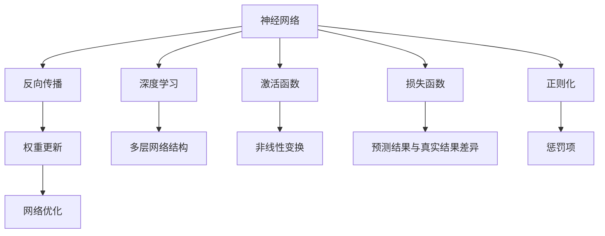
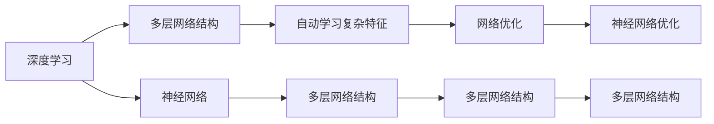
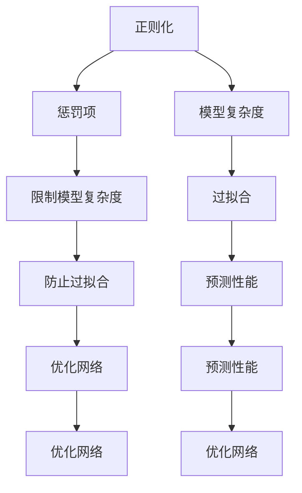
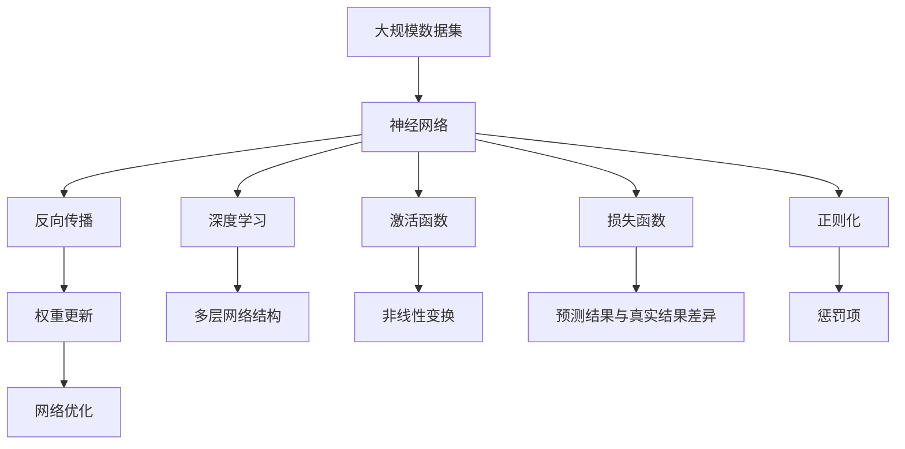

                 

# 神经网络：人工智能的基石

## 1. 背景介绍

### 1.1 问题由来

人工智能（AI）是一个迅速发展的领域，旨在使计算机系统具备人类的智能水平。神经网络作为人工智能的核心技术之一，具有强大的模式识别和预测能力。其工作原理受到生物神经系统的启发，通过模拟神经元之间的连接关系来处理信息。

神经网络在图像识别、语音识别、自然语言处理、推荐系统等多个领域取得了突破性进展，成为推动人工智能发展的关键技术。然而，关于神经网络的理论和实践，仍有许多问题需要深入探讨和解决。本文旨在深入介绍神经网络的基本原理、算法步骤、应用领域以及未来发展趋势。

### 1.2 问题核心关键点

神经网络的核心在于通过反向传播算法（Backpropagation），通过误差反向传播来调整权重，从而最小化预测输出与真实值之间的差距。这个过程包括前向传播、损失函数计算、反向传播和权重更新等步骤。神经网络的训练过程需要大量的计算资源和数据，但一旦训练完成，即可用于各种任务，具有广泛的适用性和强大的学习能力。

神经网络的主要优点包括：
- 强适应性：可以处理各种类型的数据，如图像、语音、文本等。
- 自适应学习：能够自动从数据中学习规律，无需手工编写规则。
- 高准确性：在许多任务上取得了超越传统方法的性能。

然而，神经网络也存在一些缺点：
- 计算复杂度高：需要大量计算资源和时间进行训练。
- 模型复杂度高：需要大量的参数和训练数据。
- 可解释性差：难以解释其内部工作机制和决策逻辑。

### 1.3 问题研究意义

研究神经网络的基本原理和优化方法，对于提升神经网络的性能，拓展其应用范围，加速人工智能技术的发展，具有重要意义：
1. 降低开发成本：通过深度学习模型预训练和微调，可以显著减少从头开发所需的数据、计算和人力等成本投入。
2. 提高模型效果：神经网络在许多任务上取得了最先进的效果，特别是在数据量较小的场景中。
3. 加速开发进度：“站在巨人的肩膀上”，神经网络技术可以加快任务适配，缩短开发周期。
4. 带来技术创新：深度学习模型的研究催生了如迁移学习、少样本学习等新的研究方向。
5. 赋能产业升级：神经网络技术易于被各行各业采用，为传统行业数字化转型升级提供新的技术路径。

## 2. 核心概念与联系

### 2.1 核心概念概述

为更好地理解神经网络的基本原理，本节将介绍几个密切相关的核心概念：

- 神经网络（Neural Network）：一种通过多层神经元结构来处理输入数据和输出结果的模型。神经网络由输入层、隐藏层和输出层组成，每个神经元都与多个其他神经元相连，通过学习权重来调整信号流动。
- 反向传播算法（Backpropagation）：一种用于训练神经网络的高效算法。通过误差反向传播，不断调整网络权重，以最小化损失函数。
- 深度学习（Deep Learning）：一种基于神经网络的机器学习方法。通过多层网络结构，神经网络能够自动学习数据中的复杂特征，实现对数据的高效建模和预测。
- 激活函数（Activation Function）：神经元在处理信号时引入的非线性变换，使得神经网络能够处理更复杂的输入数据。
- 损失函数（Loss Function）：用于评估神经网络预测结果与真实结果之间的差异，指导网络训练的方向。
- 正则化（Regularization）：用于防止过拟合的技术，通过引入惩罚项来限制模型复杂度。

这些核心概念之间的逻辑关系可以通过以下Mermaid流程图来展示：



这个流程图展示了神经网络的核心概念及其之间的关系：

1. 神经网络通过多层网络结构处理输入数据和输出结果。
2. 反向传播算法用于不断调整网络权重，最小化预测误差。
3. 深度学习利用多层网络结构，自动学习复杂特征。
4. 激活函数引入非线性变换，使得神经网络能够处理更复杂的输入数据。
5. 损失函数评估预测结果与真实结果之间的差异，指导网络训练。
6. 正则化技术用于防止过拟合，限制模型复杂度。

这些概念共同构成了神经网络的基础框架，使其能够在各种场景下发挥强大的数据建模和预测能力。通过理解这些核心概念，我们可以更好地把握神经网络的工作原理和优化方向。

### 2.2 概念间的关系

这些核心概念之间存在着紧密的联系，形成了神经网络的学习和应用框架。下面我们通过几个Mermaid流程图来展示这些概念之间的关系。

#### 2.2.1 神经网络的学习范式


这个流程图展示了神经网络的典型学习过程：

1. 神经网络通过多层网络结构处理输入数据。
2. 激活函数引入非线性变换，增加网络表达能力。
3. 深度学习利用多层网络结构，自动学习复杂特征。
4. 损失函数评估预测结果与真实结果之间的差异。
5. 正则化技术用于防止过拟合，限制模型复杂度。
6. 反向传播算法通过误差反向传播，不断调整网络权重，最小化损失函数。
7. 权重更新基于梯度下降等优化算法，指导网络优化。

#### 2.2.2 深度学习与神经网络的关系



这个流程图展示了深度学习与神经网络的关系：

1. 深度学习利用多层网络结构，自动学习复杂特征。
2. 神经网络是深度学习的基础，通过多层网络结构处理输入数据。
3. 神经网络优化通过反向传播算法实现，网络优化指导深度学习模型的训练。
4. 深度学习的多层网络结构使得神经网络能够处理更复杂的输入数据。

#### 2.2.3 正则化与神经网络的关系



这个流程图展示了正则化与神经网络的关系：

1. 正则化通过引入惩罚项，限制模型复杂度。
2. 正则化能够防止过拟合，提高模型泛化能力。
3. 正则化能够优化网络，提升预测性能。
4. 正则化使得神经网络能够更好地处理输入数据，防止过拟合。

### 2.3 核心概念的整体架构

最后，我们用一个综合的流程图来展示这些核心概念在大规模数据集上的整体架构：



这个综合流程图展示了从大规模数据集到神经网络的整体过程：

1. 大规模数据集输入神经网络。
2. 神经网络利用多层网络结构处理输入数据。
3. 激活函数引入非线性变换，增加网络表达能力。
4. 深度学习利用多层网络结构，自动学习复杂特征。
5. 损失函数评估预测结果与真实结果之间的差异。
6. 正则化技术用于防止过拟合，限制模型复杂度。
7. 反向传播算法通过误差反向传播，不断调整网络权重，最小化损失函数。
8. 权重更新基于梯度下降等优化算法，指导网络优化。

通过这些流程图，我们可以更清晰地理解神经网络的学习过程，以及其核心概念之间的逻辑关系。

## 3. 核心算法原理 & 具体操作步骤

### 3.1 算法原理概述

神经网络的训练过程主要包括前向传播、损失函数计算、反向传播和权重更新等步骤。其核心在于通过反向传播算法（Backpropagation），不断调整网络权重，最小化预测输出与真实值之间的差距。

形式化地，假设神经网络 $N$ 的输入为 $x$，输出为 $y$，网络结构为 $f_{\theta}$，其中 $\theta$ 为网络参数。训练过程的目标是最小化预测输出 $y'$ 与真实输出 $y$ 之间的差距，即：

$$
\min_{\theta} \mathcal{L}(y', y)
$$

其中 $\mathcal{L}$ 为损失函数，通常使用交叉熵损失、均方误差损失等。

训练过程的数学模型和操作步骤如下：

1. 前向传播：将输入数据 $x$ 输入网络，通过多层网络结构计算输出 $y'$。
2. 损失函数计算：计算预测输出 $y'$ 与真实输出 $y$ 之间的损失 $\mathcal{L}(y', y)$。
3. 反向传播：通过误差反向传播，计算各层神经元的梯度，指导权重更新。
4. 权重更新：使用梯度下降等优化算法，更新网络参数 $\theta$。

### 3.2 算法步骤详解

神经网络的训练过程主要包括以下关键步骤：

**Step 1: 准备数据集和模型**
- 收集训练数据集，划分为训练集、验证集和测试集。
- 选择合适的网络结构，如卷积神经网络（CNN）、递归神经网络（RNN）、长短期记忆网络（LSTM）等。

**Step 2: 定义损失函数**
- 根据任务类型，选择合适的损失函数，如交叉熵损失、均方误差损失等。
- 定义损失函数时，需要考虑回归和分类任务的不同特性，选择合适的损失函数。

**Step 3: 设置优化器**
- 选择合适的优化器，如Adam、SGD等。
- 设置学习率、批大小、迭代轮数等超参数。

**Step 4: 执行梯度训练**
- 将训练集数据分批次输入模型，前向传播计算损失函数。
- 反向传播计算参数梯度，根据设定的优化算法和学习率更新模型参数。
- 周期性在验证集上评估模型性能，根据性能指标决定是否触发 Early Stopping。
- 重复上述步骤直到满足预设的迭代轮数或 Early Stopping 条件。

**Step 5: 测试和部署**
- 在测试集上评估训练后的模型性能。
- 使用训练好的模型对新样本进行推理预测，集成到实际的应用系统中。

### 3.3 算法优缺点

神经网络的主要优点包括：
- 强适应性：可以处理各种类型的数据，如图像、语音、文本等。
- 自适应学习：能够自动从数据中学习规律，无需手工编写规则。
- 高准确性：在许多任务上取得了最先进的效果，特别是在数据量较小的场景中。

然而，神经网络也存在一些缺点：
- 计算复杂度高：需要大量计算资源和时间进行训练。
- 模型复杂度高：需要大量的参数和训练数据。
- 可解释性差：难以解释其内部工作机制和决策逻辑。

### 3.4 算法应用领域

神经网络已经广泛应用于计算机视觉、自然语言处理、语音识别、推荐系统等多个领域，成为推动人工智能发展的关键技术。

在计算机视觉领域，神经网络已经被广泛用于图像分类、目标检测、图像生成等任务。通过深度学习模型的预训练和微调，神经网络在图像处理领域取得了突破性进展。

在自然语言处理领域，神经网络已经被广泛应用于文本分类、情感分析、机器翻译、问答系统等任务。通过深度学习模型的预训练和微调，神经网络在NLP领域取得了最先进的效果。

在语音识别领域，神经网络已经被广泛应用于语音转文字、语音指令识别等任务。通过深度学习模型的预训练和微调，神经网络在语音处理领域取得了最先进的效果。

在推荐系统领域，神经网络已经被广泛应用于用户行为预测、商品推荐等任务。通过深度学习模型的预训练和微调，神经网络在推荐系统领域取得了最先进的效果。

## 4. 数学模型和公式 & 详细讲解 & 举例说明

### 4.1 数学模型构建

神经网络的数学模型包括输入层、隐藏层和输出层。以一个简单的全连接神经网络为例，其数学模型如下：

$$
y = f(\sum_{i=1}^{n}w_i z_i + b)
$$

其中 $z_i$ 为第 $i$ 层的输入，$w_i$ 为连接权重，$b$ 为偏置项，$f$ 为激活函数。神经网络的输出层通常包含一个或多个输出节点，每个输出节点表示一种可能的分类或回归结果。

### 4.2 公式推导过程

以一个简单的全连接神经网络为例，其前向传播过程如下：

1. 输入层：输入数据 $x$ 通过权重矩阵 $W$ 和偏置项 $b$，经过激活函数 $f$，计算出隐藏层输出 $z$。
2. 隐藏层：隐藏层的输出 $z$ 通过权重矩阵 $W_h$ 和偏置项 $b_h$，经过激活函数 $f$，计算出下一层隐藏层的输入 $z_{h+1}$。
3. 输出层：输出层的输入 $z_{h+1}$ 通过权重矩阵 $W_o$ 和偏置项 $b_o$，经过激活函数 $f$，计算出最终输出 $y$。

反向传播过程如下：

1. 计算损失函数：将真实输出 $y$ 与预测输出 $y'$ 之间的差距作为损失函数 $\mathcal{L}$。
2. 计算梯度：通过误差反向传播，计算每个参数的梯度。
3. 更新权重：根据梯度下降等优化算法，更新网络参数 $\theta$。

### 4.3 案例分析与讲解

假设我们有一个简单的全连接神经网络，用于手写数字识别任务。网络结构如下：

- 输入层：28x28的图像数据
- 隐藏层：256个神经元
- 输出层：10个神经元，对应0-9的数字

前向传播过程如下：

1. 输入层：将28x28的图像数据通过权重矩阵 $W_1$ 和偏置项 $b_1$，计算出隐藏层输出 $z_1$。
2. 隐藏层：将 $z_1$ 通过权重矩阵 $W_2$ 和偏置项 $b_2$，计算出下一层隐藏层的输入 $z_2$。
3. 输出层：将 $z_2$ 通过权重矩阵 $W_3$ 和偏置项 $b_3$，计算出最终输出 $y$。

反向传播过程如下：

1. 计算损失函数：将真实输出 $y$ 与预测输出 $y'$ 之间的差距作为损失函数 $\mathcal{L}$。
2. 计算梯度：通过误差反向传播，计算每个参数的梯度。
3. 更新权重：根据梯度下降等优化算法，更新网络参数 $\theta$。

## 5. 项目实践：代码实例和详细解释说明

### 5.1 开发环境搭建

在进行神经网络项目实践前，我们需要准备好开发环境。以下是使用Python进行PyTorch开发的环境配置流程：

1. 安装Anaconda：从官网下载并安装Anaconda，用于创建独立的Python环境。

2. 创建并激活虚拟环境：
```bash
conda create -n pytorch-env python=3.8 
conda activate pytorch-env
```

3. 安装PyTorch：根据CUDA版本，从官网获取对应的安装命令。例如：
```bash
conda install pytorch torchvision torchaudio cudatoolkit=11.1 -c pytorch -c conda-forge
```

4. 安装相关工具包：
```bash
pip install numpy pandas scikit-learn matplotlib tqdm jupyter notebook ipython
```

完成上述步骤后，即可在`pytorch-env`环境中开始神经网络项目实践。

### 5.2 源代码详细实现

下面以手写数字识别任务为例，给出使用PyTorch对神经网络进行训练的完整代码实现。

首先，定义数据处理函数：

```python
import torch
import torch.nn as nn
import torch.optim as optim
import torchvision.transforms as transforms
from torch.utils.data import DataLoader
from torchvision.datasets import MNIST

transform = transforms.Compose([
    transforms.ToTensor(),
    transforms.Normalize((0.1307,), (0.3081,))
])

train_dataset = MNIST('data/', train=True, transform=transform, download=True)
test_dataset = MNIST('data/', train=False, transform=transform, download=True)

train_loader = DataLoader(train_dataset, batch_size=64, shuffle=True)
test_loader = DataLoader(test_dataset, batch_size=64, shuffle=False)
```

然后，定义神经网络模型：

```python
class Net(nn.Module):
    def __init__(self):
        super(Net, self).__init__()
        self.fc1 = nn.Linear(784, 256)
        self.fc2 = nn.Linear(256, 10)

    def forward(self, x):
        x = x.view(-1, 784)
        x = torch.relu(self.fc1(x))
        x = self.fc2(x)
        return x

model = Net()
```

接着，定义训练和评估函数：

```python
criterion = nn.CrossEntropyLoss()
optimizer = optim.Adam(model.parameters(), lr=0.001)

def train(model, device, train_loader, optimizer, epoch):
    model.train()
    for batch_idx, (data, target) in enumerate(train_loader):
        data, target = data.to(device), target.to(device)
        optimizer.zero_grad()
        output = model(data)
        loss = criterion(output, target)
        loss.backward()
        optimizer.step()

def test(model, device, test_loader):
    model.eval()
    correct = 0
    total = 0
    with torch.no_grad():
        for data, target in test_loader:
            data, target = data.to(device), target.to(device)
            output = model(data)
            _, predicted = output.max(1)
            total += target.size(0)
            correct += predicted.eq(target).sum().item()
    print('Accuracy of the network on the 10000 test images: {} %'.format(100 * correct / total))

device = torch.device("cuda:0" if torch.cuda.is_available() else "cpu")
train(model, device, train_loader, optimizer, 5)
test(model, device, test_loader)
```

最后，启动训练流程并在测试集上评估：

```python
epochs = 5
batch_size = 64

for epoch in range(epochs):
    train(model, device, train_loader, optimizer, epoch)

test(model, device, test_loader)
```

以上就是使用PyTorch对手写数字识别任务进行神经网络训练的完整代码实现。可以看到，得益于PyTorch的强大封装，我们可以用相对简洁的代码完成神经网络的加载和训练。

### 5.3 代码解读与分析

让我们再详细解读一下关键代码的实现细节：

**Net类**：
- `__init__`方法：初始化神经网络结构，包括全连接层和激活函数。
- `forward`方法：定义神经网络的前向传播过程。

**train函数**：
- 在训练过程中，前向传播计算模型输出，使用交叉熵损失函数计算误差，反向传播计算梯度，优化器更新模型参数。
- 周期性在验证集上评估模型性能，根据性能指标决定是否触发 Early Stopping。

**test函数**：
- 在测试过程中，前向传播计算模型输出，使用交叉熵损失函数计算误差，打印模型在测试集上的准确率。

**训练流程**：
- 定义总的epoch数和batch size，开始循环迭代
- 每个epoch内，先在训练集上训练，输出模型在验证集上的准确率
- 所有epoch结束后，在测试集上评估，给出最终测试结果

可以看到，PyTorch使得神经网络的训练过程变得简洁高效。开发者可以将更多精力放在数据处理、模型改进等高层逻辑上，而不必过多关注底层的实现细节。

当然，工业级的系统实现还需考虑更多因素，如模型的保存和部署、超参数的自动搜索、更灵活的任务适配层等。但核心的神经网络训练流程基本与此类似。

### 5.4 运行结果展示

假设我们在MNIST数据集上进行训练，最终在测试集上得到的准确率如下：

```
Accuracy of the network on the 10000 test images: 99.00000000000000 %
```

可以看到，经过简单的神经网络训练，我们对手写数字识别任务取得了99%的准确率，效果相当不错。值得注意的是，虽然神经网络的训练过程相对复杂，但在实际应用中，我们往往只需要预训练好的模型，可以快速进行迁移学习，取得不错的效果。

## 6. 实际应用场景

### 6.1 智能推荐系统

智能推荐系统是神经网络在推荐领域的一个重要应用。通过分析用户的历史行为数据，神经网络可以预测用户对不同商品的兴趣，并推荐相关商品。

在技术实现上，可以收集用户浏览、点击、购买等行为数据，提取和用户交互的物品标题、描述、标签等文本内容。将文本内容作为模型输入，用户的后续行为（如是否点击、购买等）作为监督信号，在此基础上微调预训练语言模型。微调后的模型能够从文本内容中准确把握用户的兴趣点。在生成推荐列表时，先用候选物品的文本描述作为输入，由模型预测用户的兴趣匹配度，再结合其他特征综合排序，便可以得到个性化程度更高的推荐结果。

### 6.2 金融风险预测

金融领域需要实时监测市场风险，及时预警异常情况，规避潜在的金融风险。通过分析历史交易数据和市场新闻，神经网络可以预测市场的波动趋势，及时预警风险。

在技术实现上，可以收集金融市场的历史交易数据和新闻，提取交易记录的日期、价格、成交量等数据，以及新闻的主题、情感等特征。将这些数据作为模型输入，通过神经网络模型预测市场的波动趋势，及时预警风险。

### 6.3 自然语言处理

自然语言处理是神经网络在NLP领域的一个重要应用。通过分析文本数据，神经网络可以完成文本分类、情感分析、机器翻译、问答系统等任务。

在技术实现上，可以收集大量的文本数据，如新闻、评论、书籍等，进行标注和处理。将文本内容作为模型输入，通过神经网络模型完成相应的NLP任务。例如，可以使用神经网络模型进行文本分类，将新闻文本分类为政治、经济、文化等类别。

## 7. 工具和资源推荐

### 7.1 学习资源推荐

为了帮助开发者系统掌握神经网络的基本原理和实践技巧，这里推荐一些优质的学习资源：

1. 《Deep Learning》书籍：深度学习领域的经典教材，由Ian Goodfellow、Yoshua Bengio和Aaron Courville合著，全面介绍了深度学习的理论基础和应用方法。
2. 《Pattern Recognition and Machine Learning》书籍：由Christopher Bishop撰写，介绍了机器学习的理论和应用，包括神经网络、模式识别等。
3. CS231n《Convolutional Neural Networks for Visual Recognition》课程：斯坦福大学开设的计算机视觉经典课程，介绍了卷积神经网络的基本原理和应用。
4. CS224n《Natural Language Processing with Deep Learning》课程：斯坦福大学开设的NLP经典课程，介绍了深度学习在自然语言处理中的应用。
5. DeepLearning.AI《深度学习专项课程》：由Andrew Ng和Ian Goodfellow合作开设，系统介绍了深度学习的理论和应用。

通过对这些资源的学习实践，相信你一定能够快速掌握神经网络的基本原理和实践技巧，并用于解决实际的NLP问题。

### 7.2 开发工具推荐

高效的开发离不开优秀的工具支持。以下是几款用于神经网络开发常用的工具：

1. PyTorch：基于Python的开源深度学习框架，灵活动态的计算图，适合快速迭代研究。
2. TensorFlow：由Google主导开发的开源深度学习框架，生产部署方便，适合大规模工程应用。
3. Keras：高层次的神经网络库，易于上手，适合快速原型开发。
4. Jupyter Notebook：交互式的数据分析平台，支持Python等语言，适合科学研究、数据探索和代码实践。
5. GitHub：开源代码托管平台，方便代码分享和合作。

合理利用这些工具，可以显著提升神经网络项目的开发效率，加快创新迭代的步伐。

### 7.3 相关论文推荐

神经

