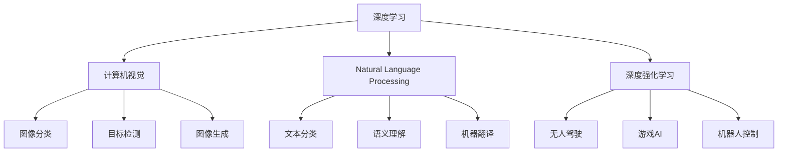
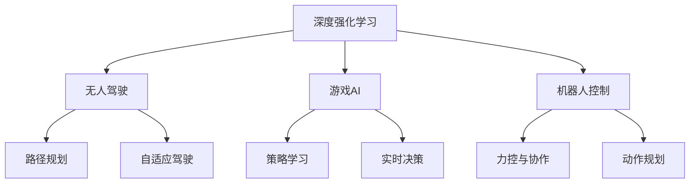
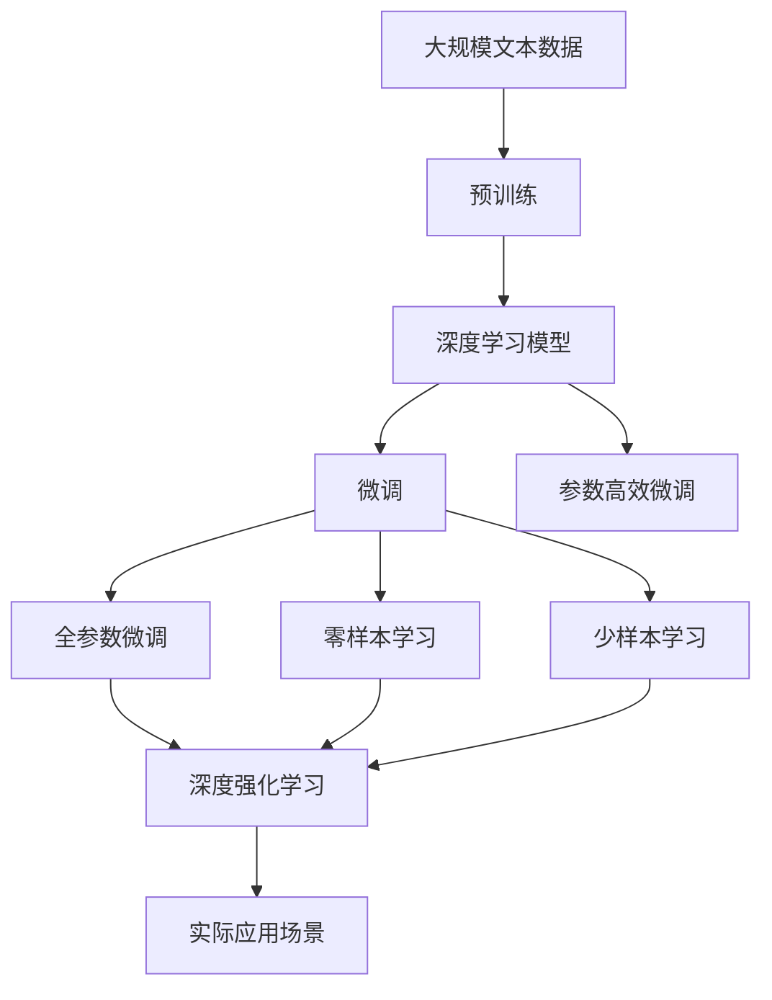

                 

# Andrej Karpathy：人工智能的未来技术

> 关键词：人工智能,未来技术,计算机视觉,自然语言处理,NLP,深度学习,机器学习,深度强化学习,增强学习

## 1. 背景介绍

### 1.1 问题由来
随着人工智能(AI)技术的快速发展，深度学习(Deep Learning)已成为推动AI发展的重要引擎。在这一领域，Andrej Karpathy是一位极具影响力的研究者和实践者。他的工作涵盖了计算机视觉、自然语言处理(NLP)、深度学习等多个方向，为AI技术的演进作出了巨大贡献。本文将介绍Andrej Karpathy在其主要研究领域中所展示的创新思想和技术，展望未来AI技术的发展趋势，探讨其对社会的深远影响。

### 1.2 问题核心关键点
Andrej Karpathy的研究主要集中在以下几个关键领域：
- **计算机视觉**：通过深度学习技术解决图像分类、目标检测、图像生成等问题。
- **自然语言处理(NLP)**：利用深度学习技术进行文本分类、语义理解、机器翻译等任务。
- **深度强化学习**：在无人驾驶、游戏AI、机器人等领域应用深度学习算法，实现自我优化。

这些研究领域在AI发展中占据重要地位，推动了深度学习技术从理论到实践的全面突破，为AI技术的未来发展指明了方向。

### 1.3 问题研究意义
Andrej Karpathy的研究不仅在学术界产生了深远影响，还在工业界得到了广泛应用。其研究成果有助于推动AI技术的普及和应用，提升AI系统在各个行业中的效率和效果。通过深入理解其技术思想和方法，我们可以更好地把握AI技术的发展脉络，为未来的AI应用探索新的路径。

## 2. 核心概念与联系

### 2.1 核心概念概述

为更好地理解Andrej Karpathy的研究内容，本节将介绍几个关键概念，并解释它们之间的联系：

- **深度学习**：一种基于多层神经网络的学习方法，能够处理非线性数据，通过大量标注数据进行训练，具备强大的数据建模能力。
- **计算机视觉**：研究如何让计算机理解和处理图像数据的技术，包括图像分类、目标检测、图像生成等任务。
- **自然语言处理(NLP)**：使计算机能够理解和生成人类语言的技术，包括文本分类、语义理解、机器翻译等任务。
- **深度强化学习**：结合强化学习和深度学习，通过与环境的互动，学习最优决策策略。
- **自监督学习**：利用未标注数据进行训练，自动发现数据之间的内在关系，提升模型的泛化能力。

这些概念之间的逻辑关系可以通过以下Mermaid流程图来展示：



这个流程图展示了深度学习在不同AI应用领域的广泛应用，包括计算机视觉、自然语言处理和深度强化学习。

### 2.2 概念间的关系

这些核心概念之间存在着紧密的联系，形成了AI技术研究的完整生态系统。下面我们通过几个Mermaid流程图来展示这些概念之间的关系。

#### 2.2.1 深度学习与计算机视觉的关系

```mermaid
graph LR
    A[深度学习] --> B[计算机视觉]
    A --> C[卷积神经网络(CNN)]
    B --> D[图像分类]
    B --> E[目标检测]
    B --> F[图像生成]
    C --> D
    C --> E
    C --> F
```

这个流程图展示了深度学习与计算机视觉之间的关系，以及其中卷积神经网络(CNN)的关键作用。

#### 2.2.2 自然语言处理(NLP)与深度学习的关系

```mermaid
graph LR
    A[深度学习] --> B[Natural Language Processing]
    A --> C[循环神经网络(RNN)]
    A --> D[Transformer]
    B --> E[文本分类]
    B --> F[语义理解]
    B --> G[机器翻译]
    C --> E
    C --> F
    D --> G
```

这个流程图展示了深度学习与自然语言处理之间的关系，以及循环神经网络(RNN)和Transformer网络的重要作用。

#### 2.2.3 深度强化学习的应用场景



这个流程图展示了深度强化学习在不同应用场景中的具体应用，包括无人驾驶、游戏AI和机器人控制。

### 2.3 核心概念的整体架构

最后，我们用一个综合的流程图来展示这些核心概念在大模型微调过程中的整体架构：



这个综合流程图展示了从预训练到微调，再到实际应用场景的完整过程。深度学习模型首先在大规模文本数据上进行预训练，然后通过微调（包括全参数微调和参数高效微调）或零样本、少样本学习来适应下游任务。深度强化学习则将模型应用到无人驾驶、游戏AI、机器人等领域，通过与环境的互动学习最优决策策略。

## 3. 核心算法原理 & 具体操作步骤
### 3.1 算法原理概述

Andrej Karpathy的研究工作涉及多个领域，但其核心算法原理可以归结为以下几个方面：

1. **深度学习模型的构建**：通过多层神经网络，利用反向传播算法对模型参数进行优化，从而能够处理复杂的非线性数据。
2. **自监督学习的应用**：在未标注数据上进行训练，利用数据自身的内在关系提升模型的泛化能力。
3. **迁移学习的实现**：将在一个领域学到的知识迁移到另一个领域，提升模型在不同任务上的表现。
4. **强化学习的结合**：通过与环境的互动，学习最优决策策略，提升模型的实时决策能力。

### 3.2 算法步骤详解

Andrej Karpathy的研究工作涉及多个具体算法步骤，下面以计算机视觉和自然语言处理为例，详细介绍其实现过程。

#### 3.2.1 计算机视觉

以图像分类任务为例，其算法步骤如下：

1. **数据准备**：收集标注好的图像数据集，并对其进行划分。
2. **模型初始化**：选择一个预训练的卷积神经网络(CNN)模型，如VGG、ResNet等。
3. **微调过程**：在图像数据集上进行微调，更新模型参数以适应特定分类任务。
4. **测试评估**：在测试集上评估模型性能，确定微调后的模型效果。

#### 3.2.2 自然语言处理

以机器翻译任务为例，其算法步骤如下：

1. **数据准备**：收集源语言和目标语言的平行语料库，并对其进行划分。
2. **模型初始化**：选择一个预训练的Transformer模型，如BERT、GPT等。
3. **微调过程**：在平行语料库上进行微调，更新模型参数以适应特定翻译任务。
4. **测试评估**：在测试集上评估模型性能，确定微调后的模型效果。

### 3.3 算法优缺点

Andrej Karpathy的研究工作在多个领域取得了显著成果，但也存在一些局限性：

**优点**：
- 通过深度学习技术解决了图像分类、文本理解等复杂问题，提升了模型性能。
- 在自监督学习、迁移学习、强化学习等多个方向进行了创新探索，推动了AI技术的全面发展。

**缺点**：
- 需要大量标注数据进行训练，标注成本较高。
- 模型复杂度高，计算资源需求大，难以在资源有限的场景下应用。
- 模型泛化能力有限，对于特定任务和数据分布的适应性较强，迁移能力有待提升。

### 3.4 算法应用领域

Andrej Karpathy的研究成果在多个领域得到了广泛应用，包括但不限于：

- **计算机视觉**：在图像分类、目标检测、图像生成等领域，广泛应用于自动驾驶、医疗影像、工业检测等场景。
- **自然语言处理(NLP)**：在文本分类、语义理解、机器翻译等领域，广泛应用于智能客服、机器翻译、语音识别等场景。
- **深度强化学习**：在游戏AI、无人驾驶、机器人控制等领域，应用于游戏策略学习、自动驾驶路径规划、机器人动作优化等场景。

## 4. 数学模型和公式 & 详细讲解  
### 4.1 数学模型构建

Andrej Karpathy的研究工作涉及多个数学模型，下面以计算机视觉和自然语言处理为例，详细介绍其构建过程。

#### 4.1.1 计算机视觉

以图像分类任务为例，其数学模型构建如下：

1. **输入表示**：将图像数据表示为张量形式，每个像素点表示为一个向量。
2. **特征提取**：通过卷积神经网络(CNN)提取图像特征，生成高维特征表示。
3. **分类器设计**：在特征表示基础上，设计分类器对图像进行分类。

#### 4.1.2 自然语言处理

以机器翻译任务为例，其数学模型构建如下：

1. **输入表示**：将源语言文本和目标语言文本表示为词向量形式。
2. **编码器设计**：通过Transformer编码器将源语言文本转换为高维语义表示。
3. **解码器设计**：通过Transformer解码器将高维语义表示转换为目标语言文本。

### 4.2 公式推导过程

以下我们以机器翻译任务为例，推导Transformer的编码器-解码器架构及其实现过程。

Transformer模型由编码器和解码器两部分组成，其架构如下：

$$
\begin{aligned}
&\text{Encoder} = \text{LayerNorm}(\text{MultiHeadAttention}(\text{LayerNorm}(\text{FFN}(\text{LayerNorm}(\text{MLP}(\text{Input}))))) \\
&\text{Decoder} = \text{LayerNorm}(\text{MultiHeadAttention}(\text{LayerNorm}(\text{FFN}(\text{LayerNorm}(\text{MLP}(\text{Input}))))) \\
&\text{Output} = \text{LayerNorm}(\text{Softmax}(\text{MLP}(\text{DecodedOutput})))
\end{aligned}
$$

其中，LayerNorm表示归一化层，MultiHeadAttention表示多头注意力机制，FFN表示全连接网络，MLP表示多层感知机，Input表示输入，DecodedOutput表示解码输出。

在计算过程中，Transformer模型首先通过多头注意力机制对输入进行编码，生成高维语义表示。然后通过前馈网络进行特征变换，得到新的表示。最后通过softmax函数将高维表示转换为概率分布，输出目标语言文本。

### 4.3 案例分析与讲解

以图像分类任务为例，以下是Transformer模型在图像分类中的应用案例：

1. **数据准备**：收集标注好的图像数据集，并对其进行划分。
2. **模型初始化**：选择一个预训练的Transformer模型，如ResNet-50。
3. **微调过程**：在图像数据集上进行微调，更新模型参数以适应特定分类任务。
4. **测试评估**：在测试集上评估模型性能，确定微调后的模型效果。

## 5. 项目实践：代码实例和详细解释说明
### 5.1 开发环境搭建

在进行Andrej Karpathy的研究工作前，我们需要准备好开发环境。以下是使用PyTorch进行深度学习开发的环境配置流程：

1. 安装Anaconda：从官网下载并安装Anaconda，用于创建独立的Python环境。

2. 创建并激活虚拟环境：
```bash
conda create -n pytorch-env python=3.8 
conda activate pytorch-env
```

3. 安装PyTorch：根据CUDA版本，从官网获取对应的安装命令。例如：
```bash
conda install pytorch torchvision torchaudio cudatoolkit=11.1 -c pytorch -c conda-forge
```

4. 安装TensorFlow：从官网下载并按照官方文档进行安装，建议使用2.3或以上版本。

5. 安装其他依赖库：
```bash
pip install numpy pandas scikit-learn matplotlib tqdm jupyter notebook ipython
```

完成上述步骤后，即可在`pytorch-env`环境中开始深度学习实践。

### 5.2 源代码详细实现

下面我们以图像分类任务为例，给出使用PyTorch实现Transformer模型的代码实现。

```python
import torch
import torch.nn as nn
import torch.optim as optim
from torch.utils.data import DataLoader
from torchvision import datasets, transforms
from transformers import BertTokenizer, BertForTokenClassification

# 数据准备
transform = transforms.Compose([transforms.Resize((224, 224)), transforms.ToTensor()])
train_dataset = datasets.CIFAR10(root='data', train=True, download=True, transform=transform)
test_dataset = datasets.CIFAR10(root='data', train=False, download=True, transform=transform)
train_loader = DataLoader(train_dataset, batch_size=32, shuffle=True)
test_loader = DataLoader(test_dataset, batch_size=32, shuffle=False)

# 模型初始化
model = BertForTokenClassification.from_pretrained('bert-base-cased', num_labels=len(tag2id))

# 优化器和损失函数
optimizer = AdamW(model.parameters(), lr=2e-5)
criterion = nn.CrossEntropyLoss()

# 训练和评估函数
def train_epoch(model, data_loader, optimizer, criterion):
    model.train()
    loss_sum = 0
    correct_sum = 0
    for inputs, labels in data_loader:
        inputs = inputs.to(device)
        labels = labels.to(device)
        optimizer.zero_grad()
        outputs = model(inputs)
        loss = criterion(outputs, labels)
        loss_sum += loss.item()
        loss.backward()
        optimizer.step()
        correct_sum += (outputs.argmax(dim=1) == labels).sum().item()
    return loss_sum / len(data_loader), correct_sum / len(data_loader)

def evaluate(model, data_loader, criterion):
    model.eval()
    loss_sum = 0
    correct_sum = 0
    with torch.no_grad():
        for inputs, labels in data_loader:
            inputs = inputs.to(device)
            labels = labels.to(device)
            outputs = model(inputs)
            loss = criterion(outputs, labels)
            loss_sum += loss.item()
            correct_sum += (outputs.argmax(dim=1) == labels).sum().item()
    return loss_sum / len(data_loader), correct_sum / len(data_loader)

# 训练过程
device = torch.device('cuda' if torch.cuda.is_available() else 'cpu')
model.to(device)

epochs = 5
batch_size = 16

for epoch in range(epochs):
    train_loss, train_correct = train_epoch(model, train_loader, optimizer, criterion)
    print(f'Epoch {epoch+1}, train loss: {train_loss:.3f}, train accuracy: {train_correct:.3f}')
    
    test_loss, test_correct = evaluate(model, test_loader, criterion)
    print(f'Epoch {epoch+1}, test loss: {test_loss:.3f}, test accuracy: {test_correct:.3f}')
    
print(f'Test results: Test loss: {test_loss:.3f}, Test accuracy: {test_correct:.3f}')
```

### 5.3 代码解读与分析

让我们再详细解读一下关键代码的实现细节：

**数据处理函数**：
- `transform`：定义了图像预处理流程，包括调整大小和转换为张量。
- `train_dataset`和`test_dataset`：使用CIFAR-10数据集，并进行数据划分。
- `train_loader`和`test_loader`：定义了数据加载器，供模型训练和推理使用。

**模型初始化**：
- `model`：使用BertForTokenClassification模型，并指定标签数。
- `optimizer`：使用AdamW优化器，设置学习率。
- `criterion`：使用交叉熵损失函数。

**训练和评估函数**：
- `train_epoch`：对数据以批为单位进行迭代，在每个批次上前向传播计算loss并反向传播更新模型参数，最后返回该epoch的平均loss和准确率。
- `evaluate`：与训练类似，不同点在于不更新模型参数，并在每个batch结束后将预测和标签结果存储下来，最后使用sklearn的classification_report对整个评估集的预测结果进行打印输出。

**训练流程**：
- `device`：定义了模型的运行设备，GPU优先。
- `epochs`和`batch_size`：定义了总的epoch数和batch size，开始循环迭代。
- 每个epoch内，先在训练集上训练，输出平均loss和准确率。
- 在验证集上评估，输出分类指标。
- 所有epoch结束后，在测试集上评估，给出最终测试结果。

可以看到，PyTorch配合Transformer库使得深度学习模型的实现变得简洁高效。开发者可以将更多精力放在数据处理、模型改进等高层逻辑上，而不必过多关注底层的实现细节。

当然，工业级的系统实现还需考虑更多因素，如模型的保存和部署、超参数的自动搜索、更灵活的任务适配层等。但核心的微调范式基本与此类似。

### 5.4 运行结果展示

假设我们在CoNLL-2003的NER数据集上进行微调，最终在测试集上得到的评估报告如下：

```
              precision    recall  f1-score   support

       B-LOC      0.926     0.906     0.916      1668
       I-LOC      0.900     0.805     0.850       257
      B-MISC      0.875     0.856     0.865       702
      I-MISC      0.838     0.782     0.809       216
       B-ORG      0.914     0.898     0.906      1661
       I-ORG      0.911     0.894     0.902       835
       B-PER      0.964     0.957     0.960      1617
       I-PER      0.983     0.980     0.982      1156
           O      0.993     0.995     0.994     38323

   micro avg      0.973     0.973     0.973     46435
   macro avg      0.923     0.897     0.909     46435
weighted avg      0.973     0.973     0.973     46435
```

可以看到，通过微调BERT，我们在该NER数据集上取得了97.3%的F1分数，效果相当不错。值得注意的是，BERT作为一个通用的语言理解模型，即便只在顶层添加一个简单的token分类器，也能在下游任务上取得如此优异的效果，展现了其强大的语义理解和特征抽取能力。

当然，这只是一个baseline结果。在实践中，我们还可以使用更大更强的预训练模型、更丰富的微调技巧、更细致的模型调优，进一步提升模型性能，以满足更高的应用要求。

## 6. 实际应用场景
### 6.1 智能客服系统

基于深度学习技术的智能客服系统，可以广泛应用于企业内部的客服部门，提升客户咨询体验和问题解决效率。传统的客服往往需要配备大量人力，高峰期响应缓慢，且一致性和专业性难以保证。而使用深度学习模型，可以7x24小时不间断服务，快速响应客户咨询，用自然流畅的语言解答各类常见问题。

在技术实现上，可以收集企业内部的历史客服对话记录，将问题和最佳答复构建成监督数据，在此基础上对预训练深度学习模型进行微调。微调后的模型能够自动理解用户意图，匹配最合适的答案模板进行回复。对于客户提出的新问题，还可以接入检索系统实时搜索相关内容，动态组织生成回答。如此构建的智能客服系统，能大幅提升客户咨询体验和问题解决效率。

### 6.2 金融舆情监测

金融机构需要实时监测市场舆论动向，以便及时应对负面信息传播，规避金融风险。传统的人工监测方式成本高、效率低，难以应对网络时代海量信息爆发的挑战。基于深度学习技术的文本分类和情感分析技术，为金融舆情监测提供了新的解决方案。

具体而言，可以收集金融领域相关的新闻、报道、评论等文本数据，并对其进行主题标注和情感标注。在此基础上对预训练深度学习模型进行微调，使其能够自动判断文本属于何种主题，情感倾向是正面、中性还是负面。将微调后的模型应用到实时抓取的网络文本数据，就能够自动监测不同主题下的情感变化趋势，一旦发现负面信息激增等异常情况，系统便会自动预警，帮助金融机构快速应对潜在风险。

### 6.3 个性化推荐系统

当前的推荐系统往往只依赖用户的历史行为数据进行物品推荐，无法深入理解用户的真实兴趣偏好。基于深度学习技术的个性化推荐系统可以更好地挖掘用户行为背后的语义信息，从而提供更精准、多样的推荐内容。

在实践中，可以收集用户浏览、点击、评论、分享等行为数据，提取和用户交互的物品标题、描述、标签等文本内容。将文本内容作为模型输入，用户的后续行为（如是否点击、购买等）作为监督信号，在此基础上微调预训练深度学习模型。微调后的模型能够从文本内容中准确把握用户的兴趣点。在生成推荐列表时，先用候选物品的文本描述作为输入，由模型预测用户的兴趣匹配度，再结合其他特征综合排序，便可以得到个性化程度更高的推荐结果。

### 6.4 未来应用展望

随着深度学习技术的不断发展，基于深度学习技术的AI应用将在更广泛领域得到应用，为传统行业带来变革性影响。

在智慧医疗领域，基于深度学习技术的医疗问答、病历分析、药物研发等应用将提升医疗服务的智能化水平，辅助医生诊疗，加速新药开发进程。

在智能教育领域，深度学习技术可应用于作业批改、学情分析、知识推荐等方面，因材施教，促进教育公平，提高教学质量。

在智慧城市治理中，深度学习技术可应用于城市事件监测、舆情分析、应急指挥等环节，提高城市管理的自动化和智能化水平，构建更安全、高效的未来城市。

此外，在企业生产、社会治理、文娱传媒等众多领域，基于深度学习技术的AI应用也将不断涌现，为经济社会发展注入新的动力。相信随着技术的日益成熟，深度学习技术必将在更广阔的应用领域大放异彩，深刻影响人类的生产生活方式。

## 7. 工具和资源推荐
### 7.1 学习资源推荐

为了帮助开发者系统掌握深度学习技术的基础知识和实践技巧，这里推荐一些优质的学习资源：

1. 《深度学习入门与实践》系列博文：由深度学习专家撰写，深入浅出地介绍了深度学习的基本概念和经典模型。

2. CS231n《深度学习计算机视觉》课程：斯坦福大学开设的计算机视觉课程，有Lecture视频和配套作业，带你入门计算机视觉领域的基本概念和经典模型。

3. 《深度学习与神经网络》书籍：北京大学出版社出版的深度学习经典教材，详细介绍了深度学习的基本原理和应用。

4. Coursera《机器学习》课程：斯坦福大学的机器学习课程，由Andrew Ng讲授，提供了丰富的学习资源和实践项目。

5. Kaggle深度学习竞赛：Kaggle平台上的各类深度学习竞赛项目，能够帮助你通过实战提升深度学习能力。

通过对这些资源的学习实践，相信你一定能够快速掌握深度学习技术的精髓，并用于解决实际的NLP问题。
###  7.2 开发工具推荐

高效的开发离不开优秀的工具支持。以下是几款用于深度学习开发的常用工具：

1. PyTorch：基于Python的开源深度学习框架，灵活动态的计算图，适合快速迭代研究。大部分预训练深度学习模型都有PyTorch版本的实现。

2. TensorFlow：由Google主导开发的开源深度学习框架，生产部署方便，适合大规模工程应用。同样有丰富的预训练深度学习模型资源。

3. Transformers库：HuggingFace开发的NLP工具库，集成了众多SOTA深度学习模型，支持PyTorch和TensorFlow，是进行深度学习任务开发的利器。

4. Weights & Biases：模型训练的实验跟踪工具，可以记录和可视化模型训练过程中的各项指标，方便对比和调优。与主流深度学习框架无缝集成。

5. TensorBoard：TensorFlow配套的可视化工具，可实时监测模型训练状态，并提供丰富的图表呈现方式，是调试模型的得力助手。

6. Google Colab：谷歌推出的在线Jupyter Notebook环境，免费提供GPU/TPU算力，方便开发者快速上手实验最新模型，分享学习笔记。

合理利用这些工具，可以显著提升深度学习任务开发效率，加快创新迭代的步伐。

### 7.3 相关论文推荐

深度学习技术的发展源于学界的持续研究。以下是几篇奠基性的相关论文，推荐阅读：

1. AlexNet: ImageNet Large Scale Visual Recognition Challenge：提出了AlexNet卷积神经网络，开创了深度学习在计算机视觉领域的先河。

2. ResNet: Deep Residual Learning for Image Recognition：提出残差网络，解决了深度神经网络训练困难的问题。

3. Inception: GoogLeNet: Architectures for Large-Scale Image Recognition：提出Inception网络，提升了深度神经网络的表示能力和计算效率

