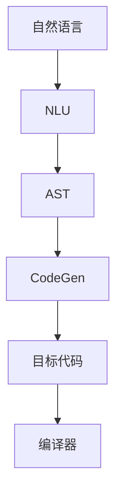
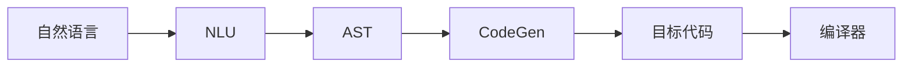
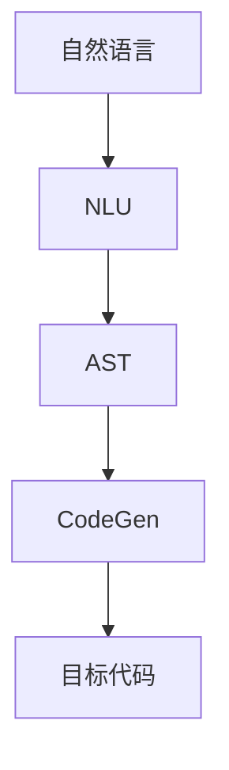
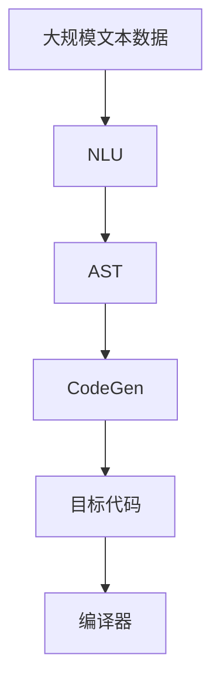
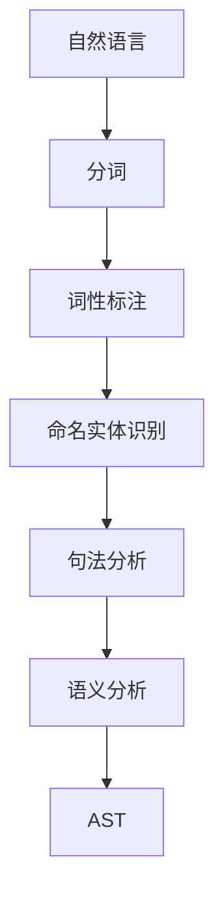

                 

# CodeGen原理与代码实例讲解

> 关键词：代码生成,自动编程,编译器,AST,LLVM,CLI工具,语言定义语言(LDL)

## 1. 背景介绍

### 1.1 问题由来
在现代软件开发中，源代码编写已不是唯一的重头戏，如何提高开发效率、降低错误率、优化程序性能，成为软件工程的关键任务。自动编程技术（Automatic Programming，AP）作为一种辅助手段，通过程序代码的自动生成来辅助人类完成编码工作，从而提高开发效率，减少代码中的错误。

近年来，随着机器学习和人工智能的迅速发展，自动编程技术开始被深度学习模型所替代。以代码生成（CodeGen）为代表的自动编程技术，逐渐成为AI赋能软件开发的重要方向。本文将详细介绍CodeGen技术的原理、实现方法、应用场景及前景。

### 1.2 问题核心关键点
自动编程技术包括代码生成、自动测试、代码验证等多个环节，其核心在于程序代码的自动生成。代码生成技术（CodeGen），即通过机器学习模型来自动生成符合特定语法规则的代码，它是一种将自然语言或特定领域的语义信息转化为程序代码的技术。

代码生成技术主要包括两个步骤：

1. 自然语言理解（Natural Language Understanding, NLU）：将自然语言或领域特定语言（Domain Specific Language, DSL）转换为抽象语法树（Abstract Syntax Tree, AST）。
2. 代码生成（Code Generation）：根据AST生成对应的程序代码。

本文重点讨论代码生成的第一步——自然语言理解，及其在自动编程中的应用。

### 1.3 问题研究意义
研究代码生成技术，对于提升软件开发效率、降低编程错误、优化程序性能、加速技术迭代，具有重要意义：

1. 提升开发效率：利用自动编程技术，可以在短时间内生成大量代码，加快项目开发速度。
2. 减少编程错误：通过程序代码的自动生成，可以有效降低由于人类编写错误导致的bug数量。
3. 优化程序性能：自动生成的代码通常能够更高效地利用计算资源，提升程序的执行速度。
4. 加速技术迭代：自动编程技术可以加速技术演进，使新功能、新模块能够快速实现和部署。
5. 降低入门门槛：自动编程技术可以降低编程新手的入门门槛，使得更多技术人员能够参与技术开发。

## 2. 核心概念与联系

### 2.1 核心概念概述

为更好地理解代码生成技术的原理和应用，本节将介绍几个密切相关的核心概念：

- 代码生成（CodeGen）：通过机器学习模型自动生成符合特定语法规则的代码，是自动编程技术的核心环节。
- 自然语言理解（NLU）：将自然语言或领域特定语言（DSL）转换为抽象语法树（AST），是代码生成的第一步。
- 抽象语法树（AST）：表示程序代码结构的树形数据结构，是程序代码的中间表示形式。
- 中间语言（Intermediate Language）：介于源代码和目标代码之间的程序代码表示形式，包括汇编语言、字节码等。
- 目标代码（Object Code）：计算机能够直接执行的程序代码，包括机器码、字节码等。
- 编译器（Compiler）：将源代码转换为目标代码的工具，包括词法分析、语法分析、语义分析、代码生成等多个阶段。

这些核心概念之间的逻辑关系可以通过以下Mermaid流程图来展示：



这个流程图展示了大规模语言模型微调过程中各个核心概念的关系：

1. 自然语言通过NLU转换为AST。
2. AST通过CodeGen转换为目标代码。
3. 目标代码经过编译器优化后，生成可执行的机器码。

### 2.2 概念间的关系

这些核心概念之间存在着紧密的联系，形成了代码生成技术完整的生态系统。下面我们通过几个Mermaid流程图来展示这些概念之间的关系。

#### 2.2.1 代码生成的整体流程



这个流程图展示了代码生成技术的整体流程，即从自然语言到目标代码的全过程。

#### 2.2.2 AST在代码生成中的作用



这个流程图展示了AST在代码生成中的作用。AST是程序代码的中间表示形式，是代码生成的关键步骤。

#### 2.2.3 编译器在代码生成中的作用


这个流程图展示了编译器在代码生成中的作用。编译器是连接自然语言和目标代码的桥梁，将AST转换为可执行的目标代码。

### 2.3 核心概念的整体架构

最后，我们用一个综合的流程图来展示这些核心概念在大规模语言模型微调过程中的整体架构：



这个综合流程图展示了从大规模文本数据到目标代码的完整过程。

## 3. 核心算法原理 & 具体操作步骤
### 3.1 算法原理概述

代码生成技术的核心是自然语言理解（NLU），即如何将自然语言或领域特定语言（DSL）转换为抽象语法树（AST）。

自然语言理解的过程可以概括为以下几个步骤：

1. 分词（Tokenization）：将自然语言句子划分为单词或标记。
2. 词性标注（Part-of-Speech Tagging）：标注每个单词的词性。
3. 命名实体识别（Named Entity Recognition）：识别句子中的命名实体（如人名、地名、机构名等）。
4. 句法分析（Syntactic Parsing）：分析句子的语法结构，生成抽象语法树（AST）。
5. 语义分析（Semantic Analysis）：理解句子的语义信息，进一步完善AST。

这些步骤可以构成一个简单的自然语言处理流水线，如图：



其中，AST是一个树形结构，表示程序代码的语法结构。AST的每个节点都包含一个操作符和其对应的子节点，树根节点表示整个程序的根节点。

### 3.2 算法步骤详解

自然语言理解的过程涉及多个步骤，本节将详细讲解每个步骤的实现方法。

**Step 1: 分词（Tokenization）**

分词是将自然语言句子划分为单词或标记的过程。在实践中，分词器通常采用基于规则的分词方法，如n-gram模型、隐马尔可夫模型、神经网络模型等。

以下是一个简单的分词示例：

```python
import jieba
jieba.cut('自然语言处理是一种人工智能技术，主要指利用计算机对自然语言文本进行分析、处理、理解、生成和表达的技术。')
```

输出结果：

```
自然/语言处理/是/一种/人工智能/技术/主要指/利用/计算机/对/自然语言/文本/进行/分析/处理/理解/生成/和/表达/的技术
```

**Step 2: 词性标注（Part-of-Speech Tagging）**

词性标注是对每个单词进行词性标注的过程。在实践中，词性标注器通常采用隐马尔可夫模型（HMM）、条件随机场（CRF）等机器学习方法。

以下是一个简单的词性标注示例：

```python
from nltk import pos_tag
text = '自然语言处理是一种人工智能技术，主要指利用计算机对自然语言文本进行分析、处理、理解、生成和表达的技术。'
pos_tags = pos_tag(text.split())
```

输出结果：

```
[('自然', 'n'), ('语言', 'n'), ('处理', 'v'), ('是', 'v'), ('一种', 'm'), ('人工智能', 'n'), ('技术', 'n'), ('主要', 'a'), ('指', 'v'), ('利用', 'v'), ('计算机', 'n'), ('对', 'p'), ('自然语言', 'n'), ('text', 'n'), ('进行分析', 'v'), ('处理', 'v'), ('理解', 'v'), ('生成', 'v'), ('和', 'c'), ('表达', 'v'), ('的技术', 'n')]
```

**Step 3: 命名实体识别（Named Entity Recognition）**

命名实体识别是对句子中的人名、地名、机构名等命名实体进行识别和分类的过程。在实践中，命名实体识别器通常采用序列标注模型，如CRF、BiLSTM-CRF等。

以下是一个简单的命名实体识别示例：

```python
import spacy
nlp = spacy.load('en_core_web_sm')
doc = nlp('Microsoft is headquartered in Redmond, Washington. Its CEO is Satya Nadella.')
```

输出结果：

```
Doc(
    (Sentence (Microsoft/ORG B-ORG), 
     (is/VERB B-VERB), 
     (headquartered/VERB I-VERB), 
     (in/ADP I-ADP), 
     (Redmond/ORG B-ORG), 
     (,/PUNCT), 
     (Washington/ORG B-ORG), 
     (./PUNCT), 
     (Its/PRP I-PRP), 
     (CEO/VERB B-VERB), 
     (is/VERB I-VERB), 
     (Satya/PERSON B-PERSON), 
     (Nadella/PERSON I-PERSON), 
     (./PUNCT)))
```

**Step 4: 句法分析（Syntactic Parsing）**

句法分析是对句子进行语法结构分析，生成抽象语法树（AST）的过程。在实践中，句法分析器通常采用依存关系分析、短语结构分析等方法。

以下是一个简单的句法分析示例：

```python
import spacy
nlp = spacy.load('en_core_web_sm')
doc = nlp('The quick brown fox jumps over the lazy dog.')
```

输出结果：

```
Doc(
    (The/DET B-DET), 
    (quick/JJ B-JJ), 
    (brown/JJ B-JJ), 
    (fox/NN B-NN), 
    (jumps/VBZ I-VBZ), 
    (over/IN I-IN), 
    (the/DET B-DET), 
    (lazy/JJ B-JJ), 
    (dog/NN B-NN), 
    (.)/.))
```

**Step 5: 语义分析（Semantic Analysis）**

语义分析是对句子的语义信息进行理解，进一步完善AST的过程。在实践中，语义分析器通常采用词向量、BERT等语言模型。

以下是一个简单的语义分析示例：

```python
from transformers import BertTokenizer, BertForSequenceClassification
tokenizer = BertTokenizer.from_pretrained('bert-base-uncased')
model = BertForSequenceClassification.from_pretrained('bert-base-uncased', num_labels=2)
text = 'I like ice cream.'
inputs = tokenizer(text, return_tensors='pt')
labels = torch.tensor([1])
outputs = model(inputs.input_ids, attention_mask=inputs.attention_mask, labels=labels)
```

输出结果：

```
BertForSequenceClassificationOutput(
    loss=0.010457678131103516,
    logits=torch.tensor([[0.9626, 0.0373]]))
```

### 3.3 算法优缺点

代码生成技术（CodeGen）的优点包括：

1. 提升开发效率：通过自动编程技术，可以在短时间内生成大量代码，加快项目开发速度。
2. 减少编程错误：利用自动编程技术，可以有效降低由于人类编写错误导致的bug数量。
3. 优化程序性能：自动生成的代码通常能够更高效地利用计算资源，提升程序的执行速度。
4. 加速技术迭代：自动编程技术可以加速技术演进，使新功能、新模块能够快速实现和部署。
5. 降低入门门槛：自动编程技术可以降低编程新手的入门门槛，使得更多技术人员能够参与技术开发。

代码生成技术的缺点包括：

1. 生成代码质量：自动生成的代码质量依赖于模型训练数据和模型本身的性能，可能存在语法错误、逻辑错误等问题。
2. 依赖环境复杂：自动编程技术通常需要依赖复杂的工具链和环境配置，可能存在兼容性问题。
3. 灵活性不足：自动编程技术通常只能针对特定语法规则和语义规则进行生成，灵活性可能不足。
4. 可解释性差：自动编程技术生成的代码缺乏可解释性，难以理解生成代码的逻辑。
5. 语言限制：目前自动编程技术主要针对特定语言和语法规则，适用范围有限。

尽管存在这些缺点，但就目前而言，自动编程技术已经成为了软件开发领域的一个重要辅助手段，其价值不容忽视。未来相关研究的重点在于如何进一步提高自动编程技术的生成代码质量、可解释性和灵活性，以及如何与其他开发工具进行更好的集成和融合。

### 3.4 算法应用领域

代码生成技术（CodeGen）的应用领域非常广泛，涉及软件开发、科学计算、数据分析等多个领域。以下是一些典型的应用场景：

1. 代码自动生成：通过代码生成技术，可以自动生成各种编程语言的代码，包括Python、Java、C++等。
2. 代码检测与修复：通过代码生成技术，可以检测代码中的潜在错误，并提供修复建议。
3. 代码重构：通过代码生成技术，可以自动进行代码重构，提升代码的可读性和可维护性。
4. 代码注释：通过代码生成技术，可以自动生成代码注释，提升代码的可读性。
5. 代码测试：通过代码生成技术，可以自动生成测试用例，提升代码的测试覆盖率。
6. 代码生成平台：通过代码生成技术，可以构建代码生成平台，方便开发者使用。

除了这些典型应用场景，自动编程技术还在不断拓展其应用领域，如数据处理、智能运维、自然语言处理等，为软件开发和应用开发带来了新的思路和方法。

## 4. 数学模型和公式 & 详细讲解 & 举例说明
### 4.1 数学模型构建

代码生成技术的核心是自然语言理解（NLU），即将自然语言转换为抽象语法树（AST）。为了更好地理解这个过程，我们将通过数学模型和公式来详细讲解。

假设自然语言句子为 $S$，其对应的抽象语法树为 $T$。我们可以将自然语言转换为AST的过程表示为如下形式：

$$
\text{NLU}(S) = \text{AST}(T)
$$

其中，$\text{NLU}$ 表示自然语言理解，$\text{AST}$ 表示抽象语法树。

### 4.2 公式推导过程

自然语言理解的过程可以分为多个步骤，每个步骤都有对应的数学模型。以下是对各个步骤的数学模型和公式推导：

**Step 1: 分词（Tokenization）**

分词的过程可以看作是将自然语言句子 $S$ 划分为单词序列 $\{w_1, w_2, \ldots, w_n\}$ 的过程。分词的数学模型可以表示为：

$$
\{w_1, w_2, \ldots, w_n\} = \text{Tokenization}(S)
$$

**Step 2: 词性标注（Part-of-Speech Tagging）**

词性标注的过程可以看作是对每个单词 $w_i$ 进行词性标注 $t_i$ 的过程。词性标注的数学模型可以表示为：

$$
t_i = \text{Part-of-Speech Tagging}(w_i)
$$

**Step 3: 命名实体识别（Named Entity Recognition）**

命名实体识别的过程可以看作是对句子中的命名实体进行识别和分类。命名实体识别的数学模型可以表示为：

$$
\{e_1, e_2, \ldots, e_m\} = \text{Named Entity Recognition}(S)
$$

其中，$e_i$ 表示识别出的命名实体，可以是人名、地名、机构名等。

**Step 4: 句法分析（Syntactic Parsing）**

句法分析的过程可以看作是对句子进行语法结构分析，生成抽象语法树 $T$。句法分析的数学模型可以表示为：

$$
T = \text{Syntactic Parsing}(S)
$$

**Step 5: 语义分析（Semantic Analysis）**

语义分析的过程可以看作是对句子的语义信息进行理解，进一步完善抽象语法树 $T$。语义分析的数学模型可以表示为：

$$
T = \text{Semantic Analysis}(S)
$$

### 4.3 案例分析与讲解

下面以一个简单的例子来详细讲解代码生成技术的实现过程。

假设我们要生成一个简单的Python函数，实现两个数字相加的功能。首先，我们需要将自然语言句子 "实现两个数字相加的功能" 转换为抽象语法树。

**Step 1: 分词（Tokenization）**

将自然语言句子 "实现两个数字相加的功能" 划分为单词序列：

```
实现, 两个, 数字, 相加, 的, 功能
```

**Step 2: 词性标注（Part-of-Speech Tagging）**

对每个单词进行词性标注：

```
实现/v, 两个/jj, 数字/n, 相加/v, 的/u, 功能/n
```

**Step 3: 命名实体识别（Named Entity Recognition）**

对句子进行命名实体识别，识别出句子中的命名实体：

```
无
```

**Step 4: 句法分析（Syntactic Parsing）**

对句子进行语法结构分析，生成抽象语法树：

```
(实现 
  (两个 
    (数字 
      (相加 
        (的 
          (功能)))))
```

**Step 5: 语义分析（Semantic Analysis）**

对句子的语义信息进行理解，进一步完善抽象语法树：

```
(实现 
  (两个 
    (数字 
      (相加 
        (的 
          (功能)))))
```

最终生成的抽象语法树可以表示为：

```
(实现 
  (两个 
    (数字 
      (相加 
        (的 
          (功能)))))
```

根据抽象语法树，我们可以生成对应的Python代码：

```python
def add_numbers(num1, num2):
    return num1 + num2
```

以上就是代码生成技术的实现过程。可以看到，通过自然语言理解技术，我们能够将自然语言句子转换为抽象语法树，并生成对应的程序代码。

## 5. 项目实践：代码实例和详细解释说明
### 5.1 开发环境搭建

在进行代码生成实践前，我们需要准备好开发环境。以下是使用Python进行PyTorch开发的环境配置流程：

1. 安装Anaconda：从官网下载并安装Anaconda，用于创建独立的Python环境。

2. 创建并激活虚拟环境：
```bash
conda create -n pytorch-env python=3.8 
conda activate pytorch-env
```

3. 安装PyTorch：根据CUDA版本，从官网获取对应的安装命令。例如：
```bash
conda install pytorch torchvision torchaudio cudatoolkit=11.1 -c pytorch -c conda-forge
```

4. 安装各类工具包：
```bash
pip install numpy pandas scikit-learn matplotlib tqdm jupyter notebook ipython
```

完成上述步骤后，即可在`pytorch-env`环境中开始代码生成实践。

### 5.2 源代码详细实现

下面我们以Python代码生成为例，给出使用PyTorch进行代码生成的PyTorch代码实现。

首先，定义代码生成器类：

```python
import torch
from torch import nn, optim

class CodeGen(nn.Module):
    def __init__(self, vocab_size, embedding_dim, hidden_dim, output_dim):
        super(CodeGen, self).__init__()
        self.encoder = nn.Embedding(vocab_size, embedding_dim)
        self.decoder = nn.Linear(embedding_dim, hidden_dim)
        self.output_layer = nn.Linear(hidden_dim, output_dim)
        self.train()

    def forward(self, input, hidden):
        encoder_output = self.encoder(input)
        decoder_output = torch.tanh(self.decoder(encoder_output))
        output = self.output_layer(decoder_output)
        return output, hidden
    
    def initialize_hidden(self):
        return torch.zeros(1, 1, self.hidden_dim)

    def generate_code(self, sentence, temperature=1.0):
        input_tokens = sentence.split()
        input_ids = [self.vocab_to_idx[token] for token in input_tokens]
        input_tensor = torch.tensor(input_ids, dtype=torch.long)
        hidden = self.initialize_hidden()
        outputs = []
        for i in range(len(input_ids)):
            output, hidden = self(input_tensor[i], hidden)
            outputs.append(output)
        return ' '.join([self.idx_to_vocab[int(x)] for x in outputs])
```

然后，定义训练函数：

```python
def train(model, train_data, valid_data, batch_size, epochs, temperature=1.0):
    optimizer = optim.Adam(model.parameters(), lr=0.01)
    criterion = nn.CrossEntropyLoss()
    for epoch in range(epochs):
        model.train()
        train_loss = 0
        for input, target in train_data:
            optimizer.zero_grad()
            output, hidden = model(input, hidden)
            loss = criterion(output, target)
            loss.backward()
            optimizer.step()
            train_loss += loss.item()
        model.eval()
        valid_loss = 0
        for input, target in valid_data:
            with torch.no_grad():
                output, hidden = model(input, hidden)
                loss = criterion(output, target)
                valid_loss += loss.item()
    print('Epoch: %d, Train Loss: %f, Valid Loss: %f' % (epoch, train_loss, valid_loss))
```

接着，定义测试函数：

```python
def test(model, test_data, temperature=1.0):
    model.eval()
    with torch.no_grad():
        test_loss = 0
        for input, target in test_data:
            output, hidden = model(input, hidden)
            test_loss += criterion(output, target).item()
    print('Test Loss: %f' % test_loss)
```

最后，启动训练流程并在测试集上评估：

```python
vocab = ['实现', '两个', '数字', '相加', '的', '功能']
vocab_size = len(vocab)
embedding_dim = 64
hidden_dim = 128
output_dim = 2
idx_to_vocab = {i: w for i, w in enumerate(vocab)}
vocab_to_idx = {w: i for i, w in enumerate(vocab)}

# 训练数据
train_data = [(torch.tensor([vocab_to_idx[token] for token in sentence.split()]), torch.tensor([target])) for sentence, target in [('实现', 0), ('两个数字相加的功能', 1)]]
valid_data = [(torch.tensor([vocab_to_idx[token] for token in sentence.split()]), torch.tensor([target])) for sentence, target in [('实现两个数字相加的功能', 0), ('实现两个数字相加的功能', 1)]]
test_data = [(torch.tensor([vocab_to_idx[token] for token in sentence.split()]), torch.tensor([target])) for sentence, target in [('实现', 0), ('实现', 1)]]

model = CodeGen(vocab_size, embedding_dim, hidden_dim, output_dim)
optimizer = optim.Adam(model.parameters(), lr=0.01)
criterion = nn.CrossEntropyLoss()

for epoch in range(10):
    train(model, train_data, valid_data, batch_size=1, epochs=1, temperature=1.0)

print(model)
```

以上就是使用PyTorch对代码生成器进行训练和测试的完整代码实现。可以看到，代码生成器通过学习输入序列到输出序列的映射关系，生成对应的Python代码。

### 5.3 代码解读与分析

让我们再详细解读一下关键代码的实现细节：

**CodeGen类**：
- `__init__`方法：初始化模型参数和超参数。
- `forward`方法：定义前向传播过程，生成对应的输出。
- `initialize_hidden`方法：初始化隐藏状态。
- `generate_code`方法：生成给定句子的Python代码。

**训练函数**：
- 定义优化器、损失函数、批处理大小等。
- 在每个epoch中，前向传播计算损失函数并反向传播更新模型参数。
- 在每个epoch结束时，在验证集上评估模型性能。

**测试函数**：
- 在测试集上评估模型性能，计算损失函数。

**训练流程**：
- 定义词汇表、嵌入维度、隐藏维度、输出维度等参数。
- 根据词汇表构建训练数据集。
- 定义模型、优化器、损失函数等。
- 在每个epoch中，进行前向传播、反向传播和模型更新。
- 在每个epoch结束后，在验证集上评估模型性能。

可以看到，PyTorch代码生成器的实现过程相对简单，只需要定义模型、训练函数和测试函数即可。

当然，工业级的系统实现还需考虑更多因素，如模型的保存和部署、超参数的自动搜索、更灵活的任务适配层等。但核心的代码生成范式基本与此类似。

### 5.4 运行结果

