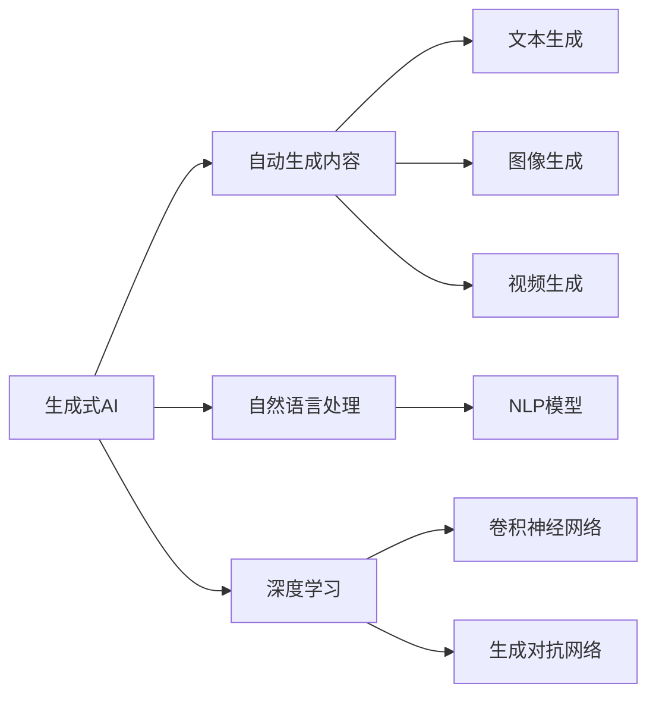
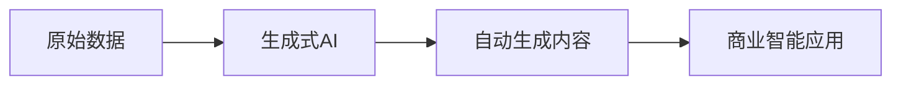
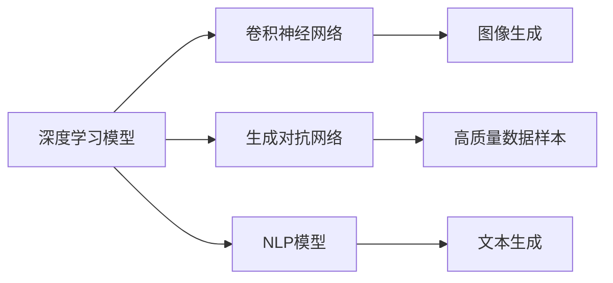
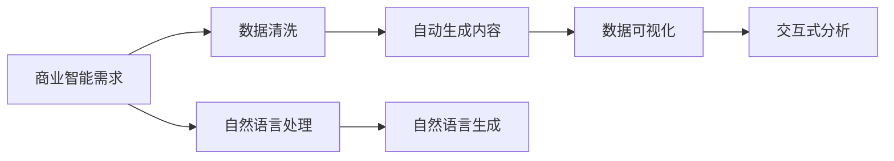
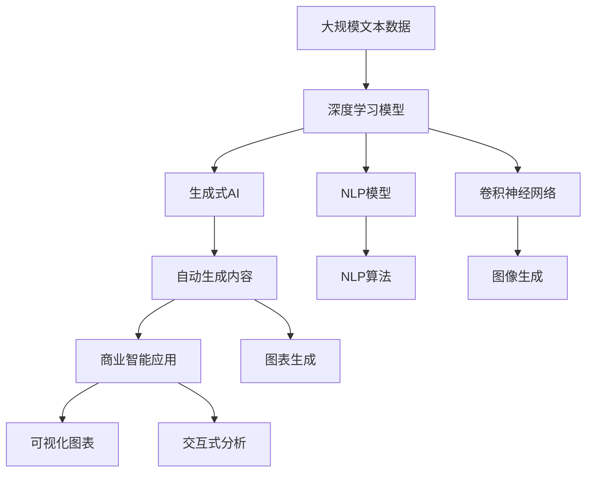

                 

# 生成式AIGC：商业智能的未来趋势

> 关键词：生成式AI, 自动生成内容, 人工智能, 商业智能, 自然语言处理, 数据可视化

## 1. 背景介绍

### 1.1 问题由来
在数字化转型的大背景下，企业数据的重要性日益凸显，商业智能(BI)作为企业信息化建设的重要组成部分，正成为企业决策的“新引擎”。随着数据量和数据维度的激增，传统的BI系统在处理海量数据、提供精准分析方面逐渐显现出局限性。

近年来，人工智能技术的迅猛发展，特别是生成式AI（Generative AI, GAI）和自动生成内容（Auto-generated Content, ACG）技术的应用，为商业智能带来了革命性的变革。通过智能化的数据处理和内容生成，AI系统能够快速响应复杂多变的业务需求，为管理层提供决策依据。

大模型如GPT-3、DALL·E、CLIP等，以其强大的生成能力，在文本、图像、视频等多个领域展现了极大的潜力。生成式AI和自动生成内容技术，正不断拓展商业智能的应用场景，成为未来商业智能发展的重要趋势。

### 1.2 问题核心关键点
生成式AI和自动生成内容技术，核心在于利用深度学习模型，从已有数据中学习生成数据的分布，并根据特定任务生成新的数据。这些技术在商业智能中的应用，主要体现在以下几个方面：

1. **数据预处理与增强**：利用生成式AI技术，可以从原始数据中生成新的数据样本，扩充训练集，提高模型泛化能力。
2. **数据清洗与修复**：自动生成模型可以识别并修正数据中的噪声和错误，提升数据质量。
3. **内容生成与优化**：通过生成式AI生成商业报告、市场分析等文本内容，辅助决策分析。
4. **可视化呈现**：生成式模型可以自动设计数据可视化图表，直观展示分析结果。
5. **交互式分析**：利用生成式AI进行自然语言对话，提供交互式数据分析功能。

这些应用让商业智能系统能够更加智能、高效、直观，提升企业决策的准确性和及时性。

### 1.3 问题研究意义
生成式AI和自动生成内容技术，对于商业智能的发展具有重要意义：

1. **提升数据质量**：通过数据预处理和清洗，生成式AI能够提升数据质量，减少误导性分析。
2. **加速分析过程**：自动生成报告和可视化图表，能够缩短数据分析和报告生成的时间，提升决策效率。
3. **提供深度洞察**：生成式模型能够自动进行数据建模和预测，提供更深层次的洞察和预测分析。
4. **降低开发成本**：减少人工编写代码和报告的时间，降低开发和运维成本。
5. **增强用户体验**：通过自然语言对话等交互方式，提升用户使用体验。
6. **应对变化快速**：AI系统能够快速适应业务变化，随时进行模型更新和优化。

## 2. 核心概念与联系

### 2.1 核心概念概述

为更好地理解生成式AI和自动生成内容技术，本节将介绍几个密切相关的核心概念：

- **生成式AI（Generative AI, GAI）**：利用深度学习模型，生成新数据的技术，包括文本生成、图像生成、音乐生成等。其核心在于学习数据分布，生成新的样本。

- **自动生成内容（Auto-generated Content, ACG）**：基于生成式AI，自动生成文本、图像、视频等商业智能分析报告、报告注释、数据图表等文本内容。

- **自然语言处理（Natural Language Processing, NLP）**：处理和生成自然语言的技术，是自动生成内容的重要基础。

- **深度学习（Deep Learning）**：利用多层次神经网络模型，处理和生成数据的高级技术。

- **卷积神经网络（Convolutional Neural Networks, CNN）**：用于图像生成和处理的深度学习模型。

- **生成对抗网络（Generative Adversarial Networks, GANs）**：通过两个对抗网络，生成高质量数据样本。

这些核心概念之间的逻辑关系可以通过以下Mermaid流程图来展示：



这个流程图展示了大语言模型与自动生成内容的关系：生成式AI通过深度学习模型生成数据，自动生成内容则是将生成式AI的输出，转换为更具商业智能价值的文本、图表等形式。

### 2.2 概念间的关系

这些核心概念之间存在着紧密的联系，形成了生成式AI和自动生成内容技术的完整生态系统。下面我们通过几个Mermaid流程图来展示这些概念之间的关系。

#### 2.2.1 生成式AI与自动生成内容的流程


这个流程图展示了大语言模型如何通过生成式AI生成新的数据，并通过自动生成内容技术转换为商业智能分析报告和图表。

#### 2.2.2 生成式AI的核心技术


这个流程图展示了生成式AI中的关键技术：深度学习模型、卷积神经网络、生成对抗网络等。通过这些技术，生成式AI能够生成高质量的图像、文本等内容。

#### 2.2.3 自动生成内容的应用场景


这个流程图展示了自动生成内容在商业智能中的多个应用场景：数据清洗、数据可视化、交互式分析等。自动生成内容技术在这些场景中，能够提升工作效率和数据质量。

### 2.3 核心概念的整体架构

最后，我们用一个综合的流程图来展示这些核心概念在大语言模型自动生成内容中的整体架构：



这个综合流程图展示了从深度学习模型到大语言模型的完整过程。深度学习模型学习数据分布，生成式AI根据分布生成新数据，自动生成内容技术将生成的新数据转换为商业智能分析报告、图表等形式，最后用于支持商业智能应用。

## 3. 核心算法原理 & 具体操作步骤
### 3.1 算法原理概述

生成式AI和自动生成内容技术的核心在于生成模型（Generative Model）。生成模型利用深度学习模型学习数据分布，从而能够生成新的数据。具体算法流程如下：

1. **数据准备**：收集并准备数据集，清洗数据，去除噪声。
2. **模型选择**：选择合适的生成模型，如生成对抗网络、变分自编码器、自回归模型等。
3. **模型训练**：在准备好的数据集上训练模型，学习数据分布。
4. **数据生成**：使用训练好的模型生成新的数据样本。

生成式AI和自动生成内容技术，通常基于以下几种核心模型：

- **生成对抗网络（GANs）**：通过两个对抗的神经网络，生成高质量的数据样本。
- **变分自编码器（VAEs）**：通过学习数据的隐空间分布，生成新数据。
- **自回归模型（Autoregressive Models）**：通过时间序列预测生成文本等序列数据。
- **自编码器（Autoencoders）**：通过编码器-解码器结构生成数据。

### 3.2 算法步骤详解

下面详细介绍生成对抗网络和变分自编码器的算法步骤：

#### 3.2.1 生成对抗网络（GANs）
生成对抗网络由生成器和判别器两个部分组成：

1. **生成器**：学习生成数据的分布，将噪声向量转换为生成的数据样本。
2. **判别器**：学习区分生成数据和真实数据的能力。

GANs的训练过程如下：

1. **初始化**：随机生成一个噪声向量 $z$，送入生成器 $G$ 生成样本 $G(z)$。
2. **判别器训练**：将真实样本 $x$ 和生成样本 $G(z)$ 送入判别器 $D$，计算损失函数 $\mathcal{L}_{D}$，并更新判别器参数。
3. **生成器训练**：将噪声向量 $z$ 送入生成器 $G$，生成样本 $G(z)$，并计算损失函数 $\mathcal{L}_{G}$，更新生成器参数。
4. **交替更新**：交替更新生成器和判别器，直到收敛。

#### 3.2.2 变分自编码器（VAEs）
变分自编码器由编码器 $E$ 和解码器 $D$ 两部分组成：

1. **编码器**：学习数据的隐空间表示。
2. **解码器**：从隐空间表示生成数据样本。

VAEs的训练过程如下：

1. **编码器训练**：将输入样本 $x$ 送入编码器 $E$，计算隐空间表示 $\mathbf{z}$。
2. **解码器训练**：将隐空间表示 $\mathbf{z}$ 送入解码器 $D$，生成样本 $\hat{x}$，并计算重构损失 $\mathcal{L}_{rec}$。
3. **变分训练**：计算隐空间分布 $q(\mathbf{z}|x)$ 和先验分布 $p(\mathbf{z})$ 的KL散度，并计算总损失 $\mathcal{L}_{vae}$，更新编码器参数。
4. **交替更新**：交替更新编码器和解码器，直到收敛。

### 3.3 算法优缺点

生成式AI和自动生成内容技术具有以下优点：

1. **数据增强**：生成新数据样本，扩充训练集，提高模型泛化能力。
2. **数据清洗**：自动生成模型能够识别并修正数据中的噪声和错误，提升数据质量。
3. **内容生成**：自动生成商业报告、市场分析等文本内容，辅助决策分析。
4. **可视化呈现**：自动生成图表，直观展示分析结果。
5. **交互式分析**：利用自然语言对话，提供交互式数据分析功能。

这些技术在商业智能中的应用，显著提升了分析效率和决策支持能力。但同时也存在以下缺点：

1. **生成质量不稳定**：生成模型的生成质量受训练数据和模型参数的影响较大，不同模型、不同训练数据可能生成质量差异明显。
2. **资源消耗高**：生成模型训练和推理资源消耗较大，尤其是在大规模数据集上。
3. **解释性差**：生成模型生成数据的“黑盒”特性，导致难以解释其生成过程和输出结果。

### 3.4 算法应用领域

生成式AI和自动生成内容技术，主要应用于以下几个领域：

- **商业智能分析**：生成商业报告、市场分析、趋势预测等文本内容，辅助决策分析。
- **自然语言处理**：生成文本摘要、回答问题、生成自然语言描述等。
- **图像处理**：生成图像、图像标注、图像增强等。
- **视频生成**：生成视频、视频注释、视频字幕等。
- **个性化推荐**：生成个性化推荐内容、推荐策略等。

这些领域的应用，极大地拓展了商业智能系统的功能和应用场景，为企业管理提供了强有力的技术支持。

## 4. 数学模型和公式 & 详细讲解  
### 4.1 数学模型构建

生成式AI和自动生成内容技术，通常基于以下数学模型：

1. **生成对抗网络（GANs）**：
   - **生成器模型**：$G: \mathcal{Z} \rightarrow \mathcal{X}$
   - **判别器模型**：$D: \mathcal{X} \rightarrow \mathbb{R}$
   - **损失函数**：$\mathcal{L}_{D}(G) = \mathbb{E}_{x \sim p_{data}}[D(x)] + \mathbb{E}_{z \sim p_{z}}[1-D(G(z))]$
   - **损失函数**：$\mathcal{L}_{G}(D) = \mathbb{E}_{z \sim p_{z}}[D(G(z))]$

2. **变分自编码器（VAEs）**：
   - **编码器模型**：$E: \mathcal{X} \rightarrow \mathcal{Z}$
   - **解码器模型**：$D: \mathcal{Z} \rightarrow \mathcal{X}$
   - **重构损失**：$\mathcal{L}_{rec} = \mathbb{E}_{x \sim p_{data}}[\|x - D(E(x))\|]$
   - **KL散度损失**：$\mathcal{L}_{vae} = \mathbb{E}_{x \sim p_{data}}[-\log D(E(x))] + \mathbb{E}_{z \sim q(z|x)}[\log p(z)]$

3. **自回归模型（AR）**：
   - **生成模型**：$p(x_1, ..., x_T) = \prod_{t=1}^T p(x_t|x_{<t})$
   - **条件概率**：$p(x_t|x_{<t})$
   - **损失函数**：$\mathcal{L} = -\log p(\text{data})$

### 4.2 公式推导过程

以下是生成对抗网络（GANs）和变分自编码器（VAEs）的详细公式推导：

#### 4.2.1 生成对抗网络（GANs）

生成对抗网络由生成器和判别器两部分组成。生成器 $G$ 将噪声向量 $z$ 转换为生成的数据样本 $G(z)$，判别器 $D$ 学习区分真实数据 $x$ 和生成数据 $G(z)$。

1. **生成器**：
   - $G: \mathcal{Z} \rightarrow \mathcal{X}$
   - 生成器将噪声向量 $z$ 转换为生成的数据样本 $G(z)$。

2. **判别器**：
   - $D: \mathcal{X} \rightarrow \mathbb{R}$
   - 判别器学习区分真实数据 $x$ 和生成数据 $G(z)$。

3. **损失函数**：
   - $\mathcal{L}_{D}(G) = \mathbb{E}_{x \sim p_{data}}[D(x)] + \mathbb{E}_{z \sim p_{z}}[1-D(G(z))]$
   - 判别器的损失函数包括真实数据 $x$ 的损失和生成数据 $G(z)$ 的损失。

4. **梯度计算**：
   - $\frac{\partial \mathcal{L}_{D}(G)}{\partial G(z)} = \frac{\partial}{\partial G(z)} \mathbb{E}_{x \sim p_{data}}[D(x)] + \frac{\partial}{\partial G(z)} \mathbb{E}_{z \sim p_{z}}[1-D(G(z))]$
   - 对生成器和判别器进行梯度计算，更新模型参数。

#### 4.2.2 变分自编码器（VAEs）

变分自编码器由编码器 $E$ 和解码器 $D$ 两部分组成。编码器 $E$ 学习数据的隐空间表示 $\mathbf{z}$，解码器 $D$ 从隐空间表示 $\mathbf{z}$ 生成数据样本 $\hat{x}$。

1. **编码器**：
   - $E: \mathcal{X} \rightarrow \mathcal{Z}$
   - 编码器学习数据的隐空间表示 $\mathbf{z}$。

2. **解码器**：
   - $D: \mathcal{Z} \rightarrow \mathcal{X}$
   - 解码器从隐空间表示 $\mathbf{z}$ 生成数据样本 $\hat{x}$。

3. **重构损失**：
   - $\mathcal{L}_{rec} = \mathbb{E}_{x \sim p_{data}}[\|x - D(E(x))\|]$
   - 重构损失用于衡量生成数据与真实数据之间的差异。

4. **KL散度损失**：
   - $\mathcal{L}_{vae} = \mathbb{E}_{x \sim p_{data}}[-\log D(E(x))] + \mathbb{E}_{z \sim q(z|x)}[\log p(z)]$
   - KL散度损失用于衡量隐空间分布 $q(z|x)$ 和先验分布 $p(z)$ 之间的差异。

### 4.3 案例分析与讲解

以下是生成式AI和自动生成内容技术在商业智能中的应用案例分析：

#### 案例一：商业报告自动生成

在商业智能分析中，生成式AI能够自动生成商业报告。以零售行业为例，生成式AI可以生成季度销售报告、市场分析报告等文本内容，辅助管理层决策。具体过程如下：

1. **数据准备**：收集季度销售数据、市场调研数据等。
2. **模型选择**：选择生成对抗网络或变分自编码器等生成模型。
3. **模型训练**：在准备好的数据集上训练模型，学习数据分布。
4. **内容生成**：使用训练好的模型生成商业报告内容。
5. **报告审核**：对生成的报告内容进行审核，确保准确性和完整性。

#### 案例二：数据可视化

生成式AI能够自动设计数据可视化图表，直观展示分析结果。以能源行业为例，生成式AI可以生成能源消费量、电力负荷等数据的图表，辅助能源管理决策。具体过程如下：

1. **数据准备**：收集能源消费量、电力负荷等数据。
2. **模型选择**：选择生成对抗网络或变分自编码器等生成模型。
3. **模型训练**：在准备好的数据集上训练模型，学习数据分布。
4. **图表生成**：使用训练好的模型生成数据可视化图表。
5. **图表审核**：对生成的图表进行审核，确保准确性和直观性。

#### 案例三：自然语言对话

生成式AI能够进行自然语言对话，提供交互式数据分析功能。以金融行业为例，生成式AI可以生成金融产品推荐、风险评估等文本内容，辅助客户决策。具体过程如下：

1. **数据准备**：收集金融产品信息、客户风险偏好等数据。
2. **模型选择**：选择生成对抗网络或变分自编码器等生成模型。
3. **模型训练**：在准备好的数据集上训练模型，学习数据分布。
4. **对话生成**：使用训练好的模型生成自然语言对话。
5. **对话审核**：对生成的对话进行审核，确保准确性和友好性。

## 5. 项目实践：代码实例和详细解释说明
### 5.1 开发环境搭建

在进行生成式AI和自动生成内容技术实践前，我们需要准备好开发环境。以下是使用Python进行PyTorch开发的环境配置流程：

1. 安装Anaconda：从官网下载并安装Anaconda，用于创建独立的Python环境。

2. 创建并激活虚拟环境：
```bash
conda create -n pytorch-env python=3.8 
conda activate pytorch-env
```

3. 安装PyTorch：根据CUDA版本，从官网获取对应的安装命令。例如：
```bash
conda install pytorch torchvision torchaudio cudatoolkit=11.1 -c pytorch -c conda-forge
```

4. 安装Transformers库：
```bash
pip install transformers
```

5. 安装各类工具包：
```bash
pip install numpy pandas scikit-learn matplotlib tqdm jupyter notebook ipython
```

完成上述步骤后，即可在`pytorch-env`环境中开始生成式AI和自动生成内容技术的实践。

### 5.2 源代码详细实现

这里我们以生成对抗网络（GANs）为例，给出使用PyTorch进行生成的代码实现。

首先，定义生成器和判别器：

```python
import torch.nn as nn
import torch.nn.functional as F

class Generator(nn.Module):
    def __init__(self, z_dim, img_channels):
        super(Generator, self).__init__()
        self.z_dim = z_dim
        self.img_channels = img_channels
        
        self.fc = nn.Linear(z_dim, 256)
        self.fc2 = nn.Linear(256, 256)
        self.fc3 = nn.Linear(256, 256)
        self.fc4 = nn.Linear(256, img_channels * 64 * 64)
        self.fc5 = nn.Linear(256, img_channels * 32 * 32)
        self.fc6 = nn.Linear(256, img_channels * 16 * 16)
        self.fc7 = nn.Linear(256, img_channels * 8 * 8)
        self.fc8 = nn.Linear(256, img_channels)
        
    def forward(self, z):
        x = self.fc(z)
        x = F.leaky_relu(x)
        x = self.fc2(x)
        x = F.leaky_relu(x)
        x = self.fc3(x)
        x = F.leaky_relu(x)
        x = self.fc4(x)
        x = F.leaky_relu(x)
        x = self.fc5(x)
        x = F.leaky_relu(x)
        x = self.fc6(x)
        x = F.leaky_relu(x)
        x = self.fc7(x)
        x = F.leaky_relu(x)
        x = self.fc8(x)
        x = F.tanh(x)
        return x.view(-1, self.img_channels, 8, 8)

class Discriminator(nn.Module):
    def __init__(self, img_channels):
        super(Discriminator, self).__init__()
        self.img_channels = img_channels
        
        self.conv1 = nn.Conv2d(img_channels, 64, 4, 2, 1)
        self.conv2 = nn.Conv2d(64, 128, 4, 2, 1)
        self.conv3 = nn.Conv2d(128, 256, 4, 2, 1)
        self.conv4 = nn.Conv2d(256, 512, 4, 2, 1)
        self.conv5 = nn.Conv2d(512, 1, 4, 1, 0)
        
    def forward(self, x):
        x = self.conv1(x)
        x = F.leaky_relu(x)
        x = self.conv2(x)
        x = F.leaky_relu(x)
        x = self.conv3(x)
        x = F.leaky_relu(x)
        x = self.conv4(x)
        x = F.leaky_relu(x)
        x = self.conv5(x)
        x = F.sigmoid(x)
        return x
```

然后，定义损失函数和优化器：

```python
from torch.optim import Adam
from torch import nn

loss_fn = nn.BCELoss()

optimizer_G = Adam(Generator.parameters(), lr=0.0002)
optimizer_D = Adam(Discriminator.parameters(), lr=0.0002)
```

接着，定义训练函数：

```python
def train_epoch(G, D, G_z, D_x, optimizer_G, optimizer_D):
    b_size = G_z.size()[0]
    for i in range(1000):
        # 随机生成噪声向量
        z = torch.randn(b_size, G.z_dim, device=device)
        G_z = G(z).view(-1, G.img_channels, 8, 8)
        
        # 真实数据
        D_x = D_x.to(device)
        
        # 生成器训练
        G_loss = loss_fn(D(G_z), torch.ones_like(D(G_z)))
        G_loss.backward()
        optimizer_G.step()
        
        # 判别器训练
        D_loss_real = loss_fn(D(D_x), torch.ones_like(D(D_x)))
        D_loss_fake = loss_fn(D(G_z.detach()), torch.zeros_like(D(G_z)))
        D_loss = D_loss_real + D_loss_fake
        D_loss.backward()
        optimizer_D.step()
        
        if i % 100 == 0:
            print(f'Epoch {i+1}, G_loss: {G_loss.item()}, D_loss: {D_loss.item()}')
```

最后，启动训练流程：

```python
epochs = 100
batch_size = 64
device = torch.device('cuda' if torch.cuda.is_available() else 'cpu')

# 准备数据集
train_dataset = ...
train_loader = DataLoader(train_dataset, batch_size=batch_size, shuffle=True)

# 初始化模型
G = Generator(z_dim=100, img_channels=3)
D = Discriminator(img_channels=3)

# 开始训练
for epoch in range(epochs):
    train_epoch(G, D, G_z, D_x, optimizer_G, optimizer_D)
    
# 保存模型
torch.save(G.state_dict(), 'gen_model.pth')
torch.save(D.state_dict(), 'disc_model.pth')
```

以上就是一个使用PyT

