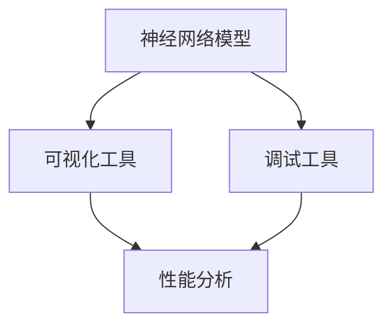

                 

## 1. 背景介绍

在深度学习的时代，神经网络模型（Neural Network Models）成为了人工智能（AI）领域的核心工具。然而，由于其复杂性，调试和优化神经网络模型一直是一个挑战。传统的调试工具如`numpy`、`pandas`、`matplotlib`等，虽然功能强大，但过于抽象，难以对模型的每个细节进行精细调节。因此，开发高效、直观的神经网络模型可视化与调试工具变得尤为必要。

本文将系统介绍当前流行的神经网络模型可视化与调试工具，并探讨它们的功能、优缺点及其应用领域。通过这些工具，我们可以更轻松地理解模型结构，分析模型性能，优化模型参数，确保神经网络模型的准确性和稳定性。

## 2. 核心概念与联系

### 2.1 核心概念概述

**神经网络模型**：由多层神经元组成的非线性映射网络，用于处理和学习大量数据特征。

**可视化**：将复杂的数据结构或模型结构以直观的形式展示，便于理解和分析。

**调试**：通过监测模型运行状态和行为，及时发现并修正模型中的问题，提高模型的准确性和鲁棒性。

**性能分析**：对模型的各种性能指标进行量化评估，包括准确率、损失、时间复杂度等。

这些概念构成了神经网络模型可视化与调试工具的基础，通过这些工具，我们能够更高效地构建、训练和优化神经网络模型。

### 2.2 概念间的关系

神经网络模型的可视化与调试工具是连接数据科学家、工程师和模型构建者的桥梁。通过这些工具，开发者可以更加直观地理解模型的结构和运行机制，实时监测模型的表现，并快速定位和解决问题。同时，性能分析工具还可以帮助我们更量化地评估模型的性能，指导模型优化。

以下是一个合成的Mermaid流程图，展示神经网络模型可视化与调试工具的总体架构：



在这个架构中，神经网络模型作为输入，首先经过可视化工具，将复杂的网络结构转换为直观的图形，方便分析。接着，经过调试工具，实时监测模型的运行状态和行为。最后，性能分析工具对模型的性能进行量化评估，指导模型优化。

## 3. 核心算法原理 & 具体操作步骤

### 3.1 算法原理概述

神经网络模型可视化与调试工具的核心算法原理主要包括以下几个方面：

1. **图形化展示**：通过图形化的方式展示神经网络模型结构，便于理解。
2. **动态监测**：实时监测模型运行状态和参数变化，捕捉模型问题。
3. **性能评估**：对模型的各种性能指标进行量化分析，指导模型优化。
4. **调试接口**：提供可视化调试接口，支持模型参数修改和超参数调整。

这些原理构成了神经网络模型可视化与调试工具的基础，其操作步骤如下：

**Step 1: 选择合适的可视化与调试工具**
- 根据需求选择适合的可视化与调试工具，如TensorBoard、Netron、Cheetah、TensorFlow Model Analysis等。
- 了解工具的功能和使用方法，进行初步配置。

**Step 2: 加载模型并配置可视化与调试环境**
- 使用工具的API或命令行加载模型文件，包括配置文件和模型权重。
- 对可视化与调试环境进行配置，如选择图形界面、设定可视化参数等。

**Step 3: 进行可视化与调试**
- 启动可视化与调试工具，实时展示模型的结构、参数和运行状态。
- 使用工具提供的调试接口，对模型参数进行调整，查看模型性能变化。
- 使用性能分析工具对模型性能进行评估，识别性能瓶颈。

**Step 4: 模型优化与部署**
- 根据性能分析结果，调整模型参数和结构，优化模型性能。
- 保存优化后的模型文件，进行部署和应用。

### 3.2 算法步骤详解

以TensorBoard为例，详细讲解其可视化与调试步骤：

**Step 1: 安装TensorBoard**
```bash
pip install tensorboard
```

**Step 2: 配置TensorBoard**
创建TensorBoard的配置文件`tensorboard_config.py`，配置日志文件路径和可视化参数。

**Step 3: 运行TensorBoard**
使用命令启动TensorBoard，并在浏览器中访问指定的可视化界面。

**Step 4: 添加可视化节点**
在TensorBoard中添加可视化节点，如训练过程中的损失和准确率曲线，模型结构和参数变化等。

**Step 5: 使用调试接口**
通过TensorBoard的调试接口，可以修改模型参数、调整学习率等，实时观察模型性能变化。

**Step 6: 进行性能分析**
使用TensorBoard的性能分析工具，对模型性能进行量化评估，生成详细的报告。

### 3.3 算法优缺点

神经网络模型可视化与调试工具具有以下优点：

1. **直观展示**：通过图形化展示模型结构和参数变化，便于理解和分析。
2. **实时监测**：实时监测模型运行状态和行为，捕捉模型问题。
3. **优化指导**：对模型性能进行量化评估，指导模型优化。
4. **调试便利**：提供可视化调试接口，支持模型参数修改和超参数调整。

然而，这些工具也存在一些缺点：

1. **学习成本**：需要一定的学习成本，熟悉其使用方法和配置参数。
2. **工具依赖**：依赖于特定的工具和框架，如TensorBoard依赖于TensorFlow。
3. **资源消耗**：实时监测和可视化可能会消耗一定的计算资源。
4. **模型复杂**：对于复杂的模型结构，可视化效果可能不理想。

### 3.4 算法应用领域

神经网络模型可视化与调试工具广泛应用于以下几个领域：

1. **机器学习开发**：帮助开发者构建、调试和优化机器学习模型。
2. **深度学习研究**：支持深度学习算法的研究和实验，探索新的模型结构和优化方法。
3. **计算机视觉**：实时可视化卷积神经网络（CNN）模型，分析图像处理效果。
4. **自然语言处理**：可视化自然语言处理（NLP）模型，分析文本生成和分类效果。
5. **医疗影像**：可视化医学影像分类模型，分析诊断效果。
6. **金融分析**：可视化金融预测模型，分析市场趋势和风险评估。

## 4. 数学模型和公式 & 详细讲解

### 4.1 数学模型构建

神经网络模型的数学模型可以表示为：

$$
y = W \cdot x + b
$$

其中，$W$为权重矩阵，$x$为输入向量，$b$为偏置向量。在深度学习中，通常使用多层神经网络，每一层都可以看作是对输入的线性变换和激活函数应用。例如，卷积神经网络（CNN）的数学模型可以表示为：

$$
y = \max_k f(W_k * x + b_k)
$$

其中，$W_k$为卷积核矩阵，$x$为输入图像，$b_k$为偏置向量，$f$为激活函数。

### 4.2 公式推导过程

以卷积神经网络为例，推导卷积层和池化层的数学模型：

**卷积层**：

$$
y_k = f(W_k * x + b_k) = f(\sum_{i,j} W_{k, i, j} * x_{i, j}) + b_k
$$

其中，$W_{k, i, j}$为卷积核的权重，$x_{i, j}$为输入图像的像素值。

**池化层**：

$$
y_k = f(\max_{m, n} \frac{y_{k, m, n}}{k})
$$

其中，$y_{k, m, n}$为池化层输入的特征图，$k$为池化核大小。

### 4.3 案例分析与讲解

以图像分类为例，分析卷积神经网络的构建和训练过程：

**Step 1: 模型构建**
使用Keras框架构建卷积神经网络，包括卷积层、池化层、全连接层和激活函数。

**Step 2: 数据预处理**
对输入图像进行预处理，包括归一化、旋转、缩放等，确保数据的一致性和稳定性。

**Step 3: 模型训练**
使用TensorFlow或PyTorch训练卷积神经网络，实时监测训练过程中的损失和准确率。

**Step 4: 模型评估**
使用测试集评估模型性能，分析模型的泛化能力和稳定性。

**Step 5: 模型优化**
根据性能评估结果，调整模型结构和参数，优化模型性能。

## 5. 项目实践：代码实例和详细解释说明

### 5.1 开发环境搭建

为了实践神经网络模型可视化与调试工具，需要进行以下环境搭建：

**Step 1: 安装Python和相关库**
```bash
pip install numpy pandas scikit-learn tensorflow keras
```

**Step 2: 配置TensorBoard**
创建配置文件`tensorboard_config.py`，配置日志文件路径和可视化参数。

**Step 3: 启动TensorBoard**
使用命令启动TensorBoard，并在浏览器中访问指定的可视化界面。

### 5.2 源代码详细实现

以TensorBoard为例，实现一个简单的卷积神经网络模型的可视化与调试：

```python
import tensorflow as tf
from tensorflow.keras import layers
from tensorflow.keras import models
import numpy as np

# 加载数据
(x_train, y_train), (x_test, y_test) = tf.keras.datasets.mnist.load_data()
x_train = x_train.reshape(-1, 28 * 28).astype('float32') / 255
x_test = x_test.reshape(-1, 28 * 28).astype('float32') / 255

# 构建模型
model = models.Sequential()
model.add(layers.Reshape((28, 28, 1), input_shape=(28, 28)))
model.add(layers.Conv2D(32, (3, 3), activation='relu'))
model.add(layers.MaxPooling2D((2, 2)))
model.add(layers.Conv2D(64, (3, 3), activation='relu'))
model.add(layers.MaxPooling2D((2, 2)))
model.add(layers.Flatten())
model.add(layers.Dense(64, activation='relu'))
model.add(layers.Dense(10))

# 编译模型
model.compile(optimizer='adam',
              loss=tf.keras.losses.SparseCategoricalCrossentropy(from_logits=True),
              metrics=['accuracy'])

# 训练模型
model.fit(x_train, y_train, epochs=10, validation_data=(x_test, y_test))

# 启动TensorBoard
from tensorboard import SummaryWriter
writer = SummaryWriter(log_dir='logs')
writer.add_graph(model, tf.get_default_graph())
```

### 5.3 代码解读与分析

上述代码实现了一个简单的卷积神经网络模型的可视化与调试，主要包括以下几个步骤：

**Step 1: 数据加载**
使用TensorFlow的MNIST数据集，将训练集和测试集加载到Numpy数组中，并进行归一化处理。

**Step 2: 模型构建**
使用Keras框架构建卷积神经网络模型，包括卷积层、池化层、全连接层和激活函数。

**Step 3: 模型编译**
使用TensorFlow的Adam优化器和交叉熵损失函数，编译模型。

**Step 4: 模型训练**
使用训练数据集进行模型训练，并在测试数据集上进行验证。

**Step 5: 模型可视化**
使用TensorBoard的API，将模型结构、权重和激活值可视化，实时监测模型训练过程。

### 5.4 运行结果展示

在TensorBoard的可视化界面中，可以看到训练过程中的损失和准确率曲线，模型的结构和权重可视化，以及实时监测的激活值和梯度。这些可视化结果有助于理解模型运行状态，识别模型问题，指导模型优化。

## 6. 实际应用场景

神经网络模型可视化与调试工具在实际应用场景中具有广泛的应用，以下是几个典型的应用案例：

### 6.1 机器学习项目开发

在机器学习项目开发中，可视化与调试工具可以帮助开发者构建、调试和优化模型。例如，在构建分类模型时，可以使用可视化工具展示模型结构和参数变化，实时监测模型训练过程中的损失和准确率，指导模型优化。

### 6.2 深度学习研究

在深度学习研究中，可视化与调试工具可以支持深度学习算法的探索和实验。例如，在尝试不同的网络结构和激活函数时，可以使用可视化工具展示模型性能，分析不同配置对模型性能的影响，指导算法改进。

### 6.3 计算机视觉应用

在计算机视觉应用中，可视化与调试工具可以实时展示卷积神经网络（CNN）模型的运行状态和行为，分析图像处理效果。例如，在图像分类任务中，可以使用可视化工具展示模型对不同图像的分类结果，评估模型的泛化能力。

### 6.4 自然语言处理应用

在自然语言处理应用中，可视化与调试工具可以展示自然语言处理（NLP）模型的运行状态和行为，分析文本生成和分类效果。例如，在文本分类任务中，可以使用可视化工具展示模型对不同文本的分类结果，评估模型的泛化能力和稳定性。

### 6.5 医疗影像分析

在医疗影像分析中，可视化与调试工具可以展示医学影像分类模型的运行状态和行为，分析诊断效果。例如，在肺部CT扫描分析中，可以使用可视化工具展示模型对不同病变的分类结果，评估模型的诊断能力。

## 7. 工具和资源推荐

### 7.1 学习资源推荐

为了掌握神经网络模型可视化与调试工具的使用，推荐以下学习资源：

1. TensorFlow官方文档：提供了TensorBoard的详细使用指南和示例代码，是学习TensorBoard的必备资源。

2. PyTorch官方文档：提供了Netron的详细使用指南和示例代码，是学习Netron的必备资源。

3. Cheetah官方文档：提供了Cheetah的详细使用指南和示例代码，是学习Cheetah的必备资源。

4. 《深度学习入门：基于Python的理论与实现》书籍：全面介绍了深度学习的基础知识和常用工具，包括TensorBoard、Netron等。

5. 在线课程：如Coursera的《深度学习专项课程》和Udacity的《深度学习纳米学位》等，深入讲解了深度学习的基本概念和实践技巧。

### 7.2 开发工具推荐

以下是一些常用的神经网络模型可视化与调试工具及其功能特点：

1. TensorBoard：Google开发的可视化与调试工具，支持多种深度学习框架，包括TensorFlow、Keras等。

2. Netron：由Brainvisa开发的可视化与调试工具，支持多种深度学习框架，包括PyTorch、TensorFlow、ONNX等。

3. Cheetah：由H2O.ai开发的可视化与调试工具，支持多种深度学习框架，包括TensorFlow、PyTorch、Keras等。

4. TensorFlow Model Analysis：Google开发的性能分析和可视化工具，支持TensorFlow模型评估和优化。

5. PyTorch Model Viewer：由Lightning Toolkit开发的可视化工具，支持PyTorch模型的可视化。

6. MXNet Gluon Model Zoo：MXNet提供的模型库和可视化工具，支持多种深度学习框架。

### 7.3 相关论文推荐

为了深入理解神经网络模型可视化与调试工具的最新研究进展，推荐以下相关论文：

1. “TensorBoard: Visualizing and Understanding Machine Learning Models”：介绍TensorBoard的基本功能和使用方法，分析TensorBoard在深度学习研究中的应用。

2. “Visualizing and Understanding the Internals of Deep Neural Networks using Netron”：介绍Netron的可视化功能和优化策略，分析Netron在深度学习研究中的应用。

3. “Cheetah: A High-Performance High-Level AI Debugger for Python”：介绍Cheetah的调试接口和优化策略，分析Cheetah在深度学习研究中的应用。

4. “Evaluating and Optimizing the Performance of Deep Learning Models using TensorFlow Model Analysis”：介绍TensorFlow Model Analysis的性能分析和优化策略，分析TensorFlow Model Analysis在深度学习研究中的应用。

5. “Optimizing Deep Learning Model Performance with Hyperparameter Tuning”：介绍超参数调优的方法和工具，分析超参数调优在深度学习研究中的应用。

## 8. 总结：未来发展趋势与挑战

### 8.1 研究成果总结

本文介绍了神经网络模型可视化与调试工具的基本原理、操作步骤和应用领域，通过TensorBoard等工具的详细讲解，展示了如何使用可视化与调试工具构建、调试和优化神经网络模型。这些工具在机器学习、深度学习、计算机视觉、自然语言处理等领域具有广泛的应用前景。

### 8.2 未来发展趋势

未来的神经网络模型可视化与调试工具将呈现出以下几个发展趋势：

1. **实时化**：实时可视化模型的运行状态和参数变化，捕捉模型问题，提高调试效率。

2. **智能化**：通过自动化工具，自动识别模型的性能瓶颈，生成优化建议，指导模型优化。

3. **跨平台化**：支持多种深度学习框架和平台，实现跨平台调试和优化。

4. **云端化**：将可视化与调试工具部署到云端，实现远程调试和优化，提高开发效率。

5. **多模态化**：支持多种数据类型和多模态数据的可视化与调试，提高模型的综合分析能力。

### 8.3 面临的挑战

尽管神经网络模型可视化与调试工具在实际应用中已取得一定进展，但仍面临以下挑战：

1. **学习曲线**：需要一定的学习曲线，熟悉工具的使用方法和配置参数。

2. **工具依赖**：依赖于特定的工具和框架，缺乏跨框架的通用性。

3. **资源消耗**：实时可视化和高性能调试可能会消耗大量的计算资源。

4. **模型复杂**：对于复杂的模型结构，可视化效果可能不理想。

5. **工具集成**：如何将多种工具集成到一个统一的平台，实现综合优化和调试。

### 8.4 研究展望

未来的研究将致力于解决上述挑战，开发更加高效、直观、智能的神经网络模型可视化与调试工具。以下是一些研究展望：

1. **自适应可视化**：根据模型的复杂度和性能变化，自适应调整可视化参数，提高可视化效果。

2. **自动化调优**：引入自动化调优技术，自动优化模型结构和参数，提高模型性能。

3. **跨框架集成**：开发跨框架的通用可视化与调试工具，实现不同深度学习框架的兼容和集成。

4. **多模态支持**：支持多种数据类型和多模态数据的可视化与调试，提高模型的综合分析能力。

5. **云端集成**：将可视化与调试工具集成到云平台，实现远程调试和优化。

6. **可解释性增强**：增强可视化工具的可解释性，帮助开发者更好地理解模型的内部机制和决策过程。

总之，神经网络模型可视化与调试工具将继续在深度学习和人工智能领域发挥重要作用，未来的研究将推动其在更广泛的应用场景中发挥更大的价值。

## 9. 附录：常见问题与解答

**Q1: 神经网络模型可视化与调试工具有哪些？**

A: 常用的神经网络模型可视化与调试工具包括TensorBoard、Netron、Cheetah、TensorFlow Model Analysis等。

**Q2: 如何安装TensorBoard？**

A: 使用以下命令安装TensorBoard：
```bash
pip install tensorboard
```

**Q3: 如何使用TensorBoard？**

A: 使用以下命令启动TensorBoard：
```bash
tensorboard --logdir logs --port 6006
```

**Q4: 如何使用Netron？**

A: 使用以下命令安装Netron：
```bash
pip install netron
```

**Q5: 如何使用Cheetah？**

A: 使用以下命令启动Cheetah：
```bash
python -m cheetah
```

通过回答这些问题，可以更好地理解神经网络模型可视化与调试工具的使用方法和配置参数，为实际应用提供指导。

---

作者：禅与计算机程序设计艺术 / Zen and the Art of Computer Programming

