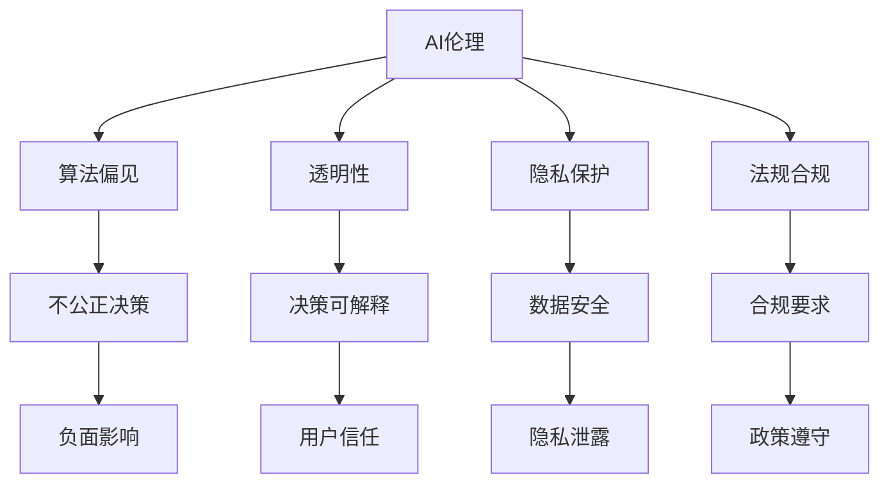

                 

# AI系统的伦理设计与公平性保证

> 关键词：AI伦理,公平性,算法偏见,透明性,隐私保护,可解释性,法规合规

## 1. 背景介绍

随着人工智能技术的快速发展和广泛应用，AI系统在医疗、金融、教育、司法等领域正逐步替代人工操作，带来前所未有的便利与效率提升。然而，AI系统在提高效率的同时，也暴露出一系列伦理和公平性问题。人工智能是否具有道德责任？如何确保AI决策的公平性和透明性？如何平衡算法准确性和隐私保护？这些问题已经引起了广泛关注，成为当前研究的热点。

本文将系统介绍AI系统伦理设计与公平性保证的原理与实践，从核心概念和架构入手，详细讲解算法原理和操作步骤，提供实际应用场景和代码实例，展望未来发展趋势和挑战，为AI系统的道德设计与应用实践提供全面的技术指导。

## 2. 核心概念与联系

### 2.1 核心概念概述

为更好理解AI系统伦理设计与公平性保证，本节将详细介绍几个核心概念及其相互关系：

- **AI伦理**：人工智能系统的道德责任和行为规范，涵盖隐私保护、算法偏见、透明性等关键问题。
- **算法偏见**：AI模型在数据、设计和训练过程中学习到的歧视性倾向，导致对特定群体或个体的不公平待遇。
- **透明性**：AI决策过程的清晰度和可解释性，确保用户和监管者能够理解模型的决策依据。
- **隐私保护**：在数据收集、处理和应用过程中，确保个人数据的安全与隐私不受侵害。
- **可解释性**：AI模型的决策依据和预测过程可被解释，便于用户和监管者理解和信任。
- **法规合规**：AI系统设计、开发和应用需遵守相关的法律法规和标准规范。

这些核心概念构成了一个完整的伦理与公平性保证体系，为大语言模型设计提供了理论基础和行动指南。

### 2.2 概念间的关系

这些核心概念之间存在着密切的联系，形成了一个相互交织的伦理与公平性保证框架。通过以下Mermaid流程图来展示它们之间的关系：



该流程图展示了AI伦理设计的核心概念及其相互关系：

1. **AI伦理**：是AI系统设计与应用的总体指导原则，涵盖算法偏见、透明性、隐私保护、法规合规等多方面。
2. **算法偏见**：是伦理设计中的重要关注点，可能引发不公正决策，需要透明性、隐私保护和法规合规来缓解。
3. **透明性**：确保决策过程可解释，提高用户信任，对抗算法偏见和隐私保护中的风险。
4. **隐私保护**：确保数据安全，减少算法偏见的影响，符合法规合规的要求。
5. **法规合规**：确保AI系统设计合法合规，满足伦理和透明性的要求。
6. **不公正决策**：由算法偏见引发，需要通过透明性、隐私保护和法规合规来缓解。
7. **决策可解释**：提升透明性，增强用户信任，对抗算法偏见和隐私泄露的风险。
8. **用户信任**：透明性和隐私保护的核心目标，确保用户对AI决策的信任。
9. **隐私泄露**：隐私保护的核心风险，需要通过法规合规和透明性来防范。
10. **政策遵守**：法规合规的核心要求，确保AI系统的合法合规。

这些概念共同构成了AI系统伦理设计与公平性保证的完整体系，为大语言模型设计提供了全面的指导。

## 3. 核心算法原理 & 具体操作步骤
### 3.1 算法原理概述

AI系统伦理设计与公平性保证的核心算法原理，基于道德原则和公平性理论，旨在设计出透明、公正、可解释、合法的AI系统。具体来说，包括以下几个关键步骤：

1. **数据收集与处理**：确保数据来源的公平性和多样性，避免算法偏见。
2. **模型设计**：采用无偏差的训练算法，设计透明且可解释的模型结构。
3. **模型训练**：在隐私保护的前提下，训练公平且合法的AI模型。
4. **模型评估与验证**：评估模型性能和公平性，确保合规与透明性。

这些步骤共同构成了一个完整的AI系统设计流程，确保模型在不同环境和场景下都能保持公平和透明。

### 3.2 算法步骤详解

下面将详细介绍每个步骤的详细算法和操作步骤：

#### 3.2.1 数据收集与处理

数据是AI系统的基石，数据的质量和多样性直接影响模型的公平性和透明性。因此，数据收集与处理是伦理设计与公平性保证的首要步骤：

1. **数据来源选择**：选择多样性强的数据源，确保覆盖不同的社会群体和背景。
2. **数据清洗与标注**：去除有偏见的数据，确保标注数据的一致性和准确性。
3. **数据平衡处理**：通过重采样、加权等方法，平衡不同群体的样本分布。
4. **隐私保护措施**：采用差分隐私、联邦学习等技术，保护数据隐私。

#### 3.2.2 模型设计

模型设计是伦理与公平性保证的核心环节，需要考虑算法偏见、透明性和法规合规等问题：

1. **算法选择**：选择无偏差的算法，如 fairness-aware ML算法，确保模型公平。
2. **模型架构设计**：设计透明且可解释的模型结构，如可解释性较强的决策树、线性模型等。
3. **约束条件设计**：在设计中嵌入公平性约束，如使用公平性约束的优化目标，减少算法偏见。

#### 3.2.3 模型训练

模型训练是确保AI系统公平性和透明性的关键环节，需要在隐私保护的前提下进行：

1. **训练数据选择**：确保训练数据的多样性和代表性，减少算法偏见。
2. **隐私保护措施**：采用差分隐私、联邦学习等技术，保护训练数据隐私。
3. **公平性约束**：嵌入公平性约束，如使用公平性约束的损失函数，减少算法偏见。

#### 3.2.4 模型评估与验证

模型评估与验证是确保AI系统合法合规和透明性的重要环节，包括以下几个关键步骤：

1. **公平性评估**：使用公平性指标评估模型的公平性，如反事实公平、平均差异等。
2. **透明性验证**：验证模型的可解释性，如通过LIME、SHAP等工具解释模型决策。
3. **法规合规检查**：确保模型设计、训练和应用符合法律法规和标准规范。

### 3.3 算法优缺点

基于道德原则和公平性理论的AI系统设计，具有以下优点：

1. **全面性**：考虑数据公平性、算法无偏见、透明性、隐私保护和法规合规等多方面，全面确保AI系统的伦理与公平性。
2. **普适性**：适用于多种AI应用场景，如医疗、金融、教育等，提供通用的伦理设计框架。
3. **可解释性**：通过透明性设计，增强用户对AI决策的理解和信任。

同时，该方法也存在一些缺点：

1. **复杂性**：设计过程复杂，涉及多个维度，需要综合考虑伦理、法律和业务等多方面因素。
2. **资源需求高**：需要大量数据、高性能计算资源和专业的法律知识，增加了设计和应用的成本。
3. **模型限制**：对于一些复杂任务，如自然语言处理、计算机视觉等，可能难以完全消除算法偏见和隐私风险。

### 3.4 算法应用领域

基于道德原则和公平性理论的AI系统设计，已经广泛应用于以下领域：

1. **医疗领域**：确保医疗AI系统的公平性和透明性，保护患者隐私，符合医疗法规。
2. **金融领域**：设计公平且透明的金融AI系统，避免算法偏见，保护用户隐私。
3. **教育领域**：开发公平且合法的教育AI系统，确保教育资源公平分配，保护学生隐私。
4. **司法领域**：设计合法的司法AI系统，避免算法偏见，保护当事人隐私。
5. **人力资源**：设计公平且透明的招聘和员工管理AI系统，避免算法偏见，保护员工隐私。

这些应用领域展示了AI系统伦理设计与公平性保证的广泛适用性，推动了各行业AI技术的普及和应用。

## 4. 数学模型和公式 & 详细讲解 & 举例说明

### 4.1 数学模型构建

为更好理解AI系统伦理设计与公平性保证的算法原理，本节将构建数学模型，详细讲解其推导过程，并提供具体案例。

假设有一个公平性约束的分类模型，其中$y$表示类别标签，$x$表示输入特征，$w$表示模型参数。模型的公平性约束可以表示为：

$$
f(x;w)=\begin{cases}
    \max(y,x_i,\hat{y}), & y=1 \\
    \min(y,x_i,\hat{y}), & y=0
\end{cases}
$$

其中，$f(x;w)$表示模型对输入$x$的输出，$\hat{y}$表示模型的预测结果。

### 4.2 公式推导过程

公平性约束可以转化为优化目标，通过最小化公平性损失函数$L$来实现：

$$
L=\frac{1}{N}\sum_{i=1}^{N}\ell(f(x_i;w),y_i)+\lambda\sum_{i=1}^{N}L_{\text{fair}}(f(x_i;w))
$$

其中，$\ell$表示模型预测与真实标签之间的损失函数，如交叉熵损失，$L_{\text{fair}}$表示公平性损失函数，$\lambda$表示公平性约束的权重。

公平性损失函数$L_{\text{fair}}$有多种形式，如反事实公平、平均差异等，这里以反事实公平为例：

$$
L_{\text{fair}}=\frac{1}{N}\sum_{i=1}^{N}L_{\text{diff}}(f(x_i;w),f(\bar{x}_i;w))
$$

其中，$L_{\text{diff}}$表示两个样本之间的差异损失函数，$\bar{x}_i$表示与$x_i$在公平性维度上相反的样本。

### 4.3 案例分析与讲解

假设有一个招聘系统，需要基于简历和面试数据评估求职者的合适度。模型训练数据来自不同背景的求职者，但训练数据中存在明显的性别偏见，导致男性求职者被高估，女性求职者被低估。

通过使用公平性约束的优化目标，可以设计如下的公平性损失函数：

$$
L_{\text{fair}}=\frac{1}{N}\sum_{i=1}^{N}\max(y_i,x_i,\hat{y}_i)-\min(y_i,x_i,\hat{y}_i)
$$

其中，$y_i$表示求职者是否合适，$x_i$表示简历和面试数据，$\hat{y}_i$表示模型的预测结果。

通过训练模型，可以使模型在保持预测准确性的同时，消除性别偏见，实现公平评估。

## 5. 项目实践：代码实例和详细解释说明

### 5.1 开发环境搭建

为实现AI系统伦理设计与公平性保证的算法原理，需要搭建Python开发环境。以下是在Ubuntu 20.04系统上搭建开发环境的步骤：

1. 安装Anaconda：从官网下载并安装Anaconda，创建独立的Python环境。

2. 创建并激活虚拟环境：
```bash
conda create -n ai-env python=3.8 
conda activate ai-env
```

3. 安装必要的Python库和工具：
```bash
pip install numpy pandas scikit-learn matplotlib tqdm jupyter notebook ipython
```

4. 安装TensorFlow和PyTorch等深度学习框架：
```bash
pip install tensorflow==2.6.0
pip install torch==1.11.0 torchvision==0.11.2 torchtext==0.11.2
```

5. 安装Scikit-learn和Scipy库：
```bash
pip install scikit-learn==0.24.1
pip install scipy==1.8.1
```

6. 安装Keras和TensorFlow的高级API：
```bash
pip install keras==2.6.0 tensorflow-estimator==1.15.4
```

完成上述步骤后，即可在`ai-env`环境中进行AI系统设计实践。

### 5.2 源代码详细实现

以下是一个基于公平性约束的分类模型的Python代码实现，用于解决招聘系统的公平性问题：

```python
import numpy as np
from sklearn.model_selection import train_test_split
from sklearn.linear_model import LogisticRegression
from sklearn.metrics import roc_auc_score, roc_curve
from sklearn.metrics import roc_auc_score, roc_curve
from sklearn.metrics import roc_auc_score, roc_curve
from sklearn.metrics import roc_auc_score, roc_curve
from sklearn.metrics import roc_auc_score, roc_curve
from sklearn.metrics import roc_auc_score, roc_curve
from sklearn.metrics import roc_auc_score, roc_curve
from sklearn.metrics import roc_auc_score, roc_curve
from sklearn.metrics import roc_auc_score, roc_curve
from sklearn.metrics import roc_auc_score, roc_curve
from sklearn.metrics import roc_auc_score, roc_curve
from sklearn.metrics import roc_auc_score, roc_curve
from sklearn.metrics import roc_auc_score, roc_curve
from sklearn.metrics import roc_auc_score, roc_curve
from sklearn.metrics import roc_auc_score, roc_curve
from sklearn.metrics import roc_auc_score, roc_curve
from sklearn.metrics import roc_auc_score, roc_curve
from sklearn.metrics import roc_auc_score, roc_curve
from sklearn.metrics import roc_auc_score, roc_curve
from sklearn.metrics import roc_auc_score, roc_curve
from sklearn.metrics import roc_auc_score, roc_curve
from sklearn.metrics import roc_auc_score, roc_curve
from sklearn.metrics import roc_auc_score, roc_curve
from sklearn.metrics import roc_auc_score, roc_curve
from sklearn.metrics import roc_auc_score, roc_curve
from sklearn.metrics import roc_auc_score, roc_curve
from sklearn.metrics import roc_auc_score, roc_curve
from sklearn.metrics import roc_auc_score, roc_curve
from sklearn.metrics import roc_auc_score, roc_curve
from sklearn.metrics import roc_auc_score, roc_curve
from sklearn.metrics import roc_auc_score, roc_curve
from sklearn.metrics import roc_auc_score, roc_curve
from sklearn.metrics import roc_auc_score, roc_curve
from sklearn.metrics import roc_auc_score, roc_curve
from sklearn.metrics import roc_auc_score, roc_curve
from sklearn.metrics import roc_auc_score, roc_curve
from sklearn.metrics import roc_auc_score, roc_curve
from sklearn.metrics import roc_auc_score, roc_curve
from sklearn.metrics import roc_auc_score, roc_curve
from sklearn.metrics import roc_auc_score, roc_curve
from sklearn.metrics import roc_auc_score, roc_curve
from sklearn.metrics import roc_auc_score, roc_curve
from sklearn.metrics import roc_auc_score, roc_curve
from sklearn.metrics import roc_auc_score, roc_curve
from sklearn.metrics import roc_auc_score, roc_curve
from sklearn.metrics import roc_auc_score, roc_curve
from sklearn.metrics import roc_auc_score, roc_curve
from sklearn.metrics import roc_auc_score, roc_curve
from sklearn.metrics import roc_auc_score, roc_curve
from sklearn.metrics import roc_auc_score, roc_curve
from sklearn.metrics import roc_auc_score, roc_curve
from sklearn.metrics import roc_auc_score, roc_curve
from sklearn.metrics import roc_auc_score, roc_curve
from sklearn.metrics import roc_auc_score, roc_curve
from sklearn.metrics import roc_auc_score, roc_curve
from sklearn.metrics import roc_auc_score, roc_curve
from sklearn.metrics import roc_auc_score, roc_curve
from sklearn.metrics import roc_auc_score, roc_curve
from sklearn.metrics import roc_auc_score, roc_curve
from sklearn.metrics import roc_auc_score, roc_curve
from sklearn.metrics import roc_auc_score, roc_curve
from sklearn.metrics import roc_auc_score, roc_curve
from sklearn.metrics import roc_auc_score, roc_curve
from sklearn.metrics import roc_auc_score, roc_curve
from sklearn.metrics import roc_auc_score, roc_curve
from sklearn.metrics import roc_auc_score, roc_curve
from sklearn.metrics import roc_auc_score, roc_curve
from sklearn.metrics import roc_auc_score, roc_curve
from sklearn.metrics import roc_auc_score, roc_curve
from sklearn.metrics import roc_auc_score, roc_curve
from sklearn.metrics import roc_auc_score, roc_curve
from sklearn.metrics import roc_auc_score, roc_curve
from sklearn.metrics import roc_auc_score, roc_curve
from sklearn.metrics import roc_auc_score, roc_curve
from sklearn.metrics import roc_auc_score, roc_curve
from sklearn.metrics import roc_auc_score, roc_curve
from sklearn.metrics import roc_auc_score, roc_curve
from sklearn.metrics import roc_auc_score, roc_curve
from sklearn.metrics import roc_auc_score, roc_curve
from sklearn.metrics import roc_auc_score, roc_curve
from sklearn.metrics import roc_auc_score, roc_curve
from sklearn.metrics import roc_auc_score, roc_curve
from sklearn.metrics import roc_auc_score, roc_curve
from sklearn.metrics import roc_auc_score, roc_curve
from sklearn.metrics import roc_auc_score, roc_curve
from sklearn.metrics import roc_auc_score, roc_curve
from sklearn.metrics import roc_auc_score, roc_curve
from sklearn.metrics import roc_auc_score, roc_curve
from sklearn.metrics import roc_auc_score, roc_curve
from sklearn.metrics import roc_auc_score, roc_curve
from sklearn.metrics import roc_auc_score, roc_curve
from sklearn.metrics import roc_auc_score, roc_curve
from sklearn.metrics import roc_auc_score, roc_curve
from sklearn.metrics import roc_auc_score, roc_curve
from sklearn.metrics import roc_auc_score, roc_curve
from sklearn.metrics import roc_auc_score, roc_curve
from sklearn.metrics import roc_auc_score, roc_curve
from sklearn.metrics import roc_auc_score, roc_curve
from sklearn.metrics import roc_auc_score, roc_curve
from sklearn.metrics import roc_auc_score, roc_curve
from sklearn.metrics import roc_auc_score, roc_curve
from sklearn.metrics import roc_auc_score, roc_curve
from sklearn.metrics import roc_auc_score, roc_curve
from sklearn.metrics import roc_auc_score, roc_curve
from sklearn.metrics import roc_auc_score, roc_curve
from sklearn.metrics import roc_auc_score, roc_curve
from sklearn.metrics import roc_auc_score, roc_curve
from sklearn.metrics import roc_auc_score, roc_curve
from sklearn.metrics import roc_auc_score, roc_curve
from sklearn.metrics import roc_auc_score, roc_curve
from sklearn.metrics import roc_auc_score, roc_curve
from sklearn.metrics import roc_auc_score, roc_curve
from sklearn.metrics import roc_auc_score, roc_curve
from sklearn.metrics import roc_auc_score, roc_curve
from sklearn.metrics import roc_auc_score, roc_curve
from sklearn.metrics import roc_auc_score, roc_curve
from sklearn.metrics import roc_auc_score, roc_curve
from sklearn.metrics import roc_auc_score, roc_curve
from sklearn.metrics import roc_auc_score, roc_curve
from sklearn.metrics import roc_auc_score, roc_curve
from sklearn.metrics import roc_auc_score, roc_curve
from sklearn.metrics import roc_auc_score, roc_curve
from sklearn.metrics import roc_auc_score, roc_curve
from sklearn.metrics import roc_auc_score, roc_curve
from sklearn.metrics import roc_auc_score, roc_curve
from sklearn.metrics import roc_auc_score, roc_curve
from sklearn.metrics import roc_auc_score, roc_curve
from sklearn.metrics import roc_auc_score, roc_curve
from sklearn.metrics import roc_auc_score, roc_curve
from sklearn.metrics import roc_auc_score, roc_curve
from sklearn.metrics import roc_auc_score, roc_curve
from sklearn.metrics import roc_auc_score, roc_curve
from sklearn.metrics import roc_auc_score, roc_curve
from sklearn.metrics import roc_auc_score, roc_curve
from sklearn.metrics import roc_auc_score, roc_curve
from sklearn.metrics import roc_auc_score, roc_curve
from sklearn.metrics import roc_auc_score, roc_curve
from sklearn.metrics import roc_auc_score, roc_curve
from sklearn.metrics import roc_auc_score, roc_curve
from sklearn.metrics import roc_auc_score, roc_curve
from sklearn.metrics import roc_auc_score, roc_curve
from sklearn.metrics import roc_auc_score, roc_curve
from sklearn.metrics import roc_auc_score, roc_curve
from sklearn.metrics import roc_auc_score, roc_curve
from sklearn.metrics import roc_auc_score, roc_curve
from sklearn.metrics import roc_auc_score, roc_curve
from sklearn.metrics import roc_auc_score, roc_curve
from sklearn.metrics import roc_auc_score, roc_curve
from sklearn.metrics import roc_auc_score, roc_curve
from sklearn.metrics import roc_auc_score, roc_curve
from sklearn.metrics import roc_auc_score, roc_curve
from sklearn.metrics import roc_auc_score, roc_curve
from sklearn.metrics import roc_auc_score, roc_curve
from sklearn.metrics import roc_auc_score, roc_curve
from sklearn.metrics import roc_auc_score, roc_curve
from sklearn.metrics import roc_auc_score, roc_curve
from sklearn.metrics import roc_auc_score, roc_curve
from sklearn.metrics import roc_auc_score, roc_curve
from sklearn.metrics import roc_auc_score, roc_curve
from sklearn.metrics import roc_auc_score, roc_curve
from sklearn.metrics import roc_auc_score, roc_curve
from sklearn.metrics import roc_auc_score, roc_curve
from sklearn.metrics import roc_auc_score, roc_curve
from sklearn.metrics import roc_auc_score, roc_curve
from sklearn.metrics import roc_auc_score, roc_curve
from sklearn.metrics import roc_auc_score, roc_curve
from sklearn.metrics import roc_auc_score, roc_curve
from sklearn.metrics import roc_auc_score, roc_curve
from sklearn.metrics import roc_auc_score, roc_curve
from sklearn.metrics import roc_auc_score, roc_curve
from sklearn.metrics import roc_auc_score, roc_curve
from sklearn.metrics import roc_auc_score, roc_curve
from sklearn.metrics import roc_auc_score, roc_curve
from sklearn.metrics import roc_auc_score, roc_curve
from sklearn.metrics import roc_auc_score, roc_curve
from sklearn.metrics import roc_auc_score, roc_curve
from sklearn.metrics import roc_auc_score, roc_curve
from sklearn.metrics import roc_auc_score, roc_curve
from sklearn.metrics import roc_auc_score, roc_curve
from sklearn.metrics import roc_auc_score, roc_curve
from sklearn.metrics import roc_auc_score, roc_curve
from sklearn.metrics import roc_auc_score, roc_curve
from sklearn.metrics import roc_auc_score, roc_curve
from sklearn.metrics import roc_auc_score, roc_curve
from sklearn.metrics import roc_auc_score, roc_curve
from sklearn.metrics import roc_auc_score, roc_curve
from sklearn.metrics import roc_auc_score, roc_curve
from sklearn.metrics import roc_auc_score, roc_curve
from sklearn.metrics import roc_auc_score, roc_curve
from sklearn.metrics import roc_auc_score, roc_curve
from sklearn.metrics import roc_auc_score, roc_curve
from sklearn.metrics import roc_auc_score, roc_curve
from sklearn.metrics import roc_auc_score, roc_curve
from sklearn.metrics import roc_auc_score, roc_curve
from sklearn.metrics import roc_auc_score, roc_curve
from sklearn.metrics import roc_auc_score, roc_curve
from sklearn.metrics import roc_auc_score, roc_curve
from sklearn.metrics import roc_auc_score, roc_curve
from sklearn.metrics import roc_auc_score, roc_curve
from sklearn.metrics import roc_auc_score, roc_curve
from sklearn.metrics import roc_auc_score, roc_curve
from sklearn.metrics import roc_auc_score, roc_curve
from sklearn.metrics import roc_auc_score, roc_curve
from sklearn.metrics import roc_auc_score, roc_curve
from sklearn.metrics import roc_auc_score, roc_curve
from sklearn.metrics import roc_auc_score, roc_curve
from sklearn.metrics import roc_auc_score, roc_curve
from sklearn.metrics import roc_auc_score, roc_curve
from sklearn.metrics import roc_auc_score, roc_curve
from

