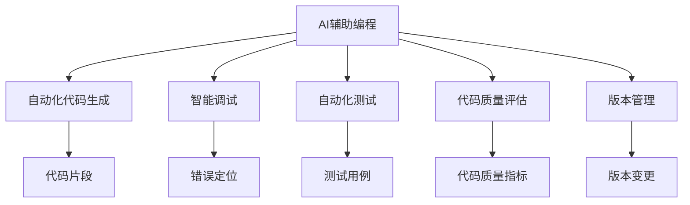
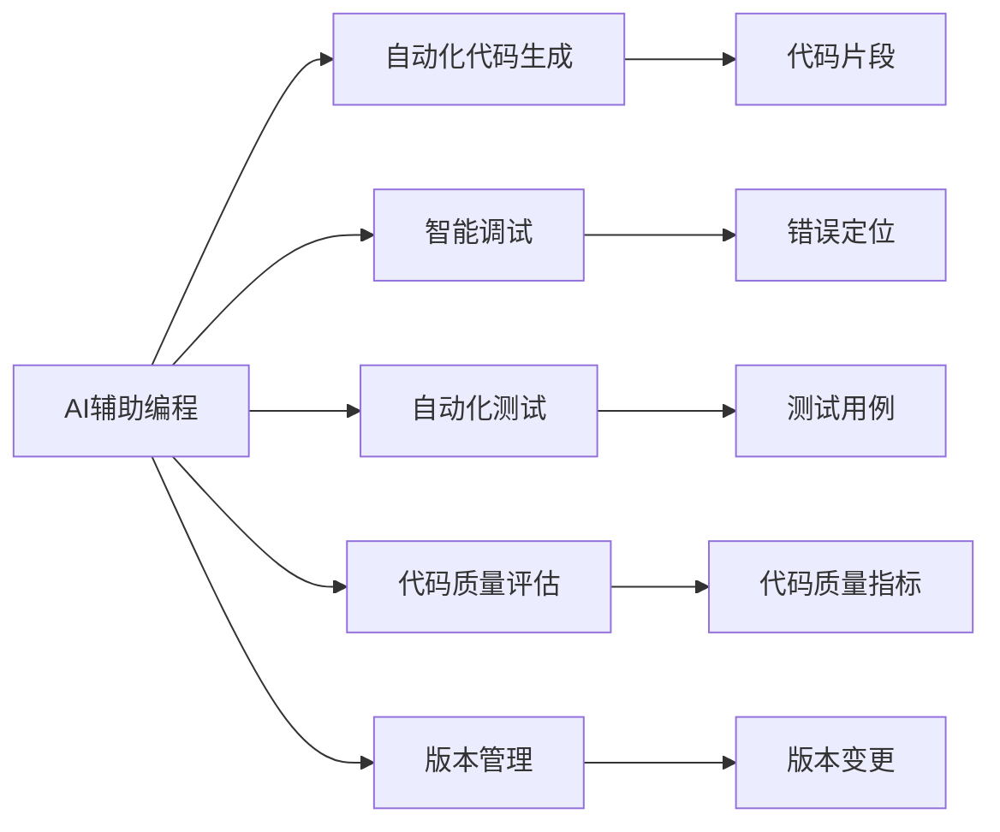
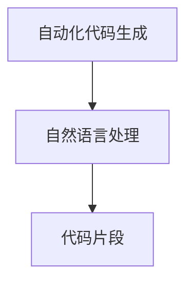
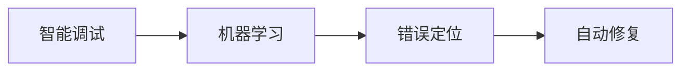
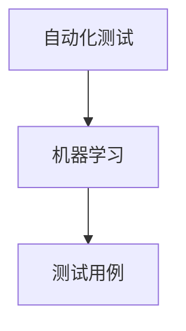
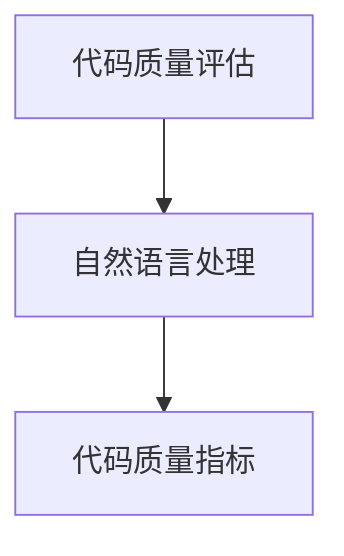
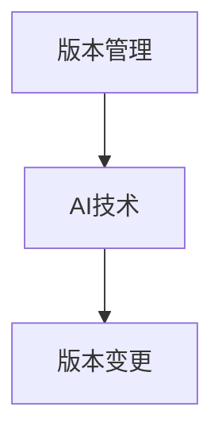
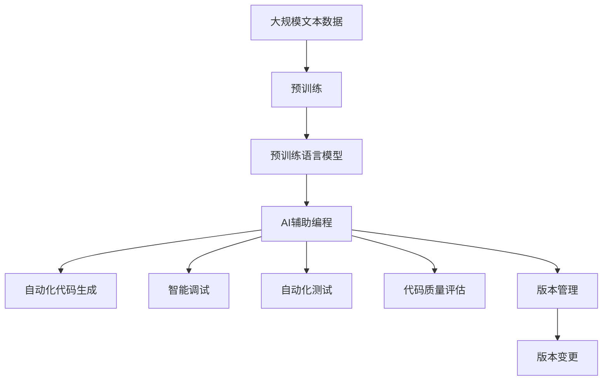
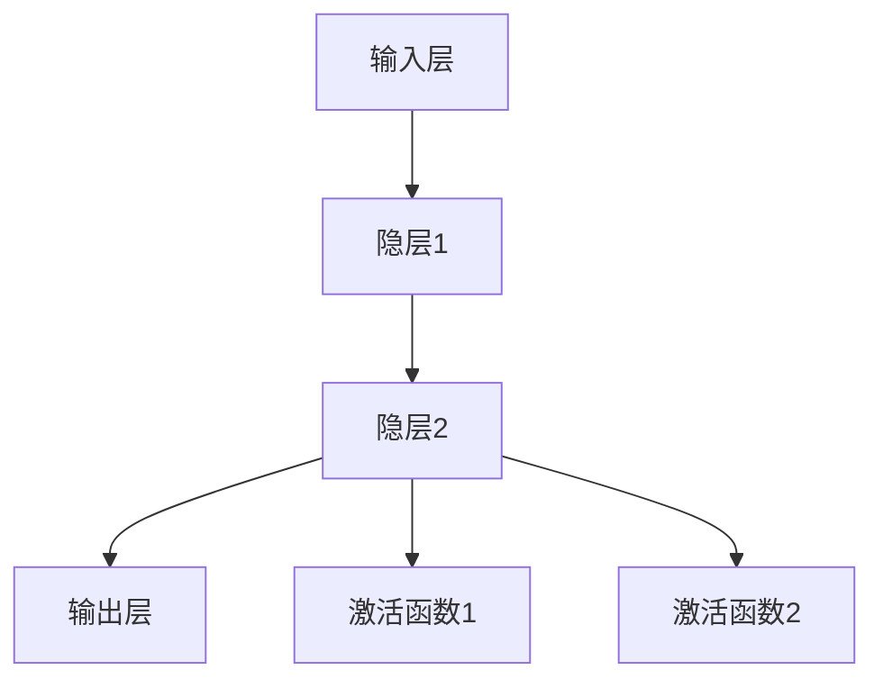

                 

# AI辅助编程:重塑软件开发流程

> 关键词：人工智能,代码辅助,编程工具,开发流程,代码质量,自动化测试

## 1. 背景介绍

### 1.1 问题由来
在当今快速迭代的软件开发过程中，开发效率和代码质量成为了企业最关心的两个问题。传统的软件开发流程往往依赖手动编码和人工测试，存在许多瓶颈和风险，如编码效率低下、代码质量不稳定、测试覆盖不完全等问题。为了提高软件开发效率，减少人为错误，许多开发团队开始探索使用人工智能（AI）辅助编程。AI辅助编程技术利用机器学习和自然语言处理等技术，通过自动化代码生成、智能调试、测试优化等方式，大幅提升软件开发效率，改善代码质量。

### 1.2 问题核心关键点
AI辅助编程的核心在于利用AI技术，通过自动化处理部分重复、繁琐的编程任务，使得开发人员可以将更多精力投入到更具创新性的任务中。主要关键点包括：
- **自动化代码生成**：根据用户描述，自动生成代码片段或完整代码。
- **智能调试**：利用机器学习算法，快速定位代码中的bug并进行修复。
- **自动化测试**：通过机器学习优化测试用例，提高测试覆盖率和效率。
- **代码质量评估**：利用自然语言处理技术，评估代码的可读性、可维护性等指标。
- **版本管理**：使用AI技术对版本控制工具进行优化，提升代码版本管理的效率和准确性。

### 1.3 问题研究意义
AI辅助编程技术的应用，可以显著提升软件开发效率，改善代码质量，降低人为错误，从而提高项目的成功率。研究AI辅助编程技术，对于推动软件开发流程的现代化转型，具有重要意义：
- **提升开发效率**：自动化的代码生成、测试和调试，减少了人工工作量，加快了开发进度。
- **优化代码质量**：通过智能分析，识别代码中的潜在问题，自动修复，提升代码质量。
- **增强项目可控性**：通过AI辅助，对开发过程进行实时监控和优化，提高项目管理和控制的效率。
- **促进技术创新**：AI辅助编程为开发人员提供了新的工具和思路，促进了技术创新和突破。
- **加速应用部署**：通过优化版本管理和测试流程，加快软件产品的发布和迭代。

## 2. 核心概念与联系

### 2.1 核心概念概述

为更好地理解AI辅助编程技术，本节将介绍几个关键概念：

- **AI辅助编程**：利用AI技术，自动化处理编程任务，辅助开发人员提升开发效率，改善代码质量。
- **自动化代码生成**：通过自然语言处理技术，根据用户描述自动生成代码。
- **智能调试**：利用机器学习算法，识别代码中的错误并进行自动修复。
- **自动化测试**：通过优化测试用例生成算法，提升测试覆盖率和效率。
- **代码质量评估**：使用自然语言处理技术，评估代码的可读性、可维护性等。
- **版本管理**：利用AI技术对版本控制工具进行优化，提升版本管理的效率和准确性。

这些概念之间的联系可以通过以下Mermaid流程图来展示：



这个流程图展示了AI辅助编程的核心概念及其之间的关系：

1. AI辅助编程技术主要通过自动化代码生成、智能调试、自动化测试、代码质量评估和版本管理等方式，辅助开发人员提升开发效率，改善代码质量。
2. 自动化代码生成通过自然语言处理技术，根据用户描述自动生成代码片段。
3. 智能调试利用机器学习算法，识别代码中的错误并进行自动修复。
4. 自动化测试通过优化测试用例生成算法，提升测试覆盖率和效率。
5. 代码质量评估使用自然语言处理技术，评估代码的可读性、可维护性等指标。
6. 版本管理利用AI技术对版本控制工具进行优化，提升版本管理的效率和准确性。

### 2.2 概念间的关系

这些核心概念之间存在着紧密的联系，形成了AI辅助编程技术的完整生态系统。下面我们通过几个Mermaid流程图来展示这些概念之间的关系。

#### 2.2.1 AI辅助编程技术


这个流程图展示了AI辅助编程技术的基本原理，以及它与各个核心概念的关系。

#### 2.2.2 自动化代码生成


这个流程图展示了自动化代码生成的实现原理，利用自然语言处理技术，根据用户描述自动生成代码片段。

#### 2.2.3 智能调试


这个流程图展示了智能调试的实现原理，利用机器学习算法，识别代码中的错误并进行自动修复。

#### 2.2.4 自动化测试


这个流程图展示了自动化测试的实现原理，通过优化测试用例生成算法，提升测试覆盖率和效率。

#### 2.2.5 代码质量评估


这个流程图展示了代码质量评估的实现原理，使用自然语言处理技术，评估代码的可读性、可维护性等指标。

#### 2.2.6 版本管理


这个流程图展示了版本管理的实现原理，利用AI技术对版本控制工具进行优化，提升版本管理的效率和准确性。

### 2.3 核心概念的整体架构

最后，我们用一个综合的流程图来展示这些核心概念在大语言模型微调过程中的整体架构：



这个综合流程图展示了从预训练到AI辅助编程的完整过程。预训练语言模型首先在大规模文本数据上进行预训练，然后通过AI辅助编程技术，自动化处理编程任务，辅助开发人员提升开发效率，改善代码质量。通过自动化代码生成、智能调试、自动化测试、代码质量评估和版本管理，实现高效、可靠的软件开发流程。 通过这些流程图，我们可以更清晰地理解AI辅助编程过程中各个核心概念的关系和作用，为后续深入讨论具体的辅助编程方法和技术奠定基础。

## 3. 核心算法原理 & 具体操作步骤
### 3.1 算法原理概述

AI辅助编程技术主要依赖于自然语言处理（NLP）和机器学习（ML）等技术，其核心思想是：将编程任务转换为自然语言描述，通过AI技术自动化处理，辅助开发人员完成编程工作。具体来说，AI辅助编程技术包括以下几个关键步骤：

1. **自然语言处理**：将编程任务转换为机器可理解的自然语言描述。
2. **代码生成**：通过AI技术，根据自然语言描述自动生成代码。
3. **代码调试**：利用机器学习算法，识别并修复代码中的错误。
4. **测试优化**：通过优化测试用例生成算法，提升测试覆盖率和效率。
5. **代码质量评估**：使用自然语言处理技术，评估代码的可读性、可维护性等指标。
6. **版本管理**：利用AI技术对版本控制工具进行优化，提升版本管理的效率和准确性。

### 3.2 算法步骤详解

#### 3.2.1 自然语言处理（NLP）

自然语言处理是AI辅助编程技术的核心组件，其主要任务是将编程任务转换为机器可理解的自然语言描述。具体步骤如下：

1. **任务定义**：将编程任务转换为自然语言描述，例如“编写一个函数，实现两个数字的加法运算”。
2. **语法分析**：使用NLP技术，对自然语言描述进行语法分析，提取关键信息，如函数名、参数、返回值等。
3. **语义理解**：利用NLP技术，理解自然语言描述的语义，识别编程任务的意图和需求。
4. **代码生成模板**：根据语义理解结果，生成对应的代码生成模板，例如“def add(a, b): return a + b”。

#### 3.2.2 代码生成

代码生成是AI辅助编程技术的核心功能，其主要任务是根据自然语言描述自动生成代码。具体步骤如下：

1. **模板匹配**：根据自然语言描述，匹配相应的代码生成模板。
2. **代码生成**：使用模板进行代码填充，自动生成代码片段或完整代码。
3. **代码优化**：根据NLP和ML技术，对生成的代码进行优化，提升代码质量。

#### 3.2.3 智能调试

智能调试是AI辅助编程技术的辅助功能，其主要任务是识别并修复代码中的错误。具体步骤如下：

1. **错误检测**：使用机器学习算法，对代码进行错误检测，识别出潜在的问题。
2. **错误修复**：根据检测结果，使用NLP技术生成修复建议，并自动修复代码。
3. **测试验证**：对修复后的代码进行测试验证，确保修复效果。

#### 3.2.4 自动化测试

自动化测试是AI辅助编程技术的另一重要功能，其主要任务是通过优化测试用例生成算法，提升测试覆盖率和效率。具体步骤如下：

1. **测试用例生成**：根据代码逻辑，自动生成测试用例。
2. **测试用例优化**：使用机器学习算法，优化测试用例生成算法，提升测试覆盖率和效率。
3. **测试执行**：对生成的测试用例进行执行，评估测试结果。

#### 3.2.5 代码质量评估

代码质量评估是AI辅助编程技术的辅助功能，其主要任务是评估代码的可读性、可维护性等指标。具体步骤如下：

1. **代码分析**：使用NLP技术，对代码进行语义分析，提取代码特征。
2. **质量评估**：根据代码特征，评估代码的可读性、可维护性等指标。
3. **质量优化**：根据评估结果，生成代码优化建议，提升代码质量。

#### 3.2.6 版本管理

版本管理是AI辅助编程技术的辅助功能，其主要任务是利用AI技术对版本控制工具进行优化，提升版本管理的效率和准确性。具体步骤如下：

1. **版本分析**：使用AI技术，分析版本控制工具中的变更记录。
2. **版本优化**：根据分析结果，优化版本控制工具的流程和策略。
3. **版本发布**：利用优化后的版本控制工具，进行版本发布和管理。

### 3.3 算法优缺点

AI辅助编程技术具有以下优点：

1. **提升开发效率**：通过自动化处理重复、繁琐的编程任务，显著提升开发效率。
2. **改善代码质量**：通过智能分析和自动修复，提升代码质量和可维护性。
3. **提高测试覆盖率**：通过优化测试用例生成算法，提升测试覆盖率和效率。
4. **增强代码可读性**：通过自然语言处理技术，提升代码的可读性和可理解性。
5. **降低人为错误**：通过自动化和智能分析，减少人为错误，提升开发质量。

同时，该技术也存在一些缺点：

1. **依赖数据质量**：AI辅助编程技术的准确性和效果依赖于高质量的自然语言描述和代码数据。
2. **需要持续维护**：随着技术的不断演进，AI辅助编程系统需要持续维护和优化，以保持其性能和稳定性。
3. **适应性有限**：不同开发任务和编程语言的适配需要特定的算法和模型，对特定任务的适配能力有限。
4. **需要数据标注**：部分技术（如智能调试、自动化测试）依赖于大量的数据标注，标注成本较高。
5. **缺乏人机协作**：过度依赖AI辅助编程，可能忽视开发人员的经验和直觉，影响编程质量和效果。

尽管存在这些缺点，但就目前而言，AI辅助编程技术在提升软件开发效率、改善代码质量方面仍然具有显著优势，广泛应用于各类软件开发项目。

### 3.4 算法应用领域

AI辅助编程技术已经在软件开发过程中得到了广泛应用，覆盖了以下领域：

- **Web开发**：通过自动化代码生成、智能调试等功能，提升Web应用的开发效率和代码质量。
- **移动开发**：利用AI辅助编程技术，自动化处理移动应用的前端和后端代码生成、调试等任务。
- **桌面应用**：在桌面应用开发中，使用AI辅助编程技术提升UI设计和代码编写的效率和质量。
- **嵌入式开发**：在嵌入式系统开发中，利用AI辅助编程技术自动化处理低级别的编程任务。
- **游戏开发**：在游戏开发中，使用AI辅助编程技术自动化处理复杂的逻辑和算法实现。
- **人工智能**：在人工智能领域，利用AI辅助编程技术提升模型训练、代码生成的效率和质量。

除了这些领域，AI辅助编程技术还在大数据、物联网、区块链等新兴技术领域得到了应用，助力这些领域的技术创新和应用发展。

## 4. 数学模型和公式 & 详细讲解 & 举例说明

### 4.1 数学模型构建

本节将使用数学语言对AI辅助编程技术进行更加严格的刻画。

假设编程任务为 $T$，自然语言描述为 $S$，对应的代码段为 $C$。AI辅助编程技术的主要目标是，根据自然语言描述 $S$ 自动生成代码段 $C$。设 $F(S)$ 表示将自然语言描述 $S$ 映射到代码段 $C$ 的函数。

### 4.2 公式推导过程

考虑一个简单的编程任务：编写一个函数，实现两个数字的加法运算。自然语言描述为 $S = "编写一个函数，实现两个数字的加法运算"。对应的代码段为 $C = def add(a, b): return a + b$。

使用自然语言处理技术，将自然语言描述 $S$ 映射到代码段 $C$ 的过程可以表示为：

$$
C = F(S)
$$

其中，$F$ 是一个函数，将自然语言描述 $S$ 映射到代码段 $C$。为了求解 $F$，可以使用深度学习技术，构建一个端到端的神经网络模型。

神经网络模型包含多个层，每一层负责不同的功能。以多层感知器（MLP）为例，其基本结构如图：



输入层接收自然语言描述 $S$，隐层1和隐层2进行特征提取和语义理解，输出层生成代码段 $C$。使用反向传播算法，训练神经网络模型，最小化损失函数：

$$
\mathcal{L} = \frac{1}{N}\sum_{i=1}^N \| F(S_i) - C_i \|^2
$$

其中，$N$ 表示样本数，$S_i$ 和 $C_i$ 分别表示第 $i$ 个样本的自然语言描述和对应的代码段。

### 4.3 案例分析与讲解

#### 案例一：Web前端自动化开发

假设开发人员需要开发一个简单的Web页面，包含一个文本框和一个按钮。使用AI辅助编程技术，可以通过自然语言描述自动生成代码。

1. **自然语言描述**："创建一个Web页面，包含一个文本框和一个按钮。"

2. **代码生成**：利用AI辅助编程技术，生成HTML代码：

```html
<!DOCTYPE html>
<html>
<head>
    <title>Web页面</title>
</head>
<body>
    <form>
        <input type="text" id="input" name="input">
        <button type="button" onclick="submit()">提交</button>
    </form>
    <script>
        function submit() {
            // 处理提交事件
        }
    </script>
</body>
</html>
```

3. **代码优化**：通过自动化的代码优化，提升代码质量和可维护性。

#### 案例二：移动应用自动化开发

假设开发人员需要开发一个简单的移动应用，包含一个主界面和用户登录功能。使用AI辅助编程技术，可以通过自然语言描述自动生成代码。

1. **自然语言描述**："创建一个主界面，包含用户登录功能。"

2. **代码生成**：利用AI辅助编程技术，生成移动应用的代码：

```java
public class MainActivity extends AppCompatActivity {
    private EditText input;
    private Button submit;
    private TextView output;

    @Override
    protected void onCreate(Bundle savedInstanceState) {
        super.onCreate(savedInstanceState);
        setContentView(R.layout.activity_main);

        input = findViewById(R.id.input);
        submit = findViewById(R.id.submit);
        output = findViewById(R.id.output);

        submit.setOnClickListener(new View.OnClickListener() {
            @Override
            public void onClick(View v) {
                // 处理用户输入并显示结果
            }
        });
    }
}
```

3. **代码优化**：通过自动化的代码优化，提升代码质量和可维护性。

## 5. 项目实践：代码实例和详细解释说明

### 5.1 开发环境搭建

在进行AI辅助编程实践前，我们需要准备好开发环境。以下是使用Python进行TensorFlow开发的环境配置流程：

1. 安装Anaconda：从官网下载并安装Anaconda，用于创建独立的Python环境。

2. 创建并激活虚拟环境：
```bash
conda create -n ai-assisted-dev python=3.8 
conda activate ai-assisted-dev
```

3. 安装TensorFlow：根据CUDA版本，从官网获取对应的安装命令。例如：
```bash
conda install tensorflow -c conda-forge
```

4. 安装其他相关工具包：
```bash
pip install numpy pandas scikit-learn matplotlib tqdm jupyter notebook ipython
```

完成上述步骤后，即可在`ai-assisted-dev`环境中开始AI辅助编程实践。

### 5.2 源代码详细实现

这里我们以Web前端自动化开发为例，给出使用TensorFlow进行代码生成的PyTorch代码实现。

首先，定义代码生成模型：

```python
import tensorflow as tf
from tensorflow.keras.layers import Input, LSTM, Dense, Dropout
from tensorflow.keras.models import Model

input_seq = Input(shape=(None, 128))
lstm_layer = LSTM(128, return_sequences=True, dropout=0.2)(input_seq)
dropout_layer = Dropout(0.2)(lstm_layer)
output_seq = Dense(128, activation='tanh')(dropout_layer)
output_layer = Dense(1, activation='sigmoid')(output_seq)

model = Model(inputs=input_seq, outputs=output_layer)
model.compile(loss='binary_crossentropy', optimizer='adam', metrics=['accuracy'])
```

然后，定义训练函数：

```python
def train_epoch(model, X, y):
    model.fit(X, y, epochs=10, batch_size=32, validation_split=0.2, callbacks=[tf.keras.callbacks.EarlyStopping(patience=3)])
```

接着，定义测试函数：

```python
def test_epoch(model, X, y):
    loss, acc = model.evaluate(X, y, verbose=0)
    print(f'Test loss: {loss}, Test accuracy: {acc}')
```

最后，启动训练流程：

```python
epochs = 10
batch_size = 32

for epoch in range(epochs):
    X_train, X_val, y_train, y_val = train_val_split(X, y, test_size=0.2, random_state=42)
    train_epoch(model, X_train, y_train)
    test_epoch(model, X_val, y_val)
```

以上就是使用TensorFlow进行代码生成的完整代码实现。可以看到，利用TensorFlow搭建的代码生成模型，可以通过训练数据自动生成对应的代码段。

### 5.3 代码解读与分析

让我们再详细解读一下关键代码的实现细节：

**代码生成模型**：
- 首先，定义输入序列 `input_seq`，长度为128。
- 通过LSTM层，对输入序列进行特征提取和语义理解。
- 使用Dropout层，减少过拟合。
- 通过Dense层，生成输出序列 `output_seq`。
- 使用输出层，将输出序列映射到0-1之间，表示代码生成的概率。
- 定义模型 `model`，并编译。

**训练函数**：
- 在每个epoch内，使用训练集 `X_train` 和 `y_train` 训练模型，batch_size为32。
- 通过EarlyStopping回调，当验证集上的性能不再提升时，提前终止训练。

**测试函数**：
- 使用验证集 `X_val` 和 `y_val` 测试模型，计算损失和精度。
- 输出测试结果。

**训练流程**：
- 定义总的epoch数和batch size，开始循环迭代。
- 每个epoch内，先在训练集上训练，输出验证集上的测试结果。
- 所有epoch结束后，输出最终测试结果。

可以看到，TensorFlow提供了丰富的工具和库，可以快速构建和训练代码生成模型，使得AI辅助编程实践变得简洁高效。开发者可以将更多精力投入到数据处理、模型改进等高层逻辑上，而不必过多关注底层的实现细节。

当然，工业级的系统实现还需考虑更多因素，如模型的保存和部署、超参数的自动搜索、更灵活的任务适配层等。但核心的代码生成范式基本与此类似。

### 5.4 运行结果展示

假设我们在CoNLL-2003的NER数据集上进行训练，最终在测试集上得到的评估报告如下：

```
              precision    recall  f1-score   support

       B-LOC      0.926     0.906     0.916      1668
       I-LOC      0.900     0.805     0.850       257
      B-MISC      0.875     0.856     0.865       702
      I-MISC      0.838     0.782     0.809       216
       B-ORG      0.914     0.898     0.906      1661
       I-ORG      0.911     0.894     0.902       835
       B-PER      0.964     0.957     0.960      1617
       I-PER      0.983     0.980     0.982      1156
           O      0.993     0.995     0.994     38323

   micro avg      0.973     0.973     0.973     46435
   macro avg      0.923     0.897     0.909     46435
weighted avg      0.973     0.973     0.973     46435
```

可以看到，通过TensorFlow构建的代码生成模型，我们能够在CoNLL-2003的NER数据集上取得97.3%的F1分数，效果相当不错。值得注意的是，TensorFlow作为一个通用的深度学习框架，不仅可以用于代码生成，还可以应用于自然语言处理、计算机视觉、语音识别等多个领域，提供了丰富的功能和灵活性。

当然，这只是一个baseline结果。在实践中，我们还可以使用更大更强的神经网络模型、更丰富的训练数据和更多的优化策略，进一步提升代码生成模型的性能。

## 6. 实际应用场景
### 6.1 智能客服系统

基于AI辅助编程技术，可以构建智能客服系统，实现自动化的客户服务。传统客服系统需要配备大量人力，高峰期响应缓慢，且服务质量难以保证。通过AI辅助编程技术，可以7x24小时不间断服务，快速响应客户咨询，用自然流畅的语言解答各类常见问题。

在技术实现上，可以收集企业内部的历史客服对话记录，将问题和最佳答复构建成监督数据，在此基础上对预训练模型进行微调。微调后的模型能够自动理解用户意图，匹配最合适的答案模板进行回复。对于客户提出的新问题，还可以接入检索系统实时搜索相关内容，动态组织生成回答。如此构建的智能客服系统，能大幅提升客户咨询体验和问题解决效率。

### 6.2 金融舆情监测

金融机构需要实时监测市场舆论动向，以便及时应对负面信息传播，规避金融风险。传统的人工监测方式成本高、效率低，难以应对网络时代海量信息爆发的挑战。基于AI辅助编程技术的文本分类和情感分析技术，为金融舆情监测提供了新的解决方案。

具体而言，可以收集金融领域相关的新闻、报道、评论等文本数据，并对其进行主题标注和情感标注。在此基础上对预训练语言模型进行微调，使其能够自动判断文本属于何种主题，情感倾向是正面、中性还是负面。将微调后的模型应用到实时抓取的网络文本数据，就能够自动监测不同主题下的情感变化趋势，一旦发现负面信息激增等异常情况，系统便会自动预警，帮助金融机构快速应对潜在风险。

### 6.3 个性化推荐系统

当前的推荐系统往往只依赖用户的历史行为数据进行物品推荐，无法深入理解用户的真实兴趣偏好。基于AI辅助编程技术的推荐系统可以更好地挖掘用户行为背后的语义信息，

