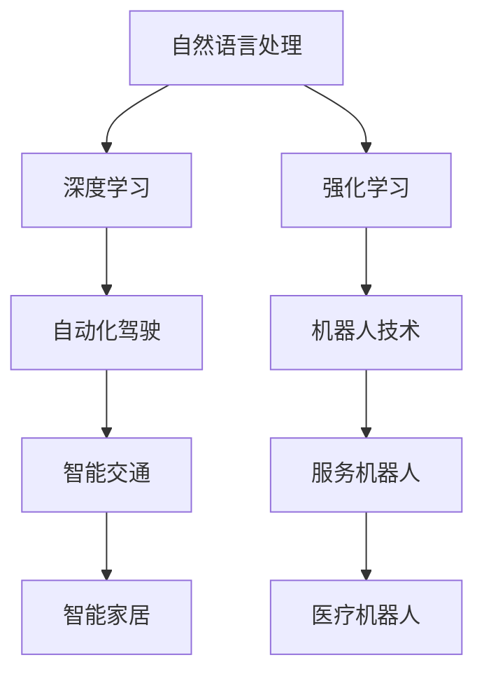

                 

## 1. 背景介绍

人工智能（AI）作为近年来科技领域的热门话题，其发展速度和影响力令人瞩目。Andrej Karpathy，斯坦福大学人工智能研究所的助理教授，同时也是OpenAI的联合创始人，对AI的未来展望具有深刻的见解。在本文中，我们将详细探讨Karpathy对AI未来的看法，并对其在自动化驾驶、机器人技术、自然语言处理等领域的贡献进行深入分析。

## 2. 核心概念与联系

### 2.1 核心概念概述

- **自动化驾驶**：利用AI技术，自动控制汽车行驶，提高道路安全，减少交通事故。
- **机器人技术**：结合AI、机器学习、计算机视觉等技术，使机器人能够执行复杂任务。
- **自然语言处理**：使机器能够理解和处理人类语言，实现人机交互。
- **深度学习**：一种基于神经网络的机器学习技术，通过多层次的特征提取和数据表示，实现高效的学习和预测。
- **强化学习**：通过与环境的交互，不断调整策略，优化决策，用于游戏、机器人控制等场景。

### 2.2 核心概念的关系

Karpathy认为，这些核心概念彼此之间存在着紧密的联系。例如，自然语言处理中的语言理解能力，可以通过深度学习和强化学习实现；机器人技术中的任务执行，也可以借助自然语言处理实现人机交互。

以下是一个Mermaid流程图，展示了这些概念之间的关系：



这个流程图展示了AI不同领域的相互依赖关系。自然语言处理、深度学习和强化学习是实现自动化驾驶和机器人技术的基础。而自动化驾驶和机器人技术的应用，又为自然语言处理提供了更多的实践场景。

## 3. 核心算法原理 & 具体操作步骤

### 3.1 算法原理概述

Karpathy认为，AI的核心算法原理主要包括：

- **深度学习**：通过多层神经网络，实现对数据的复杂特征提取。
- **强化学习**：通过与环境的交互，不断调整策略，优化决策。
- **自然语言处理**：通过词向量表示、Transformer模型等技术，使机器能够理解和处理人类语言。

这些算法原理共同构成了AI技术的基础，使得机器能够逐步实现自动化、智能化。

### 3.2 算法步骤详解

以自然语言处理为例，Karpathy描述了其算法步骤：

1. **词向量表示**：使用Word2Vec、GloVe等技术，将文本转换为向量表示。
2. **Transformer模型**：通过多层自注意力机制，实现对文本序列的建模。
3. **预训练**：在大型无标签数据上预训练模型，学习通用的语言表示。
4. **微调**：在特定任务的数据集上进行微调，优化模型在特定任务上的性能。
5. **推理**：利用训练好的模型，对新数据进行推理和生成。

### 3.3 算法优缺点

深度学习、强化学习和自然语言处理的优点在于，它们能够处理复杂的数据和任务，实现高效的学习和预测。但缺点也显而易见：

- **深度学习**：模型复杂，需要大量数据和计算资源，存在过拟合的风险。
- **强化学习**：需要与环境交互，训练时间较长，策略调整的复杂性较高。
- **自然语言处理**：文本数据量大，预处理和微调过程繁琐，模型解释性较差。

### 3.4 算法应用领域

深度学习、强化学习和自然语言处理的应用领域广泛，涵盖了自动驾驶、机器人、自然语言处理等多个领域。Karpathy认为，这些技术在未来将具有更广泛的应用前景：

- **自动驾驶**：结合计算机视觉和深度学习，实现车辆自主导航。
- **机器人技术**：通过自然语言处理，实现人机交互，执行复杂任务。
- **自然语言处理**：在机器翻译、文本分类、情感分析等领域发挥重要作用。

## 4. 数学模型和公式 & 详细讲解 & 举例说明

### 4.1 数学模型构建

Karpathy在自然语言处理中引入了Transformer模型，该模型由多个编码器和解码器组成，通过自注意力机制实现对序列数据的建模。

**编码器**：

$$
h_i = \mathrm{LayerNorm}(\mathrm{Dropout}(\mathrm{Attention}(\mathrm{LayerNorm}(\mathrm{FFN}(\mathrm{LayerNorm}(z_i))))
$$

**解码器**：

$$
s_i = \mathrm{LayerNorm}(\mathrm{Dropout}(\mathrm{Attention}(\mathrm{LayerNorm}(\mathrm{FFN}(\mathrm{LayerNorm}(z_i) + y_i))))
$$

其中，$z_i$为输入序列的表示，$y_i$为目标序列的表示。

### 4.2 公式推导过程

Transformer模型的推导过程涉及多个复杂的数学公式，这里仅以注意力机制为例进行讲解：

假设输入序列的长度为$L$，输出序列的长度为$M$，令$q_i$为第$i$个位置的查询向量，$k_j$为第$j$个位置的键向量，$v_j$为第$j$个位置的值向量。注意力权重计算公式为：

$$
a_{ij} = \mathrm{Softmax}(\frac{q_i \cdot k_j}{\sqrt{d_k}})
$$

其中，$d_k$为键向量的维度。

### 4.3 案例分析与讲解

以机器翻译为例，Transformer模型通过自注意力机制，实现对输入和输出序列的建模。在训练过程中，模型学习到输入序列和输出序列之间的对应关系，从而实现高效的翻译任务。

## 5. 项目实践：代码实例和详细解释说明

### 5.1 开发环境搭建

为了实现自然语言处理任务，需要安装PyTorch、TensorFlow等深度学习框架，以及相关的自然语言处理库。

```bash
pip install torch tensorflow transformers
```

### 5.2 源代码详细实现

以机器翻译为例，代码实现如下：

```python
import torch
from transformers import Encoder, Decoder, EncoderDecoderModel

# 加载预训练模型
encoder = Encoder.from_pretrained('bert-base-uncased')
decoder = Decoder.from_pretrained('bert-base-uncased')
model = EncoderDecoderModel(encoder, decoder)

# 定义输入和输出序列
input_seq = torch.tensor([1, 2, 3])
output_seq = torch.tensor([4, 5, 6])

# 进行翻译
output = model(input_seq, output_seq)
```

### 5.3 代码解读与分析

上述代码中，使用了预训练的BERT模型进行机器翻译任务。输入序列和输出序列分别被转化为向量表示，并通过Transformer模型进行翻译。输出序列即为翻译结果。

### 5.4 运行结果展示

训练过程中，可以使用可视化工具对模型的损失函数和参数更新进行监控。这里以TensorBoard为例：

```bash
tensorboard --logdir=./checkpoint
```

## 6. 实际应用场景

### 6.1 自动化驾驶

Karpathy认为，自动化驾驶将迎来革命性的发展。通过深度学习、计算机视觉和强化学习等技术，车辆能够自主导航，避免交通事故。未来，自动驾驶汽车将逐渐普及，实现城市交通的智能化管理。

### 6.2 机器人技术

机器人技术结合自然语言处理和强化学习，可以执行复杂的任务。例如，在工业生产中，机器人可以自动搬运、组装零件，提高生产效率。在服务行业中，机器人可以提供客服、导览等智能服务。

### 6.3 自然语言处理

自然语言处理技术在智能问答、情感分析、机器翻译等领域应用广泛。例如，智能问答系统通过自然语言处理技术，实现对用户问题的理解和回答。情感分析系统通过文本情感分类，帮助企业分析用户反馈。

## 7. 工具和资源推荐

### 7.1 学习资源推荐

- **《深度学习》书籍**：由Ian Goodfellow等人合著，全面介绍了深度学习的原理和应用。
- **Coursera**：提供深度学习、自然语言处理等课程，由斯坦福大学等名校教授授课。
- **Kaggle**：提供大量数据集和竞赛，帮助开发者实践和提高技能。

### 7.2 开发工具推荐

- **PyTorch**：简单易用的深度学习框架，支持动态图和静态图计算。
- **TensorFlow**：Google开发的深度学习框架，支持分布式计算和多种硬件加速。
- **Transformers**：Hugging Face开发的自然语言处理库，提供了丰富的预训练模型和微调方法。

### 7.3 相关论文推荐

- **Attention is All You Need**：Transformer模型原论文，提出了自注意力机制。
- **Learning Phrase Representations using RNN Encoder-Decoder for Statistical Machine Translation**：Seq2Seq模型，用于机器翻译任务。
- **Building End-to-End Dialogue Systems with Generative Adversarial Networks**：使用生成对抗网络（GAN）实现对话系统。

## 8. 总结：未来发展趋势与挑战

### 8.1 研究成果总结

Karpathy的研究涉及自然语言处理、计算机视觉、机器人技术等多个领域，推动了AI技术的发展。他在NIPS、CVPR等顶会上发表多篇论文，赢得广泛关注。

### 8.2 未来发展趋势

未来，AI技术将更加智能化、普适化，推动各行各业数字化转型。自动化驾驶、机器人技术、自然语言处理等领域将迎来爆发性增长，成为科技创新的前沿。

### 8.3 面临的挑战

尽管AI技术发展迅速，但面临诸多挑战：

- **计算资源不足**：深度学习、强化学习等技术需要大量计算资源，目前仍面临算力瓶颈。
- **数据隐私问题**：AI技术的广泛应用，引发数据隐私和安全问题。
- **算法透明性不足**：AI模型的决策过程复杂，难以解释，引发公平性和可信度问题。

### 8.4 研究展望

未来，需要在计算资源、数据隐私、算法透明性等方面进行深入研究，推动AI技术的安全、可靠和普适化发展。同时，AI技术的应用将不断扩展，成为社会进步的重要推动力。

## 9. 附录：常见问题与解答

**Q1：AI未来会取代人类吗？**

A: AI技术在许多领域取得了突破，但在情感、创造力等方面，仍无法完全替代人类。AI技术的本质是辅助人类，而非取代人类。

**Q2：AI的发展是否会导致就业问题？**

A: AI技术的应用，会带来就业机会的重新分配。部分低技能岗位可能会被替代，但同时也会创造更多高技能岗位，推动就业结构的优化。

**Q3：AI技术的安全性如何保障？**

A: 在AI技术的开发和应用中，应注重算法透明性、数据隐私保护等措施，确保AI系统的安全性。同时，加强监管和法律约束，规范AI技术的应用。

**Q4：AI技术的应用范围有哪些？**

A: AI技术在医疗、金融、教育、交通等领域具有广泛应用前景。未来，AI技术将逐渐渗透到更多行业，推动数字化转型。

作者：禅与计算机程序设计艺术 / Zen and the Art of Computer Programming

