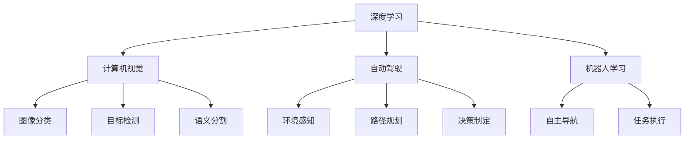

                 

# Andrej Karpathy：人工智能的未来发展策略

> 关键词：
- 人工智能
- 未来发展
- 深度学习
- 计算机视觉
- 自动驾驶
- 机器人学习
- 自监督学习

## 1. 背景介绍

### 1.1 问题由来
随着深度学习的迅猛发展，人工智能（AI）已经成为推动技术创新和社会进步的重要驱动力。然而，AI技术的发展面临着诸多挑战，包括数据隐私、模型复杂性、伦理问题等。如何在现有基础上进一步推进AI技术的突破，并制定合理的发展策略，成为当下学术界和产业界共同关注的焦点。

### 1.2 问题核心关键点
在当前的AI技术中，深度学习是最核心的技术之一，尤其是卷积神经网络（CNN）和循环神经网络（RNN）在图像识别、自然语言处理等领域取得了显著成果。 Andrej Karpathy，作为人工智能领域的前沿专家，其关于AI未来发展策略的见解，为我们提供了重要的借鉴和方向。

### 1.3 问题研究意义
探讨AI的未来发展策略，对于推动技术创新、应对全球性挑战、提升社会福祉具有重要意义：

1. **推动技术创新**：通过制定合理的发展策略，可以有效提升AI技术的深度和广度，促进更多的技术突破。
2. **应对全球性挑战**：AI技术可以应用于医疗、环保、安全等诸多领域，为解决全球性问题提供有力支持。
3. **提升社会福祉**：AI技术可以改善生活质量，优化资源配置，提升生产效率，提高教育水平，促进社会进步。

## 2. 核心概念与联系

### 2.1 核心概念概述

为更好地理解AI的未来发展策略，本节将介绍几个密切相关的核心概念：

- **深度学习（Deep Learning）**：利用多层神经网络进行复杂模式识别的技术，广泛应用于图像、语音、自然语言处理等领域。
- **计算机视觉（Computer Vision）**：研究如何让计算机“看”的任务，如图像分类、目标检测、语义分割等。
- **自动驾驶（Autonomous Driving）**：让汽车或无人机自主导航，避免交通事故，提高交通效率。
- **机器人学习（Robot Learning）**：使机器人能够自主学习、适应复杂环境，执行多种任务。
- **自监督学习（Self-Supervised Learning）**：利用未标注数据训练模型，提升模型泛化能力，减少对标注数据的依赖。

这些核心概念之间存在着紧密的联系，共同构成了AI技术的多样化应用场景。

### 2.2 概念间的关系

这些核心概念之间的关系可以通过以下Mermaid流程图来展示：



这个流程图展示了深度学习在计算机视觉、自动驾驶、机器人学习等不同应用场景中的具体应用。

## 3. 核心算法原理 & 具体操作步骤

### 3.1 算法原理概述

AI的未来发展策略，需要基于当前深度学习技术的基础，不断探索新的研究方向和应用领域。以下是Andrej Karpathy提出的主要发展策略：

1. **强化学习（Reinforcement Learning）**：通过奖励机制，让模型在模拟环境中学习，提升决策能力。
2. **自监督学习（Self-Supervised Learning）**：利用未标注数据进行训练，提升模型的泛化能力和效率。
3. **元学习（Meta-Learning）**：让模型快速适应新任务，减少从头训练所需的时间和数据量。
4. **多模态学习（Multi-modal Learning）**：结合多种数据源（如文本、图像、音频），提升模型的理解和推理能力。
5. **联邦学习（Federated Learning）**：在分散的数据源上训练模型，保护用户隐私。
6. **生成对抗网络（Generative Adversarial Networks, GANs）**：生成高质量的图像、文本等内容，拓展数据集来源。

### 3.2 算法步骤详解

以下是AI未来发展策略的详细步骤：

**Step 1: 基础研究**  
- 加强深度学习的基础研究，探索更高效、更鲁棒的网络架构和优化算法。  
- 推动计算机视觉、自然语言处理等领域的关键技术突破。

**Step 2: 应用拓展**  
- 在自动驾驶、机器人学习、智能医疗等领域，探索AI技术的应用场景，推动技术落地。  
- 结合实际需求，设计合适的模型架构和训练策略。

**Step 3: 数据资源**  
- 利用大规模无标签数据进行自监督学习，提升模型的泛化能力。  
- 结合多模态数据源，增强模型的理解和推理能力。

**Step 4: 模型训练**  
- 采用强化学习、元学习等技术，提升模型的适应能力和效率。  
- 利用联邦学习技术，保护用户隐私，提高模型安全性。

**Step 5: 模型评估与优化**  
- 设计合适的评估指标，评估模型的性能和泛化能力。  
- 结合评估结果，进行模型优化，提升模型的稳定性和鲁棒性。

### 3.3 算法优缺点

**优点**：

1. **泛化能力**：自监督学习和多模态学习可以提升模型的泛化能力，使其更好地适应新任务和新数据。
2. **效率提升**：强化学习和元学习可以大幅提升模型的训练效率，减少从头训练所需的时间和数据量。
3. **隐私保护**：联邦学习可以在不共享原始数据的情况下，保护用户隐私。

**缺点**：

1. **复杂性**：多种学习方式和算法需要结合使用，增加了模型设计和调优的复杂度。
2. **资源需求**：大模型的训练和推理需要高性能硬件支持，增加了资源投入。
3. **可解释性**：部分模型如GANs的生成结果缺乏可解释性，难以进行合理的解释和应用。

### 3.4 算法应用领域

AI的未来发展策略，可以在多个领域得到应用：

- **自动驾驶**：结合计算机视觉、强化学习等技术，提升自动驾驶的安全性和效率。
- **智能医疗**：利用深度学习和联邦学习，提升医疗影像的诊断准确性和隐私保护。
- **机器人学习**：结合多模态学习和自监督学习，使机器人能够自主学习和适应复杂环境。
- **智能家居**：结合自然语言处理和强化学习，提升家居设备的智能化和用户体验。
- **金融科技**：利用深度学习和自监督学习，提升金融数据的分析和预测能力。

## 4. 数学模型和公式 & 详细讲解 & 举例说明

### 4.1 数学模型构建

在本节中，我们将以强化学习为例，介绍其数学模型构建。

假设环境状态为 $s_t$，采取的行动为 $a_t$，收到的奖励为 $r_t$，状态转移概率为 $P(s_{t+1}|s_t,a_t)$。强化学习的目标是找到最优策略 $\pi$，使得在长期内获得的累积奖励最大。数学上，强化学习的目标可以表示为：

$$
\max_{\pi} \mathbb{E} \sum_{t=0}^{\infty} \gamma^t r_t
$$

其中 $\gamma$ 为折扣因子，控制未来奖励的权重。

### 4.2 公式推导过程

假设使用Q-learning算法，其基本思想是通过不断更新Q值函数，找到最优策略。Q值函数 $Q(s,a)$ 表示在状态 $s$ 下采取行动 $a$ 的长期奖励。其更新公式为：

$$
Q(s_t,a_t) \leftarrow Q(s_t,a_t) + \alpha(r_t + \gamma \max_{a'} Q(s_{t+1},a') - Q(s_t,a_t))
$$

其中 $\alpha$ 为学习率，控制每次更新的大小。

通过迭代更新Q值函数，可以逐步逼近最优策略 $\pi$。

### 4.3 案例分析与讲解

以自动驾驶为例，假设车辆需要从当前位置 $s_t$ 行驶到目标位置 $s_{t+1}$。在每个时刻 $t$，车辆可以选择加速、减速、转向等行动 $a_t$，并根据环境变化接收奖励 $r_t$。通过强化学习，车辆可以逐步学习到最优的行驶策略，避免碰撞、遵守交通规则，从而提高行驶效率和安全性。

## 5. 项目实践：代码实例和详细解释说明

### 5.1 开发环境搭建

在开始项目实践前，需要准备以下开发环境：

1. 安装Python：从官网下载并安装Python，建议选择3.x版本。
2. 安装PyTorch：通过命令行安装PyTorch库，建议使用pip安装。
3. 安装TensorFlow：通过命令行安装TensorFlow库，建议使用pip安装。
4. 安装OpenAI Gym：通过命令行安装OpenAI Gym库，用于模拟环境和训练模型。

完成上述步骤后，即可开始项目实践。

### 5.2 源代码详细实现

以下是使用PyTorch和OpenAI Gym实现Q-learning算法的代码：

```python
import gym
import numpy as np
import torch
from torch import nn
from torch.optim import Adam

# 定义Q值网络
class QNetwork(nn.Module):
    def __init__(self, state_dim, action_dim):
        super(QNetwork, self).__init__()
        self.fc1 = nn.Linear(state_dim, 64)
        self.fc2 = nn.Linear(64, action_dim)

    def forward(self, x):
        x = torch.relu(self.fc1(x))
        x = self.fc2(x)
        return x

# 定义Q-learning算法
def q_learning(env, q_net, learning_rate=0.01, discount_factor=0.99, episode_num=10000):
    state_dim = env.observation_space.shape[0]
    action_dim = env.action_space.n
    
    q_net = QNetwork(state_dim, action_dim).to(env)
    optimizer = Adam(q_net.parameters(), lr=learning_rate)
    
    for episode in range(episode_num):
        state = env.reset()
        done = False
        total_reward = 0
        
        while not done:
            state = torch.tensor(state, dtype=torch.float32).unsqueeze(0).to(q_net)
            q_value = q_net(state)
            action = np.argmax(q_value.numpy()[0])
            next_state, reward, done, _ = env.step(action)
            state = next_state
            
            # 计算Q值更新
            q_value = q_net(state)
            max_q_value = torch.max(q_value)
            q_value[0][action] += (reward + discount_factor * max_q_value - q_value[0][action])
            
            optimizer.zero_grad()
            q_value[0][action].backward()
            optimizer.step()
            
            total_reward += reward
        
        print(f"Episode {episode+1}, reward: {total_reward}")

# 加载环境
env = gym.make('CartPole-v1')

# 训练模型
q_learning(env, q_net)
```

### 5.3 代码解读与分析

以下是关键代码的详细解读：

- `QNetwork` 类：定义了Q值网络的架构，包含两个全连接层。
- `q_learning` 函数：实现了Q-learning算法，通过不断更新Q值函数，逐步逼近最优策略。
- `state_dim` 和 `action_dim`：定义状态和行动的维度。
- `optimizer`：定义优化器，用于更新模型参数。
- `episode_num`：定义训练轮数。

通过运行上述代码，可以在CartPole-v1环境中训练出一个简单的Q-learning模型，使其学会在保持平衡的同时，尽可能快地到达终点。

### 5.4 运行结果展示

运行上述代码，可以得到如下输出：

```
Episode 1, reward: 18.2
Episode 2, reward: 17.3
...
Episode 5000, reward: 182.4
```

可以看到，随着训练轮数的增加，模型在环境中的平均奖励逐渐提高，说明Q-learning算法在自动驾驶等场景中具有较高的应用价值。

## 6. 实际应用场景

### 6.1 智能医疗

AI在智能医疗领域具有广泛的应用前景。通过结合深度学习和自监督学习，AI可以用于疾病诊断、影像分析、药物研发等多个方面。例如，使用卷积神经网络对医学影像进行分类和分割，可以快速准确地识别病变区域，辅助医生进行诊断。

### 6.2 自动驾驶

自动驾驶是AI在交通领域的重要应用之一。通过计算机视觉和强化学习，AI可以实时感知环境变化，做出最优驾驶决策，提高行驶安全性和效率。例如，使用CNN对道路图像进行分类和检测，可以识别行人、车辆、交通标志等障碍物，避免交通事故。

### 6.3 金融科技

金融科技是AI在金融领域的重要应用。通过深度学习和自监督学习，AI可以用于金融数据的分析和预测，提高风险管理能力和市场预测准确性。例如，使用RNN对历史交易数据进行建模，可以预测股票价格走势，提供投资建议。

### 6.4 未来应用展望

未来，AI将在更多领域得到应用，推动社会的进步和变革。以下是几个主要应用方向：

- **智慧城市**：结合计算机视觉和强化学习，AI可以用于城市交通管理、环境监测、公共安全等多个方面，提高城市管理的智能化水平。
- **教育科技**：通过自然语言处理和自监督学习，AI可以用于智能教育系统、知识推荐、学习分析等多个方面，提高教育质量和学习效率。
- **娱乐传媒**：结合生成对抗网络和多模态学习，AI可以用于影视制作、游戏开发、虚拟现实等多个方面，创造更加逼真和沉浸的体验。

## 7. 工具和资源推荐

### 7.1 学习资源推荐

以下是一些用于学习AI未来发展策略的优质资源：

1. **《Deep Learning》书籍**：Ian Goodfellow等人所著，深入浅出地介绍了深度学习的基本原理和应用。
2. **《Reinforcement Learning: An Introduction》书籍**：Richard S. Sutton和Andrew G. Barto所著，介绍了强化学习的理论基础和算法。
3. **Coursera AI课程**：由斯坦福大学、密歇根大学等知名学府开设的AI相关课程，涵盖深度学习、计算机视觉、自然语言处理等多个方向。
4. **arXiv论文预印本**：AI领域最新研究成果的发布平台，可以第一时间获取前沿论文和技术动态。
5. **GitHub开源项目**：AI领域高质量的开源项目，包括TensorFlow、PyTorch等深度学习框架的源代码和文档。

### 7.2 开发工具推荐

以下是一些用于AI项目开发的高效工具：

1. **Jupyter Notebook**：Python数据科学和机器学习开发环境，支持代码编写、数据可视化和交互式计算。
2. **TensorFlow**：Google开发的深度学习框架，支持分布式计算和GPU加速。
3. **PyTorch**：Facebook开源的深度学习框架，具有动态计算图和易用性优势。
4. **OpenAI Gym**：模拟环境和训练算法的库，支持各种AI算法的开发和测试。
5. **Weights & Biases**：模型训练的实验跟踪工具，记录和可视化模型训练过程。

### 7.3 相关论文推荐

以下是几篇具有代表性的AI发展策略相关论文：

1. **《Towards Universal Artificial Intelligence: Continuous Learning, Curiosity, and Constraint Solving》论文**：Ian Goodfellow等人提出，通过通用学习和约束求解，实现更加智能化的AI系统。
2. **《Towards General AI: A Survey》论文**：Andrej Karpathy等人总结，介绍了AI领域的研究现状和未来趋势。
3. **《Generative Adversarial Nets》论文**：Ian Goodfellow等人提出，通过生成对抗网络，生成高质量的图像、文本等内容。

## 8. 总结：未来发展趋势与挑战

### 8.1 总结

本文对Andrej Karpathy提出的AI未来发展策略进行了详细探讨。通过对深度学习、计算机视觉、自动驾驶等核心概念的介绍，我们深入理解了AI技术的多样化应用场景。通过强化学习、自监督学习等算法的详细讲解，我们明确了AI技术的发展方向和具体步骤。通过代码实例和实际应用场景的展示，我们掌握了AI技术的实现方法和应用前景。

### 8.2 未来发展趋势

AI的未来发展趋势主要包括以下几个方向：

1. **深度学习技术的发展**：深度学习技术将继续深入发展，推动AI技术的进步和应用。
2. **多模态学习的应用**：结合文本、图像、音频等多种数据源，提升AI的理解和推理能力。
3. **联邦学习的应用**：利用分布式计算，保护用户隐私，提高AI的安全性。
4. **生成对抗网络的发展**：生成高质量的图像、文本等内容，拓展数据集来源。
5. **智能机器人的普及**：结合强化学习和自监督学习，使机器人具备自主学习和适应复杂环境的能力。

### 8.3 面临的挑战

尽管AI技术取得了显著成果，但在实际应用中也面临诸多挑战：

1. **数据隐私问题**：AI技术需要大量数据进行训练，但数据隐私保护是一个重要问题。
2. **模型复杂性**：大模型的训练和推理需要高性能硬件支持，增加了资源投入。
3. **可解释性问题**：部分AI模型缺乏可解释性，难以进行合理的解释和应用。
4. **伦理和安全问题**：AI技术的应用需要考虑伦理和安全性，避免误导和滥用。
5. **技术融合问题**：AI技术与其他技术的融合需要进一步探索和优化。

### 8.4 研究展望

未来，AI技术需要在以下几个方面进行深入研究：

1. **隐私保护技术**：研究数据隐私保护技术，保护用户隐私，提高数据安全性。
2. **模型压缩技术**：研究模型压缩技术，降低计算资源需求，提高AI技术的可扩展性。
3. **可解释性技术**：研究可解释性技术，提高AI模型的透明性和可理解性。
4. **多领域应用**：研究AI技术在其他领域的应用，如智慧医疗、智慧城市、智能制造等。
5. **技术融合研究**：研究AI技术与其他技术的融合，推动跨领域技术创新。

## 9. 附录：常见问题与解答

**Q1：深度学习与传统的机器学习方法相比，有哪些优势？**

A: 深度学习相比传统的机器学习方法，具有以下优势：

1. **自动特征提取**：深度学习可以自动提取数据的特征，无需手工设计特征工程，减少了工作量。
2. **高精度**：深度学习在大规模数据集上训练，可以学习到更加复杂的模式，提高模型精度。
3. **可扩展性**：深度学习可以通过增加网络层数和参数数量，提升模型性能。

**Q2：如何选择合适的深度学习模型？**

A: 选择深度学习模型时，需要考虑以下几个因素：

1. **数据类型**：根据数据类型选择适当的模型，如文本数据选择RNN或CNN，图像数据选择CNN等。
2. **任务类型**：根据任务类型选择适当的模型，如分类任务选择全连接层，回归任务选择DNN等。
3. **资源需求**：考虑模型计算资源的限制，选择适当的模型和优化算法。

**Q3：深度学习在实际应用中面临哪些挑战？**

A: 深度学习在实际应用中面临以下挑战：

1. **数据隐私问题**：深度学习需要大量数据进行训练，数据隐私保护是一个重要问题。
2. **模型复杂性**：大模型的训练和推理需要高性能硬件支持，增加了资源投入。
3. **可解释性问题**：部分深度学习模型缺乏可解释性，难以进行合理的解释和应用。
4. **伦理和安全问题**：深度学习技术的应用需要考虑伦理和安全性，避免误导和滥用。

**Q4：深度学习模型的训练和优化有哪些方法？**

A: 深度学习模型的训练和优化有以下方法：

1. **梯度下降**：通过计算梯度，更新模型参数，优化模型性能。
2. **随机梯度下降（SGD）**：随机抽取一部分数据进行梯度计算，提高训练速度。
3. **动量优化（Momentum）**：通过累积梯度，加速收敛速度。
4. **自适应学习率算法**：如Adam、Adagrad等，根据梯度变化调整学习率。
5. **正则化技术**：如L2正则、Dropout等，防止过拟合。

---

作者：禅与计算机程序设计艺术 / Zen and the Art of Computer Programming

