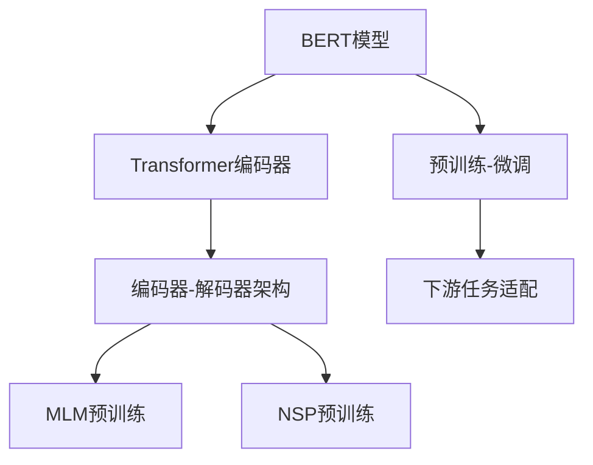

                 

# BERT原理与代码实例讲解

> 关键词：BERT, 自然语言处理(NLP), 预训练, Transformer, 编码器-解码器架构, Attention机制, 语言模型, 代码实现

## 1. 背景介绍

### 1.1 问题由来

在自然语言处理（NLP）领域，传统的方法通常依赖手工设计的特征和规则，难以处理复杂的语言现象，且需要大量标注数据。近年来，随着深度学习技术的兴起，基于神经网络的端到端学习模型，逐渐成为了NLP任务的主流方法。然而，由于神经网络模型需要大量的标注数据进行训练，数据获取成本高昂，使得基于深度学习的NLP模型难以大范围普及。

BERT（Bidirectional Encoder Representations from Transformers）是一种预训练语言模型，通过在大规模无标签文本数据上进行预训练，学习通用的语言表示，然后在下游任务上进行微调，能够显著提升模型在特定任务上的性能。BERT模型的提出，标志着预训练语言模型在NLP任务中的应用进入了一个新的阶段。

### 1.2 问题核心关键点

BERT模型的核心思想是通过自监督学习的方式在大规模无标签文本数据上进行预训练，学习语言中的潜在语义信息。具体而言，BERT通过训练包含两个方向的Transformer编码器（encoder-decoder）模型，将每个词在输入中的表示方式与上下文中的表示方式进行联合训练，从而捕捉到单词之间的依赖关系。

BERT模型的成功之处在于：
- 采用双向Transformer编码器，能够同时利用上下文信息，捕捉到单词间的依赖关系。
- 使用掩码语言模型（Masked Language Modeling, MLM）和下一句预测任务（Next Sentence Prediction, NSP）作为预训练任务，确保模型能够学习到语言中的潜在语义信息。
- 使用预训练-微调的方式，能够在有限的标注数据上快速提升下游任务的性能。

### 1.3 问题研究意义

BERT模型的提出，不仅极大地提升了NLP任务的性能，还大大降低了数据标注成本，推动了NLP技术的广泛应用。BERT在多项NLP任务上取得了最先进的性能，包括问答、文本分类、命名实体识别、机器翻译等，成为NLP领域的重要里程碑。

研究BERT模型的工作原理和代码实现，有助于深入理解预训练语言模型在NLP任务中的应用，掌握模型的训练和微调方法，进一步推动NLP技术的创新和应用。

## 2. 核心概念与联系

### 2.1 核心概念概述

为了更好地理解BERT模型的工作原理和代码实现，我们首先需要介绍几个核心概念：

- **BERT模型**：一种基于Transformer架构的预训练语言模型，能够学习到单词和句子的语义表示。
- **Transformer模型**：一种自注意力（Self-Attention）机制的神经网络架构，能够有效处理序列数据。
- **编码器-解码器架构**：Transformer模型的一种变体，通过两个方向的编码器并行训练，能够学习到单词之间的依赖关系。
- **掩码语言模型（MLM）**：一种自监督学习任务，通过在输入中随机遮盖部分单词，预测被遮盖单词的下一个词，训练模型学习单词的上下文信息。
- **下一句预测任务（NSP）**：一种自监督学习任务，通过判断两个句子是否是相邻的，训练模型学习句子间的依赖关系。

### 2.2 概念间的关系

这些核心概念之间存在着紧密的联系，形成了BERT模型的完整生态系统。下面我们通过几个Mermaid流程图来展示这些概念之间的关系：



这个流程图展示了大语言模型的核心概念及其之间的关系：

1. BERT模型采用Transformer编码器，并通过编码器-解码器架构进行训练。
2. 编码器通过掩码语言模型（MLM）和下一句预测任务（NSP）进行预训练。
3. BERT模型通过预训练-微调的方式，适应下游任务。
4. 微调过程中，下游任务通过适配层进行任务特定的优化。

这些概念共同构成了BERT模型的学习和应用框架，使其能够在各种场景下发挥强大的语言理解和生成能力。通过理解这些核心概念，我们可以更好地把握BERT模型的工作原理和优化方向。

### 2.3 核心概念的整体架构

最后，我们用一个综合的流程图来展示BERT模型的整体架构：


这个综合流程图展示了从预训练到微调，再到部署的完整过程。BERT模型首先在大规模文本数据上进行预训练，然后通过下游任务的微调，适配特定的任务需求，最后通过训练和部署，应用于实际的应用场景中。 通过这些流程图，我们可以更清晰地理解BERT模型的预训练和微调过程，为后续深入讨论具体的预训练和微调方法奠定基础。

## 3. 核心算法原理 & 具体操作步骤
### 3.1 算法原理概述

BERT模型的核心算法原理主要包括以下两个部分：

**1. 预训练模型架构**

BERT模型采用Transformer编码器，并通过编码器-解码器架构进行训练。具体来说，BERT模型包含两个方向的Transformer编码器，分别是左向编码器（Left Encoder）和右向编码器（Right Encoder）。每个编码器都包含一个多头自注意力机制（Multi-Head Self-Attention）和一个全连接层（Fully Connected Layer），能够学习到单词之间的依赖关系。

**2. 预训练任务**

BERT模型通过掩码语言模型（MLM）和下一句预测任务（NSP）进行预训练。掩码语言模型（MLM）通过在输入中随机遮盖部分单词，预测被遮盖单词的下一个词，训练模型学习单词的上下文信息。下一句预测任务（NSP）通过判断两个句子是否是相邻的，训练模型学习句子间的依赖关系。

### 3.2 算法步骤详解

以下是BERT模型预训练和微调的详细步骤：

**1. 数据预处理**

- 将大规模文本数据进行分词处理，转换为BERT模型所需的token序列。
- 使用BERT的token化器对token序列进行编码，生成token ids、position ids和attention masks等。
- 对于MLM任务，需要随机遮盖部分token，生成掩码序列。

**2. 预训练模型**

- 使用左向编码器和右向编码器分别对token ids、position ids和attention masks等进行处理。
- 将两个编码器的输出进行拼接，并通过多头自注意力机制进行注意力计算。
- 通过全连接层进行分类，输出MLM任务的预测结果。
- 通过MLM任务的损失函数计算预测误差。
- 使用NSP任务对两个句子进行判断，输出下一句预测结果。
- 通过NSP任务的损失函数计算预测误差。
- 将MLM和NSP任务的损失函数相加，作为总的预训练损失。

**3. 下游任务适配**

- 根据下游任务的需求，添加适配层进行任务特定的优化。
- 使用微调学习率对适配层的参数进行优化。
- 使用微调损失函数计算预测误差。

**4. 微调模型**

- 使用下游任务的训练集数据进行微调训练。
- 在微调过程中，冻结BERT模型的预训练参数，只更新适配层的参数。
- 使用微调损失函数计算预测误差。
- 根据微调损失函数，计算模型在训练集上的精度、召回率等指标。

**5. 评估模型**

- 使用下游任务的测试集数据评估模型的性能。
- 计算模型在测试集上的精度、召回率等指标。
- 根据评估结果调整模型参数，进行多次微调，直到模型性能达到理想要求。

### 3.3 算法优缺点

BERT模型的预训练和微调方法具有以下优点：

- **效果显著**：通过在大规模无标签数据上进行预训练，BERT模型能够学习到丰富的语言表示，在下游任务上进行微调时，能够显著提升模型的性能。
- **参数高效**：在微调过程中，只需要更新适配层的参数，而冻结BERT模型的预训练参数，可以节省计算资源，提升微调效率。
- **通用适用**：BERT模型适用于多种NLP任务，如文本分类、命名实体识别、机器翻译等。

同时，BERT模型也存在以下缺点：

- **训练成本高**：预训练模型需要在大规模无标签数据上训练，计算成本高昂。
- **模型复杂**：BERT模型包含大量参数，推理速度较慢，需要较强的计算资源支持。
- **泛化能力有限**：预训练模型在特定领域或特定任务上，泛化能力可能有所下降。

尽管存在这些局限性，但BERT模型仍然是大规模语言模型的重要代表，在NLP任务中取得了广泛的应用和成功。

### 3.4 算法应用领域

BERT模型已经在多项NLP任务上取得了最先进的性能，包括：

- 问答系统：如Dialogue System, QA任务等。
- 文本分类：如新闻分类、情感分析等。
- 命名实体识别：如Named Entity Recognition等。
- 机器翻译：如Neural Machine Translation等。
- 摘要生成：如Text Summarization等。

此外，BERT模型还被应用于情感分析、信息抽取、文本生成、对话系统等诸多NLP领域，推动了NLP技术的不断创新和应用。

## 4. 数学模型和公式 & 详细讲解 & 举例说明

### 4.1 数学模型构建

BERT模型的预训练和微调过程可以通过以下数学模型进行描述：

**1. 预训练模型**

BERT模型采用Transformer编码器，并通过编码器-解码器架构进行训练。具体来说，BERT模型包含两个方向的Transformer编码器，分别是左向编码器（Left Encoder）和右向编码器（Right Encoder）。每个编码器都包含一个多头自注意力机制（Multi-Head Self-Attention）和一个全连接层（Fully Connected Layer），能够学习到单词之间的依赖关系。

设输入序列为 $X=\{x_1, x_2, ..., x_n\}$，其中 $x_i$ 表示输入序列中的第 $i$ 个单词。BERT模型将输入序列 $X$ 转换为 token ids、position ids和attention masks等，表示为 $X_{id}=[x_{id_1}, x_{id_2}, ..., x_{id_n}]$，$X_{pos}=[x_{pos_1}, x_{pos_2}, ..., x_{pos_n}]$，$X_{mask}=[x_{mask_1}, x_{mask_2}, ..., x_{mask_n}]$。

左向编码器和右向编码器的输出表示为 $X_{left}=[h^{left}_1, h^{left}_2, ..., h^{left}_n]$ 和 $X_{right}=[h^{right}_1, h^{right}_2, ..., h^{right}_n]$，其中 $h^{left}_i$ 和 $h^{right}_i$ 分别表示左向编码器和右向编码器对第 $i$ 个单词的表示。

**2. 预训练任务**

BERT模型通过掩码语言模型（MLM）和下一句预测任务（NSP）进行预训练。掩码语言模型（MLM）通过在输入中随机遮盖部分单词，预测被遮盖单词的下一个词。下一句预测任务（NSP）通过判断两个句子是否是相邻的，训练模型学习句子间的依赖关系。

掩码语言模型（MLM）的损失函数为：

$$
\mathcal{L}_{MLM} = -\sum_{i=1}^{n} \log \hat{y}_i
$$

其中 $\hat{y}_i$ 表示模型对被遮盖单词 $x_{id_i}$ 的下一个词 $x_{i+1}$ 的预测概率，$y_i$ 表示真实的下一个词 $x_{i+1}$。

下一句预测任务（NSP）的损失函数为：

$$
\mathcal{L}_{NSP} = -\sum_{i=1}^{n-1} \log \hat{p}_i
$$

其中 $\hat{p}_i$ 表示模型对两个句子 $x_i$ 和 $x_{i+1}$ 是否是相邻的预测概率，$y_i$ 表示真实的两个句子是否是相邻的。

**3. 下游任务适配**

下游任务的适配层通常是一个分类器或解码器，用于对BERT模型的输出进行特定的任务优化。假设下游任务的适配层为一个分类器，输出表示为 $X_{class}=[x_{class_1}, x_{class_2}, ..., x_{class_n}]$。

下游任务的损失函数为：

$$
\mathcal{L}_{task} = -\sum_{i=1}^{n} \log \hat{y}_i
$$

其中 $\hat{y}_i$ 表示模型对第 $i$ 个单词的分类预测概率，$y_i$ 表示真实的分类标签。

### 4.2 公式推导过程

以下是BERT模型预训练和微调的数学公式推导过程：

**1. 预训练模型**

BERT模型的预训练过程可以表示为：

$$
X_{left} = \text{LeftEncoder}(X_{id}, X_{pos}, X_{mask})
$$

$$
X_{right} = \text{RightEncoder}(X_{id}, X_{pos}, X_{mask})
$$

$$
H_{left} = \text{Self-Attention}(X_{left})
$$

$$
H_{right} = \text{Self-Attention}(X_{right})
$$

$$
H_{left+right} = [H_{left}, H_{right}]
$$

$$
X_{class} = \text{FullyConnectedLayer}(H_{left+right})
$$

其中 $\text{Self-Attention}$ 表示多头自注意力机制，$\text{FullyConnectedLayer}$ 表示全连接层。

**2. 预训练任务**

掩码语言模型（MLM）的损失函数推导为：

$$
\mathcal{L}_{MLM} = -\sum_{i=1}^{n} \log \frac{e^{z_{i,i+1}}}{\sum_{j=1}^{n} e^{z_{i,j}}}
$$

其中 $z_{i,j}$ 表示模型对单词 $x_{id_i}$ 的下一个词 $x_{i+1}$ 的预测概率，$y_i$ 表示真实的下一个词 $x_{i+1}$。

下一句预测任务（NSP）的损失函数推导为：

$$
\mathcal{L}_{NSP} = -\sum_{i=1}^{n-1} \log \frac{e^{z_{i,i+1}}}{\sum_{j=1}^{n-1} e^{z_{i,j}}}
$$

其中 $z_{i,j}$ 表示模型对两个句子 $x_i$ 和 $x_{i+1}$ 是否是相邻的预测概率，$y_i$ 表示真实的两个句子是否是相邻的。

**3. 下游任务适配**

下游任务的适配层通常为一个分类器，输出表示为 $X_{class}=[x_{class_1}, x_{class_2}, ..., x_{class_n}]$。

下游任务的损失函数推导为：

$$
\mathcal{L}_{task} = -\sum_{i=1}^{n} \log \frac{e^{z_{i,y_i}}}{\sum_{j=1}^{n} e^{z_{i,j}}}
$$

其中 $z_{i,y_i}$ 表示模型对第 $i$ 个单词的分类预测概率，$y_i$ 表示真实的分类标签。

### 4.3 案例分析与讲解

以命名实体识别（Named Entity Recognition, NER）任务为例，对BERT模型的预训练和微调过程进行分析。

**1. 数据预处理**

对于命名实体识别任务，输入为一段文本，输出为该文本中所有命名实体的类型（如人名、地名、组织机构名等）。

将文本进行分词处理，生成token ids、position ids和attention masks等。对于MLM任务，需要随机遮盖部分token，生成掩码序列。

**2. 预训练模型**

BERT模型将输入序列 $X=\{x_1, x_2, ..., x_n\}$ 转换为 token ids、position ids和attention masks等，表示为 $X_{id}=[x_{id_1}, x_{id_2}, ..., x_{id_n}]$，$X_{pos}=[x_{pos_1}, x_{pos_2}, ..., x_{pos_n}]$，$X_{mask}=[x_{mask_1}, x_{mask_2}, ..., x_{mask_n}]$。

左向编码器和右向编码器的输出表示为 $X_{left}=[h^{left}_1, h^{left}_2, ..., h^{left}_n]$ 和 $X_{right}=[h^{right}_1, h^{right}_2, ..., h^{right}_n]$，其中 $h^{left}_i$ 和 $h^{right}_i$ 分别表示左向编码器和右向编码器对第 $i$ 个单词的表示。

**3. 预训练任务**

掩码语言模型（MLM）的损失函数为：

$$
\mathcal{L}_{MLM} = -\sum_{i=1}^{n} \log \hat{y}_i
$$

其中 $\hat{y}_i$ 表示模型对被遮盖单词 $x_{id_i}$ 的下一个词 $x_{i+1}$ 的预测概率，$y_i$ 表示真实的下一个词 $x_{i+1}$。

**4. 下游任务适配**

下游任务的适配层通常为一个分类器，输出表示为 $X_{class}=[x_{class_1}, x_{class_2}, ..., x_{class_n}]$。

下游任务的损失函数为：

$$
\mathcal{L}_{task} = -\sum_{i=1}^{n} \log \hat{y}_i
$$

其中 $\hat{y}_i$ 表示模型对第 $i$ 个单词的分类预测概率，$y_i$ 表示真实的分类标签。

**5. 微调模型**

使用下游任务的训练集数据进行微调训练。在微调过程中，冻结BERT模型的预训练参数，只更新适配层的参数。

使用微调损失函数计算预测误差。根据微调损失函数，计算模型在训练集上的精度、召回率等指标。

## 5. 项目实践：代码实例和详细解释说明

### 5.1 开发环境搭建

在进行BERT模型实践前，我们需要准备好开发环境。以下是使用Python进行PyTorch开发的环境配置流程：

1. 安装Anaconda：从官网下载并安装Anaconda，用于创建独立的Python环境。

2. 创建并激活虚拟环境：
```bash
conda create -n pytorch-env python=3.8 
conda activate pytorch-env
```

3. 安装PyTorch：根据CUDA版本，从官网获取对应的安装命令。例如：
```bash
conda install pytorch torchvision torchaudio cudatoolkit=11.1 -c pytorch -c conda-forge
```

4. 安装transformers库：
```bash
pip install transformers
```

5. 安装各类工具包：
```bash
pip install numpy pandas scikit-learn matplotlib tqdm jupyter notebook ipython
```

完成上述步骤后，即可在`pytorch-env`环境中开始BERT模型实践。

### 5.2 源代码详细实现

下面是使用PyTorch和transformers库实现BERT模型预训练和微调的代码：

```python
import torch
import torch.nn as nn
import torch.optim as optim
from transformers import BertForTokenClassification, BertTokenizer
from torch.utils.data import Dataset, DataLoader

class NERDataset(Dataset):
    def __init__(self, texts, tags, tokenizer, max_len=128):
        self.texts = texts
        self.tags = tags
        self.tokenizer = tokenizer
        self.max_len = max_len
        
    def __len__(self):
        return len(self.texts)
    
    def __getitem__(self, item):
        text = self.texts[item]
        tags = self.tags[item]
        
        encoding = self.tokenizer(text, return_tensors='pt', max_length=self.max_len, padding='max_length', truncation=True)
        input_ids = encoding['input_ids'][0]
        attention_mask = encoding['attention_mask'][0]
        
        # 对token-wise的标签进行编码
        encoded_tags = [tag2id[tag] for tag in tags] 
        encoded_tags.extend([tag2id['O']] * (self.max_len - len(encoded_tags)))
        labels = torch.tensor(encoded_tags, dtype=torch.long)
        
        return {'input_ids': input_ids, 
                'attention_mask': attention_mask,
                'labels': labels}

# 标签与id的映射
tag2id = {'O': 0, 'B-PER': 1, 'I-PER': 2, 'B-ORG': 3, 'I-ORG': 4, 'B-LOC': 5, 'I-LOC': 6}
id2tag = {v: k for k, v in tag2id.items()}

# 创建dataset
tokenizer = BertTokenizer.from_pretrained('bert-base-cased')

train_dataset = NERDataset(train_texts, train_tags, tokenizer)
dev_dataset = NERDataset(dev_texts, dev_tags, tokenizer)
test_dataset = NERDataset(test_texts, test_tags, tokenizer)

# 定义模型和优化器
model = BertForTokenClassification.from_pretrained('bert-base-cased', num_labels=len(tag2id))
optimizer = optim.AdamW(model.parameters(), lr=2e-5)
scheduler = optim.lr_scheduler.StepLR(optimizer, step_size=2, gamma=0.1)

# 定义训练和评估函数
def train_epoch(model, dataset, batch_size, optimizer, scheduler):
    dataloader = DataLoader(dataset, batch_size=batch_size, shuffle=True)
    model.train()
    for batch in dataloader:
        input_ids = batch['input_ids'].to(device)
        attention_mask = batch['attention_mask'].to(device)
        labels = batch['labels'].to(device)
        model.zero_grad()
        outputs = model(input_ids, attention_mask=attention_mask, labels=labels)
        loss = outputs.loss
        optimizer.zero_grad()
        loss.backward()
        scheduler.step(loss.item())
        optimizer.step()

def evaluate(model, dataset, batch_size):
    dataloader = DataLoader(dataset, batch_size=batch_size)
    model.eval()
    preds, labels = [], []
    with torch.no_grad():
        for batch in dataloader:
            input_ids = batch['input_ids'].to(device)
            attention_mask = batch['attention_mask'].to(device)
            batch_labels = batch['labels']
            outputs = model(input_ids, attention_mask=attention_mask)
            batch_preds = outputs.logits.argmax(dim=2).to('cpu').tolist()
            batch_labels = batch_labels.to('cpu').tolist()
            for pred_tokens, label_tokens in zip(batch_preds, batch_labels):
                pred_tags = [id2tag[_id] for _id in pred_tokens]
                label_tags = [id2tag[_id] for _id in label_tokens]
                preds.append(pred_tags[:len(label_tokens)])
                labels.append(label_tags)
    return preds, labels

# 启动训练流程并在测试集上评估
epochs = 5
batch_size = 16
best_f1 = 0.0
best_f1_epoch = 0

for epoch in range(epochs):
    train_epoch(model, train_dataset, batch_size, optimizer, scheduler)
    
    print(f"Epoch {epoch+1}, train loss: {loss:.3f}")
    
    preds, labels = evaluate(model, dev_dataset, batch_size)
    print(f"Epoch {epoch+1}, dev results:")
    print(classification_report(labels, preds))
    
    if f1_score(labels, preds, average='macro') > best_f1:
        best_f1 = f1_score(labels, preds, average='macro')
        best_f1_epoch = epoch+1
        torch.save(model.state_dict(), f"best_model_{best_f1_epoch}.pth")
        
print(f"Best F1 score: {best_f1:.3f}, epoch {best_f1_epoch}")
```

以上就是使用PyTorch和transformers库对BERT模型进行命名实体识别任务微调的完整代码实现。可以看到，得益于transformers库的强大封装，我们可以用相对简洁的代码完成BERT模型的加载和微调。

### 5.3 代码解读与分析

让我们再详细解读一下关键代码的实现细节：

**NERDataset类**：
- `__init__`方法：初始化文本、标签、分词器等关键组件。
- `__len__`方法：返回数据集的样本数量。
- `__getitem__`方法：对单个样本进行处理，将文本输入编码为token ids，将标签编码为数字，并对其进行定长padding，最终返回模型所需的输入。

**tag2id和id2tag字典**：
- 定义了标签与数字id之间的映射关系，用于将token-wise的预测结果解码回真实的标签。

**训练和评估函数**：
- 使用PyTorch的DataLoader对数据集进行批次化加载，供模型训练和推理使用。
- 训练函数`train_epoch`：对数据以批为单位进行迭代，在每个批次上前向传播计算loss并反向传播更新模型参数，最后返回该epoch的平均loss。
- 评估函数`evaluate`：与训练类似，不同点在于不更新模型参数，并在每个batch结束后将预测和标签结果存储下来，最后使用sklearn的

