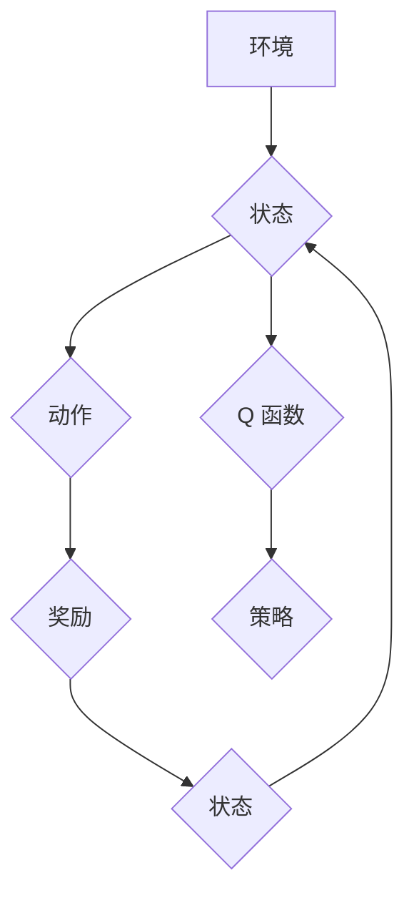

## 深度 Q-learning：学习率与折扣因子选择

> 关键词：深度强化学习，Q-learning，学习率，折扣因子，超参数调优，算法原理，实践应用

## 1. 背景介绍

深度强化学习 (Deep Reinforcement Learning, DRL) 近年来取得了令人瞩目的进展，在游戏、机器人控制、自动驾驶等领域展现出强大的应用潜力。其中，深度 Q-learning 作为一种经典的 DRL 算法，凭借其高效性和易于理解的特点，在解决复杂决策问题方面发挥着重要作用。

深度 Q-learning 算法的核心在于学习一个 Q 函数，该函数能够估计在给定状态下采取特定动作的长期回报。通过不断地与环境交互，更新 Q 函数的值，最终学习出最优策略。然而，学习率和折扣因子这两个超参数的选择对算法的收敛速度和最终性能有着至关重要的影响。

## 2. 核心概念与联系

### 2.1  强化学习基本概念

强化学习是一种机器学习范式，其中智能体通过与环境交互，学习如何采取最优行动以最大化累积奖励。

* **智能体 (Agent):**  学习和决策的实体。
* **环境 (Environment):** 智能体所处的外部世界。
* **状态 (State):** 环境的当前描述。
* **动作 (Action):** 智能体可以采取的行动。
* **奖励 (Reward):** 环境对智能体采取的行动给予的反馈。
* **策略 (Policy):**  智能体在不同状态下采取动作的规则。

### 2.2  Q-learning 算法原理

Q-learning 是一种基于价值函数的强化学习算法，其目标是学习一个 Q 函数，该函数能够估计在给定状态下采取特定动作的长期回报。

* **Q 函数 (Q-function):**  Q(s, a) 表示在状态 s 下采取动作 a 的预期累积奖励。
* **Bellman 方程:** Q-learning 算法的核心是 Bellman 方程，它描述了 Q 函数的更新规则。

### 2.3  深度 Q-learning

深度 Q-learning 将深度神经网络引入 Q 函数的学习过程，能够处理高维状态空间和复杂决策问题。

* **深度神经网络:** 用于逼近 Q 函数。
* **经验回放 (Experience Replay):**  存储历史经验，并随机采样用于训练神经网络。
* **目标网络 (Target Network):**  用于稳定训练过程，减少震荡。

**Mermaid 流程图**



## 3. 核心算法原理 & 具体操作步骤

### 3.1  算法原理概述

深度 Q-learning 算法的核心思想是通过最大化 Q 函数的期望值来学习最优策略。

* **目标:** 最大化长期奖励的期望值。
* **方法:** 使用深度神经网络逼近 Q 函数，并通过 Bellman 方程更新 Q 函数的值。

### 3.2  算法步骤详解

1. **初始化:** 初始化 Q 函数的深度神经网络，并设置学习率和折扣因子。
2. **环境交互:** 智能体与环境交互，获取当前状态、采取动作并获得奖励。
3. **经验存储:** 将状态、动作、奖励和下一个状态存储到经验回放缓冲区中。
4. **样本采样:** 从经验回放缓冲区中随机采样多个经验样本。
5. **Q 值更新:** 使用采样的经验样本更新 Q 函数的值，根据 Bellman 方程计算目标 Q 值，并使用梯度下降算法更新神经网络参数。
6. **策略更新:** 根据更新后的 Q 函数，选择最优动作作为策略。
7. **重复步骤 2-6:**  重复上述步骤，直到达到收敛条件或训练结束。

### 3.3  算法优缺点

**优点:**

* 能够处理高维状态空间和复杂决策问题。
* 具有较强的泛化能力。
* 算法原理相对简单易懂。

**缺点:**

* 训练过程可能比较耗时。
* 需要大量的训练数据。
* 超参数调优较为复杂。

### 3.4  算法应用领域

深度 Q-learning 算法在以下领域具有广泛的应用前景:

* **游戏 AI:**  学习玩游戏并取得高分。
* **机器人控制:**  训练机器人完成复杂的任务。
* **自动驾驶:**  学习驾驶车辆并做出安全决策。
* **推荐系统:**  根据用户历史行为推荐物品。
* **金融交易:**  学习制定投资策略。

## 4. 数学模型和公式 & 详细讲解 & 举例说明

### 4.1  数学模型构建

深度 Q-learning 算法的核心是 Q 函数，它是一个映射关系，将状态-动作对映射到预期累积奖励。

* **Q(s, a):**  表示在状态 s 下采取动作 a 的预期累积奖励。

### 4.2  公式推导过程

Bellman 方程是深度 Q-learning 算法的核心更新规则，它描述了 Q 函数的更新方式。

$$
Q(s, a) = Q(s, a) + \alpha [r + \gamma \max_{a'} Q(s', a') - Q(s, a)]
$$

其中:

* $\alpha$: 学习率，控制着 Q 函数更新的步长。
* $r$:  在状态 s 下采取动作 a 得到的奖励。
* $\gamma$: 折扣因子，控制着未来奖励的权重。
* $s'$:  采取动作 a 后进入的下一个状态。
* $a'$:  在下一个状态 $s'$ 中采取的动作。

### 4.3  案例分析与讲解

假设一个智能体在玩一个简单的游戏，状态空间为 {“左”、“中”、“右”}，动作空间为 {“向上”、“向下”}。

* 在状态 “中” 下，采取动作 “向上” 得到奖励 1，下一个状态为 “左”。
* 在状态 “左” 下，采取动作 “向下” 得到奖励 -1，下一个状态为 “中”。

使用 Bellman 方程更新 Q 函数的值，可以学习出最优策略。

## 5. 项目实践：代码实例和详细解释说明

### 5.1  开发环境搭建

* Python 3.x
* TensorFlow 或 PyTorch
* OpenAI Gym

### 5.2  源代码详细实现

```python
import tensorflow as tf
import numpy as np
from tensorflow.keras.models import Sequential
from tensorflow.keras.layers import Dense

# 定义 Q 网络
class QNetwork(tf.keras.Model):
    def __init__(self):
        super(QNetwork, self).__init__()
        self.dense1 = Dense(64, activation='relu')
        self.dense2 = Dense(64, activation='relu')
        self.output = Dense(2, activation='linear')

    def call(self, state):
        x = self.dense1(state)
        x = self.dense2(x)
        return self.output(x)

# 初始化 Q 网络
q_network = QNetwork()

# 定义学习率和折扣因子
learning_rate = 0.001
gamma = 0.99

# 定义经验回放缓冲区
experience_replay_buffer = []

# 训练循环
for episode in range(num_episodes):
    state = env.reset()
    done = False
    total_reward = 0

    while not done:
        # 选择动作
        action = q_network.predict(state)[0]

        # 执行动作并获取奖励
        next_state, reward, done, _ = env.step(action)

        # 存储经验
        experience_replay_buffer.append((state, action, reward, next_state, done))

        # 更新状态
        state = next_state

        # 计算总奖励
        total_reward += reward

    # 从经验回放缓冲区中采样数据
    batch_size = 32
    batch = random.sample(experience_replay_buffer, batch_size)

    # 更新 Q 网络
    with tf.GradientTape() as tape:
        # 计算目标 Q 值
        target_q_values = q_network.predict(next_state)
        target_q_values = np.max(target_q_values, axis=1)
        target_q_values = reward + gamma * target_q_values * (1 - done)

        # 计算损失
        predicted_q_values = q_network.predict(state)
        loss = tf.keras.losses.mean_squared_error(target_q_values, predicted_q_values)

    # 反向传播并更新参数
    gradients = tape.gradient(loss, q_network.trainable_variables)
    optimizer.apply_gradients(zip(gradients, q_network.trainable_variables))

# 保存训练好的模型
q_network.save('q_network.h5')
```

### 5.3  代码解读与分析

* **Q 网络:** 使用深度神经网络来逼近 Q 函数。
* **学习率和折扣因子:** 控制着 Q 函数更新的步长和未来奖励的权重。
* **经验回放缓冲区:** 存储历史经验，并随机采样用于训练神经网络。
* **训练循环:** 迭代地与环境交互，更新 Q 函数的值。
* **动作选择:** 根据更新后的 Q 函数，选择最优动作。

### 5.4  运行结果展示

训练完成后，可以将训练好的 Q 网络应用于新的环境中，并观察智能体的行为。

## 6. 实际应用场景

深度 Q-learning 算法在以下实际应用场景中展现出强大的潜力:

* **游戏 AI:**  AlphaGo 和 AlphaZero 等游戏 AI 系统都使用了深度 Q-learning 算法，取得了令人瞩目的成就。
* **机器人控制:**  深度 Q-learning 可以用于训练机器人完成复杂的任务，例如导航、抓取和组装。
* **自动驾驶:**  深度 Q-learning 可以用于训练自动驾驶汽车，学习做出安全和高效的驾驶决策。

### 6.4  未来应用展望

随着深度学习技术的不断发展，深度 Q-learning 算法将在更多领域得到应用，例如医疗诊断、金融交易和个性化推荐。

## 7. 工具和资源推荐

### 7.1  学习资源推荐

* **书籍:**
    * Reinforcement Learning: An Introduction by Richard S. Sutton and Andrew G. Barto
    * Deep Reinforcement Learning Hands-On by Maxim Lapan
* **在线课程:**
    * Deep Reinforcement Learning Specialization by DeepLearning.AI
    * Reinforcement Learning by David Silver (University of DeepMind)

### 7.2  开发工具推荐

* **TensorFlow:**  开源深度学习框架。
* **PyTorch:**  开源深度学习框架。
* **OpenAI Gym:**  强化学习环境库。

### 7.3  相关论文推荐

* Deep Q-Network (DQN) by Volodymyr Mnih et al. (2015)
* Dueling Network Architectures for Deep Reinforcement Learning by  Hasselt et al. (2015)
* Double Q-Learning by  Hasselt et al. (2016)

## 8. 总结：未来发展趋势与挑战

### 8.1  研究成果总结

深度 Q-learning 算法取得了显著的进展，在解决复杂决策问题方面展现出强大的潜力。

### 8.2  未来发展趋势

* **探索更有效的算法:**  研究更有效的深度 Q-learning 算法，例如分布式深度 Q-learning 和联邦学习。
* **提高算法的鲁棒性:**  研究提高算法鲁棒性的方法，例如对抗训练和模型压缩。
* **应用于更复杂的环境:**  将深度 Q-learning 应用于更复杂的环境，例如现实世界中的机器人控制和自动驾驶。

### 8.3  面临的挑战

* **样本效率:**  深度 Q