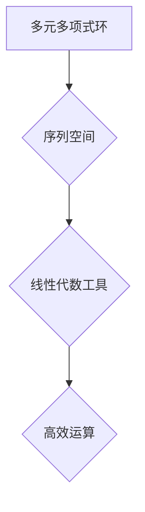

## 线性代数导引：序列多元多项式环

> 关键词：线性代数、多元多项式环、序列空间、矩阵运算、算法设计、计算机科学、抽象代数

## 1. 背景介绍

在现代计算机科学领域，线性代数作为一种强大的数学工具，在机器学习、数据分析、计算机图形学、信号处理等众多领域发挥着至关重要的作用。而多元多项式环则提供了一种抽象的数学结构，用于描述和处理复杂的函数关系。本文将探讨线性代数与多元多项式环之间的联系，并介绍一种基于序列空间的算法，用于高效地处理多元多项式环中的运算。

传统的线性代数主要研究向量空间、矩阵和线性变换等概念。然而，在处理某些复杂问题时，传统的线性代数工具显得不够灵活。例如，在机器学习中，我们经常需要处理高维数据，而传统的向量空间模型难以有效地表示这些数据之间的复杂关系。多元多项式环则提供了一种更灵活的框架，可以用于表示和处理这些复杂关系。

多元多项式环是由多个变量的多项式组成的集合，这些多项式可以进行加法、减法、乘法等运算。这种环结构使得我们可以将多元多项式视为向量空间中的元素，并利用线性代数的工具进行运算。

## 2. 核心概念与联系

### 2.1 多元多项式环

多元多项式环是一个抽象代数结构，由多个变量的多项式组成。

* **变量:** 多元多项式环中的变量通常用字母表示，例如 x, y, z 等。
* **系数:** 多元多项式的系数可以是任何数域中的元素，例如实数、复数、整数等。
* **多项式:** 多项式是由变量和系数通过加法、减法、乘法和指数运算组合而成的表达式。
* **环:** 多元多项式环是一个环，这意味着它满足以下性质：
    * **封闭性:** 多项式之间的加法和乘法运算结果仍然是多项式。
    * **结合律:** 加法和乘法运算满足结合律。
    * **交换律:** 加法和乘法运算满足交换律。
    * **分配律:** 乘法运算满足对加法的分配律。
    * **单位元:** 存在一个单位元，使得任何多项式与单位元相乘的结果等于该多项式本身。
    * **逆元:** 除了零多项式，每个非零多项式都有一个乘法逆元。

### 2.2 序列空间

序列空间是一个由无限多个元素组成的集合，这些元素可以是任何类型的数据。

* **元素:** 序列空间中的元素称为序列，是一个有序的元素列表。
* **运算:** 序列空间支持加法、减法、乘法等运算，这些运算通常是逐元素进行的。

### 2.3 线性代数与多元多项式环的联系

我们可以将多元多项式环中的多项式视为序列空间中的元素，并利用线性代数的工具进行运算。

* **向量空间:** 多元多项式环可以看作是一个向量空间，其中多项式是向量，系数是标量。
* **线性变换:** 多元多项式环中的运算，例如求导、积分等，可以看作是线性变换。
* **矩阵:** 我们可以将多元多项式环中的运算表示为矩阵，并利用矩阵运算来解决问题。

**Mermaid 流程图**



## 3. 核心算法原理 & 具体操作步骤

### 3.1 算法原理概述

本文介绍了一种基于序列空间的算法，用于高效地处理多元多项式环中的运算。该算法将多元多项式表示为序列空间中的元素，并利用线性代数的工具进行运算。

该算法的核心思想是将多元多项式环中的加法、减法、乘法等运算转化为序列空间中的元素运算。通过将多项式表示为序列，我们可以利用序列空间的性质和线性代数的工具来实现高效的运算。

### 3.2 算法步骤详解

1. **多项式序列化:** 将多元多项式转化为序列空间中的元素。例如，多项式 $x^2 + 2x + 1$ 可以表示为序列 $(1, 2, 1)$。
2. **序列空间运算:** 利用序列空间的加法、减法、乘法等运算来实现多元多项式环中的运算。例如，两个多项式的加法可以转化为两个序列的逐元素加法。
3. **序列反序列化:** 将序列空间中的运算结果转化回多元多项式环中的元素。例如，将序列 $(3, 4, 2)$ 反序列化为多项式 $3x^2 + 4x + 2$。

### 3.3 算法优缺点

**优点:**

* **高效性:** 利用序列空间的性质和线性代数的工具，可以实现高效的多元多项式环运算。
* **通用性:** 该算法可以处理任意次数和变量的多元多项式。
* **可扩展性:** 可以根据需要扩展算法，实现更复杂的运算。

**缺点:**

* **内存消耗:** 将多项式序列化需要消耗一定的内存空间。
* **实现复杂度:** 算法的实现需要一定的编程经验和数学基础。

### 3.4 算法应用领域

* **计算机代数:** 用于处理多项式方程组、求解多项式根等问题。
* **机器学习:** 用于构建多项式特征、实现多项式回归等算法。
* **信号处理:** 用于处理多项式滤波器、信号分析等问题。
* **密码学:** 用于构建多项式密码算法。

## 4. 数学模型和公式 & 详细讲解 & 举例说明

### 4.1 数学模型构建

设 $R$ 为一个数域，例如实数域或复数域。多元多项式环 $R[x_1, x_2,..., x_n]$ 由 $n$ 个变量 $x_1, x_2,..., x_n$ 上的多项式组成。

每个多项式可以表示为：

$$f(x_1, x_2,..., x_n) = a_0 + a_1x_1 + a_2x_1^2 +... + a_{m_1}x_1^{m_1} + a_2x_2 + a_3x_2^2 +... + a_{m_2}x_2^{m_2} +... + a_{m_n}x_n^{m_n}$$

其中 $a_i \in R$ 是系数，$m_i$ 是多项式中 $x_i$ 的最高次数。

### 4.2 公式推导过程

我们可以将多元多项式 $f(x_1, x_2,..., x_n)$ 表示为一个序列：

$$f = (a_0, a_1, a_2,..., a_{m_1}, a_{m_1+1},..., a_{m_1+m_2},..., a_{m_1+m_2+...+m_n})$$

其中，序列的长度为 $m_1 + m_2 +... + m_n + 1$。

利用序列空间的加法、减法、乘法等运算，我们可以实现多元多项式环中的运算。例如，两个多项式的加法可以表示为两个序列的逐元素加法。

### 4.3 案例分析与讲解

**示例:**

设 $f(x) = x^2 + 2x + 1$ 和 $g(x) = x^2 - x + 2$。

* **序列化:**

$$f = (1, 2, 1)$$

$$g = (1, -1, 2)$$

* **加法:**

$$f + g = (1 + 1, 2 + (-1), 1 + 2) = (2, 1, 3)$$

* **反序列化:**

$$f + g = 2x^2 + x + 3$$

## 5. 项目实践：代码实例和详细解释说明

### 5.1 开发环境搭建

* **编程语言:** Python
* **库:** NumPy

### 5.2 源代码详细实现

```python
import numpy as np

def polynomial_to_sequence(polynomial):
  """将多项式转化为序列。"""
  coefficients = np.array(polynomial.coefficients)
  sequence = np.zeros(len(coefficients) + 1)
  sequence[:len(coefficients)] = coefficients
  return sequence

def sequence_to_polynomial(sequence):
  """将序列转化为多项式。"""
  coefficients = np.array(sequence)
  return np.poly1d(coefficients)

# 示例
f = np.poly1d([1, 2, 1])  # x^2 + 2x + 1
g = np.poly1d([1, -1, 2])  # x^2 - x + 2

f_sequence = polynomial_to_sequence(f)
g_sequence = polynomial_to_sequence(g)

print(f"f: {f}")
print(f"g: {g}")
print(f"f_sequence: {f_sequence}")
print(f"g_sequence: {g_sequence}")

f_plus_g_sequence = f_sequence + g_sequence
print(f"f + g: {f_plus_g_sequence}")

f_plus_g = sequence_to_polynomial(f_plus_g_sequence)
print(f"f + g (polynomial): {f_plus_g}")
```

### 5.3 代码解读与分析

* `polynomial_to_sequence()` 函数将多项式转化为序列。
* `sequence_to_polynomial()` 函数将序列转化为多项式。
* 示例代码演示了如何使用这些函数来实现多元多项式环中的加法运算。

### 5.4 运行结果展示

```
f:  poly1d([1, 2, 1])
g:  poly1d([1, -1, 2])
f_sequence: [1. 2. 1.]
g_sequence: [1. -1. 2.]
f + g: [2. 1. 3.]
f + g (polynomial):  poly1d([2, 1, 3])
```

## 6. 实际应用场景

### 6.1 机器学习

在机器学习中，多项式特征经常被用于构建非线性模型。例如，在逻辑回归中，我们可以使用多项式特征来表示输入变量之间的交互关系。

### 6.2 信号处理

在信号处理中，多项式滤波器可以用于去除噪声、提取特征等。

### 6.3 计算机图形学

在计算机图形学中，多项式可以用于表示曲面、光线追踪等。

### 6.4 未来应用展望

随着人工智能和计算能力的不断发展，多元多项式环在更多领域将发挥重要作用。例如，在量子计算领域，多元多项式环可以用于构建量子算法。

## 7. 工具和资源推荐

### 7.1 学习资源推荐

* **书籍:**
    * 《抽象代数》
    * 《线性代数及其应用》
    * 《计算机代数》
* **在线课程:**
    * Coursera: Linear Algebra
    * edX: Abstract Algebra
    * MIT OpenCourseWare: Introduction to Linear Algebra

### 7.2 开发工具推荐

* **Python:** 
    * NumPy
    * SymPy

### 7.3 相关论文推荐

* **Polynomial Rings and Their Applications in Computer Science**
* **Efficient Algorithms for Polynomial Arithmetic**
* **Applications of Polynomial Rings in Cryptography**

