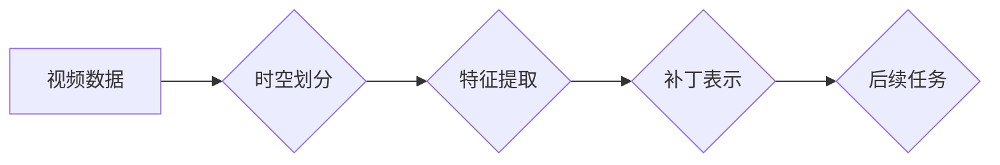

## 视频数据的 spacetime patches 化

> 关键词：视频数据处理，时空补丁，计算机视觉，深度学习，视频分析，时间序列，空间特征

## 1. 背景介绍

视频数据作为一种丰富的多媒体信息，蕴含着大量的时间和空间信息，在各个领域，如监控、医疗、娱乐等，都扮演着越来越重要的角色。然而，传统的视频处理方法往往难以有效地捕捉视频数据的时空依赖关系，导致在视频分析、理解和生成等任务上表现有限。

时空补丁化 (Spacetime Patching) 作为一种新兴的视频数据处理技术，旨在将视频数据分解成具有时空信息的局部片段，称为时空补丁。这种方法可以有效地捕捉视频数据的局部运动和变化，并为后续的视频分析任务提供更丰富的特征表示。

## 2. 核心概念与联系

时空补丁化将视频数据视为一个四维张量，其中包含时间维度、高度维度、宽度维度和通道维度。每个时空补丁包含视频数据的一部分，并包含了该部分在时间和空间上的信息。

**时空补丁化流程图:**



**核心概念:**

* **时空补丁:** 视频数据中的局部片段，包含时间和空间信息。
* **时空划分:** 将视频数据分割成多个时空补丁的过程。
* **特征提取:** 从时空补丁中提取时空特征的过程。
* **补丁表示:** 将时空特征表示为向量或其他形式的特征描述。
* **后续任务:** 利用时空补丁进行视频分析、理解和生成等任务。

## 3. 核心算法原理 & 具体操作步骤

### 3.1  算法原理概述

时空补丁化算法的核心思想是将视频数据分解成具有时空信息的局部片段，并利用这些片段进行特征提取和表示。常见的时空补丁化算法包括：

* **滑动窗口法:** 将视频数据视为一个二维图像序列，使用一个滑动窗口在时间和空间上移动，提取每个窗口内的时空补丁。
* **网格划分法:** 将视频数据划分为一个网格，每个网格单元对应一个时空补丁。
* **深度学习方法:** 利用深度学习网络自动学习时空补丁的划分和特征提取方法。

### 3.2  算法步骤详解

以滑动窗口法为例，其具体操作步骤如下：

1. **定义窗口大小:** 根据视频分辨率和帧率，选择合适的窗口大小。
2. **滑动窗口:** 将窗口在视频数据上滑动，每个窗口位置对应一个时空补丁。
3. **特征提取:** 从每个时空补丁中提取时空特征，例如运动信息、纹理信息等。
4. **补丁表示:** 将提取的时空特征表示为向量或其他形式的特征描述。

### 3.3  算法优缺点

**优点:**

* 能够有效地捕捉视频数据的局部运动和变化。
* 适用于各种视频分析任务，例如动作识别、目标跟踪等。
* 可以结合深度学习方法进行更有效的特征提取。

**缺点:**

* 窗口大小的选择会影响时空补丁的质量。
* 滑动窗口法可能会丢失一些全局信息。

### 3.4  算法应用领域

时空补丁化算法广泛应用于以下领域：

* **视频分析:** 动作识别、目标跟踪、视频检索、异常检测等。
* **视频理解:** 视频摘要、视频问答、视频对话等。
* **视频生成:** 视频剪辑、视频特效、视频合成等。

## 4. 数学模型和公式 & 详细讲解 & 举例说明

### 4.1  数学模型构建

假设视频数据为一个四维张量 $V \in R^{T \times H \times W \times C}$，其中：

* $T$：时间维度
* $H$：高度维度
* $W$：宽度维度
* $C$：通道维度

时空补丁可以表示为一个三维张量 $P \in R^{t \times h \times w \times c}$，其中：

* $t$：补丁时间长度
* $h$：补丁高度
* $w$：补丁宽度
* $c$：补丁通道数

### 4.2  公式推导过程

时空补丁的划分可以表示为：

$$P(i, j, k, l) = V(i \times t + j, i \times h + k, i \times w + l, :) $$

其中，$i$ 表示补丁索引，$j$、$k$、$l$ 分别表示补丁在时间、高度和宽度上的偏移量。

### 4.3  案例分析与讲解

例如，假设视频数据分辨率为 $128 \times 128$，帧率为 30 fps，补丁大小为 $16 \times 16$，则视频数据可以划分为 $8 \times 8$ 个时空补丁。

## 5. 项目实践：代码实例和详细解释说明

### 5.1  开发环境搭建

* Python 3.7+
* TensorFlow 2.0+
* OpenCV 4.0+

### 5.2  源代码详细实现

```python
import tensorflow as tf
import cv2

def spacetime_patching(video_path, patch_size):
    """
    视频数据时空补丁化

    Args:
        video_path: 视频文件路径
        patch_size: 时空补丁大小

    Returns:
        时空补丁列表
    """
    cap = cv2.VideoCapture(video_path)
    fps = cap.get(cv2.CAP_PROP_FPS)
    width = int(cap.get(cv2.CAP_PROP_FRAME_WIDTH))
    height = int(cap.get(cv2.CAP_PROP_FRAME_HEIGHT))

    patches = []
    while True:
        ret, frame = cap.read()
        if not ret:
            break

        # 将帧转换为灰度图像
        gray = cv2.cvtColor(frame, cv2.COLOR_BGR2GRAY)

        # 将图像划分为时空补丁
        for i in range(0, height - patch_size[0] + 1, patch_size[0]):
            for j in range(0, width - patch_size[1] + 1, patch_size[1]):
                patch = gray[i:i + patch_size[0], j:j + patch_size[1]]
                patches.append(patch)

    cap.release()
    return patches

# 示例代码
video_path = "video.mp4"
patch_size = (16, 16)
patches = spacetime_patching(video_path, patch_size)
```

### 5.3  代码解读与分析

* 该代码首先使用 OpenCV 库读取视频文件。
* 然后，将视频帧转换为灰度图像，并使用滑动窗口法将图像划分为时空补丁。
* 每个时空补丁都包含了图像的一部分，并包含了该部分在时间和空间上的信息。
* 最后，将提取的时空补丁存储在一个列表中，并返回该列表。

### 5.4  运行结果展示

运行该代码后，将生成一个包含所有时空补丁的列表。每个时空补丁可以作为视频分析任务的输入数据。

## 6. 实际应用场景

时空补丁化技术在视频分析领域具有广泛的应用场景，例如：

* **动作识别:** 将视频数据分解成时空补丁，可以有效地捕捉动作的局部特征，提高动作识别的准确率。
* **目标跟踪:** 时空补丁化可以帮助跟踪目标在视频中的运动轨迹，提高目标跟踪的稳定性。
* **视频检索:** 利用时空补丁的特征表示，可以实现基于内容的视频检索。
* **异常检测:** 通过分析时空补丁的特征变化，可以检测视频中的异常行为。

## 7. 工具和资源推荐

### 7.1  学习资源推荐

* **论文:**
    * "Space-Time Interest Point Detection"
    * "Video Representation Learning with Space-Time Patches"
* **书籍:**
    * "Deep Learning for Computer Vision"
    * "Computer Vision: Algorithms and Applications"

### 7.2  开发工具推荐

* **TensorFlow:** 深度学习框架
* **PyTorch:** 深度学习框架
* **OpenCV:** 图像处理库

### 7.3  相关论文推荐

* "Space-Time Interest Point Detection"
* "Video Representation Learning with Space-Time Patches"
* "Action Recognition with Space-Time Features"

## 8. 总结：未来发展趋势与挑战

时空补丁化技术作为一种新兴的视频数据处理方法，在视频分析领域具有巨大的潜力。未来，时空补丁化技术的发展趋势包括：

* **更有效的时空补丁划分方法:** 研究更智能、更有效的时空补丁划分方法，例如基于深度学习的方法。
* **更强大的时空特征提取方法:** 开发更强大的时空特征提取方法，例如结合时空信息和语义信息的特征提取方法。
* **更广泛的应用场景:** 将时空补丁化技术应用于更广泛的视频分析任务，例如视频理解、视频生成等。

然而，时空补丁化技术也面临着一些挑战，例如：

* **时空补丁的尺寸选择:** 时空补丁的尺寸选择会影响时空特征的质量，需要根据具体的应用场景进行调整。
* **时空补丁之间的关联性:** 时空补丁之间存在着一定的关联性，需要开发方法来捕捉这些关联性。
* **计算复杂度:** 时空补丁化算法的计算复杂度较高，需要开发更高效的算法实现。

## 9. 附录：常见问题与解答

* **Q1: 时空补丁化算法的计算复杂度如何？**

* **A1:** 时空补丁化算法的计算复杂度取决于时空补丁的大小和视频数据的大小。一般来说，计算复杂度较高，需要使用高效的算法实现。

* **Q2: 时空补丁化算法的适用场景有哪些？**

* **A2:** 时空补丁化算法适用于各种视频分析任务，例如动作识别、目标跟踪、视频检索等。

* **Q3: 如何选择合适的时空补丁大小？**

* **A3:** 时空补丁的大小需要根据具体的应用场景进行调整。一般来说，补丁大小越小，捕捉到的局部特征越丰富，但计算复杂度也越高。


作者：禅与计算机程序设计艺术 / Zen and the Art of Computer Programming 
