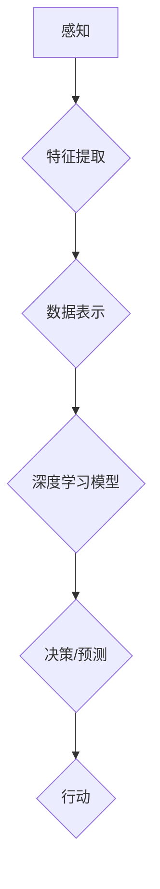

## 认知发展中的简单与深刻变化

> 关键词：人工智能、认知科学、深度学习、神经网络、算法、模型、应用场景、未来趋势

## 1. 背景介绍

人工智能（AI）的蓬勃发展，特别是深度学习技术的突破，为我们构建更智能、更具认知能力的机器系统提供了前所未有的机遇。然而，在追求 AI 强大功能的同时，我们也必须深入思考 AI 的认知发展本质，以及它与人类认知之间的关系。

人类的认知能力是复杂而多层次的，它包含感知、记忆、推理、语言理解等多个方面。而 AI 系统，特别是基于深度学习的模型，往往通过模仿人类大脑神经网络的结构和功能来学习和理解信息。尽管取得了显著进展，但 AI 仍然面临着许多挑战，例如缺乏真正的理解能力、泛化能力不足、对新知识的学习能力有限等。

## 2. 核心概念与联系

### 2.1 人工智能与认知科学

人工智能旨在模拟和扩展人类智能，而认知科学则致力于理解人类思维、学习和决策的机制。两者之间存在着密切的联系，认知科学为 AI 提供了重要的理论基础和启发，而 AI 的发展也推动了认知科学研究的进步。

### 2.2 深度学习与神经网络

深度学习是机器学习的一个子领域，它利用多层神经网络来学习复杂的数据模式。神经网络的结构灵感来源于人类大脑神经元网络，它由 interconnected 的节点组成，每个节点接收输入信号，并根据一定的规则进行处理，最终输出结果。

**Mermaid 流程图**



## 3. 核心算法原理 & 具体操作步骤

### 3.1 算法原理概述

深度学习算法的核心是通过训练神经网络来学习数据中的模式。训练过程涉及以下步骤：

1. **数据预处理:** 将原始数据转换为模型可以理解的格式。
2. **网络结构设计:** 根据任务需求设计神经网络的层数、节点数量和连接方式。
3. **参数初始化:** 为神经网络中的每个连接赋予初始权重。
4. **前向传播:** 将输入数据通过神经网络传递，计算输出结果。
5. **反向传播:** 计算输出结果与真实值的误差，并根据误差调整神经网络的参数。
6. **迭代训练:** 重复前向传播和反向传播步骤，直到模型性能达到预设目标。

### 3.2 算法步骤详解

1. **数据预处理:** 

   - 数据清洗：去除噪声、缺失值等异常数据。
   - 数据转换：将数据转换为数字格式，例如使用 one-hot 编码处理类别数据。
   - 数据归一化：将数据范围压缩到特定区间，例如 [0, 1] 或 [-1, 1]，提高模型训练效率。

2. **网络结构设计:**

   - 选择合适的网络架构：例如卷积神经网络（CNN）用于图像识别，循环神经网络（RNN）用于序列数据处理。
   - 确定层数和节点数量：层数和节点数量决定了网络的复杂度和学习能力。
   - 设计激活函数：激活函数引入非线性，使网络能够学习更复杂的模式。

3. **参数初始化:**

   - 使用随机初始化或预训练模型的权重作为初始值。
   - 正则化技术可以防止过拟合，例如 L1 和 L2 正则化。

4. **前向传播:**

   - 将输入数据逐层传递到神经网络中。
   - 每个节点根据权重和激活函数计算输出值。
   - 最终输出层产生预测结果。

5. **反向传播:**

   - 计算输出结果与真实值的误差。
   - 使用梯度下降算法更新神经网络的参数，使误差最小化。

6. **迭代训练:**

   - 将训练数据分成多个批次，每次训练一个批次数据。
   - 重复前向传播和反向传播步骤，直到模型性能达到预设目标。

### 3.3 算法优缺点

**优点:**

- 学习能力强：能够学习复杂的数据模式。
- 泛化能力好：能够应用于新的数据。
- 自动特征提取：无需人工提取特征。

**缺点:**

- 训练时间长：需要大量数据和计算资源。
- 难以解释：模型的决策过程难以理解。
- 容易过拟合：模型可能过拟合训练数据，导致泛化能力差。

### 3.4 算法应用领域

深度学习算法已广泛应用于各个领域，例如：

- 图像识别和分类
- 自然语言处理
- 语音识别
- 机器翻译
- 医疗诊断
- 金融预测

## 4. 数学模型和公式 & 详细讲解 & 举例说明

### 4.1 数学模型构建

深度学习模型可以看作是一个复杂的函数映射，将输入数据映射到输出结果。

**输入数据:** $x = (x_1, x_2,..., x_n)$

**输出结果:** $y = (y_1, y_2,..., y_m)$

**神经网络:** $f(x; \theta)$

其中，$f$ 表示神经网络的激活函数，$\theta$ 表示神经网络的参数。

### 4.2 公式推导过程

深度学习模型的训练过程基于最小化损失函数。损失函数衡量模型预测结果与真实值的差异。常用的损失函数包括均方误差（MSE）和交叉熵损失（CE）。

**均方误差 (MSE):**

$$MSE = \frac{1}{N} \sum_{i=1}^{N} (y_i - \hat{y}_i)^2$$

其中，$N$ 表示样本数量，$y_i$ 表示真实值，$\hat{y}_i$ 表示模型预测值。

**交叉熵损失 (CE):**

$$CE = -\frac{1}{N} \sum_{i=1}^{N} \sum_{j=1}^{M} y_{ij} \log(\hat{y}_{ij})$$

其中，$M$ 表示类别数量，$y_{ij}$ 表示真实标签，$\hat{y}_{ij}$ 表示模型预测概率。

通过梯度下降算法，不断更新神经网络的参数，使损失函数最小化。

### 4.3 案例分析与讲解

**图像分类:**

假设我们训练一个图像分类模型，用于识别猫和狗的图片。

- 输入数据: 图像像素值
- 输出结果: 猫或狗的类别标签

我们可以使用卷积神经网络（CNN）作为模型架构，并使用交叉熵损失函数进行训练。

训练过程中，模型会学习图像特征，并根据这些特征预测图像类别。

## 5. 项目实践：代码实例和详细解释说明

### 5.1 开发环境搭建

- Python 3.x
- TensorFlow 或 PyTorch 深度学习框架
- Jupyter Notebook 或 VS Code 开发环境

### 5.2 源代码详细实现

```python
import tensorflow as tf

# 定义模型架构
model = tf.keras.models.Sequential([
    tf.keras.layers.Conv2D(32, (3, 3), activation='relu', input_shape=(28, 28, 1)),
    tf.keras.layers.MaxPooling2D((2, 2)),
    tf.keras.layers.Conv2D(64, (3, 3), activation='relu'),
    tf.keras.layers.MaxPooling2D((2, 2)),
    tf.keras.layers.Flatten(),
    tf.keras.layers.Dense(10, activation='softmax')
])

# 编译模型
model.compile(optimizer='adam',
              loss='sparse_categorical_crossentropy',
              metrics=['accuracy'])

# 加载 MNIST 数据集
(x_train, y_train), (x_test, y_test) = tf.keras.datasets.mnist.load_data()

# 数据预处理
x_train = x_train.astype('float32') / 255.0
x_test = x_test.astype('float32') / 255.0
x_train = x_train.reshape((x_train.shape[0], 28, 28, 1))
x_test = x_test.reshape((x_test.shape[0], 28, 28, 1))

# 训练模型
model.fit(x_train, y_train, epochs=5)

# 评估模型
loss, accuracy = model.evaluate(x_test, y_test)
print('Test loss:', loss)
print('Test accuracy:', accuracy)
```

### 5.3 代码解读与分析

这段代码实现了使用 TensorFlow 框架训练一个简单的 MNIST 手写数字识别模型。

- 首先定义了模型架构，包括卷积层、池化层和全连接层。
- 然后编译模型，指定优化器、损失函数和评估指标。
- 加载 MNIST 数据集，并进行数据预处理，例如归一化和形状转换。
- 训练模型，指定训练轮数。
- 最后评估模型性能，打印测试损失和准确率。

### 5.4 运行结果展示

训练完成后，模型可以用于识别新的手写数字图像。

## 6. 实际应用场景

深度学习技术已广泛应用于各个领域，例如：

### 6.1 图像识别

- 自动驾驶汽车：识别道路标志、行人、车辆等。
- 医疗诊断：识别病灶、肿瘤等。
- 物体检测：识别图像中的物体类别和位置。

### 6.2 自然语言处理

- 机器翻译：将文本从一种语言翻译成另一种语言。
- 文本摘要：自动生成文本的摘要。
- 情感分析：分析文本的情感倾向。

### 6.3 语音识别

- 语音助手：例如 Siri、Alexa 等。
- 语音搜索：通过语音进行搜索。
- 语音识别系统：用于语音输入和控制。

### 6.4 其他应用场景

- 金融预测：预测股票价格、风险评估等。
- 推荐系统：推荐商品、电影、音乐等。
- 游戏人工智能：开发更智能的游戏角色。

## 7. 工具和资源推荐

### 7.1 学习资源推荐

- **书籍:**
    - 深度学习 (Deep Learning) - Ian Goodfellow, Yoshua Bengio, Aaron Courville
    - 构建深度学习神经网络 (Hands-On Machine Learning with Scikit-Learn, Keras & TensorFlow) - Aurélien Géron
- **在线课程:**
    - Coursera: 深度学习 Specialization
    - Udacity: Deep Learning Nanodegree
    - fast.ai: Practical Deep Learning for Coders

### 7.2 开发工具推荐

- **深度学习框架:**
    - TensorFlow
    - PyTorch
    - Keras
- **编程语言:**
    - Python
- **数据处理工具:**
    - Pandas
    - NumPy

### 7.3 相关论文推荐

- **ImageNet Classification with Deep Convolutional Neural Networks** - Alex Krizhevsky, Ilya Sutskever, Geoffrey E. Hinton
- **Attention Is All You Need** - Ashish Vaswani, Noam Shazeer, Niki Parmar, Jakob Uszkoreit, Llion Jones, Aidan N. Gomez, Łukasz Kaiser, Illia Polosukhin
- **Generative Adversarial Networks** - Ian Goodfellow, Jean Pouget-Abadie, Mehdi Mirza, Bing Xu, David Warde-Farley, Sherjil Ozair, Aaron Courville, Yoshua Bengio

## 8. 总结：未来发展趋势与挑战

### 8.1 研究成果总结

深度学习技术取得了显著的进展，在图像识别、自然语言处理等领域取得了突破性成果。

### 8.2 未来发展趋势

- **模型效率提升:** 探索更轻量级、更高效的模型架构，降低训练和推理成本。
- **数据增强:** 利用数据增强技术提高模型泛化能力，减少对大量