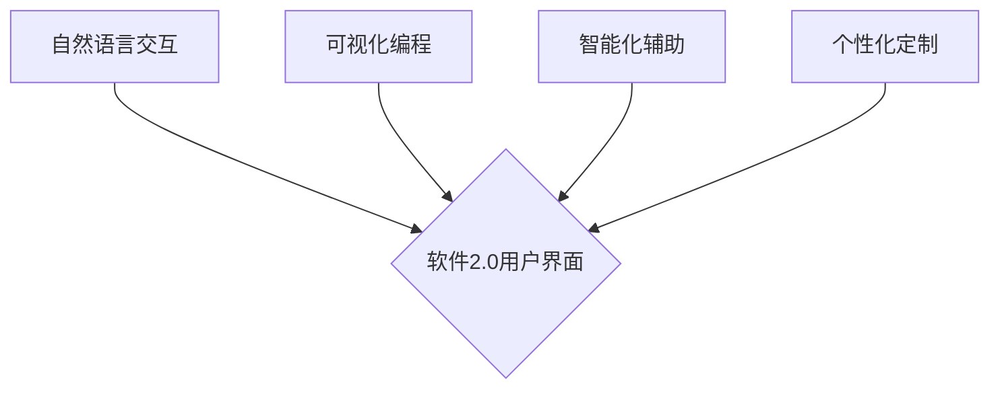

## 软件2.0的用户界面设计原则

> 关键词：用户界面设计、软件架构、人工智能、自然语言交互、可视化编程、用户体验、软件2.0

## 1. 背景介绍

软件行业正处于一个前所未有的变革时期。随着人工智能、云计算、大数据等技术的飞速发展，传统的软件开发模式和用户界面设计理念已经难以满足日益增长的用户需求。软件2.0时代来临，它强调用户体验、可定制性和智能化，对用户界面设计提出了更高的要求。

传统的软件界面设计往往以功能性和操作性为主，界面结构复杂、操作流程繁琐，用户需要花费大量时间和精力才能熟练掌握。而软件2.0的用户界面设计则更加注重用户体验，旨在提供更加直观、易用、个性化的交互方式。

## 2. 核心概念与联系

软件2.0的用户界面设计的核心概念包括：

* **自然语言交互 (Natural Language Interaction):**  用户可以使用自然语言与软件进行交互，无需学习复杂的命令或操作符。
* **可视化编程 (Visual Programming):**  用户可以通过拖放、连接等直观的操作方式进行编程，降低编程门槛。
* **智能化辅助 (Intelligent Assistance):**  软件能够根据用户的需求和行为模式提供智能化的建议和帮助。
* **个性化定制 (Personalized Customization):**  用户可以根据自己的喜好和需求定制软件的界面、功能和行为。

这些核心概念相互关联，共同构成了软件2.0用户界面设计的框架。



## 3. 核心算法原理 & 具体操作步骤

### 3.1  算法原理概述

软件2.0的用户界面设计依赖于多种先进算法，例如：

* **自然语言处理 (NLP):**  用于理解和处理用户的自然语言输入。
* **机器学习 (ML):**  用于训练软件模型，使其能够识别用户需求和行为模式。
* **深度学习 (DL):**  用于构建更复杂的软件模型，提高智能化辅助的精度和效率。

这些算法共同作用，使软件能够理解用户的意图，并提供相应的响应和帮助。

### 3.2  算法步骤详解

以自然语言交互为例，其基本步骤如下：

1. **输入处理:**  接收用户的自然语言输入，并进行预处理，例如去除停用词、分词等。
2. **语义分析:**  分析用户的输入，识别出关键信息和意图。
3. **意图识别:**  根据语义分析结果，识别用户的意图，例如查询信息、执行操作等。
4. **响应生成:**  根据用户的意图，生成相应的响应，例如返回信息、执行操作等。
5. **输出呈现:**  将响应以用户可理解的方式呈现出来，例如文本、语音、图像等。

### 3.3  算法优缺点

**优点:**

* **提高用户体验:**  自然语言交互更加直观、易用，可以减少用户学习成本。
* **增强软件智能化:**  机器学习和深度学习算法可以使软件更加智能化，能够理解用户的复杂需求。
* **拓展软件应用场景:**  自然语言交互可以使软件应用于更多场景，例如语音助手、智能客服等。

**缺点:**

* **算法复杂度高:**  自然语言处理算法非常复杂，需要大量的训练数据和计算资源。
* **理解歧义性:**  自然语言具有歧义性，算法可能无法准确理解用户的意图。
* **安全风险:**  自然语言交互可能存在安全风险，例如恶意攻击、数据泄露等。

### 3.4  算法应用领域

自然语言交互算法广泛应用于以下领域：

* **语音助手:**  例如 Siri、Alexa、Google Assistant 等。
* **智能客服:**  例如聊天机器人、虚拟助理等。
* **搜索引擎:**  例如 Google、Bing 等。
* **翻译软件:**  例如 Google Translate、DeepL 等。
* **文本生成:**  例如自动写作、代码生成等。

## 4. 数学模型和公式 & 详细讲解 & 举例说明

### 4.1  数学模型构建

自然语言处理中常用的数学模型包括：

* **词向量模型 (Word Embedding):**  将单词映射到低维向量空间，捕捉单词之间的语义关系。例如 Word2Vec、GloVe 等。
* **循环神经网络 (RNN):**  能够处理序列数据，例如文本，并捕捉文本中的上下文信息。例如 LSTM、GRU 等。
* **Transformer:**  一种基于注意力机制的网络结构，能够更有效地捕捉长距离依赖关系。例如 BERT、GPT 等。

### 4.2  公式推导过程

词向量模型的训练目标是最大化单词在语境中的相似度。可以使用以下公式来表示：

$$
\text{目标函数} = \sum_{w_i, w_j \in V} \log P(w_j | w_i)
$$

其中：

* $V$ 是词典
* $w_i$ 和 $w_j$ 是两个单词
* $P(w_j | w_i)$ 是给定 $w_i$ 的条件下 $w_j$ 出现的概率

### 4.3  案例分析与讲解

例如，使用 Word2Vec 模型训练词向量，可以得到以下结果：

* "king" - "man" + "woman" ≈ "queen"

这个结果表明，Word2Vec 模型能够捕捉到单词之间的语义关系，例如 "king" 和 "queen" 是性别相反的关系。

## 5. 项目实践：代码实例和详细解释说明

### 5.1  开发环境搭建

* Python 3.x
* TensorFlow 或 PyTorch
* NLTK 或 spaCy

### 5.2  源代码详细实现

```python
import nltk
from nltk.corpus import stopwords

# 下载停用词列表
nltk.download('stopwords')

# 定义一个函数来处理文本数据
def preprocess_text(text):
    # 将文本转换为小写
    text = text.lower()
    # 去除停用词
    stop_words = set(stopwords.words('english'))
    words = [word for word in text.split() if word not in stop_words]
    # 返回处理后的文本
    return''.join(words)

# 示例文本
text = "This is an example text to demonstrate text preprocessing."

# 处理文本
processed_text = preprocess_text(text)

# 打印处理后的文本
print(processed_text)
```

### 5.3  代码解读与分析

这段代码演示了如何使用 NLTK 库对文本数据进行预处理。

* `preprocess_text()` 函数接受文本作为输入，并执行以下操作：
    * 将文本转换为小写
    * 去除停用词
    * 返回处理后的文本

* `nltk.download('stopwords')` 下载停用词列表。

* `stop_words = set(stopwords.words('english'))` 创建一个包含英语停用词的集合。

* `words = [word for word in text.split() if word not in stop_words]` 使用列表推导式过滤掉停用词。

* `print(processed_text)` 打印处理后的文本。

### 5.4  运行结果展示

```
example text demonstrate text preprocessing
```

## 6. 实际应用场景

软件2.0的用户界面设计在各个领域都有广泛的应用场景：

* **教育:**  提供更加个性化、交互式的学习体验。
* **医疗:**  辅助医生诊断疾病、制定治疗方案。
* **金融:**  提供更加智能化的理财服务。
* **娱乐:**  打造更加沉浸式的游戏体验。

### 6.4  未来应用展望

随着人工智能技术的不断发展，软件2.0的用户界面设计将更加智能化、个性化和人性化。未来，我们可能会看到：

* **更加自然的交互方式:**  例如手势识别、眼动追踪等。
* **更加智能化的辅助功能:**  例如自动完成任务、提供个性化建议等。
* **更加沉浸式的体验:**  例如虚拟现实、增强现实等。

## 7. 工具和资源推荐

### 7.1  学习资源推荐

* **书籍:**
    * 《深度学习》
    * 《自然语言处理》
    * 《软件架构》
* **在线课程:**
    * Coursera
    * edX
    * Udacity

### 7.2  开发工具推荐

* **Python:**  一个功能强大、易于学习的编程语言。
* **TensorFlow:**  一个开源的机器学习框架。
* **PyTorch:**  另一个开源的机器学习框架。
* **NLTK:**  一个自然语言处理工具包。
* **spaCy:**  一个高效的自然语言处理库。

### 7.3  相关论文推荐

* **Attention Is All You Need**
* **BERT: Pre-training of Deep Bidirectional Transformers for Language Understanding**
* **GPT-3: Language Models are Few-Shot Learners**

## 8. 总结：未来发展趋势与挑战

### 8.1  研究成果总结

软件2.0的用户界面设计取得了显著的进展，例如自然语言交互、可视化编程、智能化辅助等技术已经取得了一定的应用成果。

### 8.2  未来发展趋势

未来，软件2.0的用户界面设计将朝着更加智能化、个性化和人性化的方向发展。

### 8.3  面临的挑战

* **算法复杂度:**  自然语言处理和机器学习算法非常复杂，需要大量的计算资源和训练数据。
* **数据安全:**  用户数据安全是一个重要的挑战，需要采取有效的措施保护用户隐私。
* **伦理问题:**  人工智能技术的发展也带来了伦理问题，例如算法偏见、工作岗位替代等。

### 8.4  研究展望

未来，我们需要继续研究更加高效、准确、安全的算法，并探索人工智能技术在用户界面设计中的更多应用场景。同时，我们也需要关注人工智能技术的伦理问题，确保其能够造福人类社会。

## 9. 附录：常见问题与解答

* **Q: 软件2.0的用户界面设计与传统软件界面设计有什么区别？**

* **A:** 软件2.0的用户界面设计更加注重用户体验，强调自然语言交互、可视化编程、智能化辅助和个性化定制。

* **Q: 软件2.0的用户界面设计有哪些应用场景？**

* **A:** 软件2.0的用户界面设计应用于各个领域，例如教育、医疗、金融、娱乐等。

* **Q: 软件2.0的用户界面设计面临哪些挑战？**

* **A:** 软件2.0的用户界面设计面临算法复杂度、数据安全和伦理问题等挑战。


作者：禅与计算机程序设计艺术 / Zen and the Art of Computer Programming 
