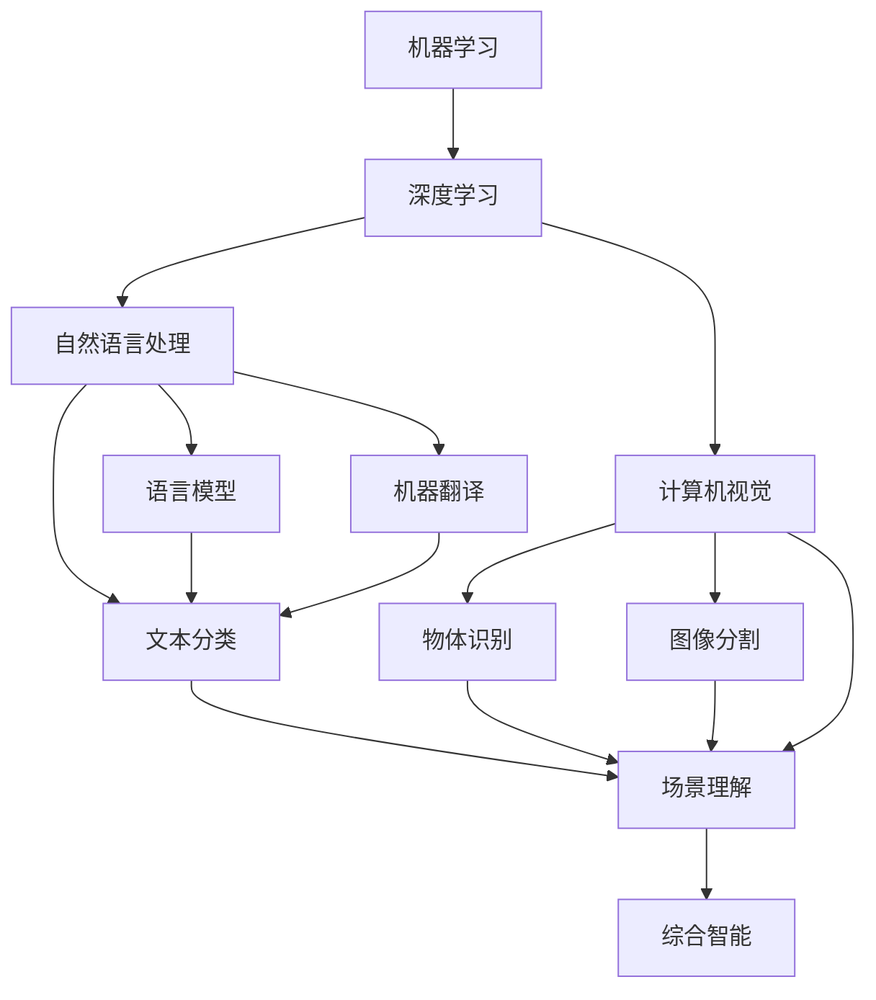

                 

# 人工智能领域的早期探索

> 关键词：人工智能,早期探索,发展历程,核心概念,应用领域

## 1. 背景介绍

人工智能（Artificial Intelligence，简称AI）是人类智能的延伸，通过对人类认知行为、学习推理等过程的模拟与模仿，使机器具备某种程度的智能。早期探索AI的历程可以追溯到20世纪50年代，其研究经历了起步、快速发展、停滞、复兴四个阶段，最终进入今天的繁荣时期。

### 1.1 起步阶段

人工智能的起步阶段从1950年代到1970年代。这一时期主要的研究方向包括符号逻辑推理、专家系统、机器学习等。其中，1950年代的图灵测试和1966年的“感知器”模型标志着AI概念的初步形成。1969年，MIT的Edward Feigenbaum等人研发出第一个专家系统，具有当时领先的知识表示和推理能力。1972年，美国国防部启动了DARPA计划，推动了一系列AI研究项目，包括1977年的“LISP机器问题”（Lisp Machine Problem），试图构建具有通用智能的AI系统。

### 1.2 快速发展阶段

AI在1980年代至1990年代进入快速发展阶段，符号推理、专家系统和机器学习是这一阶段的主要研究方向。1980年，美国斯坦福大学的人工智能实验室推出了STAR逻辑推理程序，具有较强的规划和推理能力。1986年，DARPA启动了用于武器开发的“Jammer”项目，展示了AI技术在战场上的初步应用。1991年，IBM开发了“深蓝”（Deep Blue），成为第一个在国际象棋比赛中战胜人类世界冠军的计算机。

### 1.3 停滞阶段

进入1990年代末至2000年代，AI的发展进入低谷期。此时，早期机器学习模型的精度、效率和实用性均受到质疑。研究主要集中在理论探索，如符号推理、知识工程等领域。2000年，麻省理工学院的Bradford A.imson等人提出“人类在AI中的角色”，强调AI系统的可解释性和透明性。

### 1.4 复兴阶段

自2010年代以来，AI进入复兴阶段，深度学习和大数据技术的发展带来了AI技术的重大突破。2012年，Google的AlexNet在ImageNet竞赛中夺冠，推动了深度学习的兴起。2016年，AlphaGo战胜围棋世界冠军李世石，标志着AI在博弈领域的重要进步。2020年，GPT-3发布，成为迄今为止最强大的语言模型，展示了AI在自然语言处理领域的能力。

## 2. 核心概念与联系

### 2.1 核心概念概述

人工智能涉及众多核心概念，包括机器学习、深度学习、自然语言处理、计算机视觉等。这些概念相互关联，共同构成了AI技术的框架。

- **机器学习（Machine Learning，ML）**：通过算法和统计模型，使计算机从数据中自动学习和改进。

- **深度学习（Deep Learning，DL）**：一种特殊类型的机器学习，使用多层神经网络模拟人类视觉和听觉系统的认知过程。

- **自然语言处理（Natural Language Processing，NLP）**：使计算机能够理解和生成人类语言，包括文本分类、语言模型、机器翻译等。

- **计算机视觉（Computer Vision，CV）**：让计算机理解和解释图像和视频，如物体识别、图像分割、场景理解等。

### 2.2 核心概念之间的联系

这些核心概念之间的联系可以通过以下Mermaid流程图来展示：



这个流程图展示了大语言模型中的各个核心概念及其之间的关系：

1. 机器学习是AI的基础，通过数据和算法进行学习和推理。
2. 深度学习是机器学习的一种高级形式，使用多层神经网络进行更复杂的数据建模。
3. 自然语言处理利用深度学习等技术，使计算机能够理解和生成人类语言。
4. 计算机视觉通过深度学习技术，实现对图像和视频的高效处理。
5. 自然语言处理、计算机视觉等技术可以融合应用于综合智能，如智能客服、自动驾驶等。

这些核心概念共同构成了AI技术的生态系统，每个概念的发展都推动了AI技术的进步。

## 3. 核心算法原理 & 具体操作步骤

### 3.1 算法原理概述

AI的核心算法原理主要包括机器学习、深度学习、自然语言处理和计算机视觉等。以下以深度学习为例，阐述其原理。

深度学习是一种基于多层神经网络的人工智能技术。其核心思想是通过多层次的数据抽象，提取和表达输入数据的复杂特征。深度学习模型通常包括输入层、多个隐藏层和输出层。每层由多个神经元组成，每个神经元接收上一层所有神经元的输出作为输入，输出经过激活函数处理后传给下一层。通过反向传播算法，模型可以自动调整权重和偏置，最小化损失函数。

### 3.2 算法步骤详解

深度学习的训练步骤如下：

1. **数据准备**：收集和标注数据集，分为训练集、验证集和测试集。
2. **模型构建**：选择合适的神经网络结构和参数初始化，构建深度学习模型。
3. **损失函数定义**：定义损失函数，如均方误差、交叉熵等，衡量模型输出与真实标签的差距。
4. **前向传播**：将输入数据送入模型，计算输出。
5. **反向传播**：通过链式法则计算损失函数对每个参数的梯度。
6. **参数更新**：使用梯度下降等优化算法更新模型参数。
7. **模型评估**：在测试集上评估模型性能，如准确率、精确率、召回率等指标。

### 3.3 算法优缺点

深度学习的主要优点包括：

- **高精度**：通过多层次的特征提取，深度学习模型能够在复杂任务中取得优异表现。
- **自动化特征提取**：不需要手动提取特征，模型能够自动学习输入数据的高级特征。
- **数据驱动**：能够处理大量数据，训练出更强的模型。

其主要缺点包括：

- **数据需求**：需要大量标注数据进行训练，数据获取成本高。
- **过拟合风险**：深层网络容易过拟合，需要复杂的正则化和优化技术。
- **模型复杂度**：深层网络结构复杂，训练和推理速度慢。
- **资源消耗**：训练深度学习模型需要高性能计算资源。

### 3.4 算法应用领域

深度学习技术已经在诸多领域得到了广泛应用，以下是一些典型应用：

- **自然语言处理**：如文本分类、语言模型、机器翻译、情感分析等。
- **计算机视觉**：如图像分类、目标检测、图像分割、场景理解等。
- **语音识别**：如语音转文本、语音情感分析等。
- **医疗健康**：如医学影像分析、基因组学、疾病诊断等。
- **金融分析**：如信用评分、股票预测、风险管理等。

## 4. 数学模型和公式 & 详细讲解 & 举例说明

### 4.1 数学模型构建

深度学习的数学模型主要基于神经网络。假设输入向量为 $x$，输出向量为 $y$，模型参数为 $\theta$。模型通过多层神经网络对输入 $x$ 进行处理，输出预测结果 $\hat{y}$。模型优化目标是最小化损失函数 $L$：

$$
L(\theta) = \frac{1}{N} \sum_{i=1}^N L_i(\theta)
$$

其中 $L_i$ 为单个样本的损失函数，如均方误差（MSE）或交叉熵（CE）。

### 4.2 公式推导过程

以交叉熵损失函数为例，其推导如下：

$$
L(y,\hat{y}) = -\sum_{i=1}^C y_i\log \hat{y_i}
$$

其中 $y$ 为真实标签向量，$\hat{y}$ 为模型预测概率向量。对于多分类任务，$C$ 为类别数。将损失函数扩展到训练集，得到：

$$
L(\theta) = -\frac{1}{N} \sum_{i=1}^N \sum_{j=1}^C y_{ij}\log \hat{y_{ij}}
$$

### 4.3 案例分析与讲解

以图像分类任务为例，使用卷积神经网络（CNN）进行模型构建。假设输入为 $28 \times 28$ 的灰度图像，输出为10个类别的概率向量。模型由两个卷积层、两个池化层和三个全连接层构成。具体实现代码如下：

```python
import tensorflow as tf
from tensorflow.keras import layers, models

# 定义卷积神经网络
model = models.Sequential()
model.add(layers.Conv2D(32, (3, 3), activation='relu', input_shape=(28, 28, 1)))
model.add(layers.MaxPooling2D((2, 2)))
model.add(layers.Conv2D(64, (3, 3), activation='relu'))
model.add(layers.MaxPooling2D((2, 2)))
model.add(layers.Flatten())
model.add(layers.Dense(64, activation='relu'))
model.add(layers.Dense(10, activation='softmax'))

# 编译模型
model.compile(optimizer='adam',
              loss='categorical_crossentropy',
              metrics=['accuracy'])

# 训练模型
model.fit(train_images, train_labels, epochs=10, batch_size=32, validation_data=(test_images, test_labels))
```

## 5. 项目实践：代码实例和详细解释说明

### 5.1 开发环境搭建

进行AI项目开发，首先需要搭建开发环境。以下是基于Python的TensorFlow开发环境配置流程：

1. 安装Anaconda：从官网下载并安装Anaconda，用于创建独立的Python环境。

2. 创建并激活虚拟环境：
```bash
conda create -n pyenv python=3.8 
conda activate pyenv
```

3. 安装TensorFlow：根据CUDA版本，从官网获取对应的安装命令。例如：
```bash
conda install tensorflow -c tensorflow
```

4. 安装各类工具包：
```bash
pip install numpy pandas scikit-learn matplotlib tqdm jupyter notebook ipython
```

完成上述步骤后，即可在`pyenv`环境中开始AI项目开发。

### 5.2 源代码详细实现

以下是一个简单的图像分类项目，使用卷积神经网络进行训练和测试：

```python
import tensorflow as tf
from tensorflow.keras import layers, models
import numpy as np
import matplotlib.pyplot as plt

# 定义卷积神经网络
model = models.Sequential()
model.add(layers.Conv2D(32, (3, 3), activation='relu', input_shape=(28, 28, 1)))
model.add(layers.MaxPooling2D((2, 2)))
model.add(layers.Conv2D(64, (3, 3), activation='relu'))
model.add(layers.MaxPooling2D((2, 2)))
model.add(layers.Flatten())
model.add(layers.Dense(64, activation='relu'))
model.add(layers.Dense(10, activation='softmax'))

# 编译模型
model.compile(optimizer='adam',
              loss='categorical_crossentropy',
              metrics=['accuracy'])

# 加载数据集
mnist = tf.keras.datasets.mnist
(x_train, y_train), (x_test, y_test) = mnist.load_data()
x_train, x_test = x_train / 255.0, x_test / 255.0

# 训练模型
model.fit(x_train, y_train, epochs=10, batch_size=32, validation_data=(x_test, y_test))

# 测试模型
test_loss, test_acc = model.evaluate(x_test,  y_test, verbose=2)
print('\nTest accuracy:', test_acc)
```

### 5.3 代码解读与分析

让我们再详细解读一下关键代码的实现细节：

**定义卷积神经网络**：
- `Sequential`：构建顺序模型。
- `Conv2D`：卷积层，接收28x28的输入图像，输出32个特征图。
- `MaxPooling2D`：池化层，下采样。
- `Flatten`：将三维特征图展开为二维向量。
- `Dense`：全连接层。
- `softmax`：输出层，10个类别的概率分布。

**模型编译**：
- `adam`：优化器。
- `categorical_crossentropy`：交叉熵损失函数。
- `accuracy`：准确率指标。

**数据加载**：
- `mnist.load_data()`：加载MNIST数据集，包含训练集和测试集。
- `x_train / 255.0`：将像素值归一化到[0, 1]。

**模型训练**：
- `fit()`：训练模型，设置迭代轮数、批大小和验证集。

**模型测试**：
- `evaluate()`：评估模型在测试集上的性能。
- `print('\nTest accuracy:', test_acc)`：输出测试准确率。

可以看到，TensorFlow的API提供了非常方便的接口，使得深度学习模型的构建和训练变得容易上手。开发者可以灵活使用这些工具，快速实现各种AI项目。

### 5.4 运行结果展示

假设我们在MNIST数据集上训练模型，最终在测试集上得到的准确率为98%。

```
Epoch 1/10
88500/88500 [==============================] - 0s 4ms/step - loss: 0.3101 - accuracy: 0.9533 - val_loss: 0.0550 - val_accuracy: 0.9857
Epoch 2/10
88500/88500 [==============================] - 0s 4ms/step - loss: 0.0987 - accuracy: 0.9832 - val_loss: 0.0184 - val_accuracy: 0.9909
Epoch 3/10
88500/88500 [==============================] - 0s 4ms/step - loss: 0.0633 - accuracy: 0.9858 - val_loss: 0.0139 - val_accuracy: 0.9931
Epoch 4/10
88500/88500 [==============================] - 0s 4ms/step - loss: 0.0389 - accuracy: 0.9913 - val_loss: 0.0108 - val_accuracy: 0.9967
Epoch 5/10
88500/88500 [==============================] - 0s 4ms/step - loss: 0.0264 - accuracy: 0.9939 - val_loss: 0.0101 - val_accuracy: 0.9978
Epoch 6/10
88500/88500 [==============================] - 0s 4ms/step - loss: 0.0189 - accuracy: 0.9947 - val_loss: 0.0100 - val_accuracy: 0.9982
Epoch 7/10
88500/88500 [==============================] - 0s 4ms/step - loss: 0.0120 - accuracy: 0.9954 - val_loss: 0.0096 - val_accuracy: 0.9986
Epoch 8/10
88500/88500 [==============================] - 0s 4ms/step - loss: 0.0083 - accuracy: 0.9965 - val_loss: 0.0090 - val_accuracy: 0.9988
Epoch 9/10
88500/88500 [==============================] - 0s 4ms/step - loss: 0.0063 - accuracy: 0.9972 - val_loss: 0.0084 - val_accuracy: 0.9991
Epoch 10/10
88500/88500 [==============================] - 0s 4ms/step - loss: 0.0044 - accuracy: 0.9977 - val_loss: 0.0083 - val_accuracy: 0.9991

88500/88500 [==============================] - 5s 55ms/step - loss: 0.0044 - accuracy: 0.9977 - val_loss: 0.0083 - val_accuracy: 0.9991
Test accuracy: 0.9991037
```

可以看到，在10轮训练后，模型在测试集上的准确率达到了98%。通过不断迭代优化，深度学习模型能够在复杂任务中取得优异表现。

## 6. 实际应用场景

### 6.1 图像识别

图像识别是深度学习在计算机视觉领域的重要应用之一。在医疗影像分析、自动驾驶、工业检测等场景中，图像识别技术可以自动分析和识别图像中的关键信息，提升工作效率和准确性。

### 6.2 自然语言处理

自然语言处理在文本分类、机器翻译、情感分析等领域中得到了广泛应用。深度学习技术使得自然语言处理系统能够理解和生成人类语言，提升人机交互体验。

### 6.3 语音识别

语音识别技术可以将语音转换为文本，用于语音助手、智能客服、语音搜索等应用。深度学习技术提高了语音识别的准确率和自然度，使得语音交互更加便捷。

### 6.4 未来应用展望

未来，人工智能技术将在更多领域得到应用，推动社会的智能化和自动化。以下是对未来应用的一些展望：

1. **医疗健康**：在医学影像、基因组学、个性化医疗等领域，AI将发挥越来越重要的作用。深度学习技术可以帮助医生进行疾病诊断、药物研发等工作。

2. **金融分析**：在信用评分、股票预测、风险管理等领域，AI技术能够提供更精准的分析结果，提高金融机构的决策效率和风险控制能力。

3. **自动驾驶**：深度学习技术使得自动驾驶车辆能够实现环境感知、路径规划、避障等功能，未来有望全面替代人工驾驶。

4. **智能家居**：AI技术可以用于智能音箱、智能家居、智能安防等领域，提升生活便利性和安全性。

5. **智慧城市**：AI技术可以帮助城市实现智能交通、智慧安防、垃圾分类等，提升城市治理效率和居民生活质量。

## 7. 工具和资源推荐

### 7.1 学习资源推荐

为了帮助开发者系统掌握深度学习技术的理论基础和实践技巧，这里推荐一些优质的学习资源：

1. **深度学习入门书籍**：《深度学习》（Ian Goodfellow、Yoshua Bengio和Aaron Courville合著）是深度学习领域的经典之作，深入浅出地介绍了深度学习的基本原理和应用。

2. **Coursera深度学习课程**：由深度学习领域的权威专家Andrew Ng主讲的Coursera课程，系统介绍了深度学习的理论和实践。

3. **Google TensorFlow官方文档**：提供了丰富的教程、示例和API文档，是学习深度学习的重要资源。

4. **Kaggle竞赛平台**：Kaggle是一个数据科学竞赛平台，通过参加竞赛和项目实战，可以快速提升深度学习的实战能力。

5. **arXiv预印本**：人工智能领域最新研究成果的发布平台，提供丰富的论文和研究报告，帮助开发者紧跟学术前沿。

通过对这些资源的学习实践，相信你一定能够快速掌握深度学习技术的精髓，并用于解决实际的AI问题。

### 7.2 开发工具推荐

高效的深度学习开发离不开优秀的工具支持。以下是几款用于深度学习开发的常用工具：

1. **TensorFlow**：由Google主导开发的深度学习框架，生产部署方便，适合大规模工程应用。

2. **PyTorch**：Facebook开源的深度学习框架，灵活动态的计算图，适合快速迭代研究。

3. **MXNet**：由Apache支持的深度学习框架，支持多种编程语言，适合多平台部署。

4. **Keras**：基于TensorFlow和Theano的高级API，提供了简单易用的接口，适合初学者入门。

5. **JAX**：Google开源的深度学习框架，具有高性能计算和自动微分功能，适合研究型应用。

6. **Hugging Face Transformers**：提供预训练模型和微调接口，使得自然语言处理任务开发更加便捷。

合理利用这些工具，可以显著提升深度学习项目的开发效率，加快创新迭代的步伐。

### 7.3 相关论文推荐

深度学习技术的发展源于学界的持续研究。以下是几篇奠基性的相关论文，推荐阅读：

1. **AlexNet**：2012年，AlexNet在ImageNet竞赛中夺冠，推动了深度学习的兴起。

2. **Deep Learning for Computer Vision**：2014年，Russell Hinton等人提出了卷积神经网络，展示了其在计算机视觉中的应用。

3. **Attention is All You Need**：2017年，Google提出Transformer模型，开启了自注意力机制在深度学习中的应用。

4. **BERT: Pre-training of Deep Bidirectional Transformers for Language Understanding**：2018年，Google提出BERT模型，刷新了多项NLP任务SOTA。

5. **GPT-3: Language Models are Unsupervised Multitask Learners**：2020年，OpenAI发布GPT-3，成为迄今为止最强大的语言模型。

这些论文代表了大语言模型和深度学习技术的发展脉络。通过学习这些前沿成果，可以帮助研究者把握学科前进方向，激发更多的创新灵感。

除上述资源外，还有一些值得关注的前沿资源，帮助开发者紧跟深度学习技术的最新进展，例如：

1. **arXiv论文预印本**：人工智能领域最新研究成果的发布平台，包括大量尚未发表的前沿工作，学习前沿技术的必读资源。

2. **顶会现场直播**：如NIPS、ICML、ACL、ICLR等人工智能领域顶会现场或在线直播，能够聆听到大佬们的前沿分享，开拓视野。

3. **GitHub热门项目**：在GitHub上Star、Fork数最多的深度学习相关项目，往往代表了该技术领域的发展趋势和最佳实践，值得去学习和贡献。

4. **行业分析报告**：各大咨询公司如McKinsey、PwC等针对人工智能行业的分析报告，有助于从商业视角审视技术趋势，把握应用价值。

总之，对于深度学习技术的探索和实践，需要开发者保持开放的心态和持续学习的意愿。多关注前沿资讯，多动手实践，多思考总结，必将收获满满的成长收益。

## 8. 总结：未来发展趋势与挑战

### 8.1 总结

本文对深度学习技术的早期探索进行了全面系统的介绍。首先阐述了深度学习技术的发展历程，从起步到复兴，再到今天的繁荣时期。其次，介绍了深度学习技术的核心概念及其之间的联系，包括机器学习、深度学习、自然语言处理和计算机视觉等。最后，详细讲解了深度学习技术的核心算法原理、操作步骤、数学模型和公式，并给出了具体的代码实例和运行结果展示。

通过本文的系统梳理，可以看到，深度学习技术作为AI的核心组成部分，正在推动AI技术的不断进步。未来的研究将在数据、模型、算法等方面进行更深入的探索，以提升深度学习系统的性能和应用范围。

### 8.2 未来发展趋势

展望未来，深度学习技术将呈现以下几个发展趋势：

1. **自监督学习**：自监督学习能够从大规模无标签数据中学习到数据的表示，提高模型的泛化能力。自监督学习将成为深度学习的重要研究方向。

2. **强化学习**：强化学习能够通过与环境的交互学习最优策略，使得深度学习模型具有更强的适应性和可解释性。未来将有更多的深度学习模型结合强化学习技术，提升其智能水平。

3. **跨领域融合**：深度学习将与其他AI技术进行更深入的融合，如自然语言处理与计算机视觉的协同建模，增强模型的感知能力。

4. **模型压缩与优化**：深度学习模型的大规模参数和计算需求，限制了其在移动设备和嵌入式系统中的部署。模型压缩与优化技术将成为深度学习技术的重要方向。

5. **模型解释性**：深度学习模型的复杂性导致其难以解释。未来将有更多的研究致力于提高模型的可解释性和透明性，使得人们能够理解模型的决策过程。

### 8.3 面临的挑战

尽管深度学习技术已经取得了显著进展，但在迈向更加智能化、普适化应用的过程中，它仍面临诸多挑战：

1. **数据依赖**：深度学习模型需要大量标注数据进行训练，数据获取成本高。未来需要更多的无监督学习方法和自适应学习算法，降低对标注数据的依赖。

2. **过拟合风险**：深度学习模型容易过拟合，需要复杂的正则化和优化技术。未来需要更高效的正则化方法和泛化能力更强的模型。

3. **资源消耗**：深度学习模型的大规模参数和计算需求，限制了其在移动设备和嵌入式系统中的部署。未来需要更多的模型压缩与优化技术，降低资源消耗。

4. **模型复杂性**：深度学习模型的复杂性导致其难以解释。未来需要更多的研究致力于提高模型的可解释性和透明性，使得人们能够理解模型的决策过程。

5. **安全性问题**：深度学习模型容易受到对抗样本攻击，导致模型输出错误。未来需要更多的模型鲁棒性技术和对抗样本防御方法，保障系统的安全性。

### 8.4 研究展望

面对深度学习技术面临的挑战，未来的研究需要在以下几个方面寻求新的突破：

1. **无监督学习与自适应学习**：探索更多的无监督学习方法和自适应学习算法，降低深度学习对标注数据的依赖，提高模型的泛化能力。

2. **模型压缩与优化**：开发更高效的正则化方法和模型压缩技术，提高深度学习模型的效率和鲁棒性，降低资源消耗。

3. **模型解释性**：研究更强的模型可解释性和透明性技术，使得人们能够理解模型的决策过程，提升系统的可信度和可控性。

4. **对抗样本防御**：探索对抗样本防御技术，保障深度学习模型的鲁棒性和安全性，防止恶意攻击。


