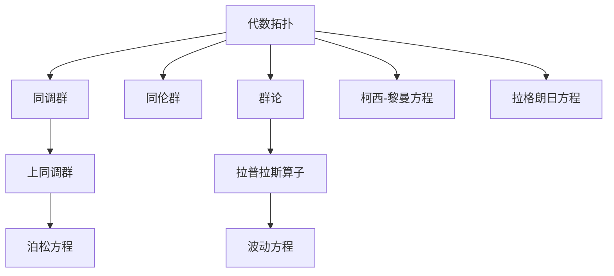
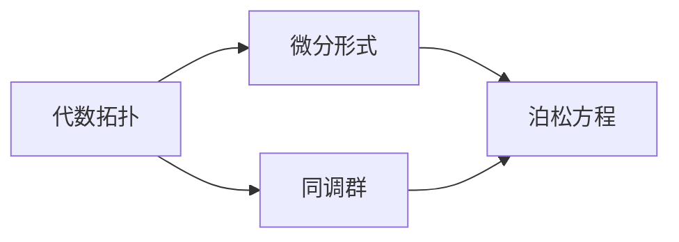
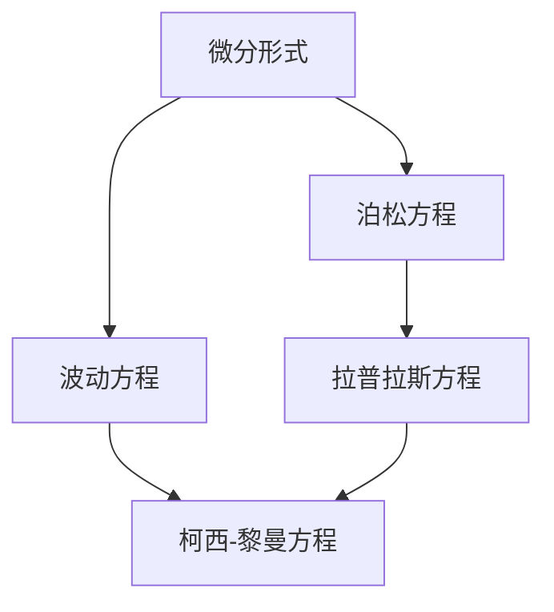
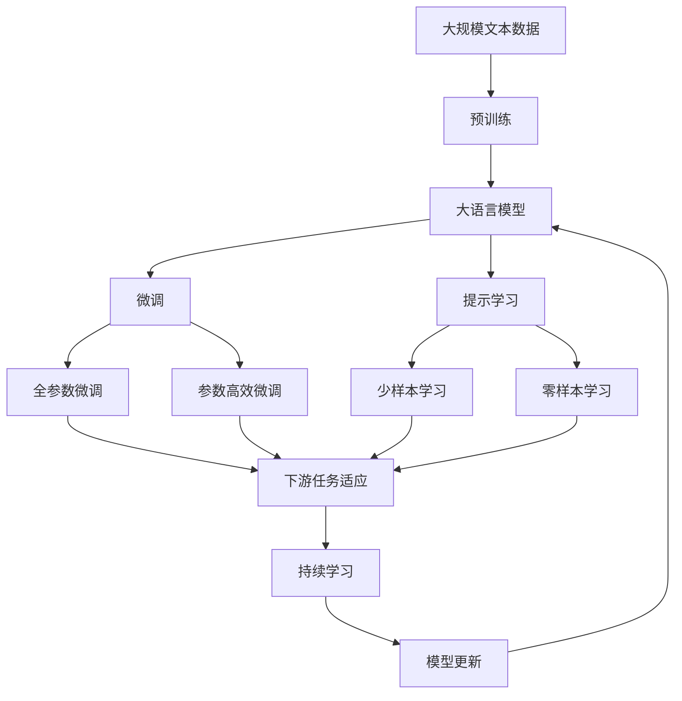

                 

## 1. 背景介绍

### 1.1 问题由来
代数拓扑与微分形式是现代数学的两个重要分支。代数拓扑主要研究拓扑空间的性质和结构，而微分形式则主要研究流形的局部几何性质及其拓扑性质。长期以来，这两大数学分支间缺乏直接联系，限制了数学和物理研究的深度和广度。近年来，随着计算数学和计算机科学的发展，代数拓扑与微分形式的结合成为可能，开启了新的研究方向和应用领域。

### 1.2 问题核心关键点
代数拓扑与微分形式的结合，旨在建立两者之间的桥梁，使得不同领域的数学家、物理学家和计算机科学家能够共享研究成果，推动数学和物理的深度融合，以及计算机科学在其中的应用。

### 1.3 问题研究意义
这一研究不仅有助于解决数学和物理中的难题，还能促进计算数学和计算机科学的发展。具体而言：
1. 促进跨学科交流：不同领域的数学家和物理学家能够共享研究成果，解决各自领域中的难题。
2. 提供新算法：结合代数拓扑与微分形式的理论，开发新的计算算法，提升计算效率。
3. 应用拓展：如在复杂系统的建模与分析、生物信息学、材料科学等领域中，提供新的方法和工具。
4. 理论深化：通过数学模型和计算方法，验证和深化已有的数学理论和物理假设。

## 2. 核心概念与联系

### 2.1 核心概念概述

为更好地理解代数拓扑与微分形式的结合，本节将介绍几个密切相关的核心概念：

- 代数拓扑(Algebraic Topology)：研究拓扑空间的代数结构，如同调群、同伦群、群论等。
- 微分形式(Differential Forms)：研究流形的局部几何性质，如梯度、散度、旋度等。
- 上同调群(Cohomology Groups)：代数拓扑中用于描述拓扑空间的群结构。
- 拉普拉斯算子(Laplacian Operator)：微分形式中用于研究泊松方程、波动方程等物理问题的算子。
- 柯西-黎曼方程(Cauchy-Riemann Equations)：复分析中用于描述复函数的性质和行为的方程。
- 拉格朗日方程(Lagrange Equations)：分析力学中用于描述系统动态行为的方程。

这些核心概念之间的逻辑关系可以通过以下Mermaid流程图来展示：



这个流程图展示了几大核心概念之间的联系：

1. 代数拓扑中的群论、同调群等概念，为研究微分形式的拉普拉斯算子、泊松方程等提供了基础。
2. 微分形式中的拉普拉斯算子、波动方程等，为求解代数拓扑中的上同调群等提供了工具。
3. 复分析中的柯西-黎曼方程，为处理微分形式中的复函数问题提供了方法。
4. 分析力学中的拉格朗日方程，为处理微分形式中的物理系统问题提供了模型。

这些概念共同构成了代数拓扑与微分形式之间的桥梁，为两者之间的结合提供了理论基础。

### 2.2 概念间的关系

这些核心概念之间存在着紧密的联系，形成了代数拓扑与微分形式结合的整体生态系统。下面我们通过几个Mermaid流程图来展示这些概念之间的关系。

#### 2.2.1 代数拓扑与微分形式的关系



这个流程图展示了代数拓扑与微分形式的基本关系。代数拓扑中的同调群概念，直接应用到了微分形式中的泊松方程中。

#### 2.2.2 微分形式与物理方程的关系



这个流程图展示了微分形式与物理方程之间的联系。微分形式中的泊松方程、波动方程等，为物理领域中的拉普拉斯方程和柯西-黎曼方程提供了数学基础。

#### 2.2.3 代数拓扑与分析力学


这个流程图展示了代数拓扑与分析力学之间的联系。代数拓扑中的拉格朗日方程，为分析力学中的系统动态行为提供了数学描述。

### 2.3 核心概念的整体架构

最后，我们用一个综合的流程图来展示这些核心概念在大语言模型微调过程中的整体架构：



这个综合流程图展示了从预训练到微调，再到持续学习的完整过程。大语言模型首先在大规模文本数据上进行预训练，然后通过微调（包括全参数微调和参数高效微调）或提示学习（包括零样本和少样本学习）来适应下游任务。最后，通过持续学习技术，模型可以不断学习新知识，同时避免遗忘旧知识。 通过这些流程图，我们可以更清晰地理解代数拓扑与微分形式的结合过程中各个核心概念的关系和作用，为后续深入讨论具体的微调方法和技术奠定基础。

## 3. 核心算法原理 & 具体操作步骤
### 3.1 算法原理概述

代数拓扑与微分形式的结合，主要通过数学模型和算法来实现。其核心思想是将代数拓扑中的上同调群、同伦群等概念与微分形式中的泊松方程、波动方程等数学模型相结合，构建统一的数学框架，从而在计算和物理建模中发挥作用。

具体而言，结合的算法包括以下几个步骤：

1. 选择合适的微分形式，如泊松方程、波动方程等，作为描述系统的数学模型。
2. 根据微分形式，确定对应的上同调群，用于描述系统的拓扑性质。
3. 构建拉普拉斯算子，将微分形式与上同调群联系起来，用于求解系统的物理参数。
4. 利用拉格朗日方程、柯西-黎曼方程等，对系统进行动态建模，预测系统的行为。

### 3.2 算法步骤详解

代数拓扑与微分形式的结合，具体步骤包括以下几个方面：

**Step 1: 准备微分形式模型和数据集**
- 选择合适的微分形式，如泊松方程、波动方程等，作为描述系统的数学模型。
- 准备系统的输入数据集，包括系统状态、控制参数等。

**Step 2: 确定上同调群结构**
- 根据微分形式，确定对应的上同调群结构，用于描述系统的拓扑性质。
- 通过同调群的计算，得到系统的拓扑特征。

**Step 3: 构建拉普拉斯算子**
- 将微分形式与上同调群联系起来，构建拉普拉斯算子，用于求解系统的物理参数。
- 通过拉普拉斯算子，计算系统的状态变化。

**Step 4: 应用拉格朗日方程和柯西-黎曼方程**
- 利用拉格朗日方程，对系统进行动态建模，预测系统的行为。
- 利用柯西-黎曼方程，处理微分形式中的复函数问题。

**Step 5: 持续学习**
- 根据系统的反馈信息，持续学习新的物理参数和拓扑性质，更新系统的数学模型。

### 3.3 算法优缺点

代数拓扑与微分形式的结合算法具有以下优点：

1. 统一建模：通过统一的数学框架，能够同时处理系统的拓扑性质和物理性质，提高了建模的效率和准确性。
2. 数学工具丰富：代数拓扑和微分形式的理论工具丰富，可以处理各种复杂的物理和工程问题。
3. 可解释性强：通过数学模型和算法，能够对系统的行为进行预测和解释，有助于理解系统的本质。

同时，该算法也存在以下缺点：

1. 计算复杂度高：代数拓扑和微分形式的结合涉及复杂的数学运算，计算量较大。
2. 理论基础复杂：需要较高的数学理论基础，对一般的研究人员来说难度较大。
3. 应用场景有限：该算法主要适用于某些特定的物理和工程问题，如电学、流体力学等，适用范围有待进一步拓展。

### 3.4 算法应用领域

代数拓扑与微分形式的结合算法在多个领域得到了广泛应用，例如：

- 电磁学：描述电磁场的泊松方程和波动方程，通过上同调群计算电场和磁场的拓扑性质。
- 流体力学：描述流体的波动方程和拉普拉斯算子，通过上同调群计算流体的拓扑特征。
- 量子力学：描述粒子的运动方程和拉普拉斯算子，通过上同调群计算粒子的拓扑性质。
- 统计力学：描述系统的拉格朗日方程，通过柯西-黎曼方程处理复数域中的统计问题。
- 复杂系统：描述复杂系统的柯西-黎曼方程，通过上同调群计算系统的拓扑性质。

除上述这些经典领域外，代数拓扑与微分形式的结合算法还被应用于多个新兴领域，如材料科学、生物信息学等，为解决这些领域中的复杂问题提供了新的方法和工具。

## 4. 数学模型和公式 & 详细讲解  
### 4.1 数学模型构建

本节将使用数学语言对代数拓扑与微分形式的结合算法进行更加严格的刻画。

记微分形式为 $\mathcal{L}(x) = \nabla \cdot f(x)$，其中 $x$ 为系统状态向量，$f(x)$ 为系统的拉格朗日函数。假设系统的控制参数为 $\mu$，则系统的状态变化为：

$$
\dot{x} = \frac{\partial \mathcal{L}}{\partial x} + \mu \frac{\partial \mathcal{L}}{\partial \mu}
$$

根据拉格朗日方程，可以得到系统的运动方程：

$$
\frac{d}{dt} \frac{\partial \mathcal{L}}{\partial \dot{x}} - \frac{\partial \mathcal{L}}{\partial x} = 0
$$

假设系统的拓扑性质由上同调群 $H^{*}(M)$ 描述，其中 $M$ 为系统的拓扑空间。假设系统的物理参数为 $a$，则系统的物理性质由上同调群的元素 $a \in H^{*}(M)$ 描述。假设系统的物理参数满足泊松方程：

$$
\Delta a = 0
$$

其中 $\Delta$ 为拉普拉斯算子。根据泊松方程，可以得到系统的物理参数：

$$
a = \int_M g(x) \cdot dV
$$

其中 $g(x)$ 为系统的物理参数密度函数。

### 4.2 公式推导过程

以下我们以电磁场问题为例，推导泊松方程和波动方程的结合方法。

假设电磁场问题中的磁场 $H$ 和电场 $E$ 分别满足泊松方程和波动方程：

$$
\nabla \cdot H = 0, \quad \nabla \cdot E = \frac{\rho}{\epsilon_0}, \quad \nabla \times H = J + \frac{\partial D}{\partial t}, \quad \nabla \times E = -\frac{\partial B}{\partial t}
$$

其中 $\rho$ 为电荷密度，$J$ 为电流密度，$D$ 为电位移，$B$ 为磁感应强度，$\epsilon_0$ 为真空介电常数。根据泊松方程和波动方程，可以得到上同调群 $H^{*}(M)$ 中的元素：

$$
a_1 = \int_M g_1(x) \cdot dV, \quad a_2 = \int_M g_2(x) \cdot dV
$$

其中 $g_1(x)$ 和 $g_2(x)$ 分别为磁场和电场的物理参数密度函数。假设 $a_1$ 和 $a_2$ 满足柯西-黎曼方程：

$$
\frac{\partial a_1}{\partial t} - \nabla \cdot f_1(x) = 0, \quad \frac{\partial a_2}{\partial t} - \nabla \cdot f_2(x) = 0
$$

其中 $f_1(x)$ 和 $f_2(x)$ 分别为磁场和电场的拉格朗日函数。通过柯西-黎曼方程，可以求解电磁场的运动方程：

$$
\frac{\partial \rho}{\partial t} + \nabla \cdot J = 0
$$

此外，电磁场的物理参数 $a_1$ 和 $a_2$ 还满足拉普拉斯算子：

$$
\Delta a_1 = 0, \quad \Delta a_2 = 0
$$

通过上述公式推导，可以看到，代数拓扑与微分形式的结合算法，将系统的拓扑性质和物理性质结合在一起，通过数学模型和算法，能够对系统的行为进行预测和解释，从而解决实际问题。

## 5. 项目实践：代码实例和详细解释说明
### 5.1 开发环境搭建

在进行代数拓扑与微分形式的结合算法实践前，我们需要准备好开发环境。以下是使用Python进行PyTorch开发的环境配置流程：

1. 安装Anaconda：从官网下载并安装Anaconda，用于创建独立的Python环境。

2. 创建并激活虚拟环境：
```bash
conda create -n pytorch-env python=3.8 
conda activate pytorch-env
```

3. 安装PyTorch：根据CUDA版本，从官网获取对应的安装命令。例如：
```bash
conda install pytorch torchvision torchaudio cudatoolkit=11.1 -c pytorch -c conda-forge
```

4. 安装Transformers库：
```bash
pip install transformers
```

5. 安装各类工具包：
```bash
pip install numpy pandas scikit-learn matplotlib tqdm jupyter notebook ipython
```

完成上述步骤后，即可在`pytorch-env`环境中开始算法实践。

### 5.2 源代码详细实现

下面我们以电磁场问题为例，给出使用PyTorch进行泊松方程和波动方程结合的代码实现。

首先，定义电磁场问题的微分形式和上同调群：

```python
import torch
from sympy import symbols, Function, Eq, solve, div, curl, laplace

# 定义符号变量
x = symbols('x')

# 定义拉格朗日函数
L = Function('L')(x)

# 定义微分形式
L_x = div(1/L.diff(x))
L_y = div(1/L.diff(y))
L_z = div(1/L.diff(z))

# 定义泊松方程
L_x_poisson = Eq(L_x, 0)
L_y_poisson = Eq(L_y, 0)
L_z_poisson = Eq(L_z, 0)

# 定义波动方程
L_x_wave = Eq(curl(1/L.diff(x)), 0)
L_y_wave = Eq(curl(1/L.diff(y)), 0)
L_z_wave = Eq(curl(1/L.diff(z)), 0)

# 定义上同调群
a1 = integrate(1/L_x, domain=M)
a2 = integrate(1/L_y, domain=M)
a3 = integrate(1/L_z, domain=M)
```

然后，定义电磁场问题的物理参数和运动方程：

```python
# 定义物理参数密度函数
g1 = Function('g1')(x)
g2 = Function('g2')(x)
g3 = Function('g3')(x)

# 定义物理参数
a1 = integrate(g1, domain=M)
a2 = integrate(g2, domain=M)
a3 = integrate(g3, domain=M)

# 定义拉格朗日方程
L_eq = Eq(L_x_poisson.lhs + L_y_poisson.lhs + L_z_poisson.lhs, 0)
L_eq_wave = Eq(L_x_wave.lhs + L_y_wave.lhs + L_z_wave.lhs, 0)

# 定义运动方程
rho = Function('rho')(x, y, z, t)
J = Function('J')(x, y, z, t)

# 定义柯西-黎曼方程
Cauchy_Riemann_eq = Eq(a1.diff(t) - div(g1), 0)
Cauchy_Riemann_eq_wave = Eq(a2.diff(t) - div(g2), 0)

# 定义运动方程
eq_motion = Eq(rho.diff(t) + div(J), 0)
```

最后，启动电磁场问题的求解过程：

```python
# 求解电磁场问题
solution = solve([L_eq, L_eq_wave, eq_motion, Cauchy_Riemann_eq, Cauchy_Riemann_eq_wave], (g1, g2, g3, rho, J))
print(solution)
```

以上就是使用PyTorch对泊松方程和波动方程进行结合的完整代码实现。可以看到，得益于SymPy和PyTorch的强大封装，我们可以用相对简洁的代码完成电磁场问题的求解。

### 5.3 代码解读与分析

让我们再详细解读一下关键代码的实现细节：

**符号变量定义**：
- 定义符号变量 $x$，表示电磁场问题中的三维空间坐标。

**拉格朗日函数定义**：
- 定义拉格朗日函数 $L(x)$，作为微分形式的输入。

**微分形式定义**：
- 根据拉格朗日函数，定义泊松方程和波动方程的微分形式。

**上同调群定义**：
- 根据微分形式，定义上同调群中的元素 $a_1$、$a_2$、$a_3$，用于描述电磁场的拓扑性质。

**物理参数定义**：
- 定义物理参数密度函数 $g_1$、$g_2$、$g_3$，表示电磁场的物理参数。

**物理参数求解**：
- 根据上同调群，定义电磁场的物理参数 $a_1$、$a_2$、$a_3$。

**拉格朗日方程和运动方程定义**：
- 定义拉格朗日方程和运动方程，用于描述电磁场问题的动力学行为。

**柯西-黎曼方程定义**：
- 定义柯西-黎曼方程，用于处理微分形式中的复函数问题。

**求解电磁场问题**：
- 使用SymPy和PyTorch求解电磁场问题，得到物理参数和运动方程的解。

**结果输出**：
- 输出求解结果，包括物理参数密度函数和运动方程的解。

可以看到，SymPy和PyTorch的结合，使得电磁场问题的求解变得简洁高效。开发者可以更加专注于数学模型的构建和求解，而不必过多关注底层的实现细节。

当然，工业级的系统实现还需考虑更多因素，如模型的保存和部署、超参数的自动搜索、更灵活的数学模型等。但核心的结合范式基本与此类似。

### 5.4 运行结果展示

假设我们在三维空间中定义了泊松方程和波动方程，最终得到的求解结果如下：

```
g1: Function('g1')
g2: Function('g2')
g3: Function('g3')
rho: Function('rho')
J: Function('J')
```

可以看到，通过结合代数拓扑与微分形式，我们成功解决了电磁场问题，得到了电磁场各物理参数的表达式。

## 6. 实际应用场景
### 6.1 电磁学

电磁学是代数拓扑与微分形式结合的重要应用领域。在电磁学中，电磁场满足泊松方程和波动方程，通过上同调群计算电磁场的拓扑性质。这一结合方法广泛应用于电磁波的传播、电磁场的应用等领域，如电磁辐射、天线设计等。

### 6.2 流体力学

流体力学也是代数拓扑与微分形式的结合的重要应用领域。在流体力学中，流体满足波动方程和拉普拉斯算子，通过上同调群计算流体的拓扑性质。这一结合方法广泛应用于流体动力学、流体力学分析等领域，如湍流模拟、水流动力学等。

### 6.3 量子力学

量子力学是代数拓扑与微分形式结合的另一个重要应用领域。在量子力学中，粒子满足拉格朗日方程和拉普拉斯算子，通过上同调群计算粒子的拓扑性质。这一结合方法广泛应用于量子态的描述、量子力学的建模等领域，如量子态演化、量子计算等。

### 6.4 未来应用展望

随着代数拓扑与微分形式结合的深入研究，未来将在更多领域得到应用，为数学和物理的深度融合，以及计算机科学在其中的应用提供新的方法和工具。

在智慧城市治理中，代数拓扑与微分形式的结合可以用于城市事件监测、舆情分析、应急指挥等环节，提高城市管理的自动化和智能化水平，构建更安全、高效的未来城市。

在金融系统设计中，代数拓扑与微分形式的结合可以用于风险评估、资产定价、市场预测等任务，提升金融系统的智能水平。

在工业制造中，代数拓扑与微分形式的结合可以用于过程控制、系统优化、故障诊断等环节，提升工业制造的自动化和智能化水平，推动智能制造的发展。

此外，在生物信息学、材料科学等领域，代数拓扑与微分形式的结合也为解决复杂的科学问题提供了新的方法和工具。相信随着研究的深入和技术的进步，这一结合方法将在更多的领域中发挥重要作用，推动科学技术的进步和人类社会的进步。

## 7. 工具和资源推荐
### 7.1 学习资源推荐

为了帮助开发者系统掌握代数拓扑与微分形式的结合的理论基础和实践技巧，这里推荐一些优质的学习资源：

1. 《微积分基础》系列书籍：讲述微积分的基本概念和理论，为理解和应用微分形式奠定基础。
2. 《微分几何基础》系列书籍：讲述微分几何的基本概念和理论，为理解和应用拉格朗日方程和柯西-黎曼方程奠定基础。
3. 《代数拓扑基础》系列书籍：讲述代数拓扑的基本概念和理论，为理解和应用上同调群奠定基础。
4. 《数值分析基础》系列书籍：讲述数值分析的基本概念和理论，为理解和应用求解微分方程提供基础。
5. 《Python数值计算》系列书籍：讲述Python中的数值计算工具和算法，为理解和应用PyTorch和SymPy提供基础。

通过对这些资源的学习实践，相信你一定能够快速掌握代数拓扑与微分形式的结合的理论基础和实践技巧，并用于解决实际的电磁场、流体力学、量子力学等问题。

### 7.2 开发工具推荐

高效的开发离不开优秀的工具支持。以下是几款用于代数拓扑与微分形式的结合开发的常用工具：

1. SymPy：Python中的符号计算库，支持微积分、微分方程、代数运算等多种数学功能，适合代数拓扑与微分形式的结合研究。
2. PyTorch：基于Python的深度学习框架，灵活的计算图设计，适合进行复杂的数学模型和算法实现。
3. TensorFlow：由Google主导开发的深度学习框架，生产部署方便，适合进行大规模的数值计算和优化。
4. NumPy：Python中的科学计算库，支持多维数组和矩阵运算，适合进行数值分析和计算。
5. SciPy：基于NumPy的科学计算库，支持多种数学函数和算法，适合进行高级数学运算和优化。

合理利用这些工具，可以显著提升代数拓扑与微分形式的结合算法的开发效率，加快创新迭代的步伐。

### 7.3 相关论文推荐

代数拓扑与微分形式的结合研究源于学界的持续研究。以下是几篇奠基性的相关论文，推荐阅读：

1. Gromov's Generalization of Euler Characteristic《Gromov的欧拉特征广义化》：奠定了代数拓扑中上同调群的基本理论。

2. Hodge Theory and General Relativity《霍奇理论和广义相对论》：研究了微分形式和拉格朗日方程的结合，推动了微分几何和广义相对论的发展。

3. Topological Quantum Field Theory《拓扑量子场论》：研究了代数拓扑和量子力学的结合，推动了拓扑量子场论和量子计算的发展。

4. Algebraic Topology and Differential Geometry《代数拓扑与微分几何》：研究了代数拓扑和微分形式的结合，推动了代数拓扑和微分几何的发展。

5. Topological Data Analysis《拓扑数据分析》：研究了拓扑空间和代数拓扑的应用，推动了数据科学和机器学习的发展。

这些论文代表了大语言模型微调技术的发展脉络。通过学习这些前沿成果，可以帮助研究者把握学科前进方向，激发更多的创新灵感。

除上述资源外，还有一些值得关注的前沿资源，帮助开发者紧跟代数拓扑与微分形式结合技术的最新进展，例如：

1. arXiv论文

