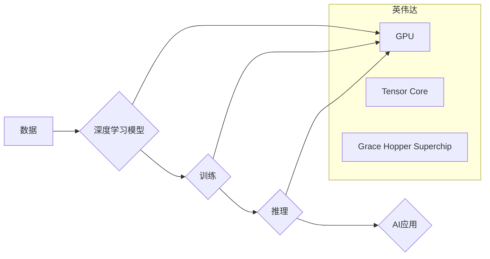

## 英伟达市值登顶与AI硬件设施

> 关键词：英伟达、GPU、AI芯片、深度学习、数据中心、云计算、市值、硬件设施

### 1. 背景介绍

2023年，英伟达(Nvidia)的市值突破了万亿美元大关，成为全球市值最高的芯片公司。这一成就并非偶然，而是英伟达在人工智能(AI)领域的技术领先地位和市场占有率的体现。英伟达的GPU(图形处理单元)芯片在深度学习领域发挥着至关重要的作用，其强大的并行计算能力和高效的内存架构，为训练和运行复杂的AI模型提供了坚实的基础。

近年来，AI技术发展迅速，深度学习算法取得了突破性进展，在图像识别、自然语言处理、语音识别等领域展现出强大的应用潜力。这推动了对高性能计算能力的需求，而英伟达的GPU芯片凭借其独特的优势，成为深度学习训练和推理的首选平台。

### 2. 核心概念与联系

#### 2.1  GPU和深度学习

GPU最初被设计用于处理图形渲染，其并行计算能力远超传统CPU(中央处理器)。深度学习算法本质上是大量的参数计算，GPU的并行架构能够有效加速这些计算，大幅提升训练速度。

#### 2.2  英伟达的AI芯片

英伟达不仅提供GPU芯片，还开发了一系列专门为AI应用设计的芯片，例如Tensor Core和Grace Hopper Superchip。这些芯片拥有更强大的算力、更低的功耗和更优化的内存架构，进一步提升了AI模型的训练和推理效率。

#### 2.3  数据中心和云计算

深度学习模型的训练需要海量数据和强大的计算资源，数据中心和云计算平台为这些需求提供了基础设施。英伟达与各大云服务提供商合作，提供基于GPU的云计算服务，让开发者能够轻松访问高性能计算资源，加速AI应用开发。

**Mermaid 流程图**



### 3. 核心算法原理 & 具体操作步骤

#### 3.1  算法原理概述

深度学习算法的核心是多层神经网络，通过学习数据中的特征，实现对数据的分类、识别、预测等任务。

#### 3.2  算法步骤详解

1. **数据预处理:** 将原始数据转换为深度学习模型可以理解的格式，例如归一化、编码等。
2. **网络结构设计:** 根据任务需求设计神经网络的层数、节点数量、激活函数等参数。
3. **模型训练:** 使用训练数据训练模型，通过反向传播算法调整模型参数，使模型输出与真实值尽可能接近。
4. **模型评估:** 使用测试数据评估模型的性能，例如准确率、召回率等指标。
5. **模型部署:** 将训练好的模型部署到实际应用场景中，用于进行预测或识别等任务。

#### 3.3  算法优缺点

**优点:**

* 能够学习复杂的数据模式，实现高精度预测。
* 具有强大的泛化能力，能够应用于多种不同的任务。

**缺点:**

* 训练数据量大，训练时间长。
* 模型参数众多，需要大量的计算资源。
* 对数据质量要求高，数据噪声会影响模型性能。

#### 3.4  算法应用领域

深度学习算法已广泛应用于各个领域，例如：

* **计算机视觉:** 图像识别、物体检测、图像分割等。
* **自然语言处理:** 文本分类、机器翻译、语音识别等。
* **医疗保健:** 疾病诊断、药物研发、医疗影像分析等。
* **金融科技:** 风险评估、欺诈检测、投资预测等。

### 4. 数学模型和公式 & 详细讲解 & 举例说明

#### 4.1  数学模型构建

深度学习模型本质上是一个复杂的数学模型，其核心是神经网络。神经网络由多个层组成，每一层包含多个节点，节点之间通过权重连接。

#### 4.2  公式推导过程

深度学习模型的训练过程基于梯度下降算法，其目标是找到最优的模型参数，使模型输出与真实值之间的误差最小化。

**损失函数:**

$$L(W,b) = \frac{1}{N} \sum_{i=1}^{N} loss(y_i, \hat{y}_i)$$

其中:

* $W$ 和 $b$ 分别表示模型的参数和偏置。
* $N$ 表示训练数据的数量。
* $y_i$ 表示第 $i$ 个样本的真实值。
* $\hat{y}_i$ 表示模型预测的第 $i$ 个样本的值。
* $loss(y_i, \hat{y}_i)$ 表示第 $i$ 个样本的损失函数值。

**梯度下降算法:**

$$W = W - \eta \frac{\partial L(W,b)}{\partial W}$$

$$b = b - \eta \frac{\partial L(W,b)}{\partial b}$$

其中:

* $\eta$ 表示学习率。
* $\frac{\partial L(W,b)}{\partial W}$ 和 $\frac{\partial L(W,b)}{\partial b}$ 分别表示损失函数对参数 $W$ 和 $b$ 的梯度。

#### 4.3  案例分析与讲解

例如，在图像分类任务中，可以使用卷积神经网络(CNN)作为模型。CNN的结构包含多个卷积层、池化层和全连接层。卷积层用于提取图像特征，池化层用于降低特征维度，全连接层用于分类。

训练CNN模型时，需要使用大量的图像数据，并通过梯度下降算法调整模型参数，使模型能够准确地识别图像中的物体。

### 5. 项目实践：代码实例和详细解释说明

#### 5.1  开发环境搭建

使用Python语言开发深度学习项目，需要安装以下软件：

* Python 3.x
* TensorFlow 或 PyTorch 深度学习框架
* NumPy 科学计算库
* Matplotlib 数据可视化库

#### 5.2  源代码详细实现

以下是一个使用TensorFlow框架实现图像分类的简单代码示例：

```python
import tensorflow as tf

# 定义模型结构
model = tf.keras.models.Sequential([
    tf.keras.layers.Conv2D(32, (3, 3), activation='relu', input_shape=(28, 28, 1)),
    tf.keras.layers.MaxPooling2D((2, 2)),
    tf.keras.layers.Conv2D(64, (3, 3), activation='relu'),
    tf.keras.layers.MaxPooling2D((2, 2)),
    tf.keras.layers.Flatten(),
    tf.keras.layers.Dense(10, activation='softmax')
])

# 编译模型
model.compile(optimizer='adam',
              loss='sparse_categorical_crossentropy',
              metrics=['accuracy'])

# 训练模型
model.fit(x_train, y_train, epochs=5)

# 评估模型
loss, accuracy = model.evaluate(x_test, y_test)
print('Test loss:', loss)
print('Test accuracy:', accuracy)
```

#### 5.3  代码解读与分析

这段代码定义了一个简单的卷积神经网络模型，用于图像分类任务。模型包含两个卷积层、两个池化层、一个全连接层和一个输出层。

* `tf.keras.models.Sequential` 用于构建一个顺序模型，即层级结构。
* `tf.keras.layers.Conv2D` 用于定义卷积层，提取图像特征。
* `tf.keras.layers.MaxPooling2D` 用于定义池化层，降低特征维度。
* `tf.keras.layers.Flatten` 用于将多维特征转换为一维向量。
* `tf.keras.layers.Dense` 用于定义全连接层，进行分类。
* `model.compile` 用于编译模型，指定优化器、损失函数和评估指标。
* `model.fit` 用于训练模型，传入训练数据和训练轮数。
* `model.evaluate` 用于评估模型，传入测试数据。

#### 5.4  运行结果展示

训练完成后，模型会输出测试集上的损失值和准确率。

### 6. 实际应用场景

#### 6.1  自动驾驶

英伟达的GPU芯片在自动驾驶领域发挥着重要作用，用于处理车辆周围环境的图像数据，实现自动驾驶功能。

#### 6.2  医疗影像分析

英伟达的AI芯片可以加速医疗影像分析，例如X光片、CT扫描和MRI扫描的分析，帮助医生更快、更准确地诊断疾病。

#### 6.3  金融风险评估

英伟达的深度学习算法可以用于金融风险评估，例如识别欺诈交易、预测市场波动等。

#### 6.4  未来应用展望

随着AI技术的不断发展，英伟达的GPU芯片和AI芯片将在更多领域得到应用，例如：

* **个性化教育:** 根据学生的学习情况提供个性化的学习方案。
* **智能制造:** 自动化生产流程，提高生产效率。
* **精准农业:** 利用传感器数据和AI算法提高农业生产效率。

### 7. 工具和资源推荐

#### 7.1  学习资源推荐

* **Coursera:** 提供深度学习相关的在线课程。
* **Udacity:** 提供AI和机器学习相关的在线课程。
* **TensorFlow官方文档:** https://www.tensorflow.org/
* **PyTorch官方文档:** https://pytorch.org/

#### 7.2  开发工具推荐

* **Jupyter Notebook:** 用于深度学习代码开发和实验。
* **VS Code:** 强大的代码编辑器，支持深度学习框架的插件。
* **Google Colab:** 基于云计算的深度学习开发环境。

#### 7.3  相关论文推荐

* **ImageNet Classification with Deep Convolutional Neural Networks:** https://arxiv.org/abs/1202.1409
* **Attention Is All You Need:** https://arxiv.org/abs/1706.03762

### 8. 总结：未来发展趋势与挑战

#### 8.1  研究成果总结

英伟达在AI硬件设施领域取得了显著成就，其GPU芯片和AI芯片为深度学习的发展提供了强大的支持。

#### 8.2  未来发展趋势

未来，AI硬件设施将朝着以下方向发展:

* **更高效的算力:** 继续提升芯片的算力，降低功耗。
* **更强大的模型支持:** 支持更大规模的模型训练和推理。
* **更广泛的应用场景:** 将AI技术应用于更多领域。

#### 8.3  面临的挑战

AI硬件设施的发展也面临着一些挑战:

* **摩尔定律的放缓:** 芯片性能提升的难度越来越大。
* **数据安全和隐私:** AI模型训练需要大量数据，如何保证数据安全和隐私是一个重要问题。
* **人才短缺:** AI领域人才需求量大，但人才供给不足。

#### 8.4  研究展望

未来，需要继续探索新的硬件架构和算法，以突破AI硬件设施的发展瓶颈，推动AI技术的进一步发展。

### 9. 附录：常见问题与解答

#### 9.1  Q: 英伟达的GPU芯片和CPU有什么区别？

#### 9.2  A: GPU芯片主要用于并行计算，而CPU芯片主要用于顺序计算。GPU芯片拥有更多的计算单元，能够同时处理大量数据，因此在深度学习训练等并行计算任务中表现出色。

#### 9.3  Q: 如何选择合适的深度学习框架？

#### 9.4  A: TensorFlow和PyTorch是目前最流行的深度学习框架，TensorFlow更注重生产环境部署，PyTorch更灵活易用。选择框架时需要根据自己的项目需求和