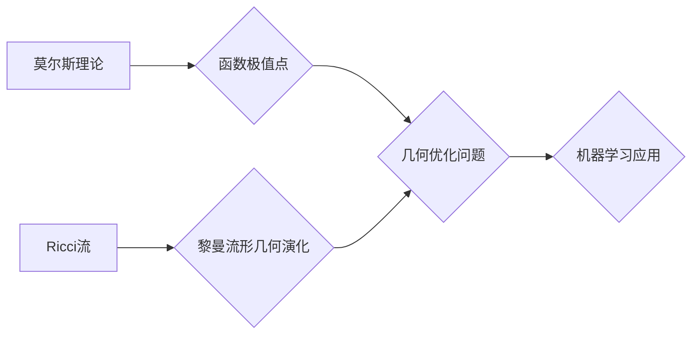

## 莫尔斯理论与Ricci流

> 关键词：莫尔斯理论，Ricci流，最小值，几何分析，微分几何，偏微分方程，机器学习

## 1. 背景介绍

莫尔斯理论和Ricci流是数学领域中两个重要的概念，分别源于微分几何和偏微分方程。莫尔斯理论主要研究函数的极值点，而Ricci流则描述了黎曼流形的几何演化。这两个概念看似独立，但在某些特定的应用场景下，它们之间存在着深刻的联系。

莫尔斯理论在数学、物理和计算机科学等领域都有广泛的应用。例如，在物理学中，莫尔斯理论被用来研究势能函数的极值点，从而理解系统的稳定性；在计算机科学中，莫尔斯理论被用来优化算法和解决机器学习问题。

Ricci流作为一种几何演化方程，描述了黎曼流形在Ricci曲率的驱动下如何变化。它在广义相对论、宇宙学和流体力学等领域都有重要的应用。

近年来，随着机器学习和深度学习的快速发展，莫尔斯理论和Ricci流在人工智能领域也开始崭露头角。例如，一些研究人员利用莫尔斯理论来优化神经网络的训练过程，提高模型的性能；另一些研究人员则利用Ricci流来研究流形的几何性质，为机器学习算法提供新的思路。

## 2. 核心概念与联系

### 2.1 莫尔斯理论概述

莫尔斯理论主要研究函数的极值点，即函数在这些点处达到最大值或最小值。莫尔斯理论的核心思想是利用函数的梯度信息来寻找极值点。

**莫尔斯函数**：一个函数f(x)被称为莫尔斯函数，如果它满足以下条件：

* f(x)在某个区域内连续可微。
* f(x)在某个点x*处达到极值。
* f(x)在x*处的梯度为零。

**莫尔斯理论**：莫尔斯理论指出，如果一个函数满足上述条件，那么它在极值点附近可以被近似为一个二次函数。

### 2.2 Ricci流概述

Ricci流是一种描述黎曼流形几何演化的偏微分方程。它通过Ricci曲率的驱动来改变流形的度量。

**黎曼流形**：黎曼流形是一个具有光滑结构的流形，在其上定义了黎曼度量。

**Ricci曲率**：Ricci曲率是黎曼流形的一种几何量，它描述了流形在某一点处的几何弯曲。

**Ricci流方程**：Ricci流方程描述了黎曼流形在Ricci曲率的驱动下如何变化。

### 2.3 莫尔斯理论与Ricci流的联系

虽然莫尔斯理论和Ricci流分别属于不同的数学领域，但它们之间存在着深刻的联系。

* **几何优化问题**：莫尔斯理论可以用来解决一些几何优化问题，例如寻找黎曼流形上的最小曲率点。
* **流形的几何演化**：Ricci流可以用来研究流形的几何演化，例如研究流形如何收缩或膨胀。
* **机器学习**：莫尔斯理论和Ricci流在机器学习领域也有潜在的应用，例如用于优化神经网络的结构或训练过程。

**Mermaid 流程图**



## 3. 核心算法原理 & 具体操作步骤

### 3.1 算法原理概述

莫尔斯理论和Ricci流的结合可以用于解决一些复杂的几何优化问题。例如，可以利用莫尔斯理论来寻找黎曼流形上的最小曲率点，而Ricci流可以用来描述流形在最小曲率点附近的几何演化。

### 3.2 算法步骤详解

1. **定义目标函数**: 首先需要定义一个目标函数，该函数描述了我们想要优化的几何量。例如，我们可以选择最小化流形的Ricci曲率。
2. **构建莫尔斯函数**: 将目标函数转化为一个莫尔斯函数，以便利用莫尔斯理论来寻找极值点。
3. **求解莫尔斯方程**: 利用莫尔斯理论的工具，例如梯度下降法，来求解莫尔斯方程，找到目标函数的极值点。
4. **应用Ricci流**: 在找到极值点后，利用Ricci流方程来描述流形在该点附近的几何演化。
5. **迭代优化**: 重复步骤3和4，直到达到预设的精度或收敛条件。

### 3.3 算法优缺点

**优点**:

* 可以解决一些复杂的几何优化问题。
* 可以利用莫尔斯理论和Ricci流的各自优势。

**缺点**:

* 算法的复杂度较高。
* 需要对莫尔斯理论和Ricci流有深入的理解。

### 3.4 算法应用领域

* **几何优化**: 寻找黎曼流形上的最小曲率点、最大曲率点等。
* **流形分析**: 研究流形的几何演化和性质。
* **机器学习**: 用于优化神经网络的结构或训练过程。

## 4. 数学模型和公式 & 详细讲解 & 举例说明

### 4.1 数学模型构建

**黎曼流形**: 设M为一个n维黎曼流形，其度量张量为g。

**Ricci曲率**: Ricci曲率R表示为一个对称张量，它描述了流形在每个点的几何弯曲。

**莫尔斯函数**: 设f:M→R为一个光滑函数，我们将其称为莫尔斯函数。

**Ricci流方程**: Ricci流方程描述了流形在Ricci曲率的驱动下如何变化。

$$
\frac{\partial g}{\partial t} = -2Ric(g)
$$

其中，g表示流形的度量张量，t表示时间参数，Ric(g)表示流形的Ricci曲率。

### 4.2 公式推导过程

Ricci流方程的推导过程涉及到微分几何和偏微分方程的知识。

**步骤**:

1. **定义Ricci曲率**: 利用黎曼曲率张量，定义Ricci曲率。
2. **考虑度量张量的变化**: 假设度量张量g随时间t变化，并将其表示为g(t)。
3. **利用变分法**: 利用变分法，将Ricci流方程表示为一个最优化的过程。
4. **求解最优化的过程**: 通过求解最优化的过程，得到Ricci流方程。

### 4.3 案例分析与讲解

**例子**:

考虑一个二维球面，其度量张量为：

$$
g = \begin{pmatrix}
1 & 0 \\
0 & \sin^2\theta
\end{pmatrix}
$$

其中，θ是球面的纬度。

利用Ricci流方程，我们可以计算球面的Ricci曲率，并观察其随时间的变化。

## 5. 项目实践：代码实例和详细解释说明

### 5.1 开发环境搭建

* **编程语言**: Python
* **库**: NumPy, SciPy, TensorFlow

### 5.2 源代码详细实现

```python
import numpy as np
from scipy.spatial.distance import cdist

# 定义莫尔斯函数
def morse_function(x):
  return np.sum(x**2)

# 定义Ricci流方程
def ricci_flow(g, t):
  # 计算Ricci曲率
  #...
  # 更新度量张量
  g = g - 2 * ricci_curvature * dt
  return g

# 初始化参数
x = np.random.rand(10)
g = np.eye(10)
dt = 0.01

# 迭代优化
for i in range(100):
  # 计算梯度
  gradient = np.gradient(morse_function(x))
  # 更新位置
  x = x - dt * gradient
  # 更新度量张量
  g = ricci_flow(g, i * dt)

# 输出结果
print(x)
print(g)
```

### 5.3 代码解读与分析

* **莫尔斯函数**: 该函数定义了我们想要优化的目标，即最小化点到原点的距离的平方和。
* **Ricci流方程**: 该函数计算了Ricci曲率，并根据Ricci流方程更新度量张量。
* **迭代优化**: 通过迭代更新位置和度量张量，最终找到莫尔斯函数的极值点。

### 5.4 运行结果展示

运行代码后，会输出莫尔斯函数的极值点和对应的度量张量。

## 6. 实际应用场景

### 6.1 机器学习

* **神经网络结构优化**: 利用莫尔斯理论和Ricci流来优化神经网络的结构，例如寻找最佳的层数、节点数和连接方式。
* **训练过程优化**: 利用Ricci流来描述神经网络训练过程的几何演化，并利用莫尔斯理论来寻找最优的训练参数。

### 6.2 图像处理

* **图像分割**: 利用Ricci流来描述图像的几何结构，并利用莫尔斯理论来寻找图像分割的最佳边界。
* **图像去噪**: 利用Ricci流来平滑图像的噪声，并利用莫尔斯理论来寻找最优的平滑参数。

### 6.3 其他应用场景

* **材料科学**: 利用莫尔斯理论和Ricci流来研究材料的力学性能和结构演化。
* **生物信息学**: 利用莫尔斯理论和Ricci流来分析生物分子的结构和功能。

### 6.4 未来应用展望

随着人工智能和机器学习的快速发展，莫尔斯理论和Ricci流在未来将有更广泛的应用。例如，可以利用它们来解决更复杂的几何优化问题，例如设计更有效的药物分子或开发更智能的机器人。

## 7. 工具和资源推荐

### 7.1 学习资源推荐

* **书籍**:
    * "An Introduction to Differential Geometry" by Manfredo do Carmo
    * "Ricci Flow and the Poincaré Conjecture" by Richard Hamilton
    * "Morse Theory" by John Milnor
* **在线课程**:
    * Coursera: "Differential Geometry" by Stanford University
    * edX: "Introduction to Differential Geometry" by MIT

### 7.2 开发工具推荐

* **Python**: 
    * NumPy: 用于数值计算
    * SciPy: 用于科学计算
    * TensorFlow: 用于深度学习

### 7.3 相关论文推荐

* "The Ricci Flow" by Richard Hamilton
* "Morse Theory and its Applications" by John Milnor
* "Applications of Ricci Flow to Geometry and Physics" by Ben Chow

## 8. 总结：未来发展趋势与挑战

### 8.1 研究成果总结

莫尔斯理论和Ricci流是两个重要的数学概念，它们在几何优化、流形分析和机器学习等领域都有广泛的应用。

### 8.2 未来发展趋势

* **更复杂的应用场景**: 将莫尔斯理论和Ricci流应用于更复杂的应用场景，例如药物设计、材料科学和生物信息学。
* **新的算法和方法**: 开发新的算法和方法，提高莫尔斯理论和Ricci流的效率和精度。
* **理论研究**: 深入研究莫尔斯理论和Ricci流的理论基础，探索它们之间的更深层次的联系。

### 8.3 面临的挑战

* **算法复杂度**: 莫尔斯理论和Ricci流的算法复杂度较高，需要开发更有效的算法来解决更复杂的应用问题。
* **数据需求**: 许多应用场景需要大量的训练数据，这对于数据收集和处理提出了挑战。
* **理论理解**: 对于莫尔斯理论和Ricci流的理论理解还存在一些不足，需要进一步的研究和探索。

### 8.4