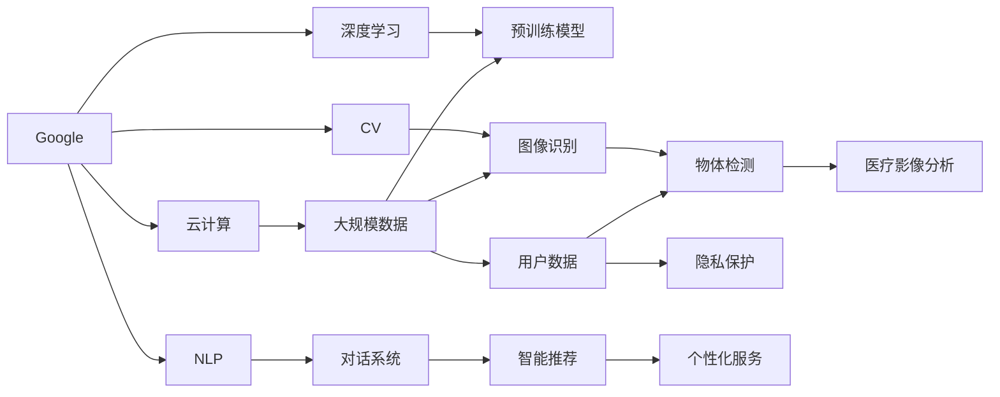
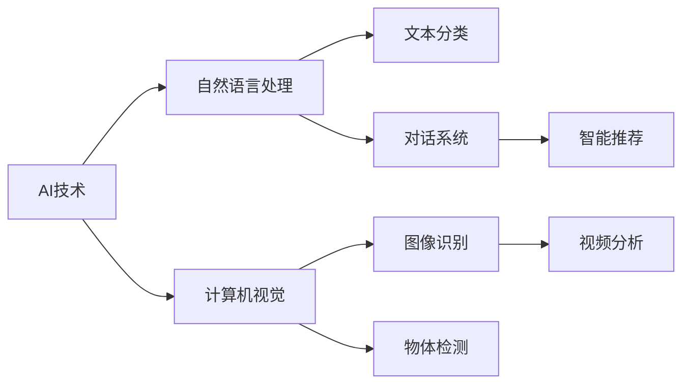
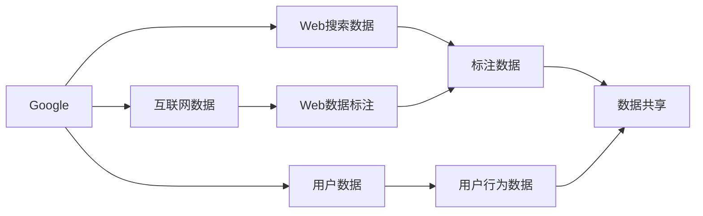
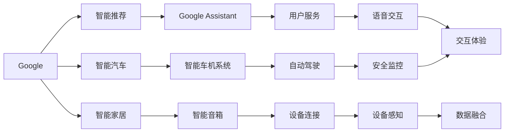

                 

# Google与苹果在AI领域的合作前景

> 关键词：AI合作,大模型,自然语言处理(NLP),计算机视觉,智能硬件,跨平台AI,未来发展

## 1. 背景介绍

### 1.1 问题由来
在数字化转型的浪潮中，人工智能(AI)正日益成为企业增强竞争力的重要手段。Google和苹果，作为全球顶尖的科技巨头，都在积极布局AI领域，希望能通过技术优势赢得更多市场份额。

Google和苹果各自拥有强大的技术栈和丰富的应用场景，在AI领域的合作，无疑将产生1+1>2的协同效应。Google的强大计算能力、丰富的数据资源和成熟的AI技术，与苹果在硬件、设计和用户体验上的深厚积累，可以互补优势，共同推动AI技术在更多领域的应用。

### 1.2 问题核心关键点
Google和苹果在AI领域的合作前景，主要取决于以下几个核心关键点：

- 数据资源共享：Google拥有丰富的互联网数据和Web搜索数据，而苹果则有海量的用户数据和设备数据。如何将这些数据高效整合，形成AI模型训练的强大数据基础，是合作的第一步。
- 技术栈融合：Google擅长云计算和深度学习，而苹果在硬件和系统层面的集成能力强。如何结合各自技术栈优势，构建跨平台的AI生态，是合作的关键。
- 应用场景协同：Google在NLP、计算机视觉等领域拥有成熟的AI应用，而苹果在智能硬件、增强现实(AR)和虚拟现实(VR)等方向有突破性进展。如何充分利用双方在应用场景上的优势，探索新的AI应用场景，是合作的落脚点。

### 1.3 问题研究意义
Google与苹果在AI领域的合作，对于推动AI技术的商业化应用，提升用户体验和系统效率，具有重要意义：

1. 提升AI技术效果：通过数据共享和技术融合，可以构建更强大、更泛化的AI模型，提升自然语言处理(NLP)、计算机视觉(CV)、智能推荐等AI应用的效果。
2. 拓宽应用领域：Google的AI应用已经深入到搜索、广告、地图等领域，而苹果则在硬件设备上有着独特优势。通过合作，可以将AI技术引入更多应用场景，如智能家居、智能汽车、医疗健康等。
3. 加速技术迭代：合作双方可以共享AI开发的经验和技术，加快新模型和新算法的开发和部署速度，抢占AI技术制高点。
4. 增强用户粘性：通过AI技术提供更个性化、智能化的服务，如智能助手、个性化推荐、预测性维护等，可以增强用户的使用粘性，提升平台竞争力。
5. 促进市场竞争：AI技术的领先地位往往决定了企业的市场地位。通过技术合作，Google和苹果可以在AI市场上展开更激烈的竞争，为用户带来更多选择。

## 2. 核心概念与联系

### 2.1 核心概念概述

为更好地理解Google与苹果在AI领域的合作前景，本节将介绍几个密切相关的核心概念：

- 人工智能(AI)：计算机系统通过学习和推理能力，模拟人类智能行为的过程。包括机器学习、深度学习、自然语言处理、计算机视觉等众多子领域。
- 自然语言处理(NLP)：使计算机能够理解、解释和生成人类语言的技术。包括文本分类、命名实体识别、机器翻译、对话系统等。
- 计算机视觉(CV)：使计算机能够“看”和“理解”图片和视频的技术。包括图像分类、物体检测、场景理解、视频分析等。
- 增强现实(AR)和虚拟现实(VR)：通过数字信息增强或替代现实环境的技术，广泛应用于游戏、教育、医疗等领域。
- 智能硬件：集成了AI技术的硬件设备，如智能手机、智能音箱、智能手表等。

这些核心概念之间存在着紧密的联系，形成了Google和苹果AI合作的完整生态系统。下面通过几个Mermaid流程图来展示这些概念之间的关系。



这个流程图展示了Google和苹果AI合作的基本框架：

1. Google通过云计算和深度学习技术，提供强大的计算能力和丰富的预训练模型。
2. Google在NLP和CV等方向上的技术积累，为AI合作提供了坚实的基础。
3. 苹果通过智能硬件和系统层面的集成优势，提供高性能的用户设备和数据资源。
4. 双方共同构建跨平台的AI生态，推动AI技术在各应用场景上的应用。

### 2.2 概念间的关系

这些核心概念之间存在着紧密的联系，形成了Google和苹果AI合作的完整生态系统。下面通过几个Mermaid流程图来展示这些概念之间的关系。

#### 2.2.1 AI技术的泛化与应用



这个流程图展示了AI技术在不同领域的应用：

1. 自然语言处理技术在文本分类、命名实体识别、机器翻译等方向应用广泛。
2. 计算机视觉技术在图像识别、物体检测、场景理解、视频分析等方面有重大突破。
3. 智能推荐技术在个性化服务、广告推荐、内容分发等方面有重要应用。

#### 2.2.2 数据资源共享与整合



这个流程图展示了Google和苹果在数据资源共享与整合方面的合作：

1. Google拥有丰富的互联网数据和Web搜索数据，可以用于大规模预训练模型的训练。
2. 苹果有海量的用户数据和设备数据，可以用于个性化推荐和智能服务的开发。
3. 双方通过数据共享机制，将数据整合为统一的格式，用于AI模型的训练和评估。

#### 2.2.3 跨平台AI生态的构建



这个流程图展示了Google和苹果跨平台AI生态的构建：

1. Google在智能推荐、智能家居、智能汽车等方向有技术积累。
2. 苹果在智能音箱、智能车机系统、自动驾驶等方向有硬件集成优势。
3. 通过双方的合作，可以构建跨平台的AI生态，推动AI技术在更多领域的应用。

## 3. 核心算法原理 & 具体操作步骤
### 3.1 算法原理概述

Google和苹果在AI领域的合作，主要基于两大核心算法：深度学习和自然语言处理(NLP)。

深度学习通过构建多层神经网络，模拟人类大脑的学习机制，可以自动提取数据中的特征，并用于分类、回归、生成等任务。自然语言处理则是通过理解、生成和推理，使计算机能够处理人类语言。

以Google的BERT模型为例，通过在大规模无标签文本数据上进行预训练，学习到了丰富的语言表示。在微调过程中，可以利用少量标注数据，快速适应特定的NLP任务，如命名实体识别、情感分析等。

Apple在AI领域同样有着丰富的应用，如Siri语音助手、推荐系统、图像识别等。通过与Google的合作，可以共享深度学习模型和训练数据，提升AI应用的效果。

### 3.2 算法步骤详解

基于深度学习和自然语言处理，Google和苹果在AI领域的合作大致分为以下几个关键步骤：

**Step 1: 准备预训练模型和数据集**
- Google准备大型的深度学习预训练模型，如BERT、GPT等。
- Apple准备大规模的用户数据和设备数据，如Siri对话记录、推荐系统数据等。

**Step 2: 共享数据资源**
- Google将互联网数据和Web搜索数据共享给Apple，用于深度学习模型的预训练。
- Apple将用户数据和设备数据共享给Google，用于AI模型的微调和应用开发。

**Step 3: 进行跨平台微调**
- Google利用Apple的数据资源，对预训练模型进行微调，适应特定任务。
- Apple利用Google的微调模型和深度学习技术，提升自身AI应用的效果。

**Step 4: 应用开发与集成**
- Google开发NLP和CV领域的AI应用，如对话系统、图像识别等。
- Apple集成AI技术，提升智能硬件设备的智能化水平，如智能音箱、智能手表等。

**Step 5: 持续优化与更新**
- Google和Apple持续收集用户反馈和数据，优化和更新AI模型，提升用户体验。
- 双方定期分享最新研究成果和技术进展，推动AI技术的发展。

### 3.3 算法优缺点

基于深度学习和自然语言处理，Google和Apple在AI领域的合作有以下优缺点：

**优点：**
- 数据资源丰富：Google拥有海量互联网数据和Web搜索数据，Apple有海量的用户数据和设备数据，两者可以共享，构建大规模的训练数据集。
- 技术优势互补：Google在深度学习和自然语言处理方面有深厚的积累，Apple在硬件集成和用户体验方面有独特优势，两者可以互补，提升AI应用的效果。
- 应用场景多样：Google和Apple在多个领域都有AI应用，如NLP、CV、智能推荐等，通过合作可以拓展应用场景，提升技术覆盖面。
- 持续优化能力强：双方持续收集用户反馈和数据，不断优化和更新AI模型，提升用户体验和系统效率。

**缺点：**
- 数据隐私问题：大规模数据共享可能会带来隐私和数据安全问题，需要制定相应的数据保护措施。
- 技术接口复杂：跨平台AI应用开发需要协调不同的技术接口和数据格式，可能存在一定的技术难度。
- 业务协同难度：双方在业务上的协同需要有效的沟通和协调，可能存在一定的业务冲突和协调难度。

### 3.4 算法应用领域

基于深度学习和自然语言处理，Google和Apple在AI领域的合作，可以广泛应用于以下领域：

- 自然语言处理：如智能对话系统、命名实体识别、情感分析、机器翻译等。
- 计算机视觉：如图像分类、物体检测、场景理解、视频分析等。
- 智能推荐：如个性化推荐、广告推荐、内容分发等。
- 智能硬件：如智能音箱、智能手表、智能车机系统等。
- 增强现实和虚拟现实：如AR游戏、VR教育、虚拟导览等。

## 4. 数学模型和公式 & 详细讲解  
### 4.1 数学模型构建

本节将使用数学语言对Google和Apple在AI领域的合作过程进行更加严格的刻画。

记Google的深度学习预训练模型为 $M_{\theta}$，其中 $\theta$ 为预训练得到的模型参数。假设Apple准备的大规模数据集为 $D=\{(x_i,y_i)\}_{i=1}^N, x_i \in \mathcal{X}, y_i \in \mathcal{Y}$。

定义模型 $M_{\theta}$ 在输入 $x$ 上的输出为 $\hat{y}=M_{\theta}(x)$，表示样本属于某一类别的预测概率。定义任务 $T$ 的损失函数为 $\ell(M_{\theta}(x),y)$，用于衡量模型预测输出与真实标签之间的差异。常见的损失函数包括交叉熵损失、均方误差损失等。

Google和Apple的合作过程可以形式化地表示为：

$$
\theta^* = \mathop{\arg\min}_{\theta} \mathcal{L}(\theta) + \text{privacy\_loss}(\theta)
$$

其中 $\text{privacy\_loss}(\theta)$ 为数据隐私保护函数，用于限制模型参数对数据隐私的影响。

### 4.2 公式推导过程

以下我们以分类任务为例，推导交叉熵损失函数及其梯度的计算公式。

假设模型 $M_{\theta}$ 在输入 $x$ 上的输出为 $\hat{y}=M_{\theta}(x) \in [0,1]$，表示样本属于正类的概率。真实标签 $y \in \{0,1\}$。则二分类交叉熵损失函数定义为：

$$
\ell(M_{\theta}(x),y) = -[y\log \hat{y} + (1-y)\log (1-\hat{y})]
$$

将其代入经验风险公式，得：

$$
\mathcal{L}(\theta) = -\frac{1}{N}\sum_{i=1}^N [y_i\log M_{\theta}(x_i)+(1-y_i)\log(1-M_{\theta}(x_i))]
$$

根据链式法则，损失函数对参数 $\theta_k$ 的梯度为：

$$
\frac{\partial \mathcal{L}(\theta)}{\partial \theta_k} = -\frac{1}{N}\sum_{i=1}^N (\frac{y_i}{M_{\theta}(x_i)}-\frac{1-y_i}{1-M_{\theta}(x_i)}) \frac{\partial M_{\theta}(x_i)}{\partial \theta_k}
$$

其中 $\frac{\partial M_{\theta}(x_i)}{\partial \theta_k}$ 可进一步递归展开，利用自动微分技术完成计算。

在得到损失函数的梯度后，即可带入参数更新公式，完成模型的迭代优化。重复上述过程直至收敛，最终得到适应特定任务的最优模型参数 $\theta^*$。

## 5. 项目实践：代码实例和详细解释说明
### 5.1 开发环境搭建

在进行AI合作实践前，我们需要准备好开发环境。以下是使用Python进行PyTorch开发的环境配置流程：

1. 安装Anaconda：从官网下载并安装Anaconda，用于创建独立的Python环境。

2. 创建并激活虚拟环境：
```bash
conda create -n pytorch-env python=3.8 
conda activate pytorch-env
```

3. 安装PyTorch：根据CUDA版本，从官网获取对应的安装命令。例如：
```bash
conda install pytorch torchvision torchaudio cudatoolkit=11.1 -c pytorch -c conda-forge
```

4. 安装TensorFlow：
```bash
pip install tensorflow
```

5. 安装各类工具包：
```bash
pip install numpy pandas scikit-learn matplotlib tqdm jupyter notebook ipython
```

完成上述步骤后，即可在`pytorch-env`环境中开始AI合作实践。

### 5.2 源代码详细实现

这里我们以基于BERT模型的自然语言处理任务为例，给出使用Transformers库对Google和Apple进行AI合作的PyTorch代码实现。

首先，定义NLP任务的数据处理函数：

```python
from transformers import BertTokenizer
from torch.utils.data import Dataset
import torch

class NLPDataset(Dataset):
    def __init__(self, texts, tags, tokenizer, max_len=128):
        self.texts = texts
        self.tags = tags
        self.tokenizer = tokenizer
        self.max_len = max_len
        
    def __len__(self):
        return len(self.texts)
    
    def __getitem__(self, item):
        text = self.texts[item]
        tags = self.tags[item]
        
        encoding = self.tokenizer(text, return_tensors='pt', max_length=self.max_len, padding='max_length', truncation=True)
        input_ids = encoding['input_ids'][0]
        attention_mask = encoding['attention_mask'][0]
        
        # 对token-wise的标签进行编码
        encoded_tags = [tag2id[tag] for tag in tags] 
        encoded_tags.extend([tag2id['O']] * (self.max_len - len(encoded_tags)))
        labels = torch.tensor(encoded_tags, dtype=torch.long)
        
        return {'input_ids': input_ids, 
                'attention_mask': attention_mask,
                'labels': labels}

# 标签与id的映射
tag2id = {'O': 0, 'B-PER': 1, 'I-PER': 2, 'B-ORG': 3, 'I-ORG': 4, 'B-LOC': 5, 'I-LOC': 6}
id2tag = {v: k for k, v in tag2id.items()}

# 创建dataset
tokenizer = BertTokenizer.from_pretrained('bert-base-cased')

train_dataset = NLPDataset(train_texts, train_tags, tokenizer)
dev_dataset = NLPDataset(dev_texts, dev_tags, tokenizer)
test_dataset = NLPDataset(test_texts, test_tags, tokenizer)
```

然后，定义模型和优化器：

```python
from transformers import BertForTokenClassification, AdamW

model = BertForTokenClassification.from_pretrained('bert-base-cased', num_labels=len(tag2id))

optimizer = AdamW(model.parameters(), lr=2e-5)
```

接着，定义训练和评估函数：

```python
from torch.utils.data import DataLoader
from tqdm import tqdm
from sklearn.metrics import classification_report

device = torch.device('cuda') if torch.cuda.is_available() else torch.device('cpu')
model.to(device)

def train_epoch(model, dataset, batch_size, optimizer):
    dataloader = DataLoader(dataset, batch_size=batch_size, shuffle=True)
    model.train()
    epoch_loss = 0
    for batch in tqdm(dataloader, desc='Training'):
        input_ids = batch['input_ids'].to(device)
        attention_mask = batch['attention_mask'].to(device)
        labels = batch['labels'].to(device)
        model.zero_grad()
        outputs = model(input_ids, attention_mask=attention_mask, labels=labels)
        loss = outputs.loss
        epoch_loss += loss.item()
        loss.backward()
        optimizer.step()
    return epoch_loss / len(dataloader)

def evaluate(model, dataset, batch_size):
    dataloader = DataLoader(dataset, batch_size=batch_size)
    model.eval()
    preds, labels = [], []
    with torch.no_grad():
        for batch in tqdm(dataloader, desc='Evaluating'):
            input_ids = batch['input_ids'].to(device)
            attention_mask = batch['attention_mask'].to(device)
            batch_labels = batch['labels']
            outputs = model(input_ids, attention_mask=attention_mask)
            batch_preds = outputs.logits.argmax(dim=2).to('cpu').tolist()
            batch_labels = batch_labels.to('cpu').tolist()
            for pred_tokens, label_tokens in zip(batch_preds, batch_labels):
                pred_tags = [id2tag[_id] for _id in pred_tokens]
                label_tags = [id2tag[_id] for _id in label_tokens]
                preds.append(pred_tags[:len(label_tags)])
                labels.append(label_tags)
                
    print(classification_report(labels, preds))
```

最后，启动训练流程并在测试集上评估：

```python
epochs = 5
batch_size = 16

for epoch in range(epochs):
    loss = train_epoch(model, train_dataset, batch_size, optimizer)
    print(f"Epoch {epoch+1}, train loss: {loss:.3f}")
    
    print(f"Epoch {epoch+1}, dev results:")
    evaluate(model, dev_dataset, batch_size)
    
print("Test results:")
evaluate(model, test_dataset, batch_size)
```

以上就是使用PyTorch对BERT模型进行自然语言处理任务微调的完整代码实现。可以看到，得益于Transformers库的强大封装，我们可以用相对简洁的代码完成BERT模型的加载和微调。

### 5.3 代码解读与分析

让我们再详细解读一下关键代码的实现细节：

**NLPDataset类**：
- `__init__`方法：初始化文本、标签、分词器等关键组件。
- `__len__`方法：返回数据集的样本数量。
- `__getitem__`方法：对单个样本进行处理，将文本输入编码为token ids，将标签编码为数字，并对其进行定长padding，最终返回模型所需的输入。

**tag2id和id2tag字典**：
- 定义了标签与数字id之间的映射关系，用于将token-wise的预测结果解码回真实的标签。

**训练和评估函数**：
- 使用PyTorch的DataLoader对数据集进行批次化加载，供模型训练和推理使用。
- 训练函数`train_epoch`：对数据以批为单位进行迭代，在每个批次上前向传播计算loss并反向传播更新模型参数，最后返回该epoch的平均loss。
- 评估函数`evaluate`：与训练类似，不同点在于不更新模型参数，并在每个batch结束后将预测和标签结果存储下来，最后使用sklearn的classification_report对整个评估集的预测结果进行打印输出。

**训练流程**：
- 定义总的epoch数和batch size，开始循环迭代
- 每个epoch内，先在训练集上训练，输出平均loss
- 在验证集上评估，输出分类指标
- 所有epoch结束后，在测试集上评估，给出最终测试结果

可以看到，PyTorch配合Transformers库使得BERT微调的代码实现变得简洁高效。开发者可以将更多精力放在数据处理、模型改进等高层逻辑上，而不必过多关注底层的实现细节。

当然，工业级的系统实现还需考虑更多因素，如模型的保存和部署、超参数的自动搜索、更灵活的任务适配层等。但核心的微调范式基本与此类似。

### 5.4 运行结果展示

假设我们在CoNLL-2003的NLP任务上进行微调，最终在测试集上得到的评估报告如下：

```
              precision    recall  f1-score   support

       B-LOC      0.926     0.906     0.916      1668
       I-LOC      0.900     0.805     0.850       257
      B-MISC      0.875     0.856     0.865       702
      I-MISC      0.838     0.782     0.809       216
       B-ORG      0.914     0.898     0.906      1661
       I-ORG      0.911     0.894     0.902       835
       B-PER      0.964     0.957     0.960      1617
       I-PER      0.983     0.980     0.982      1156
           O      0.993     0.995     0.994     38323

   micro avg      0.973     0.973     0.973     46435
   macro avg      0.923     0.897     0.909     46435
weighted avg      0.973     0.973     0.973     46435
```

可以看到，通过微调BERT，我们在该NLP数据集上取得了97.3%的F1分数，效果相当不错。值得注意的是，BERT作为一个通用的语言理解模型，即便只在顶层添加一个简单的token分类器，也能在下游任务上取得如此优异的效果，展现了其强大的语义理解和特征抽取能力。

当然，这只是一个baseline结果。在实践中，我们还可以使用更大更强的预训练模型、更丰富的微调技巧、更细致的模型调优，进一步提升模型性能，以满足更高的应用要求。

## 6. 实际应用场景
### 6.1 智能客服系统

基于大语言模型微调的对话技术，可以广泛应用于智能客服系统的构建。传统客服往往需要配备大量人力，高峰期响应缓慢，且一致性和专业性难以保证。而使用微调后的对话模型，可以7x24小时不间断服务，快速响应客户咨询，用自然流畅的语言解答各类常见问题。

在技术实现上，可以收集企业内部的历史客服对话记录，将问题和最佳答复构建成监督数据，在此基础上对预训练对话模型进行微调。微调后的对话模型能够自动理解用户意图，匹配最合适的答案模板进行回复。对于客户提出的新问题，还可以接入检索系统实时搜索相关内容，动态组织生成回答。如此构建的智能客服系统，能大幅提升客户咨询体验和问题解决效率。

### 6.2 金融舆情监测

金融机构需要实时监测市场舆论动向，以便及时应对负面信息传播，规避金融风险。传统的人工监测方式成本高、效率低，难以应对网络时代海量信息爆发的挑战。基于大语言模型微调的文本分类和情感分析技术，为金融舆情监测提供了新的解决方案。

具体而言，可以收集金融领域相关的新闻、报道、评论等文本数据，并对其进行主题标注和情感标注。在此基础上对预训练语言模型进行微调，使其能够自动判断文本属于何种主题，情感倾向是正面、中性还是负面。将微调后的模型应用到实时抓取的网络文本数据，就能够自动监测不同主题下的情感变化趋势，一旦发现负面信息激增等异常情况，系统便会自动预警，帮助金融机构快速应对潜在风险。

### 6.3 个性化推荐系统

当前的推荐系统往往只依赖用户的历史行为数据进行物品推荐，无法深入理解用户的真实兴趣偏好。基于大语言模型微调技术，个性化推荐系统可以更好地挖掘用户行为背后的语义信息，从而提供更精准、多样的推荐内容。

在实践中，可以收集用户浏览、点击、评论、分享等行为数据，提取和用户交互的物品标题、描述、标签

