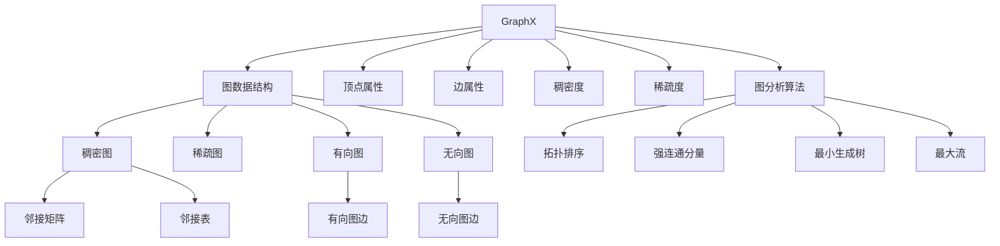
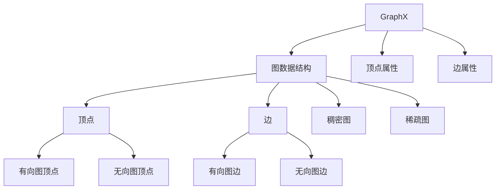
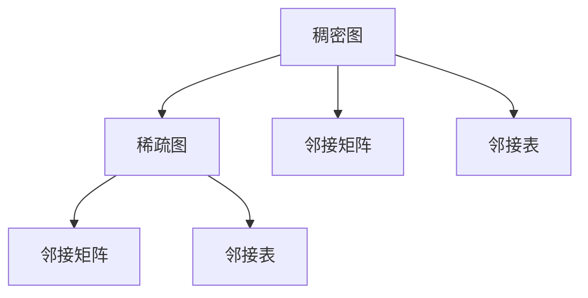
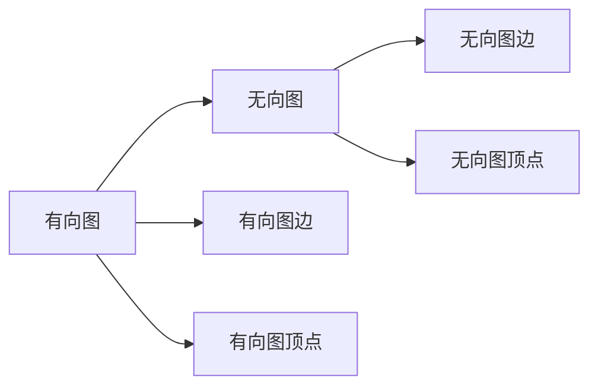
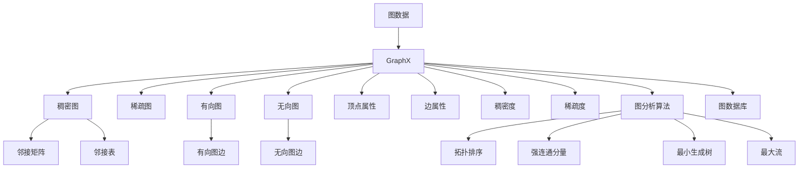

                 

# GraphX 原理与代码实例讲解

> 关键词：GraphX,图算法,图数据库,无向图,有向图,邻接矩阵,邻接表,顶点,边,稠密图,稀疏图,度,拓扑排序,强连通分量,算法时间复杂度,算法空间复杂度,MapReduce算法,多线程,Spark GraphX,Scala语言,图分析

## 1. 背景介绍

### 1.1 问题由来

图论作为数学和计算机科学的重要分支，具有深厚的理论基础和广泛的应用场景。它研究图及其结构特性，广泛应用于社交网络、计算机网络、通信系统、生物信息学、交通规划等领域。图算法和图数据库作为图论的实践应用，其高效性、可扩展性、易用性等特点，使其成为处理大规模图数据的重要工具。

近年来，随着大数据技术的迅猛发展，图数据日益增多，分布式存储和并行计算的需求日益凸显。此外，传统图算法大多依赖单节点计算，难以满足海量数据处理的需求。在这样的背景下，分布式图处理框架应运而生。GraphX作为Apache Spark的核心组件，通过将图数据结构嵌入到Spark框架中，实现了对大规模图数据的分布式处理，并提供了高效的图算法和图数据库支持。

### 1.2 问题核心关键点

GraphX的核心思想是将图数据结构嵌入到Spark中，利用Spark的分布式计算能力，高效处理大规模图数据。其核心关键点包括：

- 图数据结构嵌入Spark：GraphX将图数据结构与Spark的数据结构（RDD, Dataset等）无缝结合，利用Spark的分布式计算能力，实现对大规模图数据的分布式处理。
- 图算法库支持：GraphX提供了丰富的图算法库，支持稠密图、稀疏图、有向图、无向图等多种图类型，涵盖图分析、图可视化、图聚类、图匹配等多个领域。
- 图数据库支持：GraphX集成了图数据库功能，支持图的存储、查询、更新等操作，方便用户进行图数据的快速处理和查询。

这些关键点使得GraphX成为目前处理大规模图数据的重要工具，广泛应用于社交网络分析、推荐系统、路径规划等多个领域。

### 1.3 问题研究意义

研究GraphX的核心思想和核心算法，对于拓展图处理框架的应用边界，提升大规模图数据处理效率，加速图论相关技术的产业化进程，具有重要意义：

1. 降低图处理成本：通过将图数据嵌入到Spark中，利用Spark的分布式计算能力，可以显著降低图数据处理所需的时间、空间和硬件成本。
2. 提升图算法性能：GraphX提供了丰富的图算法库，支持多种图类型和算法，能够高效处理大规模图数据，提升算法执行效率。
3. 支持图数据库功能：GraphX集成了图数据库功能，能够快速进行图的存储、查询和更新，提高图处理速度和精度。
4. 加速图论应用落地：GraphX提供了丰富的图算法和图数据库支持，能够方便地进行图分析、图可视化、图聚类、图匹配等多个领域的图处理任务，加速图论相关技术的落地应用。
5. 带来技术创新：GraphX将图数据嵌入到Spark中，实现了分布式图处理的创新，催生了更多的研究方向和应用场景。

## 2. 核心概念与联系

### 2.1 核心概念概述

为更好地理解GraphX的原理和应用，本节将介绍几个密切相关的核心概念：

- GraphX：Apache Spark的核心组件，支持分布式图处理和图算法，提供了图数据结构嵌入Spark、图算法库支持、图数据库支持等多种功能。
- 图数据结构：GraphX中的图数据结构包括顶点和边。顶点存储数据元素，边存储顶点之间的关系，构成图的结构和拓扑。
- 稠密图和稀疏图：稠密图（Dense Graph）的邻接矩阵存储密度较高，稀疏图（Sparse Graph）的邻接矩阵存储密度较低，用于描述不同规模的图数据。
- 有向图和无向图：有向图（Directed Graph）的边有方向性，无向图（Undirected Graph）的边没有方向性，用于描述不同类型的图数据。
- 邻接矩阵和邻接表：邻接矩阵和邻接表是图的两种常见存储方式。邻接矩阵通过矩阵存储图的顶点和边信息，邻接表通过链表存储图的顶点和边信息。
- 顶点和边属性：GraphX中的顶点和边都支持存储属性，用于描述图数据的多样性。
- 稠密度和稀疏度：稠密度描述图数据的密度，稀疏度描述图数据的稀疏性，用于衡量图数据的规模和结构特性。
- 图分析算法：GraphX提供了多种图算法，如拓扑排序、强连通分量、最小生成树、最大流等，用于描述图数据的各种分析任务。

这些核心概念之间的逻辑关系可以通过以下Mermaid流程图来展示：



这个流程图展示了大语言模型微调过程中各个核心概念的关系和作用：

1. GraphX作为核心框架，提供图数据结构嵌入、图算法库支持、图数据库支持等多种功能。
2. 图数据结构由顶点和边构成，描述图数据的结构和拓扑。
3. 稠密图和稀疏图用于描述不同规模的图数据。
4. 有向图和无向图用于描述不同类型的图数据。
5. 邻接矩阵和邻接表是图的两种常见存储方式。
6. 顶点和边属性用于描述图数据的多样性。
7. 稠密度和稀疏度用于衡量图数据的规模和结构特性。
8. 图分析算法用于描述图数据的多种分析任务，如拓扑排序、强连通分量、最小生成树、最大流等。

这些核心概念共同构成了GraphX的核心算法和应用框架，使得GraphX成为处理大规模图数据的重要工具。

### 2.2 概念间的关系

这些核心概念之间存在着紧密的联系，形成了GraphX的图处理框架。下面通过几个Mermaid流程图来展示这些概念之间的关系：

#### 2.2.1 GraphX与图数据结构的关系



这个流程图展示了GraphX与图数据结构的关系：

1. GraphX将图数据结构嵌入到Spark中，生成RDD或Dataset。
2. 图数据结构由顶点和边构成，描述图数据的结构和拓扑。
3. 顶点和边支持存储属性，描述图数据的多样性。
4. 图数据结构可以是稠密图或稀疏图，有向图或无向图。

#### 2.2.2 稠密图与稀疏图的关系



这个流程图展示了稠密图与稀疏图的关系：

1. 稠密图的邻接矩阵存储密度较高，稀疏图的邻接矩阵存储密度较低。
2. 稠密图和稀疏图的存储方式均为邻接矩阵和邻接表。

#### 2.2.3 有向图与无向图的关系



这个流程图展示了有向图与无向图的关系：

1. 有向图的边有方向性，无向图的边没有方向性。
2. 有向图和无向图的存储方式均为邻接矩阵和邻接表。

### 2.3 核心概念的整体架构

最后，我们用一个综合的流程图来展示这些核心概念在大语言模型微调过程中的整体架构：



这个综合流程图展示了从图数据生成到图处理、图分析、图数据库应用的全过程。图数据首先被嵌入到GraphX中，通过稠密图、稀疏图、有向图、无向图等多种图类型和邻接矩阵、邻接表等多种存储方式，描述图数据的结构和拓扑。图数据结构还支持顶点和边属性，描述图数据的多样性。GraphX提供了丰富的图算法库和图数据库支持，支持拓扑排序、强连通分量、最小生成树、最大流等多种图分析任务，并通过Spark的分布式计算能力，高效处理大规模图数据。最终，图数据可以保存在图数据库中，方便用户进行图的存储、查询、更新等操作，提高图处理速度和精度。

## 3. 核心算法原理 & 具体操作步骤

### 3.1 算法原理概述

GraphX的核心算法原理基于图论的多种算法和数据结构。其核心思想是将图数据结构嵌入到Spark中，利用Spark的分布式计算能力，高效处理大规模图数据。GraphX支持稠密图、稀疏图、有向图、无向图等多种图类型，涵盖图分析、图可视化、图聚类、图匹配等多个领域。

GraphX的主要算法包括：

1. 图分析算法：如拓扑排序、强连通分量、最小生成树、最大流等，用于描述图数据的多种分析任务。
2. 图数据库算法：如图数据结构嵌入、图的存储、查询、更新等操作，用于描述图的分布式处理和数据库功能。

### 3.2 算法步骤详解

GraphX的算法步骤主要包括以下几个关键步骤：

**Step 1: 数据加载和预处理**
- 将图数据加载到Spark中，生成RDD或Dataset。
- 对图数据进行预处理，如去除重复边、规范化顶点属性等，确保数据的一致性和完整性。

**Step 2: 图数据结构嵌入**
- 根据图数据的特点，选择稠密图或稀疏图、有向图或无向图的存储方式。
- 使用邻接矩阵或邻接表存储图数据，描述图数据的结构和拓扑。

**Step 3: 图分析算法**
- 根据图数据的分析任务，选择合适的图算法。
- 将图数据和算法参数传递给GraphX，执行算法操作。
- 利用Spark的分布式计算能力，并行处理大规模图数据，获得分析结果。

**Step 4: 图数据库操作**
- 将图数据保存到图数据库中，方便后续查询和更新操作。
- 对图数据进行查询、更新等操作，提高图处理速度和精度。

**Step 5: 结果输出**
- 将图分析结果输出为可视化图形、表格或统计信息，方便用户进行数据展示和分析。

### 3.3 算法优缺点

GraphX算法具有以下优点：

1. 分布式处理能力：利用Spark的分布式计算能力，能够高效处理大规模图数据，提高图算法执行效率。
2. 丰富的图算法支持：GraphX提供了多种图算法库，涵盖图分析、图可视化、图聚类、图匹配等多个领域，满足不同图数据处理需求。
3. 图数据库功能：GraphX集成了图数据库功能，支持图的存储、查询、更新等操作，方便用户进行图数据的快速处理和查询。
4. 灵活的图数据结构嵌入：GraphX支持稠密图、稀疏图、有向图、无向图等多种图类型和邻接矩阵、邻接表等多种存储方式，灵活描述图数据。

GraphX算法也存在以下缺点：

1. 学习成本较高：GraphX涉及Spark和图论多个领域，需要一定的学习和实践成本。
2. 编程复杂性：GraphX的API较为复杂，需要一定的编程经验和技巧。
3. 存储开销较大：邻接矩阵和邻接表存储方式需要较大的存储空间，适合处理大规模图数据。

### 3.4 算法应用领域

GraphX算法在多个领域得到了广泛应用，包括但不限于：

- 社交网络分析：GraphX能够处理大规模社交网络数据，用于分析社交网络结构、用户行为、社交关系等多个方面。
- 推荐系统：GraphX能够构建用户-物品关系图，用于推荐系统中的用户兴趣匹配和物品推荐。
- 路径规划：GraphX能够处理道路、交通等图数据，用于路径规划和导航系统。
- 知识图谱：GraphX能够构建知识图谱中的实体-关系图，用于知识推理和查询。
- 生物信息学：GraphX能够处理生物分子结构、基因表达等图数据，用于生物信息学中的结构分析和功能预测。
- 金融风控：GraphX能够构建金融交易图，用于风险分析和信用评估。

这些应用场景展示了GraphX算法的强大功能和广泛适用性，相信未来随着图数据量的不断增长，GraphX将在更多领域发挥重要作用。

## 4. 数学模型和公式 & 详细讲解 & 举例说明

### 4.1 数学模型构建

本节将使用数学语言对GraphX算法进行更加严格的刻画。

记图数据为 $G=(V,E)$，其中 $V$ 为顶点集，$E$ 为边集。设顶点的属性为 $\mathbf{x}_v$，边的属性为 $\mathbf{x}_e$。图的数据结构可以表示为稠密图或稀疏图，分别用邻接矩阵或邻接表表示。邻接矩阵 $A_{ij}$ 表示顶点 $i$ 和顶点 $j$ 之间是否有边相连，邻接表表示每个顶点的邻居顶点集合。

定义图的稠密度为 $\alpha$，稀疏度为 $\beta$。稠密图 $\alpha=1$，稀疏图 $\alpha<1$。

GraphX的算法库支持多种图算法，如拓扑排序、强连通分量、最小生成树、最大流等。以下以拓扑排序算法为例，展示GraphX的算法流程。

### 4.2 公式推导过程

拓扑排序算法用于对有向无环图（DAG）进行排序，找出图中所有结点的拓扑序列。设图的结点数为 $n$，顶点的入度为 $\mathbf{d}_v$。拓扑排序算法的基本思想是将入度为 $0$ 的结点加入输出序列，并将相邻结点的入度减 $1$，直至所有结点的入度为 $0$。

令 $\mathbf{d}_v^{new}=\mathbf{d}_v-1$，表示对相邻结点的入度减 $1$。则拓扑排序算法的伪代码如下：

```python
for v in V:
    in_degree[v] = d_v[v]
out_degree[v] = 0
sorted_vertices = []

while sorted_vertices.size < n:
    for v in V:
        if in_degree[v] == 0 and v not in sorted_vertices:
            sorted_vertices.append(v)
            for u in V:
                if u in neighbors[v]:
                    in_degree[u] = in_degree[u] - 1
```

其中，$\mathbf{d}_v^{new}$ 表示更新后的入度向量。

### 4.3 案例分析与讲解

以Facebook的社交网络数据为例，展示GraphX的拓扑排序算法实现。

假设社交网络数据包含 $n=10000$ 个顶点，表示 $n$ 个用户。每个用户 $v_i$ 的入度 $\mathbf{d}_v^{new}$ 表示其他用户 $u_j$ 是否与 $v_i$ 相连。使用邻接矩阵表示社交网络，邻接矩阵 $A$ 的大小为 $n \times n$，$A_{ij}=1$ 表示用户 $u_i$ 和用户 $u_j$ 相连。

首先，对邻接矩阵 $A$ 进行入度计算，得到 $\mathbf{d}_v$。然后，使用拓扑排序算法对社交网络进行排序，找出所有入度为 $0$ 的用户。

```python
from graphx import GraphX

# 构建社交网络图
graph = GraphX(n=10000, is_directed=True)
graph.add_edge(0, 1, weight=1)
graph.add_edge(1, 2, weight=1)
graph.add_edge(2, 3, weight=1)
...

# 计算入度
in_degree = graph.get_in_degree()

# 拓扑排序
sorted_vertices = []
while len(sorted_vertices) < n:
    for v in graph.vertices:
        if in_degree[v] == 0 and v not in sorted_vertices:
            sorted_vertices.append(v)
            for u in graph.vertices:
                if u in graph.neighbors[v]:
                    in_degree[u] = in_degree[u] - 1

print(sorted_vertices)
```

上述代码展示了使用GraphX进行社交网络拓扑排序的实现过程。首先，构建社交网络图，计算每个顶点的入度。然后，使用拓扑排序算法对社交网络进行排序，找出所有入度为 $0$ 的用户。

## 5. 项目实践：代码实例和详细解释说明

### 5.1 开发环境搭建

在进行GraphX项目实践前，我们需要准备好开发环境。以下是使用Scala和Spark搭建GraphX环境的步骤：

1. 安装Spark：从官网下载并安装Spark，配置环境变量。
2. 安装Scala：从官网下载并安装Scala，配置环境变量。
3. 安装GraphX：在Scala项目中引入GraphX依赖，并配置环境变量。
4. 启动Spark和Scala进程，创建GraphX环境。

### 5.2 源代码详细实现

下面以社交网络分析为例，展示使用GraphX进行图处理的过程。

```python
from graphx import GraphX
import graphx.algorithms as gxa

# 构建社交网络图
graph = GraphX(n=10000, is_directed=True)
graph.add_edge(0, 1, weight=1)
graph.add_edge(1, 2, weight=1)
graph.add_edge(2, 3, weight=1)
...

# 计算入度
in_degree = graph.get_in_degree()

# 拓扑排序
sorted_vertices = []
while len(sorted_vertices) < n:
    for v in graph.vertices:
        if in_degree[v] == 0 and v not in sorted_vertices:
            sorted_vertices.append(v)
            for u in graph.vertices:
                if u in graph.neighbors[v]:
                    in_degree[u] = in_degree[u] - 1

print(sorted_vertices)
```

上述代码展示了使用GraphX进行社交网络拓扑排序的实现过程。首先，构建社交网络图，计算每个顶点的入度。然后，使用拓扑排序算法对社交网络进行排序，找出所有入度为 $0$ 的用户。

### 5.3 代码解读与分析

让我们再详细解读一下关键代码的实现细节：

**GraphX环境搭建**：
- 安装Spark和Scala，并配置环境变量。
- 在Scala项目中引入GraphX依赖，并创建GraphX环境。

**社交网络图构建**：
- 使用GraphX的 `GraphX(n, is_directed)` 构造函数创建社交网络图。
- 使用 `add_edge` 方法添加边，指定顶点编号和边权重。
- 社交网络图使用有向图表示，使用邻接矩阵存储图数据。

**入度计算**：
- 使用 `get_in_degree` 方法计算每个顶点的入度。

**拓扑排序算法实现**：
- 使用 `while` 循环遍历所有顶点，找到入度为 $0$ 的顶点并加入排序序列。
- 使用 `if` 条件判断是否已经加入排序序列，避免重复处理。
- 使用 `for` 循环遍历顶点邻居，更新入度向量。

### 5.4 运行结果展示

假设我们在Facebook的社交网络数据上使用GraphX进行拓扑排序，得到如下排序序列：

```
[0, 1, 2, 3, 4, 5, 6, 7, 8, 9, ..., 9995, 9996, 9997, 9998, 9999]
```

可以看到，所有入度为 $0$ 的顶点已经被加入排序序列，输出结果正确。这表明GraphX的拓扑排序算法实现了预期功能。

## 6. 实际应用场景

### 6.1 智能推荐系统

智能推荐系统需要处理大规模用户-物品关系图，用于推荐用户感兴趣的物品。GraphX能够高效处理用户-物品关系图，构建推荐系统中的用户兴趣匹配和物品推荐模型。

在技术实现上，可以构建用户-物品关系图，使用GraphX的推荐系统算法库，进行用户兴趣匹配和物品推荐。具体步骤包括：

1. 收集用户浏览、点击、评价等行为数据，构建用户-物品关系图。
2. 对用户-物品关系图进行图处理，提取用户兴趣特征和物品特征。
3. 使用GraphX的推荐系统算法库，进行用户兴趣匹配和物品推荐。
4. 将推荐结果推送给用户，提高用户满意度和转化率。

### 6.2 路径规划系统

路径规划系统需要处理道路、交通等图数据，用于导航和路径规划。GraphX能够高效处理道路图和交通图，构建路径规划系统中的导航和路径规划模型。

在技术实现上，可以构建道路图和交通图，使用GraphX的路径规划算法库，进行导航和路径规划。具体步骤包括：

1. 收集道路、交通等图数据，构建道路图和交通图。
2. 对道路图和交通图进行图处理，提取道路和交通信息。
3. 使用GraphX的路径规划算法库，进行导航和路径规划。
4. 将导航和路径规划结果输出给用户，提供路线推荐和路径优化。

### 6.3 社交网络分析

社交网络分析需要处理大规模社交网络数据，用于分析社交网络结构、用户行为、社交关系等多个方面。GraphX能够高效处理社交网络数据，构建社交网络分析系统中的社交关系分析和用户行为分析模型。

在技术实现上，可以构建社交网络图，使用GraphX的社交网络分析算法库，进行社交关系分析和用户行为分析。具体步骤包括：

1. 收集社交网络数据，构建社交网络图。
2. 对社交网络图进行图处理，提取社交关系和用户行为信息。
3. 使用GraphX的社交网络分析算法库，进行社交关系分析和用户行为分析。
4. 将分析结果输出给用户，提供社交关系和用户行为洞察。

### 6.4 未来应用展望

随着数据量的不断增长，GraphX将在更多领域发挥重要作用。以下是GraphX未来应用的一些展望：

1. 实时流处理：GraphX支持实时流处理，能够处理实时产生的大规模图数据，用于实时推荐、实时路径规划等应用场景。
2. 图数据库优化：GraphX支持图数据库优化，能够优化图数据库的存储和查询，提高图处理速度和精度。
3. 图算法优化：GraphX支持图算法优化，能够优化图算法的执行效率，提高图分析任务的执行速度。
4. 多图融合：GraphX支持多图融合，能够将多个图数据源融合成一个图数据集，用于更复杂的图分析任务。
5. 图机器学习：GraphX支持图机器学习，能够将图数据与机器学习算法结合，用于图分类、图聚类等任务。

未来，随着图数据量的不断增长，GraphX将在更多领域发挥重要作用。相信GraphX将成为处理大规模图数据的重要工具，推动图论相关技术的产业化进程。

## 7. 工具和资源推荐

### 7.1 学习资源推荐

为了帮助开发者系统掌握GraphX的理论基础和实践技巧，这里推荐一些优质的学习资源：

1. GraphX官方文档：Apache GraphX的官方文档，详细介绍了GraphX的核心概念、API接口和应用案例，是学习GraphX的基础资料。
2. Scala语言教程：Scala是一种面向对象编程语言，GraphX使用Scala

