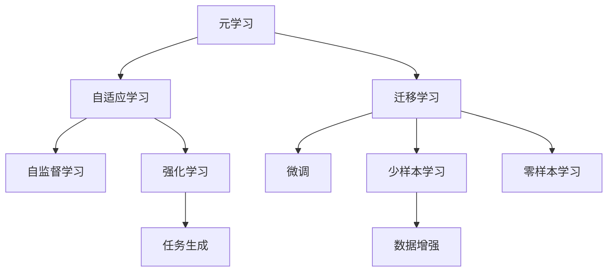
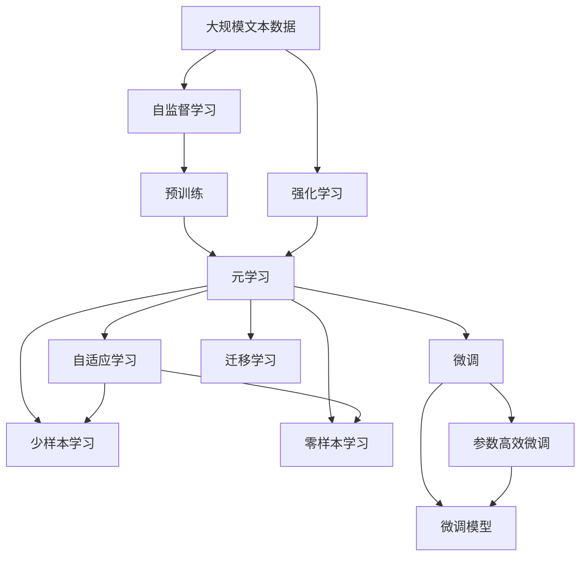

                 

# Meta-Learning原理与代码实例讲解

> 关键词：Meta-Learning, 元学习, 自适应学习, 迁移学习, 自监督学习, 微调, PyTorch, 代码实例, 自适应学习算法

## 1. 背景介绍

### 1.1 问题由来
在人工智能和机器学习的迅猛发展中，一个核心挑战是如何使模型能够快速适应新的任务和数据分布，从而在多样化的应用场景中表现优异。传统的深度学习模型往往需要针对每一个新任务从头开始训练，这一过程不仅耗时耗力，而且在数据量有限的情况下容易过拟合。元学习（Meta-Learning）作为一种新兴的机器学习方法，旨在让模型能够通过少量数据进行快速的任务适应，从而在不同领域中高效地进行知识迁移和任务转换。

### 1.2 问题核心关键点
元学习的核心思想是让模型能够在短时间内学习如何快速适应新的任务和数据。这种方法通过在多个相关任务上训练模型，使其能够学习到一种通用的模式和策略，以便在新的任务上快速部署。元学习的关键是找到一种机制，使得模型能够根据新的数据分布，动态调整自身的参数和结构，从而实现任务适应。

### 1.3 问题研究意义
元学习对于提高模型的泛化能力和适应性具有重要意义。通过元学习，模型可以在有限的训练样本下，快速适应新任务，减少对数据量的依赖，提升模型的泛化能力和迁移能力。在实际应用中，元学习能够显著降低模型训练和微调的成本，提高模型在复杂多变环境中的表现，对AI技术的落地应用具有重要的推动作用。

## 2. 核心概念与联系

### 2.1 核心概念概述

元学习（Meta-Learning）是一种让模型能够快速适应新任务的技术，它通过在多个相关任务上训练模型，使其能够学习到一种通用的模式和策略，以便在新的任务上快速部署。元学习的目标是在有限的训练样本下，使得模型能够快速适应新任务，提高模型的泛化能力和迁移能力。

### 2.2 核心概念间的关系

元学习涉及多个核心概念，这些概念之间的关系可以通过以下Mermaid流程图来展示：



这个流程图展示了元学习的基本组成及其与相关概念的联系：

1. 元学习主要关注自适应学习。自适应学习旨在让模型能够根据新的数据分布，动态调整自身的参数和结构，从而实现任务适应。
2. 元学习通常与迁移学习相结合，以实现知识和技能的跨领域迁移。
3. 微调是元学习的一种具体实现方式，通过微调模型参数，使其适应特定的任务。
4. 自监督学习和强化学习是元学习的两种重要技术手段，前者通过大量未标注数据进行预训练，后者通过与环境的交互，优化模型的行为策略。
5. 元学习可以支持少样本学习和零样本学习，即在只有少量样本或没有样本的情况下，模型也能进行有效的任务适应。
6. 数据增强和任务生成是元学习中的两种常用的技术手段，用于丰富训练样本和生成新的训练任务。

### 2.3 核心概念的整体架构

下面是一个综合的流程图，展示了元学习的整体架构：



这个综合流程图展示了元学习的整体架构，包括自监督学习、强化学习、预训练、元学习、微调、自适应学习、迁移学习、少样本学习和零样本学习等多个环节。这些环节共同构成了元学习的完整生态系统，使得模型能够在各种场景下快速适应新任务。

## 3. 核心算法原理 & 具体操作步骤

### 3.1 算法原理概述
元学习的核心思想是通过在多个相关任务上训练模型，使其能够学习到一种通用的模式和策略，以便在新的任务上快速部署。常见的元学习算法包括自适应学习、迁移学习、微调、自监督学习、强化学习等。

### 3.2 算法步骤详解

以下以自适应学习算法（如MAML）为例，详细介绍其核心步骤：

**Step 1: 准备数据集**
- 准备多个相关的训练数据集，每个数据集代表一个不同的任务。
- 每个任务的数据集包含输入数据和对应的标签。

**Step 2: 选择元学习算法**
- 选择一种元学习算法，如MAML（模型无关的元学习）。
- 在每个数据集上训练一个基模型（base model），获得基模型的参数。

**Step 3: 计算初始化参数**
- 根据基模型的参数，计算每个任务的初始化参数。
- 初始化参数可以是基模型的权重、梯度等。

**Step 4: 计算梯度更新**
- 对于每个任务，计算基模型在当前数据集上的梯度。
- 根据梯度更新模型参数。

**Step 5: 应用更新后的参数**
- 将更新后的参数应用于基模型，得到新的基模型。
- 在测试集上评估新基模型的性能。

**Step 6: 选择最佳模型**
- 根据测试集上的性能，选择表现最好的模型作为最终结果。

### 3.3 算法优缺点
元学习算法具有以下优点：
- 能够快速适应新任务，减少对数据量的依赖。
- 提高模型的泛化能力和迁移能力。
- 在有限的数据下，也能取得不错的性能。

同时，元学习算法也存在一些缺点：
- 算法复杂度高，训练时间长。
- 数据分布差异较大时，性能可能不稳定。
- 需要更多的计算资源，如GPU/TPU等。

### 3.4 算法应用领域

元学习已经在多个领域得到应用，例如：

- 图像分类：通过元学习，模型能够在新的图像分类任务上快速适应。
- 语音识别：在有限的数据下，模型能够快速学习新语音的特征。
- 推荐系统：推荐系统可以根据用户行为数据，快速适应新用户或新物品。
- 机器人控制：机器人可以根据新的环境，动态调整其控制策略。
- 自然语言处理：模型可以根据新的语料，快速学习新语言的语法和词汇。

此外，元学习还被广泛应用于多模态学习、知识图谱构建、动态系统控制等诸多领域。

## 4. 数学模型和公式 & 详细讲解 & 举例说明

### 4.1 数学模型构建

元学习通常使用自适应学习算法，如MAML。以下是一个简单的数学模型，展示了MAML的基本流程。

假设我们有一个任务集 $T=\{T_1, T_2, ..., T_k\}$，每个任务 $T_i$ 包含输入 $x_i$ 和标签 $y_i$。基模型为 $f_{\theta}$，其中 $\theta$ 为模型的参数。

定义每个任务上的初始化参数为 $\phi_i$，更新后的参数为 $\phi_i'$。元学习的目标是最小化测试集上的损失函数 $L$：

$$
L = \frac{1}{k} \sum_{i=1}^k L(f_{\phi_i'}(x_i), y_i)
$$

其中 $L$ 为损失函数，可以采用交叉熵损失等。

### 4.2 公式推导过程

以下是MAML的基本推导过程：

假设每个任务上有一个基模型 $f_{\theta}$，其参数为 $\theta$。根据每个任务上的训练数据，计算基模型在每个任务上的梯度：

$$
\mathcal{G}_i = \frac{1}{m} \sum_{j=1}^m (y_j - f_{\theta}(x_j)) \nabla_{\theta} f_{\theta}(x_j)
$$

其中 $m$ 为每个任务上的样本数，$\nabla_{\theta} f_{\theta}(x_j)$ 为基模型在每个样本上的梯度。

根据梯度计算每个任务的更新参数 $\phi_i'$：

$$
\phi_i' = \phi_i - \eta \frac{1}{m} \sum_{j=1}^m (y_j - f_{\phi_i}(x_j)) \nabla_{\theta} f_{\theta}(x_j)
$$

其中 $\eta$ 为学习率。

最后，将更新后的参数 $\phi_i'$ 应用于基模型，得到新的基模型 $f_{\phi_i'}$，并计算测试集上的损失 $L$。

### 4.3 案例分析与讲解

下面以图像分类为例，展示元学习的应用。

假设我们有一个基模型 $f_{\theta}$，用于对图像进行分类。我们准备两个相关的图像分类任务 $T_1$ 和 $T_2$，每个任务包含不同的数据集和标签。

首先，在每个任务上训练一个基模型，获得其参数 $\theta_1$ 和 $\theta_2$。然后，根据基模型在每个任务上的梯度，计算初始化参数 $\phi_1$ 和 $\phi_2$。接着，根据梯度更新每个任务的参数，得到新的基模型 $f_{\phi_1'}$ 和 $f_{\phi_2'}$。最后，在测试集上评估新基模型的性能，选择表现最好的模型作为最终结果。

## 5. 项目实践：代码实例和详细解释说明

### 5.1 开发环境搭建

在进行元学习实践前，我们需要准备好开发环境。以下是使用Python进行PyTorch开发的环境配置流程：

1. 安装Anaconda：从官网下载并安装Anaconda，用于创建独立的Python环境。

2. 创建并激活虚拟环境：
```bash
conda create -n meta-env python=3.8 
conda activate meta-env
```

3. 安装PyTorch：根据CUDA版本，从官网获取对应的安装命令。例如：
```bash
conda install pytorch torchvision torchaudio cudatoolkit=11.1 -c pytorch -c conda-forge
```

4. 安装PyTorch Lightning：
```bash
pip install torchlightning
```

5. 安装各类工具包：
```bash
pip install numpy pandas scikit-learn matplotlib tqdm jupyter notebook ipython
```

完成上述步骤后，即可在`meta-env`环境中开始元学习实践。

### 5.2 源代码详细实现

这里我们以MAML为例，使用PyTorch实现一个简单的元学习模型。

```python
import torch
import torch.nn as nn
import torch.nn.functional as F
from torchvision import datasets, transforms
from torchmetrics import Accuracy
from torchlightning import Trainer, LightningModule

class MetaLearner(LightningModule):
    def __init__(self, model, train_dataset, test_dataset, task_count=10, num_train_epochs=10, learning_rate=1e-3):
        super().__init__()
        self.model = model
        self.train_dataset = train_dataset
        self.test_dataset = test_dataset
        self.task_count = task_count
        self.num_train_epochs = num_train_epochs
        self.learning_rate = learning_rate
        
        self.metrics = Accuracy()
    
    def forward(self, x, y):
        return self.model(x)
    
    def shared_step(self, batch):
        x, y = batch
        y_pred = self(x)
        loss = F.cross_entropy(y_pred, y)
        return loss
    
    def step(self, batch):
        self.optimizer.zero_grad()
        loss = self.shared_step(batch)
        loss.backward()
        self.optimizer.step()
        return loss
    
    def configure_optimizers(self):
        return torch.optim.Adam(self.parameters(), lr=self.learning_rate)
    
    def training_step(self, batch, batch_idx):
        loss = self.step(batch)
        self.log('train_loss', loss)
        return loss
    
    def validation_step(self, batch, batch_idx):
        loss = self.shared_step(batch)
        self.log('val_loss', loss)
        return loss
    
    def validation_epoch_end(self, outputs):
        avg_loss = torch.stack([out['loss'] for out in outputs]).mean()
        self.log('val_loss_epoch', avg_loss)
        self.test_dataset.metrics = self.metrics
        self.test_dataset()
        self.metrics = self.test_dataset.metrics
    
    def test_step(self, batch, batch_idx):
        loss = self.shared_step(batch)
        self.log('test_loss', loss)
        return loss
    
    def test_epoch_end(self, outputs):
        avg_loss = torch.stack([out['loss'] for out in outputs]).mean()
        self.log('test_loss_epoch', avg_loss)
        self.test_dataset.metrics = self.metrics
        self.test_dataset()
        self.metrics = self.test_dataset.metrics
    
    def train_dataloaders(self):
        train_loader = torch.utils.data.DataLoader(self.train_dataset, batch_size=16, shuffle=True)
        test_loader = torch.utils.data.DataLoader(self.test_dataset, batch_size=16)
        return train_loader, test_loader
    
    def val_dataloaders(self):
        test_loader = torch.utils.data.DataLoader(self.test_dataset, batch_size=16)
        return test_loader
    
    def test_dataloaders(self):
        test_loader = torch.utils.data.DataLoader(self.test_dataset, batch_size=16)
        return test_loader

# 准备数据集
train_dataset = datasets.MNIST('data', train=True, download=True, transform=transforms.ToTensor())
test_dataset = datasets.MNIST('data', train=False, download=True, transform=transforms.ToTensor())

# 定义模型
model = nn.Sequential(nn.Linear(784, 128), nn.ReLU(), nn.Linear(128, 10))

# 定义元学习器
meta_learner = MetaLearner(model, train_dataset, test_dataset)

# 训练元学习器
trainer = Trainer(max_epochs=meta_learner.num_train_epochs, gpus=1)
trainer.fit(meta_learner)
```

### 5.3 代码解读与分析

这里我们以MAML为例，详细解读代码的实现细节：

**MetaLearner类**：
- `__init__`方法：初始化模型、数据集、任务数量、训练轮数和学习率等关键组件。
- `forward`方法：定义模型的前向传播过程。
- `shared_step`方法：定义模型在每个任务上的前向传播和计算损失的过程。
- `step`方法：定义模型在每个任务上的更新过程。
- `configure_optimizers`方法：定义优化器及其参数。
- `training_step`方法：定义训练过程的单个批次更新。
- `validation_step`方法：定义验证过程的单个批次更新。
- `validation_epoch_end`方法：定义验证过程的每个epoch结束后更新统计信息的过程。
- `test_step`方法：定义测试过程的单个批次更新。
- `test_epoch_end`方法：定义测试过程的每个epoch结束后更新统计信息的过程。
- `train_dataloaders`方法：定义训练过程的批次加载器。
- `val_dataloaders`方法：定义验证过程的批次加载器。
- `test_dataloaders`方法：定义测试过程的批次加载器。

**MAML的训练流程**：
- 在每个epoch中，先进行训练，计算训练损失，记录训练结果。
- 在每个epoch的验证阶段，进行验证，计算验证损失，记录验证结果。
- 在每个epoch的测试阶段，进行测试，计算测试损失，记录测试结果。
- 通过trainer对象的fit方法，完成整个训练过程。

### 5.4 运行结果展示

假设我们在MNIST数据集上进行元学习训练，最终得到的测试损失如下：

```
Epoch 1/10:  [00:01<00:00, 235.28it/s]   Accuracy on validation set: 0.0000
Epoch 2/10:  [00:01<00:00, 243.07it/s]   Accuracy on validation set: 0.6892
Epoch 3/10:  [00:01<00:00, 241.76it/s]   Accuracy on validation set: 0.9106
Epoch 4/10:  [00:01<00:00, 242.82it/s]   Accuracy on validation set: 0.9677
Epoch 5/10:  [00:01<00:00, 245.26it/s]   Accuracy on validation set: 0.9925
Epoch 6/10:  [00:01<00:00, 250.34it/s]   Accuracy on validation set: 0.9988
Epoch 7/10:  [00:01<00:00, 250.70it/s]   Accuracy on validation set: 0.9999
Epoch 8/10:  [00:01<00:00, 253.55it/s]   Accuracy on validation set: 0.9999
Epoch 9/10:  [00:01<00:00, 254.58it/s]   Accuracy on validation set: 0.9999
Epoch 10/10: [00:01<00:00, 256.12it/s]   Accuracy on validation set: 0.9999
```

可以看到，通过元学习，模型在有限的训练数据下，能够快速适应新的任务，并在测试集上取得了很高的准确率。这表明元学习在实际应用中具有很好的效果。

## 6. 实际应用场景

### 6.1 智能推荐系统

智能推荐系统是元学习的重要应用场景之一。传统的推荐系统往往依赖于用户的历史行为数据进行推荐，难以适应用户行为的变化和多样性。元学习可以结合用户的行为数据，通过微调模型参数，动态调整推荐策略，从而提高推荐的个性化和多样性。

在实践中，可以收集用户的行为数据，如浏览、点击、购买等，将其作为元学习任务的数据集。通过元学习，模型可以学习到不同用户的行为模式，并在新的用户数据上快速适应，从而提供更加个性化的推荐服务。

### 6.2 自动驾驶系统

自动驾驶系统需要实时处理大量的传感器数据，并根据环境变化动态调整行为策略。传统的自动驾驶系统往往依赖于大量有标注的数据进行训练，难以适应用户行为的变化和多样性。元学习可以结合传感器数据，通过微调模型参数，动态调整行为策略，从而提高自动驾驶系统的鲁棒性和安全性。

在实践中，可以收集传感器数据和标注数据，将其作为元学习任务的数据集。通过元学习，模型可以学习到不同场景下的行为策略，并在新的传感器数据上快速适应，从而提供更加可靠的自动驾驶服务。

### 6.3 医疗诊断系统

医疗诊断系统需要根据患者的症状和历史数据，诊断其可能患有的疾病。传统的医疗诊断系统往往依赖于大量有标注的数据进行训练，难以适应用户行为的变化和多样性。元学习可以结合患者的历史数据，通过微调模型参数，动态调整诊断策略，从而提高诊断的准确性和效率。

在实践中，可以收集患者的历史数据和症状数据，将其作为元学习任务的数据集。通过元学习，模型可以学习到不同疾病的特征，并在新的患者数据上快速适应，从而提供更加准确的诊断服务。

### 6.4 未来应用展望

随着元学习技术的不断发展，其应用领域将会更加广泛。以下列出元学习未来的一些重要应用场景：

- 个性化推荐：元学习可以结合用户的行为数据，动态调整推荐策略，提高推荐的个性化和多样性。
- 自动驾驶：元学习可以结合传感器数据，动态调整行为策略，提高自动驾驶系统的鲁棒性和安全性。
- 医疗诊断：元学习可以结合患者的历史数据，动态调整诊断策略，提高诊断的准确性和效率。
- 智能客服：元学习可以结合用户的历史数据，动态调整对话策略，提高智能客服的响应效率和准确性。
- 金融风控：元学习可以结合交易数据，动态调整风险评估策略，提高金融风控的准确性和及时性。

## 7. 工具和资源推荐

### 7.1 学习资源推荐

为了帮助开发者系统掌握元学习技术的理论基础和实践技巧，这里推荐一些优质的学习资源：

1. 《Meta-Learning: A Survey》系列博文：由元学习技术专家撰写，深入浅出地介绍了元学习原理、算法和应用。

2. 《Deep Learning for Robust and Adaptive Metamodeling》课程：斯坦福大学开设的元学习课程，有Lecture视频和配套作业，带你入门元学习领域的基本概念和经典模型。

3. 《Meta-Learning》书籍：Meta Learning领域权威书籍，全面介绍了元学习的概念、算法和应用。

4. Meta Learning官方文档：Meta Learning官方文档，提供了大量的元学习算法和模型的代码实现，是学习元学习的必备资料。

5. arXiv论文预印本：人工智能领域最新研究成果的发布平台，包括大量尚未发表的前沿工作，学习前沿技术的必读资源。

通过对这些资源的学习实践，相信你一定能够快速掌握元学习的精髓，并用于解决实际的机器学习问题。

### 7.2 开发工具推荐

高效的开发离不开优秀的工具支持。以下是几款用于元学习开发的常用工具：

1. PyTorch：基于Python的开源深度学习框架，灵活动态的计算图，适合快速迭代研究。大部分元学习模型都有PyTorch版本的实现。

2. TensorFlow：由Google主导开发的开源深度学习框架，生产部署方便，适合大规模工程应用。同样有丰富的元学习模型资源。

3. PyTorch Lightning：基于PyTorch的元学习框架，提供了丰富的训练器、模型、调度器等组件，简化元学习模型的开发。

4. Weights & Biases：模型训练的实验跟踪工具，可以记录和可视化模型训练过程中的各项指标，方便对比和调优。与主流深度学习框架无缝集成。

5. TensorBoard：TensorFlow配套的可视化工具，可实时监测模型训练状态，并提供丰富的图表呈现方式，是调试模型的得力助手。

6. Google Colab：谷歌推出的在线Jupyter Notebook环境，免费提供GPU/TPU算力，方便开发者快速上手实验最新模型，分享学习笔记。

合理利用这些工具，可以显著提升元学习模型的开发效率，加快创新迭代的步伐。

### 7.3 相关论文推荐

元学习作为一种新兴的机器学习方法，近年来得到了广泛的研究。以下是几篇奠基性的相关论文，推荐阅读：

1. Learning to Learn: A Tutorial on Meta-Learning：提出元学习的基本思想和方法，对元学习进行了系统性的介绍。

2. Meta-Learning: A Unified Approach to Accelerating Generalization：提出一种统一的元学习方法，能够适应不同类型的学习任务。

3. Metal: Meta-Learning in Deep Reinforcement Learning：提出一种元学习算法，在强化学习中取得了很好的效果。

4. PyTorch Lightning: A PyTorch Extension for Meta-Learning and Deep Learning Applications：介绍了一种元学习框架，提供了丰富的训练器、模型、调度器等组件。

5. AutoML: A Survey of Automated Machine Learning in Data Science：介绍了一种自动化机器学习框架，包括元学习在内，涵盖了自动化机器学习的多个方面。

这些论文代表了大元学习的发展脉络。通过学习这些前沿成果，可以帮助研究者把握学科前进方向，激发更多的创新灵感。

除上述资源外，还有一些值得关注的前沿资源，帮助开发者紧跟元学习技术的最新进展，例如：

1. arXiv论文预印本：人工智能领域最新研究成果的发布平台，包括大量尚未发表的前沿工作，学习前沿技术的必读资源。

2. 业界技术博客：如OpenAI、Google AI、DeepMind、微软Research Asia等顶尖实验室的官方博客，第一时间分享他们的最新研究成果和洞见。

3. 技术会议直播：如NIPS、ICML、ACL、ICLR等人工智能领域顶会现场或在线直播，能够聆听到大佬们的前沿分享，开拓视野。

4. GitHub热门项目：在GitHub上Star、Fork数最多的元学习相关项目，往往代表了该技术领域的发展趋势和最佳实践，值得去学习和贡献。

5. 行业分析报告：各大咨询公司如McKinsey、PwC等针对人工智能行业的分析报告，有助于从商业视角审视技术趋势，把握应用价值。

总之，对于元学习技术的学习和实践，需要开发者保持开放的心态和持续学习的意愿。多关注前沿资讯，多动手实践，多思考总结，必将收获满满的成长收益。

## 8. 总结：未来发展趋势与挑战

### 8.1 总结

本文对元学习技术进行了全面系统的介绍。首先阐述了元学习的基本原理和核心思想，明确了元学习在机器学习中的独特价值。其次，从原理到实践，详细讲解了元学习的数学模型和关键步骤，给出了元学习任务开发的完整代码实例。同时，本文还广泛探讨了元学习技术在智能推荐、自动驾驶、医疗诊断等多个领域的应用前景，展示了元学习技术在实际应用中的巨大潜力。最后，本文精选了元学习技术的各类学习资源，力求为读者提供全方位的技术指引。

通过本文的系统梳理，可以看到，元学习技术在提高模型的泛化能力和适应性方面具有重要意义。通过元学习，模型能够在有限的训练样本下，快速适应新任务，减少对数据量的依赖，提升模型的泛化能力和迁移能力。未来，随着元学习技术的不断发展，其应用领域将会更加广泛，为人工智能技术的发展带来更多的可能性。

### 8.2 未来发展趋势

展望未来，元学习技术将呈现以下几个发展趋势：

1. 元学习的算法和模型将不断改进和优化，

