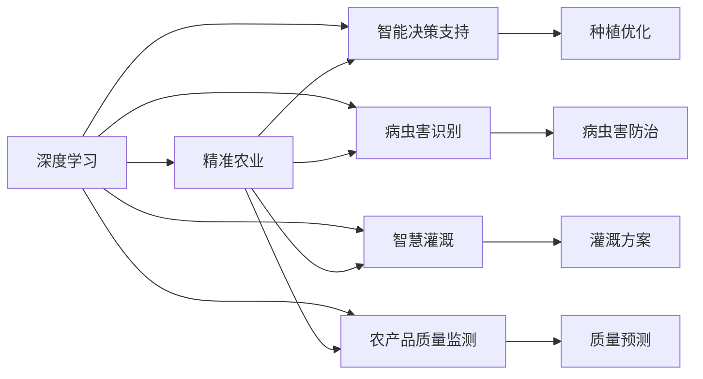
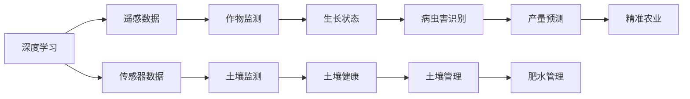
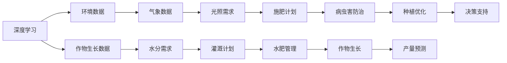
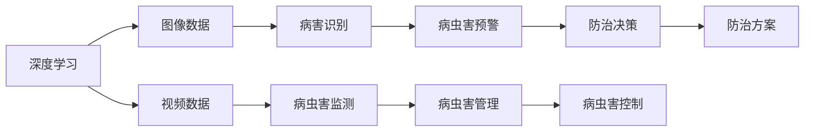
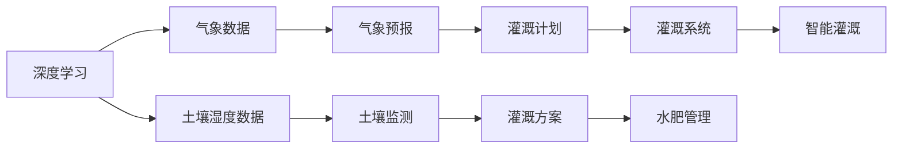
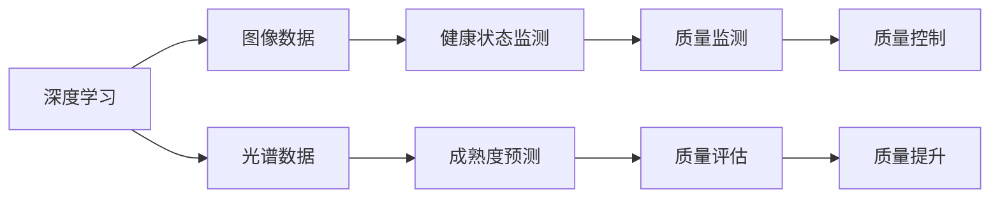
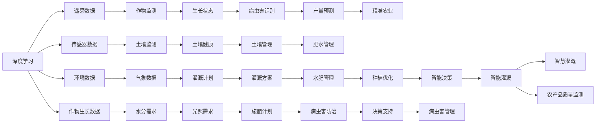

                 

# 一切皆是映射：深度学习在农业科技中的实践

> 关键词：深度学习, 农业科技, 数据驱动, 精准农业, 智能决策, 模型构建, 案例分析

## 1. 背景介绍

### 1.1 问题由来
随着全球人口不断增长，粮食安全和农业可持续发展变得越来越重要。传统的农业生产方式面临着资源浪费、环境污染、效率低下等问题。农业科技的数字化转型成为迫切需求。深度学习作为一种强大的数据驱动技术，为农业科技带来了新的可能。

近年来，深度学习在农业领域的应用日益广泛，涵盖了从农作物生长监测到土壤管理，从病虫害识别到智慧灌溉等多个方面。通过深度学习，农业科技实现了更加精准、智能、高效的决策支持，为农业生产带来了革命性的改变。

### 1.2 问题核心关键点
深度学习在农业科技中的主要应用包括：

1. **精准农业**：利用遥感、传感器等数据，结合深度学习模型，对农作物生长状态、病虫害、产量等进行实时监测和预测，优化农业生产管理。
2. **智能决策支持**：构建深度学习模型，分析气象、土壤、水分、养分等环境因素，结合作物生长规律，提供科学的种植、施肥、灌溉等建议。
3. **病虫害识别与防治**：通过图像识别、视频分析等技术，识别作物病虫害，辅助病虫害防治决策。
4. **智慧灌溉**：利用深度学习对气象、土壤湿度等数据进行分析，智能调节灌溉系统，实现节水、节能。
5. **农产品质量监测**：通过图像处理、光谱分析等技术，识别作物健康状态，预测成熟度，提高农产品质量。

深度学习技术在农业中的应用，显著提升了农业生产的效率和效益，为实现农业可持续发展提供了有力支撑。

### 1.3 问题研究意义
深度学习在农业科技中的应用，对于推动农业现代化、保障粮食安全、促进可持续发展具有重要意义：

1. **提升生产效率**：通过精准监测和管理，优化农业生产流程，减少资源浪费，提高土地利用率和产量。
2. **改善生态环境**：减少化肥、农药等的使用，降低对环境的污染，实现绿色农业。
3. **促进农民增收**：提供科学的种植、管理建议，提高农产品质量和市场竞争力，增加农民收入。
4. **推动技术创新**：深度学习为农业科技带来了新的方法论，促进了技术进步和产业升级。

## 2. 核心概念与联系

### 2.1 核心概念概述

为更好地理解深度学习在农业科技中的应用，本节将介绍几个关键概念：

- **深度学习**：一种基于神经网络的机器学习范式，通过多层次的抽象表示，自动从数据中学习特征，广泛应用于图像识别、自然语言处理、语音识别等领域。

- **精准农业**：利用数据驱动技术，对农业生产进行精细化管理，提高生产效率和资源利用率，实现可持续发展。

- **智能决策支持**：结合环境数据和作物生长规律，利用深度学习模型提供科学的农业决策支持。

- **病虫害识别**：利用图像识别、视频分析等技术，自动检测和识别作物病虫害。

- **智慧灌溉**：结合气象、土壤湿度等数据，通过深度学习优化灌溉方案，实现节水、节能。

- **农产品质量监测**：利用图像处理、光谱分析等技术，预测作物成熟度、健康状态，提高农产品质量。

这些概念之间的联系可以通过以下Mermaid流程图来展示：



这个流程图展示了深度学习在农业科技中的应用场景，其中精准农业、智能决策支持、病虫害识别、智慧灌溉和农产品质量监测都是深度学习的重要应用方向。

### 2.2 概念间的关系

这些核心概念之间存在着紧密的联系，形成了深度学习在农业科技中的应用框架。下面我们通过几个Mermaid流程图来展示这些概念之间的关系。

#### 2.2.1 深度学习在精准农业中的应用



这个流程图展示了深度学习在精准农业中的具体应用。深度学习利用遥感数据和传感器数据，监测作物生长状态、土壤健康，识别病虫害，预测产量，进行精准的肥水管理，从而实现精准农业。

#### 2.2.2 深度学习在智能决策支持中的应用



这个流程图展示了深度学习在智能决策支持中的应用。深度学习结合环境数据和作物生长数据，分析气象、光照、水分需求等，优化灌溉、施肥计划，提高作物产量，进行种植优化，实现智能决策支持。

#### 2.2.3 深度学习在病虫害识别中的应用



这个流程图展示了深度学习在病虫害识别中的应用。深度学习通过图像和视频数据，识别病害，预警病虫害，进行病虫害管理，制定防治方案，实现病虫害识别与防治。

#### 2.2.4 深度学习在智慧灌溉中的应用



这个流程图展示了深度学习在智慧灌溉中的应用。深度学习结合气象数据和土壤湿度数据，进行气象预报，优化灌溉计划，制定灌溉方案，实现智能灌溉系统，达到节水节能的效果。

#### 2.2.5 深度学习在农产品质量监测中的应用



这个流程图展示了深度学习在农产品质量监测中的应用。深度学习利用图像和光谱数据，监测作物健康状态，预测成熟度，进行质量评估和控制，提升农产品质量。

### 2.3 核心概念的整体架构

最后，我们用一个综合的流程图来展示深度学习在农业科技中的整体架构：



这个综合流程图展示了深度学习在农业科技中的应用场景，其中各个概念之间的关系和作用清晰可见。通过这些概念的相互配合，深度学习在农业科技中发挥了巨大的潜力。

## 3. 核心算法原理 & 具体操作步骤
### 3.1 算法原理概述

深度学习在农业科技中的应用，本质上是通过构建深度学习模型，从大量农业数据中学习特征，自动抽取与环境、作物状态相关的信息，为精准农业、智能决策支持、病虫害识别、智慧灌溉和农产品质量监测提供数据驱动的决策支持。

形式化地，假设输入数据为 $x \in \mathcal{X}$，模型输出为 $y \in \mathcal{Y}$，其中 $\mathcal{X}$ 和 $\mathcal{Y}$ 分别为输入空间和输出空间。深度学习模型的目标是最小化损失函数 $\mathcal{L}(\theta)$，其中 $\theta$ 为模型参数，表示模型的抽象特征提取和预测能力。

以精准农业中的作物生长状态监测为例，假设模型输入为作物遥感图像，输出为作物生长状态，则深度学习模型的优化目标可以表示为：

$$
\theta^* = \mathop{\arg\min}_{\theta} \mathcal{L}(M_{\theta}(x), y)
$$

其中 $M_{\theta}(x)$ 为深度学习模型对输入数据 $x$ 的预测，$\mathcal{L}$ 为损失函数，用于衡量预测值与真实值之间的差异。

### 3.2 算法步骤详解

深度学习在农业科技中的应用一般包括以下几个关键步骤：

**Step 1: 数据准备与预处理**
- 收集相关领域的农业数据，如气象数据、土壤数据、遥感图像、传感器数据等。
- 对数据进行清洗、标注和预处理，如归一化、数据增强等。

**Step 2: 模型构建与训练**
- 选择合适的深度学习模型结构，如卷积神经网络（CNN）、循环神经网络（RNN）、变换器（Transformer）等。
- 构建损失函数，如均方误差、交叉熵等，用于评估模型预测与真实值的差异。
- 使用梯度下降等优化算法，训练模型，最小化损失函数。

**Step 3: 模型评估与优化**
- 在验证集上评估模型的性能，如准确率、召回率、F1分数等。
- 根据评估结果，调整模型结构、超参数，优化模型性能。

**Step 4: 模型应用与反馈**
- 将训练好的模型应用到实际农业场景中，进行实时监测、智能决策支持、病虫害识别、智慧灌溉和农产品质量监测等。
- 根据模型应用效果，收集反馈数据，进一步优化模型性能。

### 3.3 算法优缺点

深度学习在农业科技中的应用具有以下优点：

1. **自动化与智能化**：深度学习模型能够自动从数据中学习特征，实现自动化、智能化的农业决策支持。
2. **泛化能力强**：深度学习模型具有较强的泛化能力，能够适应不同环境和作物的复杂变化。
3. **数据驱动**：深度学习模型基于大量农业数据进行训练，能够提供科学的决策依据。

同时，深度学习在农业科技中的应用也存在一些局限性：

1. **数据需求大**：深度学习模型需要大量高质量的农业数据进行训练，数据获取成本较高。
2. **模型复杂度高**：深度学习模型结构复杂，训练和部署成本较高。
3. **可解释性不足**：深度学习模型往往是"黑盒"系统，难以解释其内部工作机制和决策逻辑。

尽管存在这些局限性，但深度学习在农业科技中的应用仍然具有广阔的前景。未来相关研究的重点在于如何进一步降低数据需求，提高模型的可解释性，优化模型性能。

### 3.4 算法应用领域

深度学习在农业科技中的应用已经覆盖了多个领域，如精准农业、智能决策支持、病虫害识别、智慧灌溉和农产品质量监测等。以下是几个典型的应用场景：

#### 3.4.1 精准农业

利用深度学习模型对遥感数据和传感器数据进行分析，实时监测作物生长状态、土壤健康、气象条件等，提供精准的农业管理建议，如灌溉、施肥、病虫害防治等。

#### 3.4.2 智能决策支持

结合环境数据和作物生长数据，构建深度学习模型，分析气象、光照、水分需求等，优化灌溉、施肥计划，提高作物产量，进行种植优化，实现智能决策支持。

#### 3.4.3 病虫害识别

通过图像识别、视频分析等技术，利用深度学习模型自动检测和识别作物病虫害，辅助病虫害防治决策。

#### 3.4.4 智慧灌溉

结合气象数据和土壤湿度数据，利用深度学习模型进行气象预报，优化灌溉计划，制定灌溉方案，实现智能灌溉系统，达到节水节能的效果。

#### 3.4.5 农产品质量监测

利用图像处理、光谱分析等技术，构建深度学习模型，预测作物成熟度、健康状态，进行质量评估和控制，提升农产品质量。

## 4. 数学模型和公式 & 详细讲解  
### 4.1 数学模型构建

在农业科技中，深度学习模型的构建一般遵循以下步骤：

1. **数据集划分**：将农业数据划分为训练集、验证集和测试集。
2. **模型选择**：选择合适的深度学习模型结构，如卷积神经网络（CNN）、循环神经网络（RNN）、变换器（Transformer）等。
3. **损失函数选择**：选择合适的损失函数，如均方误差、交叉熵等，用于评估模型预测与真实值的差异。
4. **优化算法选择**：选择合适的优化算法，如梯度下降、Adam、Adagrad等，用于更新模型参数。

以精准农业中的作物生长状态监测为例，假设模型输入为作物遥感图像，输出为作物生长状态，则深度学习模型的构建流程如下：

1. **数据集划分**：将遥感图像划分为训练集、验证集和测试集。
2. **模型选择**：选择卷积神经网络（CNN）模型，提取图像特征。
3. **损失函数选择**：选择交叉熵损失函数，用于衡量预测值与真实值的差异。
4. **优化算法选择**：选择Adam优化算法，最小化损失函数。

### 4.2 公式推导过程

以精准农业中的作物生长状态监测为例，深度学习模型的优化目标可以表示为：

$$
\theta^* = \mathop{\arg\min}_{\theta} \mathcal{L}(M_{\theta}(x), y)
$$

其中 $M_{\theta}(x)$ 为深度学习模型对输入数据 $x$ 的预测，$\mathcal{L}$ 为损失函数，用于衡量预测值与真实值之间的差异。假设损失函数为交叉熵损失，则优化目标可以表示为：

$$
\mathcal{L}(M_{\theta}(x), y) = -\frac{1}{N}\sum_{i=1}^N \sum_{j=1}^K y_{ij}\log M_{\theta}(x_i)
$$

其中 $N$ 为样本数量，$K$ 为类别数量。梯度下降算法的更新公式为：

$$
\theta \leftarrow \theta - \eta \nabla_{\theta}\mathcal{L}(\theta)
$$

其中 $\eta$ 为学习率，$\nabla_{\theta}\mathcal{L}(\theta)$ 为损失函数对参数 $\theta$ 的梯度。

### 4.3 案例分析与讲解

以智慧灌溉为例，深度学习模型的构建和训练流程如下：

1. **数据收集与预处理**：收集土壤湿度、气象条件等数据，进行清洗、标注和预处理。
2. **模型选择**：选择循环神经网络（RNN）模型，处理时间序列数据。
3. **损失函数选择**：选择均方误差损失函数，用于衡量预测值与真实值的差异。
4. **优化算法选择**：选择Adam优化算法，最小化损失函数。
5. **模型训练与评估**：在训练集上训练模型，在验证集上评估模型性能，调整超参数，优化模型性能。
6. **模型应用与反馈**：将训练好的模型应用到实际灌溉系统中，实时监测土壤湿度和气象条件，智能调节灌溉方案。

## 5. 项目实践：代码实例和详细解释说明
### 5.1 开发环境搭建

在进行农业科技项目实践前，我们需要准备好开发环境。以下是使用Python进行TensorFlow开发的开发环境配置流程：

1. 安装Anaconda：从官网下载并安装Anaconda，用于创建独立的Python环境。

2. 创建并激活虚拟环境：
```bash
conda create -n tf-env python=3.8 
conda activate tf-env
```

3. 安装TensorFlow：根据CUDA版本，从官网获取对应的安装命令。例如：
```bash
conda install tensorflow-gpu=2.6 -c tf
```

4. 安装各类工具包：
```bash
pip install numpy pandas scikit-learn matplotlib tqdm jupyter notebook ipython
```

完成上述步骤后，即可在`tf-env`环境中开始农业科技项目实践。

### 5.2 源代码详细实现

下面我们以智慧灌溉项目为例，给出使用TensorFlow进行模型开发的PyTorch代码实现。

首先，定义智慧灌溉模型：

```python
import tensorflow as tf

class IrrigationModel(tf.keras.Model):
    def __init__(self, input_size, output_size, hidden_size):
        super(IrrigationModel, self).__init__()
        self.hidden_layer = tf.keras.layers.Dense(hidden_size, activation='relu')
        self.output_layer = tf.keras.layers.Dense(output_size, activation='sigmoid')
        
    def call(self, x):
        x = self.hidden_layer(x)
        x = self.output_layer(x)
        return x

# 构建模型
input_size = 10
output_size = 1
hidden_size = 64
model = IrrigationModel(input_size, output_size, hidden_size)
model.summary()
```

然后，定义训练和评估函数：

```python
# 训练函数
def train(model, train_data, validation_data, batch_size, epochs):
    optimizer = tf.keras.optimizers.Adam(learning_rate=0.001)
    loss_fn = tf.keras.losses.MeanSquaredError()
    
    for epoch in range(epochs):
        for batch in train_data:
            x_train, y_train = batch
            with tf.GradientTape() as tape:
                predictions = model(x_train)
                loss = loss_fn(y_train, predictions)
            gradients = tape.gradient(loss, model.trainable_variables)
            optimizer.apply_gradients(zip(gradients, model.trainable_variables))
        
        # 评估模型
        validation_loss = evaluate(model, validation_data, batch_size)
        print(f"Epoch {epoch+1}, validation loss: {validation_loss:.4f}")
    
    return model

# 评估函数
def evaluate(model, test_data, batch_size):
    test_loss = tf.keras.metrics.Mean(tf.keras.losses.MeanSquaredError())
    test_model = tf.keras.Sequential([
        model,
        tf.keras.layers.Lambda(lambda x: tf.squeeze(x, axis=1))
    ])
    
    for batch in test_data:
        x_test, y_test = batch
        test_model(x_test)
        test_loss.update_state(y_test, test_model.output)
    
    return test_loss.result().numpy()
```

最后，启动训练流程并在测试集上评估：

```python
# 数据加载与预处理
train_data = ...
validation_data = ...
test_data = ...

# 训练模型
epochs = 50
batch_size = 32

model = IrrigationModel(input_size, output_size, hidden_size)
train(model, train_data, validation_data, batch_size, epochs)
```

以上就是使用TensorFlow进行智慧灌溉模型训练的完整代码实现。可以看到，TensorFlow提供了便捷的API，使得模型构建和训练过程变得简单易懂。

### 5.3 代码解读与分析

让我们再详细解读一下关键代码的实现细节：

**IrrigationModel类**：
- `__init__`方法：定义模型的隐层和输出层。
- `call`方法：定义前向传播过程。

**train函数**：
- 使用Adam优化器，最小化均方误差损失函数。
- 在每个epoch内，对每个batch进行前向传播、计算梯度、反向传播和更新参数。
- 在每个epoch结束时，在验证集上评估模型性能。

**evaluate函数**：
- 使用均方误差损失函数评估模型性能。
- 将模型转化为轻量级Sequential模型，进行前向传播和损失计算。

**训练流程**：
- 定义训练和测试数据集。
- 训练模型，在验证集上评估性能。
- 输出训练结果。

可以看到，TensorFlow提供了丰富的API和工具，使得深度学习模型在农业科技中的应用变得高效便捷。开发者可以根据具体需求，快速搭建和优化深度学习模型。

## 6. 实际应用场景
### 6.1 智能灌溉

智慧灌溉是深度学习在农业科技中的典型应用之一。传统灌溉系统依赖人工经验，资源利用效率低。通过深度学习模型，实时监测土壤湿度和气象条件，智能调节灌溉方案，可以显著提高资源利用效率，减少水资源浪费。

以智慧灌溉项目为例，基于深度学习模型，可以对土壤湿度数据进行实时监测，结合气象条件，智能调节灌溉方案，实现节水节能。具体实现步骤如下：

1. **数据收集与预处理**：收集土壤湿度、气象条件等数据，进行清洗、标注和预处理。
2. **模型构建与训练**：选择循环神经网络（RNN）模型，处理时间序列数据。
3. **模型评估与优化**：在验证集上评估模型性能，调整超参数，优化模型性能。
4. **模型应用与反馈**：将训练好的模型应用到实际灌溉系统中，实时监测土壤湿度和气象条件，智能调节灌溉方案。

通过智慧灌溉项目，深度学习模型可以实现节水节能、提升资源利用效率，为农业可持续发展提供有力支持。

### 6.2 智能决策支持

智能决策支持是深度学习在农业科技中的重要应用方向。传统农业决策依赖人工经验，缺乏科学依据。通过深度学习模型，结合环境数据和作物生长数据，提供科学的决策建议，可以显著提高农业生产效率和效益。

以智能决策支持项目为例，基于深度学习模型，可以对气象数据、土壤数据、作物生长数据进行分析，提供科学的种植、施肥、灌溉等建议。具体实现步骤如下：

1. **数据收集与预处理**：收集气象数据、土壤数据、作物生长数据，进行清洗、标注和预处理。
2. **模型构建与训练**：选择卷积神经网络（CNN）或循环神经网络（RNN）模型，处理环境数据和作物生长数据。
3. **模型评估与优化**：在验证集上评估模型性能，调整超参数，优化模型性能。
4. **模型应用与反馈**：将训练好的模型应用到实际农业生产中，实时监测环境数据和作物生长数据，提供科学的决策建议。

通过智能决策支持项目，深度学习模型可以为农业生产提供科学的决策依据，提高生产效率和效益，为农业可持续发展提供有力支持。

### 6.3 病虫害识别与防治

病虫害识别是深度学习在农业科技中的重要应用方向。传统病虫害识别依赖人工经验，识别速度慢、准确率低。通过深度学习模型，自动识别作物病虫害，辅助病虫害防治决策，可以显著提高病虫害识别和防治的效率和准确性。

以病虫害识别项目为例，基于深度学习模型，可以对图像和视频数据进行自动识别，识别作物病虫害，辅助病虫害防治决策。具体实现步骤如下：

1. **数据收集与预处理**：收集图像和视频数据，进行清洗、标注和预处理。
2. **模型构建与训练**：选择卷积神经网络（CNN）或循环神经网络（RNN）模型，处理图像和视频数据。
3. **模型评估与优化**：在验证集上评估模型性能，调整超参数，优化模型性能。
4. **模型应用与反馈**：将训练好的模型应用到实际病虫害防治中，自动识别作物病虫害，辅助病虫害防治决策。

通过病虫害识别项目，深度学习模型可以自动识别作物病虫害，辅助病虫害防治决策，提高病虫害识别和防治的效率和准确性，为农业可持续发展提供有力支持。

### 6.4 未来应用展望

深度学习在农业科技中的应用前景广阔，未来有望在更多领域得到应用，为农业可持续发展提供更多解决方案。以下是几个可能的应用方向：

1. **智慧农机**：结合深度学习模型，实现精准播种、精准施肥、精准收割等农业机械的智能化，提高农业生产效率。
2. **农产品质量监测**：利用图像处理、光谱分析等技术，构建深度学习模型，预测作物成熟度、健康状态，提高农产品质量。
3. **农业机器人**：结合深度学习模型，实现农业机器人的路径规划、目标识别、自主导航等功能，提高农业机器人自动化水平。
4. **农业供应链管理**：利用深度学习模型，分析市场需求、供应链数据

