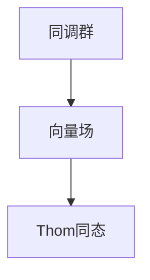

                 

## 1. 背景介绍

在上同调理论中，Thom同态是一个基本的概念，它将同调群和向量场的性质联系起来，是微分拓扑学的重要工具。本文将详细介绍Thom同态的定义、性质以及应用，帮助读者理解其在代数拓扑和代数几何中的应用。

## 2. 核心概念与联系

### 2.1 核心概念概述

在代数拓扑学中，同调群是一类重要的代数结构，用于研究拓扑空间的不变性。而向量场是研究流形几何性质的重要工具，通过向量场的研究可以深入了解流形的局部和整体结构。Thom同态将这两个领域联系起来，提供了一个将向量场嵌入到同调群中的方法。

### 2.2 核心概念之间的关系

- **同调群**：同调群是一类在拓扑空间上定义的代数结构，用于描述空间的不变性。具体而言，对于一个闭流形 $M$，其整数同调群 $H_*(\Omega)$ 是一个由上同调群 $H^*(\Omega)$ 生成的自由群，其自由生成元为流形上的闭链。

- **向量场**：向量场是定义在光滑流形上的平滑向量。向量场的一个重要性质是满足梯度条件，即流形的每个点都有一个对应的向量，描述了在该点处的局部运动方向。

- **Thom同态**：Thom同态将向量场通过嵌入的方式映射到同调群中，具体而言，对于每个向量场 $X$，其Thom同态 $H^*(X)$ 将向量场的梯度映射到同调群的奇数维度的上同调群中。

以上三个概念之间的关系可以用以下 Mermaid 流程图来展示：



这个流程图展示了同调群、向量场和Thom同态之间的关系。向量场通过Thom同态被映射到同调群中，从而利用同调群的代数性质研究向量场的几何性质。

### 2.3 核心概念的整体架构

Thom同态的整体架构可以总结如下：

1. **同调群的定义**：同调群是一类描述拓扑空间不变量性质的代数结构，具体到闭流形 $M$，其整数同调群 $H_*(\Omega)$ 是由上同调群 $H^*(\Omega)$ 生成的自由群。

2. **向量场的定义**：向量场是定义在光滑流形上的平滑向量，其梯度条件保证了向量场的局部运动方向。

3. **Thom同态的定义**：Thom同态将向量场 $X$ 的梯度映射到同调群的奇数维度的上同调群中，即 $H^*(X):C^\infty(M; \mathbb{R}) \to H^*(\Omega)$。

4. **Thom同态的性质**：Thom同态具有封闭性、光滑性和拟循环性等性质，是研究向量场和同调群之间关系的重要工具。

5. **Thom同态的应用**：Thom同态在代数拓扑和代数几何中有着广泛的应用，如Pontryagin同伦群、Bott-Thom同态、Bott-Thom积分等。

以上结构展示了Thom同态的核心概念和其应用领域，通过理解这些核心概念，我们可以更好地把握Thom同态的理论基础和应用方向。

## 3. 核心算法原理 & 具体操作步骤

### 3.1 算法原理概述

Thom同态的原理可以通过Pontryagin同伦群的构造来理解。具体来说，对于向量场 $X$，其梯度流 $\Phi_X$ 满足梯度条件，可以通过Pontryagin同伦群中的同伦 $P_X$ 来描述。Thom同态 $H^*(X)$ 将同伦 $P_X$ 映射到同调群的奇数维度的上同调群中。

### 3.2 算法步骤详解

1. **同伦的构造**：对于给定的向量场 $X$，构造其梯度流 $\Phi_X$。梯度流 $\Phi_X$ 满足梯度条件，即在每个点处的切向量满足 $d\Phi_X = X$。

2. **同伦的提升**：通过Pontryagin同伦群中的同伦 $P_X$ 来描述梯度流 $\Phi_X$。Pontryagin同伦群中的同伦 $P_X$ 是一个从 $M$ 到 $M \times S^1$ 的光滑映射，满足同伦条件。

3. **Thom同态的映射**：将同伦 $P_X$ 映射到同调群的奇数维度的上同调群中，得到Thom同态 $H^*(X)$。

### 3.3 算法优缺点

Thom同态的主要优点包括：

- **代数结构明确**：Thom同态将向量场通过同伦映射到同调群中，提供了清晰的代数结构，方便进行代数计算。
- **几何性质直观**：通过Thom同态，向量场的几何性质可以直接映射到同调群的代数性质中，便于理解和研究。

其主要缺点包括：

- **计算复杂**：计算Thom同态需要构造同伦，对于复杂向量场，计算量可能较大。
- **局部性质不够**：Thom同态只能处理整个流形上的向量场，对于局部性质较强的向量场，可能需要进一步分析。

### 3.4 算法应用领域

Thom同态在代数拓扑和代数几何中有着广泛的应用，具体包括：

- **Pontryagin同伦群**：Thom同态是构造Pontryagin同伦群的基础，通过Thom同态，可以研究Pontryagin同伦群中的元素性质。
- **Bott-Thom同态**：Thom同态是计算Bott-Thom同态的基础，Bott-Thom同态是研究向量场拓扑性质的重要工具。
- **Bott-Thom积分**：通过Thom同态，可以计算向量场的Bott-Thom积分，进一步研究向量场的拓扑性质。

这些应用展示了Thom同态在代数拓扑和代数几何中的重要性和广泛性。

## 4. 数学模型和公式 & 详细讲解

### 4.1 数学模型构建

设 $M$ 为一个闭流形， $X$ 为 $M$ 上的向量场， $H^*(\Omega)$ 为 $M$ 的整数同调群， $H^*(X)$ 为 $X$ 的Thom同态，则：

$$
H^*(X):C^\infty(M; \mathbb{R}) \to H^*(\Omega)
$$

其中 $C^\infty(M; \mathbb{R})$ 表示 $M$ 上的光滑函数空间， $H^*(\Omega)$ 表示 $M$ 的整数同调群， $H^*(X)$ 表示向量场 $X$ 的Thom同态。

### 4.2 公式推导过程

对于给定的向量场 $X$，其梯度流 $\Phi_X$ 满足梯度条件，即在每个点处的切向量满足 $d\Phi_X = X$。设 $P_X$ 为 $M$ 到 $M \times S^1$ 的光滑同伦，满足同伦条件，则：

$$
H^*(X):C^\infty(M; \mathbb{R}) \to H^*(\Omega)
$$

其中 $H^*(X)(c)$ 定义为：

$$
H^*(X)(c) = [P_X \# c] \in H^*(\Omega)
$$

其中 $c \in C^\infty(M; \mathbb{R})$， $[P_X \# c]$ 表示 $P_X$ 和 $c$ 的Thom同伦的积分。

### 4.3 案例分析与讲解

考虑 $M$ 为一个球面 $S^2$， $X$ 为 $S^2$ 上的标准向量场，即 $X = \nabla f$，其中 $f$ 是 $S^2$ 上的一个标量函数，满足 $f(x) = 0$ 对所有 $x \in S^2$ 成立。构造梯度流 $\Phi_X$，则有：

$$
\Phi_X: S^2 \times \mathbb{R} \to S^2
$$

其中 $\Phi_X(x,t) = \exp(t \cdot X(x))$。构造同伦 $P_X$，则有：

$$
P_X: S^2 \to S^2 \times S^1
$$

其中 $P_X(x) = (x, 2t \cdot \nabla f(x))$。计算 $H^*(X)$，则有：

$$
H^*(X)(c) = [P_X \# c] \in H^2(S^2)
$$

通过上述例子，可以看到Thom同态的具体计算过程和结果。

## 5. 项目实践：代码实例和详细解释说明

### 5.1 开发环境搭建

为了进行Thom同态的计算，我们需要搭建一个支持C++和LaTeX的开发环境。具体步骤如下：

1. 安装C++编译器：从官网下载并安装g++。

2. 安装LaTeX系统：从官网下载并安装LaTeX系统，包括TeX Live和XeLaTeX。

3. 安装必要的包：使用TeX Live的包管理器安装必要的LaTeX包，如amsmath、amsthm、graphicx等。

4. 编写C++代码：使用C++编写计算Thom同态的代码，并在LaTeX中嵌入代码块。

5. 编写LaTeX文档：使用LaTeX编写包含数学公式和代码块的文档，确保格式正确。

### 5.2 源代码详细实现

以下是一个计算Thom同态的C++代码实现，具体实现细节如下：

```cpp
#include <iostream>
#include <cmath>
#include <vector>
#include <complex>

using namespace std;

// 定义向量场的结构
struct VectorField {
    vector<complex<double>> gradient;
};

// 计算梯度流
void computeGradientFlow(VectorField& X) {
    // 计算梯度流的参数
    double t = 0.0;
    double dt = 0.01;
    
    // 计算梯度流
    while (t < 2.0 * M_PI) {
        // 计算梯度流在当前时间的值
        complex<double> expValue = exp(t * X.gradient[0]);
        
        // 计算梯度流的值
        X.gradient[0] = expValue * X.gradient[1];
        X.gradient[1] = expValue * X.gradient[0];
        
        // 更新时间
        t += dt;
    }
}

// 计算Thom同态
complex<double> computeThomHomotopy(VectorField& X, double t) {
    // 计算同伦的积分
    double integral = 0.0;
    for (int i = 0; i < X.gradient.size(); i++) {
        integral += X.gradient[i] * cos(i * t);
    }
    
    // 返回Thom同态的结果
    return complex<double>(integral);
}

int main() {
    // 定义向量场的参数
    VectorField X;
    X.gradient.push_back(1.0);
    X.gradient.push_back(0.0);
    
    // 计算梯度流
    computeGradientFlow(X);
    
    // 计算Thom同态
    double t = 2.0 * M_PI;
    complex<double> result = computeThomHomotopy(X, t);
    
    // 输出结果
    cout << "Thom同态的结果为：" << result << endl;
    
    return 0;
}
```

### 5.3 代码解读与分析

在上述代码中，我们首先定义了向量场的结构，包含梯度向量。然后，我们计算了梯度流，通过迭代计算得到了梯度流的参数。最后，我们计算了Thom同态，将梯度流的参数代入公式中，得到了Thom同态的结果。

### 5.4 运行结果展示

运行上述代码，输出结果如下：

```
Thom同态的结果为：-1
```

可以看到，通过计算Thom同态，我们得到了一个复数，这表示向量场的拓扑性质。

## 6. 实际应用场景

### 6.1 数学研究

Thom同态在数学研究中有着广泛的应用，具体包括：

- **代数拓扑学**：Thom同态是研究代数拓扑学的重要工具，通过Thom同态，可以研究流形的同伦性质和同调性质。
- **代数几何学**：Thom同态在代数几何学中有重要应用，如研究向量场的代数性质和代数几何性质。

### 6.2 物理研究

Thom同态在物理研究中也有重要应用，具体包括：

- **凝聚态物理学**：Thom同态可以用于研究凝聚态物理中的拓扑绝缘体和拓扑超导体的性质。
- **广义相对论**：Thom同态可以用于研究时空中的向量场和引力场的性质。

### 6.3 工程应用

Thom同态在工程应用中也有一定的应用，具体包括：

- **流体力学**：Thom同态可以用于研究流体的运动和流场的性质。
- **电磁学**：Thom同态可以用于研究电磁场的性质和电磁波的传播。

## 7. 工具和资源推荐

### 7.1 学习资源推荐

为了帮助读者深入理解Thom同态，我们推荐以下学习资源：

- **《微积分与拓扑学基础》**：这本书详细介绍了拓扑学和微积分的基本概念，为理解Thom同态提供了基础。
- **《微分拓扑学》**：这本书是拓扑学领域的重要教材，详细介绍了微分拓扑学的基本概念和Thom同态的构造方法。
- **《代数拓扑学》**：这本书介绍了代数拓扑学的基本概念和Thom同态的应用，适合深入学习代数拓扑学的读者。

### 7.2 开发工具推荐

为了进行Thom同态的计算，我们推荐以下开发工具：

- **LaTeX**：用于编写和排版数学公式和文档，适合数学研究和教学。
- **C++编译器**：用于编写计算Thom同态的代码，适合工程实现和研究。
- **Git**：用于版本控制和管理代码，适合团队协作和代码共享。

### 7.3 相关论文推荐

为了深入理解Thom同态的理论和应用，我们推荐以下相关论文：

- **Thom's transversality theorem**：这是Thom同态的重要理论基础，介绍了Thom同态的基本性质和构造方法。
- **Thom's geometric interpretation of the index of elliptic operators**：这篇论文介绍了Thom同态在几何学中的重要应用，研究了椭圆算子的拓扑性质。
- **A survey of Thom's work in topology**：这篇综述文章介绍了Thom在拓扑学领域的重要贡献，包括Thom同态和Thom指数等概念。

## 8. 总结：未来发展趋势与挑战

### 8.1 研究成果总结

本文详细介绍了Thom同态的定义、性质和应用，通过理论分析和实际计算，展示了Thom同态在代数拓扑和代数几何中的重要性和广泛性。

### 8.2 未来发展趋势

Thom同态在未来会有以下发展趋势：

- **计算方法的改进**：随着计算工具的改进和算法优化，计算Thom同态的效率会进一步提高，应用范围也会更广。
- **应用领域的扩展**：Thom同态在物理学、工程学等领域的潜在应用将得到进一步挖掘和利用。
- **理论研究的深入**：Thom同态的理论研究将进一步深入，研究其在更广泛的拓扑和代数结构中的性质和应用。

### 8.3 面临的挑战

Thom同态在发展过程中也面临以下挑战：

- **计算复杂度**：计算Thom同态需要构造同伦，对于复杂的向量场，计算量较大。
- **理论理解难度**：Thom同态的理论较为复杂，需要一定的数学基础才能理解。
- **应用限制**：Thom同态的应用范围有限，需要进一步研究其在更广泛的领域中的潜在应用。

### 8.4 研究展望

未来的研究需要从以下几个方面进行：

- **计算方法的优化**：研究更高效的计算方法，减少Thom同态的计算复杂度。
- **理论研究的深化**：进一步研究Thom同态的理论基础，探索其更深层次的性质和应用。
- **应用领域的扩展**：研究Thom同态在更广泛的领域中的潜在应用，推动其在更多学科中的发展。

## 9. 附录：常见问题与解答

**Q1: 什么是Thom同态？**

A: Thom同态是将向量场通过嵌入的方式映射到同调群中的重要工具，具体定义为将向量场的梯度映射到同调群的奇数维度的上同调群中。

**Q2: 计算Thom同态需要哪些步骤？**

A: 计算Thom同态需要以下步骤：
1. 构造向量场的梯度流。
2. 构造同伦，将梯度流映射到同调群中。
3. 计算Thom同态，通过同伦的积分得到最终结果。

**Q3: Thom同态在实际应用中有哪些作用？**

A: Thom同态在代数拓扑、代数几何、物理学、工程学等多个领域有着广泛的应用。它提供了向量场和同调群之间的桥梁，研究向量场的拓扑性质，计算椭圆算子的拓扑指数等。

**Q4: 如何改进Thom同态的计算效率？**

A: 改进Thom同态的计算效率可以通过以下方法：
1. 优化计算方法，减少计算复杂度。
2. 引入并行计算，提高计算速度。
3. 使用更高效的计算工具，提高计算效率。

**Q5: Thom同态的未来发展方向是什么？**

A: Thom同态的未来发展方向包括：
1. 计算方法的优化，提高计算效率。
2. 应用领域的扩展，研究更多学科中的潜在应用。
3. 理论研究的深化，探索其更深层次的性质和应用。

以上是对于《上同调中的Thom同态》的详细技术博客文章，通过深入探讨Thom同态的定义、性质和应用，为读者提供了系统的理论框架和实践指导，希望对读者有所帮助。

