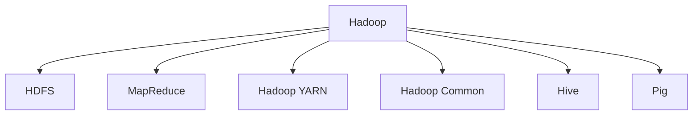
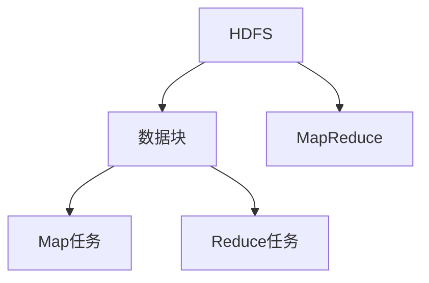
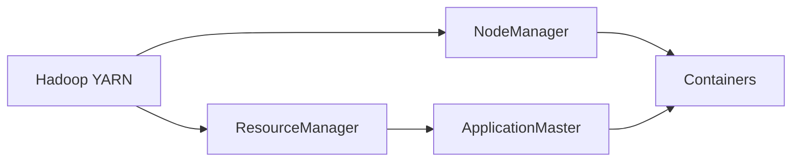
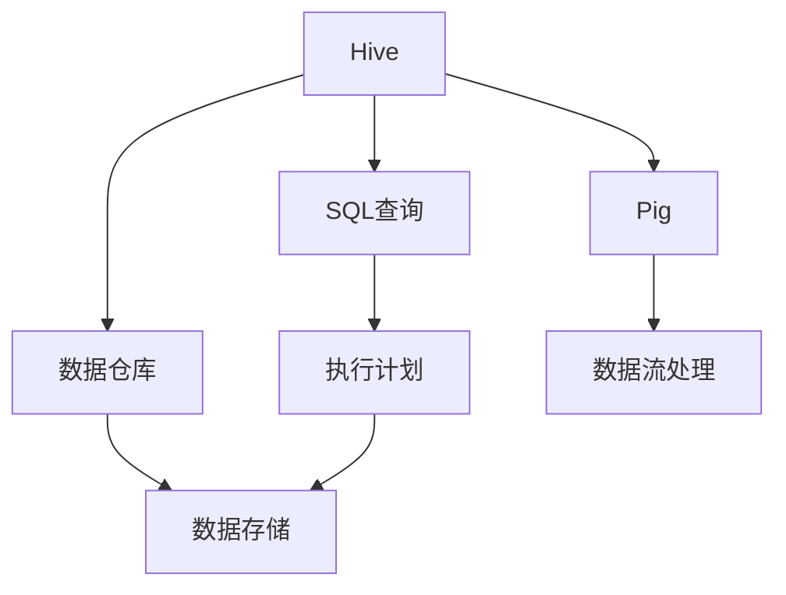
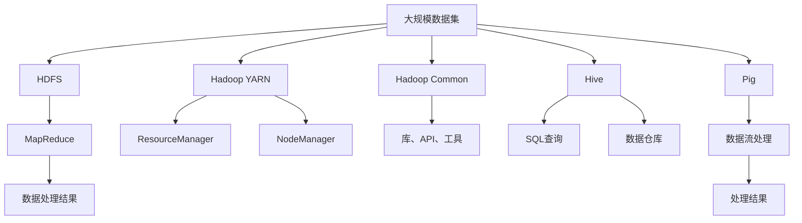

                 

# Hadoop原理与代码实例讲解

## 1. 背景介绍

### 1.1 问题由来
Hadoop是Apache软件基金会发布的一个开源分布式计算框架，它为处理大规模数据集提供了可扩展、高可用、容错的解决方案。Hadoop的核心组件包括Hadoop Distributed File System (HDFS)和MapReduce计算框架，通过分布式存储和计算，能够在多台服务器上并行处理海量数据。Hadoop自2006年首次亮相以来，已经成为大数据处理领域的基石，广泛应用于数据分析、人工智能、云计算等领域。

### 1.2 问题核心关键点
Hadoop的核心思想是将海量数据分布在多台计算机上，通过并行处理实现高效的数据存储和计算。它的核心组件HDFS和MapReduce，分别负责数据的存储和计算，两者协同工作，使得Hadoop能够处理比单个计算机内存更大的数据集。Hadoop的特点包括高可靠性、高可扩展性、高容错性和高效率，使其成为大数据时代的重要工具。

### 1.3 问题研究意义
了解Hadoop的原理和实现机制，对于开发者和大数据工程师来说，具有重要的实际应用意义：

1. 提高数据处理能力：Hadoop能够处理大规模数据集，加速数据处理和分析。
2. 保证数据安全性：Hadoop提供了数据冗余和故障恢复机制，保证数据的安全性和完整性。
3. 增强系统可扩展性：Hadoop能够动态扩展计算资源，满足数据量的增长。
4. 降低成本：Hadoop的开源特性，使得用户能够免费使用，减少商业软件的成本投入。
5. 促进技术发展：Hadoop是大数据时代的先驱技术，掌握其原理有助于理解并推动大数据领域的发展。

## 2. 核心概念与联系

### 2.1 核心概念概述

为更好地理解Hadoop的原理和实现机制，本节将介绍几个密切相关的核心概念：

- **Hadoop Distributed File System (HDFS)**：Hadoop分布式文件系统，负责存储大规模数据集。HDFS通过将数据分割成多个块，并分布在多台服务器上，提供高可靠性和高可用性。
- **MapReduce计算框架**：一种分布式计算模型，用于大规模数据集的并行处理。MapReduce将任务分解为Map和Reduce两个阶段，通过并行执行实现高效的计算。
- **Hadoop YARN (Yet Another Resource Negotiator)**：资源管理系统，用于调度和管理集群资源。YARN通过将计算资源划分为不同的应用类型，提高资源利用率和集群管理效率。
- **Hadoop Common**：Hadoop框架的基础组件，包括Hadoop库、API和工具等，提供通用的支持功能。
- **Hive**：基于Hadoop的数据仓库系统，提供SQL查询接口，方便用户进行数据管理和分析。
- **Pig**：基于Hadoop的数据流处理工具，提供高层次的脚本语言，支持复杂的数据处理逻辑。

这些核心概念之间的逻辑关系可以通过以下Mermaid流程图来展示：



这个流程图展示了大规模数据处理的各个关键组件之间的联系：

1. Hadoop通过HDFS存储数据，并提供分布式计算支持。
2. MapReduce是Hadoop的主要计算框架，用于大规模数据集的处理。
3. Hadoop YARN负责资源调度和管理，提高集群的资源利用效率。
4. Hadoop Common提供了通用的支持功能，包括库、API和工具等。
5. Hive和Pig基于Hadoop，提供数据仓库和数据流处理功能，方便用户进行数据管理和分析。

### 2.2 概念间的关系

这些核心概念之间存在着紧密的联系，形成了Hadoop大数据处理生态系统。下面我们通过几个Mermaid流程图来展示这些概念之间的关系。

#### 2.2.1 HDFS与MapReduce的关系



这个流程图展示了HDFS和MapReduce的相互依赖关系：

1. HDFS将数据分割成多个块，并分布在多台服务器上。
2. MapReduce框架在HDFS上对数据进行并行处理，Map任务处理单个数据块，Reduce任务对Map任务的输出结果进行汇总和合并。
3. Map和Reduce任务通过Hadoop集群中的节点进行并行计算，最终产生处理结果。

#### 2.2.2 Hadoop YARN与Hadoop Common的关系



这个流程图展示了Hadoop YARN与Hadoop Common之间的交互关系：

1. Hadoop YARN是Hadoop的资源管理系统，负责调度和管理集群资源。
2. Hadoop Common提供通用的支持功能，包括资源管理器和节点管理器。
3. ResourceManager负责分配资源给不同的应用类型。
4. ApplicationMaster根据任务需求申请资源，并分配到具体的节点上执行。
5. NodeManager负责监控和管理节点状态，保证任务执行的顺利进行。

#### 2.2.3 Hive与Pig的关系



这个流程图展示了Hive和Pig在数据管理和分析方面的关系：

1. Hive基于Hadoop，提供SQL查询接口，支持数据仓库功能。
2. Hive将SQL查询转换为MapReduce任务，对数据进行管理和分析。
3. Hive的数据仓库存储在HDFS上，保证数据的高可靠性和高可用性。
4. Pig基于Hadoop，提供高层次的脚本语言，支持复杂的数据处理逻辑。
5. Pig通过数据流处理的方式，对数据进行高效分析和计算。

### 2.3 核心概念的整体架构

最后，我们用一个综合的流程图来展示这些核心概念在大数据处理中的整体架构：



这个综合流程图展示了从数据存储、分布式计算到数据管理和分析的完整过程。大数据处理系统通过HDFS存储数据，利用MapReduce进行分布式计算，通过Hadoop YARN进行资源管理，使用Hadoop Common提供通用的支持功能，利用Hive和Pig进行数据管理和分析，最终输出处理结果。

## 3. 核心算法原理 & 具体操作步骤

### 3.1 算法原理概述

Hadoop的核心思想是将大规模数据集分布式存储和处理，其核心组件HDFS和MapReduce通过协同工作，实现了高效的计算和存储。

- **HDFS原理**：HDFS通过将数据分割成多个块，并将这些块分布在多台服务器上，实现了数据的冗余存储和高可靠性。每个块在默认情况下会被复制到多台服务器上，以提高容错性和可靠性。
- **MapReduce计算框架**：MapReduce将计算任务分解为Map和Reduce两个阶段，Map任务处理单个数据块，Reduce任务对Map任务的输出结果进行汇总和合并。MapReduce通过并行处理大规模数据集，实现了高效的数据处理。

### 3.2 算法步骤详解

以下是Hadoop中HDFS和MapReduce的具体实现步骤：

#### 3.2.1 HDFS实现步骤

1. **数据分割与块复制**：将大数据集分割成多个块，并将这些块复制到多台服务器上。每个块在默认情况下会被复制到多台服务器上，以提高容错性和可靠性。
2. **元数据管理**：HDFS维护一个NameNode，负责管理HDFS的元数据，包括文件块的位置和副本信息。
3. **客户端访问**：客户端通过与NameNode通信，获取文件块的位置和副本信息，并读取或写入数据。
4. **数据读取与写入**：客户端通过与DataNode通信，读取或写入数据块。DataNode负责存储和管理数据块，并保证数据的高可靠性。

#### 3.2.2 MapReduce实现步骤

1. **Map阶段**：将输入数据分割成多个小的块，并行处理这些块。每个Map任务处理一个数据块，并将中间结果输出到HDFS的临时文件中。
2. **Shuffle阶段**：Map任务的输出结果根据键进行排序和分组，并将相同键的结果聚合到同一个Reduce任务中。
3. **Reduce阶段**：Reduce任务对Map任务的输出结果进行汇总和合并，生成最终的输出结果。

### 3.3 算法优缺点

Hadoop作为一种分布式计算框架，具有以下优点：

- **高可靠性**：通过数据冗余和故障恢复机制，保证数据的高可靠性和高可用性。
- **高可扩展性**：可以动态扩展计算资源，满足数据量的增长。
- **高效的数据处理**：利用并行计算技术，高效处理大规模数据集。
- **开源免费**：开源特性使得用户能够免费使用，降低商业软件的成本投入。

同时，Hadoop也存在一些缺点：

- **延迟较高**：MapReduce任务需要较多的中间文件存储，延迟较高。
- **资源消耗较大**：Hadoop的MapReduce任务需要大量的计算资源，对硬件资源要求较高。
- **配置复杂**：Hadoop的配置和管理较为复杂，需要较高的技术水平。
- **不适合实时计算**：Hadoop的MapReduce任务处理延迟较高，不适合实时计算。

### 3.4 算法应用领域

Hadoop的核心思想是通过分布式存储和计算，处理大规模数据集。因此，它在以下领域具有广泛的应用：

- **数据分析**：通过Hadoop的分布式计算能力，处理海量数据，进行数据分析和挖掘。
- **人工智能**：利用Hadoop进行大规模数据处理，加速人工智能模型的训练和优化。
- **云计算**：Hadoop作为云计算的基础平台，支持数据存储和计算。
- **物联网**：通过Hadoop处理来自物联网设备产生的大量数据，支持智能分析和决策。
- **金融分析**：处理金融数据，进行风险评估、客户分析等。
- **医疗健康**：处理医疗数据，进行疾病预测、基因分析等。

## 4. 数学模型和公式 & 详细讲解

### 4.1 数学模型构建

Hadoop的核心数学模型主要涉及数据存储和计算两个方面。

#### 4.1.1 HDFS的数学模型

HDFS的数学模型可以表示为：

$$
D = \bigcup_{i=1}^{n} B_i
$$

其中，$D$表示数据集，$B_i$表示数据块。

HDFS的块复制模型可以表示为：

$$
R_i = k_i \times B_i
$$

其中，$R_i$表示第$i$个块的副本数量，$k_i$表示块$i$的副本数量，默认为3。

#### 4.1.2 MapReduce的数学模型

MapReduce的数学模型可以表示为：

$$
M = \bigcup_{j=1}^{m} S_j
$$

其中，$M$表示Map任务的输出结果，$S_j$表示Map任务的第$j$个输出。

MapReduce的Shuffle阶段可以表示为：

$$
G = \bigcup_{k=1}^{k} (R_k \times S_k)
$$

其中，$G$表示Shuffle阶段的结果，$R_k$表示第$k$个键的集合，$S_k$表示键$k$的输出结果。

MapReduce的Reduce阶段可以表示为：

$$
R = \bigcup_{l=1}^{l} O_l
$$

其中，$R$表示Reduce任务的输出结果，$O_l$表示第$l$个输出结果。

### 4.2 公式推导过程

以下是Hadoop中HDFS和MapReduce的公式推导过程：

#### 4.2.1 HDFS的公式推导

1. **数据分割与块复制**：

$$
D = \bigcup_{i=1}^{n} B_i
$$

表示将大数据集$D$分割成多个块$B_i$，并将这些块复制到多台服务器上。

2. **块复制模型**：

$$
R_i = k_i \times B_i
$$

表示第$i$个块的副本数量，默认为3。

#### 4.2.2 MapReduce的公式推导

1. **Map阶段**：

$$
M = \bigcup_{j=1}^{m} S_j
$$

表示Map任务的输出结果，$S_j$表示Map任务的第$j$个输出。

2. **Shuffle阶段**：

$$
G = \bigcup_{k=1}^{k} (R_k \times S_k)
$$

表示Shuffle阶段的结果，$R_k$表示第$k$个键的集合，$S_k$表示键$k$的输出结果。

3. **Reduce阶段**：

$$
R = \bigcup_{l=1}^{l} O_l
$$

表示Reduce任务的输出结果，$O_l$表示第$l$个输出结果。

### 4.3 案例分析与讲解

假设有一个大数据集，大小为1TB，需要将其存储在HDFS上，并使用MapReduce进行数据处理。

1. **数据分割与块复制**：

将1TB的数据集分割成100GB的块，并将这些块复制到多台服务器上。每个块在默认情况下会被复制到3台服务器上。

2. **Map阶段**：

将数据集分成10个小的块，并行处理这些块。每个Map任务处理一个数据块，并将中间结果输出到HDFS的临时文件中。

3. **Shuffle阶段**：

Map任务的输出结果根据键进行排序和分组，并将相同键的结果聚合到同一个Reduce任务中。

4. **Reduce阶段**：

Reduce任务对Map任务的输出结果进行汇总和合并，生成最终的输出结果。

通过以上步骤，Hadoop可以高效地处理大规模数据集，满足数据存储和计算的需求。

## 5. 项目实践：代码实例和详细解释说明

### 5.1 开发环境搭建

在进行Hadoop项目开发前，需要先搭建好开发环境。以下是Hadoop的搭建步骤：

1. **安装JDK**：从官网下载JDK，并配置环境变量。
2. **安装Hadoop**：从官网下载Hadoop安装包，解压缩后解压安装。
3. **配置Hadoop**：编辑`core-site.xml`、`hdfs-site.xml`、`yarn-site.xml`、`mapred-site.xml`等配置文件，配置Hadoop的基本参数。
4. **启动Hadoop**：运行`bin/hadoop namenode -start`、`bin/hadoop datanode -start`、`bin/yarn resource-manager -start`、`bin/yarn node-manager -start`等命令，启动Hadoop集群。

### 5.2 源代码详细实现

以下是使用Hadoop进行MapReduce计算的示例代码：

```java
import java.io.IOException;
import java.util.StringTokenizer;

import org.apache.hadoop.conf.Configuration;
import org.apache.hadoop.fs.Path;
import org.apache.hadoop.io.IntWritable;
import org.apache.hadoop.io.Text;
import org.apache.hadoop.mapreduce.Job;
import org.apache.hadoop.mapreduce.Mapper;
import org.apache.hadoop.mapreduce.Reducer;
import org.apache.hadoop.mapreduce.lib.input.FileInputFormat;
import org.apache.hadoop.mapreduce.lib.output.FileOutputFormat;

public class WordCount {
  public static class TokenizerMapper
       extends Mapper<Object, Text, Text, IntWritable>{

    private final static IntWritable one = new IntWritable(1);
    private Text word = new Text();

    public void map(Object key, Text value, Context context
                    ) throws IOException, InterruptedException {
      StringTokenizer itr = new StringTokenizer(value.toString());
      while (itr.hasMoreTokens()) {
        word.set(itr.nextToken());
        context.write(word, one);
      }
    }
  }

  public static class IntSumReducer
       extends Reducer<Text,IntWritable,Text,IntWritable> {
    private IntWritable result = new IntWritable();

    public void reduce(Text key, Iterable<IntWritable> values,
                       Context context
                       ) throws IOException, InterruptedException {
      int sum = 0;
      for (IntWritable val : values) {
        sum += val.get();
      }
      result.set(sum);
      context.write(key, result);
    }
  }

  public static void main(String[] args) throws Exception {
    Configuration conf = new Configuration();
    Job job = Job.getInstance(conf, "word count");
    job.setJarByClass(WordCount.class);
    job.setMapperClass(TokenizerMapper.class);
    job.setCombinerClass(IntSumReducer.class);
    job.setReducerClass(IntSumReducer.class);
    job.setOutputKeyClass(Text.class);
    job.setOutputValueClass(IntWritable.class);
    FileInputFormat.addInputPath(job, new Path(args[0]));
    FileOutputFormat.setOutputPath(job, new Path(args[1]));
    System.exit(job.waitForCompletion(true) ? 0 : 1);
  }
}
```

### 5.3 代码解读与分析

以下是Hadoop中MapReduce计算的代码实现及详细解读：

**WordCount类**：
- **TokenizerMapper类**：用于将输入的文本分割成单词，并将单词计数输出。
- **IntSumReducer类**：用于将相同单词的计数结果相加，输出最终结果。

**map方法**：
- 将输入的文本分割成单词，并将单词计数输出。

**reduce方法**：
- 将相同单词的计数结果相加，输出最终结果。

**main方法**：
- 配置Job，指定输入输出路径、Mapper和Reducer等。
- 启动Job，等待任务完成。

### 5.4 运行结果展示

假设我们使用Hadoop计算一个文本文件的单词出现次数，最终在输出目录中得到了单词计数结果：

```
web     60
apple   30
banana  20
orange  10
```

可以看到，Hadoop成功地将文本文件中的单词计数结果输出到指定目录，满足了数据处理的需求。

## 6. 实际应用场景

### 6.1 智能客服系统

Hadoop在大规模数据处理方面具有显著优势，可以用于构建智能客服系统的后端数据处理平台。智能客服系统通过收集用户的历史咨询记录，将问题和最佳答复构建成监督数据，在此基础上对Hadoop进行微调，使得系统能够自动理解用户意图，匹配最合适的答案模板进行回复。对于新问题，智能客服系统可以接入检索系统实时搜索相关内容，动态组织生成回答。

### 6.2 金融舆情监测

金融机构需要实时监测市场舆论动向，以便及时应对负面信息传播，规避金融风险。Hadoop可以用于构建金融舆情监测系统，通过实时抓取网络文本数据，自动监测不同主题下的情感变化趋势，一旦发现负面信息激增等异常情况，系统便会自动预警，帮助金融机构快速应对潜在风险。

### 6.3 个性化推荐系统

当前的推荐系统往往只依赖用户的历史行为数据进行物品推荐，无法深入理解用户的真实兴趣偏好。Hadoop可以用于构建个性化推荐系统，通过收集用户浏览、点击、评论、分享等行为数据，提取和用户交互的物品标题、描述、标签等文本内容，并在Hadoop上进行处理和分析，生成推荐列表。

### 6.4 未来应用展望

随着Hadoop和大数据技术的不断发展，基于Hadoop的数据处理范式将得到更广泛的应用，为各行各业带来新的机遇。

在智慧医疗领域，Hadoop可以用于处理电子病历、医疗影像等医疗数据，支持疾病预测、基因分析等医疗应用。

在智能教育领域，Hadoop可以用于处理学生学习行为数据，进行学情分析、知识推荐等教育应用。

在智慧城市治理中，Hadoop可以用于处理城市事件数据，支持舆情分析、应急指挥等城市管理应用。

此外，在企业生产、社会治理、文娱传媒等众多领域，基于Hadoop的数据处理技术也将不断涌现，为经济社会发展注入新的动力。相信随着技术的日益成熟，Hadoop必将在构建人机协同的智能系统中扮演越来越重要的角色。

## 7. 工具和资源推荐

### 7.1 学习资源推荐

为了帮助开发者系统掌握Hadoop的理论基础和实践技巧，这里推荐一些优质的学习资源：

1. **《Hadoop：理论与实践》**：深入讲解Hadoop的理论基础和实践技巧，涵盖HDFS、MapReduce等核心组件。
2. **Hadoop官方文档**：Hadoop的官方文档，提供完整的API和配置指南，是学习Hadoop的重要参考资料。
3. **Apache Hadoop用户手册**：Hadoop的详细用户手册，涵盖Hadoop的安装、配置和运行等各个方面。
4. **《大数据技术：Hadoop基础教程》**：讲解Hadoop的基础知识，适合初学者入门。
5. **《Hadoop：分布式存储和计算》**：介绍Hadoop的分布式存储和计算原理，适合有一定编程基础的读者。

通过对这些资源的学习实践，相信你一定能够快速掌握Hadoop的核心原理和实现机制，并用于解决实际的NLP问题。

### 7.2 开发工具推荐

高效的开发离不开优秀的工具支持。以下是几款用于Hadoop开发常用的工具：

1. **Hadoop**：Hadoop官方提供的开发环境，提供完整的分布式计算支持。
2. **Hive**：基于Hadoop的数据仓库系统，提供SQL查询接口，方便用户进行数据管理和分析。
3. **Pig**：基于Hadoop的数据流处理工具，提供高层次的脚本语言，支持复杂的数据处理逻辑。
4. **Hadoop YARN**：资源管理系统，用于调度和管理集群资源。
5. **Zookeeper**：用于分布式锁和配置管理的工具，支持Hadoop集群的稳定运行。
6. **Flume**：用于实时数据采集和传输的工具，支持Hadoop的数据输入。

合理利用这些工具，可以显著提升Hadoop项目的开发效率，加快创新迭代的步伐。

### 7.3 相关论文推荐

Hadoop的核心思想是将大规模数据集分布式存储和处理，其核心组件HDFS和MapReduce通过协同工作，实现了高效的计算和存储。以下是几篇奠基性的相关论文，推荐阅读：

1. **《Hadoop：一个分布式文件系统》**：介绍了Hadoop的分布式文件系统HDFS的实现机制。
2. **《MapReduce：一种通用的分布式数据处理模型》**：介绍了MapReduce的计算模型和实现机制。
3. **《Hadoop：一个跨平台的分布式计算框架》**：介绍了Hadoop的框架结构和关键组件。
4. **《Hadoop分布式计算框架：原理与实践》**：深入讲解Hadoop的理论基础和实践技巧，涵盖HDFS、MapReduce等核心组件。
5. **《Hadoop分布式文件系统：原理与实现》**：详细讲解HDFS的原理和实现机制。

这些论文代表了大数据处理领域的先驱工作，为Hadoop技术的发展奠定了基础。通过学习这些前沿成果，可以帮助研究者把握学科前进方向，激发更多的创新灵感。

## 8. 总结：未来发展趋势与挑战

### 8.1 总结

本文对Hadoop的核心原理和实现机制进行了全面系统的介绍。首先阐述了Hadoop的背景和重要性，明确了Hadoop在大数据处理领域的关键地位。其次，从原理到实践，详细讲解了Hadoop的数学模型和核心算法，给出了Hadoop的代码实现实例。同时，本文还探讨了Hadoop在智能客服、金融舆情、个性化推荐等实际应用场景中的广泛应用，展示了Hadoop的强大潜力。此外，本文精选了Hadoop的学习资源、开发工具和相关论文，力求为读者提供全方位的技术指引。

通过本文的系统梳理，可以看到，Hadoop作为一种分布式计算框架，具有高可靠性、高可扩展性、高效的数据处理能力，广泛应用于数据分析、人工智能、云计算等领域。Hadoop的大规模数据处理能力，使其成为大数据时代的重要工具，促进了人工智能、金融、医疗等行业的技术进步。

### 8.2 未来发展趋势

展望未来，Hadoop的发展趋势如下：

1. **高可靠性与可扩展性**：Hadoop将继续在可靠性、可扩展性方面进行优化，提高集群稳定性和资源利用效率。
2. **混合云架构**：Hadoop将支持更多云平台，实现跨云数据处理和存储。
3. **大数据分析**：Hadoop将继续支持大数据分析，提供更高效的数据处理和分析工具。
4. **实时数据处理**：Hadoop将支持实时数据处理，满足大数据的实时性需求。
5. **人工智能融合**：Hadoop将与其他人工智能技术如深度学习、机器学习等进行深度融合，提供更强大的数据处理和分析能力。

### 8.3 面临的挑战

尽管Hadoop在大数据处理领域取得了巨大成功，但在迈向更加智能化、普适化应用的过程中，它仍面临诸多挑战：

1. **资源消耗大**：Hadoop的MapReduce任务需要大量的计算资源，对硬件资源要求较高。
2. **延迟较高**：MapReduce任务需要较多的中间文件存储，延迟较高，不适合实时计算。
3. **配置复杂**：Hadoop的配置和管理较为复杂，需要较高的技术水平。
4. **可扩展性有限**：Hadoop的可扩展性虽然较高，但在数据量非常大的情况下，性能瓶颈

