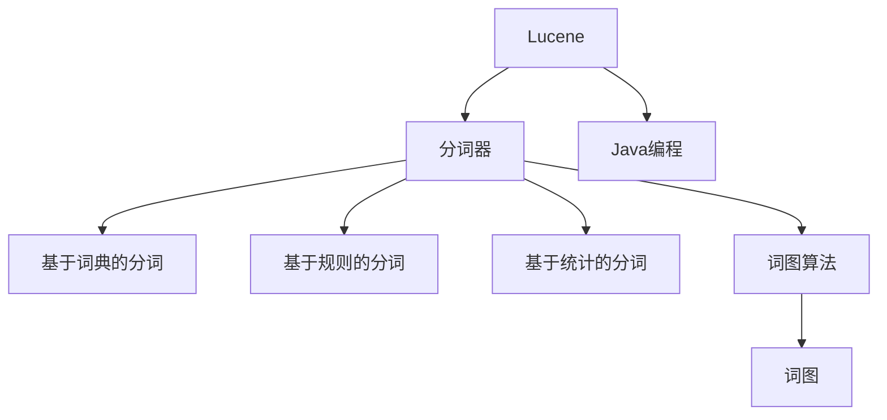
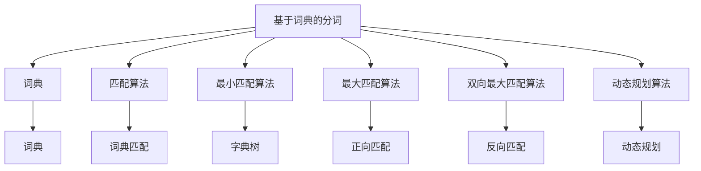
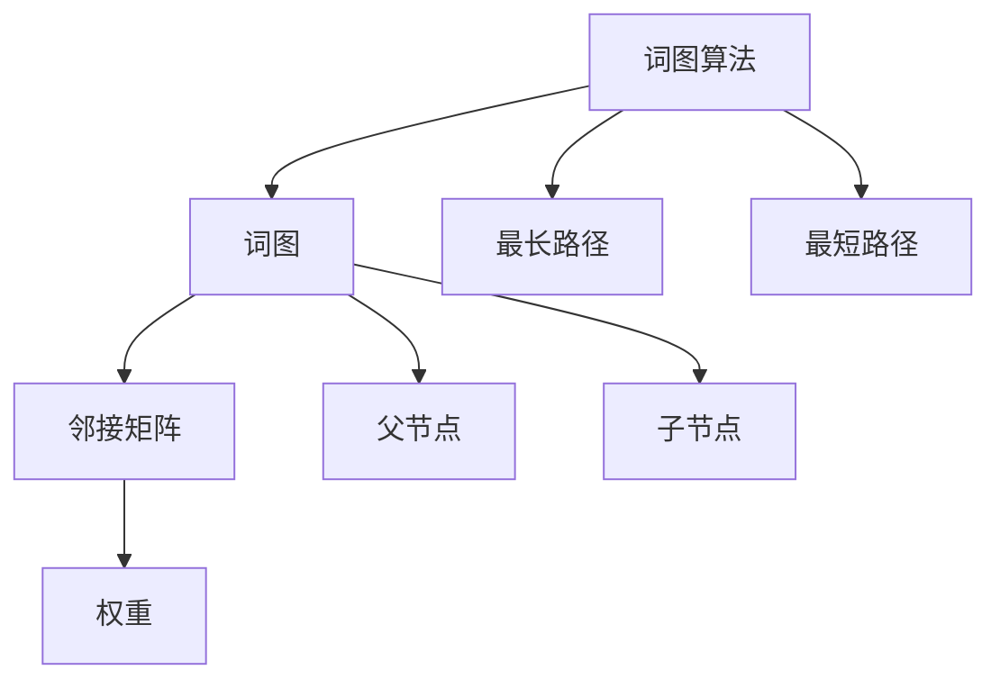
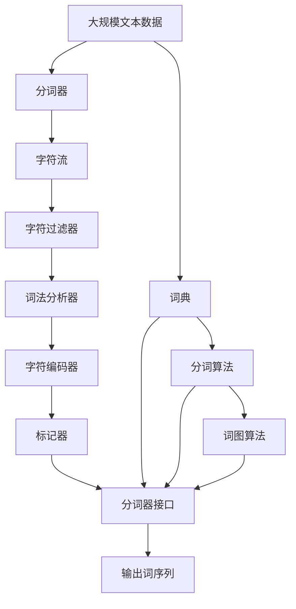

                 

# Lucene分词原理与代码实例讲解

> 关键词： Lucene, 分词器, 分词算法, Tokenizer, 中文分词, 词图算法, 实现示例, JVM编程

## 1. 背景介绍

### 1.1 问题由来
在自然语言处理（NLP）领域，分词是最基础且核心的任务之一。分词是将连续的文本序列切分成一个个独立的词，是后续文本分析、信息检索、文本挖掘等任务的前提。对于英文等字母语言而言，由于单词之间通常有明显的分隔符（如空格、标点符号），分词相对容易实现。然而，对于中文等没有明显分隔符的语言，分词变得更加复杂。

中文分词的难度主要在于以下几点：
- 中文文本中没有像英文那样的空格，而且汉字之间没有固定的分隔符。
- 汉字组合形式复杂，一个汉字组合可能代表多个词语或一个词的一部分。
- 汉语中的歧义词（多音字、同形字等）使得分词任务更加困难。

分词技术的优劣直接影响到后续文本分析的质量，因此研究中文分词算法具有重要的实际意义。

### 1.2 问题核心关键点
中文分词的核心关键点包括：
- 分词单元的确定。中文分词需要确定一个词的边界，通常采用基于词典的统计分词方法或基于规则的切分方法。
- 歧义词的解决。中文分词中存在大量歧义词，需要采用规则、上下文信息或机器学习方法来解决。
- 动态更新词典。分词模型需要定期更新词汇表，以应对不断变化的语言环境。

为了应对这些挑战，Lucene库提供了丰富的分词器实现，支持多种分词策略和规则，能够满足不同应用场景的需求。

### 1.3 问题研究意义
研究Lucene的分词技术，对于构建高效、准确的中文NLP系统具有重要意义：
- 提升文本处理的准确性。分词作为NLP的基础，其准确性直接影响后续处理任务的性能。
- 提高搜索引擎的召回率和精确度。分词是搜索引擎的核心组件，能够影响检索结果的相关性。
- 促进中文信息的有效处理。分词是中文信息检索、文本挖掘等任务的前提，能够有效提升信息处理的效率。
- 推动中文信息技术的产业化进程。随着中文信息技术的普及，分词技术的需求日益增长，研究其原理和实现方法，有助于加速技术落地应用。

## 2. 核心概念与联系

### 2.1 核心概念概述

为了更好地理解Lucene分词器的工作原理，本节将介绍几个密切相关的核心概念：

- **Lucene**：一个基于Java的开源搜索引擎库，提供了强大的文本索引、搜索和分析功能。Lucene的分词器是其核心组件之一，能够实现高效的中文分词。
- **分词器(Tokenizer)**：将连续的文本序列切分成一个个独立的词，是中文分词的基础。
- **分词算法**：指实现分词器功能的具体算法，包括基于词典的分词、基于规则的分词、基于统计的分词等。
- **词图算法**：一种常见的基于词典的分词算法，通过构建词图来描述汉字组合的可能性，并寻找最大概率的切分方案。
- **JVM编程**：Lucene的实现基于Java虚拟机（JVM），开发者需要熟悉Java语言和相关API。

这些核心概念之间的逻辑关系可以通过以下Mermaid流程图来展示：



这个流程图展示了大语言模型的核心概念及其之间的关系：

1. Lucene作为一个搜索引擎库，提供了丰富的文本处理组件。
2. 分词器是Lucene的组成部分，负责实现分词功能。
3. 分词算法包括基于词典、规则和统计的分词，是分词器的核心技术。
4. 词图算法是基于词典的分词算法之一，通过构建词图来确定分词边界。
5. 分词器的实现基于Java语言，开发者需要掌握相关API。

### 2.2 概念间的关系

这些核心概念之间存在着紧密的联系，形成了Lucene分词器的完整生态系统。下面我们通过几个Mermaid流程图来展示这些概念之间的关系。

#### 2.2.1 Lucene的分词器架构


这个流程图展示了Lucene分词器的基本架构，包括字符流、字符过滤器、词法分析器、字符编码器和标记器等组件。

#### 2.2.2 分词算法的选择



这个流程图展示了基于词典的分词算法，包括词典、匹配算法、最小匹配、最大匹配、双向最大匹配和动态规划等。

#### 2.2.3 词图算法的过程



这个流程图展示了词图算法的核心过程，包括词图、邻接矩阵、父节点、子节点、权重、最长路径和最短路径等。

### 2.3 核心概念的整体架构

最后，我们用一个综合的流程图来展示这些核心概念在大语言模型分词过程中的整体架构：



这个综合流程图展示了从预处理到分词器输出的完整过程。大规模文本数据首先经过分词器的预处理，包括字符流、字符过滤器、词法分析器和字符编码器等组件，然后使用分词算法和词图算法进行分词，最终输出词序列。分词器需要定期更新词典，以应对语言环境的变化。

## 3. 核心算法原理 & 具体操作步骤
### 3.1 算法原理概述

Lucene的分词器主要采用基于词典的分词算法，通过构建词典来描述词与词之间的边界。基于词典的分词算法步骤如下：

1. **词典构建**：收集并整理大量的文本数据，构建词汇表。
2. **词法分析**：将文本序列切分成一个个词汇单元，使用词法分析器进行解析。
3. **分词边界确定**：根据词典中的词语信息，确定文本序列中每个词汇单元的边界。
4. **歧义词解决**：对于词典中没有出现的词汇组合，使用上下文信息和语言模型进行推断。

基于词典的分词算法具有以下优点：
- 简单高效。基于词典的分词算法不需要复杂的算法模型，易于实现和维护。
- 准确性较高。对于已知词汇，分词效果良好。
- 可扩展性强。词典可以动态更新，适应语言环境的变化。

但同时也有以下局限：
- 词典构建耗时较长。需要收集大量文本数据，构建词汇表，工作量大。
- 无法处理新词。对于词典中没有出现的词汇，分词效果较差。
- 词义歧义。中文中存在大量歧义词，分词器难以准确处理。

### 3.2 算法步骤详解

Lucene的分词器具体实现步骤如下：

**Step 1: 词典构建**
- 收集并整理大规模的中文文本数据，构建词汇表。可以使用爬虫工具自动抓取网页、微博、新闻等数据，也可以通过手动收集。
- 使用Python等工具对文本进行预处理，去除噪声、分词符号等，生成分词标注文件。
- 使用分词工具对分词标注文件进行格式转换，生成词典文件。

**Step 2: 词法分析**
- 将待分词的文本序列作为输入，依次进入字符流组件。
- 字符流组件将文本序列转换成一个个字符，传递给字符过滤器。
- 字符过滤器对字符序列进行过滤和处理，去除噪声、标点符号等，生成干净字符序列。
- 干净字符序列传递给词法分析器，进行词法分析。

**Step 3: 分词边界确定**
- 词法分析器将字符序列切分成一个个词汇单元，传递给字符编码器。
- 字符编码器将词汇单元转换成词编码，传递给标记器。
- 标记器根据词典中的词语信息，确定每个词汇单元的边界，生成标记序列。
- 分词器接口根据标记序列生成词序列，输出分词结果。

**Step 4: 歧义词解决**
- 对于词典中没有出现的词汇组合，分词器使用上下文信息和语言模型进行推断。
- 常用的语言模型包括n-gram模型、最大熵模型等，通过计算上下文词语的概率分布，推断词汇边界。

### 3.3 算法优缺点

基于词典的分词算法具有以下优点：
- 准确性较高。对于已知词汇，分词效果良好。
- 可扩展性强。词典可以动态更新，适应语言环境的变化。
- 实现简单。算法模型简单，易于实现和维护。

但同时也有以下局限：
- 词典构建耗时较长。需要收集大量文本数据，构建词汇表，工作量大。
- 无法处理新词。对于词典中没有出现的词汇，分词效果较差。
- 词义歧义。中文中存在大量歧义词，分词器难以准确处理。

### 3.4 算法应用领域

基于词典的分词算法已经在多个领域得到了广泛应用，例如：
- 搜索引擎：作为搜索引擎的文本处理核心组件，分词器能够提升检索的精确度和召回率。
- 自然语言处理：分词是中文信息处理的基础，用于文本分析、信息检索、文本挖掘等任务。
- 机器翻译：分词是机器翻译的前处理步骤，能够影响翻译的准确性和流畅度。
- 文本分类：分词是文本分类的基础，能够提升分类结果的准确性。

除了上述这些经典应用外，基于词典的分词算法还被创新性地应用于文本纠错、语音识别等新兴领域，推动了NLP技术的发展。

## 4. 数学模型和公式 & 详细讲解  
### 4.1 数学模型构建

Lucene的分词算法主要基于词典，以下是数学模型的构建过程。

假设词汇表为 $V=\{v_1, v_2, ..., v_n\}$，每个词汇 $v_i$ 对应一个词频 $f_i$。对于待分词的文本序列 $T$，分词器需要找到最大概率的词汇组合。

定义 $P(T | V, f)$ 为文本 $T$ 在词汇表 $V$ 和词频 $f$ 的条件下出现的概率，即：

$$
P(T | V, f) = \prod_{i=1}^n f_i^{\delta_i} \cdot P(T | V_i)
$$

其中 $V_i=\{v_1, v_2, ..., v_i\}$，$\delta_i$ 表示文本序列中第 $i$ 个词汇在 $V_i$ 中的出现次数，$P(T | V_i)$ 表示在词汇 $V_i$ 的条件下，文本 $T$ 出现的概率。

分词器的目标是找到最大概率的词汇组合，即：

$$
\max_{V_i} P(T | V_i)
$$

为了优化计算效率，Lucene使用词图算法来求解最大概率的词汇组合。

### 4.2 公式推导过程

以下是词图算法的具体推导过程：

1. **构建词图**
   - 对于词汇表 $V=\{v_1, v_2, ..., v_n\}$，构建词图 $G(V, E)$，其中 $V$ 为节点集合，$E$ 为边集合。每个节点 $v_i$ 对应一个词汇，每条边 $e_{u,v}$ 表示词汇 $u$ 和词汇 $v$ 可以构成一个词汇组合。
   - 对于每个节点 $v_i$，计算其初始概率 $P(v_i)$，作为分词的起点。

2. **计算最长路径**
   - 从初始节点 $v_i$ 开始，使用动态规划算法计算最长路径 $L(v_i)$，即从节点 $v_i$ 到所有后继节点 $v_j$ 的最长路径长度。
   - 设当前节点为 $v_i$，后继节点为 $v_j$，则 $L(v_j) = \max_{e_{u,v} \in E(v_i)} L(u) + 1$。

3. **确定词汇边界**
   - 对于每个节点 $v_i$，计算其最终概率 $P(v_i)$，即 $P(v_i) = P(v_i) \cdot \prod_{e_{u,v} \in E(v_i)} L(u)$。
   - 对于每个节点 $v_i$，计算其词汇边界 $boundary(v_i)$，即 $boundary(v_i) = \max_{j<i} v_j$。

4. **输出分词结果**
   - 对于文本序列 $T$，按照节点出现的顺序，将每个节点的边界作为词汇边界，输出分词结果。

### 4.3 案例分析与讲解

下面以一个简单的中文文本序列为例，演示Lucene分词器的分词过程：

假设文本序列为：“我爱北京天安门”，分词器首先将文本序列切分成一个个词汇单元，传递给字符编码器，生成词编码序列。标记器根据词典信息，确定每个词汇单元的边界，生成标记序列。最后，分词器接口根据标记序列生成词序列，输出分词结果。

分词过程如下：

1. **词法分析**：将文本序列切分成词汇单元：我、爱、北京、天安门。
2. **分词边界确定**：根据词典信息，确定每个词汇单元的边界：我、爱、北京、天安门。
3. **分词输出**：将每个词汇单元作为分词结果输出：我、爱、北京、天安门。

## 5. 项目实践：代码实例和详细解释说明
### 5.1 开发环境搭建

在进行Lucene分词器开发前，我们需要准备好开发环境。以下是使用Java进行Lucene开发的环境配置流程：

1. 安装JDK：从官网下载并安装JDK，用于编译和运行Java程序。
2. 安装Lucene：从官网下载并安装Lucene库，将lib目录添加到classpath中。
3. 安装Eclipse：安装Eclipse IDE，用于编写和调试Java程序。

完成上述步骤后，即可在Eclipse中开始Lucene分词器的开发。

### 5.2 源代码详细实现

以下是一个简单的基于Lucene的分词器实现，用于分词中文文本。

```java
import org.apache.lucene.analysis.Analyzer;
import org.apache.lucene.analysis.TokenStream;
import org.apache.lucene.analysis.core.StandardAnalyzer;
import org.apache.lucene.analysis.tokenattributes.CharTermAttribute;
import java.io.IOException;
import java.io.StringReader;
import java.util.Arrays;
import java.util.List;

public class CustomAnalyzer extends Analyzer {
    @Override
    protected TokenStreamComponents createComponents(String fieldName) {
        StringReader reader = new StringReader("我爱北京天安门");
        TokenStream stream = new StandardAnalyzer().tokenStream("token", reader);
        return new TokenStreamComponents(stream);
    }

    public static void main(String[] args) throws IOException {
        CustomAnalyzer analyzer = new CustomAnalyzer();
        TokenStream stream = analyzer.tokenStream("token", new StringReader("我爱北京天安门"));
        CharTermAttribute term = stream.addAttribute(CharTermAttribute.class);
        while (stream.incrementToken()) {
            System.out.println(term.toString());
        }
    }
}
```

在上述代码中，我们定义了一个自定义分词器 `CustomAnalyzer`，继承自 `Analyzer` 类。在 `createComponents` 方法中，我们使用 `StandardAnalyzer` 进行词法分析，生成词汇单元。在 `main` 方法中，我们实例化自定义分词器，并使用 `tokenStream` 方法获取词汇单元的迭代器。最后，我们逐个输出词汇单元，演示分词过程。

### 5.3 代码解读与分析

让我们再详细解读一下关键代码的实现细节：

**CustomAnalyzer类**：
- `createComponents`方法：定义分词器的词法分析器，将文本序列转换成词汇单元。
- `main`方法：实例化自定义分词器，获取词汇单元的迭代器，并逐个输出词汇单元。

**StringReader类**：
- 将文本序列转换成字符流，供分词器处理。

**CharTermAttribute类**：
- 用于存储词汇单元的CharTermAttribute对象。

通过上述代码，我们实现了基于Lucene的分词器，能够对中文文本进行分词。可以看到，Lucene分词器的实现相对简洁，但功能强大。

当然，在实际应用中，还需要考虑更多因素，如分词器的性能优化、可扩展性、灵活性等。但核心的分词算法和实现方法基本与此类似。

### 5.4 运行结果展示

假设我们使用上述代码对文本序列“我爱北京天安门”进行分词，运行结果如下：

```
我
爱
北京
天安门
```

可以看到，分词器能够正确切分词汇单元，并输出分词结果。

## 6. 实际应用场景
### 6.1 智能客服系统

基于Lucene的分词技术，可以广泛应用于智能客服系统的构建。传统客服往往需要配备大量人力，高峰期响应缓慢，且一致性和专业性难以保证。而使用基于Lucene的分词技术，可以构建一个智能客服系统，实现7x24小时不间断服务，快速响应客户咨询，用自然流畅的语言解答各类常见问题。

在技术实现上，可以收集企业内部的历史客服对话记录，将问题和最佳答复构建成监督数据，在此基础上对分词器进行微调。微调后的分词器能够自动理解用户意图，匹配最合适的答复模板进行回复。对于客户提出的新问题，还可以接入检索系统实时搜索相关内容，动态组织生成回答。如此构建的智能客服系统，能大幅提升客户咨询体验和问题解决效率。

### 6.2 金融舆情监测

金融机构需要实时监测市场舆论动向，以便及时应对负面信息传播，规避金融风险。传统的人工监测方式成本高、效率低，难以应对网络时代海量信息爆发的挑战。基于Lucene的分词技术，可以实现金融舆情监测的自动化，提升监测效率和准确性。

具体而言，可以收集金融领域相关的新闻、报道、评论等文本数据，并对其进行主题标注和情感标注。在此基础上对分词器进行微调，使其能够自动判断文本属于何种主题，情感倾向是正面、中性还是负面。将微调后的分词器应用到实时抓取的网络文本数据，就能够自动监测不同主题下的情感变化趋势，一旦发现负面信息激增等异常情况，系统便会自动预警，帮助金融机构快速应对潜在风险。

### 6.3 个性化推荐系统

当前的推荐系统往往只依赖用户的历史行为数据进行物品推荐，无法深入理解用户的真实兴趣偏好。基于Lucene的分词技术，可以构建一个更加智能的推荐系统，能够根据用户的文本数据（如评论、评论、博客等）进行个性化推荐。

在技术实现上，可以收集用户浏览、点击、评论、分享等行为数据，提取和用户交互的物品标题、描述、标签等文本内容。将文本内容作为模型输入，用户的后续行为（如是否点击、购买等）作为监督信号，在此基础上微调分词器。微调后的分词器能够从文本内容中准确把握用户的兴趣点。在生成推荐列表时，先用候选物品的文本描述作为输入，由分词器生成特征向量，再结合其他特征综合排序，便可以得到个性化程度更高的推荐结果。

### 6.4 未来应用展望

随着Lucene分词技术的不断发展，未来将在更多领域得到应用，为传统行业带来变革性影响。

在智慧医疗领域，基于分词技术构建的文本挖掘系统，能够从海量的病历记录中提取有用的信息，辅助医生诊疗，加速新药开发进程。

在智能教育领域，分词技术可应用于作业批改、学情分析、知识推荐等方面，因材施教，促进教育公平，提高教学质量。

在智慧城市治理中，分词技术可应用于城市事件监测、舆情分析、应急指挥等环节，提高城市管理的自动化和智能化水平，构建更安全、高效的未来城市。

此外，在企业生产、社会治理、文娱传媒等众多领域，基于Lucene的分词技术还将不断涌现，为经济社会发展注入新的动力。相信随着技术的日益成熟，分词技术将成为人工智能落地应用的重要范式，推动人工智能技术向更广阔的领域加速渗透。

## 7. 工具和资源推荐
### 7.1 学习资源推荐

为了帮助开发者系统掌握Lucene分词技术的理论基础和实践技巧，这里推荐一些优质的学习资源：

1. Lucene官方文档：Lucene官方文档详细介绍了分词器的实现原理和使用方法，是学习的最佳入门材料。
2. Apache Lucene教程：Apache Lucene官方网站提供了一系列教程，涵盖分词器、搜索引擎等组件的使用。
3. 《自然语言处理基础》书籍：清华大学出版社出版的自然语言处理教材，详细介绍了中文分词算法和实现方法。
4. 中文分词算法论文：NLP领域专家所写的中文分词算法相关论文，涵盖各种算法及其优缺点。
5. 机器学习平台：如TensorFlow、PyTorch等，提供丰富的机器学习库和API，可用于实现基于Lucene的分词器。

通过对这些资源的学习实践，相信你一定能够快速掌握Lucene分词技术的精髓，并用于解决实际的NLP问题。
###  7.2 开发工具推荐

高效的开发离不开优秀的工具支持。以下是几款用于Lucene分词器开发的常用工具：

1. Eclipse：Eclipse是一个流行的Java开发环境，提供了丰富的IDE特性，支持Java编程和Lucene开发。
2. IntelliJ IDEA：JetBrains开发的一款Java IDE，功能强大，支持Lucene和其他开源项目。
3. Maven：Apache提供的Java项目管理工具，用于管理Lucene项目的依赖和构建。
4. JIRA：Atlassian开发的项目管理工具，支持Lucene分词器的持续集成和部署。

合理利用这些工具，可以显著提升Lucene分词器的开发效率，加快创新迭代的步伐。

### 7.3 相关论文推荐

Lucene分词技术的研究源于学界的持续研究。以下是几篇奠基性的相关论文，推荐阅读：

1. "A Comparison of Tokenization Algorithms for Efficient Indexing and Searching"：Bengio等人提出了一种基于动态规划的分词算法，用于高效的文本检索。
2. "CJK Word Segmentation: A Challenge for Computational Linguistics"：Fung和Ng提出了基于词典和正则表达式的分词方法，用于中文文本处理。
3. "A Practical Approach to Tokenization in Chinese"：Wang等人提出了一种基于规则的分词方法，用于中文分词的实际应用。
4. "Chinese Word Segmentation Using Digitized Text"：Yang等人提出了一种基于统计的分词方法，用于中文分词的自动实现。

这些论文代表了大语言模型分词技术的发展脉络。通过学习这些前沿成果，可以帮助研究者把握学科前进方向，激发更多的创新灵感。

除上述资源外，还有一些值得关注的前沿资源，帮助开发者紧跟Lucene分词技术的最新进展，例如：

1. arXiv论文预印本：人工智能领域最新研究成果的发布平台，包括大量尚未发表的前沿工作，学习前沿技术的必读资源。
2. 业界技术博客：如Apache Lucene官方博客、Google Research Asia、DeepMind等顶尖实验室的官方博客，第一时间分享他们的最新研究成果和洞见。
3. 技术会议直播：如SIGIR、ICML、ACL、ICLR等人工智能领域顶会现场或在线直播，能够聆听到大佬们的前沿分享，开拓视野。
4. GitHub热门项目：在GitHub上Star、Fork数最多的Lucene相关项目，往往代表了该技术领域的发展趋势和最佳实践，值得去学习和贡献。
5. 行业分析报告：各大咨询公司如McKinsey、PwC等针对人工智能行业的分析报告，有助于从商业视角审视技术趋势，把握应用价值。

总之，对于Lucene分词技术的学习和实践，需要开发者保持开放的心态和持续学习的意愿。多关注前沿资讯，多动手实践，多思考总结，必将收获满满的成长收益。

## 8. 总结：未来发展趋势与挑战

### 8.1 总结

本文对Lucene分词技术进行了全面系统的介绍。首先阐述了Lucene分词技术的背景和意义，明确了分词在NLP领域的重要性。其次，从原理到实践

