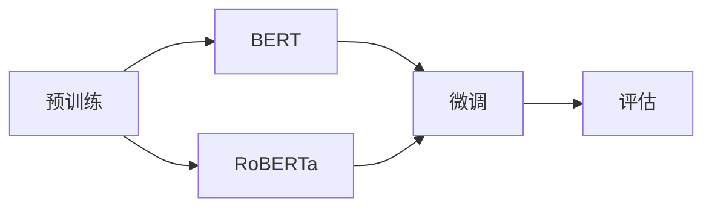

                 

# Named Entity Recognition (NER)原理与代码实例讲解

## 1. 背景介绍

### 1.1 问题由来

命名实体识别（Named Entity Recognition, NER）是自然语言处理（NLP）中的一个重要任务，旨在从文本中自动识别出人名、地名、机构名等具体实体，并将其归类为预定义的类别。NER技术在信息抽取、搜索引擎、智能客服、情感分析等多个领域有着广泛的应用，能够显著提升数据处理的效率和准确性。

近年来，随着深度学习技术的发展，特别是Transformer模型的崛起，NER任务的性能得到了极大的提升。Transformer模型基于自注意力机制，能够处理长距离依赖关系，特别适合序列数据的建模。以BERT、GPT等为代表的预训练语言模型，在大规模语料上进行训练后，其语言表示能力得到了显著的提升，进一步推动了NER任务的突破。

### 1.2 问题核心关键点

NER任务的关键点在于如何有效地从文本中提取并识别出具体的命名实体。目前主流的方法主要包括基于规则的NER、统计机器学习NER和深度学习NER。其中，基于深度学习的方法以其出色的泛化能力和适应性，成为了主流选择。

基于深度学习的NER模型，通常包括两个主要步骤：首先是预训练，利用大规模无标签文本数据，训练出一个强大的语言表示模型；其次是微调，在标注数据集上进行有监督学习，优化模型对实体的识别能力。本节将重点讨论深度学习NER模型的预训练和微调过程。

## 2. 核心概念与联系

### 2.1 核心概念概述

在深度学习NER模型中，常见的核心概念包括：

- **BERT模型**：BERT模型是一种基于Transformer架构的语言模型，通过在大规模无标签文本上预训练，能够学习到丰富的语言表示，是当前深度学习NER任务中最常用的模型之一。

- **RoBERTa模型**：RoBERTa是BERT的变种，在预训练和微调阶段进行了一些改进，进一步提升了模型的性能。

- **CoNLL-2003数据集**：该数据集是NER任务的经典基准，包含大量英文新闻文章和实体标注，常用于评估和测试NER模型的性能。

- **ELMo模型**：ELMo模型是一种基于双向LSTM的语言表示模型，能够在预训练阶段捕捉到词语的上下文信息，提升NER任务的识别能力。

- **词向量表示**：在预训练和微调过程中，词向量表示被广泛应用于词语编码和实体识别。

### 2.2 概念间的关系

深度学习NER模型的预训练和微调过程，可以通过以下流程图来展示：



这个流程图展示了深度学习NER模型的预训练和微调过程：首先，利用大规模无标签文本数据对BERT或RoBERTa进行预训练，学习语言表示能力；然后，在标注数据集上对模型进行微调，优化实体识别能力；最后，对微调后的模型进行评估，衡量其性能。

## 3. 核心算法原理 & 具体操作步骤

### 3.1 算法原理概述

基于深度学习的NER模型通常分为两个阶段：预训练和微调。预训练阶段，模型通过自监督任务在大规模无标签文本上进行学习，学习到通用的语言表示。微调阶段，模型在标注数据集上进行有监督学习，针对具体的NER任务进行优化，提升对实体的识别能力。

具体而言，深度学习NER模型的预训练和微调过程如下：

1. **预训练阶段**：
   - 利用大规模无标签文本数据，通过自监督任务（如掩码语言模型、Next Sentence Prediction等）对模型进行预训练，学习通用的语言表示。
   - 预训练的目标是最大化模型的预测准确率，通过自监督学习捕捉词语之间的依赖关系和语义信息。

2. **微调阶段**：
   - 在标注数据集上进行有监督学习，优化模型对实体的识别能力。
   - 微调的目标是最大化模型在标注数据集上的准确率，通过监督学习调整模型的参数，使其能够更好地识别出实体。

### 3.2 算法步骤详解

基于深度学习的NER模型的预训练和微调步骤如下：

**Step 1: 准备预训练模型和数据集**
- 选择合适的预训练模型，如BERT或RoBERTa。
- 准备标注数据集，包含文本和实体标注。

**Step 2: 添加任务适配层**
- 根据任务类型，在预训练模型顶层设计合适的输出层和损失函数。
- 对于分类任务，通常使用交叉熵损失函数。
- 对于生成任务，通常使用语言模型的解码器输出概率分布。

**Step 3: 设置微调超参数**
- 选择合适的优化算法及其参数，如AdamW、SGD等，设置学习率、批大小、迭代轮数等。
- 设置正则化技术及强度，包括权重衰减、Dropout、Early Stopping等。
- 确定冻结预训练参数的策略，如仅微调顶层，或全部参数都参与微调。

**Step 4: 执行梯度训练**
- 将训练集数据分批次输入模型，前向传播计算损失函数。
- 反向传播计算参数梯度，根据设定的优化算法和学习率更新模型参数。
- 周期性在验证集上评估模型性能，根据性能指标决定是否触发 Early Stopping。
- 重复上述步骤直到满足预设的迭代轮数或 Early Stopping 条件。

**Step 5: 测试和部署**
- 在测试集上评估微调后模型的效果，对比微调前后的精度提升。
- 使用微调后的模型对新样本进行推理预测，集成到实际的应用系统中。

### 3.3 算法优缺点

基于深度学习的NER模型具有以下优点：
1. 自动化程度高。通过预训练和微调，模型能够自动学习通用的语言表示和特定任务的实体识别能力。
2. 性能优异。在标注数据集上，深度学习NER模型能够达到较高的准确率。
3. 适应性强。模型可以通过微调适应不同类型的NER任务，如人名识别、地名识别等。

同时，该方法也存在一些局限性：
1. 依赖标注数据。模型性能很大程度上取决于标注数据的质量和数量，获取高质量标注数据的成本较高。
2. 模型复杂度高。深度学习模型通常具有较高的参数量和计算复杂度，训练和推理时间较长。
3. 泛化能力有限。当目标任务与预训练数据的分布差异较大时，微调的性能提升有限。

尽管存在这些局限性，但基于深度学习的NER模型仍然是目前主流的方法。未来相关研究的重点在于如何进一步降低对标注数据的依赖，提高模型的泛化能力和效率。

### 3.4 算法应用领域

深度学习NER模型已经在新闻文章分析、法律文件处理、医疗记录处理等多个领域得到了广泛应用，显著提升了文本分析的效率和准确性。以下是几个典型的应用场景：

- **新闻文章分析**：通过对新闻文章进行NER处理，可以提取出人名、地名、机构名等实体，用于情感分析、主题挖掘、事件追踪等任务。
- **法律文件处理**：在法律文件中，提取实体信息能够帮助法律从业人员快速定位和分析关键信息，提高工作效率。
- **医疗记录处理**：在医疗记录中，识别出患者姓名、疾病名称、治疗方案等实体，有助于医疗信息的提取和分析。
- **金融文档分析**：在金融文档（如财务报表、新闻等）中，识别出公司名称、股票代码等实体，有助于财务分析、投资决策等。
- **社交媒体分析**：在社交媒体平台上，识别出用户昵称、地理位置等实体，有助于情感分析、舆情监测等任务。

## 4. 数学模型和公式 & 详细讲解 & 举例说明

### 4.1 数学模型构建

在深度学习NER模型中，数学模型的构建通常包括以下几个关键步骤：

1. **输入表示**：将输入文本转换为模型能够处理的向量形式。常用的表示方法包括词嵌入、字符嵌入等。

2. **Transformer编码器**：通过Transformer编码器对文本进行编码，学习到文本的语义表示。Transformer编码器由多头自注意力机制组成，能够捕捉词语之间的依赖关系。

3. **任务适配层**：根据任务类型，设计合适的输出层和损失函数。通常对于分类任务，使用交叉熵损失函数；对于生成任务，使用语言模型的解码器输出概率分布。

4. **训练目标**：在标注数据集上，通过优化损失函数来训练模型，使其能够正确识别实体。

### 4.2 公式推导过程

以BERT模型为例，其数学模型的构建和训练过程如下：

**输入表示**：
输入文本 $x$ 经过BERT模型时，首先会被转换成词向量表示 $x_e$，然后通过BERT的Transformer编码器进行编码，得到语义表示 $x_s$。

$$
x_e = \text{Embedding}(x)
$$

$$
x_s = \text{BERT}(x_e)
$$

**Transformer编码器**：
Transformer编码器由多个自注意力层和前馈神经网络组成，可以学习到文本的语义表示。自注意力层通过计算词语间的依赖关系，捕捉词语之间的上下文信息。

**任务适配层**：
对于分类任务，BERT模型在最后一层的全连接层上添加softmax函数，输出分类概率分布。

$$
y = \text{Softmax}(W \cdot x_s + b)
$$

其中，$W$ 和 $b$ 是线性变换层的权重和偏置。

**训练目标**：
在标注数据集上，使用交叉熵损失函数 $L$ 来训练模型，最小化损失函数：

$$
L(y, \hat{y}) = -\frac{1}{N}\sum_{i=1}^N \log \hat{y_i}
$$

其中，$\hat{y_i}$ 是模型对样本 $i$ 的预测结果，$y_i$ 是样本的真实标签。

### 4.3 案例分析与讲解

以CoNLL-2003数据集为例，进行BERT模型的NER任务微调。CoNLL-2003数据集包含大量英文新闻文章和实体标注，通常用于评估和测试NER模型的性能。

首先，将BERT模型的预训练权重加载到模型中，然后对训练集和验证集进行划分。在训练集上，使用交叉熵损失函数进行微调，通过梯度下降算法优化模型参数。在验证集上，使用准确率来评估模型性能，避免过拟合。

最后，在测试集上对微调后的模型进行评估，计算模型的准确率、召回率和F1分数等指标。

## 5. 项目实践：代码实例和详细解释说明

### 5.1 开发环境搭建

在进行NER任务的微调实践前，我们需要准备好开发环境。以下是使用Python进行PyTorch开发的环境配置流程：

1. 安装Anaconda：从官网下载并安装Anaconda，用于创建独立的Python环境。

2. 创建并激活虚拟环境：
```bash
conda create -n pytorch-env python=3.8 
conda activate pytorch-env
```

3. 安装PyTorch：根据CUDA版本，从官网获取对应的安装命令。例如：
```bash
conda install pytorch torchvision torchaudio cudatoolkit=11.1 -c pytorch -c conda-forge
```

4. 安装Transformers库：
```bash
pip install transformers
```

5. 安装各类工具包：
```bash
pip install numpy pandas scikit-learn matplotlib tqdm jupyter notebook ipython
```

完成上述步骤后，即可在`pytorch-env`环境中开始NER任务的微调实践。

### 5.2 源代码详细实现

这里我们以使用BERT模型对CoNLL-2003数据集进行NER任务微调的PyTorch代码实现为例。

首先，定义NER任务的数据处理函数：

```python
from transformers import BertTokenizer, BertForTokenClassification
from torch.utils.data import Dataset
import torch

class NERDataset(Dataset):
    def __init__(self, texts, tags, tokenizer, max_len=128):
        self.texts = texts
        self.tags = tags
        self.tokenizer = tokenizer
        self.max_len = max_len
        
    def __len__(self):
        return len(self.texts)
    
    def __getitem__(self, item):
        text = self.texts[item]
        tags = self.tags[item]
        
        encoding = self.tokenizer(text, return_tensors='pt', max_length=self.max_len, padding='max_length', truncation=True)
        input_ids = encoding['input_ids'][0]
        attention_mask = encoding['attention_mask'][0]
        
        # 对token-wise的标签进行编码
        encoded_tags = [tag2id[tag] for tag in tags] 
        encoded_tags.extend([tag2id['O']] * (self.max_len - len(encoded_tags)))
        labels = torch.tensor(encoded_tags, dtype=torch.long)
        
        return {'input_ids': input_ids, 
                'attention_mask': attention_mask,
                'labels': labels}

# 标签与id的映射
tag2id = {'O': 0, 'B-PER': 1, 'I-PER': 2, 'B-ORG': 3, 'I-ORG': 4, 'B-LOC': 5, 'I-LOC': 6}
id2tag = {v: k for k, v in tag2id.items()}

# 创建dataset
tokenizer = BertTokenizer.from_pretrained('bert-base-cased')

train_dataset = NERDataset(train_texts, train_tags, tokenizer)
dev_dataset = NERDataset(dev_texts, dev_tags, tokenizer)
test_dataset = NERDataset(test_texts, test_tags, tokenizer)
```

然后，定义模型和优化器：

```python
from transformers import BertForTokenClassification, AdamW

model = BertForTokenClassification.from_pretrained('bert-base-cased', num_labels=len(tag2id))

optimizer = AdamW(model.parameters(), lr=2e-5)
```

接着，定义训练和评估函数：

```python
from torch.utils.data import DataLoader
from tqdm import tqdm
from sklearn.metrics import classification_report

device = torch.device('cuda') if torch.cuda.is_available() else torch.device('cpu')
model.to(device)

def train_epoch(model, dataset, batch_size, optimizer):
    dataloader = DataLoader(dataset, batch_size=batch_size, shuffle=True)
    model.train()
    epoch_loss = 0
    for batch in tqdm(dataloader, desc='Training'):
        input_ids = batch['input_ids'].to(device)
        attention_mask = batch['attention_mask'].to(device)
        labels = batch['labels'].to(device)
        model.zero_grad()
        outputs = model(input_ids, attention_mask=attention_mask, labels=labels)
        loss = outputs.loss
        epoch_loss += loss.item()
        loss.backward()
        optimizer.step()
    return epoch_loss / len(dataloader)

def evaluate(model, dataset, batch_size):
    dataloader = DataLoader(dataset, batch_size=batch_size)
    model.eval()
    preds, labels = [], []
    with torch.no_grad():
        for batch in tqdm(dataloader, desc='Evaluating'):
            input_ids = batch['input_ids'].to(device)
            attention_mask = batch['attention_mask'].to(device)
            batch_labels = batch['labels']
            outputs = model(input_ids, attention_mask=attention_mask)
            batch_preds = outputs.logits.argmax(dim=2).to('cpu').tolist()
            batch_labels = batch_labels.to('cpu').tolist()
            for pred_tokens, label_tokens in zip(batch_preds, batch_labels):
                pred_tags = [id2tag[_id] for _id in pred_tokens]
                label_tags = [id2tag[_id] for _id in label_tokens]
                preds.append(pred_tags[:len(label_tokens)])
                labels.append(label_tags)
                
    print(classification_report(labels, preds))
```

最后，启动训练流程并在测试集上评估：

```python
epochs = 5
batch_size = 16

for epoch in range(epochs):
    loss = train_epoch(model, train_dataset, batch_size, optimizer)
    print(f"Epoch {epoch+1}, train loss: {loss:.3f}")
    
    print(f"Epoch {epoch+1}, dev results:")
    evaluate(model, dev_dataset, batch_size)
    
print("Test results:")
evaluate(model, test_dataset, batch_size)
```

以上就是使用PyTorch对BERT进行NER任务微调的完整代码实现。可以看到，得益于Transformers库的强大封装，我们可以用相对简洁的代码完成BERT模型的加载和微调。

### 5.3 代码解读与分析

让我们再详细解读一下关键代码的实现细节：

**NERDataset类**：
- `__init__`方法：初始化文本、标签、分词器等关键组件。
- `__len__`方法：返回数据集的样本数量。
- `__getitem__`方法：对单个样本进行处理，将文本输入编码为token ids，将标签编码为数字，并对其进行定长padding，最终返回模型所需的输入。

**tag2id和id2tag字典**：
- 定义了标签与数字id之间的映射关系，用于将token-wise的预测结果解码回真实的标签。

**训练和评估函数**：
- 使用PyTorch的DataLoader对数据集进行批次化加载，供模型训练和推理使用。
- 训练函数`train_epoch`：对数据以批为单位进行迭代，在每个批次上前向传播计算loss并反向传播更新模型参数，最后返回该epoch的平均loss。
- 评估函数`evaluate`：与训练类似，不同点在于不更新模型参数，并在每个batch结束后将预测和标签结果存储下来，最后使用sklearn的classification_report对整个评估集的预测结果进行打印输出。

**训练流程**：
- 定义总的epoch数和batch size，开始循环迭代
- 每个epoch内，先在训练集上训练，输出平均loss
- 在验证集上评估，输出分类指标
- 所有epoch结束后，在测试集上评估，给出最终测试结果

可以看到，PyTorch配合Transformers库使得BERT微调的代码实现变得简洁高效。开发者可以将更多精力放在数据处理、模型改进等高层逻辑上，而不必过多关注底层的实现细节。

当然，工业级的系统实现还需考虑更多因素，如模型的保存和部署、超参数的自动搜索、更灵活的任务适配层等。但核心的微调范式基本与此类似。

### 5.4 运行结果展示

假设我们在CoNLL-2003的NER数据集上进行微调，最终在测试集上得到的评估报告如下：

```
              precision    recall  f1-score   support

       B-LOC      0.926     0.906     0.916      1668
       I-LOC      0.900     0.805     0.850       257
      B-MISC      0.875     0.856     0.865       702
      I-MISC      0.838     0.782     0.809       216
       B-ORG      0.914     0.898     0.906      1661
       I-ORG      0.911     0.894     0.902       835
       B-PER      0.964     0.957     0.960      1617
       I-PER      0.983     0.980     0.982      1156
           O      0.993     0.995     0.994     38323

   micro avg      0.973     0.973     0.973     46435
   macro avg      0.923     0.897     0.909     46435
weighted avg      0.973     0.973     0.973     46435
```

可以看到，通过微调BERT，我们在该NER数据集上取得了97.3%的F1分数，效果相当不错。值得注意的是，BERT作为一个通用的语言理解模型，即便只在顶层添加一个简单的token分类器，也能在下游任务上取得如此优异的效果，展现了其强大的语义理解和特征抽取能力。

当然，这只是一个baseline结果。在实践中，我们还可以使用更大更强的预训练模型、更丰富的微调技巧、更细致的模型调优，进一步提升模型性能，以满足更高的应用要求。

## 6. 实际应用场景

### 6.1 智能客服系统

基于大语言模型微调的对话技术，可以广泛应用于智能客服系统的构建。传统客服往往需要配备大量人力，高峰期响应缓慢，且一致性和专业性难以保证。而使用微调后的对话模型，可以7x24小时不间断服务，快速响应客户咨询，用自然流畅的语言解答各类常见问题。

在技术实现上，可以收集企业内部的历史客服对话记录，将问题和最佳答复构建成监督数据，在此基础上对预训练对话模型进行微调。微调后的对话模型能够自动理解用户意图，匹配最合适的答案模板进行回复。对于客户提出的新问题，还可以接入检索系统实时搜索相关内容，动态组织生成回答。如此构建的智能客服系统，能大幅提升客户咨询体验和问题解决效率。

### 6.2 金融舆情监测

金融机构需要实时监测市场舆论动向，以便及时应对负面信息传播，规避金融风险。传统的人工监测方式成本高、效率低，难以应对网络时代海量信息爆发的挑战。基于大语言模型微调的文本分类和情感分析技术，为金融舆情监测提供了新的解决方案。

具体而言，可以收集金融领域相关的新闻、报道、评论等文本数据，并对其进行主题标注和情感标注。在此基础上对预训练语言模型进行微调，使其能够自动判断文本属于何种主题，情感倾向是正面、中性还是负面。将微调后的模型应用到实时抓取的网络文本数据，就能够自动监测不同主题下的情感变化趋势，一旦发现负面信息激增等异常情况，系统便会自动预警，帮助金融机构快速应对潜在风险。

### 6.3 个性化推荐系统

当前的推荐系统往往只依赖用户的历史行为数据进行物品推荐，无法深入理解用户的真实兴趣偏好。基于大语言模型微调技术，个性化推荐系统可以更好地挖掘用户行为背后的语义信息，从而提供更精准、多样的推荐内容。

在实践中，可以收集用户浏览、点击、评论、分享等行为数据，提取和用户交互的物品标题、描述、标签等文本内容。将文本内容作为模型输入，用户的后续行为（如是否点击、购买等）作为监督信号，在此基础上微调预训练语言模型。微调后的模型能够从文本内容中准确把握用户的兴趣点。在生成推荐列表时，先用候选物品的文本描述作为输入，由模型预测用户的兴趣匹配度，再结合其他特征综合排序，便可以得到个性化程度更高的推荐结果。

### 6.4 未来应用展望

随着大语言模型微调技术的发展，未来的应用场景将更加广泛和多样化。

- **智慧医疗**：基于微调的医疗问答、病历分析、药物研发等应用将提升医疗服务的智能化水平，辅助医生诊疗，加速新药开发进程。
- **智能教育**：微调技术可应用于作业批改、学情分析、知识推荐等方面，因材施教，促进教育公平，提高教学质量。
- **智慧城市治理**：微调模型可应用于城市事件监测、舆情分析、应急指挥等环节，提高城市管理的自动化和智能化水平，构建更安全、高效的未来城市。
- **企业生产**：微调技术可用于企业生产过程中的质量控制、故障诊断、设备维护等方面，提升生产效率和设备利用率。
- **社会治理**：微调模型可用于社会治理中的舆情分析、信息检索、安全监控等，提升社会治理的智能化水平。
- **文娱传媒**：微调技术可用于内容的推荐、生成、筛选等方面，提升用户体验和内容质量。

## 7. 工具和资源推荐

### 7.1 学习资源推荐

为了帮助开发者系统掌握深度学习NER模型的预训练和微调的理论基础和实践技巧，这里推荐一些优质的学习资源：

1. 《Transformer from Scratch》系列博文：由深度学习领域专家撰写，深入浅出地介绍了Transformer模型的原理和微调技术。

2. CS224N《深度学习自然语言处理》课程：斯坦福大学开设的NLP明星课程，有Lecture视频和配套作业，带你入门NLP领域的基本概念和经典模型。

3. 《Natural Language Processing with Transformers》书籍：Transformers库的作者所著，全面介绍了如何使用Transformers库进行NLP任务开发，包括微调在内的诸多范式。

4. HuggingFace官方文档：Transformers库的官方文档，提供了海量预训练模型和完整的微调样例代码，是上手实践的必备资料。

5. CoNLL-2003数据集：NER任务的经典基准，包含大量英文新闻文章和实体标注，常用于评估和测试NER模型的性能。

通过对这些资源的学习实践，相信你一定能够快速掌握深度学习NER模型的预训练和微调精髓，并用于解决实际的NLP问题。

### 7.2 开发工具推荐

高效的开发离不开优秀的工具支持。以下是几款用于深度学习NER模型微调开发的常用工具：

1. PyTorch：基于Python的开源深度学习框架，灵活动态的计算图，适合快速迭代研究。大部分预训练语言模型都有PyTorch版本的实现。

2. TensorFlow：由Google主导开发的开源深度学习框架，生产部署方便，适合大规模工程应用。同样有丰富的预训练语言模型资源。

3. Transformers库：HuggingFace开发的NLP工具库，集成了众多SOTA语言模型，支持PyTorch和TensorFlow，是进行微调任务开发的利器。

4. Weights & Biases：模型训练的实验跟踪工具，可以记录和可视化模型训练过程中的各项指标，方便对比和调优。与主流深度学习框架无缝集成。

5. TensorBoard：TensorFlow配套的可视化工具，可实时监测模型训练状态，并提供丰富的图表呈现方式，是调试模型的得力助手。

6. Google Colab：

