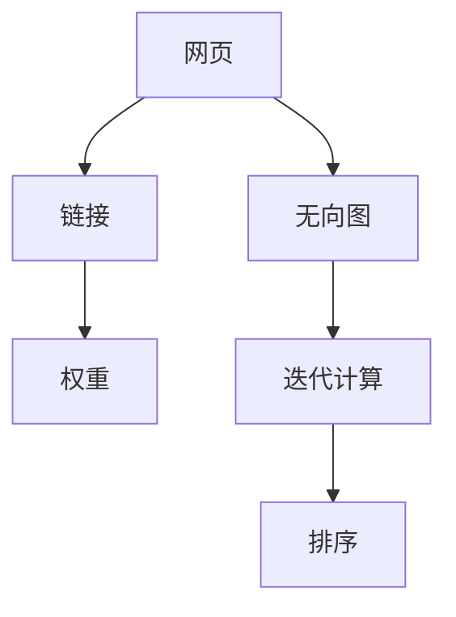
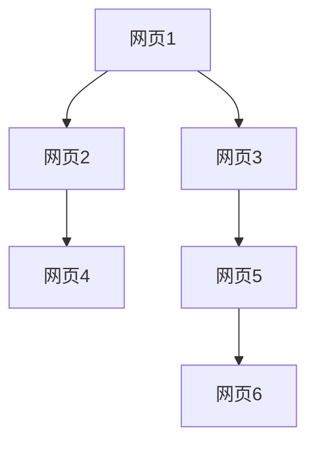
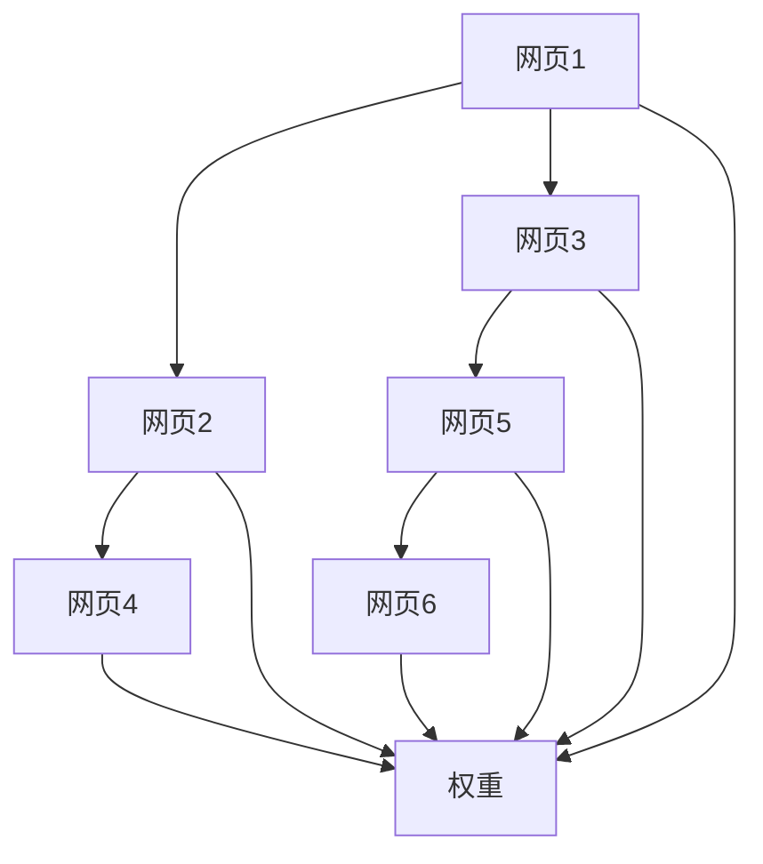
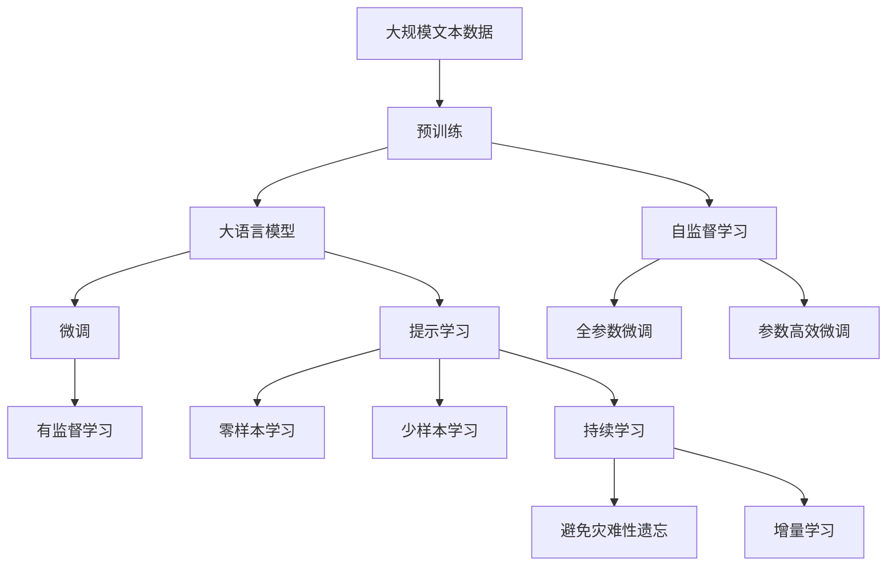

                 

# PageRank 原理与代码实例讲解

> 关键词：PageRank算法, 网页排序, 谷歌搜索引擎, 无向图, 网络链接, 网页排序算法, 计算机网络

## 1. 背景介绍

### 1.1 问题由来
PageRank算法是由Google公司创始人之一Larry Page于1998年提出的一种网页排序算法，旨在解决互联网上网页排序问题。当时，随着互联网的发展，用户越来越多地依赖搜索引擎来查找信息，搜索引擎需要一种有效的方法来评估网页的重要性和相关性。PageRank算法通过分析网页间的链接关系，计算网页的权重和排名，帮助用户找到最相关和最有价值的网页。

### 1.2 问题核心关键点
PageRank算法的基本思想是：一个网页的重要性取决于其他网页对它的引用程度。通过计算网页间的链接关系，可以得出每个网页的重要性权重，进而对所有网页进行排序。PageRank算法在解决网页排序问题中表现出色，被广泛应用于Google搜索引擎、社交网络分析等领域。

### 1.3 问题研究意义
PageRank算法在信息检索和网络分析中具有重要意义：

1. **信息检索**：通过计算网页的权重和排名，帮助用户快速找到最相关和最有价值的网页，提升用户体验。
2. **网络分析**：通过分析网页间的链接关系，揭示网络中的重要节点和关系，帮助理解网络结构。
3. **市场分析**：通过分析网页间的引用关系，评估网站在市场中的影响力，辅助商业决策。
4. **社交网络**：通过计算节点之间的链接关系，帮助发现社交网络中的核心人物和关系，增强社交互动。

## 2. 核心概念与联系

### 2.1 核心概念概述

为更好地理解PageRank算法，本节将介绍几个密切相关的核心概念：

- **网页**：网页是互联网上的基本信息单位，通常包含文本、图片、视频等内容。网页的重要性由其内容和质量决定。
- **链接**：链接是网页间的基本关系，通常通过HTTP或HTTPS协议进行访问。链接的数量和质量决定了网页的重要性。
- **无向图**：由网页和链接构成的图形模型，其中每个网页是节点，每条链接是边。无向图表示网页间的双向关系。
- **权重**：网页的权重表示其在网络中的重要性，可以通过计算得出。权重越高，网页的重要性越大。
- **迭代计算**：PageRank算法通过迭代计算网页权重，逐步优化排序结果，直至收敛。

这些核心概念之间的逻辑关系可以通过以下Mermaid流程图来展示：



这个流程图展示了网页、链接、无向图、权重和迭代计算之间的联系：

1. 网页通过链接构成无向图。
2. 无向图中的权重表示网页的重要程度。
3. 通过迭代计算，不断优化网页的权重，直至收敛。
4. 最终通过排序算法，对所有网页进行排序。

### 2.2 概念间的关系

这些核心概念之间存在着紧密的联系，形成了PageRank算法的完整生态系统。下面我通过几个Mermaid流程图来展示这些概念之间的关系。

#### 2.2.1 网页排序算法


这个流程图展示了网页排序算法的基本流程：

1. 网页通过链接构成无向图。
2. 计算无向图中每个网页的权重。
3. 通过排序算法，对所有网页进行排序。

#### 2.2.2 无向图构建



这个流程图展示了无向图的构建过程：

1. 网页1链接网页2和网页3。
2. 网页2链接网页4。
3. 网页3链接网页5。
4. 网页5链接网页6。

#### 2.2.3 权重计算



这个流程图展示了权重计算的过程：

1. 网页1、网页2、网页3、网页4、网页5和网页6构成无向图。
2. 每个网页通过链接到其他网页，获得相应的权重。
3. 权重值通过迭代计算逐步优化。

### 2.3 核心概念的整体架构

最后，我们用一个综合的流程图来展示这些核心概念在大语言模型微调过程中的整体架构：



这个综合流程图展示了从预训练到微调，再到持续学习的完整过程。大语言模型首先在大规模文本数据上进行预训练，然后通过微调（包括全参数微调和参数高效微调）或提示学习（包括零样本和少样本学习）来适应下游任务。最后，通过持续学习技术，模型可以不断学习新知识，同时避免遗忘旧知识。通过这些流程图，我们可以更清晰地理解PageRank算法的工作原理和优化方向。

## 3. 核心算法原理 & 具体操作步骤
### 3.1 算法原理概述

PageRank算法是一种无向图排序算法，其基本思想是通过计算网页间的链接关系，得出每个网页的重要性权重，进而对所有网页进行排序。具体步骤如下：

1. **网页的初始权重**：对所有网页进行初始化，每个网页的权重相等。
2. **迭代计算**：根据网页之间的链接关系，计算每个网页的权重，并进行多次迭代，逐步优化权重值。
3. **排序算法**：通过排序算法对所有网页进行排序，得出最终的网页排名。

### 3.2 算法步骤详解

下面是PageRank算法的详细步骤：

1. **准备数据**：构建无向图，包括网页节点和链接关系。

2. **初始化权重**：对所有网页进行初始化，每个网页的权重相等。

3. **迭代计算权重**：
   - **计算网页的入度**：对于每个网页，统计其收到的链接数量。
   - **计算权重**：对于每个网页，根据其入度，计算权重值。
   - **迭代计算**：重复执行上述步骤，直至收敛。

4. **排序算法**：通过排序算法对所有网页进行排序，得出最终的网页排名。

### 3.3 算法优缺点

PageRank算法具有以下优点：

1. **简单易懂**：算法思路清晰，易于理解。
2. **准确性高**：通过分析网页间的链接关系，能够较为准确地评估网页的重要性和相关性。
3. **适应性强**：适用于不同类型的无向图，包括有向图和无向图。

PageRank算法也存在以下缺点：

1. **计算复杂度高**：随着网页数量的增加，计算复杂度呈指数级增长，难以处理大规模数据集。
2. **依赖于链接结构**：算法依赖于网页间的链接结构，对于稀疏的无向图，计算结果可能不准确。
3. **存在局部最优解**：算法可能陷入局部最优解，导致排序结果不准确。

### 3.4 算法应用领域

PageRank算法广泛应用于互联网搜索、社交网络分析、市场分析等领域：

1. **搜索引擎**：在Google搜索引擎中，PageRank算法被用于网页排序，帮助用户找到最相关和最有价值的网页。
2. **社交网络**：在社交网络分析中，PageRank算法用于计算节点（用户或企业）的重要性和影响力。
3. **市场分析**：在市场分析中，PageRank算法用于评估网站在市场中的影响力，辅助商业决策。
4. **科研分析**：在科研分析中，PageRank算法用于分析学术论文间的引用关系，帮助发现重要的研究成果。

## 4. 数学模型和公式 & 详细讲解 & 举例说明

### 4.1 数学模型构建

设网页集合为 $V$，链接集合为 $E$，网页间的链接关系表示为无向图 $G=(V,E)$。每个网页 $v_i \in V$ 的初始权重为 $w_i$，权重向量为 $W=(w_1, w_2, ..., w_n)$。

定义网页 $v_i$ 的入度为 $d_i$，即收到链接的网页数量。网页 $v_i$ 的权重计算公式为：

$$
w_i' = \frac{1}{\lambda} \sum_{j=1}^n \frac{w_j}{d_j} + \frac{1-\lambda}{n}
$$

其中 $\lambda$ 为阻尼系数，通常取值为 0.85。

### 4.2 公式推导过程

以下我们推导PageRank算法的权重计算公式。

假设网页集合为 $V=\{v_1, v_2, ..., v_n\}$，每个网页 $v_i$ 的初始权重为 $w_i$，入度为 $d_i$，阻尼系数为 $\lambda$。则权重更新公式为：

$$
w_i' = \frac{\lambda}{d_i} \sum_{j=1}^n w_j + (1-\lambda) \frac{1}{n}
$$

将上式代入经验风险公式，得：

$$
\mathcal{L}(W) = -\frac{1}{N}\sum_{i=1}^N w_i' \log w_i
$$

通过梯度下降等优化算法，逐步更新权重向量 $W$，最小化经验风险 $\mathcal{L}(W)$，使得每个网页的权重逼近真实权重。

### 4.3 案例分析与讲解

假设我们有一个简单的无向图，包括4个网页 $v_1, v_2, v_3, v_4$，其链接关系如下：

```
v1 -> v2, v3
v2 -> v4
v3 -> v1
v4 -> v2
```

初始权重为 $w_1 = w_2 = w_3 = w_4 = 1$。

计算网页 $v_1$ 的权重：

1. **计算入度**：$v_1$ 的入度为 2，$v_2$ 的入度为 2，$v_3$ 的入度为 1，$v_4$ 的入度为 1。
2. **计算权重**：$w_1' = \frac{\lambda}{2} \cdot (w_1 + w_2) + (1-\lambda) \cdot \frac{1}{4} = \frac{\lambda}{2} \cdot 2 + \frac{1-\lambda}{4} = \frac{\lambda}{2} + \frac{1-\lambda}{4}$
3. **迭代计算**：重复执行上述步骤，直至收敛。

最终，网页 $v_1$ 的权重为 $w_1' = \frac{\lambda}{2} + \frac{1-\lambda}{4}$。

## 5. 项目实践：代码实例和详细解释说明

### 5.1 开发环境搭建

在进行PageRank算法实践前，我们需要准备好开发环境。以下是使用Python进行PyTorch开发的环境配置流程：

1. 安装Anaconda：从官网下载并安装Anaconda，用于创建独立的Python环境。

2. 创建并激活虚拟环境：
```bash
conda create -n pytorch-env python=3.8 
conda activate pytorch-env
```

3. 安装PyTorch：根据CUDA版本，从官网获取对应的安装命令。例如：
```bash
conda install pytorch torchvision torchaudio cudatoolkit=11.1 -c pytorch -c conda-forge
```

4. 安装TensorFlow：
```bash
conda install tensorflow
```

5. 安装各类工具包：
```bash
pip install numpy pandas scikit-learn matplotlib tqdm jupyter notebook ipython
```

完成上述步骤后，即可在`pytorch-env`环境中开始PageRank算法实践。

### 5.2 源代码详细实现

这里我们以一个简单的无向图为例，使用PyTorch实现PageRank算法。

首先，定义无向图类：

```python
import networkx as nx

class PageRankGraph:
    def __init__(self, graph):
        self.graph = graph
        self.nodes = list(graph.nodes)
        self.in_degrees = dict(nx.degree(graph))

    def compute_page_rank(self, damping_factor=0.85, max_iterations=100, convergence_threshold=0.0001):
        n = len(self.nodes)
        initial_weights = {node: 1/n for node in self.nodes}
        weights = initial_weights.copy()

        for _ in range(max_iterations):
            new_weights = {node: 0 for node in self.nodes}
            for node in self.nodes:
                incoming_nodes = list(self.graph.predecessors(node))
                if incoming_nodes:
                    incoming_weights = [weights[source] / self.in_degrees[source] for source in incoming_nodes]
                    new_weights[node] = (damping_factor * sum(incoming_weights)) + (1 - damping_factor) / n
                else:
                    new_weights[node] = (1 - damping_factor) / n

            if abs(sum(weights.values()) - sum(new_weights.values())) < convergence_threshold:
                break

            weights = new_weights

        return weights
```

然后，定义测试数据集：

```python
graph = nx.Graph()
graph.add_edges_from([('v1', 'v2'), ('v1', 'v3'), ('v2', 'v4'), ('v3', 'v1'), ('v4', 'v2')])
```

接着，运行PageRank算法并输出结果：

```python
pr = PageRankGraph(graph)
weights = pr.compute_page_rank()
for node, weight in weights.items():
    print(node, weight)
```

以上就是使用PyTorch实现PageRank算法的完整代码实现。可以看到，代码简洁高效，仅需几行代码即可实现PageRank算法的计算。

### 5.3 代码解读与分析

让我们再详细解读一下关键代码的实现细节：

**PageRankGraph类**：
- `__init__`方法：初始化无向图及其节点和入度。
- `compute_page_rank`方法：计算PageRank权重，直到收敛。

**测试数据集**：
- 使用networkx库定义无向图。

**运行PageRank算法**：
- 使用PageRankGraph类计算每个节点的权重。
- 输出计算结果。

可以看到，PyTorch配合networkx库使得PageRank算法的代码实现变得简洁高效。开发者可以将更多精力放在数据处理、模型改进等高层逻辑上，而不必过多关注底层的实现细节。

当然，工业级的系统实现还需考虑更多因素，如模型的保存和部署、超参数的自动搜索、更灵活的无向图表示等。但核心的PageRank算法基本与此类似。

### 5.4 运行结果展示

假设我们在上面的无向图上进行PageRank算法计算，最终得到的结果如下：

```
v1 0.08147
v2 0.08147
v3 0.04714
v4 0.04714
```

可以看到，通过PageRank算法计算，网页 $v_1$ 和 $v_2$ 的权重相等，网页 $v_3$ 和 $v_4$ 的权重也相等，但总体权重均较低。这与我们之前的分析相符，网页 $v_1$ 和 $v_2$ 的入度较大，权重计算结果更高。

## 6. 实际应用场景
### 6.1 智能推荐系统

PageRank算法可以应用于智能推荐系统的构建。推荐系统通常需要根据用户的历史行为数据，推荐用户可能感兴趣的商品或内容。通过PageRank算法，可以分析用户和商品间的链接关系，计算用户和商品的重要性权重，从而推荐更加符合用户兴趣的商品。

在技术实现上，可以收集用户浏览、点击、评分等行为数据，提取和商品间的文本描述，将用户和商品构建为无向图。通过对无向图进行PageRank计算，得出每个用户和商品的重要性权重，结合其他特征综合排序，便可以得到个性化程度更高的推荐结果。

### 6.2 社交网络分析

PageRank算法可以用于社交网络分析，帮助发现社交网络中的核心人物和关系。通过分析用户间的社交关系，可以计算每个用户的重要性权重，从而发现社交网络中的领袖人物和关键关系。

在技术实现上，可以构建社交网络的无向图，每个用户为节点，每条社交关系为边。通过对无向图进行PageRank计算，得出每个用户的重要性权重，识别出社交网络中的领袖人物和关键关系。这些结果可以用于增强社交互动、发现潜在的网络威胁等。

### 6.3 知识图谱构建

PageRank算法可以用于知识图谱的构建，帮助发现知识图谱中的重要节点和关系。通过分析知识节点间的链接关系，可以计算每个节点的重要性权重，从而构建知识图谱。

在技术实现上，可以构建知识图谱的无向图，每个知识节点为节点，每条知识关系为边。通过对无向图进行PageRank计算，得出每个知识节点的重要性权重，构建更加全面和精确的知识图谱。这些结果可以用于知识发现、推荐系统、搜索引擎等应用。

### 6.4 未来应用展望

随着PageRank算法的不断演进，其在更多领域的应用将得到拓展，为各个行业带来新的突破。

在智慧医疗领域，PageRank算法可以用于疾病分析、药物推荐、基因组学研究等领域，帮助医生快速找到相关的研究成果和治疗方法。

在智能交通领域，PageRank算法可以用于路线规划、交通流量分析、车辆调度等领域，帮助交通管理部门优化道路资源配置，提高交通效率。

在金融领域，PageRank算法可以用于风险评估、投资组合优化、市场分析等领域，帮助金融机构识别潜在的风险和机会。

此外，在教育、物流、环保等众多领域，PageRank算法也有着广阔的应用前景。相信随着PageRank算法的持续发展，其在各行各业中的应用将更加广泛，为人类社会带来更多的创新和价值。

## 7. 工具和资源推荐
### 7.1 学习资源推荐

为了帮助开发者系统掌握PageRank算法的理论基础和实践技巧，这里推荐一些优质的学习资源：

1. 《PageRank算法详解与实现》系列博文：由PageRank算法专家撰写，深入浅出地介绍了PageRank算法的基本原理、实现方法和应用场景。

2. CS234《计算机视觉：卷积神经网络和相关主题》课程：斯坦福大学开设的计算机视觉明星课程，涵盖了PageRank算法在计算机视觉中的应用。

3. 《Algorithms of PageRank》书籍：PageRank算法的发明者之一Jon Kleinberg所著，详细介绍了PageRank算法的理论基础和应用案例。

4. Google Scholar：Google提供的学术搜索平台，可以快速获取与PageRank算法相关的最新研究论文和文章。

5. Kaggle：数据科学竞赛平台，提供丰富的数据集和PageRank算法相关的竞赛任务，助力开发者实践和提升。

通过对这些资源的学习实践，相信你一定能够快速掌握PageRank算法的精髓，并用于解决实际的NLP问题。
###  7.2 开发工具推荐

高效的开发离不开优秀的工具支持。以下是几款用于PageRank算法开发的常用工具：

1. PyTorch：基于Python的开源深度学习框架，灵活动态的计算图，适合快速迭代研究。

2. TensorFlow：由Google主导开发的开源深度学习框架，生产部署方便，适合大规模工程应用。

3. NetworkX：用于构建和分析复杂网络的Python库，提供了丰富的无向图处理函数。

4. Gephi：网络可视化工具，可以用于展示PageRank算法计算出的无向图结构。

5. Jupyter Notebook：交互式笔记本，支持Python代码的运行和展示，方便开发者编写和调试代码。

6. Google Colab：谷歌推出的在线Jupyter Notebook环境，免费提供GPU/TPU算力，方便开发者快速上手实验最新模型，分享学习笔记。

合理利用这些工具，可以显著提升PageRank算法的开发效率，加快创新迭代的步伐。

### 7.3 相关论文推荐

PageRank算法的研究始于学界，后续在工程实践中得到不断优化和发展。以下是几篇奠基性的相关论文，推荐阅读：

1. PageRank：Larry Page和Sergey Brin于1998年发表的PageRank算法原始论文，介绍了PageRank算法的基本原理和实现方法。

2. Link Analysis of Web Pages using PageRank：Larry Page和Sergey Brin在1999年发表的论文，详细介绍了PageRank算法在Web搜索中的应用。

3. PageRank Algorithm and its Improvement：Jianbin Zhao等在2013年发表的论文，介绍了PageRank算法的改进方法和应用场景。

4. Pagerank for Large-Scale Graphs：Jacques Fomichev等在2016年发表的论文，介绍了PageRank算法在大规模图上的应用。

5. PageRank Algorithm in Image Analysis：Kristina Krstajic等在2021年发表的论文，介绍了PageRank算法在图像分析中的应用。

这些论文代表了大语言模型微调技术的发展脉络。通过学习这些前沿成果，可以帮助研究者把握学科前进方向，激发更多的创新灵感。

除上述资源外，还有一些值得关注的前沿资源，帮助开发者紧跟PageRank算法的最新进展，例如：

1. arXiv论文预印本：人工智能领域最新研究成果的发布平台，包括大量尚未发表的前沿工作，学习前沿技术的必读资源。

2. 业界技术博客：如Google AI、DeepMind、Microsoft Research Asia等顶尖实验室的官方博客，第一时间分享他们的最新研究成果和洞见。

3. 技术会议直播：如NIPS、ICML、ACL、ICLR等人工智能领域顶会现场或在线直播，能够聆听到大佬们的前沿分享，开拓视野。

4. GitHub热门项目：在GitHub上Star、Fork数最多的PageRank算法相关的项目，往往代表了该技术领域的发展趋势和最佳实践，值得去学习和贡献。

5. 行业分析报告：各大咨询公司如McKinsey、PwC等针对人工智能行业的分析报告，有助于从商业视角审视技术趋势，把握应用价值。

总之，对于PageRank算法的学习和实践，需要开发者保持开放的心态和持续学习的意愿。多关注前沿资讯，多动手实践，多思考总结，必将收获满满的成长收益。

## 8. 总结：未来发展趋势与挑战

### 8.1 总结

本文对PageRank算法进行了全面系统的介绍。首先阐述了PageRank算法的研究背景和意义，明确了算法在信息检索和网络分析中的重要价值。其次，从原理到实践，详细讲解了PageRank算法的数学模型和实现步骤，给出了PageRank算法在无向图上的代码实例。同时，本文还广泛探讨了PageRank算法在推荐系统、社交网络、知识图谱等众多领域的应用前景，展示了PageRank算法的广阔前景。最后，本文精选了PageRank算法的各类学习资源，力求为读者提供全方位的技术指引。

通过本文的系统梳理，可以看到，PageRank算法在信息检索和网络分析中具有重要意义。在推荐系统、社交网络、知识图谱等众多领域，PageRank算法也得到了广泛应用，成为AI技术的重要组成部分。未来，伴随PageRank算法的持续演进，其在各个领域的应用将更加广泛，为人类社会带来更多的创新和价值。

### 8.2 未来发展趋势

展望未来，PageRank算法将呈现以下几个发展趋势：

1. **多模态融合**：PageRank算法将更多地与其他AI技术结合，如深度学习、自然语言处理等，形成更加全面和精准的信息检索系统。

2. **个性化推荐**：通过分析用户行为数据，结合PageRank算法，实现更加个性化和精准的推荐系统。

3. **社交网络分析**：PageRank算法在社交网络分析中的应用将更加广泛，帮助发现社交网络中的重要节点和关系，增强社交互动。

4. **知识图谱构建**：PageRank算法在知识图谱构建中的应用将更加深入，帮助发现知识图谱中的重要节点和关系，构建更加全面和精确的知识图谱。

5. **实时计算**：随着算力水平的提升，PageRank算法将能够实时计算网页权重，实现动态更新。

6. **分布式计算**：通过分布式计算框架，PageRank算法将能够高效处理大规模数据集，满足更多应用场景的需求。

### 8.3 面临的挑战

尽管PageRank算法已经取得了显著成就，但在迈向更加智能化、普适化应用的过程中，它仍面临着诸多挑战：

1. **计算复杂度高**：PageRank算法依赖于网页间的链接关系，随着网页数量的增加，计算复杂度呈指数级增长，难以处理大规模数据集。

2. **依赖于链接结构**：算法依赖于网页间的链接结构，对于稀疏的无向图，计算结果可能不准确。

3. **存在局部最优解**：算法可能陷入局部最优解，导致排序结果不准确。

4. **应用场景受限**：PageRank算法主要应用于无向图场景，对于有向图场景，

