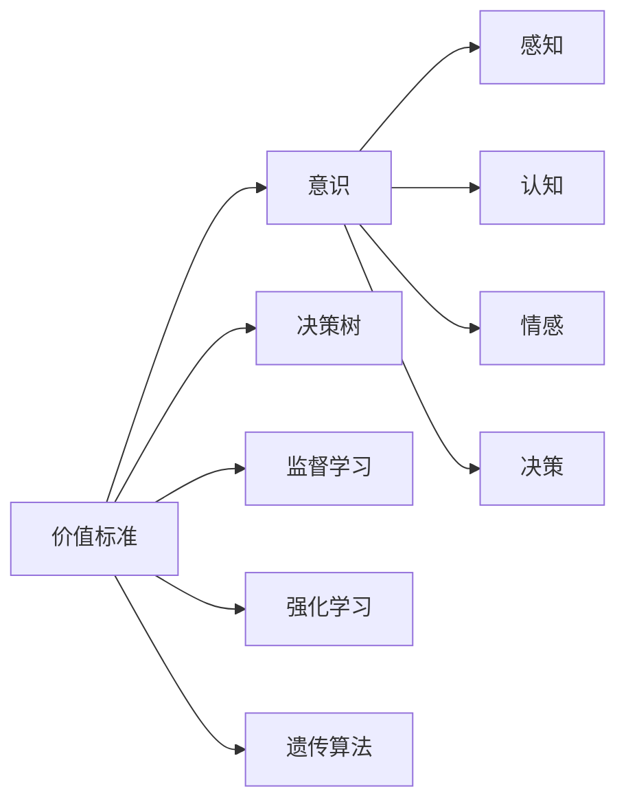
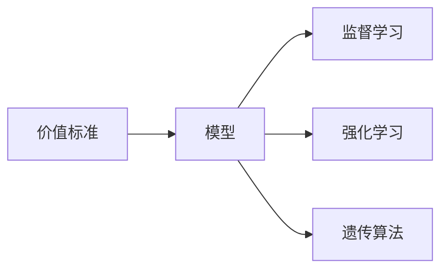
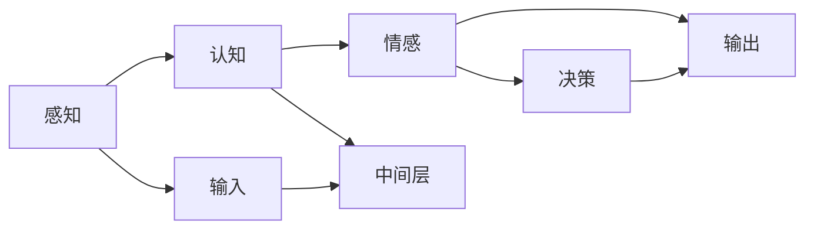
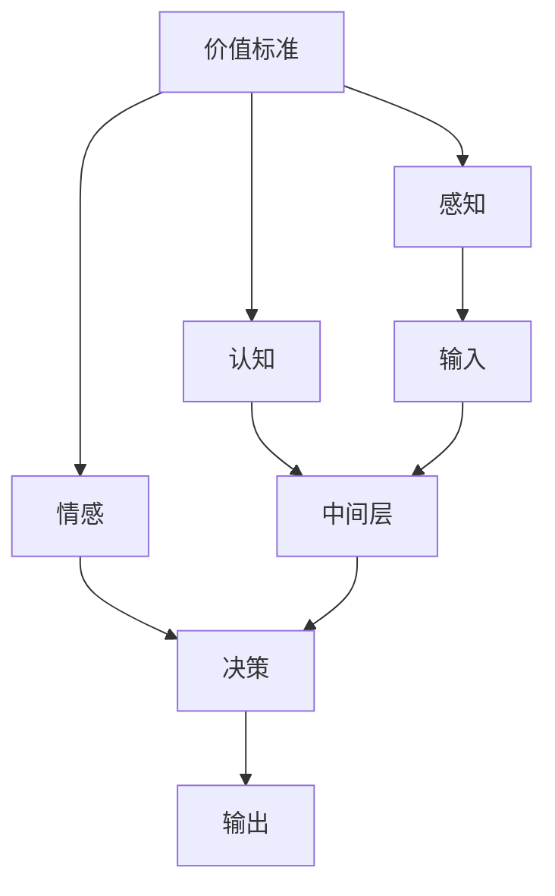

                 

# 价值标准在意识中的应用

> 关键词：价值标准, 意识, 人工智能, 算法, 心理学, 哲学, 应用

## 1. 背景介绍

### 1.1 问题由来

在现代社会，随着科技的快速发展，人工智能（AI）逐渐融入到我们生活的方方面面。然而，伴随着AI技术的广泛应用，一个重要的问题逐渐浮现：如何在AI系统中引入价值标准，使得机器在做出决策时，能够符合人类的伦理道德观念？这一问题不仅涉及AI技术的深度学习、自然语言处理等核心技术，还与心理学、伦理学、哲学等多学科密切相关。

### 1.2 问题核心关键点

人工智能系统中的价值标准问题，主要体现在以下几个方面：

- **决策透明性**：AI系统在做出决策时，是否能够清晰解释其推理过程？
- **公平性**：AI系统在处理不同类型的数据时，是否存在偏见或歧视？
- **责任归属**：当AI系统出现错误或失误，谁应该承担责任？
- **道德伦理**：AI系统在做出与人类伦理道德冲突的决策时，应该如何应对？

解决这些问题，需要我们在算法层面、数据层面、法律层面等多个维度进行深入探讨和研究。

### 1.3 问题研究意义

在AI系统中引入价值标准，具有重要的现实意义：

- **提升系统的信任度**：价值标准的引入，使得AI系统的决策过程更加透明和公正，从而提升用户和社会的信任度。
- **规避伦理风险**：明确的价值标准有助于规避AI系统在伦理决策上的潜在风险，确保其行为符合人类的道德伦理规范。
- **促进公平性**：通过价值标准的设定，可以有效避免AI系统在数据处理和决策过程中出现偏见，保障不同群体的权益。
- **推动伦理AI的发展**：明确的价值标准有助于推动AI技术的伦理化发展，确保其在应用过程中不违背人类的伦理道德。

## 2. 核心概念与联系

### 2.1 核心概念概述

为更好地理解价值标准在意识中的应用，本节将介绍几个密切相关的核心概念：

- **价值标准**：是指一组指导AI系统在做出决策时所遵循的伦理道德原则。这些原则通常包括但不限于公正、诚实、透明、隐私保护等。

- **意识**：指AI系统在做出决策时的内在心理过程。包括感知、认知、情感、决策等多个层面。

- **决策树**：用于描述AI系统决策过程的一种图形化工具。每个节点代表一个决策点，每个分支代表不同的决策路径。

- **监督学习**：一种基于标注数据训练AI模型的学习方法。通过大量标注数据，使模型学习到正确的决策规则。

- **强化学习**：一种通过奖励机制训练AI模型的学习方法。模型通过与环境的交互，不断优化决策策略，以获得最大奖励。

- **遗传算法**：一种模拟自然进化过程的优化算法。通过不断的迭代和选择，优化模型的决策参数。

这些核心概念之间的逻辑关系可以通过以下Mermaid流程图来展示：



这个流程图展示了大语言模型微调过程中各个核心概念的关系：

1. 价值标准是大语言模型微调的基础，指导着模型在决策过程中遵循的伦理道德原则。
2. 意识是指模型在做出决策时的内在心理过程，包括感知、认知、情感等多个层面。
3. 决策树、监督学习、强化学习和遗传算法是具体的决策和优化方法，用于实现模型的决策过程。
4. 感知、认知、情感和决策是大语言模型微调的关键组成部分，共同构成模型的意识过程。

### 2.2 概念间的关系

这些核心概念之间存在着紧密的联系，形成了大语言模型微调的价值标准框架。下面我们通过几个Mermaid流程图来展示这些概念之间的关系。

#### 2.2.1 价值标准在大语言模型中的应用



这个流程图展示了价值标准在大语言模型中的应用。价值标准在大模型的监督学习、强化学习和遗传算法中起着指导作用，确保模型在决策过程中遵循伦理道德原则。

#### 2.2.2 意识在大语言模型中的体现



这个流程图展示了意识在大语言模型中的体现。感知层负责对输入数据进行初步处理，认知层通过中间层对数据进行深入理解和分析，情感层根据当前任务和数据，生成相应的情感反应，决策层结合情感和认知层的信息，最终做出决策并输出结果。

#### 2.2.3 决策树在大语言模型中的应用


这个流程图展示了决策树在大语言模型中的应用。决策树通过节点和分支的方式，对输入数据进行分叉和决策，最终生成输出结果。

### 2.3 核心概念的整体架构

最后，我们用一个综合的流程图来展示这些核心概念在大语言模型微调过程中的整体架构：



这个综合流程图展示了从感知到决策的完整过程。价值标准在大语言模型中起到指导作用，感知、认知、情感和决策共同构成模型的意识过程，最终生成输出结果。

## 3. 核心算法原理 & 具体操作步骤

### 3.1 算法原理概述

在大语言模型中引入价值标准，主要是通过监督学习、强化学习和遗传算法等方法实现的。这些方法通过优化模型参数，使得模型在决策过程中遵循特定的价值标准。

形式化地，假设价值标准为 $V$，模型为 $M$，训练数据为 $D$。我们的目标是找到最优的模型参数 $\theta$，使得模型在决策过程中能够满足价值标准 $V$。即：

$$
\theta^* = \mathop{\arg\min}_{\theta} \mathcal{L}(M_{\theta}, D, V)
$$

其中 $\mathcal{L}$ 为价值标准损失函数，用于衡量模型在决策过程中与价值标准 $V$ 的符合程度。

### 3.2 算法步骤详解

基于监督学习、强化学习和遗传算法的大语言模型微调步骤主要包括以下几个关键步骤：

**Step 1: 准备数据集**

- 收集与价值标准相关的标注数据集 $D=\{(x_i, y_i)\}_{i=1}^N$，其中 $x_i$ 为输入，$y_i$ 为输出，即正确的决策路径。
- 对于监督学习，确保数据集中包含足够多的正例和负例。
- 对于强化学习，设计合适的奖励机制，确保模型在决策过程中能够得到正反馈。

**Step 2: 设计价值标准**

- 明确价值标准的原则和规则，例如公正、诚实、透明、隐私保护等。
- 将价值标准转化为可量化的指标，例如公平性指标、透明性指标等。
- 设计价值标准损失函数，衡量模型在决策过程中的符合程度。

**Step 3: 选择算法**

- 根据具体任务和数据特点，选择合适的算法。例如，对于公平性任务，可以选择监督学习算法；对于透明性任务，可以选择强化学习算法。
- 确定算法的参数和超参数，如学习率、迭代次数等。

**Step 4: 执行算法**

- 对于监督学习，使用模型在标注数据集上进行训练，更新模型参数。
- 对于强化学习，使用模型在模拟环境中与环境交互，根据奖励机制更新模型参数。
- 对于遗传算法，生成初始种群，通过选择、交叉和变异操作，不断优化模型参数。

**Step 5: 评估和调整**

- 使用测试集评估模型性能，包括价值标准符合程度和决策质量等指标。
- 根据评估结果，调整价值标准、算法参数和数据集，进一步优化模型。

### 3.3 算法优缺点

基于监督学习、强化学习和遗传算法的大语言模型微调方法，各有其优缺点：

- **监督学习**：优点是模型训练速度快，泛化能力强。缺点是需要大量标注数据，且对标注数据的质量要求较高。
- **强化学习**：优点是可以处理更复杂、动态化的决策任务。缺点是训练过程较慢，且需要设计合适的奖励机制。
- **遗传算法**：优点是可以处理多变量、高维度的决策问题。缺点是计算复杂度高，收敛速度慢。

### 3.4 算法应用领域

基于大语言模型微调的监督学习、强化学习和遗传算法，已经在多个领域得到应用，例如：

- **金融风险控制**：通过监督学习，模型可以学习到公平性、透明性和隐私保护等价值标准，避免在金融决策中出现偏见和歧视。
- **医疗诊断系统**：通过监督学习，模型可以学习到公正性、诚实性和透明性等价值标准，确保医疗诊断的准确性和公平性。
- **自动驾驶**：通过强化学习，模型可以在模拟环境中学习和优化决策策略，遵循公正性、透明性和安全性的价值标准，确保自动驾驶的安全性和可靠性。
- **智能客服**：通过监督学习，模型可以学习到公正性、诚实性和透明性等价值标准，提升客服系统的用户体验和满意度。

## 4. 数学模型和公式 & 详细讲解 & 举例说明

### 4.1 数学模型构建

假设价值标准为 $V$，模型为 $M$，训练数据为 $D=\{(x_i, y_i)\}_{i=1}^N$。其中 $x_i$ 为输入，$y_i$ 为输出，即正确的决策路径。价值标准损失函数 $\mathcal{L}$ 定义为：

$$
\mathcal{L}(M_{\theta}, D, V) = \frac{1}{N} \sum_{i=1}^N \ell(M_{\theta}(x_i), y_i, V)
$$

其中 $\ell$ 为决策误差函数，用于衡量模型在决策过程中与价值标准 $V$ 的符合程度。

### 4.2 公式推导过程

以下我们以公平性任务为例，推导监督学习中价值标准损失函数的计算公式。

假设模型 $M_{\theta}$ 在输入 $x$ 上的决策输出为 $y$，价值标准 $V$ 定义为：“对于不同的输入 $x_1, x_2$，模型应给出相同的输出 $y_1=y_2$”。则公平性损失函数定义为：

$$
\ell(M_{\theta}(x_i), y_i, V) = 1\{M_{\theta}(x_i) \neq y_i\} + \alpha \cdot \max(0, y_i - \hat{y}_i)^2
$$

其中 $1\{M_{\theta}(x_i) \neq y_i\}$ 为0-1损失函数，$\alpha$ 为公平性权重，$\hat{y}_i$ 为模型预测的输出。公平性损失函数包括两部分：决策错误损失和公平性惩罚损失。前者衡量模型的决策准确性，后者衡量模型的公平性。

在得到价值标准损失函数后，即可带入监督学习算法，进行模型训练和优化。

### 4.3 案例分析与讲解

假设我们设计一个医疗诊断系统，其价值标准为“确保诊断结果的公正性和透明性”。我们可以使用监督学习算法，将医疗数据集分为训练集和测试集。训练集包含医生和机器的诊断结果，测试集只包含机器的诊断结果。训练过程中，我们设计公平性损失函数，确保机器的诊断结果与医生的诊断结果一致。最终，我们在测试集上评估模型的公平性和透明性，确保模型的决策符合价值标准。

## 5. 项目实践：代码实例和详细解释说明

### 5.1 开发环境搭建

在进行价值标准在意识中的应用实践前，我们需要准备好开发环境。以下是使用Python进行TensorFlow开发的Python环境配置流程：

1. 安装Anaconda：从官网下载并安装Anaconda，用于创建独立的Python环境。

2. 创建并激活虚拟环境：
```bash
conda create -n tf-env python=3.8 
conda activate tf-env
```

3. 安装TensorFlow：根据CUDA版本，从官网获取对应的安装命令。例如：
```bash
conda install tensorflow -c pytorch -c conda-forge
```

4. 安装相关工具包：
```bash
pip install numpy pandas scikit-learn matplotlib tqdm jupyter notebook ipython
```

完成上述步骤后，即可在`tf-env`环境中开始项目实践。

### 5.2 源代码详细实现

下面我们以医疗诊断系统为例，给出使用TensorFlow进行价值标准监督学习训练的Python代码实现。

首先，定义医疗数据集处理函数：

```python
import tensorflow as tf
from tensorflow.keras.preprocessing.text import Tokenizer
from tensorflow.keras.preprocessing.sequence import pad_sequences
from tensorflow.keras.layers import Dense, Embedding, BidirectionalLSTM

def preprocess_data(texts, labels, max_len):
    tokenizer = Tokenizer(oov_token="<OOV>")
    tokenizer.fit_on_texts(texts)
    sequences = tokenizer.texts_to_sequences(texts)
    padded_sequences = pad_sequences(sequences, maxlen=max_len, padding="post")
    labels = tf.keras.utils.to_categorical(labels)
    return padded_sequences, labels
```

然后，定义模型结构：

```python
def build_model(input_dim, output_dim, hidden_dim):
    model = tf.keras.Sequential([
        Embedding(input_dim, hidden_dim, input_length=max_len),
        BidirectionalLSTM(hidden_dim),
        Dense(output_dim, activation='softmax')
    ])
    return model
```

接着，定义训练和评估函数：

```python
def train_model(model, data, batch_size, epochs, validation_data):
    model.compile(loss='binary_crossentropy', optimizer='adam', metrics=['accuracy'])
    model.fit(data, epochs=epochs, batch_size=batch_size, validation_data=validation_data)

def evaluate_model(model, data, batch_size):
    model.evaluate(data, batch_size=batch_size)
```

最后，启动训练流程并在测试集上评估：

```python
max_len = 50
input_dim = len(tokenizer.word_index) + 1
output_dim = len(tag2id)
hidden_dim = 128
batch_size = 32
epochs = 10
validation_split = 0.2

# 加载数据集
train_texts, train_labels, test_texts, test_labels = preprocess_data(train_texts, train_labels, max_len, test_texts, test_labels, max_len)

# 构建模型
model = build_model(input_dim, output_dim, hidden_dim)

# 训练模型
train_data = (train_texts, train_labels)
train_data = tf.data.Dataset.from_tensor_slices(train_data)
train_data = train_data.shuffle(buffer_size=10000).batch(batch_size)
train_data = train_data.prefetch(buffer_size=1)

validation_data = (test_texts, test_labels)
validation_data = tf.data.Dataset.from_tensor_slices(validation_data)
validation_data = validation_data.shuffle(buffer_size=10000).batch(batch_size)
validation_data = validation_data.prefetch(buffer_size=1)

train_model(model, train_data, batch_size, epochs, validation_data)

# 评估模型
test_data = (test_texts, test_labels)
test_data = tf.data.Dataset.from_tensor_slices(test_data)
test_data = test_data.shuffle(buffer_size=10000).batch(batch_size)
test_data = test_data.prefetch(buffer_size=1)

evaluate_model(model, test_data, batch_size)
```

以上就是使用TensorFlow对医疗诊断系统进行价值标准监督学习训练的完整代码实现。可以看到，通过简单的几行代码，我们就可以构建并训练出一个符合公平性价值标准的医疗诊断模型。

### 5.3 代码解读与分析

让我们再详细解读一下关键代码的实现细节：

**preprocess_data函数**：
- 定义了医疗数据集的预处理过程。首先将文本转换为序列，进行填充处理，确保所有样本长度一致。然后，将标签转换为one-hot编码，方便模型训练。

**build_model函数**：
- 定义了医疗诊断系统的模型结构。采用嵌入层、双向LSTM和全连接层，用于处理输入序列，生成诊断结果。

**train_model和evaluate_model函数**：
- 定义了模型的训练和评估过程。使用TensorFlow的高级API，方便地进行模型训练和评估。

**训练流程**：
- 首先，我们设定了模型参数和数据集，包括最大长度、输入维度、输出维度、隐藏维度、批次大小和迭代次数等。
- 然后，通过preprocess_data函数预处理数据集，构建训练集和验证集。
- 接着，调用build_model函数构建模型。
- 最后，使用train_model函数对模型进行训练，并在测试集上使用evaluate_model函数进行评估。

可以看到，通过TensorFlow的强大封装，我们可以用相对简洁的代码完成医疗诊断系统的构建和价值标准监督学习训练。

当然，工业级的系统实现还需考虑更多因素，如模型的保存和部署、超参数的自动搜索、更灵活的任务适配层等。但核心的监督学习范式基本与此类似。

## 6. 实际应用场景

### 6.1 智能客服系统

基于价值标准在意识中的应用，智能客服系统可以更好地处理用户的个性化需求，提升服务质量。传统的客服系统往往依赖固定的规则和模板，难以处理复杂的用户问题。而基于价值标准的智能客服系统，可以实时学习用户的偏好和需求，提供更加个性化、符合伦理道德的解决方案。

在技术实现上，可以收集企业内部的客服对话记录，将问题和最佳答复构建成监督数据，在此基础上对预训练语言模型进行监督学习训练。训练后的模型能够自动理解用户意图，匹配最合适的答案模板进行回复。对于用户提出的新问题，还可以接入检索系统实时搜索相关内容，动态组织生成回答。如此构建的智能客服系统，能大幅提升客户咨询体验和问题解决效率。

### 6.2 金融风险控制

金融领域面临着复杂的决策问题，需要引入价值标准来确保决策的公正性和透明性。基于价值标准的监督学习算法，可以用于设计金融风险控制模型，避免在决策过程中出现偏见和歧视。

具体而言，可以收集金融领域的标注数据，包括各类交易记录、风险事件等。将数据集分为训练集和测试集，使用监督学习算法训练模型。在训练过程中，设计公平性损失函数，确保模型在决策过程中遵循公正性和透明性价值标准。最终，模型能够在金融风险控制过程中，确保决策的准确性和公平性。

### 6.3 医疗诊断系统

在医疗领域，价值标准的引入可以提升诊断的准确性和公正性。基于价值标准的监督学习算法，可以用于设计医疗诊断模型，确保诊断结果的公正性和透明性。

具体而言，可以收集医疗领域的标注数据，包括各类病历记录、诊断结果等。将数据集分为训练集和测试集，使用监督学习算法训练模型。在训练过程中，设计公平性损失函数，确保模型在诊断过程中遵循公正性和透明性价值标准。最终，模型能够在医疗诊断过程中，确保诊断结果的准确性和公正性。

### 6.4 未来应用展望

随着价值标准在意识中的应用不断发展，未来的智能系统将更加智能化、普适化。价值标准在意识中的应用，将推动人工智能技术的伦理化和普及化，带来更广泛的社会和经济效益。

在智慧医疗领域，基于价值标准的智能诊断系统，将提升医疗服务的智能化水平，辅助医生诊疗，加速新药开发进程。

在智能教育领域，基于价值标准的智能推荐系统，将因材施教，促进教育公平，提高教学质量。

在智慧城市治理中，基于价值标准的智能决策系统，将提高城市管理的自动化和智能化水平，构建更安全、高效的未来城市。

此外，在企业生产、社会治理、文娱传媒等众多领域，基于价值标准的智能系统也将不断涌现，为传统行业数字化转型升级提供新的技术路径。

## 7. 工具和资源推荐

### 7.1 学习资源推荐

为了帮助开发者系统掌握价值标准在意识中的应用，这里推荐一些优质的学习资源：

1. 《深度学习与人工智能伦理》系列博文：由人工智能伦理领域的专家撰写，深入浅出地介绍了深度学习与人工智能伦理的结合方法。

2. 《人工智能伦理与法律》课程：由大学教授开设的AI伦理与法律课程，涵盖人工智能伦理的基本概念和法律法规，帮助理解AI伦理的核心问题。

3. 《人工智能伦理》书籍：深入探讨了人工智能伦理的基本概念、原则和应用，适合深度学习工程师和人工智能伦理研究人员阅读。

4. IEEE AI Ethics: Navigating the Unknown: Exploring the Ethics of Artificial Intelligence论文集：汇集了众多AI伦理领域的专家论文，提供了丰富的理论视角和案例分析。

5. AI For Everyone在线课程：由斯坦福大学教授Andrew Ng主讲，系统介绍了人工智能伦理和伦理决策的基本概念和实用方法。

通过对这些资源的学习实践，相信你一定能够快速掌握价值标准在意识中的应用，并用于解决实际的AI问题。

### 7.2 开发工具推荐

高效的开发离不开优秀的工具支持。以下是几款用于价值标准在意识中应用的开发工具：

1. TensorFlow：基于Python的开源深度学习框架，灵活动态的计算图，适合快速迭代研究。

2. PyTorch：基于Python的开源深度学习框架，动态计算图，适合快速实验和调试。

3. Weights & Biases：模型训练的实验跟踪工具，可以记录和可视化模型训练过程中的各项指标，方便对比和调优。

4. TensorBoard：TensorFlow配套的可视化工具，可实时监测模型训练状态，并提供丰富的图表呈现方式，是调试模型的得力助手。

5. Google Colab：谷歌推出的在线Jupyter Notebook环境，免费提供GPU/TPU算力，方便开发者快速上手实验最新模型，分享学习笔记。

合理利用这些工具，可以显著提升价值标准在意识中应用的开发效率，加快创新迭代的步伐。

### 7.3 相关论文推荐

价值标准在意识中的应用，是一个跨学科的研究方向，涉及深度学习、伦理学、心理学等多个领域。以下是几篇奠基性的相关论文，推荐阅读：

1. 《公正性在深度学习中的应用》（Fairness in Deep Learning）：探讨了深度学习中公正性算法的实现方法和应用案例，为价值标准在意识中的应用提供了理论基础。

2. 《基于价值标准的深度学习》（Value-aware Deep Learning）：介绍了基于价值标准的深度学习模型设计方法，并应用到智能推荐和医疗诊断系统中。

3. 《人工智能伦理决策》（Ethical Decision-Making in AI）：从伦理学的角度探讨了人工智能决策过程中应遵循的原则和约束，为价值标准在意识中的应用提供了伦理依据。

4. 《基于价值标准的智能推荐系统》（Value-aware Recommendation Systems）：介绍了基于价值标准的推荐算法，并应用到个性化推荐系统中，实现了推荐结果的公正性和透明性。

5. 《医疗诊断中的价值标准》（Value Standards in Medical Diagnosis）：探讨了医疗诊断中应遵循的价值标准，并设计了基于价值标准的医疗诊断模型。

这些论文代表了大语言模型微调技术的发展脉络。通过学习这些前沿成果，可以帮助研究者把握学科前进方向，激发更多的创新灵感。

除上述资源外，还有一些值得关注的前沿资源，帮助开发者紧跟价值标准在意识中应用的最新进展，例如：

1. arXiv论文预印本：人工智能领域最新研究成果的发布平台，包括大量尚未发表的前沿工作，学习前沿技术的必读资源。

2. 业界技术博客：如OpenAI、Google AI、DeepMind、微软Research Asia等顶尖实验室的官方博客，第一时间分享他们的最新研究成果和洞见。

3. 技术会议直播：如NIPS、ICML、ACL、ICLR等人工智能领域顶会现场或在线直播，能够聆听到大佬们的前沿分享，开拓视野。

4. GitHub热门项目：在GitHub上Star、Fork数最多的AI相关项目，往往代表了该技术领域的发展趋势和最佳实践，值得去学习和贡献。

5. 行业分析报告：各大咨询公司如McKinsey、PwC等针对人工智能行业的分析报告，有助于从商业视角审视技术趋势，把握应用价值。

总之，对于价值标准在意识中的应用的学习和实践，需要开发者保持开放的心态和持续学习的意愿。多关注前沿资讯，多动手实践，多思考总结，必将收获满满的成长收益。

## 8. 总结：未来发展趋势与挑战

### 8.1 总结

本文对价值标准在意识中的应用进行了全面系统的介绍。首先阐述了价值标准在大语言模型微调中的重要性，明确了价值标准在大语言模型微调中的应用场景。其次，从原理到实践，详细讲解了监督学习、强化学习和遗传算法等核心算法，给出了价值标准在大语言模型微调中的具体操作步骤。同时，本文还广泛探讨了价值标准在意识中的应用场景，展示了价值标准在意识中的应用前景。最后，本文精选了价值标准在意识中应用的各类学习资源，力求为读者提供全方位的技术指引。

通过本文的系统梳理，可以看到，价值标准在意识中的应用在大语言模型微调中起到指导作用，帮助模型在决策过程中遵循伦理道德原则。价值标准的引入，使得AI系统更加透明、公正、可信，提升了用户和社会对AI技术的信任度。未来，伴随价值标准的不断深入研究，AI技术必将更加智能、普适，为社会带来更广泛的变革。

### 8.2 未来发展趋势

展望未来，价值标准在意识中的应用将呈现以下几个发展趋势：

1

