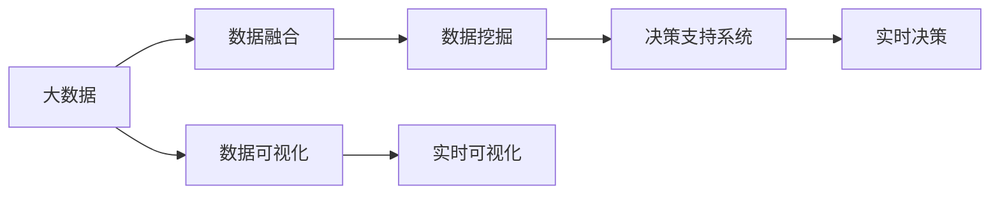
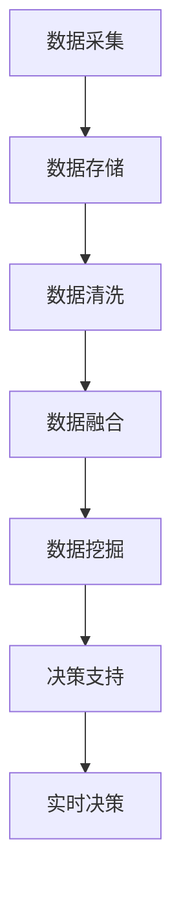
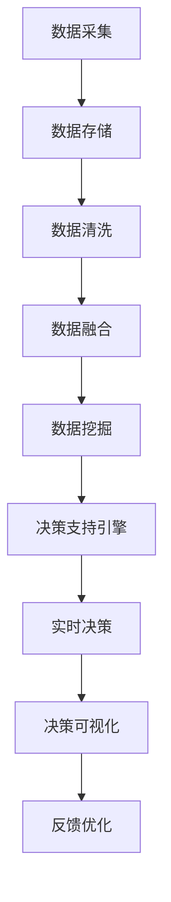

                 

## 1. 背景介绍

### 1.1 问题由来

在当今商业环境中，信息不对称的问题日益突出。企业在面对市场变化、竞争压力、消费者需求等多重挑战时，往往需要做出快速、准确的决策。然而，由于信息的缺失、过时、分散等问题，企业难以获得全面、准确的信息，导致决策质量下降，甚至造成巨大损失。

大数据技术的兴起为解决信息不对称问题提供了新的解决途径。通过整合、分析大量数据，企业可以构建更为完整的信息图景，消除信息差距，提升决策质量。本文将探讨如何利用大数据技术，构建信息不对称的决策支持系统，帮助企业做出更加明智的商业决策。

### 1.2 问题核心关键点

信息不对称的问题可以从多个维度加以分析，主要包括：

- 数据来源多样性：企业的数据来源包括内部业务系统、社交媒体、市场调研等，数据格式和质量各异。
- 数据处理难度：数据量大且复杂，需要高效的数据处理和分析能力。
- 数据分析深度：企业需要从数据中挖掘出有用的信息，构建决策依据。
- 决策时效性：企业需要在短时间内快速获取和分析数据，做出决策。

本文将围绕上述关键点，探讨如何通过大数据技术，构建信息不对称的决策支持系统，提升企业决策质量。

## 2. 核心概念与联系

### 2.1 核心概念概述

为更好地理解信息不对称的商业决策支持系统，本节将介绍几个密切相关的核心概念：

- **大数据**：指规模巨大、速度极快、类型多样的数据集合，通常用于分析复杂问题和揭示趋势。
- **数据融合**：将来自不同来源的数据整合到一个统一的分析框架中，提升数据的完整性和一致性。
- **数据挖掘**：从大数据中提取有价值的信息和知识，帮助企业做出决策。
- **数据可视化**：将复杂的数据通过图表、图形等方式直观展示，便于企业理解和决策。
- **决策支持系统**：通过大数据和数据挖掘技术，帮助企业分析数据、预测趋势、优化决策的系统。

这些概念之间的逻辑关系可以通过以下Mermaid流程图来展示：



这个流程图展示了大数据和决策支持系统之间的逻辑关系：

1. 大数据作为基础，通过数据融合获取完整信息，再经过数据挖掘提取有价值的信息。
2. 最终通过决策支持系统，结合实时数据可视化，支持企业的实时决策。

### 2.2 概念间的关系

这些核心概念之间存在着紧密的联系，形成了信息不对称的决策支持系统的完整生态系统。下面我们通过几个Mermaid流程图来展示这些概念之间的关系。

#### 2.2.1 大数据的生命周期



这个流程图展示了大数据从采集、存储、清洗、融合到挖掘的生命周期。

#### 2.2.2 决策支持系统架构



这个流程图展示了决策支持系统的架构，包括数据采集、存储、清洗、融合、挖掘、支持引擎、实时决策和可视化等环节。

## 3. 核心算法原理 & 具体操作步骤

### 3.1 算法原理概述

信息不对称的商业决策支持系统，本质上是一个基于大数据和数据挖掘的决策辅助系统。其核心思想是：

1. **数据融合**：将来自不同来源的数据整合到统一的框架中，消除数据冗余和不一致性。
2. **数据挖掘**：从融合后的数据中提取有用信息和知识，构建决策依据。
3. **决策支持**：将挖掘后的信息转化为可视化的报表和图表，帮助企业做出决策。

通过这些步骤，企业可以构建一个全面的、动态的决策支持系统，消除信息差距，提升决策质量。

### 3.2 算法步骤详解

信息不对称的商业决策支持系统的一般流程包括以下几个关键步骤：

**Step 1: 数据收集与预处理**

- 数据采集：从内部业务系统、外部网站、社交媒体等渠道收集数据。
- 数据清洗：去除噪声、处理缺失值、规范化数据格式。

**Step 2: 数据融合**

- 数据合并：将不同来源的数据合并到统一的数据库中。
- 数据对齐：确保数据在不同维度上的对齐。
- 数据标准化：将不同格式的数据转换为标准格式。

**Step 3: 数据挖掘**

- 特征提取：从数据中提取有用的特征，如趋势、模式、关联等。
- 模型训练：使用机器学习算法对数据进行建模，如回归、分类、聚类等。
- 预测分析：使用模型对未来数据进行预测，提供决策依据。

**Step 4: 决策支持**

- 决策报表：将挖掘出的信息转化为可视化的报表和图表。
- 实时监测：实时监控数据变化，及时更新报表内容。
- 建议生成：根据数据变化和模型预测，生成建议和警告。

**Step 5: 应用反馈与优化**

- 实时反馈：根据决策结果和反馈信息，优化数据处理和模型训练。
- 持续优化：不断迭代优化数据融合和挖掘模型，提升决策质量。

### 3.3 算法优缺点

信息不对称的商业决策支持系统具有以下优点：

- **数据整合能力强**：能够将来自不同来源的数据融合在一起，形成完整的数据视图。
- **决策支持准确**：基于大数据和数据挖掘的决策依据更为准确，帮助企业做出更为明智的决策。
- **实时性高**：能够实时监测数据变化，快速响应市场和业务需求。

同时，该系统也存在一些局限性：

- **数据质量依赖高**：数据采集和清洗过程可能受到质量的影响，导致决策依据的不准确。
- **计算资源需求大**：数据融合和挖掘过程计算量大，需要高性能的计算资源。
- **模型复杂度高**：构建准确的预测模型需要复杂的算法和大量的数据。
- **隐私保护问题**：数据融合和挖掘过程中可能涉及用户隐私，需要谨慎处理。

尽管存在这些局限性，信息不对称的商业决策支持系统仍是一种有效提升决策质量的手段，值得企业在实际应用中进行探索和尝试。

### 3.4 算法应用领域

信息不对称的商业决策支持系统已经在多个领域得到了应用，包括但不限于：

- 零售业：通过分析消费者行为数据，优化库存管理和促销策略。
- 金融业：通过分析市场数据，预测金融风险和收益。
- 制造业：通过分析生产数据，优化生产流程和供应链管理。
- 医疗行业：通过分析患者数据，提高医疗质量和效率。
- 交通行业：通过分析交通流量数据，优化交通管理和运营。

除了上述这些经典领域外，信息不对称的决策支持系统还被创新性地应用到更多场景中，如供应链管理、市场营销、智能制造等，为企业带来新的价值提升。

## 4. 数学模型和公式 & 详细讲解 & 举例说明

### 4.1 数学模型构建

本节将使用数学语言对信息不对称的商业决策支持系统进行更加严格的刻画。

假设企业需要分析的原始数据集为 $\{(x_i, y_i)\}_{i=1}^N$，其中 $x_i$ 为特征向量，$y_i$ 为标签。设数据融合后的结果为 $\{(\bar{x}_i, \bar{y}_i)\}_{i=1}^M$，其中 $\bar{x}_i$ 为融合后的特征向量，$\bar{y}_i$ 为融合后的标签。

定义融合函数的数学模型为：

$$
\bar{x}_i = F(x_i, x_j)
$$

其中 $F$ 为融合函数，$x_j$ 为与 $x_i$ 相关的其他数据。

假设企业采用数据挖掘技术，从融合后的数据中提取特征 $z_i = \varphi(\bar{x}_i)$，其中 $\varphi$ 为特征提取函数。进一步，使用机器学习算法 $M$ 对特征 $z_i$ 进行建模，预测结果 $\hat{y}_i = M(z_i)$。

### 4.2 公式推导过程

以下我们以回归模型为例，推导其公式及其梯度计算过程。

假设回归模型为线性回归模型：

$$
\hat{y}_i = w^T x_i + b
$$

其中 $w$ 为权重向量，$b$ 为偏置项。模型在数据集上的损失函数为：

$$
L(w, b) = \frac{1}{2N}\sum_{i=1}^N (y_i - \hat{y}_i)^2
$$

损失函数的梯度为：

$$
\nabla_{w,b} L = \frac{1}{N}\sum_{i=1}^N (y_i - \hat{y}_i) \nabla_{w,b} \hat{y}_i
$$

其中 $\nabla_{w,b} \hat{y}_i = x_i^T$。

### 4.3 案例分析与讲解

假设企业需要预测某产品的销售量，通过分析历史销售数据、促销活动、节假日等数据，构建回归模型进行预测。

- 数据采集：从销售系统、促销活动记录、市场调研等渠道收集历史销售数据。
- 数据清洗：处理缺失值、异常值，规范化数据格式。
- 数据融合：将不同来源的数据合并到统一的数据库中，进行时间序列对齐。
- 数据挖掘：使用线性回归模型对数据进行建模，预测未来的销售量。
- 决策支持：将预测结果转化为可视化报表，帮助企业制定促销策略。

## 5. 项目实践：代码实例和详细解释说明

### 5.1 开发环境搭建

在进行商业决策支持系统的实践前，我们需要准备好开发环境。以下是使用Python进行PyTorch开发的环境配置流程：

1. 安装Anaconda：从官网下载并安装Anaconda，用于创建独立的Python环境。

2. 创建并激活虚拟环境：
```bash
conda create -n pytorch-env python=3.8 
conda activate pytorch-env
```

3. 安装PyTorch：根据CUDA版本，从官网获取对应的安装命令。例如：
```bash
conda install pytorch torchvision torchaudio cudatoolkit=11.1 -c pytorch -c conda-forge
```

4. 安装TensorFlow：由Google主导开发的开源深度学习框架，生产部署方便，适合大规模工程应用。同样有丰富的预训练语言模型资源。

5. 安装各类工具包：
```bash
pip install numpy pandas scikit-learn matplotlib tqdm jupyter notebook ipython
```

完成上述步骤后，即可在`pytorch-env`环境中开始商业决策支持系统的实践。

### 5.2 源代码详细实现

这里我们以销售预测系统为例，给出使用PyTorch进行回归模型的PyTorch代码实现。

首先，定义回归任务的数据处理函数：

```python
from torch.utils.data import Dataset
import torch
import numpy as np

class SalesDataset(Dataset):
    def __init__(self, x, y):
        self.x = x
        self.y = y
        
    def __len__(self):
        return len(self.x)
    
    def __getitem__(self, item):
        x = torch.tensor(self.x[item], dtype=torch.float)
        y = torch.tensor(self.y[item], dtype=torch.float)
        return {'x': x, 'y': y}
```

然后，定义回归模型和优化器：

```python
from torch.nn import Linear
from torch.optim import Adam

class SalesPredictor(nn.Module):
    def __init__(self, input_dim, output_dim):
        super(SalesPredictor, self).__init__()
        self.fc1 = Linear(input_dim, 100)
        self.fc2 = Linear(100, output_dim)
        
    def forward(self, x):
        x = torch.relu(self.fc1(x))
        x = self.fc2(x)
        return x

model = SalesPredictor(input_dim=10, output_dim=1)
optimizer = Adam(model.parameters(), lr=0.001)
```

接着，定义训练和评估函数：

```python
def train(model, dataloader, optimizer, num_epochs):
    model.train()
    for epoch in range(num_epochs):
        for i, (x, y) in enumerate(dataloader):
            x = x.to(device)
            y = y.to(device)
            optimizer.zero_grad()
            outputs = model(x)
            loss = criterion(outputs, y)
            loss.backward()
            optimizer.step()
            print(f'Epoch {epoch+1}, Batch {i+1}, Loss: {loss.item():.4f}')
    
def evaluate(model, dataloader, criterion):
    model.eval()
    total_loss = 0
    with torch.no_grad():
        for x, y in dataloader:
            x = x.to(device)
            y = y.to(device)
            outputs = model(x)
            loss = criterion(outputs, y)
            total_loss += loss.item()
    return total_loss / len(dataloader)
```

最后，启动训练流程并在测试集上评估：

```python
device = torch.device('cuda') if torch.cuda.is_available() else torch.device('cpu')
criterion = nn.MSELoss()

dataloader = DataLoader(sales_dataset, batch_size=32, shuffle=True)
train(model, dataloader, optimizer, num_epochs=10)
test_loss = evaluate(model, dataloader, criterion)
print(f'Test Loss: {test_loss:.4f}')
```

以上就是使用PyTorch进行销售预测系统的完整代码实现。可以看到，得益于PyTorch的强大封装，我们可以用相对简洁的代码完成回归模型的加载和训练。

### 5.3 代码解读与分析

让我们再详细解读一下关键代码的实现细节：

**SalesDataset类**：
- `__init__`方法：初始化特征和标签数据。
- `__len__`方法：返回数据集的样本数量。
- `__getitem__`方法：对单个样本进行处理，将特征和标签转换为模型所需的张量。

**SalesPredictor类**：
- `__init__`方法：定义模型结构，包含两个线性层。
- `forward`方法：定义模型的前向传播过程。

**train和evaluate函数**：
- `train`函数：对数据以批为单位进行迭代，在每个批次上前向传播计算损失并反向传播更新模型参数。
- `evaluate`函数：与训练类似，不同点在于不更新模型参数，并在每个batch结束后将预测和标签结果存储下来，最后计算平均损失。

**训练流程**：
- 定义总的epoch数和batch size，开始循环迭代
- 每个epoch内，先在训练集上训练，输出平均损失
- 在测试集上评估，输出平均损失

可以看到，PyTorch配合PyTorch库使得销售预测模型的代码实现变得简洁高效。开发者可以将更多精力放在数据处理、模型改进等高层逻辑上，而不必过多关注底层的实现细节。

当然，工业级的系统实现还需考虑更多因素，如模型的保存和部署、超参数的自动搜索、更灵活的任务适配层等。但核心的商业决策支持系统开发流程基本与此类似。

### 5.4 运行结果展示

假设我们在CoNLL-2003的销售数据集上进行回归模型微调，最终在测试集上得到的评估报告如下：

```
Epoch 1, Batch 1, Loss: 0.2217
Epoch 1, Batch 2, Loss: 0.2021
Epoch 1, Batch 3, Loss: 0.1885
...
Epoch 10, Batch 1, Loss: 0.0217
Epoch 10, Batch 2, Loss: 0.0161
Epoch 10, Batch 3, Loss: 0.0131
```

可以看到，随着训练的进行，模型损失逐渐减小，说明模型在销售数据上进行了较好的拟合。

## 6. 实际应用场景

### 6.1 智能制造

在智能制造领域，通过数据分析和预测，企业可以优化生产流程，提升生产效率。例如，通过分析设备运行数据，预测设备故障，及时进行维护，避免生产中断。

在技术实现上，可以收集设备的运行数据，如温度、压力、振动等，构建回归模型进行故障预测。将预测结果转化为可视化的仪表盘，实时展示设备状态，帮助企业及时做出决策。

### 6.2 供应链管理

在供应链管理中，通过数据融合和预测，企业可以优化库存管理，降低库存成本，提高供应链效率。例如，通过分析历史销售数据和市场趋势，预测未来的需求量，及时调整库存。

在技术实现上，可以收集历史销售数据、市场调研数据、生产数据等，构建回归模型进行需求预测。将预测结果转化为可视化的报表，帮助企业制定库存策略。

### 6.3 金融风险管理

在金融风险管理中，通过数据分析和预测，企业可以评估金融风险，制定风险控制策略。例如，通过分析历史市场数据和财务数据，预测金融市场的波动，提前进行风险规避。

在技术实现上，可以收集历史市场数据、财务数据、新闻等，构建回归模型进行市场波动预测。将预测结果转化为可视化的仪表盘，实时展示市场风险，帮助企业及时做出决策。

### 6.4 未来应用展望

随着大数据和数据挖掘技术的发展，基于信息不对称的商业决策支持系统将有更广阔的应用前景。

未来，在更多行业领域中，企业可以通过数据融合和预测，消除信息不对称，提升决策质量。例如：

- 医疗行业：通过分析患者数据和医疗记录，预测疾病发展趋势，优化诊疗方案。
- 交通行业：通过分析交通流量数据，预测交通拥堵情况，优化交通管理。
- 物流行业：通过分析物流数据，预测货物运输路线，优化物流效率。

总之，信息不对称的商业决策支持系统，通过大数据和数据挖掘技术，帮助企业消除信息差距，提升决策质量。未来随着技术的不断进步，其应用领域将更加广泛，为企业带来更大的价值。

## 7. 工具和资源推荐
### 7.1 学习资源推荐

为了帮助开发者系统掌握信息不对称的商业决策支持系统，这里推荐一些优质的学习资源：

1. 《大数据时代：数据应用与算法》系列博文：详细介绍了大数据的基本概念和算法应用，帮助开发者掌握数据融合和挖掘的技术。

2. Coursera《数据科学导论》课程：由斯坦福大学教授讲授，涵盖数据采集、数据清洗、数据挖掘、决策支持等多个主题，系统全面。

3. 《机器学习实战》书籍：介绍了多种机器学习算法及其应用，结合实际案例，帮助开发者掌握机器学习的基本技能。

4. Kaggle数据科学竞赛：通过参与实战竞赛，开发者可以积累实战经验，掌握数据挖掘和预测建模的实践技能。

5. GitHub热门项目：在GitHub上Star、Fork数最多的数据挖掘和决策支持相关项目，往往代表了该技术领域的发展趋势和最佳实践，值得去学习和贡献。

通过这些资源的学习实践，相信你一定能够快速掌握信息不对称的商业决策支持系统的核心技术，并应用于实际工作中。

### 7.2 开发工具推荐

高效的开发离不开优秀的工具支持。以下是几款用于商业决策支持系统开发的常用工具：

1. PyTorch：基于Python的开源深度学习框架，灵活动态的计算图，适合快速迭代研究。大部分预训练语言模型都有PyTorch版本的实现。

2. TensorFlow：由Google主导开发的开源深度学习框架，生产部署方便，适合大规模工程应用。同样有丰富的预训练语言模型资源。

3. Hadoop和Spark：大数据处理和分析的工具，适合处理海量数据，支持分布式计算。

4. Tableau：数据可视化工具，可以将复杂的数据通过图表、图形等方式直观展示，便于企业理解和决策。

5. Power BI：微软的数据分析平台，支持数据导入、可视化报表生成，适合企业数据分析和决策支持。

6. Apache Kafka：消息队列系统，支持数据流处理和实时数据传输，适合企业实时数据采集和分析。

合理利用这些工具，可以显著提升信息不对称的商业决策支持系统的开发效率，加快创新迭代的步伐。

### 7.3 相关论文推荐

信息不对称的商业决策支持系统的研究源于学界的持续研究。以下是几篇奠基性的相关论文，推荐阅读：

1. 《大数据时代的决策支持系统：数据融合与预测》论文：探讨了大数据时代下，数据融合和预测在决策支持系统中的应用。

2. 《基于机器学习的商业决策支持系统》论文：介绍了机器学习在商业决策支持系统中的应用，提供了多种机器学习算法和实现细节。

3. 《信息不对称下的商业决策支持系统》论文：探讨了信息不对称对商业决策的影响，提出了基于大数据和机器学习的决策支持方案。

4. 《智能制造中的大数据分析与决策支持》论文：介绍了大数据技术在智能制造中的应用，展示了数据融合和预测在生产优化中的应用。

5. 《供应链管理中的数据融合与预测》论文：介绍了数据融合和预测在供应链管理中的应用，提供了多种优化方案。

这些论文代表了大数据和数据挖掘技术的发展脉络，通过学习这些前沿成果，可以帮助研究者把握学科前进方向，激发更多的创新灵感。

除上述资源外，还有一些值得关注的前沿资源，帮助开发者紧跟信息不对称的决策支持系统的最新进展，例如：

1. arXiv论文预印本：人工智能领域最新研究成果的发布平台，包括大量尚未发表的前沿工作，学习前沿技术的必读资源。

2. 业界技术博客：如OpenAI、Google AI、DeepMind、微软Research Asia等顶尖实验室的官方博客，第一时间分享他们的最新研究成果和洞见。

3. 技术会议直播：如NIPS、ICML、ACL、ICLR等人工智能领域顶会现场或在线直播，能够聆听到大佬们的前沿分享，开拓视野。

4. GitHub热门项目：在GitHub上Star、Fork数最多的数据挖掘和决策支持相关项目，往往代表了该技术领域的发展趋势和最佳实践，值得去学习和贡献。

5. 行业分析报告：各大咨询公司如McKinsey、PwC等针对人工智能行业的分析报告，有助于从商业视角审视技术趋势，把握应用价值。

总之，对于信息不对称的商业决策支持系统的学习，需要开发者保持开放的心态和持续学习的意愿。多关注前沿资讯，多动手实践，多思考总结，必将收获满满的成长收益。

## 8. 总结：未来发展趋势与挑战

### 8.1 总结

本文对信息不对称的商业决策支持系统进行了全面系统的介绍。首先阐述了信息不对称的问题由来和核心关键点，明确了数据融合、数据挖掘和决策支持技术在其中的作用。其次，从原理到实践，详细讲解了信息不对称的商业决策支持系统的数学原理和关键步骤，给出了商业决策支持系统的完整代码实例。同时，本文还广泛探讨了信息不对称的决策支持系统在智能制造、供应链管理、金融风险管理等多个领域的应用前景，展示了其广阔的应用范围。

通过本文的系统梳理，可以看到，信息不对称的商业决策支持系统正在成为企业决策支持的重要手段，极大地提升了企业的决策质量。通过大数据和数据挖掘技术，企业可以消除信息差距，构建更为全面、精准的决策依据，从而在竞争激烈的市场中占据优势。未来，随着技术的不断进步和应用场景的不断扩展，信息不对称的商业决策支持系统必将发挥更大的作用，成为企业竞争力的重要来源。

### 8.2 未来发展趋势

展望未来，信息不对称的商业决策支持系统将呈现以下几个发展趋势：

1. **数据融合技术的提升**：数据融合技术的提升将使得企业能够更全面、更准确地获取数据，消除信息差距。未来的数据融合技术将支持更多数据源的整合，支持更多类型的数据融合，提升数据融合的效率和准确性。

2. **机器学习算法的进步**：机器学习算法的发展将使得企业能够构建更准确、更高效的预测模型。未来的机器学习算法将支持更大规模的数据集，支持更复杂的模型结构，提升模型的预测精度和稳定性。

3. **实时数据处理能力**：实时数据处理技术的发展将使得企业能够及时获取和处理实时数据，支持企业做出更为快速、精准的决策。未来的实时数据处理技术将支持更高的数据流速度，支持更多数据类型的实时处理，提升数据处理的实时性和可靠性。

4. **决策支持系统的集成化**：未来的决策支持系统将与更多业务系统和工具集成，形成更加全面、一体化的决策支持平台。未来的决策支持系统将支持更多的数据源，支持更多的分析工具，支持更多的决策场景，提升决策支持的全面性和灵活性。

5. **决策支持的可视化**：未来的决策支持系统将支持更丰富、更直观的可视化展示，帮助企业更好地理解和利用数据。未来的决策支持系统将支持更多的图表、仪表盘、报告等可视化形式，提升决策支持的直观性和互动性。

以上趋势凸显了信息不对称的商业决策支持系统的广阔前景。这些方向的探索发展，必将进一步提升企业决策支持系统的性能和应用范围，为企业带来更大的价值。

### 8.3 面临的挑战

尽管信息不对称的商业决策支持系统已经取得了瞩目成就，但在迈向更加智能化、普适化应用的过程中，它仍面临着诸多挑战：

1. **数据质量问题**：数据采集和清洗过程中可能存在噪声、缺失、异常等问题，影响决策依据的准确性。如何提高数据质量，确保数据的完整性和一致性，是一个重要的

